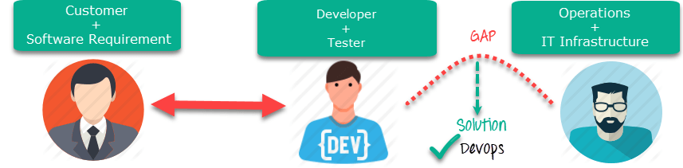

# Contributing to the Turing Data Safe Haven project

**Welcome to the Turing Data Safe Haven project repository!**

Thank you for being here and contributing to the project.
It can truly only succeed with a interdisiplinary team working together.

The point of these contributing guidelines are to help you participate as easily as possible.
If you have any questions that aren't discussed below, please let us know by [opening an issue](#project-management-through-issues).

## Table of contents

Been here before?
Already know what you're looking for in this guide?
Jump to the following sections:

* [A DevOps development philosophy](#a-devops-development-philosophy)
  * [Project workflow](#project-workflow)
  * [Project meetings](#project-meetings)
  * [Communications within the team and asking for help](#communications-within-the-team-and-asking-for-help)
* [Contributing through GitHub](#contributing-through-github)
  * [Writing in markdown](#writing-in-markdown)
  * [Project management through issues](#project-management-through-issues)
  * [Issues as conversations](#issues-as-conversations)
  * [Capturing knowledge in the GitHub wiki](#capturing-knowledge-in-the-github-wiki)
  * [Working in a private repository](#working-in-a-private-repository)
  * [Who's involved in the project](#Whos-involved-in-the-project)
  * [Make a change with a pull request](#making-a-change-with-a-pull-request)

## A DevOps development philosophy
For the Data Safe Haven project, we follow a DevOps development philosophy.
This means different things to different people, but the definition that we're using is [best summed up here](https://www.guru99.com/agile-vs-devops.html).

This is a software development method which focuses on:

* communication
* integration
* collaboration

between the development team and the operations team to enable rapid deployment of products. The most pertinent features of the DevOps methodology for this project are:

* **focus**: operational readiness
* **structure**: separate development and operations teams
* **duration**: benchmarks around stable releases
* **emphasis**: taking software which is ready for release and deploying it in a reliable and secure manner
* **documentation**: documenting processes is a key part of the development cycle
* **automation**: maximal automation is the primary goal
* **quality**: full integration testing each time features are added

### Project workflow
Although we are not following an Agile workflow, we still think that the following features are important:

* No work that is not **documented in an issue** on GitHub
* All policy documents, guidelines, tutorials, code and its documentation to be **stored and maintained in this GitHub repository**
* Issues to be triaged at regular **project meetings** with the next milestone release in mind

### Project meetings
The goal of the project meetings is to **reflect** on how ongoing work is proceeding and to **plan** the next section of work.
During the project meetings we'll start by working through the [issues list][safehaven-issues] and discussing all the issues that are marked as [in progress][labels-in-progress] .
We will consider whether we should start work on any issues marked as [on hold][labels-on-hold].

Note that the project meeting is very explicitly **not** where the work gets done.
It is a review, reflection and an opportunity to set goals.
Discussions around particular tasks should be conducted **when the work is being carried out** not in the meeting.

### Communications within the team and asking for help
As this team is distributed, not working full-time on this project and often working asynchronously, we do not have any form of daily meeting or stand-up
The best way to work around this absense is to **commit to sharing updates as regularly as possible**.
Please see the section on [project management through issues](#project-management-through-issues) below on how to do this via GitHub.

***If each individual team member asks themselves the three questions (what did I did, what will I do, what is blocking me) and updates their assigned issues with the answers we will likely make good progress in the absense of daily meetings.***

## Contributing through GitHub
[git][git] is a really useful tool for version control. [GitHub][github] sits on top of git and supports collaborative and distributed working.

We know that it can be daunting to start using `git` and `GitHub` if you haven't worked with them in the past, but the Turing Research Engineering Team are happy to help you figure out any of the jargon or confusing instructions you encounter! :heart:

In order to contribute via GitHub you'll need to set up a free account and sign in. Here are some [instructions][github-newaccount] to help you get going.

### Writing in markdown
GitHub has a helpful page on [getting started with writing and formatting on GitHub][github-markdownhelp].

Most of the writing that you'll do will be in [Markdown][markdown]. You can think of Markdown as a few little symbols around your text that will allow GitHub to render the text with a little bit of formatting.
For example you could write words as bold (`**bold**`), or in italics (`*italics*`), or as a [link][rick-roll] (`[link](https://https://youtu.be/dQw4w9WgXcQ)`) to another webpage.

`GitHub` issues render markdown really nicely.
The goal is to allow you to focus on the content rather than worry too much about how things are laid out!

### Project management through issues
Please regularly check out the agreed upon tasks at the [issues list][safehaven-issues].
Every issue should have labels assigned to it from the following scheme.
These can change over time, but at least one from each category `actions`, `affected`, `component`, `severity` and `topic` should be assigned to each issue.

| Category         | Labels |
|:----------------:|:------:|
|                  |  |
| actions          |   |
|                  |    |
| affected         |   |
|                  |   |
|                  |    |
|                  |    |
| component        |    |
|                  |    |
|                  |    |
|                  |  |
| severity         |   |
|                  |   |
|                  |    |
| topic            |    |
|                  |   |

If you have an idea for a piece of work to complete, please **open an issue**.
If you have been assigned an issue, please be ready to explain in the [project meeting](#project-meetings) what your progress has been.
In a perfect world you'll have completed the task, documented everything you need to and we'll be able to **close** the issue (to mark it as complete).

### Issues as conversations
The name `issue` comes from a concept of catching errors (bugs :bug:) in software, but for this project they are simply our **tasks**.
They should be concrete enough to be done in a week or so.
If an issue is growing to encompass more than one task, consider breaking it into multiple issues.

You can think of the issues as **conversations** about a particular topic.
GitHub's tagline is **social coding** and the issues are inspired by social media conversations.

You can [mention a user][github-mentionuser] by putting `@` infront of their github id.
For example, `@KirstieJane` will send a notification to Kirstie Whitaker so she knows to visit the issue and (for example) reply to your question.

Alternatively (and this is encouraged) you can use the issue to keep track of where you're up to with the task and add information about next steps and barriers.

<!-- ### Capturing knowledge in the GitHub wiki
Contributing on GitHub can be a little intimidating (see [making a change with a pull request](#making-a-change-with-a-pull-request) below.
What's great about the wiki is that you only need to be logged in to GitHub to edit it.

Here's a useful [introduction to GitHub wikis][intro-github-wiki].

To calm your nerves, the wiki is *itself* a git repository in the background and therefore it is versioned and (in that sense) backed up.
**You can't totally erase anyone's work in the wiki** so please don't feel nervous about refining and adding your work to an already existing document.

Your work does not need to be perfect and we encourage you to remember the premise behind the [Bus Factor][bus-factor]: a measurement of the risk resulting from information and capabilities not being shared among team members, from the phrase "in case they get hit by a bus".

***If you have thought about something, reviewed some work, worried about a potential problem, or come up with a potential solution it should be WRITTEN DOWN IN THE WIKI to give the project resilience and to prevent us from reinventing the wheel.*** -->

### Working in a private repository
As one of the goals of this project is to build a secure infrastructure for data storage and analysis, our project will very likely include some code with security vulnerabilities! Therefore we're keeping the repository private until we're confident that our work is secure.

Please note that the plan is to make the contents of this repository openly available sometime in 2020. Please be considerate of the content you add and use professional and inclusive language at all times.

As we're working in a private repository you may not be able to see the repository if you aren't signed in.
So if you see a 404 page and you're confident you have the correct url, go back to [github.com](https://github.com) to make sure that you're signed into your account.

### Who's involved in the project
The private repositories in the Alan Turing Institute [GitHub organisation](https://github.com/alan-turing-institute) are set such that only named collaborators can see the work we do.
(Another option for private repositories is to allow all members of the organisation but *not* public members to see all projects owned by the organisation.)
Therefore it is sometimes nice to know **who** you're working with on the project (which is oddly difficult to do if you aren't an administrator on the project!)

(Additionally some users have GitHub IDs that make it a little difficult to know who they are in real life! Hopefully this table will help you put names to faces and IDs :sparkles:)

The following people have access to the project:

| Name               | GitHub ID | Email |
| ------------------ | --- | --- |
| Diego Arenas       | [@darenasc](https://github.com/darenasc)| <darenasc@gmail.com> |
| Jonathan Atkins    | [@jon-atkins](https://github.com/jon-atkins)| <jatkins@turing.ac.uk> |
| Ayman Boustati     | [@aboustati](https://github.com/aboustati)| <aboustati@turing.ac.uk> |
| Ian Carter         | [@getcarter21](https://github.com/getcarter21)| <icarter@turing.ac.uk> |
| Rob Clarke         | [@RobC-CTL](https://github.com/RobC-CTL)| <rob.clarke@coriniumtech.com> |
| Giovanni Colavizza | [@Giovanni1085](https://github.com/Giovanni1085)| <gcolavizza@turing.ac.uk> |
| Christine Foster   | [@ChristineFoster](https://github.com/ChristineFoster)| <cfoster@turing.ac.uk> |
| Evelina Gabasova   | [@evelinag](https://github.com/evelinag)| <egabasova@turing.ac.uk> |
| James Geddes       | [@triangle-man](https://github.com/triangle-man)| <jgeddes@turing.ac.uk> |
| Andreas Grammenos  | [@andylamp](https://github.com/andylamp) | <axor@turing.ac.uk> |
| Nicolas Guernion   | | <nguernion@turing.ac.uk> |
| James Hetherington | [@jamespjh](https://github.com/jamespjh) | <jhetherington@turing.ac.uk> |
| Franz Kiraly       | [@fkiraly](https://github.com/fkiraly)| <fkiraly@turing.ac.uk> |
| Catherine Lawrence | [@cathiest](https://github.com/cathiest) | <clawrence@turing.ac.uk> |
| Martin O'Reilly    | [@martintoreilly](https://github.com/martintoreilly)| <moreilly@turing.ac.uk> |
| Kenji Takeda       | [@ktakeda1](https://github.com/ktakeda1)| <ktakeda@turing.ac.uk> |
| Sebastian Vollmer  | [@vollmersj](https://github.com/vollmersj)| <svollmer@turing.ac.uk> |
| Kirstie Whitaker   | [@KirstieJane](https://github.com/KirstieJane)| <kwhitaker@turing.ac.uk> |
| James Robinson     | [@jemrobinson](https://github.com/jemrobinson) | <jrobinson@turing.ac.uk> |

### Making a change with a pull request
To contribute to the codebase you'll need to submit a **pull request**.

If you're updating the code or other documents in the main repository, the following steps are a guide to help you contribute in a way that will be easy for everyone to review and accept with ease  :sunglasses:.

#### 1. Make sure there is an issue for this that is clear about what work you're going to do
This allows other members of the Data Safe Haven project team to confirm that you aren't overlapping with work that's currently underway and that everyone is on the same page with the goal of the work you're going to carry out.

[This blog][dont-push-pull-request] is a nice explanation of why putting this work in up front is so useful to everyone involved.

#### 2. [Fork][github-fork] the [Data Safe Haven repository][safehaven-repo] to your profile
This is now your own unique copy of the Data Safe Haven repository. Changes here won't affect anyone else's work, so it's a safe space to explore edits to the code or documentation!
Make sure to [keep your fork up to date][github-syncfork] with the master repository, otherwise you can end up with lots of dreaded [merge conflicts][github-mergeconflicts].

#### 3. Make the changes you've discussed
Try to keep the changes focused. If you submit a large amount of work in all in one go it will be much more work for whomever is reviewing your pull request. [Help them help you][jerry-maguire] :wink:
If you feel tempted to "branch out" then please make a [new branch][github-branches] and a [new issue][safehaven-issues] to go with it.

#### 4. Submit a [pull request][github-pullrequest]
A member of the Safe Haven project team will review your changes to confirm that they can be merged into the main codebase.

A [review][github-review] will probably consist of a few questions to help clarify the work you've done. Keep an eye on your github notifications and be prepared to join in that conversation.

You can update your [fork][github-fork] of the data safe haven [repository][safehaven-repo] and the pull request will automatically update with those changes. **You don't need to submit a new pull request when you make a change in response to a review.**

GitHub has a [nice introduction][github-flow] to the pull request workflow, but please [get in touch](#get-in-touch) if you have any questions :balloon:.

## Thank you!
You're awesome. :wave::smiley:

 

*&mdash; Based on contributing guidelines from the [BIDS Starter Kit][bids-starterkit-repo] project. Reused under the CC-BY license.*

[bids-starterkit-repo]: https://github.com/INCF/bids-starter-kit
[bus-factor]: https://en.wikipedia.org/wiki/Bus_factor
[dont-push-pull-request]: https://www.igvita.com/2011/12/19/dont-push-your-pull-requests
[git]: https://git-scm.com
[github]: https://github.com
[github-newaccount]: https://help.github.com/articles/signing-up-for-a-new-github-account/
[github-branches]: https://help.github.com/articles/creating-and-deleting-branches-within-your-repository
[github-fork]: https://help.github.com/articles/fork-a-repo
[github-flow]: https://guides.github.com/introduction/flow
[github-markdownhelp]: https://help.github.com/articles/getting-started-with-writing-and-formatting-on-github
[github-mentionuser]: https://help.github.com/articles/basic-writing-and-formatting-syntax/#mentioning-people-and-teams
[github-mergeconflicts]: https://help.github.com/articles/about-merge-conflicts
[github-pullrequest]: https://help.github.com/articles/creating-a-pull-request
[github-review]: https://help.github.com/articles/about-pull-request-reviews
[github-syncfork]: https://help.github.com/articles/syncing-a-fork
[intro-github-wiki]: https://help.github.com/articles/about-github-wikis
[labels-sprint1]: https://github.com/alan-turing-institute/data-safe-haven/labels/Sprint1
[labels-sprint2]: https://github.com/alan-turing-institute/data-safe-haven/labels/Sprint2
[labels-sprint3]: https://github.com/alan-turing-institute/data-safe-haven/labels/Sprint3
[labels-in-progress]: https://github.com/alan-turing-institute/data-safe-haven/labels/action:%20in%20progress
[labels-on-hold]: https://github.com/alan-turing-institute/data-safe-haven/labels/action:%20on%20hold
[labels-sprint5]: https://github.com/alan-turing-institute/data-safe-haven/labels/Sprint5
[jerry-maguire]: https://media.giphy.com/media/uRb2p09vY8lEs/giphy.gif
[markdown]: https://daringfireball.net/projects/markdown
[neurostars-forum]: https://neurostars.org/tags/bids
[patrick-github]: https://github.com/Park-Patrick
[rick-roll]: https://www.youtube.com/watch?v=dQw4w9WgXcQ
[safehaven-issues]: https://github.com/alan-turing-institute/data-safe-haven/issues
[safehaven-labels]: https://github.com/alan-turing-institute/data-safe-haven/labels
[safehaven-repo]: https://github.com/alan-turing-institute/data-safe-haven
[safehaven-wiki]: https://github.com/alan-turing-institute/data-safe-haven/wiki
[scrum-dailyscrum]: https://en.wikipedia.org/wiki/Scrum_(software_development)#Daily_Scrum
