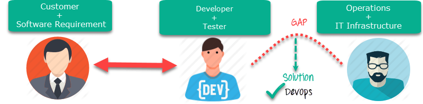

# Contributing to the Turing Data Safe Haven project

**Welcome to the Turing Data Safe Haven project repository!**

Thank you for being here and contributing to the project.
It can truly only succeed with a interdisciplinary team working together.

The point of these contributing guidelines are to help you participate as easily as possible.
If you have any questions that aren't discussed below, please let us know by [opening an issue](#project-management-through-issues).

## A DevOps development philosophy

For the Data Safe Haven project, we follow a DevOps development philosophy.
This means different things to different people, but the definition that we're using is [best summed up here](https://www.guru99.com/agile-vs-devops.html).

<p align="center">
   
</p>

This is a software development method which focuses on:

- communication
- integration
- collaboration

between the development team and the operations team to enable rapid deployment of products.
The most pertinent features of the DevOps methodology for this project are:

- **focus**: operational readiness
- **structure**: separate development and operations teams
- **duration**: benchmarks around stable releases
- **emphasis**: taking software which is ready for release and deploying it in a reliable and secure manner
- **documentation**: documenting processes is a key part of the development cycle
- **automation**: maximal automation is the primary goal
- **quality**: full integration testing each time features are added

## Project workflow

Although we are not following an Agile workflow, we still think that the following features are important:

- No work that is not **documented in an issue** on GitHub
- All policy documents, guidelines, tutorials, code and its documentation to be **stored and maintained in this GitHub repository**
- Issues to be triaged at regular **project meetings** with the next milestone release in mind

### Project meetings

The goal of the project meetings is to **reflect** on how ongoing work is proceeding and to **plan** the next section of work.
During the project meetings we'll start by working through the [issues list](https://github.com/alan-turing-institute/data-safe-haven/issues) and discussing any issues that are in progress.
We will consider whether we should start work on any issues from the backlog.

Note that the project meeting is very explicitly **not** where the work gets done.
It is a review, reflection and an opportunity to set goals.
Discussions around particular tasks should be conducted **when the work is being carried out** not in the meeting.

### Communications within the team and asking for help

As this team is distributed, not working full-time on this project and often working asynchronously, we do not have any form of daily meeting or stand-up.
The best way to work around this absence is to **commit to sharing updates as regularly as possible**.
Please see the section on [project management through issues](#project-management-through-issues) below on how to do this via GitHub.

## Contributing through GitHub

We use the [Gitflow Workflow](https://www.atlassian.com/git/tutorials/comparing-workflows/gitflow-workflow).

<p align="center">
   
</p>

This means that:

- checking out the `latest` branch, will give you the latest tagged release
- the `develop` branch, which is the default branch of the repository, contains the latest cutting-edge code that has not yet made it into a release
- we prefer to use [merge commits](https://docs.github.com/en/repositories/configuring-branches-and-merges-in-your-repository/configuring-pull-request-merges/about-merge-methods-on-github) in order to avoid rewriting the git history

### Issues as conversations

If you have an idea for a piece of work to complete, please **open an issue**.

The name `issue` comes from a concept of catching errors (bugs :bug:) in software, but for this project they are simply our **tasks**.
If an issue is growing to encompass more than one task, consider breaking it into multiple issues.

You can think of the issues as **conversations** about a particular topic.
`GitHub`'s tagline is **social coding** and the issues are inspired by social media conversations.
Alternatively (and this is encouraged) you can use the issue to keep track of where you're up to with the task and add information about next steps and barriers.

### Discussions vs Issues

**Discussions** are the best place for informal talk about the project
You should feel welcome to create a discussion on any relevant topic, without the formality of an issue.
Good examples of discussions are:

- Any questions
- Possible bugs (does anyone else have this problem?)
- Looking for collaborators
- Community support

**Issues** are best used for tracking development work.
This is because issues integrate well with GitHub development tools like projects, pull requests, assignments and so on.
Each issue should ideally represent a well-defined, self-contained piece of work suitable to become a single pull request.
Good examples of issues are

- Bug reports with technical detail
- Feature requests
- Specific ideas for changes

When opening an issue, pick a suitable template (if possible) to make the process easier.

### Project management through issues

Please regularly check out the agreed upon tasks at the [issues list](https://github.com/alan-turing-institute/data-safe-haven/issues).
Issues should be tagged with an appropriate [label](https://github.com/alan-turing-institute/data-safe-haven/issues/labels) by a member of the development team.
Each issue should be assigned to an appropriate [milestone](https://github.com/alan-turing-institute/data-safe-haven/milestones).

If you have been assigned an issue, please be ready to explain in the [project meeting](#project-meetings) what your progress has been.
In a perfect world you'll have completed the task, documented everything you need to and we'll be able to **close** the issue (to mark it as complete).

## Contributing your changes

### Making a change with a pull request

To contribute to the codebase you'll need to:

- [fork the repository](https://docs.github.com/en/get-started/quickstart/fork-a-repo) to your own GitHub profile
- make your changes [on a branch](https://docs.github.com/en/pull-requests/collaborating-with-pull-requests/proposing-changes-to-your-work-with-pull-requests/creating-and-deleting-branches-within-your-repository)
- submit a [pull request](https://docs.github.com/en/get-started/quickstart/github-flow)

### Making a change to the documentation

The docs, including for older releases, are available [here](https://data-safe-haven.readthedocs.io).
You should follow the same instructions as above to [make a change with a pull request](#making-a-change-with-a-pull-request) when editing the documentation.

The documentation is built from Markdown files using [Sphinx](https://www.sphinx-doc.org/) and [MyST parser](https://myst-parser.readthedocs.io/).
To preview your changes, you can build the docs locally with `hatch`:

```console
> hatch run docs:build
```

- The generated documents will be placed under `build/html/`.
- To view the documents open `build/html/index.html` in your browser, for example:

```console
> firefox build/html/index.html
```

## Preparing a new release

Releases are made by branching from `develop` into a branch called `release-<version name>`

- deployment is tested from this release and any necessary integration changes are made on this branch
- the branch is then merged into `latest` (which is tagged) as the next release **and** into `develop` so that any fixes are included there

The release can then be published to PyPI:

- Build the tarball and wheel

```console
> hatch run build
```

- Upload to PyPI, providing your API token at the prompt

```console
> hatch run publish --user __token__
```

## Who's involved in the project

Take a look at the full list of contributors on our [README](README.md).

### Adding new contributors

We use @all-contributors to maintain the contributor list on the README, however we do not use the GitHub bot.

You should follow the same instructions as above to [make a change with a pull request](#making-a-change-with-a-pull-request) when adding a new contributor.

To add new contributor to the README table, see the [all-contributors CLI documentation](https://allcontributors.org/docs/en/cli/overview) and use the CLI to add the new contributor, then make a pull request with your changes.

## Get in touch

You can get in touch with the development team at safehavendevs@turing.ac.uk.

**Thank you!**

You're awesome! :wave::smiley:

_Based on contributing guidelines from the [BIDS Starter Kit](https://github.com/INCF/bids-starter-kit) project. Reused under the CC-BY license._
