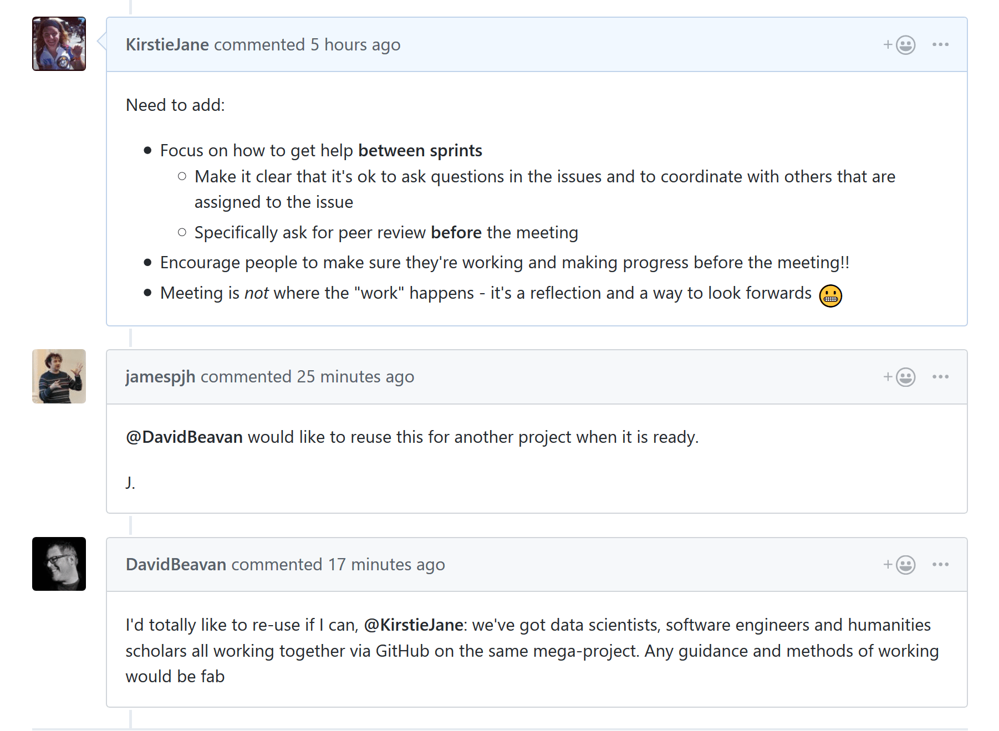

# Contributing to the Turing Data Safe Haven project

**Welcome to the Turing Data Safe Haven project repository!**

Thank you for being here and contributing to the project.
It can truly only succeed with a interdisciplinary team working together.

The point of these contributing guidelines are to help you participate as easily as possible.
If you have any questions that aren't discussed below, please let us know by [opening an issue](#project-management-through-issues).

## Contents

Been here before?
Already know what you're looking for in this guide?
Jump to the following sections:

- [A DevOps development philosophy](#a-devops-development-philosophy)
    - [Project workflow](#project-workflow)
    - [Project meetings](#project-meetings)
    - [Communications within the team and asking for help](#communications-within-the-team-and-asking-for-help)
- [Contributing through GitHub](#contributing-through-github)
    - [Discussions vs Issues](#discussions-vs-issues)
    - [Writing in markdown](#writing-in-markdown)
    - [Project management through issues](#project-management-through-issues)
    - [Issues as conversations](#issues-as-conversations)
    - [Working in a private repository](#working-in-a-private-repository)
    - [Who's involved in the project](#whos-involved-in-the-project)
    - [Make a change with a pull request](#making-a-change-with-a-pull-request)
    - [Make a change to the documentation](#making-a-change-to-the-documentation)

## A DevOps development philosophy

For the Data Safe Haven project, we follow a DevOps development philosophy.
This means different things to different people, but the definition that we're using is [best summed up here](https://www.guru99.com/agile-vs-devops.html).

<p align="center">
   
</p>

This is a software development method which focuses on:

- communication
- integration
- collaboration

between the development team and the operations team to enable rapid deployment of products.
The most pertinent features of the DevOps methodology for this project are:

- **focus**: operational readiness
- **structure**: separate development and operations teams
- **duration**: benchmarks around stable releases
- **emphasis**: taking software which is ready for release and deploying it in a reliable and secure manner
- **documentation**: documenting processes is a key part of the development cycle
- **automation**: maximal automation is the primary goal
- **quality**: full integration testing each time features are added

### Project workflow

Although we are not following an Agile workflow, we still think that the following features are important:

- No work that is not **documented in an issue** on GitHub
- All policy documents, guidelines, tutorials, code and its documentation to be **stored and maintained in this GitHub repository**
- Issues to be triaged at regular **project meetings** with the next milestone release in mind

### Project meetings

The goal of the project meetings is to **reflect** on how ongoing work is proceeding and to **plan** the next section of work.
During the project meetings we'll start by working through the [issues list](https://github.com/alan-turing-institute/data-safe-haven/issues) and discussing any issues that are in progress.
We will consider whether we should start work on any issues from the backlog.

Note that the project meeting is very explicitly **not** where the work gets done.
It is a review, reflection and an opportunity to set goals.
Discussions around particular tasks should be conducted **when the work is being carried out** not in the meeting.

### Communications within the team and asking for help

As this team is distributed, not working full-time on this project and often working asynchronously, we do not have any form of daily meeting or stand-up
The best way to work around this absence is to **commit to sharing updates as regularly as possible**.
Please see the section on [project management through issues](#project-management-through-issues) below on how to do this via GitHub.

## Contributing through GitHub

[git](https://git-scm.com) is a really useful tool for version control. [GitHub](https://github.com) sits on top of git and supports collaborative and distributed working.
We know that it can be daunting to start using `git` and `GitHub` if you haven't worked with them in the past, but the team are happy to help you figure out any of the jargon or confusing instructions you encounter! :heart:
In order to contribute via GitHub you'll need to set up a free account and sign in. Here are some [instructions](https://docs.github.com/en/get-started/signing-up-for-github/signing-up-for-a-new-github-account) to help you get going.

We use the [Gitflow Workflow](https://www.atlassian.com/git/tutorials/comparing-workflows/gitflow-workflow).

<p align="center">
   
</p>

This means that:

- checking out the `latest` branch, will give you the latest tagged release
- the `develop` branch, which is the default branch of the repository, contains the latest cutting-edge code that has not yet made it into a release
- releases are made by branching from `develop` into a branch called `release-<version name>`
    - deployment is tested from this release and any necessary integration changes are made on this branch
    - the branch is then merged into `latest` (which is tagged) as the next release **and** into `develop` so that any fixes are included there
- we prefer to use [merge commits](https://docs.github.com/en/repositories/configuring-branches-and-merges-in-your-repository/configuring-pull-request-merges/about-merge-methods-on-github) in order to avoid rewriting the git history

### Discussions vs Issues

**Discussions** are the best place for informal talk about the project
You should feel welcome to create a discussion on any relevant topic, without the formality of an issue.
Good examples of discussions are:

- Any questions
- Possible bugs (does anyone else have this problem?)
- Looking for collaborators
- Community support

**Issues** are best used for tracking development work.
This is because issues integrate well with GitHub development tools like projects, pull requests, assignments and so on.
Each issue should ideally represent a well-defined, self-contained piece of work suitable to become a single pull request.
Good examples of issues are

- Bug reports with technical detail
- Feature requests
- Specific ideas for changes

When opening an issue, pick a suitable template (if possible) to make the process easier.

### Writing in Markdown

GitHub has a helpful page on [getting started with writing and formatting on GitHub](https://docs.github.com/en/get-started/writing-on-github/getting-started-with-writing-and-formatting-on-github).

Most of the writing that you'll do will be in [Markdown](https://docs.github.com/en/get-started/writing-on-github/getting-started-with-writing-and-formatting-on-github/basic-writing-and-formatting-syntax).
You can think of Markdown as a few little symbols around your text that will allow GitHub to render the text with a little bit of formatting.
For example you could write words as bold ( `**bold**` ), or in italics ( `*italics*` ), or as a [link](https://youtu.be/dQw4w9WgXcQ) ( `[link](https://youtu.be/dQw4w9WgXcQ)` ) to another webpage.

`GitHub` issues render markdown really nicely.
The goal is to allow you to focus on the content rather than worry too much about how things are laid out!

### Project management through issues

Please regularly check out the agreed upon tasks at the [issues list][https://github.com/alan-turing-institute/data-safe-haven/issues].
Every issue should have labels assigned to it from the following scheme.
At least one label from each category ( `type` , `affected` and `severity` ) should be assigned to each issue - don't worry if you need to change these over time, they should reflect the current status of the issue.

| Category |                                                                                                                                                                                       Labels                                                                                                                                                                                        |
| :------: | :---------------------------------------------------------------------------------------------------------------------------------------------------------------------------------------------------------------------------------------------------------------------------------------------------------------------------------------------------------------------------------: |
|   type   |      |
| affected |                                                                                                                                                                                                                                        |
| severity |                                                                                     |

Other labels which may or may not be relevant are meta labels (for collecting related issues) and the "good first issue" label for signalling issues that new contributors might like to tackle.
If an issue is closed without being completed, one of the `closed` labels should be attached to it to explain why.

| Category |                                                                                                                                                                   Labels                                                                                                                                                                   |
| :------: | :----------------------------------------------------------------------------------------------------------------------------------------------------------------------------------------------------------------------------------------------------------------------------------------------------------------------------------------: |
|   meta   |      |
|  other   |                                                                                                                                                                                                                                                                       |
|  closed  |                                                                                                        |

If you have an idea for a piece of work to complete, please **open an issue**.
If you have been assigned an issue, please be ready to explain in the [project meeting](#project-meetings) what your progress has been.
In a perfect world you'll have completed the task, documented everything you need to and we'll be able to **close** the issue (to mark it as complete).

### Issues as conversations

The name `issue` comes from a concept of catching errors (bugs :bug:) in software, but for this project they are simply our **tasks**.
They should be concrete enough to be done in a week or so.
If an issue is growing to encompass more than one task, consider breaking it into multiple issues.

You can think of the issues as **conversations** about a particular topic.
`GitHub`'s tagline is **social coding** and the issues are inspired by social media conversations.

You can [mention a user](https://docs.github.com/en/get-started/writing-on-github/getting-started-with-writing-and-formatting-on-github/basic-writing-and-formatting-syntax#mentioning-people-and-teams) by putting `@` infront of their github id.
For example, `@KirstieJane` will send a notification to `Kirstie Whitaker` so she knows to visit the issue and (for example) reply to your question.

Alternatively (and this is encouraged) you can use the issue to keep track of where you're up to with the task and add information about next steps and barriers.

<p align="center">
   
</p>

### Working in a private repository

As one of the goals of this project is to build a secure infrastructure for data storage and analysis, our project will very likely include some code with security vulnerabilities!
Therefore we're keeping the repository private until we're confident that our work is secure.

Please note that the plan is to make the contents of this repository openly available.
Please be considerate of the content you add and use professional and inclusive language at all times.

As we're working in a private repository you may not be able to see the repository if you aren't signed in.
So if you see a 404 page and you're confident you have the correct url, go back to [github.com](https://github.com) to make sure that you're signed into your account.

### Making a change with a pull request

To contribute to the codebase you'll need to submit a **pull request**.

If you're updating the code or other documents in the repository, the following steps are a guide to help you contribute in a way that will be easy for everyone to review and accept with ease :sunglasses:.

#### 1. Make sure there is an issue for this that is clear about what work you're going to do

This allows other members of the Data Safe Haven project team to confirm that you aren't overlapping with work that's currently underway and that everyone is on the same page with the goal of the work you're going to carry out.

[This blog](https://www.igvita.com/2011/12/19/dont-push-your-pull-requests) is a nice explanation of why putting this work in up front is so useful to everyone involved.

#### 2. Fork Data Safe Haven repository to your profile

Follow [the instructions here](https://docs.github.com/en/get-started/quickstart/fork-a-repo) to fork the [Data Safe Haven repository](https://github.com/alan-turing-institute/data-safe-haven).

This is now your own unique copy of the Data Safe Haven repository. Changes here won't affect anyone else's work, so it's a safe space to explore edits to the code or documentation!
Make sure to [keep your fork up to date](https://docs.github.com/en/pull-requests/collaborating-with-pull-requests/working-with-forks/syncing-a-fork) with the upstream repository, otherwise you can end up with lots of dreaded [merge conflicts](https://docs.github.com/en/pull-requests/collaborating-with-pull-requests/addressing-merge-conflicts/about-merge-conflicts).

#### 3. Make the changes you've discussed

Try to keep the changes focused. If you submit a large amount of work in all in one go it will be much more work for whomever is reviewing your pull request. [Help them help you](https://media.giphy.com/media/uRb2p09vY8lEs/giphy.gif) :wink:
If you feel tempted to "branch out" then please make a [new branch](https://docs.github.com/en/pull-requests/collaborating-with-pull-requests/proposing-changes-to-your-work-with-pull-requests/creating-and-deleting-branches-within-your-repository) and a [new issue](https://github.com/alan-turing-institute/data-safe-haven/issues) to go with it.

#### 4. Submit a pull request

Once you submit a [pull request](https://docs.github.com/en/pull-requests/collaborating-with-pull-requests/proposing-changes-to-your-work-with-pull-requests/creating-a-pull-request), a member of the Safe Haven project team will review your changes to confirm that they can be merged into the codebase.

A [review](https://docs.github.com/en/pull-requests/collaborating-with-pull-requests/reviewing-changes-in-pull-requests/about-pull-request-reviews) will probably consist of a few questions to help clarify the work you've done. Keep an eye on your github notifications and be prepared to join in that conversation.

You can update your [fork](https://docs.github.com/en/get-started/quickstart/fork-a-repo) of the data safe haven [repository](https://github.com/alan-turing-institute/data-safe-haven) and the pull request will automatically update with those changes. **You don't need to submit a new pull request when you make a change in response to a review.**

GitHub has a [nice introduction](https://docs.github.com/en/get-started/quickstart/github-flow) to the pull request workflow, but please [get in touch](#get-in-touch) if you have any questions :balloon:.

### Making a change to the documentation

The docs, including for older releases, are available [here](https://alan-turing-institute.github.io/data-safe-haven).

You should follow the same instructions as above to [make a change with a pull request](#making-a-change-with-a-pull-request) when editing the documentation.

To preview your changes, you can build the docs locally.
The documentation build dependencies are listed in [a requirements file](docs/build/requirements.txt) that can be installed using `pip`:

```{shell}
pip install -r docs/build/requirements.txt
```

Check out your branch, navigate to the `docs` folder and `make` them:

```{shell}
cd data-safe-haven/docs
make html
```

This will add the contents to a folder called `_output` inside `docs`. Open the index html from a browser and you should be able to navigate the docs and view your changes.

### Who's involved in the project

As some users have `GitHub` IDs that make it a little difficult to know who they are in real life and it's sometimes nice to know **who** you're working with on the project, hopefully this table will help you put names to faces and IDs :sparkles:

The following people have made one or more commits to the project:

| Name                 | GitHub ID                                                  |
| -------------------- | ---------------------------------------------------------- |
| Daniel Allen         | [@sysdan](https://github.com/sysdan)                       |
| Diego Arenas         | [@darenasc](https://github.com/darenasc)                   |
| David Beavan         | [@DavidBeavan](https://github.com/DavidBeavan)             |
| Alvaro Cabrejas Egea | [@ACabrejas](https://github.com/ACabrejas)                 |
| Ian Carter           | [@getcarter21](https://github.com/getcarter21)             |
| Ed Chalstrey         | [@edwardchalstrey1](https://github.com/edwardchalstrey1)   |
| Rob Clarke           | [@RobC-CTL](https://github.com/RobC-CTL)                   |
| James Cunningham     | [@james-c](https://github.com/james-c)                     |
| Tom Doel             | [@tomdoel](https://github.com/tomdoel)                     |
| Chris Edsall         | [@christopheredsall](https://github.com/christopheredsall) |
| Oliver Forrest       | [@oforrest](https://github.com/oforrest)                   |
| Oscar Giles          | [@OscartGiles](https://github.com/OscartGiles)             |
| James Hetherington   | [@jamespjh](https://github.com/jamespjh)                   |
| Tim Hobson           | [@thobson88](https://github.com/thobson88)                 |
| George Holmes        | [@ens-george-holmes](https://github.com/ens-george-holmes) |
| Catherine Lawrence   | [@cathiest](https://github.com/cathiest)                   |
| Tomas Lazauskas      | [@tomaslaz](https://github.com/tomaslaz)                   |
| Jim Madge            | [@JimMadge](https://github.com/JimMadge)                   |
| Jules Manser         | [@JulesMarz](https://github.com/JulesMarz)                 |
| Miguel Morin         | [@miguelmorin](https://github.com/miguelmorin)             |
| Federico Nanni       | [@fedenanni](https://github.com/fedenanni)                 |
| Guillaume Noell      | [@gn5](https://github.com/gn5)                             |
| Martin O'Reilly      | [@martintoreilly](https://github.com/martintoreilly)       |
| Jack Roberts         | [@jack89roberts](https://github.com/jack89roberts)         |
| James Robinson       | [@jemrobinson](https://github.com/jemrobinson)             |
| Brett Todd           | [@ens-brett-todd](https://github.com/ens-brett-todd)       |
| Sebastian Vollmer    | [@vollmersj](https://github.com/vollmersj)                 |
| Ben Walden           | [@bw-faststream](https://github.com/bw-faststream)         |
| Kirstie Whitaker     | [@KirstieJane](https://github.com/KirstieJane)             |
| Rachel Winstanley    | [@rwinstanley1](https://github.com/rwinstanley1)           |
| Warwick Wood         | [@warwick26](https://github.com/warwick26)                 |
| Kevin Xu             | [@kevinxufs](https://github.com/kevinxufs)                 |

## Get in touch

You can get in touch with the development team at safehavendevs@turing.ac.uk.

## Thank you!

You're awesome! :wave::smiley:

_Based on contributing guidelines from the [BIDS Starter Kit](https://github.com/INCF/bids-starter-kit) project. Reused under the CC-BY license._
