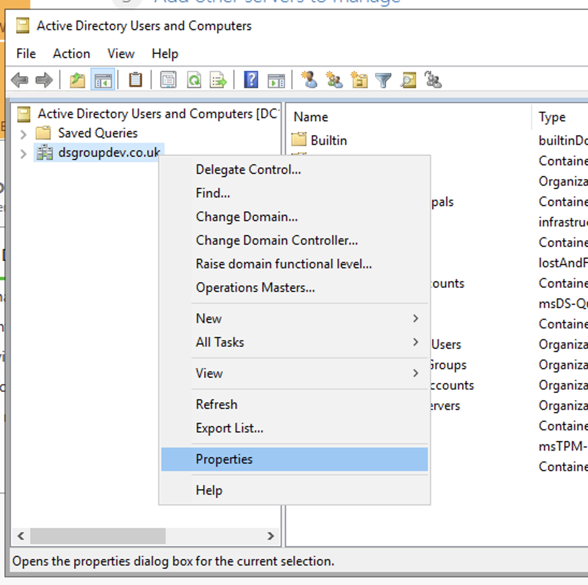

# Safe Haven Management Environment Build Instructions
These instructions will deploy a new Safe Haven Management Environment (SHM). This is required to manage your Secure Research Environments (SREs) and must be deployed before you create any SREs. A single SHM can manage all your SREs. Alternatively, you may run multiple SHMs concurrently (eg one for each Data Study Group).

## Contents
1. [Prerequisites](#1-prerequisites)
2. [Safe Haven Management configuration](#2-safe-haven-management-configuration)
3. [Configure DNS for the custom domain](#3-configure-dns-for-the-custom-domain)
4. [Setup Azure Active Directory (AAD)](#4-setup-azure-active-directory-aad)
5. [Deploy key vault for SHM secrets](#5-deploy-key-vault-for-shm-secrets)
6. [Setup Safe Haven administrators](#6-setup-safe-haven-administrators)
7. [Deploy and configure VNET and Domain Controllers](#7-deploy-and-configure-vnet-and-domain-controllers)
8. [Deploy and configure Network Policy Server (NPS)](#8-deploy-and-configure-network-policy-server-nps)
9. [Deploy package mirrors](#9-deploy-package-mirrors)
10. [Tear down SHM](#10-tearing-down-the-shm)

## 1. Prerequisites
- An Azure subscription with sufficient credits to build the environment in
- PowerShell for Azure
  - Install [PowerShell v 6.0 or above](https://docs.microsoft.com/en-us/powershell/azure/install-az-ps?view=azps-2.2.0)
  - Install the Azure [PowerShell Module](https://docs.microsoft.com/en-us/powershell/azure/install-az-ps?view=azps-2.2.0&viewFallbackFrom=azps-1.3.0)
- Microsoft Remote Desktop
  - On Mac this can be installed from the [apple store](https://itunes.apple.com/gb/app/microsoft-remote-desktop-10/id1295203466?mt=12)
- OpenSSL
  - Install using your package manager of choice

## 2. Safe Haven Management configuration

### Domain name
Choose a domain according to the following rules:
  - Turing production: a subdomain of the `turingsafehaven.ac.uk` domain
  - Turing testing: a subdomain of the `dsgroupdev.co.uk` domain
  - Other safe havens: follow your organisation's guidance. This may require purchasing a dedicated domain

### Management environment ID `<shmId>`
Choose a short ID `<shmId>` to identify the management environment (e.g. `testa`).

### Create configuration file

The core properties for the Safe Haven Management (SHM) environment must be present in the `environment_configs/core` folder. These are also used when deploying an SRE environment.
The following core SHM properties must be defined in a JSON file named `shm_<shmId>_core_config.json`. The `shm_testa_core_config.json` provides an example.

**NOTE:** The `netbiosName` must have a maximum length of 15 characters.

```json
{
    "subscriptionName": "Name of the Azure subscription the management environment is deployed in",
    "domainSubscriptionName": "Name of the Azure subscription holding DNS records",
    "adminSecurityGroupName" : "Name of the Azure Security Group that admins of this Safe Haven will belong to",
    "computeVmImageSubscriptionName": "Azure Subscription name for compute VM",
    "domain": "The fully qualified domain name for the management environment",
    "netbiosname": "A short name to use as the local name for the domain. This must be 15 characters or less",
    "shmId": "A short ID to identify the management environment",
    "name": "Safe Haven deployment name",
    "organisation": {
        "name": "Organisation name",
        "townCity": "Location",
        "stateCountyRegion": "Location",
        "countryCode": "e.g. GB"
    },
    "location": "The Azure location in which the management environment VMs are deployed",
    "ipPrefix": "The three octet IP address prefix for the Class A range used by the management environment. Use 10.0.0 for this unless you have a good reason to use another prefix."
}
```


## 3. Configure DNS for the custom domain
### Create a DNS zone for the custom domain
Whatever new domain or subdomain you choose, you must create a new Azure DNS Zone for the domain or subdomain.
- Use the following resource group and subscriptions:
  - Turing production (`.turingsafehaven.ac.uk`):
    - use the `Safe Haven Domains` subscription
    - use the `RG_SHM_DNS_PRODUCTION` resource group
  - Turing testing (`.dsgroupdev.co.uk`):
    - use the `Safe Haven Domains` subscription
    - use the `RG_SHM_DNS_TEST` resource group
  - Other safe havens: follow your organisation's guidance.

- If the resource group specified above does not exist in your chosen subscription, create it now in the `UK South` region
- Click `Create a resource` in the far left menu, search for "DNS Zone" and click `Create`, using the above resource group and subscription.
- For the `Name` field enter the fully qualified domain / subdomain. Examples are:
  - `testa.dsgroupdev.co.uk` for the first test SHM deployed as part of the Turing `test` environment
  - `testb.dsgroupdev.co.uk` for a second test SHM deployed as part of the Turing `test` environment
  - `turingsafehaven.ac.uk` for the production SHM deployed as the Turing `production` environment
- Click through the various validation screens

### Add DNS records to the parent DNS system
Once the new DNS Zone for your domain/subdomain has been deployed, you need to add an `NS` record set to the parent DNS records in the parent's DNS system.
- To find the required values for the NS records, use the Azure portal to navigate to the new DNS Zone (click `All resources` in the far left panel and search for "DNS Zone"). The NS record will list 4 Azure name servers.
- Duplicate these records to the parent DNS system as follows:
  - If using a subdomain of an existing Azure DNS Zone, create an NS record set in the parent Azure DNS Zone. The name should be set to the subdomain, and the values duplicated from above (for example, for a new subdomain `testa.dsgroupdev.co.uk`, duplicate its NS record to the Azure DNS Zone for `dsgroupdev.co.uk`, under the name `testa`).
  - If using a new domain, create an NS record in at the registrar for the new domain with the same value as the NS record in the new Azure DNS Zone for the domain.


## 4. Setup Azure Active Directory (AAD)
### Create a new AAD
1. Login to the [Azure Portal](https://azure.microsoft.com/en-gb/features/azure-portal/)
2. Click `Create a Resource`  and search for `Azure Active Directory`
   
3. Click `Create`
4. Set the "Organisation Name" to `<organisation> Safe Haven <environment>`, e.g. `Turing Safe Haven Test A`
5. Set the "Initial Domain Name" to the "Organisation Name" all lower case with spaces removed
6. Set the "Country or Region" to "United Kingdom"
7. Click `Create`

### Add the custom domain to the new AAD
1. Navigate to `Active Directory` and then click `Custom domain names` in the left panel. Click `Add custom domain` at the top and create a new domain name (e.g. `testa.dsgroupdev.co.uk`)
2. If the Custom domain name blade shows `Status Verified` and no DNS details are displayed, you can skip to the next section. Otherwise, if you see DNS record details similar to the image below, you need to verify the domain. Note down the required details displayed and complete the following steps.
  
3. In a separate Azure portal window, switch to the Turing directory and navigate to the DNS Zone for your custom domain within the `RG_SHM_DNS` resource group in the management subscription.
4. Create a new record using the details provided (the `@` goes in the `Name` field and the TTL of 3600 is in seconds)
  
5. Navigate back to the custom domain creation screen in the new AAD and click `Verify`
6. Wait a few minutes then click on the domain that you just added and click the `Make primary` button.

## 5. Deploy key vault for SHM secrets
- Ensure you have the latest version of the Safe Haven repository from [https://github.com/alan-turing-institute/data-safe-haven](https://github.com/alan-turing-institute/data-safe-haven).
- Open a Powershell terminal and navigate to the `deployment/safe_haven_management_environment/setup` directory within the Safe Haven repository.
- Ensure you are logged into Azure within PowerShell using the command: `Connect-AzAccount`
- Deploy and configure the RDS VMs by running `./Setup_SHM_KeyVault.ps1 -shmId <SHM ID>`, where the SHM ID is the one specified in the config
- This will take **a few minutes** to run.

## 6. Setup Safe Haven administrators

### Add global administrator
The User who creates the AAD will automatically have the Global Administrator (GA) Role (Users with this role have access to all administrative features in Azure Active Directory).

For some steps, a dedicated **internal** Global Administrator is required (e.g. to add P1 licences), so at least this additional administrator will need to be created.

1. Ensure your Azure Portal session is using the new Safe Haven Management (SHM) AAD directory. The name of the current directory is under your username in the top right corner of the Azure portal screen. To change directories click on your username at the top right corner of the screen, then `Switch directory`, then the name of the new SHM directory.
2. On the left hand panel click `Azure Active Directory`.
3. Navigate to `Users` and create a dedicated **internal** Global Administrator:
    - Click on `+New user` and enter the following details:
      - Name: `AAD Global Admin`
      - Username: `admin@<custom domain>`
      - Under `Groups and roles > Roles` change the role to `Global Administrator`
      - Under `Settings > Usage location` change the location to `United Kingdom`
      - Click `Create`
    - Click on the username in the users list in the Azure Active Directory
    - Click the "Reset password" icon to generate a temporary password
    - Use this password to log into https://portal.azure.com as the user `admin@<custom domain>`. You will either need to log out of your existing account or open an incognito/private browsing window.
    - When prompted to change your password on first login:
      - Look in the KeyVault under the `RG_SHM_SECRETS` resource group in the management subscription.
      - There should be a secret there called `shm-<shmId>-aad-admin-password`
      - Use this as the new password
      - If you are prompted to associate a phone number and email address with the account - do so.
    - Once you have set your password and logged in you can administer the Azure Active Directory with this user by selecting `Azure Active Directory` in the left hand sidebar

### Add additional administrators (optional)
Giving additional users the GA role, prevents the user you set up earlier from being a single point of failure.

1. Navigate to `Users` and add new admin users as above:
    - Click on "+New user" and enter the following details:
      - Name: `Admin - Firstname Lastname`
      - Username: `admin.firstname.lastname@<custom domain>`
      - Under `Groups and roles > Roles` change the role to `Global Administrator`
      - Under `Settings > Usage location` change the location to `United Kingdom`
      - Click `Create`
2. Let Azure set their passwords. They can reset these later.

NB. You can also invite guest users from other Azure Active Directories at this stage
- If their account (`user@domain`) does not have an associated mailbox, invite them as normal and then give them a direct link to the portal for a specific tenant (i.e. `https://portal.azure.com/<tenant id>`). When they click this they will get taken through the same process that would have happened from the email link. [Via Microsoft documentation](https://docs.microsoft.com/en-us/azure/active-directory/b2b/redemption-experience)

### Enable MFA
To enable MFA, purchase sufficient licences and add them to all the new users.
- You will also need licences for standard users accessing the Safe Haven.

1. Ensure that you are logged in as the "Local admin" user `admin@<custom domain>`
    - Navigate to `Azure Active Directory` in the portal
    - Click on `Manage > Licences` in the left hand sidebar
    - Click on `All products` in the left hand sidebar
    - Click on the `+Try/Buy` text above the empty product list
    - **For production** buy P1 licences:
      - Click the `Purchase services` link in the infomation panel above the trial options.
      - In the "Microsoft 365 Admin Centre" portal that opens:
        - Expand the `Billing` section of the left hand side bar
        - Click on `Purchase services`
        - Scroll down the list of products and select `Azure Active Directory Premium P1` and click `Buy`
        - Select `Pay monthly`
        - Enter the number of licences required.
        - Leave `automatically assign all of your users with no licences` checked
        - Click `Check out now`
        - Enter the address of the organisation running the Safe Haven on the next screen
        - Click next and enter payment details when requested
    - **For testing** you can enable a free trial of the P2 License (NB. It can take a while for these to appear on your AAD)
      - Expand the `Free trial` arrow under `Azure AD Premium P2`
      - Click the `Activate` button
      - Wait for around 20 minutes until the `Azure AD Premium P2` licences appear on the list of `All Products`

2. Adding licenses to a user:
   - Click on `Users` in the left hand sidebar
   - For each user you want to add a licence to, click on their username
     - Ensure that the user has `usage location` set under "Settings" (see image below):
    
     - Click on `Licences` in the left hand sidebar
     - Click on `+ Assignments` in the top bar
     - Assign `Azure Active Directory Premium P1` and `Microsoft Azure Multi-Factor Authentication` then click `Save`
3. Configuring MFA on Azure Active Directory
   - Sign in to the Azure portal as a user administrator or global administrator.
   - Go to `Azure Active Directory` then click `Manage > Security` in the left hand side bar
   - Click `Manage > MFA` in the left hand side bar
   - Click on the `Additional cloud-based MFA settings` link in the `Configure` section of the main panel (if this is not available, trying signing out of the portal and back in again)
   - Configure MFA as follows:
     - In "App passwords" section select "Do not allow users to create app passwords to sign in to non-browser apps"
     - In "Verification options" section.
       - **check** "Call to phone" and "Notification through mobile app"
       - **uncheck** "Text message to phone" and "Verification code from mobile app or hardware token"
     - In "Remember multi-factor authentication" section
       - ensure "Allow users to remember multi-factor authentication on devices they trust" is **unchecked**
     - Click "Save" and close window
       
8. Require MFA for all admins
   - Sign in to the Azure portal as a user administrator or global administrator.
   - Go to `Azure Active Directory` then click `Manage > Security` in the left hand side bar
  - Click on `Protect > Conditional access` in the left hand sidebar
   - Click "Baseline policy: Require MFA for admins"
   - Select "Use policy immediately" in the left hand side bar
   - Click "Save"


## 7. Deploy and configure VNET and Domain Controllers

### Deploy the Virtual Network and Active Directory Domain Controller
- Ensure you have the latest version of the Safe Haven repository from [https://github.com/alan-turing-institute/data-safe-haven](https://github.com/alan-turing-institute/data-safe-haven).
- Open a Powershell terminal and navigate to the `deployment/safe_haven_management_environment/setup` directory within the Safe Haven repository.
- Ensure you are logged into Azure within PowerShell using the command: `Connect-AzAccount`
- Deploy and configure the RDS VMs by running `./Setup_SHM_DC.ps1 -shmId <SHM ID>`, where the SHM ID is the one specified in the config
- This will take **around one hour** to run.
- Once the script exits successfully you should see the following resource groups under the SHM subscription:
   


### Download a client VPN certificate for the Safe Haven Management VNet
1. Navigate to the SHM Key Vault via `Resource Groups -> RG_SHM_SECRETS -> kv-shm-<shm-id>`, where `<shm-id>` will be the one defined in the config file.
2. Once there open the "Certificates" page under the "Settings" section in the left hand sidebar.
3. Click on the certificate named `shm-<shmId>-vpn-client-cert`, click on the "current version" and click the "Download in PFX/PEM format" link.
4. To install, double click on the downloaded certificate (or on OSX you can manually drag it into the "login" keychain), leaving the password field blank.

**Make sure to securely delete the "\*.pfx" certificate file after you have installed it.**


### Configure a VPN connection to the Safe Haven Management VNet
1. Navigate to the Safe Haven Management (SHM) VNet gateway in the SHM subscription via `Resource Groups -> RG_SHM_NETWORKING -> VNET_SHM_<shm-id>_GW`, where `<shm-id>` will be the one defined in the config file.
2. Once there open the "Point-to-site configuration page under the "Settings" section in the left hand sidebar (see image below).
3. Click the "Download VPN client" link at the top of the page to get the root certificate (`VpnServerRoot.cer`) and VPN configuration file (`VpnSettings.xml`)
  
4. Read through the following notes, then follow the [VPN set up instructions](https://docs.microsoft.com/en-us/azure/vpn-gateway/point-to-site-vpn-client-configuration-azure-cert) using the Windows or Mac sections as appropriate.

**NOTES:**
- **You do not need to install the `VpnServerRoot.cer` certificate, as we're using our own self-signed root certificate**
- Use SSTP (Windows) or IKEv2 (OSX) for the VPN type
- Name the VPN connection "Safe Haven Management Gateway (`<shm-id>`)", where `<shm-id>` will be the one defined in the config file.
- **Windows:** do not rename the VPN client as this will break it
- **Windows:** you may get a "Windows protected your PC" pop up. If so, click `More info -> Run anyway`.
- **OSX:** you can view the details of the downloaded certificate by highlighting the certificate file in Finder and pressing the spacebar. You can then look for the certificate of the same name in the login KeyChain and view its details by double clicking the list entry. If the details match the certificate has been successfully installed.

You should now be able to connect to the SHM virtual network via the VPN. Each time you need to access the virtual network ensure you are connected via the VPN.


### Access the first Domain Controller (DC1) via Remote Desktop
1. Open Microsoft Remote Desktop
2. Click `Add Desktop`
3. In the Azure portal, navigate to the `RG_SHM_DC` resource group and then to the `DC1-SHM-<shm-id>` virtual machine (VM).
4. Copy the Private IP address and enter it in the `PC name` field on remote desktop. Click Add.
5. Double click on the desktop that appears under `saved desktops`.
6. Log in as a **domain** user (ie. `<admin username>@<custom domain>`) using the username and password obtained from the Azure portal as follows:
rather than simply `<admin username>`)
  - On the Azure portal navigate to the `RG_SHM_SECRETS` resource group and then the `kv-shm-<shm-id>` key vault and then select `secrets` on the left hand panel.
  - The username is the `shm-<shm-id>-dcnps-admin-username` secret. Add your custom AD domain to the username so the login is `<admin username>@<custom domain>` rather than simply `<admin username>`.
  - The password in the `shm-<shm-id>-dcnps-admin-password` secret.
7. If you see a warning dialog that the certificate cannot be verified as root, accept this and continue.

### Install Azure Active Directory Connect
1. Navigate to `C:\Installation`
2. Run the `AzureADConnect.msi` installer
  - On the `Welcome to Azure AD Connect` screen:
    - Tick the `I agree to the license terms` box
    - Click `Continue`
  - On the `Express Settings` screen:
    - Click `Customize`
  - On the `Install required components` screen:
    - Click `Install`
  - On the `User sign-in` screen:
    - Ensure that `Password Hash Synchronization` is selected
    - Click `Next`
  - On the `Connect to Azure AD` screen:
    - Provide a global administrator details for the Azure Active Directory you are connected to
    - You should have created `admin@<custom domain>` during the `Add additional administrators` step and its password should be stored in the Key Vault
      - If you receive an Internet Explorer pop-up dialog "Content within this application coming from the website below is being blocked by Internet Explorer Advanced Security Configuration: https://login.microsoft.com"
        - Click `Add`
        - Click `Add`
        - Click `Close`
        - Repeat for the same dialog with `https://aadcdn.msftauth.net`
      - If you receive an error box `We can't sign you in,. Javascript is required to sign you in. Do you want to continue running scripts on this page`
        - Click `Yes`
        - Close the dialog by clicking `X`
    - Enter the global administrator password if prompted
    - Back on the `Connect to Azure AD` screen, click `Next`
    - Approve the login with MFA if required
      - If you see a Windows Security Warning, check `Don't show this message again and click "Yes`.
  - On the `Connect your directories` screen:
    - Ensure that correct forest (your custom domain name; e.g `turingsafehaven.ac.uk`) is selected and click "Add Directory"
    - On the `AD forest account` pop-up:
      - Select `Use existing AD account`
      - Enter the details for the `localadsync` user.
        - Username: `localadsync@<custom domain>` (e.g. localadsync)
        - Password: use the `shm-<shm-id>-localadsync-password` secret in the management Key Vault.
      - Click `OK`
      - **Troubleshooting:** if you get an error that the username/password is incorrect or that the domain/directory could not be found, try resetting the password for this user to the secret value from the `shm-<shm-id>-localadsync-password` secret in the management Key Vault.
          - In Server Manager click `Tools > Active Directory Users and Computers`
          - Expand the domain in the left hand panel
          - Expand the `Safe Haven Service Accounts` OU
          - Right click on the "Local AD Sync Administrator" user and select "reset password"
          - Set the password to the the secret value from the `shm-<shm-id>-localadsync-password` secret in the management Key Vault.
          - Leave the other settings as is and click "Ok"
    - Click `Next`
  - On the `Azure AD sign-in configuration` screen:
    - Verify that the `User Principal Name` is set to `userPrincipalName`
    - Click `Next`
  - On the `Domain and OU filtering` screen:
    - Select `Sync Selected domains and OUs`
    - Expand the domain and deselect all objects
    - Select `Safe Haven Research Users`
    - Click `Next`
  - On the `Uniquely identifying your users` screen:
    - Click `Next`
  - On the `Filter users and devices` screen:
    - Select `Synchronize all users and devices`
    - Click `Next`
  - On the `Optional features` screen:
    - Select `Password Writeback`
    - Click `Next`
  - On the `Ready to configure` screen:
    - Click `Install`
    - This may take a few minutes to complete
  - On the `Configuration complete` screen:
    - Click `Exit`

  - **Troubleshooting:** The error `Directory synchronization is currently in a pending disabled state for this directory. Please wait until directory synchronization has been fully disabled before trying again` may occur if you have recently torn down another SHM linked to the same Azure Active Directory. You need to wait for the Azure Active Directory to fully disconnect - this can take up to 72 hours but is typically sooner. You do not need to close the installer window while waiting. If you need to, you can disconnect from the RDS and VPN and reconnect later before clicking `Retry`.

### Set AAD sync permissions
The `localadsync@<custom domain>` account needs to be given permissions to change passwords or self-service password reset will not work.
- In Server Manager select `Tools > Active Directory Users and Computers` (or open the `Active Directory Users and Computers` desktop app directly)
- Click on the `View` menu item and make sure that `Advanced Features` is enabled
- Right click on the root domain (eg. `dsgroupdev.co.uk`) in the left-hand window and select `Properties`
  
- In the pop-up window, go to the `Security` tab and click on the `Advanced` button
  
- In the pop-up window, click on the `Add` button
  - Click on `Select a principal` and then select the `localadsync@<custom domain>` by typing the first few letters into the search box and clicking on `Check Names`. When the `localadsync@<custom domain>` principal is selected, click `OK` to return to the `Permissions Entry for <custom domain>` window.
  - In the `Applies to` section, select `Descendant User objects`
  - Under `Permissions`, ensure that the following options are checked:
    - `Reset password`
    - `Change password`
  - Under `Properties`, ensure that the following options are checked (NB. there are a lot of properties, so this might take some scrolling. _The properties are listed in alphabetical order of the main part of the property name excluding the initial prefix Read/Write etc)_:
    - `Write lockoutTime`
    - `Write pwdLastSet`
  - Click `OK`
- Now go through the same procedure, this time selecting `This object and all descendant objects` in the `Applies to` section
  - Enable the following under `Permissions`:
    - `Replicating Directory Changes`
    - `Replicating Directory Changes All`
  - Click `OK` on all open dialog boxes


### Additional AAD Connect Configuration
1. Open `Azure AD Connect > Synchronization Rules Editor` from the start menu

  

2. Change the `Direction` drop down to `Outbound`
3. Select the `Out to AAD - User Join` rule.
  - Click `Disable`.
  - Click `Edit`.
  - In the `Edit Reserved Rule Confirmation` dialog box click `Yes`
4. In the editing view set `precedence` to 1.
  - Select `Transformations` from the sidebar and locate the rule with its `Target Attribute` set to `usageLocation`
    - Change the `FlowType` column from `Expression` to `Direct`
    - On the `Source` column click the drop-down menu and select `c`
    - Click `Save` (in the `Warning` dialog box click `OK`)
5. You will now see a cloned version of the `Out to AAD - User Join`.
  - Delete the original.
  - In the `Warning` dialog box click `OK`
6. Edit the cloned version.
  - Change `Precedence` to 115
  - Edit the name to `Out to AAD - User Join`.
  - Click "Save" (in the "Warning" dialog box click "OK").
7. Click `Enable` on the `Out to AAD - User Join` rule that you have just edited
8. Click the `X` to close the `Synchronization Rules Editor` window
9. Open Powershell as an administrator
  - Navigate to `C:\Installation`
  - Run `.\Run_ADSync.ps1`


### Validation of AD sync
1. Add a research user:
  - In Server Manager select `Tools > Active Directory Users and Computers` (or open the `Active Directory Users and Computers` desktop app directly)
  - Expand the domain
  - Right click on the `Safe Haven Research Users` OU and select `New -> User`
  - Create a new user:
    - First name: `Test`
    - Last name: `ADUser`
    - User login name: `testaduser`
    - Click "Next"
  - Password: use the `shm-<shm-id>-testaduser-password` secret in the management Key Vault.
    - Untick `User must change password at next logon`
    - Click `Next`
  - Click `Finish`
2. Force a sync to the Azure Active Directory
  - Open Powershell as an administrator
  - Navigate to `C:\Installation`
  - Run `.\Run_ADSync.ps1 -sync Delta`
3. Go to the Azure Active Directory in `portal.azure.com`
  - Click `Users > All users` and confirm that the new user is shown in the user list.
  - It may take a few minutes for the synchronisation to fully propagate in Azure.

### Configure AAD side of AD connect
1. Go to the Azure Active Directory in `portal.azure.com`
  - Select `Manage > Password reset` from the left hand menu
2. Select `On-premises integration` from the left hand side bar
  - Ensure `Write back passwords to your on-premises directory` is set to yes.
    
  - If you changed this setting, click the `Save` icon
- Select `Properties` from the left hand side bar
  - Make sure that `Self service password reset enabled` is set to `All`
    
  - If you changed this setting, click the `Save` icon


## 8. Deploy and configure Network Policy Server (NPS)
1. Ensure you are logged into Azure within PowerShell and using the correct subscription with the commands:
   ```pwsh
   Connect-AzAccount
   Set-AzContext -SubscriptionId "<SHM-subscription-id>"
   ```
2. From a clone of the data-safe-haven repository, deploy the NPS server with the following commands (where `<SHM ID>` is the one defined in the config file)
   ```pwsh
   cd safe_haven_management_environment/setup
   ./setup_shm_nps.ps1 -shmId <SHM ID>
   ```
3. This will take **a few minutes** to run.
  - **Troubleshooting:** If you see an error similar to `New-AzResourceGroupDeployment : Resource Microsoft.Compute/virtualMachines/extensions NPS-SHM-shmId/joindomain' failed with message` you may find this error resolves if you wait and retry later.


### Configure NPS server
1. Log in to the NPS Server VM using Microsoft Remote Desktop
  - the private IP address for the SHM NPS VM can be found in the `RG_SHM_NPS` resource group
  - the Username and Password are the same as for SHMDC1 and SHMDC2 (ie the credentials you used above to Remote Desktop into the domain controller above):
    - To obtain the login credentials again, on the Azure portal navigate to the `RG_SHM_SECRETS` resource group and then the `kv-shm-<shm-id>` key vault and then select `secrets` on the left hand panel.
    - The username is the `shm-<shm-id>-dcnps-admin-username` secret plus the domain, ie `<admin username>@custom domain`
    - The password in the `shm-<shm-id>-dcnps-admin-password` secret.
2. In Server Manager select `Tools -> Network Policy Server` (or open the `Network Policy Server` desktop app directly)
3. Configure NPS server to log to text file:
  - Select `NPS (Local) > Accounting` on the left-hand sidebar
    
  - Click on `Accounting > Configure Accounting`
    - Click "Next" -> "Log to text file on the local computer" then click "Next" -> "Next" -> "Next" -> "Close"
  - Click on `Log file properties > Change log file properties`
    - On the "Log file" tab, select "Daily" under "Create a new log file"
  - Click "Ok"
4. Add NPS policy to allow connections
  - Select `NPS (Local) > Policies > Network policies` on the left-hand sidebar
    
  - Right click on "Network policies" and select "New"
  - Set the policy name to "RDG_CAP" and click "Next"
  - Click "Add" to add a restriction
  - Select "Day and Time Restrictions" and click "Add"
  - Select "Permitted" (the whole weekly calendar should turn blue) and click "OK" then "Next"
  - On the `Specify Access Permission` screen:
    - Click "Next", leaving `Access granted` checked
  - On the `Configure authentication methods` screen:
    - Check the "Allow clients to connect without negotiating an authentication method" checkbox
    - Click "Next".
  - Click "No" on the `Connection Request Policy` pop up.
  - On the `Configure constraints` screen:
    - Click "Next"
  - On the `Configure settings` screen:
    - Click "Next"
  - On the `Completing network policy` screen:
    - Click "Finish"

**NOTE:** If this policy is not present, then users will not be prompted for MFA when launching an RDS app.
This is because, without this policy, the NPS server will reject their authentication with the following error:
```
  - Event ID: 6273
  - First line of even message: Network Policy Server discarded the request for a user.
  - Reason Code: 21
  - Reason: An NPS extension dynamic link library (DLL) that is installed on the NPS server rejected the connection request.
```

### MFA Configuation
1. Navigate to `C:\Installation`
2. Run the `NpsExtnForAzureMfaInstaller.exe` installer
3. Agree the license terms and click "Install"
4. Click "Close" once the install has completed
5. Run PowerShell as administrator and run:
  ```pwsh
  cd "C:\Program Files\Microsoft\AzureMfa\Config"
  .\AzureMfaNpsExtnConfigSetup.ps1
  ```
  - Enter "Y" when prompted
  - Enter "A" when prompted
  - If you are prompted to add webpages to exceptions then accept them.
  - **NOTE:** You may get a Javascript error. If you do, simply run this script again.
  - **Troubleshooting:** If you see an error `New-MsolServicePrincipalCredential : Service principal was not found` you may find this error resolves if you retry later
6. On the webpage pop-up, sign in as the "Global Administrator" (eg. `admin@<custom domain>`) user. Other administrators added as guests will not work for this step.
  - If you have not done so already, you may be prompted to add a phone number and backup email for the `admin@<custom domain>` account at this point.
7. When prompted to `Provide your Tenant ID`, enter your Azure Active Directory ID. To get this:
  - In the Azure portal select "Azure Active Directory" in the left hand side bar
  - Select "Properties" in the left hand side bar
  - Copy the "Directory ID" field
8. At the message "Configuration complete. Press Enter to continue", press "Enter"

**Troubleshooting MFA configuration:**
If you get a `New-msolserviceprincipalcredential: Access denied` error stating `You do not have permissions to call this cmdlet`, check the following:
  - Make sure you authenticate as the "Local Administrator" (`admin@<custom domain>`) user when prompted by the script. Other administrators added as guests will not work for this step.
  - Make sure you are logged in as a **domain** user rather than a local user.
    - The output of the `whoami` command in powershell should be `netBiosDomain\admin` rather than `SHMNPS\admin`
    - If it is not, reconnect to the remote desktop with the username `admin@<custom domain>`, using the same password as before
  - Make sure the Safe Haven Azure Active Directory has valid P1 licenses:
    - Go to the Azure Portal and click "Azure Active Directories" in the left hand side bar
    - Click "Licenses" in the left hand side bar
    - You should see "1 product" in the main panel list of products. Click on this.
    - You should see "Azure Active Directory Premium P1" in the list of products, with a non-zero number of available licenses.
    - If you do not have P1 licences, purchase some following the instructions at the end of the [Add additional administrators](#Add-additional-administrators) section above, making sure to also follow the final step to configure the MFA settings on the Azure Active Directory.


## 9. Deploy package mirrors
### When to deploy mirrors
A full set of Tier 2 mirrors take around 4 days to fully synchronise with the external package repositories, so you may want to kick off the building of these mirrors before deploying your first SRE.


### Deploying package mirrors
1. Ensure you are logged into Azure within PowerShell and using the correct subscription with the commands:
   ```pwsh
   Connect-AzAccount
   Set-AzContext -SubscriptionId "<SHM-subscription-id>"
   ```
2. From a clone of the data-safe-haven repository, deploy package mirrors (depending on which tiers of SRE you want to support) using the following commands (where `<SHM ID>` is the one defined in the config file):
   ```pwsh
   cd safe_haven_management_environment/setup
   ./create_package_mirrors.ps1 -shmId <SHM ID> -tier <desired tier eg. '2'>
   ```
3. This will take **around 20 minutes** to run.


### [Optional] Tearing down package mirrors
During normal usage, you should not need to tear down the package mirrors, but if you decide to do so, use the following procedure:

1. Ensure you are logged into the Azure CLI (bash) with the commands:
   ```bash
   az login
   az account list
   ```
2. Ensure you are logged into Azure within PowerShell and using the correct subscription with the commands:
   ```pwsh
   Connect-AzAccount
   Set-AzContext -SubscriptionId "<SHM-subscription-id>"
   ```
3. From a clone of the data-safe-haven repository, teardown package mirrors (depending on which tiers of SRE you want to remove) using the following commands (where `<SHM ID>` is the one defined in the config file):
   ```pwsh
   cd safe_haven_management_environment/setup
   ./teardown_package_mirrors.ps1 -shmId <SHM ID> -tier <desired tier eg. '2'>
   ```
4. This will take **a few minutes** to run.

## 10. Tearing down the SHM
In order to tear down the SHM, use the following procedure:

### Disconnect from the Azure Active Directory
1. Using Microsoft Remote Desktop, connect to the `DC1-SHM-<shm-id>` virtual machine (VM).
2. Log in as a **domain** user (ie. `<admin username>@<custom domain>`) using the username and password obtained from the Azure portal.
3. If you see a warning dialog that the certificate cannot be verified as root, accept this and continue.
4. Open Powershell as an administrator
  - Navigate to `C:\Installation`
  - Run `.\Disconnect_AD.ps1`
  - You will need to provide login credentials (including MFA if set up) for `<admin username>@<custom domain>`
5. Full disconnection of the Azure Active Directory can take up to 72 hours but is typically less. If you are planning to install a new SHM connected to the same Azure Active Directory you may find the `AzureADConnect` installation step requires you to wait for the previous disconnection to complete.

### Tear down any attached SREs
1. From a clone of the data-safe-haven repository, run the following commands, where `<SRE ID>` is the one defined in the config file.
   ```pwsh
   cd secure_research_environment/sre_deploy_scripts
   ./Teardown_SRE.ps1 -sreId <SRE ID>
   ```
2. Repeat this step for all SREs attached to this SHM


### Tear down the SHM
1. From a clone of the data-safe-haven repository, run the following commands, where `<SHM ID>` is the one defined in the config file.
  ```pwsh
  cd deployment/administration
  ./SRE_Teardown.ps1 -sreId <SRE ID>
  ```
