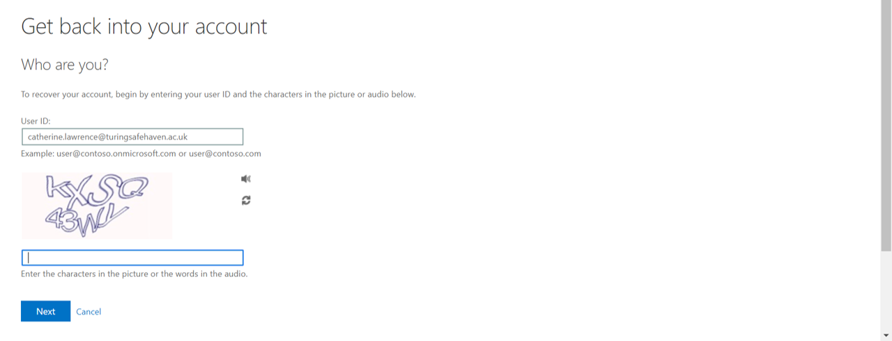
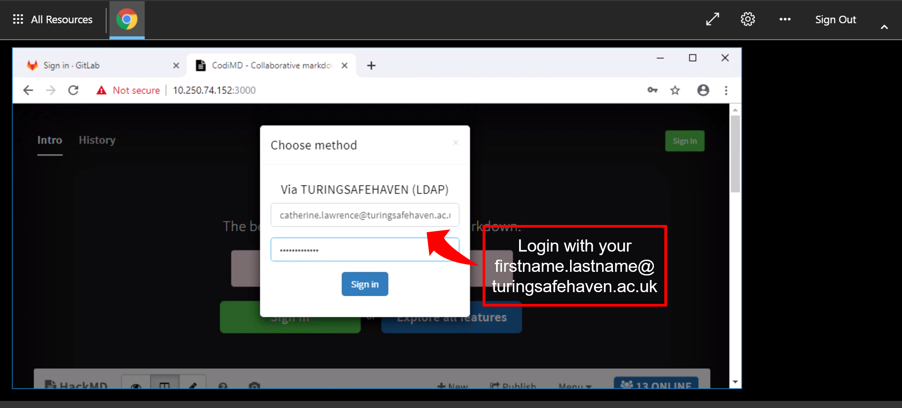

# Safe Haven User Documentation

**Table of contents:**

* [Section 1: Support for bugs and reports](#section-1-support-for-bugs-and-reports)
* [Section 2: Overview of the Turing DSG IT set-up](section-2-overview-of-the-turing-dsg-it-set-up)
  * [2.1: Data governance and challenge overview](#section-21-data-governance-and-challenge-overview)
  * [2.2: Turing safe haven set-up](#section-22-turing-safe-haven-set-up)
  * [2.3: Wi-Fi access](#section-23-wi-fi-access)
  * [2.4: Multi-factor authentication](#section-24-multi-factor-authentication)
* [Section 3: User activation instructions](#section-3-user-activation-instructions)
  * [Section 3.1. Initial User Sign In, configuring MFA](#section-31-initial-user-sign-in-configuring-mfa)
* [Section 4: Using the safe haven](#section-4-using-the-safe-haven)
  * [Section 4.1: Access credentials](#section-41-access-credentials)
  * [Section 4.2: Logging into the Windows Azure environment](#section-42-logging-into-the-windows-azure-environment)
  * [Section 4.3: First-time set-up](#section-43-first-time-set-up)
  * [Section 4.4: Using the data analytics virtual machine](#section-44-using-the-data-analytics-virtual-machine)
  * [Section 4.5: Accessing GitLab and storing code](#section-45-accessing-gitlab-and-storing-code)
  * [Section 4.6: Accessing HackMD and writing the report](#section-46-accessing-hackmd-and-writing-the-report)
  * [Section 4.7: Accessing the data and exporting figures](#section-47-accessing-the-data-and-exporting-figures)
  * [Section 4.8: Creating and presenting the report-out slides for Friday](#section-48-creating-and-presenting-the-report-out-slides-for-friday)
  * [Section 4.9: Outputs from the week](#section-49-outputs-from-the-week)
* [Appendix A: Migrating to a new data science VM post package update](#appendix-a-migrating-to-a-new-data-science-vm-post-package-update)

## Section 1: Support for bugs and reports

*You may be surprised that we're starting this document with a section about bugs and problems!*
*Our logic is that once you're set up, this is going to be the most important part.*
*Good luck with your analyses, we're here to help if you need us.*

The Turing IT, Research Engineering Group (REG) and the data study group teams attempt to solve IT infrastructure issues arising as soon as possible.

The process for requesting help with the issue is as follows:

1. Make sure you have **read this document** and checked if it answers your query.

    *Please do not log an issue before you have read all of the sections in this document.*

2. Re-start the environment (safe haven or data science suite) at least once, re-attempt the process leading to the bug/error at least twice.

    We know that "turn it off and turn it back on again" is a frustrating piece of advice to receive, but in our experience it works rather well!
    (Particularly when there are lots of folks trying these steps at the same time.)

3. Let your challenge facilitator know of the issue.
  They have been given access to an internal Github issue tracker and will relay issues to Turing IT and REG.

    Please help your facilitator with a summary, and an appropriate tag for the issue.
    For example: `[feature request]`, `[package request]`, `[bug report]` are all nice and easy to understand.

    If you are reporting a bug, please include:

    * Your client machine’s operating system and operating system version.
    * Precise condition under which the bug occurs.
    How to reproduce it.
    * Precise description of the bug.
    What happens?
    What would you expect to happen instead if there were no bug?
    * Any workarounds/fixes you have found

## Section 2: Overview of the Turing DSG IT set-up

To maintain security of the data and challenge insights we are legally required to work on some of the challenges within in the data safe haven hosted by the Turing Institute.
Each challenge data set has a data governance and security tier which may impose restrictions on the analysis environment.

This section outlines the different tiers and explains some of the restrictions that apply to the more sensitive data classifications.

### Section 2.1: Data governance and challenge overview

The challenges in this DSG are all categorised as *Tier 2: "Official"*.

In order to access tier 2 data, the DSG team will come to each room and take a participant register for each challenge.
While you are having an initial problem discussion and brainstorming session, access will be granted to the Turing safe haven and to the relevant challenge data.
When this is ready, your facilitator will guide you through user registration and a safe haven usage tutorial following the instructions in this document.

### Section 2.2: Turing safe haven set-up

The original data is hosted on a server at the Alan Turing Institute.
You will not have access to that data server.

A copy of the data is available inside a [Windows Azure environment](https://azure.microsoft.com/en-gb/overview/what-is-azure/).

The Azure environment also contains a Unix data science VM, which can only be accessed from the dashboard.

:arrow_right: Your laptop

&nbsp;&nbsp;&nbsp;&nbsp;&nbsp;&nbsp;:arrow_right: Turing Guest Wi-Fi

&nbsp;&nbsp;&nbsp;&nbsp;&nbsp;&nbsp;&nbsp;&nbsp;&nbsp;&nbsp;&nbsp;&nbsp;:arrow_right: Windows remote desktop (multi-factor authentication required)

&nbsp;&nbsp;&nbsp;&nbsp;&nbsp;&nbsp;&nbsp;&nbsp;&nbsp;&nbsp;&nbsp;&nbsp;&nbsp;&nbsp;&nbsp;&nbsp;&nbsp;&nbsp;&nbsp;&nbsp;&nbsp;&nbsp;&nbsp;&nbsp;:arrow_right: Unix Azure environment

The data science VM has a standard suite of data science software, including Python 2/3 via Conda, Spyder, Jupyter and RStudio, with a large selection of pre-installed packages.

You also have access to HackMD for collaborative writing and GitLab to version control and share your code.

The Tier 2 environment does not allow connection to the internet.
However, there are local copies of the `PyPI` and `CRAN` package repositories available inside of the Azure virtual machine.
You can install packages you need from these copies in the usual way, for example `pip install` and `packages.install` for Python and R respectively.

### Section 2.3: Wi-Fi access

You need to be connected to the Turing’s internal Wi-fi network to access any of the challenges:

> Wi-Fi Name: Turing Guest
> Password  : *Available on signage throughout the Turing Institute*

The password is the full string *including spaces*.

### Section 2.4: Multi-factor authentication

Multi-factor authentication (MFA, also known as two-factor authentication, "2FA", even if there are more than two factors) is one of the most powerful ways of protecting your personal information online.
In this case, we use MFA to protect the challenge data.

Very briefly, MFA will ask you to confirm your identity via another mechanism whenever you connect to the Windows Azure environment.
You can think of your username and password as being the first authentication, and the second being a text message, phone call, personal access code or notification via the mobile app.
*This is why we ask that you bring a mobile device with you to the Data Study Group.*

The instructions below recommend using notifications via the Windows authenticator app, but all the options above will work too.

This process may cause some connectivity challenges on the first (and maybe second) days of the Data Study Group, especially if your phone provider’s network has low connectivity at the British Library.
The DSG team are here to help smooth these processes for you, but it is important to emphasise that we are always balancing ease of analysis with our responsibilities as data controllers for the DSG week.
Thank you for your patience as we and your facilitators work to get you connected securely.

## Section 3: User activation instructions

This section describes user activation and verification procedures which are a requirement for the tier 2 or higher Turing safe haven.
As a result, you will possess user credentials that allow you to use the safe haven.
Instructions should be followed only once, at the start of the data study week.
Please let your facilitator know if any of the below fails despite multiple tries.

### Section 3.1. Initial User Sign In, configuring MFA

You should have provided a phone number when you registered for the DSG.
If you did not provide your number, please let you facilitator know, so they can log this with the IT and DSG team and get you an account set up ready to activate.

Your username will be in the format `firstname.lastname` – you will see this mentioned again later in this document, on its own, or together with the Turing safe haven domain, as `firstname.lastname@turingsafehaven.ac.uk`.

You will have to (1) set a password and (2) configure MFA before you are able to log in to the safe haven.

#### Set your password

For security reasons, you must (re-)set your password before you can log in:

1. Open a private browser session ('incognito mode') on your laptop – this will avoid picking up any existing Azure / Microsoft accounts you have.
2. Paste the following URL into the private browser address bar - https://aka.ms/ssprsetup
3. At the login prompt enter your username `username@turingsafehaven.ac.uk` and confirm/proceed.
  (Remember that your username will be in the format `firstname.lastname`.)
4. There will then be a password prompt.
  The first time you log-in **you haven’t set a password yet** so click "Forgotten password"


5. Complete the requested information (captcha and the phone number you provided on registration).




6. Generate a new password using the [Secure Password
Generator we set up](https://passwordsgenerator.net/?length=20&symbols=0&numbers=1&lowercase=1&uppercase=1&similar=1&ambiguous=0&client=1&autoselect=1).

    :warning: Do **not** use special characters or symbols in your password.
    If you do, you may be unable to type them in the virtual keyboard to access the secure environment.
    Choose an alphanumeric password with minimum length of 12 characters, with at least one of each:

    - uppercase character
    - lowercase character
    - number


7. Log into your account

    :warning: During this process, you will need to provide a phone number or an email for account recovery.
    This is **not** MFA.
    You still need to set up MFA in the next section, otherwise you will be unable to launch any apps.


8. Answer your phone when it rings!


9. Finish logging in


#### Configure the MFA

Before any user can access the secure environment, you need to setup your multifactor authentication.
The authentication method can be either via a call to your phone or via the Microsoft Authenticator app.

**Step 1**: Log into your account

1. Open a private browser session on your laptop.
2. Enter https://aka.ms/MFASetup into the address bar.
3. Login using `firstname.lastname@turingsafehaven.ac.uk` and the new password you just created.
  a. Note that **you might find another address is automatically inserted at this step** (eg your work email account).
  (This is why we suggest using a private (incognito) browser session.)
  If that doesn’t work, **log out of your personal account** and try again with your data study group username.

4. Set up the second authentication method


5. **Phone option**: If you choose to set up the authentication by phone call you will receive a call straight away.

    Note that some people get a call that says, *"press the pound key"* and others receive *"press the hash key"* – both mean hit the `#` button.


Note that when you click `close` the page will switch to your dashboard.

You can close your browser at this point.

5. **App option**:

   i. Download the app via one of these links:

   * iOS: https://bit.ly/iosauthenticator
   * Android: https://bit.ly/androidauthenticator
   * Windows mobile: https://bit.ly/windowsauthenticator

    ii. Select the "Receive notifications for verification" radio button

    iii. Click on "Set up"

    iv. Open your Microsoft Authenticator app on your phone and select "Add an account"

    v. Select "Work or School" account

    vi. Scan the QR code on the screen

    vii. Click "Next" to start verification

    viii. Click "Next" again to test the app, you will get a verification on your app.


6. When confirmed you can close the browser.


#### Top tips regarding MFA

***If at first you don’t succeed: do the exact same thing a few more times!***

Sometimes the MFA steps can be buggy.
We’ve collected a few top tips here, but really, the answer is to be patient and just try again with the exact steps you just completed!

* Verifying your account in the Authenticator app can be weirdly buggy.
  Sometimes it doesn’t work the first time, but for the facilitators we all connected after somewhere between 1 and 10 attempts.
* Make sure you allow notifications on your authenticator app.
* Check you don’t have Do not Disturb mode on.
* You have to be SUPER FAST at acknowledging the notification on your app!
  The access codes update every 30 seconds.
  If at first you don’t succeed...

## Section 4: Using the safe haven

### Section 4.1: Access credentials

From the user registration process ([Section 3](#section-3-user-activation-instructions)), you should have the following ready:
* A `username` in the format `firstname.lastname`.
* A user `password`.
  You choose this in the registration/MFA set-up process ([Section 3](#section-3-user-activation-instructions)).

### Section 4.2: Logging into the Windows Azure environment

In order to access the Azure safe haven environment, follow the below steps:

1. Open a private web browser session and enter the following URL in an incognito tab/private mode): https://rds.dsgroupX.co.uk/RDWeb/webclient/

    Replace `X` by one of the following numbers, depending on challenge

    * X = 11 : NATS
    * X = 12 : Spend Network
    * X = 13 : GOSH
    * X = 14 : Roche
    * X = 15 : British Antarctic Survey

Important note: due to the security tier, there is **no internet access from inside any of the above virtual machines**.

Additionally there is **no copy/paste functionality** from outside to inside the environment.

:warning: Don’t forget the `https://` - it won’t work without that prefix.

2. Enter the username you’ve been provided, ensure that you use the following format:
`firstname.lastname@turingsafehaven.ac.uk`

    :warning: that's an `ac.uk` address not `.co.uk`

3. Enter your password and confirm.

You will now **receive a call or mobile app notification** for the MFA to confirm.
For the call, you may have to move to a place with good reception and/or press the hash (#) key multiple times in-call.

After success, you’ll see the following screen:


4. *(First time only)* Follow the steps in [Section 4.3](#section-43-first-time-set-up) if this is the first time you are logging in.

    Following first time use, you can select whatever app that you wish to work with – each is explained in the following sections.

:warning: Remember that once you go into one of these apps, you’re now going to a local server / UK Remote Desktop / VM.
That means **some of your key mappings may not be the same** as you’re used to.

We recommend opening a text editor to check what keys the remote desktop thinks you're typing – especially if you have special characters you are using.
You can right click on `Desktop` and `Applications`->`Settings`->`Keyboard` to change the layout.

### Section 4.3: First-time set-up

In order to set up your user account on the virtual machine, you need to follow the below steps **once**.

1. Run the "Shared VM (SSH)" app.
You will need to first authenticate using MFA.


2. Confirm the below security alert with `"yes"` (this only happens on the first log in).


3. Log into Putty with your `username` (`firstname.lastname`) and `password`.

    Note that **The cursor will not move** while you are typing your password!

4. Once you have confirmed log in, you can close this window.

:warning: Be careful not to close the browser when you close the tab in the remote desktop!

5. Run the "Shared VM (Desktop)" app. Verify using MFA, then login with `firstname.lastname@turingsafehaven.ac.uk` and `password`.

    Check the box in the security alert below and confirm by clicking the `"yes"` button.


6. Insert your credentials as per the example below:


If you get a warning:

> Oops, we couldn't connect to "Shared VM (Desktop)"
>
> We couldn't connect to the gateway because of an error. If this keeps happening, ask your admin or tech support for help.

then make sure that you have MFA enabled (see [Section 3](section-3-user-activation-instructions), which is different from text messages for account recovery.

### Section 4.4: Using the data analytics virtual machine

The analytics environment can be accessed through the `Shared VM` (desktop) app.
Please log in with username `firstname.lastname` and password `password`.


Applications can be accessed through Terminal or right click on desktop (top left) and:

* `Applications`->`Development`->`RStudio`
* `Applications`->`Development`->`Atom`
* Open Terminal here -> `jupyter notebook &` if you want to use python within a jupyter notebook.
* Open Terminal here -> `spyder &` if you want to use python within the Spyder IDE (integrated development environment) which is quite similar to RStudio.

Note that typing R at the commandline will run conda's version R.
You can run the system R by typing `/user/bin/R`.
We had already pointed RStudio to use system R, so those using RStudio should see the custom packages with no issues.


### What if I want to install packages?

In Python, run this in a shell:

```
pip install beautifulsoup4
```

In R, you can install them from inside R:

```
> install.packages("cluster")
```

You will see:

```
Installing package into ‘/usr/local/lib/R/site-library’
(as ‘lib’ is unspecified)
Warning in install.packages("cluster") :
  'lib = "/usr/local/lib/R/site-library"' is not writable
Would you like to use a personal library instead? (yes/No/cancel)
```

Enter `yes`, which prompts you to confirm the name of the library:

```
Would you like to create a personal library
‘~/R/x86_64-pc-linux-gnu-library/3.5’
to install packages into? (yes/No/cancel)
```

Enter `yes`, which then installs the packages:

```
trying URL 'http://10.1.0.21/src/contrib/cluster_2.0.7-1.tar.gz'
...
```
### Accessing GitLab and HackMD from the VM instead of via work resources app

This VM can also be used to directly access `GitLab` and `HackMD`.

1. Point firefox to the url provided by the resource dashboard for GitLab/HackMD
2. Read and write access – the repository URL can be copied using via icon and then replacing the first bit by the IP address – in the case below 10.250.10.151


### Section 4.5: Accessing GitLab and storing code

GitLab is an open source version of GitHub, working as a code hosting platform for version control and collaboration. It lets you and others work together on projects.

It also allows you to version control all the code that you write for any of the Data Study Group challenges.
There is a local GitLab installation within the Work Resources.

If you have not used GitLab before:
- There is a small tutorial available as an Appendix to this guidance
- You can find the official documentation [in the GitLab website] (https://docs.gitlab.com/ee/gitlab-basics/README.html)
- Ask your group colleagues for help
- Ask in the Slack channel for help.

Everything that is not stored in a GitLab repository on Friday lunchtime will be **DESTROYED FOR EVER**.
Make sure that every piece of code or processed dataset you think might be at all useful is stored in a GitLab repository within the secure environment.

You can access the same GitLab repositories from the Work Resources page or via the shared VM desktop.

Login with username `firstname.lastname@turingsafehaven.ac.uk` and `password`.


Please make all your repositories public so they are easy to share within your group.
(Note that they are not really public as the server is only available inside your team’s virtual environment.)


### Section 4.6: Accessing HackMD and writing the report

HackMD is a locally installed tool that allows you to collaboratively write the data study group challenge report.
It uses markdown which is a simple way to format your text so that it renders nicely in full html.

You can find a really great markdown cheat sheet at
[https://github.com/adam-p/markdown-here/wiki/Markdown-Cheatsheet](https://github.com/adam-p/markdown-here/wiki/Markdown-Cheatsheet)

You can access a local installation of HackMD from the Work Resources page.
Login with your username `[UID]@turingsafehaven.ac.uk` and password `[pw]`, as below.



We have provided some example report templates for you which outline a structure we recommend.

Please make all your documents public so they are easy to share within your group.
(Note that they are not really public as the server is only available inside your team’s virtual environment.)
We recommend that one person start the document, then let everyone know the URL text after the `/`.

> TOP TIP: The URL for sharing a report is rather long.
> You can either write it in a textfile in the `R` drive (which everyone has access to) or publish the link and share that one (the published link will be much shorter).
> Anyone who has it can now click the little blue pen to go back to the editable version.

> TOP TIP: a lower case `L` and an upper case `I` will look the same!
> ( `I /= l` )
> Try the one you didn’t try first time round if you don't get to the right place.


### Section 4.7: Accessing the data and exporting figures

The data can be found in the `R` drive on the Windows Azure environment.
Everyone in your group will be able to access it, so please make a copy of it to your own desktop or working directory.
You can use Windows File Explorer to move data within the Windows environment.

You can transfer the data to the Linux environment using the WinSCP app. (See [Appendix A](#appendix-a-migrating-to-a-new-data-science-vm-post-package-update))
To access the data science VM’s file system, enter username `[UID]` and password `[pw]` into the login mask, as shown below, and confirm with "login".


> TOP TIP: Although the default says not to save the password – you’re in a super secure environment so your life will be easier if you do save it.

You can now drag and drop any files between the data science VM and the Windows Azure environment, as in the screenshot below.


### Section 4.8: Creating and presenting the report-out slides for Friday

To create the presentation slides, go to the `Presentation server` on the Work Resources list and then open the Open Office icon on the Windows desktop.
An example template is provided for you in the windows Azure environment (shared drive).

You won't be able to access the compute virtual machines from the windows desktop.
That means all figures etc needed for the presentation must be moved off the compute VM(s) onto the network fileshares.
As a nice side effect of this move to the network file shares, you'll also be moving the outputs you want to save to persistent storage! Once the compute virtual machines are gone - on Friday afternoon - they will be gone forever.
Please do this early and often through the week (not just for the presentation.)

The presentations on Friday will be given from *inside* the secure environment.
This means you don't have to be too careful about protecting any sensitive analyses or results you have created. It also means you can show live demos if needed.

It’s important to note that the presentation will probably be slightly laggy (there will be a lot of people using the wifi in the Enigma room during your presentation).
It probably won't be a problem for your slides, but if you show movies or demo code there's a risk - as always - that they won't play as well as you'd hoped.
Be prepared for this outcome and be able to talk about what the audience would see.
You do not have time to try to fix the demo during your presentation.
And that’s ok!
You can always show the demo to the challenge owners in a quiet space after lunchtime.

### Section 4.9: Outputs from the week

We will close down the compute virtual machines on the Friday afternoon.

That means that anything that is a valuable output of the week should be stored in the persistent storage area - shared drive - rather than your local user storage, OR in the GitLab repository.

Make sure that every piece of code or processed dataset you think might be at all useful is stored in a GitLab repository within the secure environment.
**Should we be encourgaing people to put data in GitLab...?**

Everything that is not stored in a GitLab repository on Friday lunchtime will be **DESTROYED FOR EVER**.

Please do this early and often through the week (not just for the presentation.)

The folders will be:
* Presentation
* Transformed data/derived data
* Report
* ???? **UPDATE**

## Acknowledgments

Based on an initial document by Kirstie Whitaker.
Updated by Catherine Lawrence, Franz Király, Martin O’Reilly, and Sebastian Vollmer.
 
## Appendix A: Migrating to a new data science VM post package update

Important: please listen to your facilitators who will explicitly update you on VM updates and potential additional instructions specific to the migration.

Do not attempt to migrate to a new data science VM before it has been officially authorized or recommended by your facilitator, as it might result in loss of work or data.

For each iteration of package updates, a new data science VM will be deployed into the Azure environment.

User access credentials `[UID]` and `[pw]` remain the same; the IP address `[IP]` changes in a systematic way.

Each package update increments the last IP block `160` by one.
That is, the first VM’s address is `10.250.sth.160`, the address of the first update is `10.250.sth.161`, of the second update `10.250.sth.162`, and so on.

Apart from the change in IP address, the VM itself will behave the same.

Local availability of a data copy file volume, usage of Gitlab, HackMD, etc will be unaffected by the VM update.

To access an updated VM, use the `custom VM (desktop) app` instead of the `shared VM (desktop) app`.
This is exactly as in [Section 4.4](#section-44-using-the-data-analytics-virtual-machine), with the only difference that in each log-in, you have to provide the updated VM’s `[IP]`.
Prior to initial use, you will also have to follow the first-time set-up instructions by SSH-ing in via the `custom VM (SSH) app` instead of the `shared VM (SH) app`, following instructions as in [Section 4.3](#section-43-first-time-set-up), with the only difference that in each log-in, you have to provide the updated VM's `[IP]`.

Any local files that you have created in older VMs – e.g., analysis scripts, notes, derived data – will have to be manually transferred and are not automatically available in a newer VM.

Three options to transfer files:
* Use WinSCP for drag-and-drop file transfer, as in [Section 4.7](#section-47-accessing-the-data-and-exporting-figures). First transfer from the old [IP] to the Windows environment, then transfer from Windows environment to new [IP].
* Use command line SCP for direct transfer from old [IP] to new [IP]. The data science VMs are able to see each other in the network.
* Push your partial work to Gitlab from a local git repository on the old VM, and the pull your work into a local git repository on the new VM. This is *not* recommended for figures or files above a size of 1MB as it will clutter Gitlab, please use only for code and other text files, or small figures/data.

## Appendix B: Gitlab

### Repositories
A repository is usually used to organize a single project. Repositories can contain folders and files, images, videos, spreadsheets, and data sets – anything your project needs. We recommend including a README, or a file with information about your project.

During the Data Study Group Week, you will be accessing and adding files to the same project repository.

### Add your Git username and set your email
It is important to configure your Git username and email address, since every Git commit will use this information to identify you as the author.

On your shell, type the following command to add your username:
```
git config --global user.name "YOUR_USERNAME"
```

Then verify that you have the correct username:
```
git config --global user.name
```

To set your email address, type the following command:
```
git config --global user.email "your_email_address@example.com"
```

To verify that you entered your email correctly, type:
```
git config --global user.email
```

You’ll need to do this only once, since you are using the `--global` option. It tells Git to always use this information for anything you do on that system. If you want to override this with a different username or email address for specific projects, you can run the command without the `--global` option when you’re in that project.

### Cloning projects
In Git, when you copy a project you say you “clone” it. To work on a git project locally (from your own computer), you will need to clone it. To do this, sign in to GitLab.

When you are on your Dashboard, click on the project that you’d like to clone. To work in the project, you can copy a link to the Git repository through a SSH or a HTTPS protocol. SSH is easier to use after it’s been set up, [you can find the details here](https://docs.gitlab.com/ee/gitlab-basics/create-your-ssh-keys.html). While you are at the Project tab, select HTTPS or SSH from the dropdown menu and copy the link using the Copy URL to clipboard button (you’ll have to paste it on your shell in the next step).


Go to your computer’s shell and type the following command with your SSH or HTTPS URL:
```
git clone PASTE HTTPS OR SSH HERE
```

### Command Line Basics

Below you can find other commands other basic commands you may find useful during the week.

Go into a project directory to work in it
```
cd NAME-OF-PROJECT
```

Go back one directory
```
cd ..
```

List what’s in the current directory
```
ls
```

Create a new directory
```
mkdir NAME-OF-YOUR-DIRECTORY
```

Remove a file
```
rm NAME-OF-FILE
```

Remove a directory and all of its contents
```
rm -r NAME-OF-DIRECTORY
```

View command history
```
history
```

Show which directory I am in
```
pwd
```

Clear the shell window
```
clear
```

### Branches
Branching is the way to work on different versions of a repository at one time.

By default your repository has one branch named `master` which is considered to be the definitive branch. We use branches to experiment and make edits before committing them to `master`.

When you create a branch off the `master` branch, you’re making a copy, or snapshot, of `master` as it was at that point in time. If someone else made changes to the `master` branch while you were working on your branch, you could pull in those updates.

To create a branch:
```
git checkout -b NAME-OF-BRANCH
```

Work on an existing branch:
```
git checkout NAME-OF-BRANCH
```

To merge created branch with master branch you need to be in the created branch.
```
git checkout NAME-OF-BRANCH
git merge master
```

To merge master branch with created branch you need to be in the master branch.
```
git checkout master
git merge NAME-OF-BRANCH
```

### Downloading the latest changes in a project
This is for you to work on an up-to-date copy (it is important to do this every time you start working on a project), while you set up tracking branches. You pull from remote repositories to get all the changes made by users since the last time you cloned or pulled the project. Later, you can push your local commits to the remote repositories.
```
git pull REMOTE NAME-OF-BRANCH
```

When you first clone a repository, REMOTE is typically “origin”. This is where the repository came from, and it indicates the SSH or HTTPS URL of the repository on the remote server. NAME-OF-BRANCH is usually “master”, but it may be any existing branch.

### Add and commit local changes
You’ll see your local changes in red when you type git status. These changes may be new, modified, or deleted files/folders. Use git add to stage a local file/folder for committing. Then use git commit to commit the staged files:
```
git add FILE OR FOLDER
git commit -m "COMMENT TO DESCRIBE THE INTENTION OF THE COMMIT"
```

To add and commit all local changes in one command:
```
git add .
git commit -m "COMMENT TO DESCRIBE THE INTENTION OF THE COMMIT"
```

To push all local commits to the remote repository:
```
git push REMOTE NAME-OF-BRANCH
```

For example, to push your local commits to the master branch of the origin remote:
```
git push origin master
```

To delete all local changes in the repository that have not been added to the staging area, and leave unstaged files/folders, type:
```
git checkout .
```
__Note:__ The . character typically means all in Git.

### How to create a Merge Request
Merge requests are useful to integrate separate changes that you’ve made to a project, on different branches. This is a brief guide on how to create a merge request. For more information, check the [merge requests documentation](https://docs.gitlab.com/ee/user/project/merge_requests/index.html).

1. Before you start, you should have already created a branch and pushed your changes to GitLab.
2. Go to the project where you’d like to merge your changes and click on the Merge requests tab.
3. Click on New merge request on the right side of the screen.
4. From there on, you have the option to select the source branch and the target branch you’d like to compare to. The default target project is the upstream repository, but you can choose to compare across any of its forks.

5. When ready, click on the Compare branches and continue button.
6.At a minimum, add a title and a description to your merge request. Optionally, select a user to review your merge request and to accept or close it. You may also select a milestone and labels.

7. When ready, click on the Submit merge request button.
Your merge request will be ready to be approved and merged.
