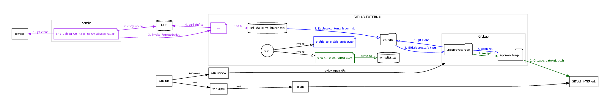

# Safe Haven Code Ingress

The Code Ingress workflow allows Safe Haven users to request access to software that is available as a git repository (at a publically-routable address).  Requests are for *snapshot* of the repository at a given commit SHA, and do not include the commit history, primarily to make reviewing feasible.

This might be the most convenient option if:
- the software is not available on the PyPy or CRAN package mirrors inside the SRE
- it is anticipated that the software may receive occaisional updates that are desired within the SRE

See also:
- [The section "Bring in new files to the SRE" of the Safe Haven User Guide](./safe_haven_user_guide#newspaper-bring-in-new-files-to-the-sre)
- [Provider Data Ingress](./provider-data-ingress.md) for a guide to bringing *data* into the SRE

## Code Ingress -- Workflow

[pdf](./images/code-ingress/gitlab-ingress.pdf)

Key:
- arrow with solid head: connection initiated from tail to head
- arrow with empty head: something else
- box: a virtual machine
- "document" symbol: a script - runs steps indicated by arrows of the same colour
- "folder" symbol: a git repo
- cylinder: data

There are two GitLab instances within the SRE: one visible internally, alongside the data (normally referred to as just the "GitLab" instance, but sometimes "internal" or "User" GitLab). The other is visible to some nominated code reviewers (referred to as the "Reviewer" GitLab), and is mostly isolated from the rest of the SRE, and in particular is not accessible from anywhere in the SRE where there is also access to data.

The ingress process moves code (a git repository) from the outside world to the Reviewer GitLab environment, then from there to the User GitLab (after approving reviews).  The steps of the process are as follows.

1. The User sends a request (out of band) for an external git resource to their Safe Haven point-of-contact, who either has administrator privileges or can forward the request to someone who does (for simplicity, we refer to this user as the "Admin").  The Admin should be authorized to clone this repository.
2. Admin can perform a preliminary check by themselves at this stage on the suitability of the software to be brought inside the SRE
3. Admin runs a command (`SRE_Upload_Git_Repo_to_GitlabExternal.ps1` in `deployment/administration`) to create a project on the Reviewer GitLab containing the repository snapshot.  They will need to pass as arguments to this script:
  - The SRE identifier
  - The GitHub URL to the requested repository
  - The name of the repo on the User GitLab (which may be different from the basename of the URL path to avoid name clashes, since all requested repos end up in a single namespace)
  - The full commit hash (to the requested snapshot)
  - The name of the branch to use (for this snapshot within the User GitLab)
4. A Reviewer logs in to the External GitLab. They will be able to see two groups: "unapproved" and "approved", with a repo with the above name in each. There will be an open Merge Request from the repo in "unapproved" to the one in "approved" with a single commit, of all changes introduced by the most recent snapshot (with the same effect as squashing all the commits since the last approved snapshot).
5. The Reviewer reviews the code using the usual GitLab facilities, with an opportunity for discussion with the other Reviewers, and then indicating their approval or disapproval.  They indicate their approval or disapproval using the "thumbs up" or "thumbs down" reaction to the Merge Request. (We do not currently have Merge Request approvals available on the version of GitLab within the SRE).
6. The merge is made automatically (by a cron job, running every 10 minutes), provided that:
  - there are two "thumbs up" responses to the GitLab Merge Request
  - there are no "thumbs down" responses
  - there are no unresolved discussions
7. All "approval" repos are mirrored to the User GitLab, where they belong to a special user ("Ingress"), and are visible alongside other user-created repositories there.
