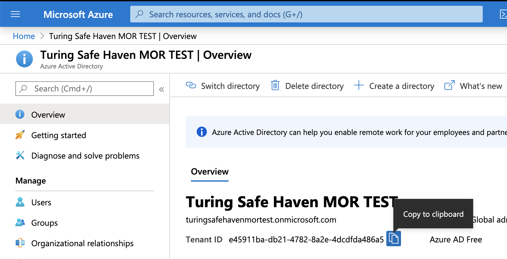
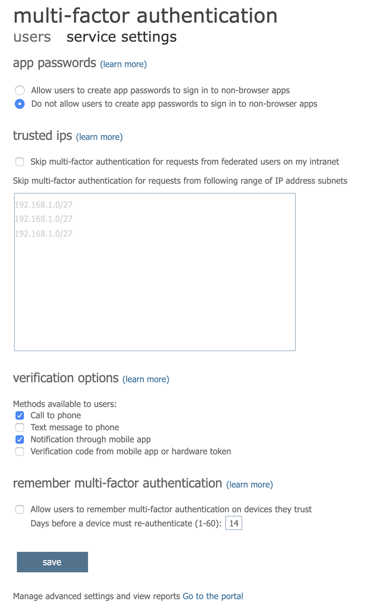
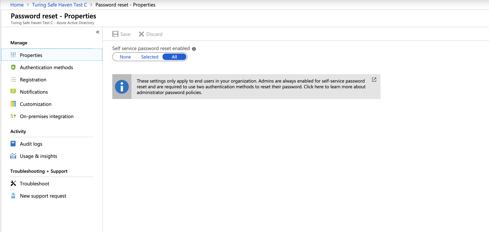

# Safe Haven Management Environment Build Instructions
These instructions will deploy a new Safe Haven Management Environment (SHM). This is required to manage your Secure Research Environments (SREs) and must be deployed before you create any SREs. A single SHM can manage all your SREs. Alternatively, you may run multiple SHMs concurrently (eg one for each Data Study Group).

## Contents
1. [Prerequisites](#1-prerequisites)
2. [Safe Haven Management configuration](#2-safe-haven-management-configuration)
3. [Configure DNS for the custom domain](#3-configure-dns-for-the-custom-domain)
4. [Setup Azure Active Directory (AAD)](#4-setup-azure-active-directory-aad)
5. [Deploy key vault for SHM secrets](#5-deploy-key-vault-for-shm-secrets)
6. [Setup Safe Haven administrators](#6-setup-safe-haven-administrators)
7. [Deploy and configure VNET and Domain Controllers](#7-deploy-and-configure-vnet-and-domain-controllers)
8. [Deploy and configure Network Policy Server (NPS)](#8-deploy-and-configure-network-policy-server-nps)
9. [Deploy package mirrors](#9-deploy-package-mirrors)
10. [Tear down SHM](#10-tearing-down-the-shm)

## 1. Prerequisites
- An Azure subscription with sufficient credits to build the environment in. If a subscription does not exist, create one with the name `Safe Haven Management <SHM ID>`, picking an SRE ID that is not yet in use and setting `<SHM ID>` to the value given in the config file, prefixing the subscription name with `[prod] ` or `[dev] ` to indicate whether it is a production or development environment.
  - This subscription should have an initial $3,000 for test and production sandbox environments, or the project specific budget for production project environments
  - The relevant Safe Haven Administrator Security Group must have the **Owner** role on the new subscription (e.g. "Safe Haven Test Admins" or "Safe Haven Production Admins").
  - You will need to be a member of the relevant security group.
- `PowerShell` with support for Azure and Azure Active Directory
  - Install [PowerShell v6.0 or above](https://docs.microsoft.com/en-us/powershell/scripting/install/installing-powershell)
  - Install the [Azure PowerShell Module](https://docs.microsoft.com/en-us/powershell/azure/install-az-ps)
  - Install the **cross-platform** AzureAD Powershell module:
    - :warning: The version of the AzureAD module installable from the standard Powershell Gallery installs on all platforms, but only works on **Windows**. We therefore use the cross-platform module to ensure consistent functionality and behaviour on all platforms.
    - Register the Powershell test gallery: `Register-PackageSource -Trusted -ProviderName 'PowerShellGet' -Name 'Posh Test Gallery' -Location https://www.poshtestgallery.com/api/v2/`
    - Install the cross-platform .NET Standard version of the `AzureAD` module `Install-Module AzureAD.Standard.Preview -Repository "Posh Test Gallery"`
- `Microsoft Remote Desktop`
  - On Mac this can be installed from the [apple store](https://itunes.apple.com/gb/app/microsoft-remote-desktop-10/id1295203466?mt=12)
- `OpenSSL`
  - Install using your package manager of choice

## 2. Safe Haven Management configuration

### Domain name
Choose a domain according to the following rules:
  - Turing production: a subdomain of the `turingsafehaven.ac.uk` domain
  - Turing testing: a subdomain of the `dsgroupdev.co.uk` domain
  - Other safe havens: follow your organisation's guidance. This may require purchasing a dedicated domain

### Management environment ID `<SHM ID>`
Choose a short ID `<SHM ID>` to identify the management environment (e.g. `testa`).

### Create configuration file

The core properties for the Safe Haven Management (SHM) environment must be present in the `environment_configs/core` folder. These are also used when deploying an SRE environment.
The following core SHM properties must be defined in a JSON file named `shm_<SHM ID>_core_config.json`. The `shm_testa_core_config.json` provides an example.

**NOTE:** The `netbiosName` must have a maximum length of 15 characters.

```json
{
    "subscriptionName": "Name of the Azure subscription the management environment is deployed in.",
    "domainSubscriptionName": "Name of the Azure subscription holding DNS records.",
    "adminSecurityGroupName" : "Name of the Azure Security Group that admins of this Safe Haven will belong to.",
    "computeVmImageSubscriptionName": "Azure Subscription name for compute VM.",
    "domain": "The fully qualified domain name for the management environment.",
    "netbiosname": "A short name to use as the local name for the domain. This must be 15 characters or fewer.",
    "shmId": "A short ID to identify the management environment.",
    "name": "Safe Haven deployment name.",
    "organisation": {
        "name": "Organisation name.",
        "townCity": "Location.",
        "stateCountyRegion": "Location.",
        "countryCode": "e.g. GB"
    },
    "location": "The Azure location in which the management environment VMs are deployed.",
    "ipPrefix": "The three octet IP address prefix for the Class A range used by the management environment. Use 10.0.0 for this unless you have a good reason to use another prefix."
}
```


## 3. Configure DNS for the custom domain

- Ensure you have the latest version of the Safe Haven repository from [https://github.com/alan-turing-institute/data-safe-haven](https://github.com/alan-turing-institute/data-safe-haven).
- Open a Powershell terminal and navigate to the `deployment/safe_haven_management_environment/setup` directory within the Safe Haven repository.
- Ensure you are logged into Azure within PowerShell using the command: `Connect-AzAccount`
- Run `./Setup_SHM_DNS_Zone.ps1 -shmId <SHM ID>`, where the SHM ID is the one specified in the config.
- If you see a message `You need to add the following NS records to the parent DNS system for...` you will need to add the NS records manually to the parent's DNS system, as follows:
  - To find the required values for the NS records on the portal, click `All resources` in the far left panel, search for "DNS Zone" and locate the DNS Zone with the SHM's domain. The NS record will list 4 Azure name servers.
  - Duplicate these records to the parent DNS system as follows:
    - If the parent domain has an Azure DNS Zone, create an NS record set in this zone. The name should be set to the subdomain (e.g. `testa`) or `@` if using a custom domain, and the values duplicated from above (for example, for a new subdomain `testa.dsgroupdev.co.uk`, duplicate the NS records from the Azure DNS Zone `testa.dsgroupdev.co.uk` to the Azure DNS Zone for `dsgroupdev.co.uk`, by creating a record set with name `testa`).
    <p align="center">
        
    </p>
    - If the parent domain is outside of Azure, create NS records in the registrar for the new domain with the same value as the NS records in the new Azure DNS Zone for the domain.


## 4. Setup Azure Active Directory (AAD)
### Create a new AAD
1. Login to the [Azure Portal](https://azure.microsoft.com/en-gb/features/azure-portal/)
2. Click `Create a Resource`  and search for `Azure Active Directory`
   <p align="center">
      
   </p>
3. Click `Create`
4. Set the `Organisation Name` to the value of `<name>` in your core configuration file (e.g. `Turing Development Safe Haven A`)
5. Set the `Initial Domain Name` to the `Organisation Name` all lower case with spaces removed (e.g. `turingdevelopmentsafehavena`)
6. Set the `Country or Region` to whatever region is appropriate for your deployment (e.g. `United Kingdom`)
7. Click `Create`
8. Wait for the AAD to be created


### Add the SHM domain to the new AAD
1. Navigate to the AAD you have created within the Azure portal. You ca n do this by:
    - Clicking the link displayed at the end of the initial AAD deployment.
    - Clicking on your username and profile icon at the top left of the Azure portal, clicking "Switch directory" and selecting the AAD you have just created from the "All Directories" section of "Directory + Subscription" panel that then displays.
2. Click `Overview` in the left panel and copy the `Tenant ID` displayed under the AAD name and initial `something.onmicrosoft.com` domain.
   <p align="center">
      
   </p>
3. Add the SHM domain:
    - Ensure you have the latest version of the Safe Haven repository from [https://github.com/alan-turing-institute/data-safe-haven](https://github.com/alan-turing-institute/data-safe-haven).
    - Open a Powershell terminal and navigate to the `deployment/safe_haven_management_environment/setup` directory within the Safe Haven repository.
    - **IMPORTANT** Ensure you are authenticated to the correct AAD within PowerShell using the command: `Connect-AzureAD -TenantId <aad-tenant-id>`, where `<aad-tenant-id>` is the `Tenant ID` you copied from the AAD portal `Overview` page in the previous step.
      - :warning: If you do not do this before running the next script, you will have to exit Powershell and start it again.
      - **Troubleshooting** If you get an error like `Connect-AzureAD: Could not load file or assembly 'Microsoft.IdentityModel.Clients.ActiveDirectory, Version=3.19.8.16603, Culture=neutral, PublicKeyToken=31bf3856ad364e35'. Could not find or load a specific file. (0x80131621)` then please open a new Powershell session and try again
    - Run `./Setup_SHM_AAD_Domain.ps1 -shmId <SHM ID>`, where the SHM ID is the one specified in the config.
    - :warning: Due to delays with DNS propagation, occasionally the script may exhaust the maximum number of retries without managing to verify the domain. If this occurs, run the script again. If it exhausts the number of retries a second time, wait an hour and try again.


## 5. Deploy key vault for SHM secrets
- Ensure you have the latest version of the Safe Haven repository from [https://github.com/alan-turing-institute/data-safe-haven](https://github.com/alan-turing-institute/data-safe-haven).
- Open a Powershell terminal and navigate to the `deployment/safe_haven_management_environment/setup` directory within the Safe Haven repository.
- Ensure you are logged into Azure within PowerShell using the command: `Connect-AzAccount`.
  - NB. If your account is a guest in additional Azure tenants, you may need to add the `-Tenant <Tenant ID>` flag, where `<Tenant ID>` is the ID of the Azure tenant you want to deploy into.
- Deploy and configure the RDS VMs by running `./Setup_SHM_KeyVault.ps1 -shmId <SHM ID>`, where the SHM ID is the one specified in the config
- This will take **a few minutes** to run.

## 6. Setup Safe Haven administrators

### Add global administrator
The User who creates the AAD will automatically have the Global Administrator (GA) Role (Users with this role have access to all administrative features in Azure Active Directory).

For some steps, a dedicated **internal** Global Administrator is required (e.g. to add P1 licences), so at least this additional administrator will need to be created.

1. Ensure your Azure Portal session is using the new Safe Haven Management (SHM) AAD directory. The name of the current directory is under your username in the top right corner of the Azure portal screen. To change directories click on your username at the top right corner of the screen, then `Switch directory`, then the name of the new SHM directory.
2. On the left hand panel click `Azure Active Directory`.
3. Navigate to `Users` and create a dedicated **internal** Global Administrator:
    - Click on `+ New user` and enter the following details:
      - Name: `AAD Global Admin`
      - Username: `admin@<SHM domain>`
      - Under `Groups and roles > Roles` change the role to `Global Administrator`
      - Under `Settings > Usage location` change the location to the same one you used when setting up this Active Directory (e.g. `United Kingdom`)
      - Click `Create`
    - Click on the username in the users list in the Azure Active Directory
    - Click the `Reset password` icon to generate a temporary password
    - Use this password to log into https://portal.azure.com as the user `admin@<SHM domain>`. You will either need to log out of your existing account or open an incognito/private browsing window.
    - When prompted to change your password on first login:
      - Look in the key vault under the `RG_SHM_SECRETS` resource group in the management subscription.
      - There should be a secret there called `shm-<SHM ID>-aad-admin-password`
      - Use this as the new password
      - If you are prompted to associate a phone number and email address with the account - do so.
    - Once you have set your password and logged in you can administer the Azure Active Directory with this user by selecting `Azure Active Directory` in the left hand sidebar

### Add additional administrators (optional)
Giving additional users the GA role, prevents the user you set up earlier from being a single point of failure.

1. Navigate to `Users` and add new admin users as above:
    - Click on `+New user` and enter the following details:
      - Name: `Admin - Firstname Lastname`
      - Username: `admin.firstname.lastname@<SHM domain>`
      - Under `Groups and roles > Roles` change the role to `Global Administrator`
      - Under `Settings > Usage location` change the location to `United Kingdom`
      - Click `Create`
2. Let Azure set their passwords. They can reset these later.

NB. You can also invite guest users from other Azure Active Directories at this stage
- If their account (`user@domain`) does not have an associated mailbox, invite them as normal and then give them a direct link to the portal for a specific tenant (i.e. `https://portal.azure.com/<tenant id>`). When they click this they will get taken through the same process that would have happened from the email link. [Via Microsoft documentation](https://docs.microsoft.com/en-us/azure/active-directory/b2b/redemption-experience)

### Enable MFA
To enable MFA, purchase sufficient licences and add them to all the new users.
- You will also need licences for standard users accessing the Safe Haven.

1. Ensure that you are logged in as a global admin user (e.g. the `admin@<SHM domain>` account you set up earlier)
  - Navigate to `Azure Active Directory` in the portal
  - Click on `Manage > Licences` in the left hand sidebar
  - Click on `All products` in the left hand sidebar
  - Click on the `+Try/Buy` text above the empty product list
  - **For production** buy P1 licences:
    - Click the `Purchase services` link in the information panel above the trial options.
    - In the "Microsoft 365 Admin Centre" portal that opens:
      - Expand the `Billing` section of the left hand side bar
      - Click on `Purchase services`
      - Scroll down the list of products and select `Azure Active Directory Premium P1` and click `Buy`
      - Select `Pay monthly`
      - Enter the number of licences required.
      - Leave `automatically assign all of your users with no licences` checked
      - Click `Check out now`
      - Enter the address of the organisation running the Safe Haven on the next screen
      - Click next and enter payment details when requested
  - **For testing** you can enable a free trial of the P2 License (NB. It can take a while for these to appear on your AAD)
    - Expand the `Free trial` arrow under `Azure AD Premium P2`
    - Click the `Activate` button
    - Wait for around 20 minutes until the `Azure AD Premium P2` licences appear on the list of `All Products`

2. Add licenses to one or more users
  - Click on `Users` in the left hand sidebar
  - For each user you want to add a licence to, click on their username
    - Ensure that the user has `usage location` set under "Settings" (see image below):
      <p align="center">
          
      </p>
    - Click on `Licences` in the left hand sidebar
    - Click on `+ Assignments` in the top bar
    - Assign `Azure Active Directory Premium P1` and `Microsoft Azure Multi-Factor Authentication` then click `Save`

3. Configure MFA on Azure Active Directory
  - Sign in to the Azure portal as a user administrator or global administrator.
  - Go to `Azure Active Directory` then click `Manage > Security` in the left hand side bar
  - Click `Manage > MFA` in the left hand side bar
  - Click on the `Additional cloud-based MFA settings` link in the `Configure` section of the main panel (if this is not available, trying signing out of the portal and back in again)
  - Configure MFA as follows:
    - In the `App passwords` section select `Do not allow users to create app passwords to sign in to non-browser apps`
    - In the `Verification options` section.
      - **check** `Call to phone` and `Notification through mobile app`
      - **uncheck** `Text message to phone` and `Verification code from mobile app or hardware token`
    - In `Remember multi-factor authentication` section
      - ensure `Allow users to remember multi-factor authentication on devices they trust` is **unchecked**
    - Click "Save" and close window
      <p align="center">
          
      </p>

4. Require MFA for all admins
  - Sign in to the Azure portal as a user administrator or global administrator.
  - Go to `Azure Active Directory` then click `Manage > Properties` in the left hand side bar
  - Click `Manage Security Defaults` at the bottom of the blade.
  - Switch `Enable Security Defaults` to `No`
  - Check `My organization is using Conditional Access`
  - Click `Save`
  - Go to `Azure Active Directory` then click `Manage > Security` in the left hand side bar
  - Click on `Protect > Conditional access` in the left hand sidebar
  - Click `+ New Policy`
  - Call the policy `Require MFA for admins`
  - Under `Assignments` select `Users and groups`
    - Under `Include > Select users and groups` tick `Directory roles` and select the following roles:
      - `Global Administrator`
      - `SharePoint Administrator`
      - `Exchange Administrator`
      - `Conditional Access Administrator`
      - `Security Administrator`
      - `Helpdesk Administrator`
      - `Password Administrator`
      - `Billing Administrator`
      - `User Administrator`
  - Under `Access controls` select `Grant`
    - Under `Grant access` tick `Require multi-factor authentication`
  - Under `Enable policy` select `On`
  - Click `Create`


## 7. Deploy and configure VNET and Domain Controllers

### Deploy the Virtual Network and Active Directory Domain Controller
- Ensure you have the latest version of the Safe Haven repository from [https://github.com/alan-turing-institute/data-safe-haven](https://github.com/alan-turing-institute/data-safe-haven).
- Open a Powershell terminal and navigate to the `deployment/safe_haven_management_environment/setup` directory within the Safe Haven repository.
- Ensure you are logged into Azure within PowerShell using the command: `Connect-AzAccount`
  - NB. If your account is a guest in additional Azure tenants, you may need to add the `-Tenant <Tenant ID>` flag, where `<Tenant ID>` is the ID of the Azure tenant you want to deploy into.
- Deploy and configure the RDS VMs by running `./Setup_SHM_DC.ps1 -shmId <SHM ID>`, where the SHM ID is the one specified in the config
- This will take **around one hour** to run.
- Once the script exits successfully you should see the following resource groups under the SHM subscription:
  <p align="center">
      
  </p>

### Download a client VPN certificate for the Safe Haven Management VNet
1. Navigate to the SHM Key Vault via `Resource Groups -> RG_SHM_SECRETS -> kv-shm-<SHM ID>`, where `<SHM ID>` will be the one defined in the config file.
2. Once there open the "Certificates" page under the "Settings" section in the left hand sidebar.
3. Click on the certificate named `shm-<SHM ID>-vpn-client-cert`, click on the "current version" and click the "Download in PFX/PEM format" link.
4. To install, double click on the downloaded certificate (or on OSX you can manually drag it into the "login" keychain), leaving the password field blank.

**Make sure to securely delete the "\*.pfx" certificate file after you have installed it.**


### Configure a VPN connection to the Safe Haven Management VNet
1. Navigate to the Safe Haven Management (SHM) VNet gateway in the SHM subscription via `Resource Groups -> RG_SHM_NETWORKING -> VNET_SHM_<SHM ID>_GW`, where `<SHM ID>` will be the one defined in the config file.
2. Once there open the "Point-to-site configuration page under the "Settings" section in the left hand sidebar (see image below).
3. Click the "Download VPN client" link at the top of the page to get the root certificate (`VpnServerRoot.cer`) and VPN configuration file (`VpnSettings.xml`)
   <p align="center">
       
   </p>
4. Read through the following notes, then follow the [VPN set up instructions](https://docs.microsoft.com/en-us/azure/vpn-gateway/point-to-site-vpn-client-configuration-azure-cert) using the Windows or Mac sections as appropriate.

**NOTES:**
- **You do not need to install the `VpnServerRoot.cer` certificate, as we're using our own self-signed root certificate**
- Use SSTP (Windows) or IKEv2 (OSX) for the VPN type
- Name the VPN connection "Safe Haven Management Gateway (`<SHM ID>`)", where `<SHM ID>` will be the one defined in the config file.
- **Windows:** do not rename the VPN client as this will break it
- **Windows:** you may get a "Windows protected your PC" pop up. If so, click `More info -> Run anyway`.
- **OSX:** you can view the details of the downloaded certificate by highlighting the certificate file in Finder and pressing the spacebar. You can then look for the certificate of the same name in the login KeyChain and view its details by double clicking the list entry. If the details match the certificate has been successfully installed.

You should now be able to connect to the SHM virtual network via the VPN. Each time you need to access the virtual network ensure you are connected via the VPN.


### Access the first Domain Controller (DC1) via Remote Desktop
1. Open Microsoft Remote Desktop
2. Click `Add Desktop`
3. In the Azure portal, navigate to the `RG_SHM_DC` resource group and then to the `DC1-SHM-<SHM ID>` virtual machine (VM).
4. Copy the Private IP address and enter it in the `PC name` field on remote desktop. Click Add.
5. Double click on the desktop that appears under `saved desktops`.
6. Log in as a **domain** user (ie. `<admin username>@<SHM domain>`) using the username and password obtained from the Azure portal as follows:
rather than simply `<admin username>`)
  - On the Azure portal navigate to the `RG_SHM_SECRETS` resource group and then the `kv-shm-<SHM ID>` key vault and then select `secrets` on the left hand panel.
  - The username is the `shm-<SHM ID>-vm-admin-username` secret. Add your custom AD domain to the username so the login is `<admin username>@SHM domain>` rather than simply `<admin username>`.
  - The password in the `shm-<SHM ID>-domain-admin-password` secret.
7. If you see a warning dialog that the certificate cannot be verified as root, accept this and continue.

### Install Azure Active Directory Connect
1. Navigate to `C:\Installation`
2. Run the `AzureADConnect.msi` installer
  - On the `Welcome to Azure AD Connect` screen:
    - Tick the `I agree to the license terms` box
    - Click `Continue`
  - On the `Express Settings` screen:
    - Click `Customize`
  - On the `Install required components` screen:
    - Click `Install`
  - On the `User sign-in` screen:
    - Ensure that `Password Hash Synchronization` is selected
    - Click `Next`
  - On the `Connect to Azure AD` screen:
    - Provide a global administrator details for the Azure Active Directory you are connected to
    - You should have created `admin@<SHM domain>` during the `Add additional administrators` step and its password should be stored in the Key Vault
      - If you receive an Internet Explorer pop-up dialog `Content within this application coming from the website below is being blocked by Internet Explorer Advanced Security Configuration: https://login.microsoft.com`
        - Click `Add`
        - Click `Add`
        - Click `Close`
        - Repeat for the same dialog with `https://aadcdn.msftauth.net`
      - If you receive an error box `We can't sign you in,. Javascript is required to sign you in. Do you want to continue running scripts on this page`
        - Click `Yes`
        - Close the dialog by clicking `X`
    - Enter the global administrator password if prompted
    - Back on the `Connect to Azure AD` screen, click `Next`
    - Approve the login with MFA if required
      - If you see a Windows Security Warning, check `Don't show this message again` and click `Yes`.
  - On the `Connect your directories` screen:
    - Ensure that correct forest (your custom domain name; e.g `turingsafehaven.ac.uk`) is selected and click `Add Directory`
    - On the `AD forest account` pop-up:
      - Select `Use existing AD account`
      - Enter the details for the `localadsync` user.
        - Username: `localadsync@<SHM domain>` (e.g. localadsync)
        - Password: use the `shm-<SHM ID>-localadsync-password` secret in the management Key Vault.
      - Click `OK`
      - **Troubleshooting:** if you get an error that the username/password is incorrect or that the domain/directory could not be found, try resetting the password for this user to the secret value from the `shm-<SHM ID>-localadsync-password` secret in the management Key Vault.
          - In Server Manager click `Tools > Active Directory Users and Computers`
          - Expand the domain in the left hand panel
          - Expand the `Safe Haven Service Accounts` OU
          - Right click on the "Local AD Sync Administrator" user and select "reset password"
          - Set the password to the the secret value from the `shm-<SHM ID>-localadsync-password` secret in the management Key Vault.
          - Leave the other settings as is and click `OK`
    - Click `Next`
  - On the `Azure AD sign-in configuration` screen:
    - Verify that the `User Principal Name` is set to `userPrincipalName`
    - Click `Next`
  - On the `Domain and OU filtering` screen:
    - Select `Sync Selected domains and OUs`
    - Expand the domain and deselect all objects
    - Select `Safe Haven Research Users`
    - Click `Next`
  - On the `Uniquely identifying your users` screen:
    - Click `Next`
  - On the `Filter users and devices` screen:
    - Select `Synchronize all users and devices`
    - Click `Next`
  - On the `Optional features` screen:
    - Select `Password Writeback`
    - Click `Next`
  - On the `Ready to configure` screen:
    - Click `Install`
    - This may take a few minutes to complete
  - On the `Configuration complete` screen:
    - Click `Exit`

  - **Troubleshooting:** The error `Directory synchronization is currently in a pending disabled state for this directory. Please wait until directory synchronization has been fully disabled before trying again` may occur if you have recently torn down another SHM linked to the same Azure Active Directory. You need to wait for the Azure Active Directory to fully disconnect - this can take up to 72 hours but is typically sooner. You do not need to close the installer window while waiting. If you need to, you can disconnect from the RDS and VPN and reconnect later before clicking `Retry`.

### Additional AAD Connect Configuration
This step allows the locale (country code) to be pushed from the local AD to the Azure Active Directory.

1. Update the AAD rules
  - Open Powershell as an administrator
  - Run `C:\Installation\UpdateAADSyncRule.ps1`


### Validation of AD sync
1. Add yourself as a new Active Directory user:
  - In Server Manager select `Tools > Active Directory Users and Computers` (or open the `Active Directory Users and Computers` desktop app directly)
  - Expand the domain
  - Right click on the `Safe Haven Research Users` OU and select `New -> User`
  - Create a new user:
    - First name: `<your first name>`
    - Last name: `<your last name>`
    - User login name: `<your first name>.<your last name>`
    - Click `Next`
  - Password:
    - Choose something that is
      - At least 6 characters
      - Contains uppercase, lowercase and digits
    - Ensure that `User must change password at next logon` is ticked
    - Ensure that `Password never expires` is not ticked
    - Click `Next`
  - Click `Finish`
2. Set the correct region
  - The user you have just created should now appear in the list of `Safe Haven Research Users` (if not, then right click and select `Refresh`)
  - Right click on this user and select `Properties`
  - Go to the `Address` tab and under the `Country/region` drop-down select `United Kingdom`
3. Force a sync to the Azure Active Directory
  - Open Powershell as an administrator
  - Run `C:\Installation\Run_ADSync.ps1 -sync Initial`
4. Go to the Azure Active Directory in `portal.azure.com`
  - Click `Users > All users` and confirm that the new user is shown in the user list.
  - It may take a few minutes for the synchronisation to fully propagate in Azure.

### Configure AAD side of AD connect
1. Go to the Azure Active Directory in `portal.azure.com`
  - Select `Manage > Password reset` from the left hand menu
2. Select `On-premises integration` from the left hand side bar
  - Ensure `Write back passwords to your on-premises directory` is set to yes.
    <p align="center">
        
    </p>
  - If you changed this setting, click the `Save` icon
- Select `Properties` from the left hand side bar
  - Make sure that `Self service password reset enabled` is set to `All`
    <p align="center">
        
    </p>
  - If you changed this setting, click the `Save` icon


## 8. Deploy and configure Network Policy Server (NPS)
- Ensure you have the latest version of the Safe Haven repository from [https://github.com/alan-turing-institute/data-safe-haven](https://github.com/alan-turing-institute/data-safe-haven).
- Open a Powershell terminal and navigate to the `deployment/safe_haven_management_environment/setup` directory within the Safe Haven repository.
- Ensure you are logged into Azure within PowerShell using the command: `Connect-AzAccount`
  - NB. If your account is a guest in additional Azure tenants, you may need to add the `-Tenant <Tenant ID>` flag, where `<Tenant ID>` is the ID of the Azure tenant you want to deploy into.
- Deploy and configure the RDS VMs by running `./Setup_SHM_NPS.ps1 -shmId <SHM ID>`, where the SHM ID is the one specified in the config
- This will take **around 20 minutes** to run.
  - **Troubleshooting:** If you see an error similar to `New-AzResourceGroupDeployment : Resource Microsoft.Compute/virtualMachines/extensions NPS-SHM-<SHM ID>/joindomain' failed with message` you may find this error resolves if you wait and retry later. Alternatively, you can try deleting the extension from the `NPS-SHM-<SHM ID> > Extensions` blade in the Azure portal.

### Configure NPS server
1. Log in to the NPS Server VM using Microsoft Remote Desktop
  - the private IP address for the SHM NPS VM can be found in the `RG_SHM_NPS` resource group
  - the Username and Password are the same as for `DC1-SHM` and `DC2-SHM` (ie the credentials you used above to Remote Desktop into the domain controller above):
  - To obtain the login credentials again, on the Azure portal navigate to the `RG_SHM_SECRETS` resource group and then the `kv-shm-<SHM ID>` key vault and then select `secrets` on the left hand panel.
  - The username is the `shm-<SHM ID>-vm-admin-username` secret plus the domain, ie `<admin username>@custom domain`
  - The password in the `shm-<SHM ID>-domain-admin-password` secret.
2. In Server Manager select `Tools > Network Policy Server` (or open the `Network Policy Server` desktop app directly)
3. Configure NPS server to log to a local text file:
  - Select `NPS (Local) > Accounting` on the left-hand sidebar
    <p align="center">
        
    </p>
  - Click on `Accounting > Configure Accounting`
    - On the `Introduction` screen, click `Next`.
    - On the `Select Accounting Options` screen, select `Log to text file on the local computer` then click `Next`.
    - On the `Configure Local File Logging` screen, click `Next`.
    - On the `Summary` screen, click `Next`.
    - On the `Conclusions` screen, click `Close`.
  - Click on `Log file properties > Change log file properties`
    - On the `Log file` tab, select `Daily` under `Create a new log file`
    - Click `Ok`


### MFA Configuation
1. Configure MFA settings:
  - Open Powershell as an administrator
  - Run `& "C:\Program Files\Microsoft\AzureMfa\Config\AzureMfaNpsExtnConfigSetup.ps1"`
  - Enter `A` when prompted
  - If you are prompted to add webpages to exceptions then accept them.
  - **NOTE:** You may get a Javascript error. If you do, simply run this script again.
2. On the webpage pop-up, sign in as the `Global Administrator` (eg. `admin@<SHM domain>`) user. Other administrators added as guests will not work for this step.
  - If you have not done so already, you may be prompted to add a phone number and backup email for the `admin@<SHM domain>` account at this point.
3. When prompted to `Provide your Tenant ID`, enter your Azure Active Directory ID. To get this:
  - In the Azure portal select `Azure Active Directory` in the left hand side bar
  - Select `Properties` in the left hand side bar
  - Copy the `Directory ID` field
  - **Troubleshooting:** If you see an error `New-MsolServicePrincipalCredential : Service principal was not found`, this indicates that the `Azure Multi-Factor Auth Client` is not enabled in Azure Active Directory.
    - Look at [the documentation here](https://docs.microsoft.com/en-us/azure/active-directory/authentication/howto-mfa-nps-extension#troubleshooting).
    - Make sure the Safe Haven Azure Active Directory has valid P1 licenses:
      - Go to the Azure Portal and click `Azure Active Directories` in the left hand side bar
      - Click `Licenses`in the left hand side bar then `Manage > All products`
      - You should see `Azure Active Directory Premium P1` in the list of products, with a non-zero number of available licenses.
        - If you do not have P1 licences, purchase some following the instructions at the end of the [Add additional administrators](#Add-additional-administrators) section above, making sure to also follow the final step to configure the MFA settings on the Azure Active Directory.
      - If you are using the trial `Azure Active Directory Premium P2` licences, you may find that enabling a trial of `Enterprise Mobility + Security E5` licences will resolve this.
    - Make sure that you have added a P1 licence to at least one user in the `Azure Active Directory` and have gone through the MFA setup procedure for that user. You may have to wait a few minutes after doing this
    - If you've done all of these things and nothing is working, you may have accidentally removed the `Azure Multi-Factor Auth Client` Enterprise Application from your `Azure Active Directory`. Run `C:\Installation\Ensure_MFA_SP_AAD.ps1` to create a new service principal and try the previous steps again.
  - **Troubleshooting:** If you get a `New-MsolServicePrincipalCredential: Access denied` error stating `You do not have permissions to call this cmdlet`, check the following:
    - Make sure you are logged in to the NPS server as a **domain** user rather than a local user.
      - The output of the `whoami` command in Powershell should be `<SHM netBios domain>\admin` rather than `NPS-SHM-<SHM ID>\admin`.
      - If it is not, reconnect to the remote desktop with the username `admin@<SHM domain>`, using the same password as before
    - Make sure you authenticate to `Azure Active Directory` as the native `Global Administrator` (`admin@<SHM domain>`) user when prompted by the script. Other administrators added as guests will not work for this step.
4. At the message `Configuration complete. Press Enter to continue`, press `Enter`


## 9. Deploy package mirrors
### When to deploy mirrors
A full set of Tier 2 mirrors take around 4 days to fully synchronise with the external package repositories, so you may want to kick off the building of these mirrors before deploying your first SRE.

### Deploying package mirrors
- Ensure you have the latest version of the Safe Haven repository from [https://github.com/alan-turing-institute/data-safe-haven](https://github.com/alan-turing-institute/data-safe-haven).
- Open a Powershell terminal and navigate to the `deployment/safe_haven_management_environment/setup` directory within the Safe Haven repository.
- Ensure you are logged into Azure within PowerShell using the command: `Connect-AzAccount`
  - NB. If your account is a guest in additional Azure tenants, you may need to add the `-Tenant <Tenant ID>` flag, where `<Tenant ID>` is the ID of the Azure tenant you want to deploy into.
- Deploy and configure the RDS VMs by running `./Setup_SHM_Package_Mirrors.ps1 -shmId <SHM ID> -tier <desired tier eg. '2'>`, where the SHM ID is the one specified in the config
- This will take **around 30 minutes** to run.

### [Optional] Tearing down package mirrors
During normal usage, you should not need to tear down the package mirrors, but if you decide to do so, use the following procedure:
- Ensure you have the latest version of the Safe Haven repository from [https://github.com/alan-turing-institute/data-safe-haven](https://github.com/alan-turing-institute/data-safe-haven).
- Open a Powershell terminal and navigate to the `deployment/safe_haven_management_environment/setup` directory within the Safe Haven repository.
- Ensure you are logged into Azure within PowerShell using the command: `Connect-AzAccount`
  - NB. If your account is a guest in additional Azure tenants, you may need to add the `-Tenant <Tenant ID>` flag, where `<Tenant ID>` is the ID of the Azure tenant you want to deploy into.
- Deploy and configure the RDS VMs by running `./Teardown_SHM_Package_Mirrors.ps1 -shmId <SHM ID> -tier <desired tier eg. '2'>`, where the SHM ID is the one specified in the config
- This will take **a few minutes** to run.

## 10. Tearing down the SHM
In order to tear down the SHM, use the following procedure:

### Disconnect from the Azure Active Directory
1. Using Microsoft Remote Desktop, connect to the `DC1-SHM-<SHM ID>` virtual machine (VM).
2. Log in as a **domain** user (ie. `<admin username>@<SHM domain>`) using the username and password obtained from the Azure portal.
3. If you see a warning dialog that the certificate cannot be verified as root, accept this and continue.
4. Open Powershell as an administrator
  - Navigate to `C:\Installation`
  - Run `.\Disconnect_AD.ps1`
  - You will need to provide login credentials (including MFA if set up) for `<admin username>@<SHM domain>`
5. Full disconnection of the Azure Active Directory can take up to 72 hours but is typically less. If you are planning to install a new SHM connected to the same Azure Active Directory you may find the `AzureADConnect` installation step requires you to wait for the previous disconnection to complete.

### Tear down any attached SREs then the SHM
- Ensure you have the latest version of the Safe Haven repository from [https://github.com/alan-turing-institute/data-safe-haven](https://github.com/alan-turing-institute/data-safe-haven).
- Open a Powershell terminal and navigate to the `deployment/administration` directory within the Safe Haven repository.
- Ensure you are logged into Azure within PowerShell using the command: `Connect-AzAccount`
  - NB. If your account is a guest in additional Azure tenants, you may need to add the `-Tenant <Tenant ID>` flag, where `<Tenant ID>` is the ID of the Azure tenant you want to deploy into.
- For each SRE that each attached to the SHM, do the following:
  - Tear down the SRE by running `./SRE_Teardown.ps1 -sreId <SRE ID>`, where the SRE ID is the one specified in the relevant config file
- Tear down the SHM by running `./SHM_Teardown.ps1 -shmId <SHM ID>`, where the SHM ID is the one specified in the config

## Server list
The following 3 virtual machines are created as a result of these instructions:
- `DC1-SHM-TESTC` (primary domain controller)
- `DC2-SHM-TESTC` (secondary domain controller)
- `NPS-SHM-TESTC` (network policy server)
