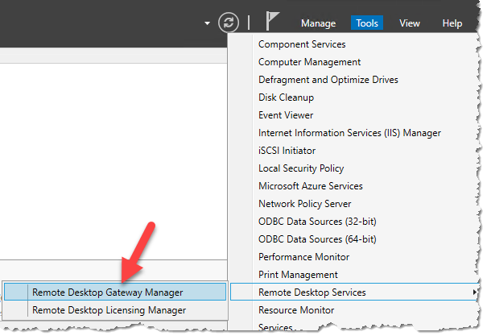
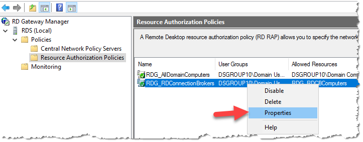
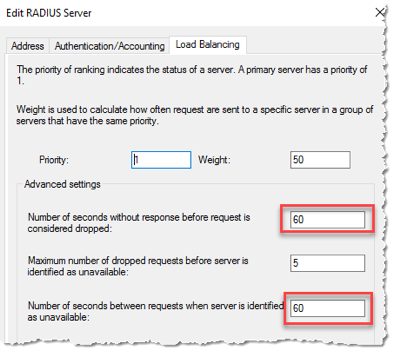

# Secure Research Environment Build Instructions
The following instructions will walk you through deploying a Secure Research Environment. This assumes the Safe Haven Management (SHM) environment has already been set up.

## Contents
1. [Prerequisites](#1-prerequisites)
2. [Define SRE configuration](#2-define-sre-configuration)
3. [Prepare Safe Haven Management deployment](#3-prepare-safe-haven-management-shm-environment)
4. [Deploy Virtual Network and Remote Desktop](#4-deploy-virtual-network-and-remote-desktop)
5. [Deploy Data Server](#5-deploy-data-server)
6. [Deploy Web Application Servers (GitLab and HackMD)](#6-deploy-web-application-servers-gitlab-and-hackmd)
7. [Deploy initial shared data science VM](#7-deploy-initial-shared-data-science-vm)
8. [Apply network configuration](#8-apply-network-configuration)
9. [Run smoke tests on shared compute VM](#9-run-smoke-tests-on-shared-compute-vm)
10. [Tearing down the SRE](#10-tearing-down-the-sre)

## 1. Prerequisites
- An Azure subscription with sufficient credits to build the environment in. If a subscription does not exist, create one with the name `Secure Research Environment <SRE ID> (<SHM ID>)`, picking an SRE ID that is not yet in use and setting `<SHM ID>` to the ID of the SHM deployment this SRE will be deplyed against, prefixing the subscription name with `[prod] ` or `[dev] ` to indicate whether it is a production or development environment.
  - This subscription should have an initial $3,000 for test and production sandbox environments, or the project specific budget for production project environments
  - The relevant Safe Haven Administrator Security Group must have the **Owner** role on the new subscription (e.g. "Safe Haven Test Admins" or "Safe Haven Production Admins").
  - You will need to be a member of the relevant security group. This will give you the administrative access to:
    - the relevant Safe Haven Management Azure subscription
    - the relevant Safe Haven Management Active Directory Domain
    - the relevant Safe Haven Management VMs
- `PowerShell` for Azure
  - Install [PowerShell v6.0 or above](https://docs.microsoft.com/en-us/powershell/azure/install-az-ps?view=azps-2.2.0)
  - Install the Azure [PowerShell Module](https://docs.microsoft.com/en-us/powershell/azure/install-az-ps?view=azps-2.2.0&viewFallbackFrom=azps-1.3.0)
- `Microsoft Remote Desktop`
  - On Mac this can be installed from the [apple store](https://itunes.apple.com/gb/app/microsoft-remote-desktop-10/id1295203466?mt=12)
- `OpenSSL`
  - Install using your package manager of choice

### Download a client VPN certificate for the Safe Haven Management VNet
- Navigate to the Safe Haven Management (SHM) key vault in the Safe Haven Management subscription via `Resource Groups -> RG_SHM_SECRETS -> kv-shm-<SHM ID>`.
- Once there open the "Certificates" page under the "Settings" section in the left hand sidebar.
- Click on the certificate named `shm-<SHM ID>-vpn-client-cert`, click on the "current version" and click the "Download in PFX/PEM format" link.
- To install, double click on the downloaded certificate, leaving the password field blank.
- **Make sure to securely delete the "\*.pfx" certificate file after you have installed it.**
-  This certificate will also allow you to connect via VPN to the SRE VNets once deployed.

### Configure a VPN connection to the Safe Haven Management VNet
- Navigate to the Safe Haven Management (SHM) VNet gateway in the SHM subscription via `Resource Groups -> RG_SHM_NETWORKING -> VNET_SHM_<SHM ID>_GW`, where `<SHM ID>` is defined in the config file. Once there open the "Point-to-site configuration page under the "Settings" section in the left hand sidebar (see image below).
    
- Click the "Download VPN client" link at the top of the page to get the root certificate (`VpnServerRoot.cer`) and VPN configuration file (`VpnSettings.xml`), then follow the [VPN set up instructions](https://docs.microsoft.com/en-us/azure/vpn-gateway/point-to-site-vpn-client-configuration-azure-cert) using the Windows or Mac sections as appropriate.
- :warning: **Windows:** you may get a "Windows protected your PC" pop up. If so, click `More info -> Run anyway`
- :warning: **Windows:** do not rename the VPN client as this will break it
- :pencil: **OSX** double clicking on the root certificate may not result in any pop-up dialogue, but the certificate should still be installed. You can view the details of the downloaded certificate by highlighting the certificate file in Finder and pressing the spacebar. You can then look for the certificate of the same name in the login KeyChain and view its details by double clicking the list entry. If the details match the certificate has been successfully installed.
- :pencil: **OSX** on Catalina you may have to drag the certificate into your personal KeyChain as the default is to install system-wide
- :pencil: **OSX** on Catalina, the Authentication Settings step is quite counter-intuitive: you must select "None" from the drop-down (not "Certificate") and then select the "Certificate" radio button underneath (see screenshot).
  
- Continue to follow the set up instructions from the link above, using SSTP (Windows) or IKEv2 (OSX) for the VPN type and naming the VPN connection "Safe Haven Management Gateway (`<SHM ID>`)", where `<SHM ID>` is defined in the config file.

### Access to a public routable domain name for the SRE and its name servers
  - This can be a subdomain of the Safe Haven Management domain, e.g, `sandbox.testb.dsgroupdev.co.uk`, or a top-level domain (eg. `dsgroup100.co.uk`))

### Deploying multiple SREs in parallel
**NOTE:** You can only deploy to **one SRE at a time** from a given computer as both the `Az` CLI and the `Az` Powershell module can only work within one Azure subscription at a time. For convenience we recommend using one of the Safe Haven deployment VMs on Azure for all production deploys. This will also let you deploy compute VMs in parallel to as many SREs as you have deployment VMs. See the [parallel deployment guide](../azure-vms/README-parallel-deploy-using-azure-vms.md) for details.


## 2. Define SRE configuration
The full configuration details for a new SRE are generated by defining a few "core" properties for the new SRE and the management environment in which it will be deployed.

### Core SHM configuration properties
The core properties for the relevant pre-existing Safe Haven Management (SHM) environment must be present in the `environment_configs/core` folder.
The following core SHM properties must be defined in a JSON file named `shm_<SHM ID>_core_config.json`.

**NOTE:** The `netbiosName` fields must have a maximum length of 15 characters.

```json
{
    "subscriptionName": "Name of the Azure subscription the management environment is deployed in",
    "domainSubscriptionName": "Name of the Azure subscription holding DNS records",
    "adminSecurityGroupName" : "Name of the Azure Security Group that admins of this Safe Haven will belong to",
    "computeVmImageSubscriptionName": "Azure Subscription name for compute VM",
    "domain": "The fully qualified domain name for the management environment",
    "netbiosname": "A short name to use as the local name for the domain. This must be 15 characters or less",
    "shmId": "A short ID to identify the management environment",
    "name": "Safe Haven deployment name",
    "organisation": {
        "name": "Organisation name",
        "townCity": "Location",
        "stateCountyRegion": "Location",
        "countryCode": "e.g. GB"
    },
    "location": "The Azure location in which the management environment VMs are deployed",
    "ipPrefix": "The three octet IP address prefix for the Class A range used by the management environment. Use 10.0.0 for this unless you have a good reason to use another prefix."
}
```

### Core SRE configuration properties

The core properties for the new SRE environment must be present in the `environment_configs/core` folder.
The following core SRE properties must be defined in a JSON file named `sre_<SRE ID>_core_config.json`.

```json
{
    "subscriptionName": "Name of the Azure subscription the secure research environment is deployed in",
    "adminSecurityGroupName" : "Name of the Azure Security Group that admins of this SHM belong to",
    "sreId": "A short ID to identify the secure research environment. This *must be* 7 characters or less; if not it will be truncated in some places which might cause problems if those characters are not unique.",
    "shmId": "The short ID for the SHM segment to deploy against",
    "tier": "The data classification tier for the SRE. This controls the outbound network restrictions on the SRE and which mirror set the SRE is peered with",
    "domain": "The fully qualified domain name for the SRE",
    "netbiosname": "A short name to use as the local name for the domain. This *must be* 15 characters or less. If the first part of the domain is less than 15 characters, use this for the netbiosName",
    "ipPrefix": "The three octet IP address prefix for the Class A range used by the management environemnt",
    "rdsAllowedSources": "A comma-separated string of IP ranges (addresses or CIDR ranges) from which access to the RDS webclient is permitted. For Tier 0 and 1 this should be 'Internet'. For Tier 2 this should correspond to the any organisational networks (including guest networks) at the partner organisations where access should be permitted from (i.e. any network managed by the organsiation, such as EduRoam, Turing Guest, Turing Secure etc). For Tier 3 SREs, this should correspond to the RESTRICTED networks at the partner organisations. These should only permit connections from within meduim security access controlled physical spaces and from managed devices (e.g. Turing Secure). Using 'default' will use the default Turing networks.",
    "rdsInternetAccess": "Whether to allow outbound internet access from inside the remote desktop environment. Either 'Allow', 'Deny' or 'default' (for Tier 0 and 1 'Allow' otherwise 'Deny')",
    "computeVmImageType": "The name of the Compute VM image (most commonly 'Ubuntu')",
    "computeVmImageVersion": "The version of the Compute VM image (e.g. 0.1.2019082900)"
}
```

### SRE IP Address prefix

Each SRE must be assigned its own unique IP address space, and it is very important that address spaces do not overlap in the environment as this will cause network faults. The address spaces use a private class A range and use a 21-bit subnet mask. This provides ample addresses for a SRE and capacity to add additional subnets should that be required in the future.

### Generate full configuration for SRE
- Ensure you have the latest version of the Safe Haven repository from [https://github.com/alan-turing-institute/data-safe-haven](https://github.com/alan-turing-institute/data-safe-haven).
- Open a Powershell terminal and navigate to the top-level folder within the Safe Haven repository.
- Generate a new full configuration file for the new SRE using the following commands.
  - `Import-Module ./deployment/common/Configuration.psm1 -Force`
  - `Add-SreConfig -sreId <SRE ID>`, where `<SRE ID>` is a short string, e.g. `sandbox` for `sandbox.dsgroupdev.co.uk`
- A full configuration file for the new SRE will be created at `environment_configs/full/sre_<SRE ID>_full_config.json`. This file is used by the subsequent steps in the SRE deployment.
- Commit this new full configuration file to the Safe Haven repository

## 3. Prepare Safe Haven Management (SHM) environment
- Ensure you have the latest version of the Safe Haven repository from [https://github.com/alan-turing-institute/data-safe-haven](https://github.com/alan-turing-institute/data-safe-haven).
- Open a Powershell terminal and navigate to the `deployment/secure_research_environment/setup` directory within the Safe Haven repository.
- Ensure you are logged into Azure within PowerShell using the command: `Connect-AzAccount`

### Clear out any remaining SRE data from previous deployments
**NOTE** Ensure that the SRE subscription is completely empty before running this script. If the subscription is not empty, confirm that it is not being used before deleting the resources
- Clear any remaining SRE data from the SHM by running `./Remove_SRE_Data_From_SHM.ps1 -sreId <SRE ID>`, where the SRE ID is the one specified in the config.

### Set up users and DNS
- Prepare SHM by running `./Add_SRE_Data_To_SHM.ps1 -sreId <SRE ID>`, where the SRE ID is the one specified in the config
- This step also creates a key vault in the SRE subscription in `Resource Groups -> RG_SRE_SECRETS -> kv-shm-<SHM ID>-sre-<SRE ID>`. Additional deployment steps will add secrets to this key vault and you will need to access some of these for some of the manual configuration steps later.


### Create DNS Zone and copy DNS records

- Run `./Setup_SRE_DNS_Zone.ps1 -sreId <SRE ID>`, where the SRE ID is the one specified in the config.
- If you see a message `You need to add the following NS records to the parent DNS system for...` you will need to manually add the specified NS records to the parent's DNS system, as follows:
  - To find the required values for the NS records on the portal, click `All resources` in the far left panel, search for "DNS Zone" and locate the DNS Zone with SRE's domain. The NS record will list 4 Azure name servers.
  - Duplicate these records to the parent DNS system as follows:
    - If the parent domain has an Azure DNS Zone, create an NS record set in this zone. The name should be set to the subdomain (e.g. `sandbox`) or `@` if using a custom domain, and the values duplicated from above (for example, for a new subdomain `sandbox.testa.dsgroupdev.co.uk`, duplicate the NS records from the Azure DNS Zone `sandbox.testa.dsgroupdev.co.uk` to the Azure DNS Zone for `testa.dsgroupdev.co.uk`, by creating a record set with name `sandbox`).
     
    - If the parent domain is outside of Azure, create NS records in the registrar for the new domain with the same value as the NS records in the new Azure DNS Zone for the domain.


    - If the parent domain has an Azure DNS Zone, create an NS record set in this zone. The name should be set to the subdomain (e.g. `testa`) or `@` if using a custom domain, and the values duplicated from above (for example, for a new subdomain `testa.dsgroupdev.co.uk`, duplicate the NS records from the Azure DNS Zone `testa.dsgroupdev.co.uk` to the Azure DNS Zone for `dsgroupdev.co.uk`, by creating a record set with name `testa`).
     
## 4. Deploy Virtual Network

### Create the virtual network
- Ensure you have the latest version of the Safe Haven repository from [https://github.com/alan-turing-institute/data-safe-haven](https://github.com/alan-turing-institute/data-safe-haven).
- Open a Powershell terminal and navigate to the `deployment/secure_research_environment/setup` directory within the Safe Haven repository.
- Ensure you are logged into Azure within PowerShell using the command: `Connect-AzAccount`
- Run `./Setup_SRE_VNET_RDS.ps1 -sreId <SRE ID>`, where the SRE ID is the one specified in the config
- The deployment will take around 60 minutes. Around one third of this is deploying the virtual network gateway.
- The VNet peerings may take a few minutes to provision after the script completes.

### Set up a VPN connection to the SRE
- In the **SRE subscription** open `Resource Groups -> RG_SRE_NETWORKING -> VNET_SRE_<SRE ID>_GW`
  - Select "**Point to Site Configuration**" from the left-hand navigation
  - Download the VPN client from the "Point to Site configuration" menu
    
  - Install the VPN on your PC and test. See the [Configure a VPN connection to the Safe Haven Management VNet](#Configure-a-VPN-connection-to-the-Safe-Haven-Management-VNet) section in the [Prerequisites](#Prerequisites) list above for instructions. You can re-use the same client certificate as used for the VPN to the management VNet gateway.

<!-- ## 5. Deploy SRE Domain Controller
- Ensure you have the latest version of the Safe Haven repository from [https://github.com/alan-turing-institute/data-safe-haven](https://github.com/alan-turing-institute/data-safe-haven).
- Open a Powershell terminal and navigate to the `deployment/secure_research_environment/setup` directory within the Safe Haven repository.
- Ensure you are logged into Azure within PowerShell using the command: `Connect-AzAccount`
- Run `./Setup_SRE_DC.ps1 -sreId <SRE ID>` script, where the SRE ID is the one specified in the config
- The deployment will normally take around 30 minutes. Most of this is running the setup scripts after creating the VM. However it may take longer if many Windows updates need to be performed.
- **Troubleshooting:** If you see errors such as `Installing Windows updates failed` you should try re-running the script (you do not need to destroy existing resources as the script is idempotent). -->

<!-- ## 6. Deploy Remote Desktop Service Environment
### Create RDS VMs and perform initial configuration
- Ensure you have the latest version of the Safe Haven repository from [https://github.com/alan-turing-institute/data-safe-haven](https://github.com/alan-turing-institute/data-safe-haven).
- Open a Powershell terminal and navigate to the `deployment/secure_research_environment/setup` directory within the Safe Haven repository.
- Ensure you are logged into Azure within PowerShell using the command: `Connect-AzAccount`
- Deploy and configure the RDS VMs by running `./Setup_SRE_RDS_Servers.ps1 -sreId <SRE ID>`, where the SRE ID is the one specified in the config
- The deployment will take around 40 minutes to complete. -->

### Install and configure RDS Environment and webclient
- Connect to the **RDS Gateway** via Remote Desktop client over the SRE VPN connection
- The IP address can be found using the Azure portal by navigating to the Virtual Machine (`Resource Groups -> RG_SRE_RDS -> RDG-SRE-<SRE ID>`)

- Login as the SHM **domain** admin user `<admin username>@<SHM domain>` (eg. `shmtestbadmin@testb.dsgroupdev.co.uk`) using the username and password obtained from the Azure portal. They are in the `RG_SHM_SECRETS` resource group, in the `kv-shm-<SHM ID>` key vault, under `Secrets`. as follows:
  - The username is the `shm-<SHM ID>-vm-admin-username` secret plus `@<SHM DOMAIN>` where you add your custom SHM domain. For example `shmtestbadmin@testb.dsgroupdev.co.uk`
  - The password in the `shm-<SHM ID>-domain-admin-password` secret.

#### Install RDS environment and webclient
- Open a PowerShell command window with elevated privileges - make sure to use the `Windows PowerShell` application, not the `Windows PowerShell (x86)` application. The required server management commandlets are not installed on the x86 version.
- Run `C:\Installation\Deploy_RDS_Environment.ps1` (prefix the command with a leading `.\` if running from within the `C:\Installation` directory)
- This script will take about 20 minutes to run (this cannot be done remotely, as it needs to be run as a domain user but remote Powershell uses a local user)

#### Configure RDS to use SHM NPS server for client access policies
- In "Server Manager", open `Tools -> Remote Desktop Services -> Remote Desktop Gateway Manager`
  
- In the left pane, underneath "RD Gateway Manager", right click on the `RDG-SRE-<SRE ID> (Local)` object and select "Properties"
  
- Select `RD CAP Store` tab
- Select the `Central Server Running NPS`
- Enter the IP address of the NPS within the management domain (this will be `10.<something>.0.248`, you can see it from the Azure portal (`Resource Groups -> RG_SHM_NPS -> NPS-SHM-<SHM ID>`)
- Set the "Shared Secret" to the value of the `sre-<SRE ID>-nps-secret` in the SRE Key Vault (`Resource Groups -> RG_SRE_SECRETS -> kv-shm-<SHM ID>-sre-<SRE ID>`).
  
- Click `OK` to close the dialogue box.

#### Set the security groups for access to session hosts
- Expand the `RDG-SRE-<SRE ID> (Local)` server object and select `Policies -> Resource Authorization Policies`
- Right click on `RDG_AllDomainComputers` and select "Properties`
  
- On the `User Groups` tab click `Add`
- Click `Locations` and select the management domain (e.g. `testa.dsgroupdev.co.uk`) and click `OK`
- Enter `SG` into the `Enter the object names to select` box and click on `Check Names`
- Select the `SG <SRE ID> Research Users`security group from the list.
  
- Click `OK` and the group will be added to the "User Groups" screen
  
- Click `OK` to exit the dialogue box
- Right click on `RDG_RDConnectionBrokers` policy and select `Properties`
  
- Repeat the process you did for the `RDG_AllDomainComputers` policy, again adding the `SG <SRE ID> Research Users` security group from the list.

#### Increase the authorisation timeout to allow for MFA
- In "Server Manager", select `Tools -> Network Policy Server`
- Expand `NPS (Local) -> RADIUS Clients and Servers -> Remote RADIUS Server Groups` and double click on `TS GATEWAY SERVER GROUP`
  
- Highlight the server shown in the `RADIUS Server` column and click `Edit`
- Change to the `Load Balancing` tab and change the parameters to match the screen below
  
- Click `OK` twice and close `Network Policy Server` MMC

### Configuration of SSL on RDS Gateway
- Ensure you have the latest version of the Safe Haven repository from [https://github.com/alan-turing-institute/data-safe-haven](https://github.com/alan-turing-institute/data-safe-haven).
- Open a Powershell terminal and navigate to the `deployment/secure_research_environment/setup` directory within the Safe Haven repository.
- Ensure you are logged into Azure within PowerShell using the command: `Connect-AzAccount`
- Run the `./Update_SRE_RDS_Ssl_Certificate.ps1 -sreId <SRE ID> -emailAddress <email>`, where the SRE ID is the one specified in the config and the email address is one that you would like to be notified when certificate expiry is approaching.
- **NOTE:** This script should be run again whenever you want to update the certificate for this SRE.
- **Troubleshooting:** Let's Encrypt will only issue **5 certificates per week** for a particular host (e.g. `rdg-sre-sandbox.testa.dsgroupdev.co.uk`). For production environments this should usually not be an issue. The signed certificates are also stored in the key vault for easy redeployment. However, if you find yourself needing to re-run this step without the key vault secret available, either to debug an error experienced in production or when redeploying a test environment frequently during development, you should run `./Update_SRE_RDS_Ssl_Certificate.ps1 -dryRun $true` to use the Let's Encrypt staging server, which will issue certificates more frequently. However, these certificates will not be trusted by your browser, so you will need to override the security warning in your browser to access the RDS web client for testing.

### Test RDS deployment
- Disconnect from any SRE VMs and connect to the SHM VPN
- Connect to the **SHM Domain Controller** via the Remote Desktop client
- Log in as a **domain** user (ie. `<admin username>@<SHM domain>`) using the username and password obtained from the Azure portal. They are in the `RG_SHM_SECRETS` resource group, in the `kv-shm-<SHM ID>` key vault, under "SECRETS".
  - The username is the `shm-<SHM ID>-vm-admin-username` secret plus `@<SHM DOMAIN>` where you add your custom SHM domain. For example `shmtestbadmin@testb.dsgroupdev.co.uk`
  - The password in the `shm-<SHM ID>-domain-admin-password` secret.

- **NB. Before performing the remaining steps, ensure that you have created a non-privileged user account that you can use for testing. This user should be created in the local Active Directory and must have been synchronised to the Azure Active Directory. You must ensure that you have assigned a licence to this user so that MFA will work correctly.**

1. Ensuring that a non-privileged user account exists
- In the `Server Management` app, click `Tools -> Active Directory Users and Computers`
- Open the `Safe Haven Research Users` OU
- Ensure that the non-privileged user account that you want to use is listed here, or if it is not then create it.

2. Ensure that the user account is in the correct Security Group
- Still in the `Active Directory Users and Computers` app, open the `Safe Haven Security Groups` OU
- Right click the `SG <SRE ID> Research Users` security group and select `Properties`
- Click on the `Members` tab.
- If the user you plan to use is not already listed here you must add them to the group (*the automatically-created test researcher should already be in the correct group*)
  - Click the `Add` button
  - Enter the start of the username and click `Check names`
  - Select the correct username and click `Ok`
  - Click `Ok` again to exit the add users dialogue

3. Ensure that the account has MFA enabled
- If you have just created the account, you will need to synchronise with Azure Active Directory
- Please ensure that this account is fully set-up (including MFA) as [detailed in the user guide](../../docs/safe_haven_user_guide.md). In particular:
  - The user's `Usage Location` must be set on Active Directory. To check this on the portal, switch to your custom AAD and navigate to `Azure Active Directory` -> `Users` -> (user account), and ensure that `Settings`->`Usage Location` is set.
  - A licence must be assigned to the user. To check this on the portal, switch to your custom AAD and navigate to `Azure Active Directory` -> `Manage`/`Users` -> (user account) -> `Licenses` and verify that a license is assigned and the appropriate MFA service enabled..
  - MFA must be enabled for the user. To enable this on the portal, switch to your custom AAD and navigate to `Azure Active Directory` -> `Manage`/`Users`, click the `Multi-Factor Authentication` button and verify that `MULTI-FACTOR AUTH STATUS` is enabled for the user.
  - The user must log in and set up MFA as [detailed in the user guide](../../docs/safe_haven_user_guide.md)


4. Test using the RDG web interface
- Launch a local web browser and go to `https://<SRE ID>.<safe haven domain>` (eg. `https://sandbox.dsgroupdev.co.uk/`) and log in.
    - **Troubleshooting** If you get a "404 resource not found" error when accessing the webclient URL, it is likely that you missed the step of installing the RDS webclient.
        - Go back to the previous section and run the webclient installation step.
        - Once the webclient is installed, you will need to manually run the steps from the SSL certificate generation script to install the SSL certificate on the  webclient. Still on the RDS Gateway, run the commands below, replacing `<path-to-full-certificate-chain>` with the path to the `xxx_full_chain.pem` file in the `C:\Certificates` folder.
            - `Import-RDWebClientBrokerCert <path-to-full-certificate-chain>`
            - `Publish-RDWebClientPackage -Type Production -Latest`
    - **Troubleshooting** If you get an "unexpected server authentication certificate error", your browser has probably cached a previous certificate for this domain.
        - Do a [hard reload](https://www.getfilecloud.com/blog/2015/03/tech-tip-how-to-do-hard-refresh-in-browsers/) of the page (permanent fix)
        - OR open a new private / incognito browser window and visit the page.
    - **Troubleshooting** If you can see an empty screen with `Work resources` but no app icons, your user has not been correctly added to the security group.
- Once you have logged in, click on the `Presentation server` app icon. You should receive an MFA request to your phone or authentication app.
    - **Troubleshooting** If you can log in to the initial webclient authentication but don't get the MFA request, then the issue is likely that the configuration of the connection between the SHM NPS server and the RDS Gateway server is not correct.
        - Ensure that both the SHM NPS server and the RDS Gateway are running
        - The RADIUS client shared secret might not be set correctly on the SHM NPS server. Try manually setting as follows:
          - Ensure you are connected to the SHM VPN and connect to the SHM NPS server using Remote Desktop.
          - Click `Tools` -> `Network Policy Server`
          - In the left pane, under `NPS (Local)`, expand `RADIUS Clients and Servers` and click `RADIUS Clients`
          - Double-click on `RDG-SRE-<SRE ID>-<safe haven domain>`
          - Under `Settings` set `Shared secret` and `Confirm shared secret` to the value of the secret `sre-<SRE ID>-nps-secret` in the SRE key vault.
        - Ensure the same shared secret from the `sre-<SRE ID>-nps-secret` in the SRE key vault is set on the SRE RDS Gateway in the [SRE RDS Gateway RD CAP Store configuration](sre_build_instructions.md#configure-rds-to-use-shm-nps-server-for-client-access-policies) (see previous sections for instructions).
        - Ensure that the [SHM NPS server RADIUS Client configuration](sre_build_instructions.md#configure-rds-to-use-shm-nps-server-for-client-access-policies) is using the **private** IP address of the RDS Gateway and **not** its public one.
        - Use the Event viewer on the SRE RDS Gateway (`Custom views > Server roles > Network Policy and Access Services`) to check whether the NPS server is contactable and whether it is discarding requests
        - Use the Event viewer on the SHM NPS server  (`Custom views > Server roles > Network Policy and Access Services`) to check whether NPS requests are being received and whether the NPS server has an LDAP connection to the SHM DC.
        - One common error on the NPS server is `A RADIUS message was received from the invalid RADIUS client IP address x.x.x.x`. [This help page](https://docs.microsoft.com/en-us/previous-versions/windows/it-pro/windows-server-2008-R2-and-2008/dd316135(v=ws.10)) might be useful. This may indicate that the shared secret is different between the SHM and SRE.
        - Ensure that the `Windows Firewall` is set to `Domain Network` on both the SHM NPS server and the SRE RDS Gateway
    - **Troubleshooting** If you get a "We couldn't connect to the gateway because of an error" message, it's likely that the "Remote RADIUS Server" authentication timeouts have not been [increased as described in a previous section](sre_build_instructions.md#increase-the-authorisation-timeout-to-allow-for-mfa). It seems that these are reset everytime the "Central CAP store" shared RADIUS secret is changed.
    - **Troubleshooting** If you get multiple MFA requests with no change in the "Opening ports" message, it may be that the shared RADIUS secret does not match on the SHM server and SRE RDS Gateway. It is possible that this may occur if the password is too long. We previously experienced this issue with a 20 character shared secret and this error went away when we reduced the length of the secret to 12 characters. We then got a "We couldn't connect to the gateway because of an error" message, but were then able to connect successfully after again increasing the authorisation timeout for the remote RADIUS server on the RDS Gateway.
    - **Troubleshooting** If you are able to log into the webclient with a username and password but cannot connect to the presentation server (as no MFA prompt is given), please look at [this documentation](https://docs.microsoft.com/en-us/previous-versions/windows/it-pro/windows-server-2008-R2-and-2008/dd316134(v=ws.10)). In particular, ensure that the default UDP ports `1812`, `1813`, `1645` and `1646` are all open on the SHM NPS network security group (`NSG_SHM_SUBNET_IDENTITY`).
- Once you have approved the sign in, you should see a remote Windows desktop.
- **NOTE:** The other apps will not work until the other servers have been deployed.


## 5. Deploy Data Server
### Create Dataserver VM
- Ensure you have the latest version of the Safe Haven repository from [https://github.com/alan-turing-institute/data-safe-haven](https://github.com/alan-turing-institute/data-safe-haven).
- Open a Powershell terminal and navigate to the `deployment/secure_research_environment/setup` directory within the Safe Haven repository.
- Ensure you are logged into Azure within PowerShell using the command: `Connect-AzAccount`
- Run the `./Setup_SRE_Data_Server.ps1 -sreId <SRE ID>` script, where the SRE ID is the one specified in the config
- The deployment will take around 20 minutes to complete

## 6. Deploy Web Application Servers (Gitlab and HackMD)
- Ensure you have the latest version of the Safe Haven repository from [https://github.com/alan-turing-institute/data-safe-haven](https://github.com/alan-turing-institute/data-safe-haven).
- Open a Powershell terminal and navigate to the `deployment/secure_research_environment/setup` directory within the Safe Haven repository.
- Ensure you are logged into Azure within PowerShell using the command: `Connect-AzAccount`
- Run the `./Setup_SRE_WebApp_Servers.ps1 -sreId <SRE ID>` script, where the SRE ID is the one specified in the config
- The deployment will take a few minutes to complete

### Test GitLab Server
- There is a built-in `root` user, whose password is stored in the SRE key vault (see SRE config file for key vault and secret names).
- You can test Gitlab from inside the RDS environment by clicking on the `GitLab` icon and logging in with the full `username@<shm-domain-fqdn>` of a user in the `SG <SRE ID> Research Users` security group.

### Test HackMD Server
- You can test HackMD from inside the RDS environment by clicking on the `HackMD` icon and logging in with the full `username@<shm-domain-fqdn>` of a user in the `SG DSGROUP<SRE ID> Research Users` security group.

## 7. Deploy initial shared data science VM
### [OPTIONAL] Create a custom cloud init file for the SRE if required
- By default, compute VM deployments will use the `cloud-init-compute-vm.template.yaml` configuration file in the `deployment/secure_research_environment/cloud_init/` folder. This does all the necessary steps to configure the VM to work with LDAP.
- If you require additional steps to be taken at deploy time while the VM still has access to the internet (e.g. to install some additional project-specific software), copy the default cloud init file to a file named `cloud-init-compute-vm-sre-<SRE ID>.template.yaml` in the same folder and add any additional required steps in the `SRE-SPECIFIC COMMANDS` block marked with comments.

### Deploy a data science VM (DSVM)
- Ensure you have the latest version of the Safe Haven repository from [https://github.com/alan-turing-institute/data-safe-haven](https://github.com/alan-turing-institute/data-safe-haven).
- Open a Powershell terminal and navigate to the `deployment/secure_research_environment/setup` directory within the Safe Haven repository.
- Ensure you are logged into Azure within PowerShell using the command: `Connect-AzAccount`
- Run `git fetch;git pull;git status;git log -1 --pretty="At commit %h (%H)"` to verify you are on the correct branch and up to date with `origin` (and to output this confirmation and the current commit for inclusion in the deployment record).
- Deploy a new VM into an SRE environment using `./Add_DSVM.ps1 -sreId <SRE ID>`, where the SRE ID is the one specified in the config
- You will also be prompted for the VM size (optional) and the desired last octet of the IP address (the first machine deployed should use `160` here)
  - The initial shared VM should be deployed with the last octet `160`
  - The convention is that subsequent CPU-based VMs are deployed with the next unused last octet in the range `161` to `179` and GPU-based VMs are deployed with the next unused last octet between `180` and `199`.
- After deployment, copy everything from the `git fetch;...` command and its output to the command prompt returned after the VM deployment and paste this into the deployment log (e.g. a Github issue used to record VM deployments for a SRE or set of SREs)
- The deployment will take around 10 minutes to complete

### Troubleshooting DSVM deployments
- Click on the VM in the SRE subscription under the `RG_DSG_COMPUTE` resource group. It will have the last octet of its IP address at the end of its name.
- Click on the "Serial console" item near the bottom of the VM menu on the left hand side of the VM information panel
- If you are not prompted with `login:`, hit enter until the prompt appears
- Enter the username from the `<SRE ID>-dsvm-admin-username` secret in the SRE key vault.
- Enter the password from the `<SRE ID>-dsvm-admin-password` secret in the SRE key vault.
- To validate that our custom `cloud-init.yaml` file has been successfully uploaded, run `sudo cat /var/lib/cloud/instance/user-data.txt`. You should see the contents of the `secure_research_environment/azure-vms/environment_configs/cloud-init-compute-vm-sre-<SRE ID>.template.yaml` file in the Safe Haven git repository.
- To see the output of our custom `cloud-init.yaml` file, run `sudo tail -n 200 /var/log/cloud-init-output.log` and scroll up.

## 8. Apply network configuration
- Ensure you have the latest version of the Safe Haven repository from [https://github.com/alan-turing-institute/data-safe-haven](https://github.com/alan-turing-institute/data-safe-haven).
- Open a Powershell terminal and navigate to the `deployment/secure_research_environment/setup` directory within the Safe Haven repository.
- Ensure you are logged into Azure within PowerShell using the command: `Connect-AzAccount`
- Run the `./Apply_Network_Configuration.ps1 -sreId <SRE ID>` script, where the SRE ID is the one specified in the config

### Unpeering package mirrors
The `Apply_Network_Configuration.ps1` script ensures that the SRE is peered to the correct mirror network.
However, if you need to unpeer the mirror networks for some reason (e.g. while preparing an SRE subscription for re-use), you can run the unpeering script separately as described below.

**Note: this script should not normally be run manually**
- Ensure you have the latest version of the Safe Haven repository from [https://github.com/alan-turing-institute/data-safe-haven](https://github.com/alan-turing-institute/data-safe-haven).
- Open a Powershell terminal and navigate to the `deployment/secure_research_environment/setup` directory within the Safe Haven repository.
- Ensure you are logged into Azure within PowerShell using the command: `Connect-AzAccount`
- Run the `./Unpeer_Sre_And_Mirror_Networks.ps1 -sreId <SRE ID>` script, where the SRE ID is the one specified in the config


## 9. Run smoke tests on shared compute VM
These tests should be run **after** the network lock down and peering the DSG and mirror VNets. They are automatically uploaded to the compute VM during the deployment step.

To run the smoke tests:
- Connect to a **remote desktop** on the Main VM (e.g. `https://sandbox.dsgroupdev.co.uk/`) using the "Main VM (Desktop)" app
- Open a terminal session
- Copy the tests folder using `cp -R ~<sre-admin>/smoke_tests ~/smoke_tests`
- Enter the test directory using `cd ~/smoke_tests/test`
- Run `source run_all_tests.sh`. Check `README.md` if anything is unclear.
- If all test results are expected you are done! Otherwise, contact Turing REG for help diagnosing test failures.


## 10. Tearing down the SRE
From a clone of the data-safe-haven repository, run the following commands, where `<SRE ID>` is the one defined in the config file.

```pwsh
cd deployment/administration
./SRE_Teardown.ps1 -sreId <SRE ID>
```

## Server list
The following 7 virtual machines are created as a result of these instructions:
- `DAT-SRE-<SRE ID>` (data server)
- `HACKMD-SRE-<SRE ID>` (HackMD server)
- `GITLAB-SRE-<SRE ID>` (GitLab server)
- `RDG-SRE-<SRE ID>` (Remote Desktop Gateway)
- `APP-SRE-<SRE ID>` (Remote Desktop app server)
- `DKP-SRE-<SRE ID>` (Remote Desktop desktop server)
- `SRE-<SRE ID>-160-DSVM-0-1-2019082900`  (initial shared compute VM at IP address `<data-subnet-prefix>.160`)
