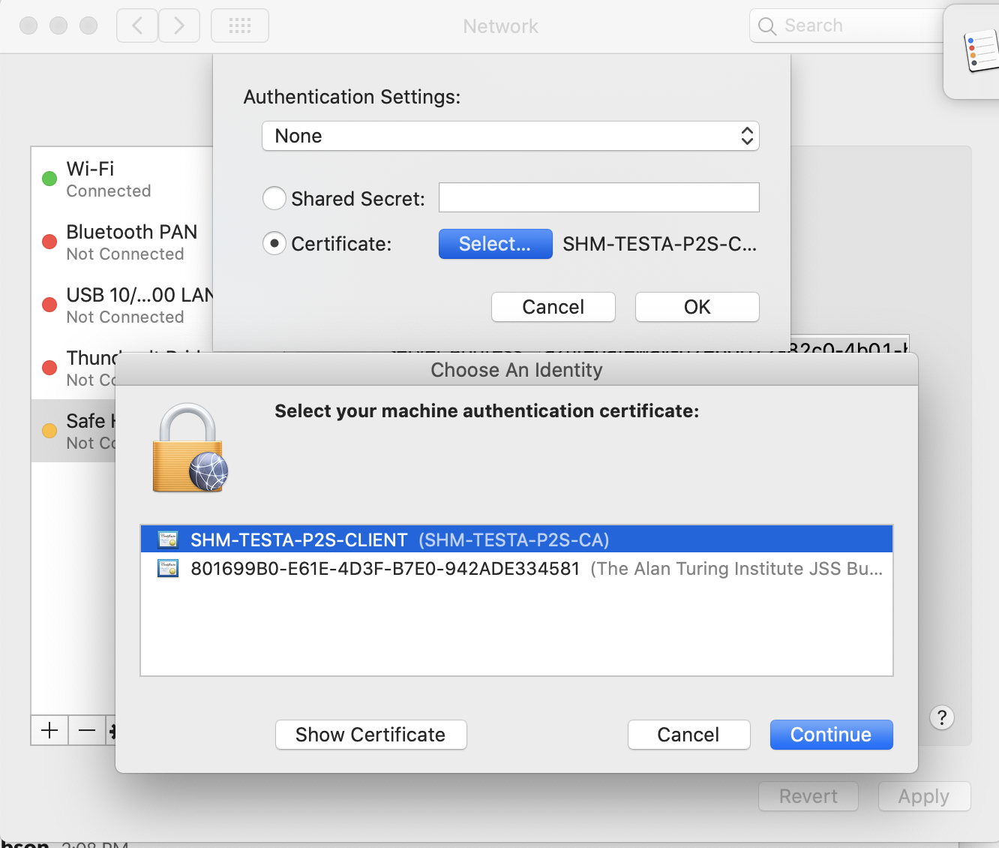

# Secure Research Environment Build Instructions
These instructions will walk you through deploying a Secure Research Environment (SRE) that uses an existing Safe Haven Management (SHM) environment.
The following 7 virtual machines are created as a result of these instructions:
- `APP-SRE-<SRE ID>` (Remote Desktop app server)
- `DAT-SRE-<SRE ID>` (data server)
- `DKP-SRE-<SRE ID>` (Remote Desktop desktop server)
- `HACKMD-SRE-<SRE ID>` (HackMD server)
- `GITLAB-SRE-<SRE ID>` (GitLab server)
- `RDG-SRE-<SRE ID>` (Remote Desktop Gateway)
- `SRE-<SRE ID>-160-DSVM-<VERSION>`  (initial shared compute VM at IP address `<data-subnet-prefix>.160`)

## Contents
- [:seedling: Prerequisites](#seedling-prerequisites)
  - [:beginner: Software](#beginner-software)
  - [:key: VPN connection to the SHM VNet](#key-vpn-connection-to-the-shm-vnet)
  - [:name_badge: SRE domain name](#name_badge-sre-domain-name)
  - [:arrow_double_up: Deploying multiple SREs in parallel](#arrow_double_up-deploying-multiple-sres-in-parallel)
- [:clipboard: Define SRE configuration](#clipboard-define-sre-configuration)
  - [:apple: SHM configuration properties](#apple-shm-configuration-properties)
  - [:green_apple: SRE configuration properties](#green_apple-sre-configuration-properties)
  - [:full_moon: Generate full SRE configuration](#full_moon-generate-full-sre-configuration)
- [:cop: Prepare SHM environment](#cop-prepare-shm-environment)
  - [:fast_forward: Optional: Remove data from previous deployments](#fast_forward-optional-remove-data-from-previous-deployments)
  - [:registered: Register SRE with the SHM](#registered-register-sre-with-the-shm)
- [:fishing_pole_and_fish: Deploy virtual network and remote desktop](#fishing_pole_and_fish-deploy-virtual-network-and-remote-desktop)
  - [:clubs: Create SRE DNS Zone](#clubs-create-sre-dns-zone)
  - [:tropical_fish: Deploy the virtual network and remote desktop](#tropical_fish-deploy-the-virtual-network-and-remote-desktop)
  - [:satellite: Configure RDS webclient](#satellite-configure-rds-webclient)
  - [:accept: Configure RDS CAP and RAP settings](#accept-configure-rds-cap-and-rap-settings)
  - [:closed_lock_with_key: Update SSL certificate](#closed_lock_with_key-update-ssl-certificate)
  - [:microscope: Test RDS deployment](#microscope-test-rds-deployment)
- [:floppy_disk: Deploy data server](#floppy_disk-deploy-data-server)
- [:baseball: Deploy databases](#baseball-deploy-databases)
- [:snowflake: Deploy web applications (GitLab and HackMD)](#snowflake-deploy-web-applications-gitlab-and-hackmd)
  - [:microscope: Test GitLab Server](#:microscope-test-gitlab-server)
  - [:microscope: Test HackMD Server](#:microscope-test-hackmd-server)
- [:computer: Deploy data science VMs](#computer-deploy-data-science-vms)
  - [:fast_forward: Optional: Customise the deployed VM](#fast_forward-optional-customise-the-deployed-vm)
  - [:computer: Deploy a single data science VM (DSVM)](#computer-deploy-a-single-data-science-vm-dsvm)
  - [:microscope: Test DSVM deployment](#microscope-test-dsvm-deployment)
- [:lock: Apply network configuration](#lock-apply-network-configuration)
  - [:fast_forward: Optional: Unpeering package mirrors](#fast_forward-optional-unpeering-package-mirrors)
- [:fire: Run smoke tests on DSVM](#fire-run-smoke-tests-on-dsvm)
- [:bomb: Tearing down the SRE](#bomb-tearing-down-the-sre)

## :seedling: Prerequisites
- An SHM environment that has already been deployed in Azure - follow the [Safe Haven Management (SHM) deployment guide](deploy_shm_instructions.md) if you have not done so already.
- An Azure subscription with sufficient credits to build the SRE.
  - :notebook: Our convention is to name these `Turing SRE - <SRE ID> (SHM <SHM ID>)`
  - :information_source: We recommend allow at least **$1,000** in Azure credits for getting this SRE set up
- **Owner** access to the SRE and SHM Azure subscriptions
  - :information_source: We recommend using security groups to control access (eg. our subscriptions belong to `Safe Haven Test Admins` or `Safe Haven Production Admins`)
- Access to a global administrator account on the SHM Azure Active Directory

### :beginner: Software
- `PowerShell` with support for Azure
  - Install [PowerShell v6.0 or above](https://docs.microsoft.com/en-us/powershell/scripting/install/installing-powershell)
  - Install the [Azure PowerShell Module](https://docs.microsoft.com/en-us/powershell/azure/install-az-ps)
- `Microsoft Remote Desktop`
  - On Mac this can be installed from the [Apple store](https://itunes.apple.com/gb/app/microsoft-remote-desktop-10/id1295203466?mt=12)
- `OpenSSL`
  - Install using your package manager of choice

### :key: VPN connection to the SHM VNet
For some operations, you will need to log on to some of the VMs that you deploy and make manual changes.
This is done using the VPN which should have been deployed when setting up the SHM environment.

- **Download a client VPN certificate**
  - Navigate to the key vault in the SHM subscription via `Resource Groups -> RG_SHM_SECRETS -> kv-shm-<SHM ID>`.
  - Once there open the "Certificates" page under the "Settings" section in the left hand sidebar.
  - Click on the certificate named `shm-<SHM ID>-vpn-client-cert`, click on the "current version" and click the "Download in PFX/PEM format" link.
  - To install, double click on the downloaded certificate, leaving the password field blank.
  - **Make sure to securely delete the "\*.pfx" certificate file after you have installed it.**
  -  This certificate will also allow you to connect via VPN to the SRE VNets once deployed.

- **Configure the VPN connection**
  - Navigate to the Safe Haven Management (SHM) VNet gateway in the SHM subscription via `Resource Groups -> RG_SHM_NETWORKING -> VNET_SHM_<SHM ID>_GW`, where `<SHM ID>` is defined in the config file. Once there open the "Point-to-site configuration page under the `Settings` section in the left hand sidebar (see image below).
    <p align="center">
      
    </p>
  - Click the `Download VPN client` link at the top of the page to get the root certificate (`VpnServerRoot.cer`) and VPN configuration file (`VpnSettings.xml`), then follow the [VPN set up instructions](https://docs.microsoft.com/en-us/azure/vpn-gateway/point-to-site-vpn-client-configuration-azure-cert) using the Windows or Mac sections as appropriate.
  - :warning: **Windows:** you may get a "Windows protected your PC" pop up. If so, click `More info -> Run anyway`
  - :warning: **Windows:** do not rename the VPN client as this will break it
  - :pencil: **OSX** double clicking on the root certificate may not result in any pop-up dialogue, but the certificate should still be installed. You can view the details of the downloaded certificate by highlighting the certificate file in Finder and pressing the spacebar. You can then look for the certificate of the same name in the login KeyChain and view its details by double clicking the list entry. If the details match the certificate has been successfully installed.
  - :pencil: **OSX** on Catalina you may have to drag the certificate into your personal KeyChain as the default is to install system-wide
  - :pencil: **OSX** on Catalina, the Authentication Settings step is quite counter-intuitive: you must select "None" from the drop-down (not "Certificate") and then select the "Certificate" radio button underneath (see screenshot).
    <p align="center">
      
    </p>

  - Continue to follow the set up instructions from the link above, using SSTP (Windows) or IKEv2 (OSX) for the VPN type and naming the VPN connection "Safe Haven Management Gateway (`<SHM ID>`)", where `<SHM ID>` is defined in the config file.

### :name_badge: SRE domain name
You will need access to a public routable domain name for the SRE and its name servers.
This can be a subdomain of the Safe Haven Management domain, e.g, `sandbox.testb.dsgroupdev.co.uk`, or a top-level domain (eg. `dsgroup100.co.uk`).

### :arrow_double_up: Deploying multiple SREs in parallel
> :warning: You can only deploy to **one SRE at a time** from a given computer as the `Az` Powershell module can only work within one Azure subscription at a time.
If you need to deploy multiple SREs in parallel you will need to use multiple computers.
One option here is to provision dedicated deployment VMs on Azure - we have had success in doing so when using both Ubuntu and Windows VMs.


## :clipboard: Define SRE configuration
The full configuration details for a new SRE are generated by defining a few "core" properties for the new SRE and the management environment in which it will be deployed.

### :apple: SHM configuration properties
The core properties for the relevant pre-existing Safe Haven Management (SHM) environment must be present in the `environment_configs/core` folder.
The following core SHM properties must be defined in a JSON file named `shm_<SHM ID>_core_config.json`.

```json
{
    "subscriptionName": "Name of the Azure subscription the management environment is deployed in",
    "dnsSubscriptionName": "Name of the Azure subscription holding DNS records",
    "dnsResourceGroupName": "Name of the resource group holding DNS records (eg. RG_SHM_DNS_TEST)",
    "adminSecurityGroupName" : "Name of the Azure Security Group that admins of this Safe Haven will belong to",
    "computeVmImageSubscriptionName": "Azure Subscription name for compute VM",
    "domain": "The fully qualified domain name for the management environment",
    "shmId": "A short ID to identify the management environment. This must be 7 or fewer characters.",
    "name": "Safe Haven deployment name",
    "organisation": {
        "name": "Organisation name",
        "townCity": "Location",
        "stateCountyRegion": "Location",
        "countryCode": "e.g. GB"
    },
    "location": "The Azure location in which the management environment VMs are deployed"
}
```

> :warning: The `shmId` field must have a maximum of 7 characters.


### :green_apple: SRE configuration properties
The core properties for the new SRE environment must be present in the `environment_configs/core` folder.
The following core SRE properties must be defined in a JSON file named `sre_<SRE ID>_core_config.json`.

```json
{
    "subscriptionName": "Name of the Azure subscription the secure research environment is deployed in",
    "adminSecurityGroupName" : "Name of the Azure Security Group that admins of this SHM belong to",
    "shmId": "The short ID for the SHM segment to deploy against",
    "sreId": "A short ID to identify the secure research environment. This *must be* 7 characters or less; if not it will be truncated in some places which might cause problems if those characters are not unique.",
    "tier": "The data classification tier for the SRE. This controls the outbound network restrictions on the SRE and which mirror set the SRE is peered with",
    "domain": "The fully qualified domain name for the SRE",
    "ipPrefix": "The three octet IP address prefix for the Class A range used by the management environemnt",
    "inboundAccessFrom": "A comma-separated string of IP ranges (addresses or CIDR ranges) from which access to the RDS webclient is permitted. For Tier 0 and 1 this should be 'Internet'. For Tier 2 this should correspond to the any organisational networks (including guest networks) at the partner organisations where access should be permitted from (i.e. any network managed by the organsiation, such as EduRoam, Turing Guest, Turing Secure etc). For Tier 3 SREs, this should correspond to the RESTRICTED networks at the partner organisations. These should only permit connections from within meduim security access controlled physical spaces and from managed devices (e.g. Turing Secure). Using 'default' will use the default Turing networks.",
    "outboundInternetAccess": "Whether to allow outbound internet access from inside the remote desktop environment. Either ('Yes', 'Allow', 'Permit'), ('No', 'Deny', 'Forbid') or 'default' (for Tier 0 and 1 'Allow' otherwise 'Deny')",
    "computeVmImageType": "The name of the Compute VM image (most commonly 'Ubuntu')",
    "computeVmImageVersion": "The version of the Compute VM image (e.g. 0.1.2019082900)"
}
```

> :warning: The `sreId` field must have a maximum length of 7 characters.

> :warning: The `ipPrefix` must be unique for each SRE attached to the same SHM.
  It is very important that address spaces do not overlap in the environment as this will cause network faults.
  The address spaces use a private class A range and use a 21-bit subnet mask.
  This provides ample addresses for a SRE and capacity to add additional subnets should that be required in the future.


### :full_moon: Generate full SRE configuration
On your **deployment machine**.
- Ensure you have the latest version of the Safe Haven repository from [https://github.com/alan-turing-institute/data-safe-haven](https://github.com/alan-turing-institute/data-safe-haven).
- Open a Powershell terminal and navigate to the top-level folder within the Safe Haven repository.
- Generate a new full configuration file for the new SRE using the following commands.
  - `Import-Module ./deployment/common/Configuration.psm1 -Force`
  - `Add-SreConfig -configId <SRE config ID>`, where the config ID is `<SHM ID><SRE ID>` for the config file you are using (e.g. `testasandbox` for the `sandbox` SRE in the `testa` SHM).
- A full configuration file for the new SRE will be created at `environment_configs/full/sre_<SRE ID>_full_config.json`. This file is used by the subsequent steps in the SRE deployment.
- Commit this new full configuration file to the Safe Haven repository

## :cop: Prepare SHM environment
On your **deployment machine**.
- Ensure you have the latest version of the Safe Haven repository from [https://github.com/alan-turing-institute/data-safe-haven](https://github.com/alan-turing-institute/data-safe-haven).
- Open a Powershell terminal and navigate to the `deployment/secure_research_environment/setup` directory within the Safe Haven repository.
- Ensure you are logged into Azure within PowerShell using the command: `Connect-AzAccount`
  - NB. If your account is a guest in additional Azure tenants, you may need to add the `-Tenant <Tenant ID>` flag, where `<Tenant ID>` is the ID of the Azure tenant you want to deploy into.

### :fast_forward: Optional: Remove data from previous deployments
> :warning: If you are redeploying an SRE in the same subscription and did not use the `./SRE_Teardown.ps1` script to clean up the previous deployment, then there may be residual SRE data in the SHM.

On your **deployment machine**.
- :pencil: If the subscription is not empty, confirm that it is not being used before deleting any resources in it.
- Clear any remaining SRE data from the SHM by running `./Remove_SRE_Data_From_SHM.ps1 -configId <SRE config ID>`, where the config ID is `<SHM ID><SRE ID>` for the config file you are using.

### :registered: Register SRE with the SHM
On your **deployment machine**.
- Register service accounts with the SHM by running `./Setup_SRE_KeyVault_And_Users.ps1 -configId <SRE config ID>`, where the config ID is `<SHM ID><SRE ID>` for the config file you are using.
- This step also creates a key vault in the SRE subscription in `Resource Groups -> RG_SRE_SECRETS -> kv-shm-<SHM ID>-sre-<SRE ID>`. Additional deployment steps will add secrets to this key vault and you will need to access some of these for some of the manual configuration steps later.

## :fishing_pole_and_fish: Deploy virtual network and remote desktop
### :clubs: Create SRE DNS Zone
On your **deployment machine**.
- Run the `./Setup_SRE_DNS_Zone.ps1 -configId <SRE config ID>` script, where the config ID is `<SHM ID><SRE ID>` for the config file you are using.
- If you see a message `You need to add the following NS records to the parent DNS system for...` you will need to manually add the specified NS records to the parent's DNS system, as follows:

#### Manually add NS records
- To find the required values for the NS records on the portal, click `All resources` in the far left panel, search for "DNS Zone" and locate the DNS Zone with SRE's domain. The NS record will list 4 Azure name servers.
  <p align="center">
    
  </p>
- Duplicate these records to the parent DNS system as follows:
  - If the parent domain has an Azure DNS Zone, create an NS record set in this zone.
    The name should be set to the subdomain (e.g. `sandbox`) or `@` if using a custom domain, and the values duplicated from above.
    For example, for a new subdomain `sandbox.testa.dsgroupdev.co.uk`, duplicate the NS records from the Azure DNS Zone `sandbox.testa.dsgroupdev.co.uk` to the Azure DNS Zone for `testa.dsgroupdev.co.uk`, by creating a record set with name `sandbox`.
  - If the parent domain is outside of Azure, create NS records in the registrar for the new domain with the same value as the NS records in the new Azure DNS Zone for the domain.

### :tropical_fish: Deploy the virtual network and remote desktop
On your **deployment machine**.
- Ensure you have the latest version of the Safe Haven repository from [https://github.com/alan-turing-institute/data-safe-haven](https://github.com/alan-turing-institute/data-safe-haven).
- Open a Powershell terminal and navigate to the `deployment/secure_research_environment/setup` directory within the Safe Haven repository.
- Ensure you are logged into Azure within PowerShell using the command: `Connect-AzAccount`
- Run `./Setup_SRE_VNET_RDS.ps1 -configId <SRE config ID>`, where the config ID is `<SHM ID><SRE ID>` for the config file you are using.
- The deployment will take around 50 minutes.
- The VNet peerings may take a few minutes to provision after the script completes.

### :satellite: Configure RDS webclient
- Connect to the **RDS Gateway** via Remote Desktop client over the SHM VPN connection
- The IP address can be found using the Azure portal by navigating to the Virtual Machine (`Resource Groups -> RG_SRE_RDS -> RDG-SRE-<SRE ID>`)
- Login as the SHM **domain** admin user `<admin username>@<SHM domain>` (eg. `shmtestbadmin@testb.dsgroupdev.co.uk`) using the username and password obtained from the Azure portal. They are in the `RG_SHM_SECRETS` resource group, in the `kv-shm-<SHM ID>` key vault, under `Secrets`. as follows:
  - The username is the `shm-<SHM ID>-vm-admin-username` secret plus `@<SHM DOMAIN>` where you add your custom SHM domain. For example `shmtestbadmin@testb.dsgroupdev.co.uk`
  - The password in the `shm-<SHM ID>-domain-admin-password` secret.
On the **SRE RDS Gateway**.
- Open a PowerShell command window with elevated privileges - make sure to use the `Windows PowerShell` application, not the `Windows PowerShell (x86)` application. The required server management commandlets are not installed on the x86 version.
- Run `C:\Installation\Deploy_RDS_Environment.ps1` (prefix the command with a leading `.\` if running from within the `C:\Installation` directory)
- This script will take about 20 minutes to run (this cannot be done remotely, as it needs to be run as a domain user but remote Powershell uses a local user)

### :accept: Configure RDS CAP and RAP settings
On your **deployment machine**.
- Ensure you have the latest version of the Safe Haven repository from [https://github.com/alan-turing-institute/data-safe-haven](https://github.com/alan-turing-institute/data-safe-haven).
- Open a Powershell terminal and navigate to the `deployment/secure_research_environment/setup` directory within the Safe Haven repository.
- Ensure you are logged into Azure within PowerShell using the command: `Connect-AzAccount`
- Run `./Configure_SRE_RDS_CAP_And_RAP.ps1 -configId <SRE config ID>`, where the config ID is `<SHM ID><SRE ID>` for the config file you are using.

### :closed_lock_with_key: Update SSL certificate
On your **deployment machine**.
- Ensure you have the latest version of the Safe Haven repository from [https://github.com/alan-turing-institute/data-safe-haven](https://github.com/alan-turing-institute/data-safe-haven).
- Open a Powershell terminal and navigate to the `deployment/secure_research_environment/setup` directory within the Safe Haven repository.
- Ensure you are logged into Azure within PowerShell using the command: `Connect-AzAccount`
  - NB. If your account is a guest in additional Azure tenants, you may need to add the `-Tenant <Tenant ID>` flag, where `<Tenant ID>` is the ID of the Azure tenant you want to deploy into.
- Run the `./Update_SRE_RDS_SSL_Certificate.ps1 -configId <SRE config ID> -emailAddress <email>`, where the config ID is `<SHM ID><SRE ID>` for the config file you are using and the email address is one that you would like to be notified when certificate expiry is approaching.
- **NOTE:** This script should be run again whenever you want to update the certificate for this SRE.
- **Troubleshooting:** Let's Encrypt will only issue **5 certificates per week** for a particular host (e.g. `rdg-sre-sandbox.testa.dsgroupdev.co.uk`). For production environments this should usually not be an issue. The signed certificates are also stored in the key vault for easy redeployment. However, if you find yourself needing to re-run this step without the key vault secret available, either to debug an error experienced in production or when redeploying a test environment frequently during development, you should run `./Update_SRE_RDS_Ssl_Certificate.ps1 -dryRun $true` to use the Let's Encrypt staging server, which will issue certificates more frequently. However, these certificates will not be trusted by your browser, so you will need to override the security warning in your browser to access the RDS web client for testing.

### :microscope: Test RDS deployment
- Disconnect from any SRE VMs and connect to the SHM VPN
- Connect to the **SHM Domain Controller** via the Remote Desktop client
- The IP address can be found using the Azure portal by navigating to the Virtual Machine (`Resource Groups -> RG_SHM_DC -> DC1-SHM-<SRE ID>`)
- Log in as a **domain** user (ie. `<admin username>@<SHM domain>`) using the username and password obtained from the Azure portal. They are in the `RG_SHM_SECRETS` resource group, in the `kv-shm-<SHM ID>` key vault, under `Secrets`.
  - The username is the `shm-<SHM ID>-vm-admin-username` secret plus `@<SHM DOMAIN>` where you add your custom SHM domain. For example `shmtestbadmin@testb.dsgroupdev.co.uk`
  - The password in the `shm-<SHM ID>-domain-admin-password` secret.


#### Set up a non-privileged user account
At this point you should create a non-privileged user account for testing with.
These steps ensure that you have created a non-privileged user account that you can use for testing.
You must ensure that you have assigned a licence to this user in the Azure Active Directory so that MFA will work correctly.

1. **Create a new non-privileged user account for yourself**
On the **SHM Domain Controller**.
- Follow the user creation instructions from the [administrator guide](safe_haven_administrator_guide.md). In brief these involve:
  - adding your details (ie. your first name, last name, phone number etc.) to a user details CSV file.
  - running `C:\Installation\CreateUsers.ps1 <path_to_user_details_file>` in a Powershell command window with elevated privileges.
This will create a user in the local Active Directory on the SHM domain controller and start the process of synchronisation to the Azure Active Directory, which will take around 5 minutes.

2. **Ensure that your user account is in the correct Security Group**
- Still in the `Active Directory Users and Computers` app, open the `Safe Haven Security Groups` OU
- Right click the `SG <SRE ID> Research Users` security group and select `Properties`
- Click on the `Members` tab.
- If your user is not already listed here you must add them to the group
  - Click the `Add` button
  - Enter the start of your username and click `Check names`
  - Select your username and click `Ok`
  - Click `Ok` again to exit the `Add users` dialogue
- Synchronise with Azure Active Directory by running `C:\Installation\Run_ADSync.ps1` in Powershell.

3. **Ensure that your user account has MFA enabled**
Please ensure that your account is fully set-up (including MFA) as [detailed in the user guide](safe_haven_user_guide.md).
In order to verify this switch to your custom Azure Active Directory in the Azure portal:
- Go to `portal.azure.com` and click on your username in the top-right
- Select `Switch directory` and then click on `All Directories`
- Select your custom Azure Active Directory in the list of directories
- This should cause the portal to reload

You can now verify the following things
- The `Usage Location` must be set in Azure Active Directory (should be automatically synchronised from the local Active Directory if it was correctly set there)
  - Navigate to `Azure Active Directory` -> `Manage / Users` -> (user account), and ensure that `Settings`->`Usage Location` is set.
- A licence must be assigned to the user.
  - Navigate to `Azure Active Directory` -> `Manage / Users` -> (user account) -> `Licenses` and verify that a license is assigned and the appropriate MFA service enabled.
- MFA must be enabled for the user.
  - The user must log into `aka.ms/mfasetup` and set up MFA as [detailed in the user guide](safe_haven_user_guide.md).

#### Test the RDS using a non-privileged user account
On your **deployment machine**.
- Launch a local web browser and go to `https://<SRE ID>.<safe haven domain>` (eg. `https://sandbox.dsgroupdev.co.uk/`) and log in.
  - **Troubleshooting** If you get a "404 resource not found" error when accessing the webclient URL, it is likely that you missed the step of installing the RDS webclient.
    - Go back to the previous section and run the webclient installation step.
    - Once the webclient is installed, you will need to manually run the steps from the SSL certificate generation script to install the SSL certificate on the  webclient. Still on the RDS Gateway, run the commands below, replacing `<path-to-full-certificate-chain>` with the path to the `xxx_full_chain.pem` file in the `C:\Certificates` folder.
      - `Import-RDWebClientBrokerCert <path-to-full-certificate-chain>`
      - `Publish-RDWebClientPackage -Type Production -Latest`
  - **Troubleshooting** If you get an "unexpected server authentication certificate error", your browser has probably cached a previous certificate for this domain.
    - Do a [hard reload](https://www.getfilecloud.com/blog/2015/03/tech-tip-how-to-do-hard-refresh-in-browsers/) of the page (permanent fix)
    - OR open a new private / incognito browser window and visit the page.
  - **Troubleshooting** If you can see an empty screen with `Work resources` but no app icons, your user has not been correctly added to the security group.
- Once you have logged in, click on the `Presentation server` app icon. You should receive an MFA request to your phone or authentication app.
  - **Troubleshooting** If you can log in to the initial webclient authentication but don't get the MFA request, then the issue is likely that the configuration of the connection between the SHM NPS server and the RDS Gateway server is not correct.
    - Ensure that both the SHM NPS server and the RDS Gateway are running
    - The RADIUS client shared secret might not be set correctly on the SHM NPS server. Try manually setting as follows:
      - Ensure you are connected to the SHM VPN and connect to the SHM NPS server using Remote Desktop.
      - Click `Tools` -> `Network Policy Server`
      - In the left pane, under `NPS (Local)`, expand `RADIUS Clients and Servers` and click `RADIUS Clients`
      - Double-click on `RDG-SRE-<SRE ID>-<safe haven domain>`
      - Under `Settings` set `Shared secret` and `Confirm shared secret` to the value of the secret `sre-<SRE ID>-nps-secret` in the SRE key vault.
    - Ensure the same shared secret from the `sre-<SRE ID>-nps-secret` in the SRE key vault is set on the SRE RDS Gateway in the [SRE RDS Gateway RD CAP Store configuration](sre_build_instructions.md#configure-rds-to-use-shm-nps-server-for-client-access-policies) (see previous sections for instructions).
    - Ensure that the [SHM NPS server RADIUS Client configuration](sre_build_instructions.md#configure-rds-to-use-shm-nps-server-for-client-access-policies) is using the **private** IP address of the RDS Gateway and **not** its public one.
    - Use the Event viewer on the SRE RDS Gateway (`Custom views > Server roles > Network Policy and Access Services`) to check whether the NPS server is contactable and whether it is discarding requests
    - Use the Event viewer on the SHM NPS server  (`Custom views > Server roles > Network Policy and Access Services`) to check whether NPS requests are being received and whether the NPS server has an LDAP connection to the SHM DC.
    - One common error on the NPS server is `A RADIUS message was received from the invalid RADIUS client IP address x.x.x.x`. [This help page](https://docs.microsoft.com/en-us/previous-versions/windows/it-pro/windows-server-2008-R2-and-2008/dd316135(v=ws.10)) might be useful.
      - This may indicate that the NPS server could not join the SHM domain. Try `ping DC1-SHM-<SHM ID>` from the NPS server and if this does not resolve, try rebooting it.
      - This may indicate that the shared secret is different between the SHM and SRE.
    - Ensure that the `Windows Firewall` is set to `Domain Network` on both the SHM NPS server and the SRE RDS Gateway
  - **Troubleshooting** If you get a "We couldn't connect to the gateway because of an error" message, it's likely that the "Remote RADIUS Server" authentication timeouts have not been [increased as described in a previous section](sre_build_instructions.md#increase-the-authorisation-timeout-to-allow-for-mfa). It seems that these are reset everytime the "Central CAP store" shared RADIUS secret is changed.
  - **Troubleshooting** If you get multiple MFA requests with no change in the "Opening ports" message, it may be that the shared RADIUS secret does not match on the SHM server and SRE RDS Gateway. It is possible that this may occur if the password is too long. We previously experienced this issue with a 20 character shared secret and this error went away when we reduced the length of the secret to 12 characters. We then got a "We couldn't connect to the gateway because of an error" message, but were then able to connect successfully after again increasing the authorisation timeout for the remote RADIUS server on the RDS Gateway.
  - **Troubleshooting** If you are able to log into the webclient with a username and password but cannot connect to the presentation server (as no MFA prompt is given), please look at [this documentation](https://docs.microsoft.com/en-us/previous-versions/windows/it-pro/windows-server-2008-R2-and-2008/dd316134(v=ws.10)). In particular, ensure that the default UDP ports `1812`, `1813`, `1645` and `1646` are all open on the SHM NPS network security group (`NSG_SHM_SUBNET_IDENTITY`).
- Once you have approved the sign in, you should see a remote Windows desktop.
- **NOTE:** The other apps will not work until the other servers have been deployed.

## :floppy_disk: Deploy Data Server
On your **deployment machine**.
- Ensure you have the latest version of the Safe Haven repository from [https://github.com/alan-turing-institute/data-safe-haven](https://github.com/alan-turing-institute/data-safe-haven).
- Open a Powershell terminal and navigate to the `deployment/secure_research_environment/setup` directory within the Safe Haven repository.
- Ensure you are logged into Azure within PowerShell using the command: `Connect-AzAccount`
  - NB. If your account is a guest in additional Azure tenants, you may need to add the `-Tenant <Tenant ID>` flag, where `<Tenant ID>` is the ID of the Azure tenant you want to deploy into.
- Run the `./Setup_SRE_Data_Server.ps1 -configId <SRE config ID>` script, where the config ID is `<SHM ID><SRE ID>` for the config file you are using.
- The deployment will take around 20 minutes to complete

## :baseball: Deploy databases
On your **deployment machine**.
- Ensure you have the latest version of the Safe Haven repository from [https://github.com/alan-turing-institute/data-safe-haven](https://github.com/alan-turing-institute/data-safe-haven).
- Open a Powershell terminal and navigate to the `deployment/secure_research_environment/setup` directory within the Safe Haven repository.
- Ensure you are logged into Azure within PowerShell using the command: `Connect-AzAccount`
  - NB. If your account is a guest in additional Azure tenants, you may need to add the `-Tenant <Tenant ID>` flag, where `<Tenant ID>` is the ID of the Azure tenant you want to deploy into.
- Run the `./Setup_SRE_Databases.ps1 -configId <SRE config ID>` script, where the config ID is `<SHM ID><SRE ID>` for the config file you are using.
- The deployment will take around 30 minutes to complete, most of which is spent in Windows Update.

## :snowflake: Deploy web applications (GitLab and HackMD)
On your **deployment machine**.
- Ensure you have the latest version of the Safe Haven repository from [https://github.com/alan-turing-institute/data-safe-haven](https://github.com/alan-turing-institute/data-safe-haven).
- Open a Powershell terminal and navigate to the `deployment/secure_research_environment/setup` directory within the Safe Haven repository.
- Ensure you are logged into Azure within PowerShell using the command: `Connect-AzAccount`
  - NB. If your account is a guest in additional Azure tenants, you may need to add the `-Tenant <Tenant ID>` flag, where `<Tenant ID>` is the ID of the Azure tenant you want to deploy into.
- Run the `./Setup_SRE_WebApp_Servers.ps1 -configId <SRE config ID>` script, where the config ID is `<SHM ID><SRE ID>` for the config file you are using.
- The deployment will take a few minutes to complete

### :microscope: Test GitLab Server
There is a built-in `root` user, whose password is stored in the SRE key vault (see SRE config file for key vault and secret names).
You can test Gitlab from inside the RDS environment by clicking on the `GitLab` icon and logging in with the short-form `username` of a user in the `SG <SRE ID> Research Users` security group.

### :microscope: Test HackMD Server
You can test HackMD from inside the RDS environment by clicking on the `HackMD` icon and logging in with the long-form `username@<shm-domain-fqdn>` of a user in the `SG DSGROUP<SRE ID> Research Users` security group.

## :computer: Deploy data science VMs
### :fast_forward: Optional: Customise the deployed VM
If this SRE needs additional software or settings that are not in your default VM image, you can create a custom cloud init file.
On your **deployment machine**.
- By default, compute VM deployments will use the `cloud-init-compute-vm.template.yaml` configuration file in the `deployment/secure_research_environment/cloud_init/` folder. This does all the necessary steps to configure the VM to work with LDAP.
- If you require additional steps to be taken at deploy time while the VM still has access to the internet (e.g. to install some additional project-specific software), copy the default cloud init file to a file named `cloud-init-compute-vm-sre-<SRE ID>.template.yaml` in the same folder and add any additional required steps in the `SRE-SPECIFIC COMMANDS` block marked with comments.

### :computer: Deploy a single data science VM (DSVM)
On your **deployment machine**.
- Ensure you have the latest version of the Safe Haven repository from [https://github.com/alan-turing-institute/data-safe-haven](https://github.com/alan-turing-institute/data-safe-haven).
- Open a Powershell terminal and navigate to the `deployment/secure_research_environment/setup` directory within the Safe Haven repository.
- Ensure you are logged into Azure within PowerShell using the command: `Connect-AzAccount`
  - NB. If your account is a guest in additional Azure tenants, you may need to add the `-Tenant <Tenant ID>` flag, where `<Tenant ID>` is the ID of the Azure tenant you want to deploy into.
- Run `git fetch;git pull;git status;git log -1 --pretty="At commit %h (%H)"` to verify you are on the correct branch and up to date with `origin` (and to output this confirmation and the current commit for inclusion in the deployment record).
- Deploy a new VM into an SRE environment using `./Add_DSVM.ps1 -configId <SRE config ID>` script, where the config ID is `<SHM ID><SRE ID>` for the config file you are using.
- You will also be prompted for the VM size (optional) and the desired last octet of the IP address (the first machine deployed should use `160` here)
  - The initial shared VM should be deployed with the last octet `160`
  - The convention is that subsequent CPU-based VMs are deployed with the next unused last octet in the range `161` to `179` and GPU-based VMs are deployed with the next unused last octet between `180` and `199`.
- After deployment, copy everything from the `git fetch;...` command and its output to the command prompt returned after the VM deployment and paste this into the deployment log (e.g. a Github issue used to record VM deployments for a SRE or set of SREs)
- The deployment will take around 10 minutes to complete
- If you want to deploy several DSVMs, simply repeat the above setps with a different IP address last octet

### :microscope: Test DSVM deployment
- Click on the VM in the SRE subscription under the `RG_DSG_COMPUTE` resource group. It will have the last octet of its IP address at the end of its name.
- Click on the "Serial console" item near the bottom of the VM menu on the left hand side of the VM information panel
- If you are not prompted with `login:`, hit enter until the prompt appears
- Enter the username from the `sre-<SRE ID>-vm-admin-username` secret in the SRE key vault.
- Enter the password from the `sre-<SRE ID>-dsvm-admin-password` secret in the SRE key vault.
- To validate that our custom `cloud-init.yaml` file has been successfully uploaded, run `sudo cat /var/lib/cloud/instance/user-data.txt`. You should see the contents of the `deployment/secure_research_environment/cloud_init/cloud-init-compute-vm.template.yaml` file in the Safe Haven git repository.
- To see the output of our custom `cloud-init.yaml` file, run `sudo tail -n 200 /var/log/cloud-init-output.log` and scroll up.

## :lock: Apply network configuration
On your **deployment machine**.
- Ensure you have the latest version of the Safe Haven repository from [https://github.com/alan-turing-institute/data-safe-haven](https://github.com/alan-turing-institute/data-safe-haven).
- Open a Powershell terminal and navigate to the `deployment/secure_research_environment/setup` directory within the Safe Haven repository.
- Ensure you are logged into Azure within PowerShell using the command: `Connect-AzAccount`
  - NB. If your account is a guest in additional Azure tenants, you may need to add the `-Tenant <Tenant ID>` flag, where `<Tenant ID>` is the ID of the Azure tenant you want to deploy into.
- Run the `./Apply_Network_Configuration.ps1 -configId <SRE config ID>` script, where the config ID is `<SHM ID><SRE ID>` for the config file you are using.

### :fast_forward: Optional: Unpeering package mirrors
The `Apply_Network_Configuration.ps1` script ensures that the SRE is peered to the correct mirror network.
However, if you need to unpeer the mirror networks for some reason (e.g. while preparing an SRE subscription for re-use), you can run the unpeering script separately as described below.

> :warning: You will not normally need to do this - think carefully before doing so!

On your **deployment machine**.
- Ensure you have the latest version of the Safe Haven repository from [https://github.com/alan-turing-institute/data-safe-haven](https://github.com/alan-turing-institute/data-safe-haven).
- Open a Powershell terminal and navigate to the `deployment/secure_research_environment/setup` directory within the Safe Haven repository.
- Ensure you are logged into Azure within PowerShell using the command: `Connect-AzAccount`
  - NB. If your account is a guest in additional Azure tenants, you may need to add the `-Tenant <Tenant ID>` flag, where `<Tenant ID>` is the ID of the Azure tenant you want to deploy into.
- Run the `./Unpeer_Sre_And_Mirror_Networks.ps1 -configId <SRE config ID>` script, where the config ID is `<SHM ID><SRE ID>` for the config file you are using.


## :fire: Run smoke tests on DSVM
These tests should be run **after** the network lock down and peering the SRE and package mirror VNets.
They are automatically uploaded to the compute VM during the deployment step.

To run the smoke tests:
- Connect to the DSVM using the remote desktop URL (eg. `https://sandbox.dsgroupdev.co.uk/`) and selecting the the `DSVM Main (Desktop)` app
On the **DSVM**.
- Open a terminal session
- Copy the tests folder using `cp -R ~<sre-admin>/smoke_tests ~/smoke_tests`
- Enter the test directory using `cd ~/smoke_tests/tests`
- Run `source run_all_tests.sh`. Check `README.md` if anything is unclear.
- If all test results are expected you are done! Otherwise, contact Turing REG for help diagnosing test failures.

## :bomb: Tearing down the SRE
On your **deployment machine**.
- Ensure you have the latest version of the Safe Haven repository from [https://github.com/alan-turing-institute/data-safe-haven](https://github.com/alan-turing-institute/data-safe-haven).
- Open a Powershell terminal and navigate to the `deployment/secure_research_environment/setup` directory within the Safe Haven repository.
- Ensure you are logged into Azure within PowerShell using the command: `Connect-AzAccount`
  - NB. If your account is a guest in additional Azure tenants, you may need to add the `-Tenant <Tenant ID>` flag, where `<Tenant ID>` is the ID of the Azure tenant you want to deploy into.
  - Run the `./SRE_Teardown.ps1 -configId <SRE config ID>` script, where the config ID is `<SHM ID><SRE ID>` for the config file you are using.
