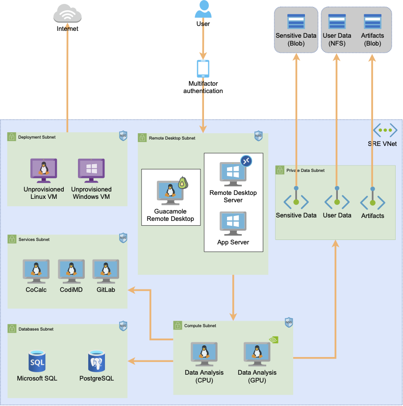

# Secure research environments (SREs)

Each project within the Safe Haven has its own separate secure Secure Research Environment (SRE).
Each of these SREs is completely isolated from the others and the security configuration of each SRE is set independently to match the needs of the project and Data Provider(s).
Each SRE is assigned to a security tier, depending on the sensitivity of the dataset(s) it will hold and the nature of the analysis to be performed within it.
Each tier is associated with a baseline security configuration, individual elements of which can be adjusted to meet the needs of the project and the Data Provider(s).

The infrastructure for each SRE is hosted in a separate Azure subscription. This infrastructure comprises:

+ One or more compute VMs with a range of data science software preinstalled
+ A file server to host the project data
+ A Gitlab server to provide source code management and version control
+ A CodiMD server for collaborative writing
+ Remote Desktop Services Gateway and Session Host servers to provide secure remote desktop access to the SRE resources.
+ A local Active Directory Domain Controller server to support the management of the Windows servers within the SRE.

Hosting each secure project environment in its own subscription supports a clean lifecycle management process, making it easy to verifiably delete all project data and resources at the end of a project.

## Secure project environment (SRE) architecture

The SREs use Windows Remote Desktop Services to provide a secure connection to the resources within the environment. Only the RDS Gateway server is accessible from outside the SRE. Connections to this are made via an SSL/TLS secured connection that requires the user to authenticate using Turing provided credentials and validated with MFA.

For Tier 2 and above, RDS prevents the copying of information into or out of the environment, internet access from within the environment is blocked and access to the RDS Gateway is only permitted from approved networks.

For management of the environment there is an Azure point-to-site (P2S) VPN service configured. Access to this is limited to the Turing IT team and requires both a client certificate and administrative login credentials.