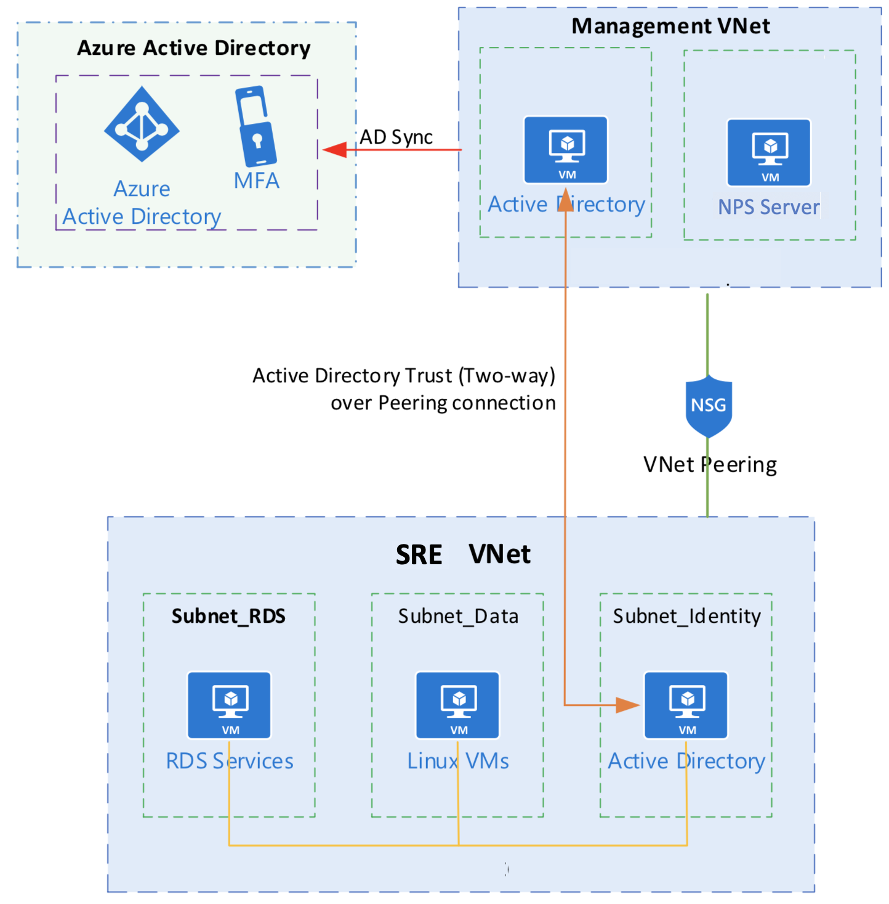

# Data access

## Admistrative access

Access to all Safe Haven Azure resources is controlled via Azure Active Directory (Azure AD) and Role-Based Access Control (RBAC).
Only members of the `Safe Haven Administrators` security group have administrative access to any element of the Safe Haven.
Membership of this security group is limited to the Turing IT team.

The following access is restricted to members of the Safe Haven Administrators security group:

+ Administrative access to the underlying Azure resources comprising the software defined infrastructure of the Safe Haven (e.g.
subscriptions, virtual networks, network security groups, virtual machines, Safe Haven Azure Active Directory).
Access to the underlying Azure resources requires administrators to log into Azure using their Turing institutional credentials and multifactor authentication.
+ Administrative access to the Safe Haven Management (SHM) segment.
Used primarily to manage users and security groups within the Safe Haven, as well as to troubleshoot any authentication issues.
Access is via an Azure point-to-site (P2S) VPN service, and requires both a client certificate and administrative login credentials.
+ Administrative access to all project SREs.
Used to troubleshoot any issues and ingress data and code following review. Access is via an Azure point-to-site (P2S) VPN service, and requires both a client certificate and administrative login credentials.

## Researcher access

Each of the SREs has a local Active Directory that is used for management of the RDS servers and file server.
This local Active Directory domain has a Trust with the Active Directory domain within the Management segment.
User accounts are created in the Management Active Directory and added to security groups.
These security groups are then applied to the RDS servers in the SREs.
This provides a central user management experience for the support staff and permits Researchers to more easily work on multiple projects hosted within the Safe Haven.
Access to individual project SREs is restricted to Researchers who have been added to the associated security group.

