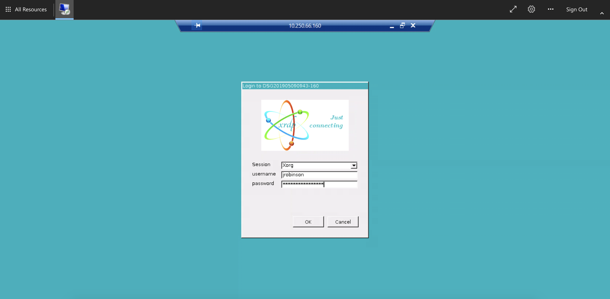

# Safe Haven Administrator Documentation

## :mailbox_with_mail: Table of contents

+ [:seedling: Prerequisites](#seedling-prerequisites)
+ [:beginner: Create new users](#beginner-create-new-users)
  + [:scroll: Generate user details CSV file](#scroll-generate-user-details-csv-file)
  + [:arrows_counterclockwise: Create and synchronise users](#arrows_counterclockwise-create-and-synchronise-users)
  + [:calling: Assign MFA licences](#calling-assign-mfa-licences)
  + [:running: User activation](#running-user-activation)
+ [:construction_worker: Common user problems](#construction_worker-common-user-problems)
  + [:waning_crescent_moon: Expired webclient certificate](#waning_crescent_moon-expired-webclient-certificate)
  + [:red_circle: Unable to log into remote desktop gateway](#red_circle-unable-to-log-into-remote-desktop-gateway)
  + [:train: Unable to open any remote apps](#train-unable-to-open-any-remote-apps)
  + [:interrobang: xrdp login failure on the DSVM](#interrobang-xrdp-login-failure-on-the-dsvm)
  + [:cloud: Unable to install from package mirrors](#cloud-unable-to-install-from-package-mirrors)
+ [:dollar: Cost management](#dollar-cost-management)
  + [:point_down: Shut down an SHM or SRE](#point_down-shut-down-an-shm-or-sre)
  + [:boot: Start up an SHM or SRE](#boot-start-up-an-shm-or-sre)
  + [:anger: Tear down SHM package mirrors](#anger-tear-down-shm-package-mirrors)
+ [:repeat: Ingress and Egress](#ingress-and-egress)
  + :arrow_up: [Data Ingress](#data-ingress)
  + :arrow_up: [Software Ingress](#software-ingress)
  + :arrow_down: [Data Egress](#data-egress)
+ [:end: Remove a deployed Safe Haven](#end-remove-a-deployed-safe-haven)
  + [:fire: Tear down an SRE](#fire-tear-down-an-SRE)
  + [:fire: Tear down the SHM](#fire-tear-down-the-SHM)

## :seedling: Prerequisites

This document assumes that you have already deployed a [Safe Haven Management (SHM) environment](../../tutorial/deployment_tutorials/how-to-deploy-shm.md) and one or more [Secure Research Environments (SRE)](../../tutorial/deployment_tutorials/how-to-deploy-sre.md) that are linked to it.

+ You will need VPN access to the SHM as described in the deployment instructions

## :beginner: Create new users

Users should be created on the main domain controller (DC1) in the SHM and synchronised to Azure Active Directory.
A helper script for doing this is already uploaded to the domain controller - you will need to prepare a CSV file in the appropriate format for it.

## :scroll: Generate user details CSV file

### :car: Using data classification app

+ Follow the [instructions in the webapp repository](<https://github.com/alan-turing-institute/data-safe-haven-webapp/blob/master/runbooks/create-users/create-users.md>) to create users.
  + Users can be created in bulk by selecting `Create User > Import user list` and uploading a spreadsheet of user details
  + Users can also be created individually by selecting `Create User > Create Single User`
+ After creating users, export the `UserCreate.csv` file
  + To export all users, select `Users > Export UserCreate.csv`
  + To export only users for a particular project, select `Projects > (Project Name) > Export UserCreate.csv`
+ Upload the user details CSV file to a sensible location on the SHM domain controller
  + :pencil: we suggest `C:\Installation\YYYYDDMM-HHMM_user_details.csv` but this is up to you

### :hand: Manually edit CSV

On the **SHM domain controller (DC1)**.

+ Make a new copy of the user details template file from `C:\Installation\user_details_template.csv`
  + :pencil: we suggest naming this `YYYYDDMM-HHMM_user_details.csv` but this is up to you
+ Remove the example user and add the required details for each user
  + `SamAccountName` : Log in username **without** the @domain bit. Use `firstname.lastname` format and please stick to unnaccented lower case ascii letters with a period separating the name parts. Maximum length is 20 characters.
  + `GivenName` : User's first / given name
  + `Surname` : User's last name / surname
  + `Mobile` : Phone number to use for initial password reset.

    This must include country code in the format `+<country-code> <local number>` (e.g. `+44 7700900000` ).
    Include a space between the country code and local number parts but no other spaces.
    Remove the leading `0` from local number if present.
    This can be a landline or or mobile but must be accessible to the user when resetting their password and setting up MFA.
    They can add the authenticator app and/or another phone number during MFA setup and at least one MFA method must work when at the Turing.

  + `SecondaryEmail` : An existing organisational email address for the user.

    Not uploaded to their Safe Haven user account but needs to be added here so we reliably send the account activation

  + `GroupName` : [Optional] The name of the Active Directory security group(s) that the users should be added (eg. `SG SANDBOX Research Users` ).

    If the user needs to be added to multiple groups, separate them with a pipe-character ( `|` ).

## :arrows_counterclockwise: Create and synchronise users

Upload the user details CSV file to a sensible location on the SHM domain controller (recommended: `C:\Installation` ). This can be done by copying and pasting the file from your deployment device to the SHM DC.

On the **SHM domain controller (DC1)**.

+ Open a PowerShell command window with elevated privileges.
+ Run `C:\Installation\CreateUsers.ps1 <path_to_user_details_file>`
+ This script will add the users and trigger a sync with Azure Active Directory, but it will still take around 5 minutes for the changes to propagate.

### :warning: Troubleshooting

If you get the message `New-ADUser :  The specified account already exists` you should first check to see whether that user actually does already exist!
Once you're certain that you're adding a new user, make sure that the following fields are unique across all users in the Active Directory.

+ `SamAccountName` : Specified explicitly in the CSV file. If this is already in use, consider something like `firstname.middle.initials.lastname`
+ `DistinguishedName` : Formed of `CN=<DisplayName>,<OUPath>` by Active directory on user creation. If this is in use, consider changing `DisplayName` from `<GivenName> <Surname>` to `<GivenName> <Middle> <Initials> <Surname>` .

## :calling: Assign MFA licences

### :hand: Manually add licence to each user

+ Login into the Azure Portal and connect to the correct AAD
+ Open `Azure Active Directory`
+ Select `Manage > Licenses > All Products`
+ Click `Azure Active Directory Premium P1`
+ Click `Assign`
+ Click `Users and groups`
+ Select the users you have recently created and click `Select`
+ Click `Assign` to complete the process

### :car: Automatically assign licences to users

To automatically assign licences to all local AD users that do not currently have a licence in AAD

+ Ensure you have the latest version of the Safe Haven repository from [https://github.com/alan-turing-institute/data-safe-haven](<https://github.com/alan-turing-institute/data-safe-haven>).
+ Open a Powershell terminal and navigate to the `deployment/administration` directory within the Safe Haven repository.
+ Run the `./SHM_Add_AAD_Licences.ps1 -shmId <SHM ID>` script, where the SHM ID is the ID of the SHM you wish to add licences for.

## :running: User activation

We need to contact the users to tell them their user ID and.
We can securely email users their user ID as they do not know their account password and they need access to the phone number they provided in order to reset this.
We should also send them a copy of the [Safe Haven User Guide](../../how_to_guides/user_guides/user-guide.md) at this point.

A sample email might look like the following

> Dear \<participant name\>,
>
> Welcome to \<event name\>! You've been given access to a data Safe Haven running on Turing infrastructure.
> Please find a PDF version of our user guide attached.
> You should start by following the instructions about setting up your account and enabling multi-factor authentication (MFA).
>
> Your username is: \<username@domain\>
> Your Safe Haven is hosted at: \<URL\>
>
> The Safe Haven is only accessible from certain networks and may also involve physical location restrictions.
>
> --details about network and location/VPN restrictions here--

## :construction_worker: Common user problems

One of the most common user issues is that they are unable to log in to the environment.
Here we go through the login procedure and discuss possible problems at each step

### :waning_crescent_moon: Expired webclient certificate

If the certificate for the SRE domain has expired, users will not be able to login.

<p align="center">
  
</p>

**Solution**: Replace the SSL certificate with a new one

+ Ensure you have the latest version of the Safe Haven repository from [https://github.com/alan-turing-institute/data-safe-haven](<https://github.com/alan-turing-institute/data-safe-haven>).
+ Open a Powershell terminal and navigate to the `deployment/secure_research_environment/setup` directory within the Safe Haven repository.
+ Ensure you are logged into the Azure within PowerShell using the command: `Connect-AzAccount`
+ Run `./Update_SRE_RDS_Ssl_Certificate.ps1 -sreId <SRE ID>` , where the SRE ID is the one specified in the config.

### :red_circle: Unable to log into remote desktop gateway

If users give the wrong username or password they will not be able to progress past the login screen.

<p align="center">
  
</p>

**Solution**: Check user credentials, password may need to be reset.

### :train: Unable to open any remote apps

Users are stuck at the `Opening remote port` message and never receive the MFA prompt.
<p align="center">
  
</p>

**Solution**: Check MFA setup

+ Ensure that the user has been assigned a license in Azure Active Directory
+ Check that the user has set up MFA (at `aka.ms/mfasetup` ) and is using the phone-call or app authentication method

### :interrobang: xrdp login failure on the DSVM

If users can get to the login screen:

<p align="center">
  
</p>

but then see this error message:

<p align="center">
  
</p>

there are a couple of possible causes.

**Problem**: the username or password was incorrectly entered

**Solution**: check username and password

+ Confirm that the username and password have been correctly typed
+ Confirm that there are no unsupported special characters in the password
+ Reset the account if there is no other solution

**Problem**: the computer is unable to communicate with the login server

**Solution**: run diagnostics

+ This can happen for a variety of reasons (DNS problems, broken services on the compute VM etc.)
+ Run the script under `deployment/administration/SRE_DSVM_Remote_Diagnostics.ps1` , providing the group and last IP octet of the problematic compute VM
+ You should see output like the following:

<details>
<summary>Diagnostic output</summary>

```
PS /home/atiadmin/data-safe-haven/deployment/administration> ./SRE_DSVM_Remote_Diagnostics.ps1 -sreId 2 -ipLastOctet 160

Name                                     Account                                           SubscriptionName                                 Environment                                      TenantId
----                                     -------                                           ----------------                                 -----------                                      --------
DSG Template Testing (0c126bf5-366e-4... jrobinson@turing.ac.uk                            DSG Template Testing                             AzureCloud                                       4395f4a7-e455-4f95-8a9f-1fbaef6384f9
 - Finding VM with IP 10.250.10.160
 - Running diagnostic scripts on VM DSG201906181415-160

Code          : ProvisioningState/succeeded
Level         : Info
DisplayStatus : Provisioning succeeded
Message       : Enable succeeded:
                [stdout]
                Checking LDAP connectivity
                Testing LDAP search...
                LDAP search succeeded: found user 'dsg2-dsvm-ldap'.
                LDAP SEARCH RESULT:
                dn: CN=DSGROUP2 DSVM LDAP,OU=Safe Haven Service Accounts,DC=turingsafehaven,DC
                 =ac,DC=uk
                objectClass: top
                objectClass: person
                objectClass: organizationalPerson
                objectClass: user
                cn: DSGROUP2 DSVM LDAP
                description: DSGROUP2 DSVM LDAP
                distinguishedName: CN=DSGROUP2 DSVM LDAP,OU=Safe Haven Service Accounts,DC=tur
                 ingsafehaven,DC=ac,DC=uk
                instanceType: 4
                whenCreated: 20190613112421.0Z
                whenChanged: 20190617164000.0Z
                displayName: DSGROUP2 DSVM LDAP
                uSNCreated: 610254
                memberOf: CN=SG Data Science LDAP Users,OU=Safe Haven Security Groups,DC=turin
                 gsafehaven,DC=ac,DC=uk
                uSNChanged: 623511
                name: DSGROUP2 DSVM LDAP
                objectGUID:: 6QVuwb4k50+Q9+srCw/1ww==
                userAccountControl: 66048
                badPwdCount: 0
                codePage: 0
                countryCode: 0
                badPasswordTime: 0
                lastLogoff: 0
                lastLogon: 132053410870905210
                pwdLastSet: 132048986610646973
                primaryGroupID: 513
                objectSid:: AQUAAAAAAAUVAAAAgHv/rrok4PlnFgf+wwUAAA==
                accountExpires: 9223372036854775807
                logonCount: 4
                sAMAccountName: dsg2-dsvm-ldap
                sAMAccountType: 805306368
                userPrincipalName: dsg2-dsvm-ldap@dsgroup2.co.uk
                objectCategory: CN=Person,CN=Schema,CN=Configuration,DC=turingsafehaven,DC=ac,
                 DC=uk
                dSCorePropagationData: 16010101000000.0Z
                lastLogonTimestamp: 132052632008997342

                [stderr]

Time          :

Code          : ProvisioningState/succeeded
Level         : Info
DisplayStatus : Provisioning succeeded
Message       : Enable succeeded:
                [stdout]
                Address: 127.0.0.53#53

                Non-authoritative answer:
                Name: SHMDC1.turingsafehaven.ac.uk
                Address: 10.251.0.250
                Name resolution working.
                Testing /etc/systemd/resolved.conf
                #  This file is part of systemd.
                #
                #  systemd is free software; you can redistribute it and/or modify it
                #  under the terms of the GNU Lesser General Public License as published by
                #  the Free Software Foundation; either version 2.1 of the License, or
                #  (at your option) any later version.
                #
                # Entries in this file show the compile time defaults.
                # You can change settings by editing this file.
                # Defaults can be restored by simply deleting this file.
                #
                # See resolved.conf(5) for details

                [Resolve]
                #DNS=
                #FallbackDNS=
                #Domains=
                #LLMNR=no
                #MulticastDNS=no
                #DNSSEC=no
                #Cache=yes
                #DNSStubListener=yes
                Updating /etc/systemd/resolved.conf
                #  This file is part of systemd.
                #
                #  systemd is free software; you can redistribute it and/or modify it
                #  under the terms of the GNU Lesser General Public License as published by
                #  the Free Software Foundation; either version 2.1 of the License, or
                #  (at your option) any later version.
                #
                # Entries in this file show the compile time defaults.
                # You can change settings by editing this file.
                # Defaults can be restored by simply deleting this file.
                #
                # See resolved.conf(5) for details

                [Resolve]
                DNS=
                FallbackDNS=
                Domains=turingsafehaven.ac.uk
                #LLMNR=no
                #MulticastDNS=no
                #DNSSEC=no
                #Cache=yes
                #DNSStubListener=yes
                Restarting systemd-resolved nameservice
                # This file is managed by man:systemd-resolved(8). Do not edit.
                #
                # This is a dynamic resolv.conf file for connecting local clients to the
                # internal DNS stub resolver of systemd-resolved. This file lists all
                # configured search domains.
                #
                # Run "systemd-resolve --status" to see details about the uplink DNS servers
                # currently in use.
                #
                # Third party programs must not access this file directly, but only through the
                # symlink at /etc/resolv.conf. To manage man:resolv.conf(5) in a different way,
                # replace this symlink by a static file or a different symlink.
                #
                # See man:systemd-resolved.service(8) for details about the supported modes of
                # operation for /etc/resolv.conf.

                nameserver 127.0.0.53
                options edns0
                search turingsafehaven.ac.uk reddog.microsoft.com
                Testing /etc/resolv.conf
                # This file is managed by man:systemd-resolved(8). Do not edit.
                #
                # This is a dynamic resolv.conf file for connecting local clients to the
                # internal DNS stub resolver of systemd-resolved. This file lists all
                # configured search domains.
                #
                # Run "systemd-resolve --status" to see details about the uplink DNS servers
                # currently in use.
                #
                # Third party programs must not access this file directly, but only through the
                # symlink at /etc/resolv.conf. To manage man:resolv.conf(5) in a different way,
                # replace this symlink by a static file or a different symlink.
                #
                # See man:systemd-resolved.service(8) for details about the supported modes of
                # operation for /etc/resolv.conf.

                nameserver 127.0.0.53
                options edns0
                search turingsafehaven.ac.uk reddog.microsoft.com
                /etc/resolv.conf is currently pointing to ../run/systemd/resolve/stub-resolv.conf
                Resetting /etc/resolv.conf symlink
                # This file is managed by man:systemd-resolved(8). Do not edit.
                #
                # This is a dynamic resolv.conf file for connecting local clients directly to
                # all known uplink DNS servers. This file lists all configured search domains.
                #
                # Third party programs must not access this file directly, but only through the
                # symlink at /etc/resolv.conf. To manage man:resolv.conf(5) in a different way,
                # replace this symlink by a static file or a different symlink.
                #
                # See man:systemd-resolved.service(8) for details about the supported modes of
                # operation for /etc/resolv.conf.

                nameserver 10.250.8.250
                nameserver 8.8.8.8
                search turingsafehaven.ac.uk reddog.microsoft.com
                /etc/resolv.conf is currently pointing to /run/systemd/resolve/resolv.conf
                NS LOOKUP RESULT:
                Server: 10.250.8.250
                Address: 10.250.8.250#53

                Non-authoritative answer:
                Name: SHMDC1.turingsafehaven.ac.uk
                Address: 10.251.0.250
                Name resolution working.

                [stderr]

Time          :

Code          : ProvisioningState/succeeded
Level         : Info
DisplayStatus : Provisioning succeeded
Message       : Enable succeeded:
                [stdout]
                Checking realm membership
                Testing current realms...
                Currently a member of realm: 'turingsafehaven.ac.uk'. No need to rejoin.
                REALM LIST RESULT:
                turingsafehaven.ac.uk
                  type: kerberos
                  realm-name: TURINGSAFEHAVEN.AC.UK
                  domain-name: turingsafehaven.ac.uk
                  configured: kerberos-member
                  server-software: active-directory
                  client-software: sssd
                  required-package: sssd-tools
                  required-package: sssd
                  required-package: libnss-sss
                  required-package: libpam-sss
                  required-package: adcli
                  required-package: samba-common-bin
                  login-formats: %U
                  login-policy: allow-permitted-logins
                  permitted-logins:
                  permitted-groups:

                [stderr]

Time          :

Code          : ProvisioningState/succeeded
Level         : Info
DisplayStatus : Provisioning succeeded
Message       : Enable succeeded:
                [stdout]
                Checking SSSD status
                Testing sssd status...
                SSSD service is working. No need to restart.
                SSSD STATUS RESULT:
                ● sssd.service - System Security Services Daemon
                   Loaded: loaded (/lib/systemd/system/sssd.service; enabled; vendor preset: enabled)
                   Active: active (running) since Thu 2019-06-20 10:50:08 BST; 1 day 3h ago
                 Main PID: 38795 (sssd)
                    Tasks: 4 (limit: 8289)
                   CGroup: /system.slice/sssd.service
                           ├─38795 /usr/sbin/sssd -i --logger=files
                           ├─38824 /usr/lib/x86_64-linux-gnu/sssd/sssd_be --domain turingsafehaven.ac.uk --uid 0 --gid 0 --logger=files
                           ├─38827 /usr/lib/x86_64-linux-gnu/sssd/sssd_nss --uid 0 --gid 0 --logger=files
                           └─38828 /usr/lib/x86_64-linux-gnu/sssd/sssd_pam --uid 0 --gid 0 --logger=files

                Jun 21 10:50:08 DSG201906181415-160 sssd[38795]: tkey query failed: GSSAPI error: Major = Unspecified GSS failure.  Minor code may provide more information, Minor = Server not found in Kerberos database.
                Jun 21 10:50:08 DSG201906181415-160 sssd[38795]: tkey query failed: GSSAPI error: Major = Unspecified GSS failure.  Minor code may provide more information, Minor = Server not found in Kerberos database.
                Jun 21 10:50:08 DSG201906181415-160 sssd[38795]: tkey query failed: GSSAPI error: Major = Unspecified GSS failure.  Minor code may provide more information, Minor = Server not found in Kerberos database.
                Jun 21 10:50:08 DSG201906181415-160 sssd[38795]: tkey query failed: GSSAPI error: Major = Unspecified GSS failure.  Minor code may provide more information, Minor = Server not found in Kerberos database.
                Jun 21 10:50:08 DSG201906181415-160 sssd[38795]: tkey query failed: GSSAPI error: Major = Unspecified GSS failure.  Minor code may provide more information, Minor = Server not found in Kerberos database.
                Jun 21 11:02:38 DSG201906181415-160 adcli[8817]: GSSAPI client step 1
                Jun 21 11:02:38 DSG201906181415-160 adcli[8817]: GSSAPI client step 1
                Jun 21 11:02:38 DSG201906181415-160 adcli[8817]: GSSAPI client step 1
                Jun 21 11:02:38 DSG201906181415-160 adcli[8817]: GSSAPI client step 2
                Jun 21 14:24:55 DSG201906181415-160 sssd[38827]: Enumeration requested but not enabled

                [stderr]

Time          :

Safe Haven Management (1814d074-10fe-4...   jrobinson@turing.ac.uk   Safe Haven Management   AzureCloud   4395f4a7-e455-4f95-8a9f-1fbaef6384f9
```

</details>

### :cloud: Unable to install from package mirrors

If it is not possible to install packages from the package mirrors then this may be for one of the following reasons:

**Problem**: Mirror VNet is not correctly peered

**Solution**: Re-run the network configuration script.

On your **deployment machine**.

+ Ensure you have the latest version of the Safe Haven repository from [https://github.com/alan-turing-institute/data-safe-haven](<https://github.com/alan-turing-institute/data-safe-haven>).
+ Open a Powershell terminal and navigate to the `deployment/secure_research_environment/setup` directory within the Safe Haven repository.
+ Ensure you are logged into Azure within PowerShell using the command: `Connect-AzAccount`
  + NB. If your account is a guest in additional Azure tenants, you may need to add the `-Tenant <Tenant ID>` flag, where `<Tenant ID>` is the ID of the Azure tenant you want to deploy into.
+ Run the `./Apply_Network_Configuration.ps1 -sreId <SRE ID>` script, where the SRE ID is the one specified in the config

**Problem**: Internal mirror does not have the required package

**Solution**: Check package availability

To diagnose this, log into the `Internal` mirror using the Serial Console through the `Azure` portal.
Check the packages directory (i.e. `/datadrive/mirrordaemon/pypi/web/packages` for PyPI or `/datadrive/mirrordaemon/www/cran` for CRAN)

<p align="center">
  
</p>

If the requested is expected to be available (i.e. it is on the appropriate whitelist), then you can force a mirror update by rebooting the `EXTERNAL` mirrors.
This will trigger the following actions:

1. Synchronisation of the external mirror with the remote, internet repository (a `pull` update)
2. Synchronisation of the internal mirror with the external mirror (a `push` update)

This may take an hour or two but should solve the missing package problem.

## :dollar: Cost management

When and SHM and/or SRE is not being used, it can be cost-efficient to shut it down in order to save on some of the ongoing running costs.

## :point_down: Shut down an SHM or SRE

Sometimes you may want to temporarily shut down an SHM or SRE, rather than tearing it down entirely. You can do that with these scripts:

On your **deployment machine**.

+ Ensure you have the latest version of the Safe Haven repository from [https://github.com/alan-turing-institute/data-safe-haven](<https://github.com/alan-turing-institute/data-safe-haven>).
+ Open a Powershell terminal and navigate to the `deployment/administration` directory within the Safe Haven repository.
+ Then do one of the following:

### Shut down SHM

`./SHM_Manage_VMs.ps1 -shmId <shm id> -Action EnsureStopped -Group All`

### Shut down SRE

`./SRE_Manage_VMs.ps1 -shmId <shm id> -sreId <sre id> -Action EnsureStopped`

## :boot: Start up an SHM or SRE

If you need to reboot an SHM or SRE that is not running, you can use the same scripts youused to shut them down, but changing the `-Action` flag to `EnsureStopped`, see below.

On your **deployment machine**.

+ Ensure you have the latest version of the Safe Haven repository from [https://github.com/alan-turing-institute/data-safe-haven](<https://github.com/alan-turing-institute/data-safe-haven>).
+ Open a Powershell terminal and navigate to the `deployment/administration` directory within the Safe Haven repository.
+ Run `./SHM_Manage_VMs.ps1 -shmId <shm id> -Action EnsureStarted -Group All` to restart the SHM
+ For each SRE, run `./SRE_Manage_VMs.ps1 -shmId <shm id> -sreId <sre id> -Action EnsureStarted`

### :warning: Troubleshooting

Note that if the Azure subscription that you have deployed into runs out of credit, the SHM and/or SRE will be shutdown automatically.

## :anger: Tear down SHM package mirrors

During normal usage of the SHM, you should not need to tear down the package mirrors. However, if you no longer have any SREs at a particular tier and you want to save on the costs of running the mirrors, you might decide to do so.

On your **deployment machine**.

+ Ensure you have the latest version of the Safe Haven repository from [https://github.com/alan-turing-institute/data-safe-haven](<https://github.com/alan-turing-institute/data-safe-haven>).
+ Open a Powershell terminal and navigate to the `deployment/safe_haven_management_environment/setup` directory within the Safe Haven repository.
+ Ensure you are logged into Azure within PowerShell using the command: `Connect-AzAccount`. This command will give you a URL and a short alphanumeric code. You will need to visit that URL in a web browser and enter the code
  + NB. If your account is a guest in additional Azure tenants, you may need to add the `-Tenant <Tenant ID>` flag, where `<Tenant ID>` is the ID of the Azure tenant you want to deploy into.
+ Tear down the package mirrors by running `./Teardown_SHM_Package_Mirrors.ps1 -shmId <SHM ID> -tier <desired tier>`, where `<SHM ID>` is the [management environment ID](#management-environment-id) specified in the configuration file.
+ This will take **a few minutes** to run.

## Ingress and Egress

### Data Ingress

It is the data provider's responsibility to upload any data they own and is required to the safe haven. The following steps show how to generate a temporary write-only upload token that can be securely sent to the data provider:

+ In the Azure portal select `Subscriptions` then navigate to the subscription containing the relevant SHM.
+ Search for the resource group: `RG_SHM_<SHM ID>_PERSISTENT_DATA`, then click through to the storage account called: `<SHM ID><SRE ID>data<storage suffix>` (where `<storage suffix>` is a random string)
+ Click `Networking` under `Settings` and paste the data providers IP address as one of those allowed under the `Firewall` header, then hit the save icon in the top left
+ From the `Overview` tab, click the link to `Containers` (in the middle of the page)
+ Click `ingress`
+ Click `Shared access signature` under `Settings` and do the following:
  + Under `Permissions`, check these boxes:
    + `Write`
    + `List`
  + Set a 24 hour time window in the `Start and expiry date/time` (or an appropriate length of time)
  + Leave everything else as default click `Generate SAS token and URL`
  + Copy the `Blob SAS URL`
+ Send the `Blob SAS URL` to the data provider via secure email (for example, you could use the [Egress secure email](https://www.egress.com/) service)
+ The data provider should now be able to upload data by following [these instructions](../data_provider/how-to-ingress-data-as-provider.md#uploading)
+ You can validate successful data ingress by logging into the DSVM for the SRE and checking the `/data` volume, where you should be able to view the data that the data provider has uploaded

### Software Ingress

Software ingress is performed in a similar manner to data.

+ Follow the same steps as for [data ingress](#data-ingress) above to provide temporary write access, but set the time window for the SAS token to a shorter period (e.g. several hours).
+ Share the token with the project PI, so they can install software within the time window.
+ The PI can perform software ingress via Azure Storage Explorer (for instance as a zip file), by following the same instructions as [the data provider](../data_provider/how-to-ingress-data-as-provider.md#uploading)
+ Note: The software ingress must be signed off by the data provider (and referee) as is the case for data ingress

### Data egress

+ In the Azure portal select `Subscriptions` then navigate to the subscription containing the relevant SHM.
+ Search for the resource group: `RG_SHM_<SHM ID>_PERSISTENT_DATA`, then click through to the storage account called: `<SHM ID><SRE ID>data<storage suffix>` (where `<storage suffix>` is a random string)
+ Click `Networking` under `Settings` and make sure the IP address of your device is one of those allowed under the `Firewall` header, then hit the save icon in the top left
+ Click `Containers` under `Data storage`
+ Click `egress`
+ Click `Shared access signature` under `Settings` and do the following:
  + Under `Permissions`, check these boxes:
    + `Read`
    + `List`
  + Set a time window in the `Start and expiry date/time` that gives you enough time to extract the data
  + Leave everything else as default click `Generate SAS token and URL`
  + Leave this portal window open and move to the next step
+ Open Azure Storage explorer ([download](https://azure.microsoft.com/en-us/features/storage-explorer/) it if you don't have it)
+ Click the socket image on the left hand side
    <p align="center">
       
    </p>
+ On `Select Resource`, choose `Blob container`
+ On `Select Connection Method`, choose `Shared access signature URL (SAS)` and hit `Next`
+ On `Enter Connection Info`:
  + Set the `Display name` to "egress" (or choose an informative name)
  + Copy the `Blob SAS URL` from your Azure portal session into the `Blob container SAS URL` box and hit `Next`
+ On the `Summary` page, hit `Connect`
+ On the left hand side, the connection should show up under `Local & Attached`->`Storage Accounts`->`(Attached Containers)`->`Blob Containers`->`ingress (SAS)`
+ You should now be able to securely download the data from the Safe Haven's output volume by highlighting the relevant file(s) and hitting the `Download` button

#### The output volume

Once you have set up the egress connection in Azure Storage Explorer, you should be able to view data from the **output volume**, a read-write area intended for the extraction of results, such as figures for publication. On the DSVM, this volume is `/output` and is shared between all DSVMs in an SRE.

For more info on shared SRE storage volumes, consult the [user guide](../user_guides/user-guide.md/#open_file_folder-shared-directories-within-the-sre).

## :end: Remove a deployed Safe Haven

### :fire: Tear down an SRE

In order to tear down an SRE, use the following procedure:

On your **deployment machine**.

+ Ensure you have the latest version of the Safe Haven repository from [GitHub](https://github.com/alan-turing-institute/data-safe-haven).
+ Open a Powershell terminal and navigate to the `deployment/administration` directory within the Safe Haven repository.
+ Ensure you are logged into Azure within PowerShell using the command: `Connect-AzAccount` . This command will give you a URL and a short alphanumeric code. You will need to visit that URL in a web browser and enter the code
  + NB. If your account is a guest in additional Azure tenants, you may need to add the `-Tenant <Tenant ID>` flag, where `<Tenant ID>` is the ID of the Azure tenant you want to deploy into.
  + Run `./SRE_Teardown.ps1 -shmId <SHM ID> -sreId <SRE ID>`.

### :fire: Tear down the SHM

In order to tear down the SHM, use the following procedure (you may skip the tearing down of package mirrors, unless this is the specific thing you wanted to do):

#### :unlock: Disconnect from the Azure Active Directory

Connect to the **SHM Domain Controller (DC1)** via Remote Desktop Client over the SHM VPN connection

+ Log in as a **domain** user (ie. `<admin username>@<SHM domain>`) using the username and password obtained from the Azure portal.
+ If you see a warning dialog that the certificate cannot be verified as root, accept this and continue.
+ Open Powershell as an administrator
  + Navigate to `C:\Installation`
  + Run `.\Disconnect_AD.ps1`
  + You will need to provide login credentials (including MFA if set up) for `<admin username>@<SHM domain>`
+ Full disconnection of the Azure Active Directory can take up to 72 hours but is typically less. If you are planning to install a new SHM connected to the same Azure Active Directory you may find the `AzureADConnect` installation step requires you to wait for the previous disconnection to complete.

#### :collision: Tear down any attached SREs then the SHM

On your **deployment machine**.

+ Ensure you have the latest version of the Safe Haven repository from [https://github.com/alan-turing-institute/data-safe-haven](<https://github.com/alan-turing-institute/data-safe-haven>).
+ Open a Powershell terminal and navigate to the `deployment/administration` directory within the Safe Haven repository.
+ Ensure you are logged into Azure within PowerShell using the command: `Connect-AzAccount`. This command will give you a URL and a short alphanumeric code. You will need to visit that URL in a web browser and enter the code
  + NB. If your account is a guest in additional Azure tenants, you may need to add the `-Tenant <Tenant ID>` flag, where `<Tenant ID>` is the ID of the Azure tenant you want to deploy into.
+ For each SRE attached to the SHM, do the following:
  + Tear down the SRE by running `./SRE_Teardown.ps1 -sreId <SRE ID>`, where the SRE ID is the one specified in the relevant config file
+ Tear down the SHM by running `./SHM_Teardown.ps1 -shmId <SHM ID>`, where `<SHM ID>` is the [management environment ID](#management-environment-id) specified in the configuration file.
