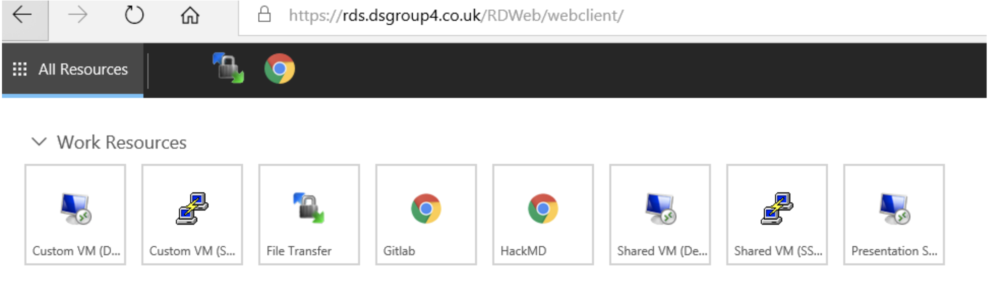
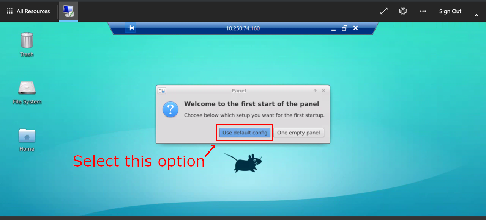
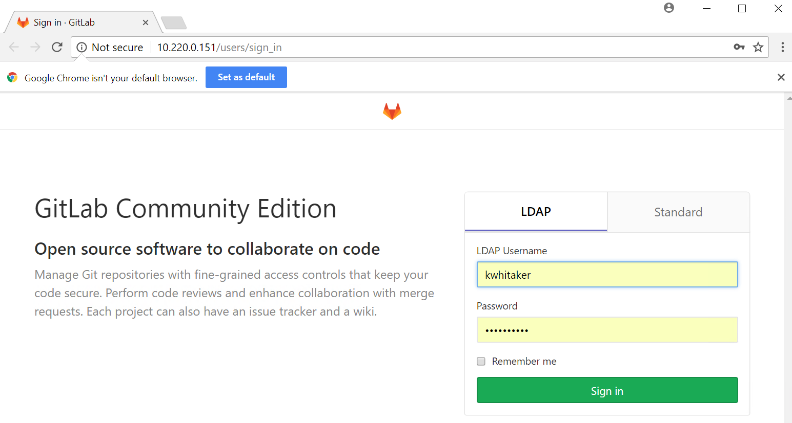
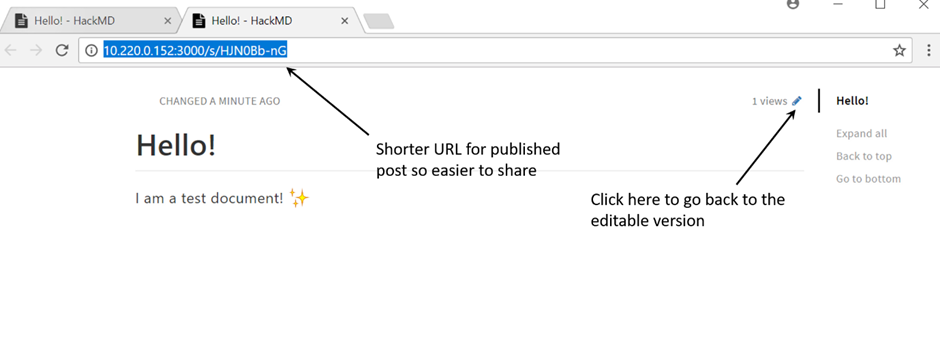

# Data Safe Havens - Cheat Sheet

## Introduction to Data Safe Havens

Welcome to the Turing Safe Haven tool. Secure environments for analysis of sensitive datasets are essential for research, giving data providers confidence that their datasets will be kept secure over the course of a project. Here at the Turing, we've developed a tool that allows you to set up secure research environments for your projects at scale, to allow you to work on sensitive / confidential datasets.

Before you get started in using a safe haven, you'll need to classify the data you're using to understand its sensitivity, and how it should be handled. The classification should be done for each work package - the combination of all the data you'll be handling over the project. There are 5 tiers, ranging from open data at Tier 0, to highly sensitive and high risk data at Tier 4. You can find out more about classifying project data, and how to do it, in our policy paper, available here: https://arxiv.org/abs/1908.08737

While working in a data safe haven secure environment, you won’t be able to use the internet. All the tools you’ll need for carrying out data science research, as well as the data you’ll be working on, will be ingressed into the safe haven upon its creation.

## Setting up for the first time

For all work packages classified at Tier 2 and above, you'll need to carry out your data science research in a Data Safe Haven environment. When getting set up to use the safe haven, you should have been provided with a username in the format: firstname.lastname@turingsafehaven.ac.uk.

<!-- markdown-link-check-disable-next-line -->
Before you begin, you’ll need to reset your password, and set up multi-factor authentication (MFA). To access the data safe haven environment on Azure, open a secure window, and copy and paste in https://rds-dsgX.dsgroupX.co.uk/RDWeb/webclient/, replacing the X with the number of the safe haven you’re going to be using. You can log in using your username and password, and confirmation through MFA, bringing you to the introductory screen. Welcome to the data safe haven!

    

The first time you use the safe haven, you’ll have to set up your user account on the virtual machine. To do so, run the "Shared VM (SSH)" app, authenticating with MFA, and dismiss the security alert. Next, run the "Shared VM (Desktop)" app and log in, using your details and MFA. You can use this secure environment to carry out secure data science research on data that's been imported in.

## Using the data safe haven

The tool gives you access to a Linux virtual machine (VM), as well as to local copies of hackMD and gitlab, for collaborative report and code writing. You won’t be able to use the internet while working in the environment.

The data you’re going to be working on is stored in the R drive on a Windows VM inside the environment. You will probably want to copy this to the Linux VM, which you can do using the File Transfer WinSCP app. To access the data science VM’s file system, enter username username and password into the login mask, and confirm with "login". You can drag and drop any files between the Linux and Windows VMs.

## Using the data analytics virtual machine

The Safe Haven contains a Linux VM for data analysis, with different packages installed on to it. The VM allows you to carry out data science research, completely isolated from the internet. You can access different applications from the terminal, including RStudio, Atom, jupyter notebook and Spider Integrated Development Environment. You can also access HackMD and Gitlab, using the browser in the VM.

    

The analytics environment can be accessed through the Shared VM (desktop) app, logging in with your username and password.

There are local copies of the PyPI and CRAN package repositories available from the Linux VM. You can install packages you need from these copies in the usual way, for example pip install --user and packages.install for Python and R respectively.

If you'd like to ingress additional code or data, such as for a new tool, you'll need to go through the classification process again, making sure that the data provider and lead investigator agree with how it is to be used.

## Accessing Gitlab and storing code

Gitlab can allow you and your team to write code collaboratively. GitLab is an open source code hosting platform for version control and collaboration. It lets you and others work together on projects, and version control all the code that you write. There is a local GitLab installation within the Work Resources.

    

You can access the same GitLab repositories from the Work Resources page or via the shared VM desktop. Make all your repositories public so they are easy to share within your group. (Note that they are not really public as the server is only available inside your team’s virtual environment.)

## Accessing HackMD and writing reports

HackMD is a tool that allows you to collaboratively write the data study group challenge report. It uses markdown which is a simple way to format your text so that it renders nicely in full html.

You can find a really great markdown cheat sheet at https://github.com/adam-p/markdown-here/wiki/Markdown-Cheatsheet. You can access the Safe Haven installation of HackMD from the Work Resources page.

    

## Finishing the project

Once you’ve finished with a project, your VM will be shut down. This means that anything that is a valuable output should be stored in the persistent storage area - shared drive - OR in the GitLab repository, rather than your local user storage.

Before you can egress any data from the environment, such as data derived from the analysis carried out, you'll have to go through the full classification process again for the data to be egressed, to make sure that the outputs are handled appropriately.
