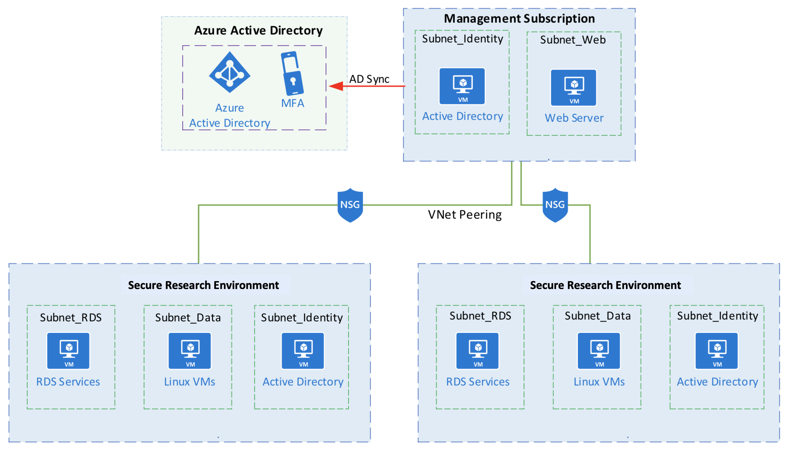
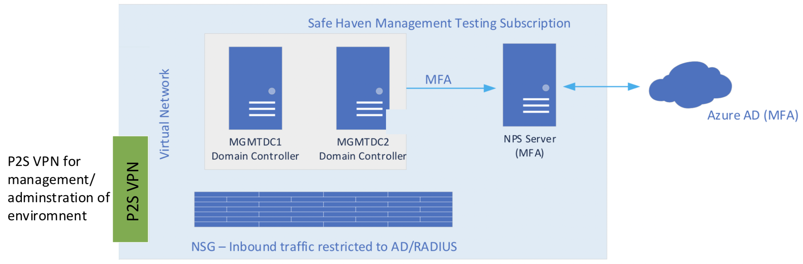

Turing Azure Safe Haven - Implementation details for Data Providers
===================================================================

Introduction
------------
The Safe Haven is designed and deployed into Microsoft Azure utilizing Azure networking and Virtual Machine (VM) infrastructure. This document describes the architecture of the Safe Haven and the security measures in place to protect the sensitive data handled within it.

### Safe Haven Management segment (SHM)
The user and machine management services for the Safe Haven are hosted on a separate subscription to any of the secure project environments.
These services include the primary authentication providers, VM images and other services that contribute to the smooth running of the service.
This provides a centralised management facility, ensuring consistency across all secure project environemts.

### Secure project environments (SREs)

Each project within the Safe Haven has its own separate secure Secure Research Environment (SRE).
Each of these SREs is completely isolated from the others and the security configuration of each SRE is set independently to match the needs of the project and Data Provider(s).
Each SRE is assigned to a security tier, depending on the sensitivity of the dataset(s) it will hold and the nature of the analysis to be performed within it.
Each tier is associated with a baseline security configuration, individual elements of which can be adjusted to meet the needs of the project and the Data Provider(s).

The infrastructure for each SRE is hosted in a separate Azure subscription. This infrastructure comprises:

  - One or more compute VMs with a range of data science software preinstalled
  - A file server to host the project data
  - A Gitlab server to provide source code management and version control
  - A HackMD server for collaborative writing
  - Remote Desktop Services Gateway and Session Host servers to provide secure remote desktop access to the SRE resources.
  - A local Active Directory Domain Controller server to support the management of the Windows servers within the SRE.

Hosting each secure project environment in its own subscription supports a clean lifecycle management process, making it easy to verifiably delete all project data and resources at the end of a project.

High-level architecture
-----------------------

The Management segment hosts the authentication providers for the infrastructure.
The identity provider is Microsoft Active Directory, which is synchronised with AzureAD to provide cloud and multifactor authentication into the individual project Secure Research Environment (SRE).

The Management segment is connected to the SREs using Azure Virtual Network Peering. This connection passes authentication traffic between the servers in the SRE to AD servers within the Management subscription. While all SREs are peered with the Management segment, there is no connectivity between SREs directly.

Management segment (SHM) architecture
-------------------------------------

Within the Management segment all authentication services are contained within a single virtual network (VNet).
The Windows Servers are running Active Directory and are acting as Domain Controllers.
They are configured within an Azure availability set to ensure maximum up time.

In addition to the Domain Controllers there is a Windows Network Policy server, this server provides Multifactor Authentication services to the Remote Desktop Servers hosted within the SREs.

The NPS server is also running Azure AD Connect to synchronise user IDs to the AzureAD that is associated with the Management subscription.
Network security is provided by Azure Network Security Groups that ensure that inbound connections are limited to Active Directory and RADIUS traffic.

For management of the environment there is an Azure point-to-site (P2S) VPN service configured. Access to this is limited to the Turing IT team and requires both a client certificate and administrative login credentials.

Secure project environment (SRE) architecture
---------------------------------------------

The SREs use Windows Remote Desktop Services to provide a secure connection to the resources within the environment. Only the RDS Gateway server is accessible from outside the SRE. Connections to this are made via an SSL/TLS secured connection that requires the user to authenticate using Turing provided credentials and validated with MFA.

For Tier 2 and above, RDS prevents the copying of information into or out of the environment, internet access from within the environment is blocked and access to the RDS Gateway is only permitted from approved networks.

For management of the environment there is an Azure point-to-site (P2S) VPN service configured. Access to this is limited to the Turing IT team and requires both a client certificate and administrative login credentials.

Package mirrors
---------------

For Tier 2 and Tier 3 SREs, a selection of Python and R packages can be provided via a set of servers that mirror some or all of the PyPI or CRAN package servers.

Tier 2 environments can access a common set of full mirrors of PyPI and CRAN, while each Tier 3 environment can have its own dedicated set of mirrors, hosting only a subset of PyPI or CRAN packages restricted to a SRE specific whitelist. Connection of SREs to mirror sets is achieved via VNet peering. While Tier 2 SREs are peered to the same mirror VNet, this does not permit communication between SREs.

To minimise the risk of any breaches via the package mirrors, there are two mirror servers for each official package server mirrored.

The "external" mirror is protected by an infrastructure level firewall that does not permit any **inbound** connections at all (not even from the "internal" mirror). It can call out to the internet to update itself from the official package server and can push updates to the "internal" mirror via rsync.

The "internal" mirror is protected by an infrastructure level firewall that does not permit any **outbound** connections at all (not even to the "external" mirror). It can receive inbound rsync connections from the "external" mirror to receive package updates and inbound connections from its associated SREs to install packages.

Between them this pair of servers operate as a one-way "airlock" to allow packages to be pulled from the official package server on the internet and made available to compute VMs in project SREs, while not permitting the mirrors to be used to connect to the internet from a SRE. Even if the "internal" mirror was to be compromised, the infrastructure level firewall restricting outbound connections would prevent access to any other resources within the Safe Haven or outside of it.

Researcher authentication
-------------------------

Each of the SREs has a local Active Directory that is used for management of the RDS servers and file server. This local Active Directory domain has a Trust with the Active Directory domain within the Management segment. User accounts are created in the Management Active Directory and added to security groups. These security groups are then applied to the RDS servers in the SREs. This provides a central user management experience for the support staff and permits Researchers to more easily work on multiple projects hosted within the Safe Haven. Access to individual project SREs is restricted to Researchers who have been added to the associated security group.

Admistrative access
-------------------
Access to all Safe Haven Azure resources is controlled via Azure Active Directory (Azure AD) and Role-Based Access Control (RBAC). Only members of the Safe Haven Administrators security group have administrative access to any element of the Safe Haven. Membership of this security group is limited to the Turing IT team.

The following access is restricted to members of the Safe Haven Administrators security group:

- Administrative access to the underlying Azure resources comprising the software defined infrastructure of the Safe Haven (e.g. subscriptions, virtual networks, network security groups, virtual machines, Safe Haven Azure Active Directory). Access to the underlying Azure resources requires administrators to log into Azure using their Turing institutional credentials and multifactor authentication.
- Administrative access to the Safe Haven Management (SHM) segment. Used primarily to manage users and security groups within the Safe Haven, as well as to troubleshoot any authentication issues. Access is via an Azure point-to-site (P2S) VPN service, and requires both a client certificate and administrative login credentials.
- Administrative access to all project SREs. Used to troubleshoot any issues and ingress data and code following review. Access is via an Azure point-to-site (P2S) VPN service, and requires both a client certificate and administrative login credentials.

SRE security configuration
--------------------------

- Researchers can only access the SRE by connecting via SSL/TLS to the Remote Desktop Services (RDS) Gateway, which allows them to then access other SRE resources via the RDS HTML5 web application.
- Researchers must log into the RDS Gateway using a Turing managed Safe Haven user account, created in the Safe Haven Management segment and separate from any credentials used to access other Turing IT services.
- Only Researchers assigned to the security group associated with a specific project in the Management segment can log into that project's SRE.
- Once successfully logged into the RDS Gateway, users must additionally authenticate with their user credentials and multifactor authentication (MFA) to access specific SRE resources. Multifactor authentication is via a phone call to the user's mobile or a notification on the Microsoft Authenticator app on their mobile.
- For Tier 2 and above, access to the internet from within the SRE is blocked by the SRE's Network Security Group (NSG) rules.
- The copying of information into or out of any of the resources in the SRE is prevented by the RDS configuration.
- Researchers are not provided with any administrative rights on the data science compute VMs, but can install additional Python or R packages in their own user directories from internal mirrors of the PyPI and CRAN package servers.
  - For Tier 2, access is provided to a local copy of all packages on the official PyPI and CRAN servers.
  - For Tier 3, access is provided to a limited whitelist of packages from the official PyPI and CRAN servers. This whitelist can be configured separately for each Tier 3 project SRE.
- Access to the RDS Gateway is only permitted from the IP addresses associated with specific networks at the Turing or its partner institutes.
  - For Tier 2, access is permitted from any institutionally managed network, which may be accessible by anyone on-site at the institute.
  - For Tier 3, access is only permitted from designated restricted networks, accessible only by a known subset of Researchers.

Data Ingress
------------
The Azure Safe Haven supports the _High security transfer protocol_ described in the _Sensitive Data Handling at the Turing_ overview document (relevant excerpt quoted below).

>This protocol should limit all aspects of the transfer to provide the minimum necessary exposure:
>
>  - The time window during which dataset can be transferred
>  - The networks from which it can be transferred
>
>To deposit the dataset, a time limited or one-time access token, providing write-only access to the secure transfer volume, will be generated and transferred via a secure channel to the Dataset Provider Representative.

The above protocol is implemented using an Azure Storage account as follows:

- A separate Azure storage container is created for each project for each Data Provider (i.e. if there are multiple Data Providers for a project, a separate container will be created for each Data Provider). This is created within a Storage Account in the Safe Haven Management segment and is only accessible by Turing IT staff.
- Access to the storage container is restricted to the IP address range used by the people at the Data Provider authorised to upload the data. This IP address range is communicated to the Turing by the Data Provider via the Turing's secure email service.
- The Turing will generate a Shared Access Signature (SAS token) and send it to the Data Provider via the Turing's secure email service.
- The SAS token will have permissions to upload, delete and amend files in the container, as well as list the uploaded files. However, it will not have permissions to read or download the files themselves. This provides an added layer of protection against loss of the SAS token at the Data Provider.
- The SAS token will only be valid for a limited time period, providing sufficient time to organise the upload of the data but minimising the amount of time the token remains valid after the data is uploaded.

We strongly recommend that the above process is used to securely transfer data to the Safe Haven. Where this is genuinely not possible for a particular Data Provider, we may consider transfer of data to the Turing via an alternative equally secure method.
