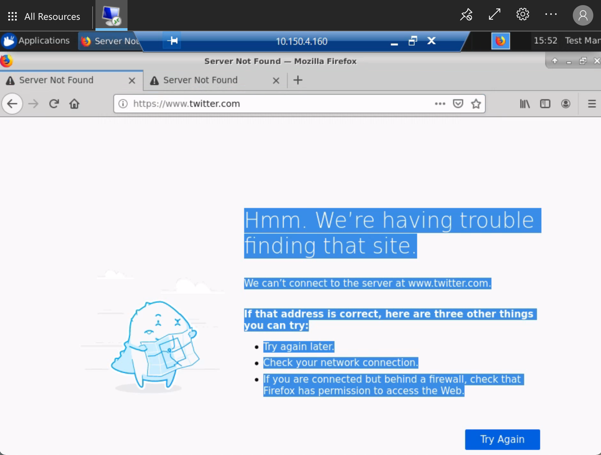
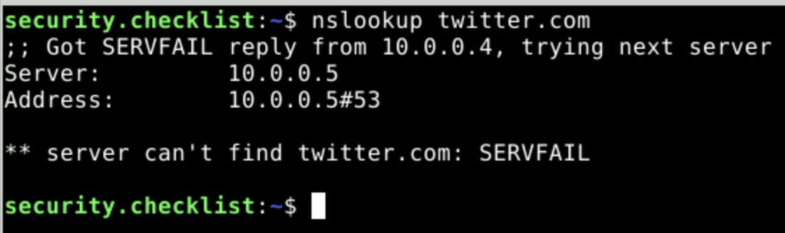

# Security evaluation checklist

In this check list we aim to do the following things:

+ Establish our current claims about the Data Safe Haven
+ Establish what these security claims mean in terms of implementation
+ How we can verify that we actually do what we say

This diagram shows the security standards we're trying to meet for Data Safe Haven Secure Research Environments (SREs). The security checklist currently focuses on checks that can verify these security requirements for tier 2+ SREs (with some steps noted as specific to a tier):

## How to use this checklist

+ Ensure you have an SHM and attached SRE(s) that you wish to test.
  + Note: Some parts of the checklist are only relevant when there are multiple SREs attached to the same SHM
+ Work your way through the actions described in each section, taking care to notice each time you see a :camera: or a :white_check_mark: and the word **Verify**:
  + :camera: Where you see the camera icon, there should be accompanying screenshot(s) of evidence for this item in the checklist (you may wish to save your own equivalent screenshots as evidence)
  + :white_check_mark: This indicates a checklist item for which a screenshot is either not appropriate or  difficult

## Contents

+ [Prerequisites](#prerequisites)
+ [Multifactor Authentication and Password strength](#1-multifactor-authentication-and-password-strength)
+ [Isolated Network](#2-isolated-network)
+ [User devices](#3-user-devices)
+ [Physical security](#4-physical-security)
+ [Remote connections](#5-remote-connections)
+ [Copy-and-paste](#6-copy-and-paste)
+ [Data Ingress](#7-data-ingress)
+ [Data Egress](#8-data-egress)
+ [Software ingress](#9-software-ingress)
+ [Package mirrors](#10-package-mirrors)
+ [Azure Firewalls](#11-azure-firewalls)

## Prerequisites

+ **Deployed SHM** that you are testing
+ **Deployed SRE A** that is attached to the SHM
+ **Deployed SRE B** that is attached to the same SHM

+ **VPN access** to the SHM that you are testing
  + If you haven't already, you'll need download a VPN certificate and configure [VPN access](../../tutorial/deployment_tutorials/how-to-deploy-shm.md#download-a-client-vpn-certificate-for-the-safe-haven-management-network) for the SHM
  + Make sure you can use Remote Desktop to log in to the [domain controller (DC1)](../../tutorial/deployment_tutorials/how-to-deploy-shm.md#configure-the-first-domain-controller-via-remote-desktop) and the [network policy server (NPS)](../../tutorial/deployment_tutorials/how-to-deploy-shm.md#log-in-to-the-nps-vm-using-microsoft-remote-desktop).

The following users will be needed for this checklist

+ **SRE standard user** who is a member of the **SRE A** research users group
  + Create a new user **without** MFA
    + Following the [SRE deployment guide](../../tutorial/deployment_tutorials/how-to-deploy-sre.md#optional-set-up-a-non-privileged-user-account) for setting up a non privileged user account, create an account, then check the following before (and after (adding them to the `SG <SRE ID> Research Users` group.
    + Visit https://aka.ms/sspr in an incognito browser
    + Attempt to login and reset password, but **do not complete MFA** (see [these steps](../../how_to_guides/user_guides/user-guide.md#closed_lock_with_key-set-a-password))
+ **System administrator** who has `Contributor` permissions (or higher) on the underlying Azure subscription
+ **Data provider** who has no accounts on the Safe Haven system

## 1. Multifactor Authentication and Password strength

### We claim:

Users are required to authenticate with Multi Factor Authentication (MFin order to access the secure analysis environment.

Passwords are strong

### Which means:

Users must set up MFA before accessing the secure analysis environment. Users cannot access the environment without MFA. Users are strongly advised to create passwords of a certain strength.

### Verify by:

+ Check that the **SRE standard user** cannot access the apps
  + Attempt to login to the remote desktop web client (`https://<SRE ID>.<safe haven domain> (eg. https://sandbox.dsgroupdev.co.uk/`)
  + 

      
:camera: <b>Verify before adding to group:</b> Guacamole: User is prompted to setup MFA

      
    

  + 

      
:camera: <b>Verify before adding to group:</b> Microsoft Remote Desktop: Login works but apps cannot be viewed

      
    

+ Check that adding the **SRE standard user** to the relevant `Research Users` group under `Safe Haven Security Groups` on the domain controller does not give them access
  + 

      
:camera: <b>Verify after adding to group:</b> Guacamole: User is prompted to setup MFA

      
    

  + 

      
:camera: <b>Verify after adding to group:</b> Microsoft Remote Desktop: Login works and apps can be viewed

      
    

  + 

    
:camera: <b>Verify after adding to group:</b> Microsoft Remote Desktop: attempt to login to DSVM Main (Desktop) fails

      
    

+ Check that the **SRE standard user** is able to successfully set up MFA
  + Visit https://aka.ms/mfasetup in an incognito browser
  + Login as the user you set up
  + :white_check_mark: **Verify:** user guided to set up MFA
  + Set up MFA as per [the user guide instructions](../../how_to_guides/user_guides/user-guide.md#door-set-up-multi-factor-authentication)
  + 

      
:camera: <b>Verify:</b> successfully set up MFA

      
    

+ Check that the **SRE standard user** can authenticate with MFA
  + Login into the remote desktop web client (`https://<SRE ID>.<safe haven domain> (eg. https://sandbox.dsgroupdev.co.uk/`)
  + 

      
:camera: <b>Verify:</b> Guacamole: respond to the MFA prompt

      
    

  + 

      
:camera: <b>Verify:</b> Microsoft Remote Desktop: attempt to log in to DSVM Main (Desktop) and respond to the MFA prompt

      
    

+ Check that the **SRE standard user** can access the DSVM desktop
  + Login into the remote desktop web client (`https://<SRE ID>.<safe haven domain> (eg. https://sandbox.dsgroupdev.co.uk/`)
  + 

      
:camera: <b>Verify:</b> Guacamole: connect to <i>Desktop: Ubuntu0</i> 

      
    

  + 

      
:camera: <b>Verify:</b> Microsoft Remote Desktop: connect to <i>DSVM Main (Desktop)</i>

      
    

## 2. Isolated Network

### We claim:

The DSH Virtual Network is isolated from external connections (both tier 2 and 3)

### Which means:

Users cannot access any part of the network without already being in the network. Being part of the network involves connecting using an SHM specific Management VPN.

Whilst in the network, one cannot use the internet to connect outside the network.

SREs in the same SHM are still isolated from one another.

### Verify by:

+ Connect to the SHM DC, NPS, Data server if and only if connected to the SHM VPN:
  + Connect to the SHM VPN
  + Attempt to connect to the SHM DC and SHM NPS
  + :white_check_mark: **Verify:** Connection works
  + Disconnect from the SHM VPN
  + Attempt to connect to the SHM DC and SHM NPS
  + :white_check_mark: **Verify:** Connection fails
+ Fail to connect to the internet from within a DSVM on the SRE network.
  + Login as a user to a DSVM from within the SRE by using the web client.
  + Choose your favourite three websites and attempt to access the internet using a browser
  + 

      
:camera: <b>Verify:</b> Connection fails

      
    

  + 

      
:camera: <b>Verify:</b> that you cannot access a website using curl

      
    

  + 

      
:camera: <b>Verify:</b> that you cannot get the IP address for a website using nslookup

      
    

+ Check that users cannot connect from one SRE to another one in the same SHM, even if they have access to both SREs
  + Ensure that the **SRE standard user** is a member of the research users group for both **SRE A** and **SRE B**
  + Connect to SRE A as the **SRE standard user** by using the web client.
  + Log in to the DSVM remote desktop:
  + Open the `Terminal` app from the dock at the bottom of the screen and enter `ssh -v -o ConnectTimeout=10 <IP address>` where the IP address is one for a DSVM in SRE B (you can find this in the Azure portal)
  + 

      
:camera: <b>Verify:</b> Connection fails 

      
    

+ Check that users cannot copy files from one SRE to another one in the same SHM
  + Connect to a DSVM in SRE A as the **SRE standard user** by using the web client.
  + In a separate browser window, do the same for SRE B.
  + Attempt to copy and paste a file from one SRE desktop to another
  + :white_check_mark: **Verify:** Copy and paste is not possible
+ Check that the network rules are set appropriately to block outgoing traffic
  + Visit the portal and find `NSG_SHM_<SHM ID>_SRE_<SRE ID>_COMPUTE`, then click on the `Outbound security rules` under `Settings`
  + 

      
:camera: <b>Verify:</b> There exists an NSG rule with Destination "Internet" and Action "Deny" and that no higher priority rule allows connection to the internet.

      
    

## 3. User devices

### We claim:

At tier 3, only managed devices can connect to the DSH environment.

At tier 2, all kinds of devices can connect to the DSH environment (with VPN connection and correct credentials).

### This means

A managed device is a device provided by a partner institution in which the user does not have admin or root access.

Network rules for the higher tier Environments can permit access only from Restricted network IP ranges that only permit managed devices to connect.

### Verify by:

For tier 2:

+ One can connect regardless of device as long as one has an allowlisted IP address and credentials
  + Using a personal device, connect to the environment using an allowlisted IP address and credentials
  + :white_check_mark: **Verify:** Connection succeeds
  + Using a managed device, connect to the environment using an allowlisted IP address and credentials.
  + :white_check_mark: **Verify:** Connection succeeds

For tier 3:

+ A device is managed by checking user permissions and where the device has come from. We should check that it is managed by the partner institution's IT team.
  + Check that the device is managed by the partner institution IT team
  + :white_check_mark: **Verify:** The user lacks root access
+ A device is able to connect to the environment if and only if it is managed (with correct VPN and credentials)
  + Using a personal device, attempt to connect to the environment using the correct VPN and credentials
  + :white_check_mark: **Verify:** Connection fails
  + Using a managed device, attempt to connect to the environment using the correct VPN and credentials
  + :white_check_mark: **Verify:** Connection succeeds

For tiers 2 and above:

+ There are are network rules permitting access only from allowlisted IP addresses
  + Navigate to the NSG for this SRE in the portal:
    + *Microsoft Remote Desktop:* `NSG_SHM_<SHM ID>_SRE_<SRE ID>_RDS_SERVER`
    + *Guacamole:* `NSG_SHM_<SHM ID>_SRE_<SRE ID>_GUACAMOLE`
  + 

      
:camera: <b>Verify:</b> The NSG has network rules allowing <b>inbound</b> access from allowlisted IP addresses only

      
    

  + :white_check_mark: **Verify:** All other NSGs (apart from `NSG_SHM_<SHM ID>_SRE_<SRE ID>_DEPLOYMENT`) have an inbound `Deny All` rule and no higher priority rule allowing inbound connections from outside the Virtual Network (apart from the Admin VPN in some cases).

## 4. Physical security

### We claim:

At tier 3 access is limited to certain secure physical spaces

### Which means:

Medium security research spaces control the possibility of unauthorised viewing. Card access or other means of restricting entry to only known researchers (such as the signing in of guests on a known list) is required. Screen adaptations or desk partitions can be adopted in open-plan spaces if there is a high risk of "visual eavesdropping".

Firewall rules for the Environments can permit access only from Restricted network IP ranges corresponding to these research spaces.

### Verify by:

For tier 3:

+ Connection from outside the secure physical space is not possible.
  + Attempt to connect to the tier 3 SRE web client from home using a managed device and the correct VPN connection and credentials
  + :white_check_mark: **Verify:** connection fails
+ Connection from within the secure physical space is possible.
  + Attempt to connect from research office using a managed device and the correct VPN connection and credentials
  + :white_check_mark: **Verify:** connection succeeds
+ :white_check_mark: **Verify:** Check the network IP ranges corresponding to the research spaces and compare against the IPs accepted by the firewall.
+ :white_check_mark: **Verify:** Confirm in person that physical measures such as screen adaptions or desk partitions are present.

## 5. Remote connections

### We claim:

Connections can only be made via remote desktop (Tier 2+)

### This means

User can connect via remote desktop but cannot connect through other means such as SSH

### Verify by:

+ Unable to connect as the **SRE standard user** to the DSVM via SSH
  + Find the public IP address for the `RDG-SRE-<SRE ID>` VM by searching for this VM in the portal, then looking at `Connect` under `Settings`.
  + Attempt ssh login with `ssh user.name@<SRE ID>.<Domain>.co.uk@<Public IP>` (e.g. `ssh john.doe@testa.dsgroupdev.co.uk@<Public IP>`)
  + 

      
:camera: <b>Verify:</b> ssh login fails 

      
    

  + :white_check_mark: **Verify:** The RDS server (`RDG-SRE-<SRE ID>`) is the only resource with a public IP address

## 6. Copy-and-paste

### We claim:

Copy and paste is disabled on the remote desktop

### Which means:

One cannot copy something from outside the network and paste it into the network. One cannot copy something from within the network and paste it outside the network.

### Verify by:

+ Users are unable to copy some text from outside the network, into a DSVM and vice versa
  + Copy some text from your deployment device
  + Login to a DSVM as the **SRE standard user** via the remote desktop web client
  + Open up a notepad or terminal on the DSVM and attempt to paste the text to it.
  + :white_check_mark: **Verify:** paste fails
  + Write some next in the note pad or terminal of the DSVM and copy it
  + Attempt to copy the text externally to deployment device (e.g. into URL of browser)
  + :white_check_mark: **Verify:** paste fails
+ Users cannot copy between VMs inside the network
  + Login to a DSVM as the **SRE standard user** via the remote desktop web client
  + Open up a notepad or terminal on the DSVM and attempt to paste the text to it.
  + Connect to another DSVM (for example, the SSH connection) via the remote desktop web client (as a second tab)
  + Attempt to paste the text to it.
  + :white_check_mark: **Verify:** paste succeeds

## 7. Data ingress

### We claim:

All data transfer to the Turing should be via our secure data transfer process, which provides the Dataset Provider time-limited, write-only access to a dedicated data ingress volume from a specific location.

Data is stored in a holding zone until approved to be added for user access.

### This means

Prior to access to the ingress volume being provided, the Dataset Provider Representative must provide the IP address(es) from which data will be uploaded and an email address to which a secure upload token can be sent. Once these details have been received, the Turing will open the data ingress volume for upload of data.

To minimise the risk of unauthorised access to the dataset while the ingress volume is open for uploads, the following security measures are in place:

+ Access to the ingress volume is restricted to a limited range of IP addresses associated with the Dataset Provider and the Turing.
+ The Dataset Provider receives a write-only upload token. This allows them to upload, verify and modify the uploaded data, but does not viewing or download of the data. This provides protection against an unauthorised party accessing the data, even they gain access to the upload token.
+ The upload token expires after a time-limited upload window.
+ The upload token is transferred to the Dataset Provider via a secure email system.

### Verify by:

To test all the above, you will need to act both as the administrator and data provider:

+ As the **system administrator** generate a secure upload token and check it can be sent to the email address provided by the **data provider** via a secure email system
  + :white_check_mark: **Verify:** that a secure upload token can be created with write-only permissions, by following the instructions in the [administrator document](../../how_to_guides/administrator/how-to-be-a-sysadmin.md#data-ingress), using the IP address of your own device in place of that of the data provider
  + :white_check_mark: **Verify:** that you are able to send a secure email containing this token (e.g. send it to your own email for testing purposes)

+ Ensure that data ingress works for connections from within the accepted IP address and does not work for connections outside the IP address, even if the correct upload token is present.
  + As the **data provider**, ensure you're working from a device that has an allow-listed IP address
  + Using the secure upload token with write-only permissions and limited time period that you set up in the previous step, follow the [ingress instructions for the data provider](../../how_to_guides/data_provider/how-to-ingress-data-as-provider.md)
  + :white_check_mark: **Verify:** that writing succeeds by uploading a file
  + :white_check_mark: **Verify:** that attempting to open or download any of the files results in the following error: `Failed to start transfer: Insufficient credentials.` under the `Activities` pane at the bottom of the MS Azure Storage Explorer window
  + Switch to a device that lacks an allow-listed IP address (or change your IP with a VPN)
  + Attempt to write to the ingress volume via the test device
  + :white_check_mark: **Verify:** that the access token fails.

+ Check the token duration and ensure that the upload fails if the duration has expired.
  + Create a write-only token with short duration
  + :white_check_mark: **Verify:** you can connect and write with the token during the duration
  + :white_check_mark: **Verify:** you cannot connect and write with the token after the duration has expired

+ :white_check_mark: **Verify:** Check that the overall ingress works by uploading different kinds of files, e.g. data, images, scripts (if appropriate).

## 8. Data egress

### We claim:

SREs contain an `/output` volume, in which SRE users can store data designated for egress.

### This means:

A **system administrator** can view and download data in the `/output` volume via Azure Storage Explorer.

### Verify by:

+ Confirm that a non-privileged user is able to read the different storage volumes and write to Output
  + Login to a DSVM as the **SRE standard user** via the remote desktop web client
  + Open up a file explorer and search for the various storage volumes
  + :white_check_mark: **Verify:** that the `/output` volume exists and can be read and written to
  + :white_check_mark: **Verify:** that the permissions of other storage volumes match that described in the [user guide](../../how_to_guides/user_guides/user-guide.md#open_file_folder-shared-directories-within-the-sre)
+ Confirm that the different volumes exist in blob storage and that logging on requires domain admin permissions
  + As the **system administrator**, follow the instructions in the [administrator document](../../how_to_guides/administrator/how-to-be-a-sysadmin.md#data-egress) on how to access files set for egress with Azure Storage Explorer
  + :white_check_mark: **Verify:** You can see the files written to the Output storage volume (including any you created as a non-privileged user in step 1)
  + :white_check_mark: **Verify:** that a written file can be taken out of the environment via download

## 9. Software Ingress

### We claim:

The base data science virtual machine provided in the secure analysis Environments comes with a wide range of common data science software pre-installed, as well as package mirrors. For other kinds of software this must be added separately via ingress.

Software is stored in a holding zone until approved to be added for user access.

### Which means:

For tier 0/1 environments, outbound internet access means users can directly download their software from the internet. For tier 2+ environments we use the secure data transfer process.

+ Installation during deployment
  + If known in advance, software can be installed during DSVM deployment whilst there is still internet access, but before project data is added. Once the software is installed, the DSVM undergoes ingress into the environment with a one way lock.
+ Installation after deployment
  + Once a DSVM has been deployed into the analysis environment it cannot be moved out. There is no outbound internet access.
  + Software is added via ingress in a similar manner to data. Researchers are provided temporary write-only access to the software ingress volume (external mode). The access is then revoked and the software is then reviewed. If it passes review, the software ingress volume is changed to provide researchers with read-only access to the environment (internal mode).
  + If the software requires administrator rights to install, a System Manager must do this. Otherwise, the researcher can do this themselves.

### Verify by:

+ Check that some software tools were installed as expected during deployment
  + Login to a DSVM as the **SRE standard user** via the remote desktop web client
  + 

      
:camera: <b>Verify:</b> Confirm that the following programmes can be opened without issue: DBeaver, RStudio, PyCharm and Visual Studio Code

      
    

+ Check that it's possible to grant and revoke software ingress capability by following the instructions in the [Safe Haven Administrator Documentation](../../how_to_guides/administrator/how-to-be-a-sysadmin.md#software-ingress):
  + :white_check_mark: **Verify:** You can generate a temporary write-only upload token
  + :white_check_mark: **Verify:** You can upload software as a non-admin with this token, but write access is revoked after the temporary token has expired
  + :white_check_mark: **Verify:** Software uploaded to the by a non-admin can be read by administrators
  + :white_check_mark: **Verify:** Check that the **SRE standard user** cannot install software that requires administrator rights (e.g. anything that is installed with `apt`)

## 10. Package mirrors

### We claim:

Tier 2: User can access all packages from PyPI/CRAN

Tier 3: User can only access approved packages from PyPI/CRAN

### This means:

Tier 2: The user can access any package from our mirrors. They can freely use these packages without restriction.

Tier 3: The user can only access a specific pre-agreed set of packages. They will be unable to download any package not on the allowlist.

### Verify by:

Tier 2:

+ Download packages from the full mirror.
  + Login as the **SRE standard user** into a DSVM via remote desktop web client
  + Open up a terminal
  + Attempt to install any package that is not included out-of-the-box (for example, try `pip install botocore`)
  + 

      
:camera: <b>Verify:</b> You can install the package 

      
    

Tier 3:

+ Download packages on the allowlist (see the lists in `environment_configs/package_lists`)
  + Login as the **SRE standard user** into a DSVM via remote desktop web client
  + Attempt to install a package on the allowlist that is not included out-of-the-box (for example, try `pip install aero-calc`)
  + Then attempt to download a package that is not included in the allowlist (for example, try `pip install botocore`)
  + 

      
:camera: <b>Verify:</b> the first download succeeds and the second fails

      
    

## 11. Azure Firewalls

### We claim:

An Azure Firewall ensures that the administrator VMs have the minimal level of internet access required to function.

### Which means:

Whilst all user access VMs are entirely blocked off from the internet, this is not the case for administrator access VMs such as the SHM-DC, SRE DATA server. An Azure Firewall governs the internet access provided to these VMs, limiting them mostly to downloading Windows updates.

### Verify by:

+ Admin has limited access to the internet
  + As the **system administrator** use Remote Desktop to connect to the SHM domain controller VM
  + Attempt to connect to a non-approved site, such as `www.google.com`
  + 

      
:camera: <b>Verify:</b> connection fails

      
    

+ Admin can download Windows updates
  + As the **system administrator** use Remote Desktop to connect to the SHM domain controller VM
  + Click on `Start -> Settings-> Update & Security`
  + Click the `Download` button
  + 

      
:camera: <b>Verify:</b> download and update successful

      
    

