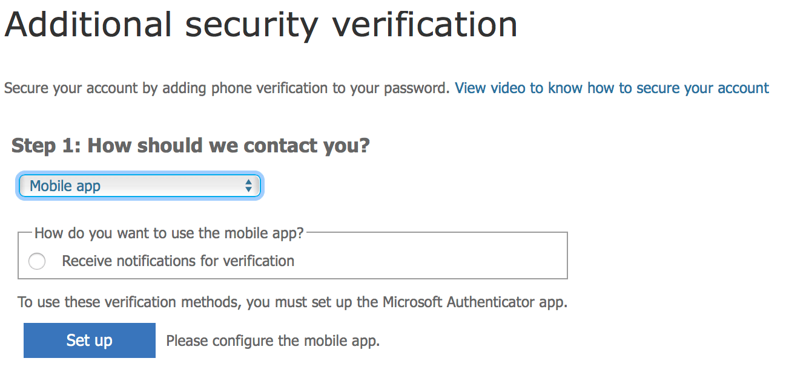
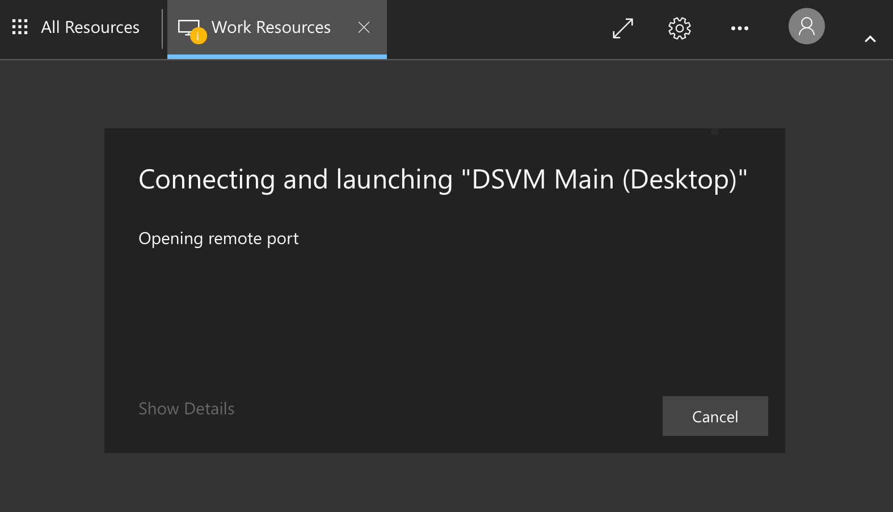
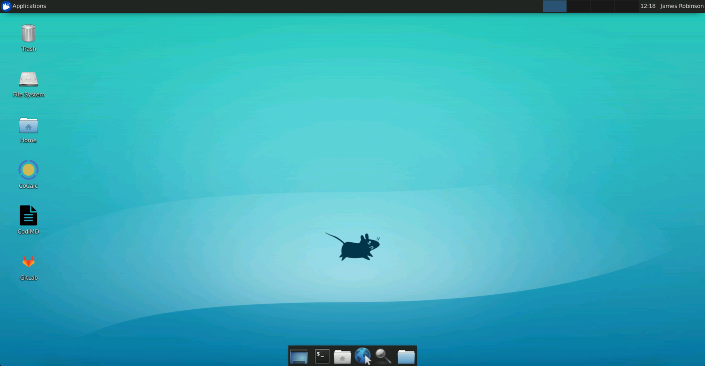

# Safe Haven User Documentation

## 📬 Table of contents

- [🔰 Introduction: The Turing Safe Haven](#-introduction-the-turing-safe-haven)
- [🚀 Set up your account](#-set-up-your-account)
  - [🌱 Prerequisites](#-prerequisites)
  - [🔐 Set a password](#-set-a-password)
  - [☎️ Set up multi-factor authentication (MFA)](#-set-up-multi-factor-authentication-mfa)
- [🚪 Access the Secure Research Environment](#-access-the-secure-research-environment)
  - [🌱 Prerequisites](#-prerequisites-1)
  - [🏠 Log into the research environment](#-log-into-the-research-environment)
  - [🐧 Log into the Linux Data Science desktop](#-log-into-the-linux-data-science-desktop)
- [🖥 Develop analyses via the Linux Data Science desktop](#-develop-analyses-via-the-linux-data-science-desktop)
  - [🌍 Overview](#-overview)
  - [🎹 Keyboard mapping](#-keyboard-mapping)
  - [🔓 Access applications](#-access-applications)
  - [🐍 Initiate the correct version of R or python](#-initiate-the-correct-version-of-r-or-python)
  - [📦 Install R and python packages](#-install-r-and-python-packages)
- [🔗 Share files with collaborators](#-share-files-with-collaborators)
  - [📂 Shared directories within the SRE](#-shared-directories-within-the-sre)
  - [📰 Bring in new files to the SRE](#-bring-in-new-files-to-the-sre)
- [🤝 Collaborate on code using GitLab](#-collaborate-on-code-using-gitlab)
  - [🌍 Overview](#-overview-1)
  - [📇 Maintaining an archive of the project](#-maintaining-an-archive-of-the-project)
  - [🔓 Access GitLab](#-access-gitlab)
  - [👐 Public repositories within the SRE](#-public-repositories-within-the-sre)
  - [👷 Support for GitLab use](#-support-for-gitlab-use)
- [📖 Collaborate on documents using HackMD](#-collaborate-on-documents-using-hackmd)
  - [🌍 Overview](#-overview-2)
  - [🔓 Access HackMD](#-access-hackmd)
  - [✒️ Editing other people's documents within the SRE](#-editing-other-peoples-documents-within-the-sre)
  - [⁉️ Troubleshooting HackMD](#-troubleshooting-hackmd)
- [🔓 Access additional virtual machines](#-access-additional-virtual-machines)
- [🐛 Report a bug](#-report-a-bug)
  - [💁 Help us to help you](#-help-us-to-help-you)
- [🙏 Acknowledgments](#-acknowledgments)
- [📓Appendix A: Gitlab tutorial notes](#-appendix-a-gitlab-tutorial-notes)
- [⁉️ Appendix B: Troubleshooting](#-appendix-b-troubleshooting)
  - [❗ No applications available](#-error-no-applications-available)
  - [❗ Unexpected certificate error](#-error-unexpected-certificate-error)

## 🔰 Introduction: The Turing Safe Haven

Welcome to the Turing Safe Haven!

Secure research environments (SREs) for analysis of sensitive datasets are essential to give data providers confidence that their datasets will be kept secure over the course of a project.
Here at the Turing, we've developed a tool that allows groups of researchers to work together on projects that involve sensitive or confidential datasets at scale.
Our goal is to ensure that you are able to implement the most cutting edge data science techniques while maintaining all ethical and legal responsibilities of information governance and access.

The data you are working on will have been classified into one of five sensitivity tiers, ranging from open data at Tier 0, to highly sensitive and high risk data at Tier 4.
The tiers are defined by the most sensitive data in your project, and may be increased if the combination of data is deemed to be require additional levels of security.
You can read more about this process in our policy paper: *Arenas et al, 2019*, [`arXiv:1908.08737`](https://arxiv.org/abs/1908.08737).

The level of sensitivity of your data determines whether you have access to the internet within the safe haven SRE and whether you are allowed to copy and paste between the secure research environment and other windows on your computer.
This means you may be limited in which data science tools you are allowed to install.
You will find that many software packages are already available, and the administrator of the safe haven SRE will ingress - bring into the environment - as many additional resources as possible.

**Please read this user guide carefully and remember to refer back to it when you have questions.**
In many cases the answer is already here, but if you think this resource could be clearer, please let us know so we can improve the documentation for future users.

## 🚀 Set up your account

This section of the user guide will help you set up your new account on the Turing safe haven SRE.

### 🌱 Prerequisites

Make sure you have all of the following in front of you when connecting to the safe haven SRE.

* 📧 The email from your SRE administrator with your account details.
* 💁 Your [username](#username), defined in the email from your SRE administrator.
* 🏣 The [domain name](#domain-names) for the safe haven SRE, defined in the email from your SRE administrator.
* 💻 Your computer.
* 📡 [Access](#network-access) to the specific wired or wireless network detailed in the email from your SRE administrator.
* 📱 Your [phone](#your-phone-for-multi-factor-authentication), with good signal connectivity.

#### Username

Your username will usually be in the format `firstname.lastname`

In some places, you will need to enter it in the form `username@<Safe Haven domain>` (eg. `firstname.lastname@apr20.turingsafehaven.ac.uk`).

> 👉 You can find your username in the email you received from the SRE administrator.

> 📝 If you have a hyphenated last name, or multiple surnames, or a long family name, your assigned username may not follow the same pattern of `firstname.lastname`.
> Please check with the SRE administrator if you are unsure about your username.

In this document we will use Ada Lovelace as our example user.
Her username is `ada.lovelace`.

#### Network access

The Turing safe haven SRE may be configured to allow access only from a specific set of IP addresses.
This may involve being connected to a specific wired or wireless network or using a VPN.
You also may be required to connect from a specific, secure location.
You will be told what these requirements are for your particular environment.

> 👉 Make sure you know the networks from which you must connect to the SRE.
> This information will be available in the email you received with your connection information.

#### Your phone for multi-factor authentication

Multi-factor authentication (MFA) is one of the most powerful ways of verifying user identity online.
We therefore use MFA to protect the project data - specifically, we will use your phone number.

> 👉 Make sure to have your phone with you and that you have good signal connectivity when you are connecting to the SRE.

> 📝 You may encounter some connectivity challenges if your phone network has poor connectivity.
> The safe haven is not set up to allow you to authenticate through other methods.

#### Domain names

> **Safe Haven Domain** The Safe Haven will have a dedicated domain name (for example `apr20.turingsafehaven.ac.uk`) which we will call `<Safe Haven domain>` in the rest of this document
>
> **SRE Domain** The SRE will also have a dedicated domain name (for example `sandbox.apr20.turingsafehaven.ac.uk`) which we will call `<SRE domain>` in the rest of this document

In this document Ada Lovelace - our example user - will be participating in a Turing Data Study Group held in April 2020.
The example domain name is `apr20.turingsafehaven.ac.uk`.

### 🔐 Set a password

For security reasons, you must reset your password before you log in for the first time.
Please follow these steps carefully.

1. Open a private/incognito browser session on your computer.

    > ⚠️ One of the most common problems that users have in connecting to the Turing SRE is automatic completion of usernames and passwords from other accounts that you use on your computer.
    > It is quite confusing, particularly if you are used to logging into Microsoft services for work or personal use.
    >
    > 👀 Try to notice when usernames or passwords are automatically completed, and replace those from your other accounts with information specifically allocated for accessing the Turing SRE.

2. Copy and paste the following URL into the private browser address bar: `https://aka.ms/mfasetup`.

   This short link starts the process of logging into your account.

3. At the login prompt enter `username@<Safe Haven domain>` and confirm/proceed.

   > Your username will be likely be in the format `firstname.lastname`.
   > Our example user, Ada Lovelace, participating in the April 2020 Data Study Group, would enter `ada.lovelace@apr20.turingsafehaven.ac.uk`

4. There will then be a password prompt.
The first time you log in you need to click **"Forgotten my password"**.

   <p align="center">
      
   </p>

   > 📝 **Warning**: If you reset your password, you will need to wait 5-10 mins before logging in again, to allow the user management system to sync up with the new password.

5. Fill out the requested CAPTCHA (your username should be pre-filled).

   <p align="center">
      
   </p>

6. Confirm your phone number, which was provided to the SRE administrator when you registered for access to the safe haven environment.

   <p align="center">
      
   </p>

7. Select a password.

   > 👉 Your password must comply with the following requirements:
   > * alphanumeric
   > * minimum 12 characters
   > * at least one each of
   >   * 🔠 uppercase character
   >   * 🔡 lowercase character
   >   * 🔢 number

   We recommend this [Secure Password Generator](https://passwordsgenerator.net/?length=20&symbols=0&numbers=1&lowercase=1&uppercase=1&similar=1&ambiguous=0&client=1&autoselect=1) to create a password that meets these requirements.

   We recommend using a password manager (for example [BitWarden](https://bitwarden.com)) to store your password.
   Alternatively you can write down your password on a piece of paper and keep it securely on your person, or store the password on a separate machine.

   > ⚠️ Do not use special characters or symbols in your password.
   > The virtual keyboard inside the SRE may not be the same as your physical keyboard and we have found passwords containing symbols can be difficult to type in the secure environment.

8. Enter your password into the `Enter new password` and `Confirm new password` fields.

   <p align="center">
      
   </p>

   Then continue to the next step

   <p align="center">
      
   </p>

9. Log into your account when prompted and at this point you will be asked for additional security verification.

   <p align="center">
      
   </p>

### ☎️ Set up multi-factor authentication (MFA)

The next step in setting up your account is to authenticate your account from your phone.
This additional security verification is to make it harder for people to impersonate you and connect to the environment without permission.

1. Choose how you would like to be contacted for the additional security verification.

   <p align="center">
      
   </p>

   - If you select phone verification, go to step 2.
   - If you select app verification, go to step 3.


2. 📞 **Phone option**:

   If you choose to set up the authentication by phone call you will receive a call straight away.

   <p align="center">
      
   </p>

   > 📝 Note that some people get a call that says, *press the pound key* and others receive *press the hash key* – both mean hit the `#` button.

   <p align="center">
      
   </p>

   When you click `close` the page will switch to your dashboard.

3. 📱 **App option**:

   Select the `Receive notifications for verification` radio button.

   Click `Set up`.

   Download the Microsoft Authenticator app via one of these links:
     - :apple: iOS: `https://bit.ly/iosauthenticator`
     - :robot: Android: `https://bit.ly/androidauthenticator`
     - :checkered_flag: Windows mobile: `https://bit.ly/windowsauthenticator`


   > ⚠️ You must give permission for the authenticator app to send you notifications for the app to work as an MFA method.

   Open the Microsoft Authenticator app on your phone:

   - Select `Add an account`
   - Select `Work or School account`
   - Scan the QR code on the screen

      <p align="center">
         
      </p>

    - Click `Next` to start verification

      <p align="center">
         
      </p>

    - Click `Next` again to test the app, you will get a verification on your app.

      <p align="center">
         
      </p>

4. Check that your MFA is completed.

    > ⚠️ It is confusing that the "save" button is not available to click, but if your phone or app appears on this screen you *are* set up for MFA.

   <p align="center">
      
   </p>

   Close the browser once MFA is confirmed.

#### Troubleshooting MFA

Sometimes setting up MFA can be problematic.
You may find the following tips helpful:

- Make sure you allow notifications on your authenticator app.
- Check you don't have *Do not Disturb* mode on.
- You have to be SUPER FAST at acknowledging the notification on your app, since the access codes update every 30 seconds.
- Sometimes just going through the steps again solves the problem 🤷‍♀

## 🔓 Access the Secure Research Environment

### 🌱 Prerequisites

After going through the account setup procedure, you should have access to:

- Your `username`
- Your `password`
- The SRE domain name
- Multifactor authentication

> 👉 If you aren't sure about any of these then please return to the [**Set up your account**](#-set-up-your-account) section above.

### 🏠 Log into the research environment

1. Open a private/incognito browser session, so that you don't pick up any existing Microsoft logins

2. The URL for the Safe Haven is defined in your email from the SRE administrator.

   > Our example user, Ada Lovelace, participating in the April 2020 Data Study Group, would navigate to `https://sandbox.apr20.turingsafehaven.ac.uk`.

   > ⚠️ Don't forget the **https://**!
   > You will not be able to login without it at the start of the URL.

3. You should arrive at a login page that looks like this.

   <p align="center">
      
   </p>

   Enter your username (either as `username` or as `username@<Safe Haven domain>`) and password here, then click `Sign in`.

   > Our example user, Ada Lovelace, participating in the April 2020 Data Study Group, would enter `ada.lovelace` in the User name box, enter her password and then click `Sign in`.

4. If you are successful, you'll see the a screen with icons for the available apps.

   <p align="center">
      
   </p>

   👋 Welcome to the Turing Data Safe Haven!

### 🐧 Log into the Linux Data Science desktop

The primary method of performing data analysis in the SRE is using the Linux data science desktop.

This is a virtual machine (VM) with many different applications and programming languages pre-installed on it.
Once connected to it, you can carry out data science research while remaining completely isolated from the internet.

1. Click on the `DSVM Main (Desktop)` app to start running the desktop.

   You will now **receive a call or mobile app notification** to authenticate using MFA.

   📞 For the call, you may have to move to an area with good reception and/or press the hash (`#`) key multiple times in-call.

   📱 For the app you will see a notification saying _"You have received a sign in verification request"_.
   Go to the app to approve the request.

   <p align="center">
      
   </p>

   > ⚠️ If you don't respond to the MFA request quickly enough, or if it fails, you will likely get an error that looks like this:

   <p align="center">
      
   </p>

2. After verifying using MFA, you might get a security alert like this one. If you do, it is safe to tick the box and to click `Yes`.

   <p align="center">
      
   </p>

3. Insert your username and password.

    > Our example user, Ada Lovelace, would enter `ada.lovelace` and her password.

   <p align="center">
      
   </p>


   If you enter your username and / or password incorrect you will see a warning:

   <p align="center">
      
   </p>

   > 👉 Please try again, entering your username and password carefully.
   >
   > ⚠️ If you have special characters in your password, your keyboard mapping may be incorrect.
   >
   > We recommend _not_ including these characters in your password.
   > You can re-set your password using the steps defined in the [**Set your password**](#set-your-password) section above.
   >
   > To check that the characters you are typing are being interpreted correctly, try entering these special characters into the username field, so that you can read them as you enter them.

4. You should now be greeted by a Linux desktop.

   > ⚠️ When you get to this screen it is **important** that you select the `Use default config` option or you will end up without a desktop menu bar!

   <p align="center">
      
   </p>

You are now inside the Turing safe haven secure research environment!
Welcome 👋

## 🖥 Develop analyses via the Linux Data Science desktop

### 🌍 Overview

You can use the Linux Data Science desktop to carry out data science research on the data that has been made available to you.

You can work with any of the pre-installed applications and programming languages.

Installed applications include `RStudio`, `Atom`, `jupyter notebook`, `VSCode`, `PyCharm` and `Spyder`, and installed languages include `python`, `R`, `julia`, `C` and `C++`.

`Libre Office` is installed and can be used to creating presentation slides.

`LaTeX` is installed for technical writing.

> 👉 This desktop is your interface to a "virtual machine".
> You may have access to [additional virtual machines](#-access-additional-virtual-machines) so be careful to check which machine you are working in as files and installed packages may not be the same across the machines.

### 🎹 Keyboard mapping

When you access the Data Science desktop you are actually connecting through "the cloud" to another computer - a server - via a few intermediate computers / servers that monitor the security of the safe haven environment.

> :warning: You may find that the keyboard mapping on your computer is not the same as the one in the SRE.

Click on `Desktop` and `Applications > Settings > Keyboard` to change the layout.

> ⌨️ We recommend opening a text editor (such as `Atom`, see [Access applications](#access-applications) below) to check what keys the remote desktop thinks you're typing – especially if you need to use special characters.

### 🔓 Access applications

You can access applications from the desktop in two ways: the terminal or via a drop down menu.

Applications can be accessed from the dropdown menu.
For example:

- `Applications`->`Development`->`RStudio`
- `Applications`->`Development`->`Atom`

Applications can be accessed from a terminal.
For example:

- Open Terminal -> `jupyter notebook &` if you want to use python within a jupyter notebook.
- Open Terminal -> `spyder &` if you want to use python within the Spyder IDE (integrated development environment) which is quite similar to RStudio.

<p align="center">
  
</p>

### 🐍 Initiate the correct version of R or python

Typing `R` at the command line will give you the system version of `R` with many custom packages pre-installed.

There are three versions of `python` installed.
None are enabled by default, so the first step is to explicitly select your preferred version.

To enable a `python` version type `conda activate <name>` on the command line, where `<name>` is one of:

- `py27` (python 2.7)
- `py36` (python 3.6)
- `py37` (python 3.7)

> ⚠️ Note that enabling one of these `python` environments will change the version of `R` away from system `R`.
> If you want to use `R` after enabling a `python` environment, please remember to type `conda deactivate` first.

### 📦 Install R and python packages

There are local copies of the `PyPI` and `CRAN` package repositories available within the Turing SRE.

You can install packages you need from these copies in the usual way, for example `pip install` and `packages.install` for Python and R respectively.

> ⚠️ Note that you will not have access to install packages system-wide and will therefore need to install packages in a user directory.

* For `CRAN`, you will be prompted to make a user package directory when you install your first package.
* For `PyPI`, you will need to run `pip install` with the `--user` flag.

#### R packages

You can install `R` packages from inside `R` (or `RStudio`):

```
> install.packages(<package-name>)
```

You will see:

```
Installing package into '/usr/local/lib/R/site-library'
(as 'lib' is unspecified)
Warning in install.packages("cluster") :
  'lib = "/usr/local/lib/R/site-library"' is not writable
Would you like to use a personal library instead? (yes/No/cancel)
```

Enter `yes`, which prompts you to confirm the name of the library:

```
Would you like to create a personal library
'~/R/x86_64-pc-linux-gnu-library/3.5'
to install packages into? (yes/No/cancel)
```

Enter `yes`, which then installs the packages:

```
trying URL 'http://10.1.0.21/src/contrib/cluster_2.0.7-1.tar.gz'
```

#### Python packages

You can install `python` packages from a terminal.

```
pip install --user <package-name>
```

> ⚠️ Don't forget the `--user` flag as you do not have permission to install packages for all users.

#### Package availability

Tier-2 environments have full mirrors of `PyPI` and `CRAN` available.

Tier-3 environments only have pre-authorised "whitelisted" packages available.

If you need to use a package that is not on the approved whitelist see the section on how to [Bring in software or data to the environment](#bring-in-software-or-data-to-the-environment) below.

## 🔗 Share files with collaborators

### 📂 Shared directories within the SRE

There are several shared areas on the data science machine that all collaborators within a research project team can see and access:

* [input data](#input-data-data): `/data`
* [shared space](#shared-space-shared): `/shared`
* [output resources](#output-resources-output): `/output`

#### Input data: `/data`

Data that has been "ingressed" - approved and brought into the secure research environment - can be found in the `/data` folder.

Everyone in your group will be able to access it, but it is **read-only**.

> 👉 You will not be able to change any of the files in `/data`.
> If you want to make derived datasets, for example cleaned and reformatted data, please add those to the `/shared` or `/output` directories.

The contents of `/data` will be **identical** on all virtual machines in your SRE.
For example, if your group requests a GPU-enabled machine, this will contain an identical `/data` folder.

> 👉 If you are participating in a Turing Data Study Group you will find example slides and document templates in the `/data` drive.

#### Shared space: /shared

The `/shared` folder should be used for any work that you want to share with your group.

Everyone in your group will be able to access it, and will have **read-and-write access**.

The contents of `/shared` will be **different** on different VMs in your SRE.
For example, if your group requests a GPU-enabled machine, this will have its own `/shared` folder.

#### Output resources: /output

Any outputs that you want to extract from the secure environment should be placed in the `/output` folder on the data science linux desktop.

Everyone in your group will be able to access it, and will have **read-and-write access**.

Anything placed in here will be considered for data egress - removal from the secure research environment - by the project's principal investigator together with the data provider.

> 👉 You may want to consider having subfolders of `/output` to make the reivew of this directory easier.
>
> For example for the Turing Data Study Groups, we recommend the following categories:
>
> - Presentation
> - Transformed data/derived data
> - Report
> - Code
> - Images

### 📰 Bring in new files to the SRE

Bringing software into a secure research environment may constitute a security risk.
Bringing new data into the SRE may mean that the environment needs to be updated to a more secure tier.

The review of the "ingress" of new code or data will be coordinated by the SRE administrator, in collaboration with the project's principle investigator and data provider.

If you need to use a package that is not already available in the SRE, please contact your project's SRE administrator, or the designated contact (for example your Data Study Group facilitator) as described in the email with information about your account.

> 👉 You can make the process as easy as possible by providing as much information as possible about the code or data you'd like to bring into the environment and about how it is to be used.

## 🤝 Collaborate on code using GitLab

### 🌍 Overview

GitLab is an open source version of GitHub, a code hosting platform for version control and collaboration.
It lets you and others work together on projects, using git to **version control** your work, coordinating tasks using GitLab **issues** and reviewing work using GitLab **merge requests**.

As GitLab make all their source code publicly available for reuse, anyone can host their own version of GitLab.
So while there is a central service run by the GitLab organisation at https://gitlab.com, an organisation can run their own version - which looks exactly the same - at their own web address.

The GitLab instance within the Turing safe haven SRE can contain code, documentation and results from you and your team's analyses.
You do not need to worry about the security of the information you upload there as it is fully contained within the SRE and there is no access to the internet and / or external servers.

### 📇 Maintaining an archive of the project

The Turing safe haven is built on virtual machines hosted by Microsoft Azure.
One of the benefits of having cloud based infastructure is that it can be deleted for ever when the project is over.
Deleting the infrastructure ensures that neither sensitive data nor insights derived from the data or modelling techniques persist.

For some events, such as the Turing Data Study Groups, it is only the information in the GitLab repository that is archived beyond the 5 days of the event.

> ⚠️ If you are participating in a Data Study Group, everything that is not stored in a GitLab repository or on the shared `/output` drive by Friday lunchtime will be **DESTROYED FOR EVER**.
>
> Make sure that every piece of code you think might be at all useful is stored in a GitLab repository within the secure environment.
> Small processed data can also be stored in Gitlab.
> Larger processed datasets should be transferred to the shared `/output` drive.

### 🔓 Access GitLab

You can access GitLab from the `GitLab` icon on the Work Resources page.

Login with username `firstname.lastname` (the domain is not needed) and `password`.

   > Our example user, Ada Lovelace would enter `ada.lovelace` in the `LDAP Username` box, enter her password and then click `Sign in`.

   <p align="center">
      
   </p>

  > ⚠️ Do not use your username and password from a pre-existing GitLab account.
  > The GitLab instance within the SRE is entirely separate from the https://gitlab.com service and is expecting the same username and password that you used to log into the safe haven SRE.

You can also access GitLab from an internet browser from the Linux Data cience Desktop by navigating to the same URL as when you access GitLab from the Work Resources page.

> 👉 Accessing GitLab from the browser on the Linux Data Science Desktop is an easy way to switch between analysis work and documenting the process or results.
> You do not have to return to the "All Resources" tab ever time you want to launch GitLab (although you can do if that's easiest!)

1. Point Firefox to the url provided by the resource dashboard for GitLab/HackMD.
2. If you have read and write access you will be able to copy the repository URL via the clipboard icon highlighted in the screenshot below:

   <p align="center">
      
   </p>

### 👐 Public repositories within the SRE

The GitLab instance inside the secure research environment is entirely contained *inside* the SRE.

When you make a repository inside the SRE "public" it is visible to your collaborators who also have access to the safe haven environment.
A "public" repository within the SRE is only visible to others with the same data access approval, it is not open to the general public via the internet.

> 👭 We recommend that you make your repositories public to facilitate collaboration within the secure research environment.

### 👷 Support for GitLab use

If you have not used GitLab before:

- There is a small tutorial available as an [Appendix](#-appendix-a-gitlab-tutorial-notes) to this user guide.
- You can find the official documentation on the [GitLab website](https://docs.gitlab.com/ee/gitlab-basics/README.html).
- Ask your team mates for help.
- Ask the SRE administrator if there is a designated support person.
  For example during Turing Data Study Groups the facilitators can help, or you can ask in the Slack channel.


## 📖 Collaborate on documents using HackMD

### 🌍 Overview

HackMD is a locally installed tool that allows you to collaboratively write reports.
It uses Markdown which is a simple way to format your text so that it renders nicely in full html.

> 🌍 Although we colloquially refer to this tool as HackMD, it is actually an installation of CodiMD: a fully open source version of the HackMD software.
>
> This information doesn't matter at all for how you use HackMD within the SRE, but we do want to thank the community for maintaining free and open source software for us to use and reuse.
> You can read more about CodiMD at [their GitHub repository](https://github.com/hackmdio/codimd#codimd---the-open-source-hackmd).

We recommend this markdown cheat sheet by Adam Pritchard: [https://github.com/adam-p/markdown-here/wiki/Markdown-Cheatsheet](https://github.com/adam-p/markdown-here/wiki/Markdown-Cheatsheet)

### 🔓 Access HackMD

You can access HackMD from the `HackMD` icon on the Work Resources page.

Login with your full username `firstname.lastname@<Safe Haven domain>` (the domain is required) and `password`.

   > Our example user, Ada Lovelace would enter `ada.lovelace@DOMAINNAME` in the `Username` box, enter her password and then click `Sign in`.

   <p align="center">
      
   </p>

You can also access HackMD from an internet browser from the Linux Data cience Desktop by navigating to the same URL as when you access HackMD from the Work Resources page.

> 👉 Accessing HackMD from the browser on the Linux Data Science Desktop is an easy way to switch between analysis work and documenting the process or results.
> You do not have to return to the "All Resources" tab ever time you want to launch HackMD.

1. Point Firefox to the url provided by the resource dashboard for GitLab/HackMD
2. Read and write access – the repository URL can be copied using via the clipboard icon highlighted in the screenshot below.

   <p align="center">
      
   </p>

### ✒️ Editing other people's documents within the SRE

The HackMD instance inside the secure research environment is entirely contained *inside* the SRE.

When you make a markdown document inside the SRE "editable" your collaborators who also have access to the safe haven environment can access it via the URL at the top of the page.
They will have the right to change the file if they are signed into the HackMD instance.

The link will only work for people who have the same data access approval, it is not open to the general public via the internet.

   <p align="center">
      
   </p>

> 👭 We recommend that you make your documents **editable** to facilitate collaboration within the secure research environment.
> Alternatively, the **locked** option allows others to read but not edit the document.

The default URL is quite long and difficult to share with your collaborators.
A **published** document has a shorter URL which is easier to share with others.

Click the `Publish` button to publish the document and generate the short URL.
Click the pen button (shown in the image below) to return to the editable markdown view.

   <p align="center">
      
   </p>

> 📝 We recommend **publishing** the document to get a much shorter URL to share with your team.
>
> Remember that the document is not published to the internet, it is only available to others within the SRE.

> 👉 If you are attending a Turing Data Study Group you will be asked to write a report describing the work your team undertook over the five days of the event. 
> Store a copy of the HackMD url in a text file in the outputs folder.
> You will find some example report templates that outline the recommended structure.
> We recommend writing the report in HackMD - rather than GitLab - so that everyone can edit and contribute quickly.


### ⁉️ Troubleshooting HackMD

We have noticed that a lower case `L` and an upper case `I` look the same and often trip up users in the SRE.

> 👉 Double check the characters in the URL, and if there are ambiguous ones try the one you haven't tried yet!

Rather than proliferate lots of documents, we recommend that one person is tasked with creating the file and sharing the URL with other team members.

> 👉 You could use the GitLab wiki or `README` file to share links to collaboratively written documents.

## 🔓 Access additional virtual machines

Your project might make use of additional virtual machines apart from the main shared desktop.
Usually this is because of a requirement for a different type of computing resource, such as access to one or more GPUs (graphics processing units).

You will access this machine in a similar way to the main shared desktop, but by using the `DSVM Other (Desktop)` icon inside of the usual `DSVM Main (Desktop)` icon.
You will need to know the IP address of the new machine, which you will be told by the SRE administrator or a designated contact such as your project facilitator during a Turing Data Study Group.

1. When you click on the `DSVM Other (Desktop)` icon you will see a screen asking you to identify the computer you wish to connect to.

  Enter the IP address of the additional virtual machine.

   <p align="center">
      
   </p>

2. After entering the IP address, you will get the normal login screen, where you use the same `username` and `password` credentials as before.

3. Any local files that you have created in the `/output` folder on other VMs (e.g. analysis scripts, notes, derived data) will be automatically available in the new VM.

## 🐛 Report a bug

The Turing safe haven secure research environment has been developed in close collaboration with our users: you!

We try to make the user experience as smooth as possible and this document has been greatly improved by feedback from event participants and researchers going through the process for the first time.
We are constantly working to improve the SRE and we really appreciate your input and support as we develop the infrastructure.

> 👉 If you find problems with the IT infrastructure, please contact the designated support person as defined in your welcome email.
> It is likely to be your SRE administrator unless someone else has been named as a point of contact (for example your project facilitator during a Turing Data Study Group event).

### 💁 Help us to help you

To help us fix your issues please do the following:

1. Make sure you have **read this document** and checked if it answers your query.
  Please do not log an issue before you have read all of the sections in this document.

2. Log out and log back in again (to the Turing safe haven SRE or the Linux data science desktop) at least once.
   Re-attempt the process leading to the bug/error at least twice.

   We know that "turn it off and turn it back on again" is a frustrating piece of advice to receive, but in our experience it works rather well! (Particularly when there are lots of folks trying these steps at the same time.)

   The multi-factor authentication step in particular is known to have quite a few gremlins.
   If you are getting frustrated, log out of everything, turn off your computer, take a 15 minute coffee break, and then start the process from the beginning.

3. Write down a comprehensive summary of the issue.
  A really good bug report makes it much easier to pin down what the problem is.

  Please include:

   - Your computer's operating system and operating system version.
   - Precise condition under which the error occurs.
     What steps would someone need to take to get the exact same error?
   - A precise description of the problem.
     What happens? What would you expect to happen if there were no error?
   - Any workarounds/fixes you have found.

> 🦆 We very strongly recommend "rubber ducking" this process before you contact your project facilitator or SRE administrator.
>
> Either talk through to your imaginary rubber duck, or find a team member to describe the error to, as you write down the steps you have taken.
>
> It is amazing what saying the steps out loud can do to fix them.

4. Send the bug report to your project facilitator (if you are attending a Turing Data Study Group) or designated SRE administrator.

## 🙏 Acknowledgments

This user guide is based on an initial document written in March/April 2018 by Kirstie Whitaker.

Updates:
- December 2018 by Catherine Lawrence, Franz Király, Martin O'Reilly, and Sebastian Vollmer.
- March/April 2019 by Miguel Morin, Catherine Lawrence, Alvaro Cabrejas Egea, Kirstie Whitaker, James Robinson and Martin O'Reilly.
- November 2019 by Ben Walden, James Robinson and Daisy Parry.
- April 2020 by Jules Manser, James Robinson and Kirstie Whitaker.

## 📓 Appendix A: Gitlab tutorial notes

Gitlab can be thought of as a local version of github from different company - that is a git server along with useful features such as

 - Project wiki - exactly what it says
 - Project pastebin - share bits of code
 - Project issue tracker - track things TODO and bugs
 - Pull requests - Way to keep track of changes individuals have made to be included in master

Some teams design their entire workflows around these things.
A comparison in terms of features can be found [here](https://usersnap.com/blog/gitlab-github/).

### Repositories
A repository is usually used to organize a single project. Repositories can contain folders and files, images, videos, spreadsheets, and data sets – anything your project needs. We recommend including a README, or a file with information about your project.

During the Data Study Group Week, you will be accessing and adding files to the same project repository.

### Add your Git username and set your email

It is important to configure your Git username and email address, since every Git commit will use this information to identify you as the author.

On your shell, type the following command to add your username:
```
git config --global user.name "YOUR_USERNAME"
```

Then verify that you have the correct username:
```
git config --global user.name
```

To set your email address, type the following command:
```
git config --global user.email "your_email_address@example.com"
```

To verify that you entered your email correctly, type:
```
git config --global user.email
```

You'll need to do this only once, since you are using the `--global` option. It tells Git to always use this information for anything you do on that system. If you want to override this with a different username or email address for specific projects, you can run the command without the `--global` option when you’re in that project.

### Cloning projects

In Git, when you copy a project you say you “clone” it. To work on a git project locally (from your own computer), you will need to clone it. To do this, sign in to GitLab.

When you are on your Dashboard, click on the project that you’d like to clone. To work in the project, you can copy a link to the Git repository through a SSH or a HTTPS protocol. SSH is easier to use after it’s been set up, [you can find the details here](https://docs.gitlab.com/ee/gitlab-basics/create-your-ssh-keys.html). While you are at the Project tab, select HTTPS or SSH from the dropdown menu and copy the link using the Copy URL to clipboard button (you’ll have to paste it on your shell in the next step).

   <p align="center">
      
   </p>


Go to your computer’s shell and type the following command with your SSH or HTTPS URL:
```
git clone PASTE HTTPS OR SSH HERE
```

### Command Line Basics

There are multiple git cheat sheets such as [interactive](http://ndpsoftware.com/git-cheatsheet.html#loc=stash;) and [this one](https://www.atlassian.com/git/tutorials/atlassian-git-cheatsheet). We summarised what we find useful below.

Below you can find other commands you may find useful during the week.

Go into a project directory to work in it
```
cd NAME-OF-PROJECT
```

Go back one directory
```
cd ..
```

List what’s in the current directory
```
ls
```

Create a new directory
```
mkdir NAME-OF-YOUR-DIRECTORY
```

Remove a file
```
rm NAME-OF-FILE
```

Remove a directory and all of its contents
```
rm -r NAME-OF-DIRECTORY
```

View command history
```
history
```

Show which directory I am in
```
pwd
```

Clear the shell window
```
clear
```

### Branches
Branching is the way to work on different versions of a repository at one time.

By default your repository has one branch named `master` which is considered to be the definitive branch. We use branches to experiment and make edits before committing them to `master`.

When you create a branch off the `master` branch, you’re making a copy, or snapshot, of `master` as it was at that point in time. If someone else made changes to the `master` branch while you were working on your branch, you could pull in those updates.

To create a branch:
```
git checkout -b NAME-OF-BRANCH
```

Work on an existing branch:
```
git checkout NAME-OF-BRANCH
```

To merge created branch with master branch you need to be in the created branch.
```
git checkout NAME-OF-BRANCH
git merge master
```

To merge master branch with created branch you need to be in the master branch.
```
git checkout master
git merge NAME-OF-BRANCH
```

### Downloading the latest changes in a project
This is for you to work on an up-to-date copy (it is important to do this every time you start working on a project), while you set up tracking branches. You pull from remote repositories to get all the changes made by users since the last time you cloned or pulled the project. Later, you can push your local commits to the remote repositories.
```
git pull REMOTE NAME-OF-BRANCH
```

When you first clone a repository, REMOTE is typically “origin”. This is where the repository came from, and it indicates the SSH or HTTPS URL of the repository on the remote server. NAME-OF-BRANCH is usually “master”, but it may be any existing branch.

### Add and commit local changes
You’ll see your local changes in red when you type git status. These changes may be new, modified, or deleted files/folders. Use git add to stage a local file/folder for committing. Then use git commit to commit the staged files:
```
git add FILE OR FOLDER
git commit -m "COMMENT TO DESCRIBE THE INTENTION OF THE COMMIT"
```

To add and commit all local changes in one command:
```
git add .
git commit -m "COMMENT TO DESCRIBE THE INTENTION OF THE COMMIT"
```

To push all local commits to the remote repository:
```
git push REMOTE NAME-OF-BRANCH
```

For example, to push your local commits to the master branch of the origin remote:
```
git push origin master
```

To delete all local changes in the repository that have not been added to the staging area, and leave unstaged files/folders, type:
```
git checkout .
```
__Note:__ The . character typically means all in Git.

### How to create a Merge Request
Merge requests are useful to integrate separate changes that you’ve made to a project, on different branches. This is a brief guide on how to create a merge request. For more information, check the [merge requests documentation](https://docs.gitlab.com/ee/user/project/merge_requests/index.html).

1. Before you start, you should have already created a branch and pushed your changes to GitLab.
2. Go to the project where you’d like to merge your changes and click on the Merge requests tab.
3. Click on New merge request on the right side of the screen.
4. From there on, you have the option to select the source branch and the target branch you’d like to compare to. The default target project is the upstream repository, but you can choose to compare across any of its forks.

   <p align="center">
      
   </p>

5. When ready, click on the Compare branches and continue button.
6. At a minimum, add a title and a description to your merge request. Optionally, select a user to review your merge request and to accept or close it. You may also select a milestone and labels.

   <p align="center">
      
   </p>

7. When ready, click on the Submit merge request button.
Your merge request will be ready to be approved and merged.

## ⁉️ Appendix B: Troubleshooting

### ❗ No applications available

#### Symptom

- You can successfully log into the RDS webclient at `https://rds.dsgroupX.co.uk/RDWeb/weblient`
- You do not see any available apps

   <p align="center">
      
   </p>

#### Cause

You have not yet set up your two factor authentication.

#### Solution

Follow the two factor authentication section from the [logging in section](https://github.com/alan-turing-institute/data-safe-haven/blob/master/docs/safe_haven_user_guide.md#section-2-logging-in-for-the-first-time) of the user guide.

### ❗ Unexpected certificate error

#### Symptom

- You can successfully log into the RDS webclient at `https://rds.dsgroupX.co.uk/RDWeb/weblient`
- When you try and launch an app, you receive an error saying "Your session ended because an unexpected server authentication certificate was received from the remote PC."
- When you click on the padlock icon in the address bar and view the SSL certificate, the "SHA-1 Fingerprint" in the certificate matches the "SHA-1 Thumbprint" in the error message.

   <p align="center">
      
   </p>

#### Cause

The SSL certificate protecting your connection to the RDS webclient expires every three months and is renewed every two months.
The new SSL certificate is seamlessly picked up by your browser when connecting to `https://sandbox.apr20.turingsafehaven.ac.uk`.
However, the webclient downloads a separate copy of the certificate for its own use to validate connections to the apps it serves.
This downloaded certificate is cached by your browser, which means that the old certificate will continue to be used by the web app when the browser is allowed to load things from its cache.

#### Solution

Get your browser to do a [hard reload](https://www.getfilecloud.com/blog/2015/03/tech-tip-how-to-do-hard-refresh-in-browsers/) of the page at `https://sandbox.apr20.turingsafehaven.ac.uk` (instructions vary by browser and operating system).
This hard reload will reload items in the cache and so retrieve a copy of the new certificate.
