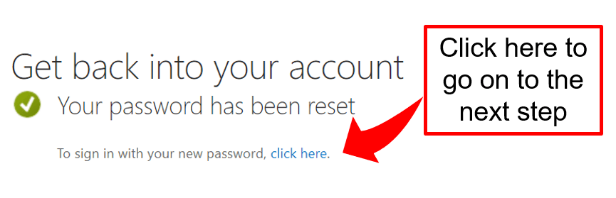
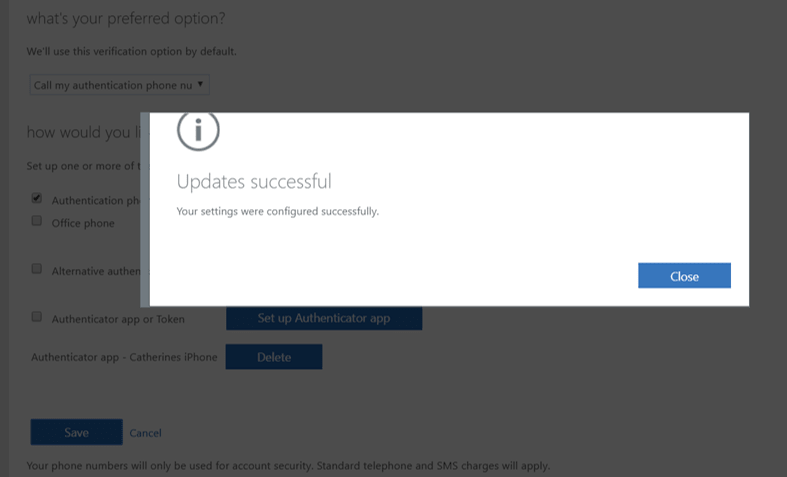
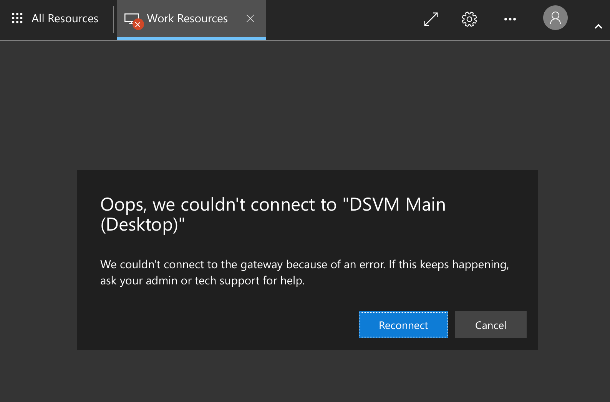

# Safe Haven User Documentation

## :mailbox_with_mail: Table of contents:

* [**Introduction:** The Turing Safe Haven](https://github.com/alan-turing-institute/data-safe-haven/blob/master/docs/safe_haven_user_guide.md#introduction-the-turing-safe-haven)
* [**Section 1:** Setting up](https://github.com/alan-turing-institute/data-safe-haven/blob/master/docs/safe_haven_user_guide.md#section-1-setting-up)
* [**Section 2:** Logging in for the first time](https://github.com/alan-turing-institute/data-safe-haven/blob/master/docs/safe_haven_user_guide.md#section-2-logging-in-for-the-first-time)
* [**Section 3:** Accessing the Safe Haven for the first time](https://github.com/alan-turing-institute/data-safe-haven/blob/master/docs/safe_haven_user_guide.md#section-3-accessing-the-safe-haven-for-the-first-time)
* [**Section 4:** Using the Safe Haven](https://github.com/alan-turing-institute/data-safe-haven/blob/master/docs/safe_haven_user_guide.md#section-4-using-the-safe-haven)
* [**Section 5:** Fixing bugs](https://github.com/alan-turing-institute/data-safe-haven/blob/master/docs/safe_haven_user_guide.md#section-5-fixing-bugs)
* [**Appendix A:** Migrating to a new data science VM post package update](https://github.com/alan-turing-institute/data-safe-haven/blob/master/docs/safe_haven_user_guide.md#appendix-a-migrating-to-a-new-data-science-vm-post-package-update)
* [**Appendix B:**  Gitlab tutorial notes](https://github.com/alan-turing-institute/data-safe-haven/blob/master/docs/safe_haven_user_guide.md#appendix-b-gitlab-tutorial-notes)
* [**Appendix C:** Troubleshooting](https://github.com/alan-turing-institute/data-safe-haven/blob/master/docs/safe_haven_user_guide.md#appendix-c-troubleshooting)
* [**Appendix D:** Safe Haven setup](https://github.com/alan-turing-institute/data-safe-haven/blob/master/docs/safe_haven_user_guide.md#appendix-d-safe-haven-setup)


## :beginner: Introduction: The Turing Safe Haven
Welcome to the Turing Safe Haven!
Secure research environments (SREs) for analysis of sensitive datasets are essential to give data providers confidence that their datasets will be kept secure over the course of a project.
Here at the Turing, we've developed a tool that allows you to set up secure research environments for your projects at scale, to allow you to work on sensitive / confidential datasets.
To maintain security of the data and challenge insights, we are legally required to work on some of the challenges within data safe havens, hosted by the Turing Institute.

The data will have been classified into one of five sensitivity tiers, ranging from open data at Tier 0, to highly sensitive and high risk data at Tier 4 (you can read more about this in our policy paper, available here: https://arxiv.org/abs/1908.08737).
While working in a data safe haven secure environment, you won’t be able to use the internet and you won't be able to copy-and-paste between the secure environment and other windows on your computer.
All the tools you’ll need for carrying out data science research, as well as the data you’ll be working on, will be ingressed into the safe haven upon its creation.


## :seedling: Prerequisites

### Network access
Each SRE can only be accessed from a specific set of IP addresses.
This may involve be connected to a specific wired or wireless network or using a VPN.
You also may be required to connect from a specific, secure location.
You will be told what these requirements are for your particular environment.


### Multi-Factor Authentication
Multi-factor authentication (MFA) is one of the most powerful ways of verifying user identity online.
We therefore use MFA to protect the challenge data - specifically, we will use your phone number.

:pencil: You may encounter some connectivity challenges if your phone network has poor connectivity.

### Domain names
> **Safe Haven Domain** The Safe Haven will have a dedicated domain name (for example `apr20.turingsafehaven.ac.uk`) which we will call `<Safe Haven domain>` in the rest of this document
>
> **SRE Domain** The SRE will also have a dedicated domain name (for example `sandbox.apr20.turingsafehaven.ac.uk`) which we will call `<SRE domain>` in the rest of this document


## :rocket: Getting your account set up
When you originally registered for access, you should have provided some personal information, including your name, email address and phone number.
This information will have been used to create an account for you on the SRE.

### Username
- Your username will usually be in the format `firstname.lastname`
- In some places, you will need to enter it in the form `username@<Safe Haven domain>` (eg. `firstname.lastname@apr20.turingsafehaven.ac.uk`).
- :pencil: If you have a hyphenated last name, or multiple surnames, or a long family name, your assigned username may be different.

### Setting a password
For security reasons, you must reset your password before you log in for the first time.

1. Open a private/incognito browser session on your laptop (this will avoid picking up any existing Azure / Microsoft accounts you have).

2. Copy and paste the following URL into the private browser address bar: `https://aka.ms/mfasetup`

3. At the login prompt enter `username@<Safe Haven domain>` and confirm/proceed. (Remember that your username will be in the format `firstname.lastname`.)

4. There will then be a password prompt. The first time you log in you need to click **“Forgotten my password”**

   <p align="center">
      
   </p>


   **NOTE:** If you do reset your password during the week, wait 5-10 mins before logging in again, to allow the user management to sync up with the new password.

5. Fill out the requested CAPTCHA (your username should be pre-filled)

   <p align="center">
      
   </p>

6. Confirm your phone number

   <p align="center">
      
   </p>

7. Enter your new password
   - :warning: Do **not** use special characters or symbols in your password. If you do, you may be unable to type them in the virtual keyboard to access the secure environment.
   - :pencil: You will need an alphanumeric password with minimum length of 12 characters, with at least one of each:
   - :capital_abcd: uppercase character
      - :abcd: lowercase character
      - :1234: number
   - :information_source: You can use this [Secure Password Generator](https://passwordsgenerator.net/?length=20&symbols=0&numbers=1&lowercase=1&uppercase=1&similar=1&ambiguous=0&client=1&autoselect=1) to create a password that meets these requirements.
   - :pencil: If you feel you may struggle to remember your password, try using a mnemonic device or making a note of it on a **separate, password protected** device.

8. Enter your password into the `Enter new password` and `Confirm new password` fields.

   <p align="center">
      
   </p>

   Then continue to the next step

   <p align="center">
      
   </p>

9. Log into your account when prompted and at this point you will be asked for additional security verification.

   <p align="center">
      
   </p>

### Setting up MFA
1. Set up multi-factor authentication following the instructions on screen.

   <p align="center">
      
   </p>

   - If you select phone verification, go to step 2.
   - If you select app verification, go to step 3.


2. :telephone_receiver: **Phone option**:
   - If you choose to set up the authentication by phone call you will receive a call straight away.

   <p align="center">
      
   </p>

   - :pencil: Note that some people get a call that says, *press the pound key* and others receive *press the hash key* – both mean hit the `#` button.

   <p align="center">
      
   </p>

   - When you click `close` the page will switch to your dashboard.

3. :iphone: **App option**:
   - Select the `Receive notifications for verification` radio button
   - Click on `Set up`
   - Download the Microsoft Authenticator app via one of these links:
      - :apple: iOS: `https://bit.ly/iosauthenticator`
      - :robot: Android: `https://bit.ly/androidauthenticator`
      - :checkered_flag: Windows mobile: `https://bit.ly/windowsauthenticator`
   - Open your Microsoft Authenticator app on your phone:
      - Select `Add an account`
      - Select `Work or School account`
      - Scan the QR code on the screen

      <p align="center">
         
      </p>

      - Click `Next` to start verification

      <p align="center">
         
      </p>

      - Click `Next` again to test the app, you will get a verification on your app.

      <p align="center">
         
      </p>


4. When confirmed you can close the browser.

   <p align="center">
      
   </p>

5. Troubleshooting
Sometimes setting up MFA can be problematic.
You may find the following tips helpful:
- Make sure you allow notifications on your authenticator app.
- Check you don’t have *Do not Disturb* mode on.
- You have to be SUPER FAST at acknowledging the notification on your app, since the access codes update every 30 seconds.
- Sometimes just going through the steps again solves the problem


## :door: Accessing the Secure Research Environment

### :seedling: Prerequisites
After going through the account setup procedure, you should have set up the following:

- Your `username`
- Your `password`
- Multifactor authentication

### :house: Logging into the research environment
1. Open a private/incognito browser session, so that you don't pick up any existing Microsoft logins
2. The URL for the Safe Haven will look like the following: `https://<SRE domain>` (eg. `https://sandbox.apr20.turingsafehaven.ac.uk`)
   - :warning: The **https://** is important - it won't work without this

3. You should get a login page that looks like this.

   <p align="center">
      
   </p>

   Enter your username (either as `username` or as `username@<Safe Haven domain>`) and password here, then click `Sign in`.

4. If you are successful, you'll see the a screen with icons for the available apps.

   <p align="center">
      
   </p>

   Welcome to the Turing Data Safe Haven!


### :penguin: Logging into the Data Science desktop
The primary method of performing data analysis in the SRE is using the Linux data science desktop.
This is a virtual machine (VM) with many different applications and programming languages pre-installed on it.
Once connected to it, you can carry out data science research while remaining completely isolated from the internet.

1. Click on the `DSVM Main (Desktop)` app to start running the desktop.
   You will now **receive a call or mobile app notification** to authenticate using MFA.
   For the call, you may have to move to an area with good reception and/or press the hash (`#`) key multiple times in-call.

   <p align="center">
      
   </p>

   If you don't respond to the MFA request quickly enough, or if it fails, you will likely get an error that looks like this:

   <p align="center">
      
   </p>

2. After verifying using MFA, you might get a security alert like this one. If you do, it is safe to tick the box and to click `Yes`.

   <p align="center">
      
   </p>

3. Insert your credentials as per the example below:

   <p align="center">
      
   </p>

   If you get a warning like the following:

   <p align="center">
      
   </p>

   Then it is likely that you have entered your credentials incorrectly. Please try again, entering your username and password carefully.
   :warning: If you have special characters in your password, your keyboard mapping may be incorrect. Try entering these special characters into the username field, so that you can see if they're displaying correctly.

4. You should now be greeted by a Linux desktop.
   :warning: When you get to this screen it is **important** that you select the `Use default config` option or you will end up without a desktop menu bar!

   <p align="center">
      
   </p>

### :handshake: Collaborating on code using GitLab
GitLab is an open source version of GitHub, working as a code hosting platform for version control and collaboration. It lets you and others work together on projects.
It also allows you to version control all the code that you write for any of the Data Study Group challenges.
There is a local GitLab installation available inside the SRE.

If you have not used GitLab before:
- There is a small tutorial available as an Appendix to this guidance
- You can find the official documentation [in the GitLab website](https://docs.gitlab.com/ee/gitlab-basics/README.html)
- Ask your group colleagues for help
- Ask in the Slack channel for help.

Everything that is not stored in a GitLab repository or on the shared `/output` drive by Friday lunchtime will be **DESTROYED FOR EVER**.
Make sure that every piece of code you think might be at all useful is stored in a GitLab repository within the secure environment. Small processed data can also be stored in Gitlab. Larger processed datasets should be transferred to the shared `/output` drive.

#### Accessing GitLab
You can access GitLab from the `GitLab` icon on the Work Resources page.

Login with username `firstname.lastname` (the domain is not needed) and `password`.

   <p align="center">
      
   </p>

:sparkles: You may find it helpful to make your repositories public so that they are easy to share within your group.

:pencil: Note that they are not really public as the server is only available inside your SRE.


### :open_book: Collaborating on documents using HackMD (CodiMD)
HackMD is a locally installed tool (our version is called CodiMD) that allows you to collaboratively write the data study group challenge report.
It uses Markdown which is a simple way to format your text so that it renders nicely in full html.

You can find a really great markdown cheat sheet at [https://github.com/adam-p/markdown-here/wiki/Markdown-Cheatsheet](https://github.com/adam-p/markdown-here/wiki/Markdown-Cheatsheet)

#### Accessing HackMD
You can access HackMD from the `HackMD` icon on the Work Resources page.

Login with your full username `firstname.lastname@<Safe Haven domain>` (the domain is required) and `password`.

   <p align="center">
      
   </p>

We have provided some example report templates for you which outline a structure we recommend.

:sparkles: You may find it helpful to make your documents public so that they are easy to share within your group.

:pencil: Note that they are not really public as the server is only available inside your SRE.

:sparkles: We recommend that one person start the document, then let everyone know the URL text after the `/`.

> TOP TIP: The URL for sharing a report is rather long.
> We recommend that you publish the link and share that one (the published link will be much shorter).
> Anyone who has it can now click the little blue pen to go back to the editable version.

> TOP TIP: a lower case `L` and an upper case `I` will look the same!
> ( `I /= l` )
> Try the one you didn’t try first time round if you don't get to the right place.

   <p align="center">
      
   </p>


### :desktop_computer: Using the Data Science desktop
You can use this secure environment to carry out data science research on the data that has been made available to you.
You can work with any of the pre-installed applications and programming languages.
Installed applications include `RStudio`, `Atom`, `jupyter notebook`, `VSCode`, `PyCharm` and `Spyder`, while installed languages include `python`, `R`, `julia`, `C` and `C++`.

#### Keyboard mapping
:warning: As there are several different computers between the one that you're physically using and the desktop you're interacting with, you may find that your keyboard mapping is incorrect.
You can right click on `Desktop` and `Applications > Settings > Keyboard` to change the layout.
We recommend opening a text editor (eg. `Atom`) to check what keys the remote desktop thinks you're typing – especially if you need to use special characters.

#### Accessing applications
Applications can be accessed through Terminal or right click on desktop (top left) and:

- `Applications`->`Development`->`RStudio`
- `Applications`->`Development`->`Atom`
- Open Terminal here -> `jupyter notebook &` if you want to use python within a jupyter notebook.
- Open Terminal here -> `spyder &` if you want to use python within the Spyder IDE (integrated development environment) which is quite similar to RStudio.

#### Using R and python
Typing `R` at the command line will give you the system version of `R` with many custom packages pre-installed.
There are three versions of `python` which must be explicitly selected (none of them is enabled by default)
To enable a `python` version type `conda activate <name>` on the command line, where `<name>` is one of:
- `py27` (python 2.7)
- `py36` (python 3.6)
- `py37` (python 3.7)
:warning: Note that enabling one of these `python` environments will change the version of `R` away from system `R`.
If you want to use `R` after enabling a `python` environment, please remember to type `conda deactivate` first.

#### Installing R and python packages
There are local copies of the `PyPI` and `CRAN` package repositories available from the Data Science VM.
You can install packages you need from these copies in the usual way, for example `pip install` and `packages.install` for Python and R respectively.

Note that you will not have access to install packages system-wide and will therefore need to install packages in a user directory.
For `CRAN`, you will be prompted to make a user package directory when you install your first package.
For `PyPI`, you will need to run `pip install` with the `--user` flag.

In `python`, run this in a shell:

```
pip install --user <package-name>
```

In `R`, you can install them from inside `R` (or `RStudio`):

```
> install.packages(<package-name>)
```

You will see:

```
Installing package into ‘/usr/local/lib/R/site-library’
(as ‘lib’ is unspecified)
Warning in install.packages("cluster") :
  'lib = "/usr/local/lib/R/site-library"' is not writable
Would you like to use a personal library instead? (yes/No/cancel)
```

Enter `yes`, which prompts you to confirm the name of the library:

```
Would you like to create a personal library
‘~/R/x86_64-pc-linux-gnu-library/3.5’
to install packages into? (yes/No/cancel)
```

Enter `yes`, which then installs the packages:

```
trying URL 'http://10.1.0.21/src/contrib/cluster_2.0.7-1.tar.gz'
```

Tier-2 environments will have full mirrors of `PyPI` and `CRAN` available.
Tier-3 environments will only have pre-authorised "whitelisted" packages available.
If you need to use a package that is not on the approved whitelist, please contact the facilitator for your project.

#### Bringing code into the environment
If you'd like to ingress additional code or data, such as for a new tool, you'll need to talk to the facilitator for your project.
They will need to discuss the request with the project's principal investigator and the data provider, who will need to go through the data classification procedure.
Please give them as much information as possible about the code or data you'd like to bring into the environment and about how it is to be used.


#### Accessing GitLab and HackMD from the VM instead of via work resources app
The data science VM can also be used to directly access `GitLab` and `HackMD`, via the broswer within the VM.

1. Point Firefox to the url provided by the resource dashboard for GitLab/HackMD
2. Read and write access – the repository URL can be copied using via the clipboard icon highlighted in the screenshot below.

   <p align="center">
      
   </p>

### Accessing the data and exporting outputs
There are several shared areas on the data science machine that everyone can see

#### Input data: /data
The data can be found in the `/data` folder on the data science VM.
Everyone in your group will be able to access it, but it is read-only.
The contents of `/data` will be **identical** on all VMs in your SRE - for example, if your group requests a GPU-enabled machine, this will contain an identical `/data` folder.

#### Shared space: /shared
The `/shared` folder should be used for any work that you want to share with your group.
Everyone in your group will be able to access it, and will have read-and-write access.
The contents of `/shared` will be **different** on different VMs in your SRE - for example, if your group requests a GPU-enabled machine, this will have its own `/shared` folder.

#### Output data: /output
Any outputs that you want to extract from the secure environment should be placed in the `/output` folder on the data science VM.
Everyone in your group will be able to access it, and will have read-and-write access.
Anything placed in here will be considered for data egress by your principal investigator together with the data provider.

You may want to consider having subfolders of `/output` for the following categories:
- Presentation
- Transformed data/derived data
- Report
- Code
- Images

#### Documenting your work
The data science VM has `Libre Office` installed for creating slides.
It also has `LaTeX` installed for report writing.
Example slide and document templates should be available in the `/data` drive.


## :star: Using additional VMs
Your project might make use of additional virtual machines apart from the main shared desktop.
Usually this is because of a requirement for a different type of computing resource, like access to one or more GPUs.

You will access this machine in a similar way to the main shared desktop, but by using the `DSVM Other (Desktop)` icon inside of the usual `DSVM Main (Desktop)` icon.
You will need to know the IP address of the new machine, which you will be told by your project facilitator.

1. When you click on the `DSVM Other (Desktop)` icon you will see a screen like the following, where you have to enter the IP address.

   <p align="center">
      
   </p>

2. After entering the IP address, you will get the normal login screen, where you use the same `username` and `password` credential as before.

3. Any local files that you have created in the `/output` folder on other VMs (e.g. analysis scripts, notes, derived data) will be automatically available in the new VM.


## :bug: Reporting bugs
Although we try to make the user experience as smooth as possible there are bound to be bugs in a project as complicated as this.
If you find problems with the IT infrastructure, contact the appropriate IT support person through your normal channels of communication (eg. through your project's facilitator).

To help us fix your issues please do the following:

1. Make sure you have **read this document** and checked if it answers your query. Please do not log an issue before you have read all of the sections in this document.

2. Log out and log back in again (to the safe haven or data science environment) at least once. Re-attempt the process leading to the bug/error at least twice.
   We know that "turn it off and turn it back on again" is a frustrating piece of advice to receive, but in our experience it works rather well! (Particularly when there are lots of folks trying these steps at the same time.)

3. Let your project's facilitator know about the issue. Please help your facilitator with a comprehensive summary of the issue - this will make it easier to pin down what the problem is. If you are reporting a bug, please include:
   - Your client machine’s operating system and operating system version.
   - Precise condition under which the bug occurs. How to reproduce it.
   - Precise description of the bug. What happens? What would you expect to happen instead if there were no bug?
   - Any workarounds/fixes you have found


## Acknowledgments
Based on an initial document written March/April 2018 by Kirstie Whitaker.
Updates:
- December 2018 by Catherine Lawrence, Franz Király, Martin O’Reilly, and Sebastian Vollmer.
- March/April 2019 by Miguel Morin, Catherine Lawrence, Alvaro Cabrejas Egea, Kirstie Whitaker, James Robinson and Martin O'Reilly.
- November 2019 by Ben Walden, James Robinson and Daisy Parry.
- April 2020 by James Robinson.


## Appendix A: Gitlab tutorial notes
Gitlab can be thought of as a local version of github from different company - that is a git server along with useful features such as

 - Project wiki - exactly what it says
 - Project pastebin - share bits of code
 - Project issue tracker - track things TODO and bugs
 - Pull requests - Way to keep track of changes individuals have made to be included in master

Some teams design their entire workflows around these things.
A comparison in terms of features can be found [here](https://usersnap.com/blog/gitlab-github/).

### Repositories
A repository is usually used to organize a single project. Repositories can contain folders and files, images, videos, spreadsheets, and data sets – anything your project needs. We recommend including a README, or a file with information about your project.

During the Data Study Group Week, you will be accessing and adding files to the same project repository.

### Add your Git username and set your email
It is important to configure your Git username and email address, since every Git commit will use this information to identify you as the author.

On your shell, type the following command to add your username:
```
git config --global user.name "YOUR_USERNAME"
```

Then verify that you have the correct username:
```
git config --global user.name
```

To set your email address, type the following command:
```
git config --global user.email "your_email_address@example.com"
```

To verify that you entered your email correctly, type:
```
git config --global user.email
```

You’ll need to do this only once, since you are using the `--global` option. It tells Git to always use this information for anything you do on that system. If you want to override this with a different username or email address for specific projects, you can run the command without the `--global` option when you’re in that project.

### Cloning projects
In Git, when you copy a project you say you “clone” it. To work on a git project locally (from your own computer), you will need to clone it. To do this, sign in to GitLab.

When you are on your Dashboard, click on the project that you’d like to clone. To work in the project, you can copy a link to the Git repository through a SSH or a HTTPS protocol. SSH is easier to use after it’s been set up, [you can find the details here](https://docs.gitlab.com/ee/gitlab-basics/create-your-ssh-keys.html). While you are at the Project tab, select HTTPS or SSH from the dropdown menu and copy the link using the Copy URL to clipboard button (you’ll have to paste it on your shell in the next step).

   <p align="center">
      
   </p>


Go to your computer’s shell and type the following command with your SSH or HTTPS URL:
```
git clone PASTE HTTPS OR SSH HERE
```

### Command Line Basics

There are multiple git cheat sheets such as [interactive](http://ndpsoftware.com/git-cheatsheet.html#loc=stash;) and [this one](https://www.atlassian.com/git/tutorials/atlassian-git-cheatsheet). We summarised what we find useful below.

Below you can find other commands you may find useful during the week.

Go into a project directory to work in it
```
cd NAME-OF-PROJECT
```

Go back one directory
```
cd ..
```

List what’s in the current directory
```
ls
```

Create a new directory
```
mkdir NAME-OF-YOUR-DIRECTORY
```

Remove a file
```
rm NAME-OF-FILE
```

Remove a directory and all of its contents
```
rm -r NAME-OF-DIRECTORY
```

View command history
```
history
```

Show which directory I am in
```
pwd
```

Clear the shell window
```
clear
```

### Branches
Branching is the way to work on different versions of a repository at one time.

By default your repository has one branch named `master` which is considered to be the definitive branch. We use branches to experiment and make edits before committing them to `master`.

When you create a branch off the `master` branch, you’re making a copy, or snapshot, of `master` as it was at that point in time. If someone else made changes to the `master` branch while you were working on your branch, you could pull in those updates.

To create a branch:
```
git checkout -b NAME-OF-BRANCH
```

Work on an existing branch:
```
git checkout NAME-OF-BRANCH
```

To merge created branch with master branch you need to be in the created branch.
```
git checkout NAME-OF-BRANCH
git merge master
```

To merge master branch with created branch you need to be in the master branch.
```
git checkout master
git merge NAME-OF-BRANCH
```

### Downloading the latest changes in a project
This is for you to work on an up-to-date copy (it is important to do this every time you start working on a project), while you set up tracking branches. You pull from remote repositories to get all the changes made by users since the last time you cloned or pulled the project. Later, you can push your local commits to the remote repositories.
```
git pull REMOTE NAME-OF-BRANCH
```

When you first clone a repository, REMOTE is typically “origin”. This is where the repository came from, and it indicates the SSH or HTTPS URL of the repository on the remote server. NAME-OF-BRANCH is usually “master”, but it may be any existing branch.

### Add and commit local changes
You’ll see your local changes in red when you type git status. These changes may be new, modified, or deleted files/folders. Use git add to stage a local file/folder for committing. Then use git commit to commit the staged files:
```
git add FILE OR FOLDER
git commit -m "COMMENT TO DESCRIBE THE INTENTION OF THE COMMIT"
```

To add and commit all local changes in one command:
```
git add .
git commit -m "COMMENT TO DESCRIBE THE INTENTION OF THE COMMIT"
```

To push all local commits to the remote repository:
```
git push REMOTE NAME-OF-BRANCH
```

For example, to push your local commits to the master branch of the origin remote:
```
git push origin master
```

To delete all local changes in the repository that have not been added to the staging area, and leave unstaged files/folders, type:
```
git checkout .
```
__Note:__ The . character typically means all in Git.

### How to create a Merge Request
Merge requests are useful to integrate separate changes that you’ve made to a project, on different branches. This is a brief guide on how to create a merge request. For more information, check the [merge requests documentation](https://docs.gitlab.com/ee/user/project/merge_requests/index.html).

1. Before you start, you should have already created a branch and pushed your changes to GitLab.
2. Go to the project where you’d like to merge your changes and click on the Merge requests tab.
3. Click on New merge request on the right side of the screen.
4. From there on, you have the option to select the source branch and the target branch you’d like to compare to. The default target project is the upstream repository, but you can choose to compare across any of its forks.

   <p align="center">
      
   </p>

5. When ready, click on the Compare branches and continue button.
6. At a minimum, add a title and a description to your merge request. Optionally, select a user to review your merge request and to accept or close it. You may also select a milestone and labels.

   <p align="center">
      
   </p>

7. When ready, click on the Submit merge request button.
Your merge request will be ready to be approved and merged.

## Appendix B: Troubleshooting

### No applications available

#### Symptom
- You can successfully log into the RDS webclient at `https://rds.dsgroupX.co.uk/RDWeb/weblient`
- You do not see any available apps

   <p align="center">
      
   </p>

#### Cause
You have not yet set up your two factor authentication.

#### Solution
Follow the two factor authentication section from the [logging in section](https://github.com/alan-turing-institute/data-safe-haven/blob/master/docs/safe_haven_user_guide.md#section-2-logging-in-for-the-first-time) of the user guide.

### Unexpected certificate error

#### Symptom
- You can successfully log into the RDS webclient at `https://rds.dsgroupX.co.uk/RDWeb/weblient`
- When you try and launch an app, you receive an error saying "Your session ended because an unexpected server authentication certificate was received from the remote PC."
- When you click on the padlock icon in the address bar and view the SSL certificate, the "SHA-1 Fingerprint" in the certificate matches the "SHA-1 Thumbprint" in the error message.

   <p align="center">
      
   </p>

### Cause
The SSL certificate protecting your connection to the RDS webclient expires every three months and is renewed every two months.
The new SSL certificate is seamlessly picked up by your browser when connecting to `https://rds.dsgroupX.co.uk/RDWeb/weblient`.
However, the webclient downloads a separate copy of the certificate for its own use to validate connections to the apps it serves.
This downloaded certificate is cached by your browser, which means that the old certificate will continue to be used by the web app when the browser is allowed to load things from its cache.

### Solution
Get your browser to do a [hard reload](https://www.getfilecloud.com/blog/2015/03/tech-tip-how-to-do-hard-refresh-in-browsers/) of the page at `https://rds.dsgroupX.co.uk/RDWeb/weblient` (instructions vary by browser and operating system).
This hard reload will reload items in the cache and so retrieve a copy of the new certificate.