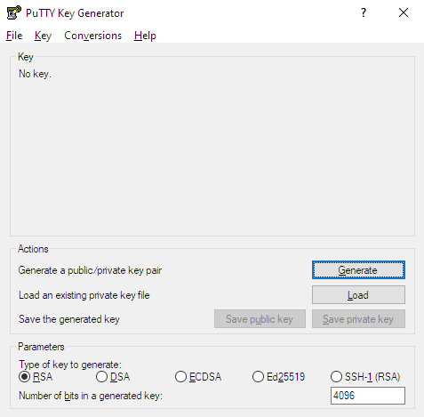
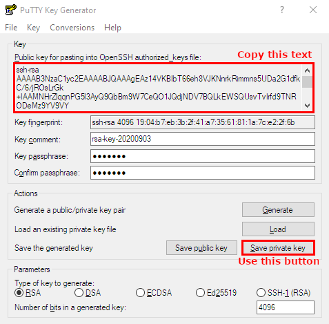
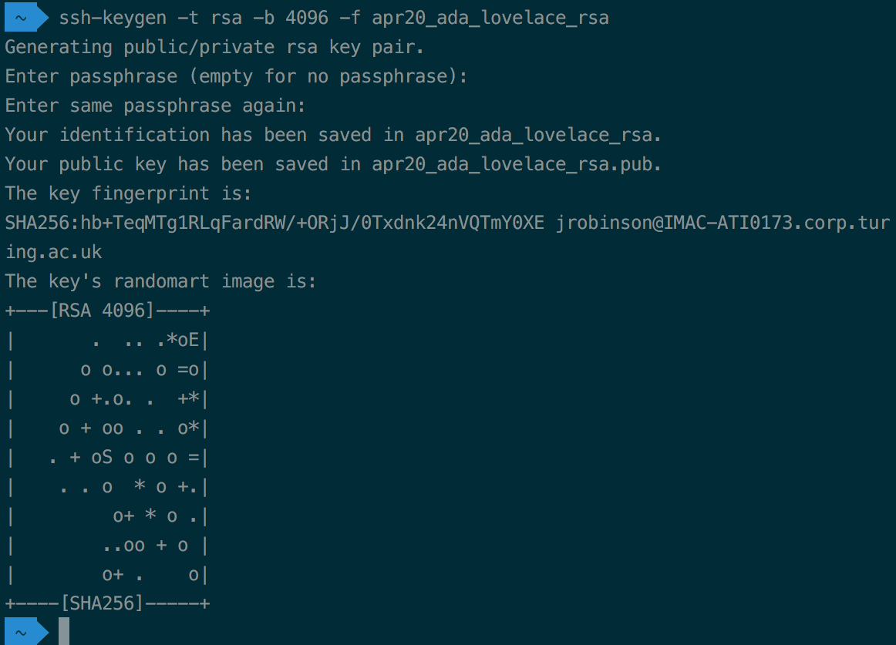
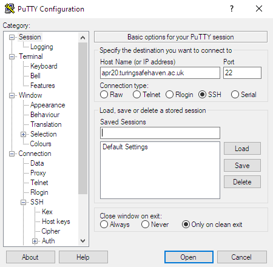
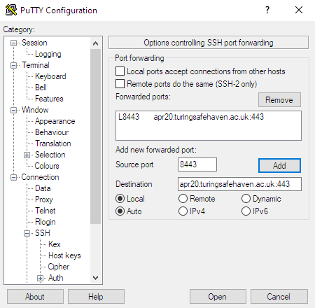
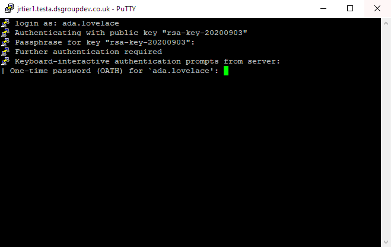
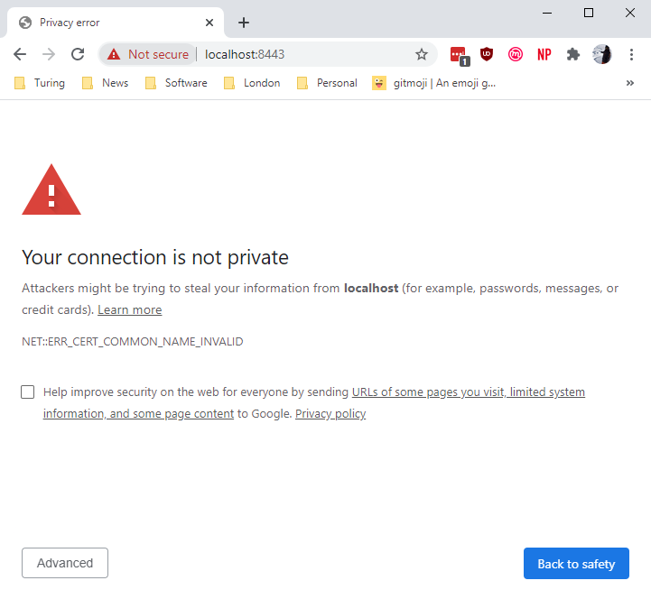
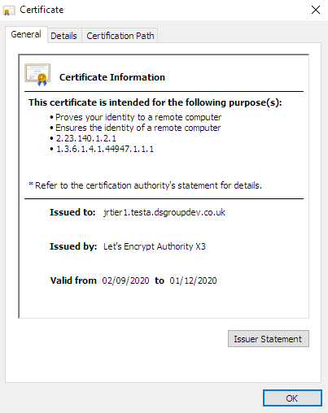
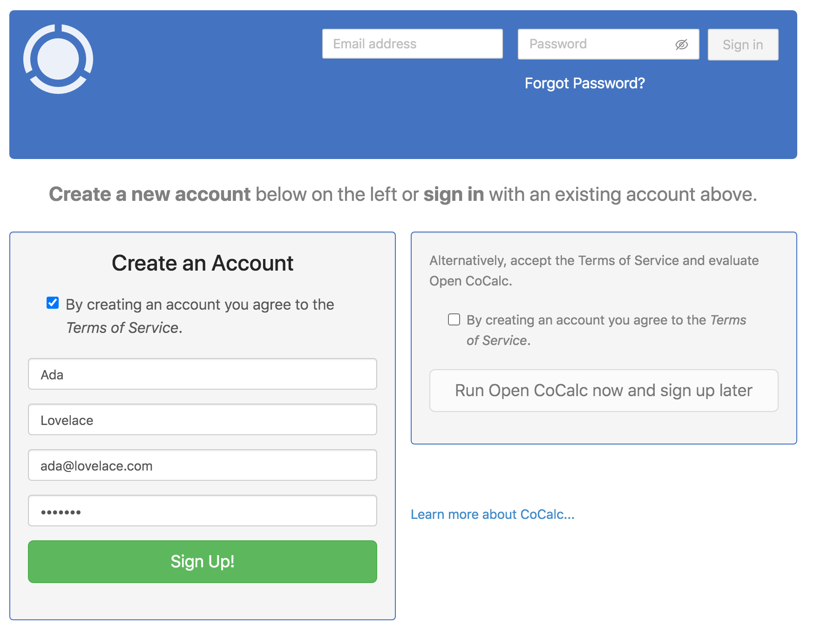
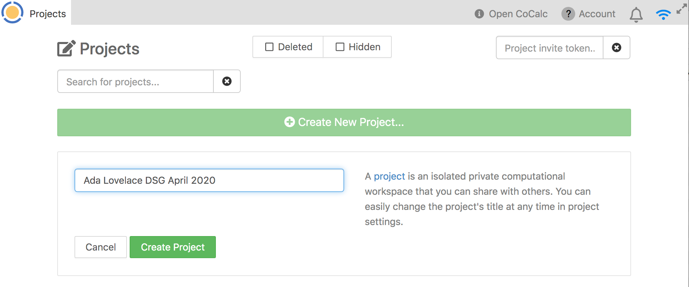

# Safe Haven User Documentation - Tier 1

## :mailbox_with_mail: Table of contents

- [:beginner: Introduction: The Turing Safe Haven](#beginner-introduction-the-turing-safe-haven)
  - [:mag_right: Definitions](#mag_right-definitions)
- [:rocket: Set up your account](#rocket-set-up-your-account)
  - [:seedling: Prerequisites](#seedling-prerequisites)
  - [:closed_lock_with_key: Generating an SSH key](#closed_lock_with_key-generating-an-ssh-key)
  - [:door: Set up multi-factor authentication](#door-set-up-multi-factor-authentication)
- [:unlock: Access the Secure Research Environment](#unlock-access-the-secure-research-environment)
  - [:seedling: Prerequisites](#seedling-prerequisites-1)
  - [:penguin: Log into the research environment over SSH](#penguin-log-into-the-research-environment-over-SSH)
  - [:house: Log into the CoCalc environment](#house-log-into-the-cocalc-environment)
- [:computer: Using the Secure Research Environment](#computer-using-the-secure-research-environment)
  - [:open_hands: Using CoCalc](#open_hands-using-cocalc)
  - [:open_file_folder: Shared directories within the SRE](#open_file_folder-shared-directories-within-the-sre)
  - [:newspaper: Bring in new files to the SRE](#newspaper-bring-in-new-files-to-the-sre)
- [:bug: Report a bug](#bug-report-a-bug)
  - [:wrench: Help us to help you](#wrench-help-us-to-help-you)
- [:pray: Acknowledgments](#pray-acknowledgments)

## :beginner: Introduction: The Turing Safe Haven
Welcome to the Turing Safe Haven!

Secure research environments (SREs) for analysis of sensitive datasets are essential to give data providers confidence that their datasets will be kept secure over the course of a project.
The Turing Safe Haven is a prescription for how to set up one or more SREs and give users access to them.
The Safe Haven SRE design is aimed at allowing groups of researchers to work together on projects that involve sensitive or confidential datasets at scale.
Our goal is to ensure that you are able to implement the most cutting edge data science techniques while maintaining all ethical and legal responsibilities of information governance and access.

The data you are working on will have been classified into one of five sensitivity tiers, ranging from open data at Tier 0, to highly sensitive and high risk data at Tier 4.
The tiers are defined by the most sensitive data in your project, and may be increased if the combination of data is deemed to be require additional levels of security.
You can read more about this process in our policy paper: *Arenas et al, 2019*, [`arXiv:1908.08737`](https://arxiv.org/abs/1908.08737).

The level of sensitivity of your data determines whether you have access to the internet within the SRE and whether you are allowed to copy and paste between the secure research environment and other windows on your computer.
This means you may be limited in which data science tools you are allowed to install.
You will find that many software packages are already available, and the administrator of the SRE will ingress - bring into the environment - as many additional resources as possible.

**Please read this user guide carefully and remember to refer back to it when you have questions.**
In many cases the answer is already here, but if you think this resource could be clearer, please let us know so we can improve the documentation for future users.

### :mag_right: Definitions
The following definitions might be useful during the rest of this guide

> **Secure Research Environment (SRE)**: the environment that you will be using to access the sensitive data.

> **Turing Safe Haven**: the overall project that details how to create and manage one or more SREs.

> **SRE domain**: each SRE has a dedicated URL (for example `sandbox.apr20.turingsafehaven.ac.uk`) which is used to access the data. We will call this full URL the `<SRE URL>` in the rest of this document, and we will call the initial part of the URL the `<SRE ID>` (i.e. `sandbox` in this example).


## :rocket: Set up your account
This section of the user guide will help you set up your new account on the SRE which you'll be using.

### :seedling: Prerequisites
Make sure you have all of the following in front of you when connecting to the SRE.

* :e-mail: The email from your SRE administrator with your account details.
* :wrench: Your [username](#username), given in an email from your SRE administrator.
* :european_castle: The URL for the SRE, given in an email from your SRE administrator.
* :computer: Your computer.
* :satellite: [Access](#network-access) to the specific wired or wireless network detailed in the email from your SRE administrator.
* :iphone: Your [phone](#your-phone-for-multi-factor-authentication), with good signal connectivity.

You should also know who the **designated contact** for your SRE is.
This might be an administrator or one of the people working on the project with you.
They will be your primary point of contact if you have any issues in connecting to or using the SRE.

> :information_source: For example, during the Turing Data Study Groups, the facilitator of each SRE is the designated contact

#### Username
Your username will usually be in the format `firstname.lastname`

> :point_right: You can find your username in the email you received from the SRE administrator.

> :pencil2: If you have a hyphenated last name, or multiple surnames, or a long family name, your assigned username may not follow the same pattern of `firstname.lastname`.
> Please check with the designated contact for your SRE if you are unsure about your username.

> :information_source: In this document we will use Ada Lovelace as our example user.
> Her username is `ada.lovelace`

#### Network access
The SRE that you're using may be configured to allow access only from a specific set of IP addresses.
This may involve being connected to a specific wired or wireless network or using a VPN.
You also may be required to connect from a specific, secure location.
You will be told what these requirements are for your particular environment.

> :point_right: Make sure you know the networks from which you must connect to your SRE.
> This information will be available in the email you received with your connection information.

#### Your phone for multi-factor authentication
Multi-factor authentication (MFA) is one of the most powerful ways of verifying user identity online.
We therefore use MFA to protect the project data - specifically, we will use your phone number.

> :point_right: Make sure to have your phone with you and that you have good signal connectivity when you are connecting to the SRE.

> :pencil2: You may encounter some connectivity challenges if your phone network has poor connectivity.
> The SRE is not set up to allow you to authenticate through other methods.

#### Domain names
You might receive the SRE URL in the initial email from your SRE administrator, or you might be assigned to a particular SRE at a later point.

> :information_source: In this document Ada Lovelace - our example user - will be participating in a Turing Data Study Group held in April 2020.
> Her **SRE URL** is `sandbox.apr20.turingsafehaven.ac.uk`.


### :closed_lock_with_key: Generating an SSH key
We use SSH keys to authenticate users who try to log into the SRE.
You will need to provide us with the public part of your SSH key in order for us to register it.
If you do not already have an SSH key, don't worry - it's easy to generate one:

#### Generating an SSH on Windows
If you are using Windows, you will need to download an SSH client.
We recommend installing the free [PuTTY](http://www.chiark.greenend.org.uk/~sgtatham/putty/) program from `http://www.chiark.greenend.org.uk/~sgtatham/putty/`.
To generate an SSH key with `PuTTYgen`, follow these steps:

1. Open the PuTTYgen program.
   - for `Type of key to generate`, select `RSA` or `Ed25519`
   - for `Number of bits in generated key`, enter `4096`
   - click the `Generate` button.
   <p align="center">
      
   </p>
2. Generate a random key
   - Move your mouse in the area below the progress bar.
   - When the progress bar is full, `PuTTYgen` will generate your key pair.
3. Secure your key
   - Type a passphrase in the `Key passphrase` field.
   - Type the same passphrase in the `Confirm passphrase` field.
   - :warning: You can use a key without a passphrase, but this is not recommended.
   <p align="center">
      
   </p>
4. Save the key
   - To save the public key please **select all the text in the top box** and paste this into a text file
      - We recommend using a name like `<usage>_<your name>_<type>.pub`
      - :information_source: Our example user Ada Lovelace might call hers `apr20_ada_lovelace_rsa.pub`
      - :warning: Do **not** use the `Save public key button` to save the public key as this uses a different file format
   - Click the `Save private key button` to save the private key.
      - Use a name that matches the public key but with the `ppk` extension
      - :information_source: Our example user Ada Lovelace might call hers `apr20_ada_lovelace_rsa.ppk`

#### Generating an SSH on Linux/OSX
On Linux or OSX you can generate a key with `ssh-keygen` with the following steps:

1. Choose the name for your key.
   - We recommend using a name like `<usage>_<your name>_<type>.pub`
   - :information_source: Our example user Ada Lovelace might call hers `apr20_ada_lovelace_rsa`
2. Open a `Terminal` window and enter the following
   ```bash
   ssh-keygen -t rsa -b 4096 -f <the name of your key>
   ```
   <p align="center">
      
   </p>
3. Secure your key
   - When prompted to `Enter passphrase`, type a passphrase
   - Type the same passphrase when prompted to  `Enter the same passphrase again`
   - :warning: You can use a key without a passphrase, but this is not recommended.
4. This will generate two files in the directory that you're currently in:
   - Public key: called `<the name of your key>.pub`
   - Private key: called `<the name of your key>`

> :point_right: Once you've generated your SSH key, please send the **public** part of it to your SRE administrator.
> :warning: Keep the private part safe! You will need this to connect to the SRE.


### :door: Set up multi-factor authentication
The next step in setting up your account is to authenticate your account from your phone.

1. You will need to download a two-factor authentication app that is capable of generating 6-digit codes. A few examples are:
- `Google Authenticator` (available for [iOS](https://apps.apple.com/us/app/google-authenticator/id388497605) and [Android](https://play.google.com/store/apps/details?id=com.google.android.apps.authenticator2))
- `Microsoft Authenticator` (available for [iOS](https://apps.apple.com/us/app/microsoft-authenticator/id983156458) and [Android](https://play.google.com/store/apps/details?id=com.azure.authenticator))
- `Authy` (available for [iOS](https://apps.apple.com/us/app/twilio-authy/id494168017) and [Android](https://play.google.com/store/apps/details?id=com.authy.authy))
- `2FA Authenticator` (available for [iOS](https://apps.apple.com/us/app/2fa-authenticator-2fas/id1217793794) and [Android](https://play.google.com/store/apps/details?id=com.twofasapp))

This additional security verification is to make it harder for people to impersonate you and connect to the environment without permission.

2. Once you have been assigned to a particular SRE, you will be sent a QR code which will look something like this:
   <p align="center">
      
   </p>

3. You should follow the instructions in your preferred app for adding a new account by scanning a QR code.

4. At this point your authenticator app should be generating time-limited 6-digit codes like the following
   <p align="center">
      
   </p>


## :unlock: Access the Secure Research Environment

### :seedling: Prerequisites
After going through the account setup procedure, you should have access to:

- Your `username`
- The SRE URL name
- Multifactor authentication

> :point_right: If you aren't sure about any of these then please return to the [**Set up your account**](#rocket-set-up-your-account) section above.

### :penguin: Log into the research environment over SSH
Although the research environment will use the browser-based [`CoCalc`](https://www.cocalc.com), you are required to authenticate by using a secure SSH connection.

- Authentication for users requires:
   - the correct SSH private key
   - a one-time password from your authenticator app

#### Connecting via SSH on Windows
To connect over SSH with `PuTTY`, follow these steps:

1. Open `PuTTY` and create a new session
   - under `Host name` enter the `<SRE URL>` and leave `Port` set to `22`
   - :information_source: Our example user Ada Lovelace will use `apr20.turingsafehaven.ac.uk` here
   <p align="center">
      
   </p>
2. Setup authentication
   - Expand `Connection` and `SSH` on the left-hand sidebar and select `Auth`
   - Click on `Browse...` and select the **private** SSH key that you generated earlier
   - :information_source: Our example user Ada Lovelace will use the `apr20_ada_lovelace_rsa.ppk` key here
   <p align="center">
      
   </p>
3. Setup SSH forwarding
   - Expand `Connection` and `SSH` on the left-hand sidebar and select `Tunnels`
   - In the `Source port` box put `8443`
   - In the `Destination` box put `<SRE URL>:433` (note the `:`)
   - :information_source: Our example user Ada Lovelace will use `apr20.turingsafehaven.ac.uk:443` here
   <p align="center">
      
   </p>
4. Save the session
   - Go back to the `Session` category and enter a name in the `Saved Sessions` box
   - Click on `Save` and these connection details will be saved for future use
5. Connect via SSH
   - Select the session you have saved and click `Load`
   - Now click `Open` and the SSH connection window will open
   - You will be prompted for the passphrase for your key: enter the passphrase you set earlier
   - You will be prompted for a `One-time password (OATH) for <your username>`: enter the six digits from your authenticator app with no spaces
   <p align="center">
      
   </p>

#### Connecting via SSH on Linux/OSX
To connect over SSH simply do the following:

1. Open a `Terminal` window and enter the following
   ```bash
   ssh <your username>@<SRE URL> -i <path to your private key> -L8443:localhost:443
   ```
   - :information_source: Our example user Ada Lovelace would run `ssh ada.lovelace@apr20.turingsafehaven.ac.uk -i apr20_ada_lovelace_rsa -L8443:localhost:443`

2. If the public key authentication is successful you will be prompted for a one-time-password
   - At the prompt `One-time password (OATH) for <your username>`: enter the six digits from your authenticator app with no spaces


### :house: Log into the CoCalc environment
If you connected successfully you should now be able to open a web browser on your computer and go to:

```
https://localhost:8443
```

#### Certificate validity
You will probably find that your browser warns you that the secure certificate is invalid
<p align="center">
   
</p>

This is because the certificate was generated for `<SRE URL>` but you are trying to connect to `localhost`.
In order to check that the certificate is correct, open it from your browser and check its validity and issuer.
<p align="center">
   
</p>

- The `Issued to` field should be your `<SRE URL>`
- The `Issued by` field should be `Let's Encrypt Authority X3`
- The validity should cover today's date

If you are happy that the certificate is correct, then please procede to the website
- for example, in `Chrome` you need to click on `Advanced` and then `Proceed to localhost (unsafe)`)

#### Creating a CoCalc account
You will have to create a local CoCalc account in order to be able to use it.
You will need to provide the following information:

- First name
- Last name
- Email address
- Password

This is not connected to the account you used to connect via SSH - you can set these details to whatever you want to.

<p align="center">
   
</p>

#### Creating a CoCalc project
You will probably want to create a personal `CoCalc` project at this point.
You can do so by filling out the name of the new project as shown:

<p align="center">
   
</p>

You can invite other users to collaborate on your project and, in fact, you will probably do the majority of your work as part of a collaborative project.


## :computer: Using the Secure Research Environment

### :open_hands: Using CoCalc
Full [details about how to use CoCalc](https://doc.cocalc.com/contents.html) are available at: `https://doc.cocalc.com/contents.html`

You have access to the following tools through `CoCalc`

- collaborative `Jupyter` notebooks
- the ability to install python/R/Julia packages from the internet


### :open_file_folder: Shared directories within the SRE
There are several shared areas available through `CoCalc` that all collaborators within a research project team can see and access:
You can see these interactively in a terminal by using `New > Linux terminal` from the project menu.

* [input data](#input-data-data): `/data/`
* [shared space](#shared-space-shared): `/shared/`
* [output resources](#output-resources-output): `/output/`

#### Input data: `/data/`
Data that has been "ingressed" - approved and brought into the secure research environment - can be found in the `/data/` folder.
Everyone in your group will be able to access it, but it is **read-only**.

> :point_right: You will not be able to change any of the files in `/data/`.
> If you want to make derived datasets, for example cleaned and reformatted data, please add those to the `/shared/` or `/output/` directories.
> :pencil2: If you are participating in a Turing Data Study Group you might find example slides and document templates in the `/data/` drive.

#### Shared space: `/shared/`
The `/shared/` folder should be used for any work that you want to share with your group.
Everyone in your group will be able to access it, and will have **read-and-write access**.

#### Output resources: `/output/`
Any outputs that you want to extract from the secure environment should be placed in the `/output/` folder on the data science linux desktop.
Everyone in your group will be able to access it, and will have **read-and-write access**.
Anything placed in here will be considered for data egress - removal from the secure research environment - by the project's principal investigator together with the data provider.

> :point_right: You may want to consider having subfolders of `/output/` to make the reivew of this directory easier.

> :information_source: For the Turing Data Study Groups, we recommend the following categories:
>
> - Presentation
> - Transformed data/derived data
> - Report
> - Code
> - Images

### :newspaper: Bring in new files to the SRE
Bringing software into a secure research environment may constitute a security risk.
Bringing new data into the SRE may mean that the environment needs to be updated to a more secure tier.

The review of the "ingress" of new code or data will be coordinated by the designated contact for your SRE.
They will have to discuss whether this is an acceptable risk to the data security with the project's principle investigator and data provider and the decision might be "no".

> :point_right: You can make the process as easy as possible by providing as much information as possible about the code or data you'd like to bring into the environment and about how it is to be used.

## :bug: Report a bug

The Turing Safe Haven SRE has been developed in close collaboration with our users: you!

We try to make the user experience as smooth as possible and this document has been greatly improved by feedback from event participants and researchers going through the process for the first time.
We are constantly working to improve the SRE and we really appreciate your input and support as we develop the infrastructure.

> :point_right: If you find problems with the IT infrastructure, please contact the designated contact for your SRE.

### :wrench: Help us to help you

To help us fix your issues please do the following:

1. Make sure you have **read this document** and checked if it answers your query.
  Please do not log an issue before you have read all of the sections in this document.

2. Log out and log back in again (whether this is to the Turing Safe Haven SRE or the Linux data science desktop) at least once.
   Re-attempt the process leading to the bug/error at least twice.

   We know that "turn it off and turn it back on again" is a frustrating piece of advice to receive, but in our experience it works rather well! (Particularly when there are lots of folks trying these steps at the same time.)

   The multi-factor authentication step in particular is known to have quite a few gremlins.
   If you are getting frustrated, log out of everything, turn off your computer, take a 15 minute coffee break, and then start the process from the beginning.

3. Write down a comprehensive summary of the issue.
  A really good bug report makes it much easier to pin down what the problem is.

  Please include:

   - Your computer's operating system and operating system version.
   - Precise condition under which the error occurs.
     What steps would someone need to take to get the exact same error?
   - A precise description of the problem.
     What happens? What would you expect to happen if there were no error?
   - Any workarounds/fixes you have found.

> :bird: We very strongly recommend "rubber ducking" this process before you talk to the designated contact for your SRE.
>
> Either talk through to your imaginary rubber duck, or find a team member to describe the error to, as you write down the steps you have taken.
>
> It is amazing what saying the steps out loud can do to fix them.

4. Send the bug report to the designated contact for your SRE.

## :pray: Acknowledgments
This user guide is based on an initial document written in September 2020 by James Robinson
