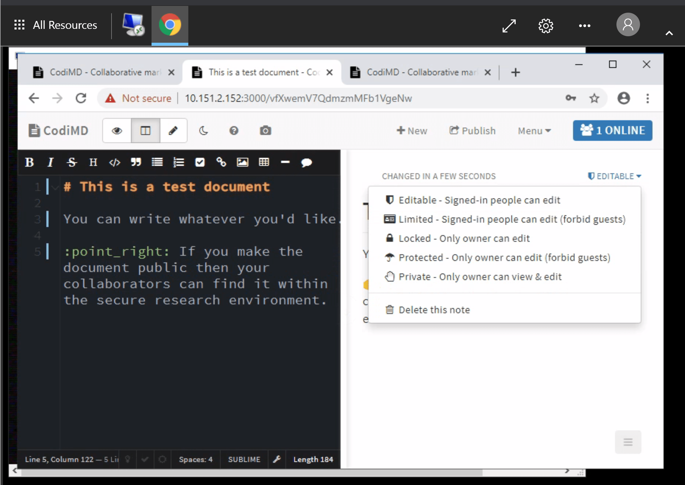
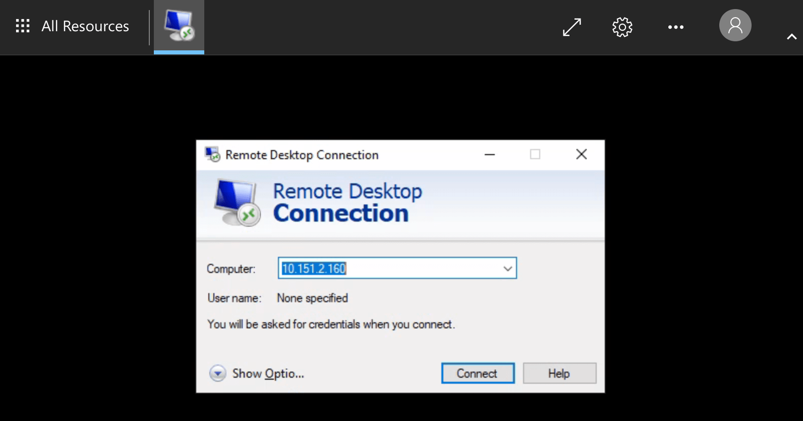

# Safe Haven User Documentation

## :mailbox_with_mail: Table of contents

- [:beginner: Introduction: The Turing Safe Haven](#beginner-introduction-the-turing-safe-haven)
  - [:mag_right: Definitions](#mag_right-definitions)
- [:rocket: Set up your account](#rocket-set-up-your-account)
  - [:seedling: Prerequisites](#seedling-prerequisites)
  - [:closed_lock_with_key: Set a password](#closed_lock_with_key-set-a-password)
  - [:door: Set up multi-factor authentication](#door-set-up-multi-factor-authentication)
- [:unlock: Access the Secure Research Environment](#unlock-access-the-secure-research-environment)
  - [:seedling: Prerequisites](#seedling-prerequisites-1)
  - [:house: Log into the research environment](#house-log-into-the-research-environment)
  - [:penguin: Log into the Linux Data Science desktop](#penguin-log-into-the-linux-data-science-desktop)
- [:computer: Develop analyses via the Linux Data Science desktop](#computer-develop-analyses-via-the-linux-data-science-desktop)
  - [:musical_keyboard: Keyboard mapping](#musical_keyboard-keyboard-mapping)
  - [:unlock: Access applications](#unlock-access-applications)
  - [:snake: Initiate the correct version of R or python](#snake-initiate-the-correct-version-of-r-or-python)
  - [:gift: Install R and python packages](#gift-install-r-and-python-packages)
- [:link: Share files with collaborators](#link-share-files-with-collaborators)
  - [:open_file_folder: Shared directories within the SRE](#open_file_folder-shared-directories-within-the-sre)
  - [:newspaper: Bring in new files to the SRE](#newspaper-bring-in-new-files-to-the-sre)
- [:couple: Collaborate on code using GitLab](#couple-collaborate-on-code-using-gitlab)
  - [:books: Maintaining an archive of the project](#books-maintaining-an-archive-of-the-project)
  - [:unlock: Access GitLab](#unlock-access-gitlab)
  - [:open_hands: Public repositories within the SRE](#open_hands-public-repositories-within-the-sre)
  - [:construction_worker: Support for GitLab use](#construction_worker-support-for-gitlab-use)
- [:book: Collaborate on documents using HackMD](#book-collaborate-on-documents-using-hackmd)
  - [:unlock: Access HackMD](#unlock-access-hackmd)
  - [:busts_in_silhouette: Editing other people's documents](#busts_in_silhouette-editing-other-peoples-documents)
  - [:microscope: Troubleshooting HackMD](#microscope-troubleshooting-hackmd)
- [:unlock: Access additional virtual machines](#unlock-access-additional-virtual-machines)
- [:green_book: Access databases](#green_book-access-databases)
  - [:art: Connecting using Azure Data Studio](#art-connecting-using-azure-data-studio)
  - [:bear: Connecting using DBeaver](#bear-connecting-using-dbeaver)
  - [:snake: Connecting using Python](#snake-connecting-using-python)
  - [:registered: Connecting using R](#registered-connecting-using-r)
- [:bug: Report a bug](#bug-report-a-bug)
  - [:wrench: Help us to help you](#wrench-help-us-to-help-you)
- [:pray: Acknowledgments](#pray-acknowledgments)
- [:passport_control: Appendix A: Command line basics](#passport_control-appendix-a-command-line-basics)
- [:notebook: Appendix B: Gitlab tutorial notes](#notebook-appendix-b-gitlab-tutorial-notes)
- [:microscope: Appendix C: Troubleshooting](#microscope-appendix-c-troubleshooting)
  - [:exclamation: No applications available](#exclamation-no-applications-available)
  - [:exclamation: Unexpected certificate error](#exclamation-unexpected-certificate-error)

## :beginner: Introduction: The Turing Safe Haven
Welcome to the Turing Safe Haven!

Secure research environments (SREs) for analysis of sensitive datasets are essential to give data providers confidence that their datasets will be kept secure over the course of a project.
The Turing Safe Haven is a prescription for how to set up one or more SREs and give users access to them.
The Safe Haven SRE design is aimed at allowing groups of researchers to work together on projects that involve sensitive or confidential datasets at scale.
Our goal is to ensure that you are able to implement the most cutting edge data science techniques while maintaining all ethical and legal responsibilities of information governance and access.

The data you are working on will have been classified into one of five sensitivity tiers, ranging from open data at Tier 0, to highly sensitive and high risk data at Tier 4.
The tiers are defined by the most sensitive data in your project, and may be increased if the combination of data is deemed to be require additional levels of security.
You can read more about this process in our policy paper: *Arenas et al, 2019*, [`arXiv:1908.08737`](https://arxiv.org/abs/1908.08737).

The level of sensitivity of your data determines whether you have access to the internet within the SRE and whether you are allowed to copy and paste between the secure research environment and other windows on your computer.
This means you may be limited in which data science tools you are allowed to install.
You will find that many software packages are already available, and the administrator of the SRE will ingress - bring into the environment - as many additional resources as possible.

**Please read this user guide carefully and remember to refer back to it when you have questions.**
In many cases the answer is already here, but if you think this resource could be clearer, please let us know so we can improve the documentation for future users.

### :mag_right: Definitions
The following definitions might be useful during the rest of this guide

> **Secure Research Environment (SRE)**: the environment that you will be using to access the sensitive data.

> **Turing Safe Haven**: the overall project that details how to create and manage one or more SREs.

> **SRE URL**: each SRE has a dedicated URL (for example `sandbox.apr20.turingsafehaven.ac.uk`) which is used to access the data. We will call this full URL the `<SRE URL>` in the rest of this document, and we will call the initial part of the URL the `<SRE ID>` (i.e. `sandbox` in this example).


## :rocket: Set up your account

This section of the user guide will help you set up your new account on the SRE which you'll be using.

### :seedling: Prerequisites

Make sure you have all of the following in front of you when connecting to the SRE.

* :e-mail: The email from your SRE administrator with your account details.
* :wrench: Your [username](#username), given in an email from your SRE administrator.
* :european_castle: The [domain name and URL](#domain-names) for the SRE, given in an email from your SRE administrator.
* :computer: Your computer.
* :satellite: [Access](#network-access) to the specific wired or wireless network detailed in the email from your SRE administrator.
* :iphone: Your [phone](#your-phone-for-multi-factor-authentication), with good signal connectivity.

You should also know who the **designated contact** for your SRE is.
This might be an administrator or one of the people working on the project with you.
They will be your primary point of contact if you have any issues in connecting to or using the SRE.

> :information_source: For example, during the Turing Data Study Groups, the facilitator of each SRE is the designated contact

#### Username

Your username will usually be in the format `firstname.lastname`

> :point_right: You can find your username in the email you received from the SRE administrator.

> :pencil2: If you have a hyphenated last name, or multiple surnames, or a long family name, your assigned username may not follow the same pattern of `firstname.lastname`.
> Please check with the designated contact for your SRE if you are unsure about your username.

> :information_source: In this document we will use Ada Lovelace as our example user.
> Her username is `ada.lovelace`

#### Network access

The SRE that you're using may be configured to allow access only from a specific set of IP addresses.
This may involve being connected to a specific wired or wireless network or using a VPN.
You also may be required to connect from a specific, secure location.
You will be told what these requirements are for your particular environment.

> :point_right: Make sure you know the networks from which you must connect to your SRE.
> This information will be available in the email you received with your connection information.

#### Your phone for multi-factor authentication

Multi-factor authentication (MFA) is one of the most powerful ways of verifying user identity online.
We therefore use MFA to protect the project data - specifically, we will use your phone number.

> :point_right: Make sure to have your phone with you and that you have good signal connectivity when you are connecting to the SRE.

> :pencil2: You may encounter some connectivity challenges if your phone network has poor connectivity.
> The SRE is not set up to allow you to authenticate through other methods.

#### Domain names
You might receive the SRE URL in the initial email from your SRE administrator, or you might be assigned to a particular SRE at a later point.

> :information_source: In this document Ada Lovelace - our example user - will be participating in a Turing Data Study Group held in April 2020.
> Her **SRE URL** is `https://sandbox.apr20.turingsafehaven.ac.uk`.


### :closed_lock_with_key: Generating an SSH key
We use SSH keys to authenticate users who try to log into the SRE.
You will need to provide us with the public part of your SSH key in order for us to register it.

If you do not already have an SSH key, don't worry - it's easy to generate one:

#### Generating an SSH on Windows
#### Generating an SSH on Linux/OSX

Once you've generated your SSH key, please send the public part of it to your SRE administrator.


### :door: Set up multi-factor authentication
The next step in setting up your account is to authenticate your account from your phone.

1. You will need to download a two-factor authentication app that is capable of generating 6-digit codes. A few examples are:

- `Google Authenticator`: [iOS](https://apps.apple.com/us/app/google-authenticator/id388497605); [Android](https://play.google.com/store/apps/details?id=com.google.android.apps.authenticator2)
- `Microsoft Authenticator`: [iOS](https://apps.apple.com/us/app/microsoft-authenticator/id983156458); [Android](https://play.google.com/store/apps/details?id=com.azure.authenticator)
- `Authy`: [iOS](https://apps.apple.com/us/app/twilio-authy/id494168017); [Android](https://play.google.com/store/apps/details?id=com.authy.authy)
- `2FA Authenticator`: [iOS](https://apps.apple.com/us/app/2fa-authenticator-2fas/id1217793794); [Android](https://play.google.com/store/apps/details?id=com.twofasapp)

This additional security verification is to make it harder for people to impersonate you and connect to the environment without permission.

2. Once you have been assigned to a particular SRE, you will be sent a QR code which will look something like this:

   <p align="center">
      
   </p>

3. You should follow the instructions for adding a new account by scanning a QR code in your preferred app.


## :unlock: Access the Secure Research Environment

### :seedling: Prerequisites
After going through the account setup procedure, you should have access to:

- Your `username`
- The SRE URL name
- Multifactor authentication

> :point_right: If you aren't sure about any of these then please return to the [**Set up your account**](#rocket-set-up-your-account) section above.

### :house: Log into the research environment over SSH
Although the research environment will use the browser-based [`CoCalc`](https://www.cocalc.com), you are required to authenticate by using a secure SSH connection.


#### Connecting via SSH on Windows
#### Connecting via SSH on Linux/OSX


### :penguin: Log into the CoCalc environment
You will have to create a local CoCalc account in order to be able to use it.

### :gift: Install R and python packages

There are local copies of the `PyPI` and `CRAN` package repositories available within the Turing SRE.

You can install packages you need from these copies in the usual way, for example `pip install` and `packages.install` for Python and R respectively.

> :warning: Note that you will not have access to install packages system-wide and will therefore need to install packages in a user directory.

* For `CRAN`, you will be prompted to make a user package directory when you [install your first package](#r-packages).
* For `PyPI`, you will need to [install using the `--user` argument to `pip`](#python-packages).

#### R packages

You can install `R` packages from inside `R` (or `RStudio`):

```
> install.packages(<package-name>)
```

You will see:

```
Installing package into '/usr/local/lib/R/site-library'
(as 'lib' is unspecified)
Warning in install.packages("cluster") :
  'lib = "/usr/local/lib/R/site-library"' is not writable
Would you like to use a personal library instead? (yes/No/cancel)
```

Enter `yes`, which prompts you to confirm the name of the library:

```
Would you like to create a personal library
'~/R/x86_64-pc-linux-gnu-library/3.5'
to install packages into? (yes/No/cancel)
```

Enter `yes`, which then installs the packages:

```
trying URL 'http://10.1.0.21/src/contrib/cluster_2.0.7-1.tar.gz'
```

#### Python packages

You can install `python` packages from a terminal.

```
pip install --user <package-name>
```

> :warning: Don't forget the `--user` flag as you do not have permission to install packages for all users.

## :link: Share files with collaborators

### :open_file_folder: Shared directories within the SRE
There are several shared areas on the data science machine that all collaborators within a research project team can see and access:

* [input data](#input-data-data): `/data/`
* [shared space](#shared-space-shared): `/shared/`
* [scratch space](#scratch-space-scratch): `/scratch/`
* [output resources](#output-resources-output): `/output/`

#### Input data: `/data/`

Data that has been "ingressed" - approved and brought into the secure research environment - can be found in the `/data/` folder.

Everyone in your group will be able to access it, but it is **read-only**.

> :point_right: You will not be able to change any of the files in `/data/`.
> If you want to make derived datasets, for example cleaned and reformatted data, please add those to the `/shared/` or `/output/` directories.

The contents of `/data/` will be **identical** on all virtual machines in your SRE.
For example, if your group requests a GPU-enabled machine, this will contain an identical `/data/` folder.

> :pencil2: If you are participating in a Turing Data Study Group you will find example slides and document templates in the `/data/` drive.

#### Shared space: `/shared/`

The `/shared/` folder should be used for any work that you want to share with your group.

Everyone in your group will be able to access it, and will have **read-and-write access**.

The contents of `/shared/` will be **identical** on all virtual machines in your SRE.
For example, if your group requests a GPU-enabled machine, this will contain an identical `/data/` folder.

#### Scratch space: `/scratch/`

The `/scratch/` folder should be used for any work-in-progress that isn't ready to share yet.

Although everyone in your group will have **read-and-write access**, you can create your own folders inside `/scratch` and choose your own permissions for them.

The contents of `/scratch/` will be **different** on different VMs in your SRE.
For example, if your group requests a GPU-enabled machine, this will have its own `/scratch/` folder.

#### Output resources: `/output/`

Any outputs that you want to extract from the secure environment should be placed in the `/output/` folder on the data science linux desktop.

Everyone in your group will be able to access it, and will have **read-and-write access**.

Anything placed in here will be considered for data egress - removal from the secure research environment - by the project's principal investigator together with the data provider.

> :point_right: You may want to consider having subfolders of `/output/` to make the reivew of this directory easier.

> :information_source: For the Turing Data Study Groups, we recommend the following categories:
>
> - Presentation
> - Transformed data/derived data
> - Report
> - Code
> - Images

### :newspaper: Bring in new files to the SRE
Bringing software into a secure research environment may constitute a security risk.
Bringing new data into the SRE may mean that the environment needs to be updated to a more secure tier.

The review of the "ingress" of new code or data will be coordinated by the designated contact for your SRE.
They will have to discuss whether this is an acceptable risk to the data security with the project's principle investigator and data provider and the decision might be "no".

> :point_right: You can make the process as easy as possible by providing as much information as possible about the code or data you'd like to bring into the environment and about how it is to be used.

## :couple: Collaborate on code using GitHub
<!--GitLab is an open source version of GitHub, a code hosting platform for version control and collaboration.
It lets you and others work together on projects, using git to **version control** your work, coordinating tasks using GitLab **issues** and reviewing work using GitLab **merge requests**.

As GitLab make all their source code publicly available for reuse, anyone can host their own version of GitLab.
So while there is a central service run by the GitLab organisation at https://gitlab.com, an organisation can run their own version - which looks exactly the same - at their own web address.

The GitLab instance within the SRE can contain code, documentation and results from you and your team's analyses.
You do not need to worry about the security of the information you upload there as it is fully contained within the SRE and there is no access to the internet and / or external servers.-->

### :books: Maintaining an archive of the project
<!--The Turing Safe Haven SRE uses virtual machines hosted on the Microsoft Azure cloud platform.
One of the benefits of having cloud based infastructure is that it can be deleted forever when the project is over.
Deleting the infrastructure ensures that neither sensitive data nor insights derived from the data or modelling techniques persist.

Make sure that every piece of code you think might be useful is stored in a GitLab repository within the secure environment.
Any other work should be transferred to the shared `/shared/` drive.
Anything that you think should be considered for **egress** from the environment (eg. images or processed datasets) should be transferred to the shared `/output/` drive.

> :warning: If you are participating in a Turing Data Study Group, everything that is not stored in a GitLab repository or on the shared `/shared/` or `/output/` drives by Friday lunchtime will be **DESTROYED FOR EVER**.-->

## :book: Collaborate on documents using HackMD
<!--HackMD is a locally installed tool that allows you to collaboratively write reports.
It uses Markdown which is a simple way to format your text so that it renders nicely in full html.

> :earth_africa: Although we colloquially refer to this tool as HackMD, it is actually an installation of CodiMD: a fully open source version of the HackMD software.
>
> This information doesn't matter at all for how you use HackMD within the SRE, but we do want to thank the community for maintaining free and open source software for us to use and reuse.
> You can read more about CodiMD at [their GitHub repository](https://github.com/hackmdio/codimd#codimd---the-open-source-hackmd).

We recommend this markdown cheat sheet by Adam Pritchard: [https://github.com/adam-p/markdown-here/wiki/Markdown-Cheatsheet](https://github.com/adam-p/markdown-here/wiki/Markdown-Cheatsheet)

### :unlock: Access HackMD

You can access HackMD from the `HackMD` icon on the Work Resources page.

Login with your long-form username `firstname.lastname@<username domain>` (the domain is required) and `password`.

   > :information_source: Our example user, Ada Lovelace would enter `ada.lovelace@apr20.turingsafehaven.ac.uk` in the `Username` box, enter her password and then click `Sign in`.

   <p align="center">
      
   </p>

You can also access HackMD from an internet browser from the Linux Data cience Desktop by navigating to the same URL as when you access HackMD from the Work Resources page.

> :point_right: Accessing HackMD from the browser on the Linux Data Science Desktop is an easy way to switch between analysis work and documenting the process or results.
> You do not have to return to the `All Resources` tab ever time you want to launch HackMD.

1. Point Firefox to the url provided by the resource dashboard for GitLab/HackMD
2. Read and write access – the repository URL can be copied using via the clipboard icon highlighted in the screenshot below.

   <p align="center">
      
   </p>

### :busts_in_silhouette: Editing other people's documents

The HackMD instance inside the secure research environment is entirely contained *inside* the SRE.

When you make a markdown document inside the SRE "editable" your collaborators who also have access to the SRE can access it via the URL at the top of the page.
They will have the right to change the file if they are signed into the HackMD instance.

The link will only work for people who have the same data access approval, it is not open to the general public via the internet.

   <p align="center">
      
   </p>

> :handshake: We recommend that you make your documents **editable** to facilitate collaboration within the secure research environment.
> Alternatively, the **locked** option allows others to read but not edit the document.

The default URL is quite long and difficult to share with your collaborators.
A **published** document has a shorter URL which is easier to share with others.

Click the `Publish` button to publish the document and generate the short URL.
Click the pen button (shown in the image below) to return to the editable markdown view.

   <p align="center">
      
   </p>

> :pencil2: We recommend **publishing** the document to get a much shorter URL to share with your team.
>
> Remember that the document is not published to the internet, it is only available to others within the SRE.

> :point_right: If you are attending a Turing Data Study Group you will be asked to write a report describing the work your team undertook over the five days of the event.
> Store a copy of the HackMD url in a text file in the outputs folder.
> You will find some example report templates that outline the recommended structure.
> We recommend writing the report in HackMD - rather than GitLab - so that everyone can edit and contribute quickly.


### :microscope: Troubleshooting HackMD

We have noticed that a lower case `L` and an upper case `I` look the same and often trip up users in the SRE.

> :point_right: Double check the characters in the URL, and if there are ambiguous ones try the one you haven't tried yet!

Rather than proliferate lots of documents, we recommend that one person is tasked with creating the file and sharing the URL with other team members.

> :point_right: You could use the GitLab wiki or `README` file to share links to collaboratively written documents.

## :unlock: Access additional virtual machines

Your project might make use of additional virtual machines apart from the main shared desktop.
Usually this is because of a requirement for a different type of computing resource, such as access to one or more GPUs (graphics processing units).

You will access this machine in a similar way to the main shared desktop, but by using the `DSVM Other (Desktop)` icon inside of the usual `DSVM Main (Desktop)` icon.
You will need to know the IP address of the new machine, which you will be told by the designated contact for your SRE.

1. When you click on the `DSVM Other (Desktop)` icon you will see a screen asking you to identify the computer you wish to connect to.

2. Enter the IP address of the additional virtual machine.

   <p align="center">
      
   </p>

3. After entering the IP address, you will get the normal login screen, where you use the same `username` and `password` credentials as before.

4. Any local files that you have created in the `/output/` folder on other VMs (e.g. analysis scripts, notes, derived data) will be automatically available in the new VM.
-->


## :bug: Report a bug

The Turing Safe Haven SRE has been developed in close collaboration with our users: you!

We try to make the user experience as smooth as possible and this document has been greatly improved by feedback from event participants and researchers going through the process for the first time.
We are constantly working to improve the SRE and we really appreciate your input and support as we develop the infrastructure.

> :point_right: If you find problems with the IT infrastructure, please contact the designated contact for your SRE.

### :wrench: Help us to help you

To help us fix your issues please do the following:

1. Make sure you have **read this document** and checked if it answers your query.
  Please do not log an issue before you have read all of the sections in this document.

2. Log out and log back in again (whether this is to the Turing Safe Haven SRE or the Linux data science desktop) at least once.
   Re-attempt the process leading to the bug/error at least twice.

   We know that "turn it off and turn it back on again" is a frustrating piece of advice to receive, but in our experience it works rather well! (Particularly when there are lots of folks trying these steps at the same time.)

   The multi-factor authentication step in particular is known to have quite a few gremlins.
   If you are getting frustrated, log out of everything, turn off your computer, take a 15 minute coffee break, and then start the process from the beginning.

3. Write down a comprehensive summary of the issue.
  A really good bug report makes it much easier to pin down what the problem is.

  Please include:

   - Your computer's operating system and operating system version.
   - Precise condition under which the error occurs.
     What steps would someone need to take to get the exact same error?
   - A precise description of the problem.
     What happens? What would you expect to happen if there were no error?
   - Any workarounds/fixes you have found.

> :bird: We very strongly recommend "rubber ducking" this process before you talk to the designated contact for your SRE.
>
> Either talk through to your imaginary rubber duck, or find a team member to describe the error to, as you write down the steps you have taken.
>
> It is amazing what saying the steps out loud can do to fix them.

4. Send the bug report to the designated contact for your SRE.

## :pray: Acknowledgments

This user guide is based on an initial document written in September 2020 by James Robinson


## :notebook: Appendix A: Getting started with Git
If you have never used Git before, you might want to take a look at an introductory guide.
There are multiple git cheat sheets such as [interactive](http://ndpsoftware.com/git-cheatsheet.html#loc=stash;) and [this one](https://www.atlassian.com/git/tutorials/atlassian-git-cheatsheet).

### Repositories
A repository is usually used to organize a single project.
Repositories can contain folders and files, images, videos, spreadsheets, and data sets – anything your project needs.
We recommend including a README, or a file with information about your project.
Over the course of the work that you do in your SRE, you will often be accessing and adding files to the same project repository.

### Add your Git username and set your email
It is important to configure your Git username and email address, since every Git commit will use this information to identify you as the author.

On your shell, type the following command to add your username:
```
git config --global user.name "YOUR_USERNAME"
```

Then verify that you have the correct username:
```
git config --global user.name
```

To set your email address, type the following command:
```
git config --global user.email "your_email_address@example.com"
```

To verify that you entered your email correctly, type:
```
git config --global user.email
```

You'll need to do this only once, since you are using the `--global` option. It tells Git to always use this information for anything you do on that system. If you want to override this with a different username or email address for specific projects, you can run the command without the `--global` option when you’re in that project.

### Cloning projects
In Git, when you copy a project you say you "clone" it. To work on a git project locally (from your own computer), you will need to clone it. To do this, sign in to GitLab.

When you are on your Dashboard, click on the project that you’d like to clone. To work in the project, you can copy a link to the Git repository through a SSH or a HTTPS protocol. SSH is easier to use after it’s been set up, [you can find the details here](https://docs.gitlab.com/ee/gitlab-basics/create-your-ssh-keys.html). While you are at the Project tab, select HTTPS or SSH from the dropdown menu and copy the link using the Copy URL to clipboard button (you’ll have to paste it on your shell in the next step).

   <p align="center">
      
   </p>


Go to your computer’s shell and type the following command with your SSH or HTTPS URL:
```
git clone PASTE HTTPS OR SSH HERE
```

### Branches
Branching is the way to work on different versions of a repository at one time.

By default your repository has one branch named `master` which is considered to be the definitive branch. We use branches to experiment and make edits before committing them to `master`.

When you create a branch off the `master` branch, you’re making a copy, or snapshot, of `master` as it was at that point in time. If someone else made changes to the `master` branch while you were working on your branch, you could pull in those updates.

To create a branch:
```
git checkout -b NAME-OF-BRANCH
```

Work on an existing branch:
```
git checkout NAME-OF-BRANCH
```

To merge the master branch into a created branch you need to be on the created branch.
```
git checkout NAME-OF-BRANCH
git merge master
```

To merge a created branch into the master branch you need to be on the created branch.
```
git checkout master
git merge NAME-OF-BRANCH
```

### Downloading the latest changes in a project
This is for you to work on an up-to-date copy (it is important to do this every time you start working on a project), while you set up tracking branches.
You pull from remote repositories to get all the changes made by users since the last time you cloned or pulled the project.
Later, you can push your local commits to the remote repositories.
```
git pull REMOTE NAME-OF-BRANCH
```

When you first clone a repository, REMOTE is typically "origin".
This is where the repository came from, and it indicates the SSH or HTTPS URL of the repository on the remote server.
NAME-OF-BRANCH is usually "master", but it may be any existing branch.

### Add and commit local changes
You’ll see your local changes in red when you type git status. These changes may be new, modified, or deleted files/folders.
Use git add to stage a local file/folder for committing.
Then use git commit to commit the staged files:
```
git add FILE OR FOLDER
git commit -m "COMMENT TO DESCRIBE THE INTENTION OF THE COMMIT"
```

To add and commit all local changes in one command:
```
git add .
git commit -m "COMMENT TO DESCRIBE THE INTENTION OF THE COMMIT"
```

To push all local commits to the remote repository:
```
git push REMOTE NAME-OF-BRANCH
```

For example, to push your local commits to the master branch of the origin remote:
```
git push origin master
```

To delete all local changes in the repository that have not been added to the staging area, and leave unstaged files/folders, type:
```
git checkout .
```
__Note:__ The . character typically means all in Git.

### How to create a Merge Request
Merge requests are useful to integrate separate changes that you’ve made to a project, on different branches.
This is a brief guide on how to create a merge request.
For more information, check the [merge requests documentation](https://docs.gitlab.com/ee/user/project/merge_requests/index.html).

1. Before you start, you should have already created a branch and pushed your changes to GitLab.
2. Go to the project where you’d like to merge your changes and click on the Merge requests tab.
3. Click on New merge request on the right side of the screen.
4. From there on, you have the option to select the source branch and the target branch you’d like to compare to.
   The default target project is the upstream repository, but you can choose to compare across any of its forks.

   <p align="center">
      
   </p>

5. When ready, click on the Compare branches and continue button.
6. At a minimum, add a title and a description to your merge request.
   Optionally, select a user to review your merge request and to accept or close it. You may also select a milestone and labels.

   <p align="center">
      
   </p>

7. When ready, click on the `Submit merge request` button.
Your merge request will be ready to be approved and merged.
