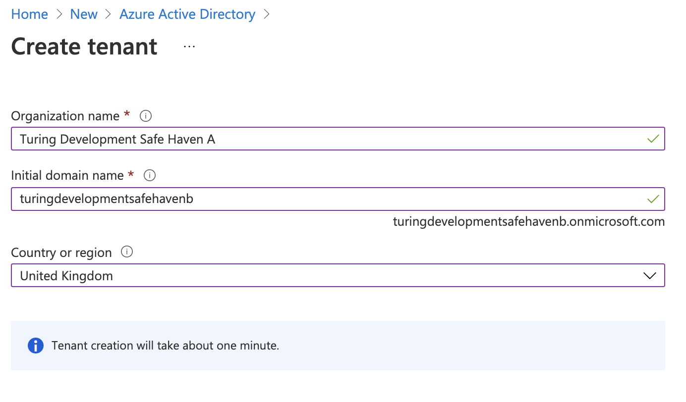
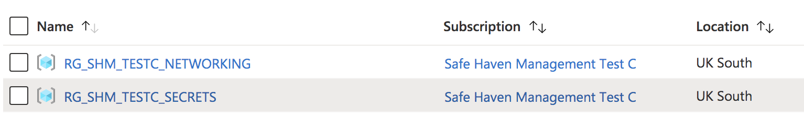
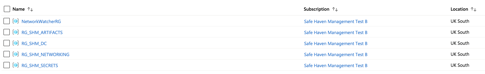

# Safe Haven Management Environment Build Instructions

These instructions will deploy a new Safe Haven Management Environment (SHM). This is required to manage your Secure Research Environments (SREs) and **must be** deployed before you create any SREs. A single SHM can manage all your SREs. Alternatively, you may run multiple SHMs concurrently, for example you may have a group of projects with the same lifecycle which share a different SHM to your other projects.

## Contents

+ [:seedling: 1. Prerequisites](#seedling-1-prerequisites)
+ [:clipboard: 2. Safe Haven Management configuration](#clipboard-2-safe-haven-management-configuration)
+ [:door: 3. Configure DNS for the custom domain](#door-3-configure-dns-for-the-custom-domain)
+ [:file_folder: 4. Setup Azure Active Directory (AAD)](#file_folder-4-setup-azure-active-directory-aad)
+ [:key: 5. Deploy Key Vault for SHM secrets and create emergency admin account](#key-5-deploy-key-vault-for-shm-secrets-and-create-emergency-admin-account)
+ [:iphone: 6. Enable MFA and self-service password reset](#iphone-6-enable-mfa-and-self-service-password-reset)
+ [:id: 7. Configure internal administrator accounts](#id-7-configure-internal-administrator-accounts)
+ [:station: 8. Deploy network and VPN gateway](#station-8-deploy-network-and-vpn-gateway)
+ [:house_with_garden: 9. Deploy and configure domain controllers](#house_with_garden-9-deploy-and-configure-domain-controllers)
+ [:police_car: 10. Deploy and configure network policy server](#police_car-10-deploy-and-configure-network-policy-server)
+ [:closed_lock_with_key: 11. Require MFA for all users](#closed_lock_with_key-11-require-mfa-for-all-users)
+ [:fire_engine: 12. Deploy firewall](#fire_engine-12-deploy-firewall)
+ [:package: 13. Deploy Python/R package repositories](#package-13-deploy-PythonR-package-repositories)
+ [:chart_with_upwards_trend: 14. Deploy logging](#chart_with_upwards_trend-14-deploy-logging)

## Explanation of symbols used in this guide


+ This indicates a `Powershell` command which you will need to run locally on your machine
+ Ensure you have checked out the appropriate version of the Safe Haven repository from [https://github.com/alan-turing-institute/data-safe-haven](https://github.com/alan-turing-institute/data-safe-haven).
+ Open a `Powershell` terminal and navigate to the indicated directory of your locally checked-out version of the Safe Haven repository
+ Ensure that you are logged into Azure by running the `Connect-AzAccount` command
  + :pencil: If your account is a guest in additional Azure tenants, you may need to add the `-Tenant <Tenant ID>` flag, where `<Tenant ID>` is the ID of the Azure tenant you want to deploy into.
+ This command will give you a URL and a short alphanumeric code.
  + You will need to visit that URL in a web browser, enter the code and log in to your account on Azure
  + :pencil: If you have several Azure accounts, make sure you use one that has permissions to make changes to the subscription you are using


+ This indicates a command which you will need to run remotely on an Azure virtual machine (VM) using `Microsoft Remote Desktop`
+ Open `Microsoft Remote Desktop` and click `Add Desktop` / `Add PC`
+ Enter the private IP address of the VM that you need to connect to in the `PC name` field (this can be found by looking in the Azure portal)
+ Enter the name of the VM (for example `DC1-SHM-TESTA`) in the `Friendly name` field
+ Click `Add`
+ Ensure you are connected to the SHM VPN that you have set up
+ Double click on the desktop that appears under `Saved Desktops` or `PCs`.
+ Use the `username` and `password` specified by the appropriate section of the guide
+ :pencil: If you see a warning dialog that the certificate cannot be verified as root, accept this and continue.


+ This indicates an operation which needs to be carried out in the [`Azure Portal`](https://portal.azure.com) using a web browser on your local machine.
+ You will need to login to the portal using an account with privileges to make the necessary changes to the resources you are altering

:pencil: **Notes**

+ This indicates some explanatory notes or examples that provide additional context for the current step.

:warning: **Troubleshooting**

+ This indicates a set of troubleshooting instructions to help diagnose and fix common problems with the current step.


+ These indicate steps that depend on the OS that you are using to deploy the SHM

## :seedling: 1. Prerequisites

+ An [Azure subscription](https://portal.azure.com) with sufficient credits to build the environment in.
  + Ensure that the **Owner** of the subscription is an Azure Security group that all administrators can be added to.
  + :maple_leaf: We recommend around $3,000 as a reasonable starting point.
  + :maple_leaf: We recommend using separate Azure Active Directories for users and administrators
+ `PowerShell`
  + Install [PowerShell v7.0 or above](<https://docs.microsoft.com/en-us/powershell/scripting/install/installing-powershell>)
+ `Powershell` cross-platform modules
  + :maple_leaf: You can run `./deployment/CheckRequirements.ps1` to print out the commands needed to install any missing modules
  + :warning: The version of the `AzureAD` module available from the standard Powershell Gallery only works on **Windows**. We therefore use a cross-platform module to ensure consistent functionality and behaviour on all platforms.
+ `Microsoft Remote Desktop`
  +  this can be installed from the [Apple store](https://apps.apple.com)
  +  this can be [downloaded from Microsoft](https://www.microsoft.com/en-gb/p/microsoft-remote-desktop/9wzdncrfj3ps)
+ `OpenSSL`
  +  a pre-compiled version can be installed using Homebrew: `brew install openssl`
  +  binaries are [available here](https://wiki.openssl.org/index.php/Binaries).
    + :warning: If `Powershell` cannot detect `OpenSSL` you may need to explicitly add your `OpenSSL` installation to your `Powershell` path by running `$env:path = $env:path + ";<path to OpenSSL bin directory>`
  +  use your favourite package manage or install manually following the [instructions on Github](https://github.com/openssl/openssl)

## :clipboard: 2. Safe Haven Management configuration

### Management environment ID

Choose a short ID `<SHM ID>` to identify the management environment (e.g. `testa`). This can have a **maximum of seven alphanumeric characters**.

### Create configuration file

The core properties for the Safe Haven Management (SHM) environment must be defined in a JSON file named `shm_<SHM ID>_core_config.json` in the `environment_configs/core` folder.
The following core SHM properties are required - look at `shm_testa_core_config.json` to see an example.

```json
{
    "name": "Name of this Safe Haven (eg. 'Turing Production Safe Haven').",
    "shmId": "The <SHM ID> that you decided on above (eg. 'testa').",
    "domain": "The fully qualified domain name for the management environment (eg. 'testa.dsgroupdev.co.uk')",
    "timezone": "[Optional] Timezone in IANA format (eg. 'Europe/London').",
    "azure": {
        "subscriptionName": "Azure subscription to deploy the management environment into.",
        "adminGroupName" : "Azure Security Group that admins of this Safe Haven will belong to.",
        "location": "Azure location to deploy the management environment into (eg. 'uksouth')."
     },
     "organisation": {
        "name": "Name of your organisation, used when generating SSL certificates (eg. 'The Alan Turing Institute')",
        "townCity": "Town where your organisation is located, used when generating SSL certificates (eg. 'London')",
        "stateCountyRegion": "Region where your organisation is located, used when generating SSL certificates (eg. 'London')",
        "countryCode": "Country where your organisation is located, used when generating SSL certificates (eg. 'GB')"
    },
    "dnsRecords": {
        "subscriptionName": "[Optional] Azure subscription which holds DNS records (if not specified then the value from the 'azure' block will be used).",
        "resourceGroupName": "[Optional] Resource group which holds DNS records (eg. RG_SHM_DNS_TEST)."
    },
    "vmImages": {
        "subscriptionName": "[Optional] Azure subscription where VM images will be built (if not specified then the value from the 'azure' block will be used). Multiple Safe Haven deployments can share a single set of VM images in a common subscription if desired - this is what is done in the Turing deployment. If you are hoping to use images that have already been built for another Safe Haven deployment, make sure you specify this parameter accordingly.",
        "location": "[Optional] Azure location where VM images should be built (if not specified then the value from the 'azure' block will be used). Multiple Safe Haven deployments can share a single set of VM images in a common subscription if desired - this is what is done in the Turing deployment. If you are hoping to use images that have already been built for another Safe Haven deployment, make sure you specify this parameter accordingly.",
        "buildIpAddresses": "[Optional] One or more IP addresses which admins will be running the VM build scripts from (if not specified then Turing IP addresses will be used)."
     },
    "overrides": "[Optional, Advanced] Do not use this unless you know what you're doing! If you want to override any of the default settings, you can do so by creating the same JSON structure that would be found in the final config file and nesting it under this entry. For example, to change the size of the data disk on the domain controller, you could use something like: 'shm: { dc: { disks: { data: { sizeGb: 50 } } } }'"
}
```

#### :pencil: Notes

+ This configuration file is also used when deploying an SRE environment.
+ :maple_leaf: We recommend that you set the fully qualified domain name to `<SHM ID>.<some domain that you control>`.
  + This may require purchasing a dedicated domain so follow your organisation's guidance.
  +  **production** uses `<SHM ID>.turingsafehaven.ac.uk`
  +  **development** uses `<SHM ID>.dsgroupdev.co.uk`

### (Optional) Verify code version

If you have cloned/forked the code from our GitHub repository, you can confirm which version of the data safe haven you are currently using by running the following commands:


```pwsh
git fetch; git pull; git status; git log -1 --pretty="At commit %h (%H)"
```

This will verify that you are on the correct branch and up to date with `origin`. You can include this confirmation in any record you keep of your deployment.

### (Optional) View full SHM configuration

A full configuration, which will be used in subsequent steps, will be automatically generated from your core configuration. Should you wish to, you can print the full SHM config by running the following Powershell command:

 at :file_folder: `./deployment`

```pwsh
./ShowConfigFile.ps1 -shmId <SHM ID>
```

+ where `<SHM ID>` is the [management environment ID](#management-environment-id) for this SHM

## :door: 3. Configure DNS for the custom domain

 at :file_folder: `./deployment/safe_haven_management_environment/setup`

```pwsh
./Setup_SHM_DNS_Zone.ps1 -shmId <SHM ID>
```

+ where `<SHM ID>` is the [management environment ID](#management-environment-id) for this SHM

### :warning: Troubleshooting

If you see a message `You need to add the following NS records to the parent DNS system for...` you will need to add the NS records manually to the parent's DNS system, as follows:

<details><summary><b>Manual DNS configuration instructions</b></summary>

+ To find the required values for the NS records on the portal, click `All resources` in the far left panel, search for `DNS Zone` and locate the DNS Zone with the SHM's domain. The NS record will list four Azure name servers.
+ Duplicate these records to the parent DNS system as follows:
  + If the parent domain has an Azure DNS Zone, create an NS record set in this zone. The name should be set to the subdomain (e.g. `testa`) or `@` if using a custom domain, and the values duplicated from above
    + For example, for a new subdomain `testa.dsgroupdev.co.uk`, duplicate the NS records from the Azure DNS Zone `testa.dsgroupdev.co.uk` to the Azure DNS Zone for `dsgroupdev.co.uk`, by creating a record set with name `testa`
  <p align="center">
    
  </p>
  + If the parent domain is outside of Azure, create NS records in the registrar for the new domain with the same value as the NS records in the new Azure DNS Zone for the domain.

</details>

## :file_folder: 4. Setup Azure Active Directory (AAD)

### Create a new Azure Active Directory


+ From the Azure portal, click `Create a Resource` and search for `Azure Active Directory`
  <details><summary><b>Screenshots</b></summary>
    <p align="center">
      
    </p>
  </details>
+ Click `Create`
+ Set the `Organisation Name` to the value of `<name>` in your core configuration file (e.g. `Turing Development Safe Haven A`)
  + Note: be careful not to confuse this with the `<name>` under `<organisation>` used in the config file
+ Set the `Initial Domain Name` to the `Organisation Name` all lower case with spaces removed (e.g. `turingdevelopmentsafehavena`)
+ Set the `Country or Region` to whatever region is appropriate for your deployment (e.g. `United Kingdom`)
  <details><summary><b>Screenshots</b></summary>
    <p align="center">
      
    </p>
  </details>
+ Click `Create`
+ Wait for the AAD to be created

### Get the Azure Active Directory Tenant ID


+ From the Azure portal, navigate to the AAD you have created. You can do this by:
  + Clicking the link displayed at the end of the initial AAD deployment.
  + Clicking on your username and profile icon at the top left of the Azure portal, clicking `Switch directory` and selecting the AAD you have just created from the `All Directories` section of the `Directory + Subscription` panel that then displays.
+ If required, click the "hamburger" menu in the top left corner (three horizontal lines) and select `Azure Active Directory`
+ Click `Overview` in the left panel and copy the `Tenant ID` displayed under the AAD name and initial `something.onmicrosoft.com` domain.
  <details><summary><b>Screenshots</b></summary>
    <p align="center">
        
    </p>
  </details>

### Add the SHM domain to the Azure Active Directory

 at :file_folder: `./deployment/safe_haven_management_environment/setup`

```pwsh
pwsh { ./Setup_SHM_AAD_Domain.ps1 -shmId <SHM ID> -tenantId <AAD tenant ID> }
```

+ where `<SHM ID>` is the [management environment ID](#management-environment-id) for this SHM
+ where `<AAD tenant ID>` is the `Tenant ID` that you copied from the AAD above

#### :pencil: Notes

Note the bracketing `pwsh { ... }` which runs this command in a new Powershell environment. This is necessary in order to prevent conflicts between the `AzureAD` and `Az` Powershell modules.

#### :warning: Troubleshooting

+ If you get an error like `Could not load file or assembly 'Microsoft.IdentityModel.Clients.ActiveDirectory, Version=3.19.8.16603, Culture=neutral PublicKeyToken=31bf3856ad364e35'. Could not find or load a specific file. (0x80131621)` then you may need to try again in a fresh Powershell terminal.
+ Due to delays with DNS propagation, the script may occasionally exhaust the maximum number of retries without managing to verify the domain. If this occurs, run the script again. If it exhausts the number of retries a second time, wait an hour and try again.
+  If you get an error that the `Connect-AzureAD` command is unavailable, you may need to manually import the correct cross platform module by running `Import-Module AzureAD.Standard.Preview`.

## :key: 5. Deploy Key Vault for SHM secrets and create emergency admin account

 at :file_folder: `./deployment/safe_haven_management_environment/setup`

```pwsh
pwsh { ./Setup_SHM_Key_Vault_And_Emergency_Admin.ps1 -shmId <SHM ID> -tenantId <AAD tenant ID> }
```

+ where `<SHM ID>` is the [management environment ID](#management-environment-id) for this SHM
+ where `<AAD tenant ID>` is the `Tenant ID` that you copied from the AAD above

### :pencil: Notes

Note the bracketing `pwsh { ... }` which runs this command in a new Powershell environment. This is necessary in order to prevent conflicts between the `AzureAD` and `Az` Powershell modules.

### :warning: Troubleshooting

If you get an error like `Could not load file or assembly 'Microsoft.IdentityModel.Clients.ActiveDirectory, Version=3.19.8.16603, Culture=neutral PublicKeyToken=31bf3856ad364e35'. Could not find or load a specific file. (0x80131621)` then you may need to try again in a fresh Powershell terminal.

### Configure emergency admin account

The User who creates the AAD will automatically have a **guest** account created in the AAD, with the Global Administrator (GA) Role. Users with this role have access to all administrative features in Azure Active Directory). You will use this account for almost all administration of the Safe Haven Azure AD.

However, there are rare operations that require you to be logged in as a **native** Global Administrator. For example, purchasing non-trial MFA licences.

To support these rare cases, and to allow access to the Safe Haven Azure AD in the case of loss of access to personal administrator accounts (e.g. lost access to MFA), an **emergency access** administrator account has been created by the above script. However, this account must be manually assigned to the Global Administrator role.


+ From the Azure portal, navigate to the AAD you have created.
+ Click `Users` in the left hand sidebar and click on the `AAD Admin - EMERGENCY ACCESS` user.
+ Add the `Global Administrator` role to the user.
  + Click `Assigned roles` in the left hand menu
  + Click `Add assignments` in the top menu above the (empty) list of roles
  + Search for `Global Administrator`
  + Check `Global Administrator`
  + Click the `Add` button

## :iphone: 6. Enable MFA and self-service password reset

To enable MFA and self-service password reset, you must have sufficient licences for all users.

### Add licences that support MFA


Click the heading that applies to you to expand the instructions for that scenario.

<details><summary><b>Test deployments</b></summary>

**For testing** you can enable a free trial of the P2 License (NB. It can take a while for these to appear on your AAD). You can activate the trial while logged in as your deafult guest administrator account.

+ From the Azure portal, navigate to the AAD you have created.
+ Click on `Licences` in the left hand sidebar
+ Click on `All products` in the left hand sidebar
+ Click on the `+Try/Buy` text above the empty product list and add a suitable licence product.
  + Expand the `Free trial` arrow under `Azure AD Premium P2`
  + Click the `Activate` button
  + Wait for the `Azure Active Directory Premium P2` licence to appear on the list of `All Products` (this could take several minutes)

</details>

<details><summary><b>Production deployments</b></summary>

**For production** you should buy P1 licences. This requires you to be logged in with an **native** Gloabl Administrator account. As activating self-service password reset requires active MFA licences, this is one of the rare occasions you will need to use the emergency access admin account.

+ Switch to the the **emergency administrator** account:
  + Click on your username at the top right corner of the screen, then click "Sign in with a different account"
  + Enter `aad.admin.emergency.access@<SHM domain>` as the username
  + Open a new browser tab and go to the [Azure Portal](https://azure.microsoft.com/en-gb/features/azure-portal/)
  + Change to the Azure Active Directory associated with the Safe Haven SHM subscription (e.g. an existing corporate Azure AD). Do this by clicking on your username at the top right corner of the screen, then `Switch directory`, then selecting the directory you wish to switch to.
  + Click the "hamburger" menu in the top left corner (three horizontal lines) and select "Subscriptions"
  + Click on the Safe Haven SHM subscription
  + Click on `Resource Groups` in the left hand sidebar then `RG_SHM_<SHM ID>_SECRETS`
  + Click on the `kv-shm-<shm id>` Key Vault
  + Click on `Secrets` in the left hand sidebar
  + Click on the `shm-<shm id>-aad-emergency-admin-password` secret
  + Click on the entry in the `Current version` section
  + Click on the clipboard icon next to the `Secret value` field
  + The emergency admin account password in now in your clipboard
  + Switch back to the browser tab with the Azure login page
  + Paste the password you copied from the Key Vault
  + Click the `Sign in` button
+ Click the `Purchase services` link in the information panel above the trial options.
+ In the "Microsoft 365 Admin Centre" portal that opens:
  + Expand the `Billing` section of the left hand side bar
  + Click on `Purchase services`
  + Scroll down the list of products and select `Azure Active Directory Premium P1` and click `Buy`
  + Select `Pay monthly`
  + Enter the number of licences required.
  + Leave `automatically assign all of your users with no licences` checked
  + Click `Check out now`
  + Enter the address of the organisation running the Safe Haven on the next screen
  + Click next and enter payment details when requested
+ Switch back to your original administrator account
  + Click on your username at the top right corner of the screen, then click "Sign in with a different account"
  + Log in as the user you used to create the Safe Haven Azure AD

</details>

### Enable self-service password reset

+ Ensure your Azure Portal session is using the new Safe Haven Management (SHM) AAD directory. The name of the current directory is under your username in the top right corner of the Azure portal screen. To change directories click on your username at the top right corner of the screen, then `Switch directory`, then the name of the new SHM directory.
+ Click the "hamburger" menu in the top left corner (three horizontal lines) and select "Azure Active Directory"
+ Click `Password reset` in the left hand sidebar
+ Set the `Self service password reset enabled` toggle to `All`
  + If you see a message about buying licences, you may need to refresh the page for the password reset option to show.
+ Click the `Save` icon

### Configure MFA on Azure Active Directory


+ From the Azure portal, navigate to the AAD you have created.
+ Click `Users` in the left hand sidebar
+ Click `Multi-Factor authentication` icon in the top bar of the users list.
+ Click on `Service settings` at the top of the panel
+ Configure MFA as follows:
  + In the `App passwords` section select `Do not allow users to create app passwords to sign in to non-browser apps`
  + Ensure the `Verification options` are set as follows:
    + **check** `Call to phone` and `Notification through mobile app` (`Call to phone` is not available with a trial P2 licence)
    + **uncheck** `Text message to phone` and `Verification code from mobile app or hardware token`
  + In `Remember multi-factor authentication` section
    + ensure `Allow users to remember multi-factor authentication on devices they trust` is **unchecked**
  + Click "Save" and close window
    <details><summary><b>Screenshots</b></summary>
      <p align="center">
        
      </p>
    </details>

## :id: 7. Configure internal administrator accounts

The emergency access admin account should not be used except in a genuine emergency. In particular, it should not be used as a shared admin account for routine administration of the Safe Haven.

A default external administrator account was automatically created for the user you were logged in as when you initially created the Azure AD. This user should also not be used for administering the Azure AD, as it is not controlled by this AD. You will delete this user after creating a new **native** administrator account for yourself and the other administrators of the Safe Haven.

:warning: In order to avoid being a single point of failure, we strongly recommend that you add other administrators in addition to yourself.

### Add internal administrator accounts for yourself and others

:warning: You **must** create and activate a **native** administrator account for yourself. You will delete the default external administrator account in the next step. Later steps will also require use of a **native** admin account with mobile phone and alternate email address set.

#### Create a new account for each administrator (including yourself)


+ From the Azure portal, navigate to the AAD you have created.
+ Click `Users` in the left hand sidebar and click on the `+New user` icon in the top menu above the list of users.
+ Create an internal admin user:
  + User name: `aad.admin.firstname.lastname@<SHM domain>`
  + Name: `AAD Admin - Firstname Lastname`
  + Leave `Auto-generate password` set. Users will be able to reset their passwords on first login and it is good security practice for admins not to know user passwords.
  + Click the `User` link in the `Roles` field and make the user an administrator:
    + Search for `Global Administrator`
    + Check `Global Administrator`
    + Click the `Select` button
  + Set their usage location to the country you used when creating the Safe Haven Azure AD
  + Leave all other fields empty, including First name and Last name
  + Click `Create`
+ Add a mobile phone number for self-service password reset:
  + Navigate to `Users` and click on the account you have just created.
  + Edit the `Contact info` section and:
    + Add the the user's mobile phone number to the `Mobile phone` field. Make sure to prefix it with the country code and **do not include** the leading zero (`+<country-code> <phone-number-without-leading-zero>` e.g. `+44 7700900000`).
    + They will need to enter their number in **exactly this format** when performing a self-service password reset.
  + Click the `Save` icon at the top of the user details panel
+ Add an authentication email
  + Click `Authentication methods` in the left hand sidebar
  + Enter the user's institutional email address in the `Email` field
  + Note that you do **not** need to fill out either of the `Phone` fields here
  + Click the `Save` icon at the top of the panel

### Activate and configure your new internal admin account

:warning: In the next step we will delete the external admin account created for the user account you used to create the Azure AD. Before you do this, you **must** configure and log into the **native** admin account you have just created for yourself.

The other administrators you have just set up can activate their accounts by following the same steps.

+ Go to https://aka.ms/mfasetup in an **incognito / private browsing** tab
+ Enter your username (`aad.admin.firstname.lastname@<SHM domain>`)
+ Click the `Forgotten my password` link
+ Enter the captcha text and press next
+ Enter your mobile phone number, making sure to prefix it with the country code and to **not include** the leading zero (`+<country-code> <phone-number-without-leading-zero>`e.g. `+44 7700900000`).
+ Enter the code that was texted to your phone
+ Enter a new password
+ Click the `Sign in with new password` link on the following page, or go to https://aka.ms/mfasetup again
+ Enter your username (`aad.admin.firstname.lastname@<SHM domain>`)and the new password
+ Click `Next` at the `Help us to protect your account` prompt
+ Follow the instructions to configure Microsoft Authenticator

### Remove the default external user that was used to create the Azure AD

:warning: Make sure you have activated your account and **successfully logged in** with the new **native** administrator account you have just created for yourself (`aad.admin.firstname.lastname@<SHM domain>`) before deleting the default external administrator account.


+ Ensure you are logged in with the new **native** administrator account you have just created.
  + Click on your username at the top right corner of the screen, then `Sign in with a different user`.
  + Log in with the password you set for yourself when activating your admin account in the previous step
+ From the Azure portal, navigate to the AAD you have created.
+ Click `Users` in the left hand sidebar
+ Select the default **external** user that was created when you created the Azure AD.
  + The `User principal name` field for this user will contain the **external domain** and will have `#EXT#` before the `@` sign (for example `alovelace_turing.ac.uk#EXT#@turingsafehaven.onmicrosoft.com`)
+ Click the `Delete user` icon in the menu bar at the top of the user list panel

### Adding MFA licences to any non-admin users

Administrator accounts can use MFA and reset their passwords without a licence needing to be assigned. However, if any non-admin users are set up and are unable to reset their own password or set up MFA on their account, you can add a licence to enable them to do so:

<details><summary><b>How to add MFA licenses</b></summary>

+ Ensure you are logged in to the Azure Portal in with the **native** administrator account you created.
+ Ensure your  session is using the new Safe Haven Management (SHM) AAD directory. The name of the current directory is under your username in the top right corner of the Azure portal screen. To change directories click on your username at the top right corner of the screen, then `Switch directory`, then the name of the new SHM directory.
+ Click the "hamburger" menu in the top left corner (three horizontal lines) and select `Azure Active Directory`
+ Click `Licences` in the left hand sidebar
+ Click `All products` in the left hand sidebar
+ Click the relevant licence product
+ Click the `+Assign` icon in the top bar above the list of user licence assignments
+ Click `Users`
+ Click on the user or group you want to assign a licence to
+ Click `Select`
+ Click `Assign`

</details>

## :station: 8. Deploy network and VPN gateway

 at :file_folder: `./deployment/safe_haven_management_environment/setup`

```pwsh
./Setup_SHM_Networking.ps1 -shmId <SHM ID>
```

+ where `<SHM ID>` is the [management environment ID](#management-environment-id) for this SHM

<details><summary><b>Sanity check</b></summary>

+ Once the script exits successfully you should see the following resource groups in the Azure Portal under the SHM subscription, with the appropriate `<SHM ID>` for your deployment e.g. `RG_SHM_<SHM ID>_NETWORKING`:
  <p align="center">
    
  </p>
+ If you cannot see these resource groups:
  + Ensure you are logged into the portal using the account that you are building the environment with.
  + Click on your username in the top right corner of the Azure portal screen and ensure that your SHM subscription (see `shm_<SHM ID>_core_config.json`) is one of the selections.
  + Click the "hamburger" menu in the top left corner (three horizontal lines) and select `Resource groups`.

</details>

### Download a client VPN certificate for the Safe Haven Management network


+ Navigate to the SHM Key Vault via `Resource Groups > RG_SHM_<SHM ID>_SECRETS > kv-shm-<SHM ID>`
+ Once there open the `Certificates` page under the `Settings` section in the left hand sidebar.
+ Click on the certificate named `shm-<SHM ID>-vpn-client-cert` and select the `CURRENT VERSION`
+ Click the `Download in PFX/PEM format` link at the top of the page and save the `*.pfx` certificate file locally
+ To install, double click on the downloaded certificate (or on macOS you can manually drag it into the `login` keychain), leaving the password field blank.

**Make sure to securely delete the local "\*.pfx" certificate file that you downloaded after you have installed it.**

### Configure a VPN connection to the Safe Haven Management network


+ Navigate to the Safe Haven Management (SHM) virtual network gateway in the SHM subscription via `Resource Groups > RG_SHM_<SHM ID>_NETWORKING > VNET_SHM_<SHM ID>_GW`
+ Once there open the `Point-to-site configuration` page under the `Settings` section in the left hand sidebar
+ Click the `Download VPN client` link at the top of the page to download a zip file
  <details><summary><b>Screenshots</b></summary>
    <p align="center">
      
    </p>
  </details>
+ Unzip the zip file and identify the root certificate (`Generic\VpnServerRoot.cer`) and VPN configuration file (`Generic\VpnSettings.xml`)
+ Follow the [VPN set up instructions](https://docs.microsoft.com/en-us/azure/vpn-gateway/point-to-site-vpn-client-configuration-azure-cert) using the section appropriate to your operating system (**you do not need to install the `Generic\VpnServerRoot.cer` certificate, as we're using our own self-signed root certificate**):
  + 
    + Use SSTP for the VPN type
    + Name the VPN connection `Safe Haven Management Gateway (<SHM ID>)`
    + **Do not** rename the VPN client as this will break it
  + 
    + Start from step 3 of the macOS instructions.
    + Use IKEv2 for the VPN type
    + Name the VPN connection `Safe Haven Management Gateway (<SHM ID>)`
    + You can view the details of the downloaded certificate by highlighting the certificate file in Finder and pressing the spacebar. You can then look for the certificate of the same name in the login KeyChain and view its details by double clicking the list entry. If the details match the certificate has been successfully installed.

You should now be able to connect to the SHM virtual network via the VPN. Each time you need to access the virtual network ensure you are connected via the VPN.

#### :warning: Troubleshooting

+  you may get a `Windows protected your PC` pop up. If so, click `More info -> Run anyway`.
+  you may encounter a further warning along the lines of `Windows cannot access the specified device, path, or file`. This may mean that your antivirus is blocking the VPN client. You will need configure your antivirus software to make an exception.

## :house_with_garden: 9. Deploy and configure domain controllers

 at :file_folder: `./deployment/safe_haven_management_environment/setup`

```pwsh
./Setup_SHM_DC.ps1 -shmId <SHM ID>
```

+ where `<SHM ID>` is the [management environment ID](#management-environment-id) for this SHM

<details><summary><b>Sanity check</b></summary>

+ Once the script exits successfully you should see the following resource groups in the Azure Portal under the SHM subscription, with the appropriate `<SHM ID>` for your deployment e.g. `RG_SHM_<SHM ID>_NETWORKING`:
  <p align="center">
    
  </p>
+ If you cannot see these resource groups:
  + Ensure you are logged into the portal using the account that you are building the environment with.
  + Click on your username in the top right corner of the Azure portal screen and ensure that your SHM subscription (see `shm_<SHM ID>_core_config.json`) is one of the selections.
  + Click the "hamburger" menu in the top left corner (three horizontal lines) and select `Resource groups`.

</details>

### Configure the first domain controller via Remote Desktop


+ Navigate to the **SHM primary domain controller** VM in the portal at `Resource Groups > RG_SHM_<SHM ID>_DC > DC1-SHM-<SHM ID>` and note the `Private IP address` for this VM
+ Next, navigate to the `RG_SHM_<SHM ID>_SECRETS` resource group and then the `kv-shm-<SHM ID>` Key Vault and then select `secrets` on the left hand panel and retrieve the following:
+ `<admin username>` is in the `shm-<SHM ID>-domain-admin-username` secret.
  + Add the SHM AD domain to the username so the `<admin login>` is `<admin username>@<SHM domain>` rather than simply `<admin username>`.
+ `<admin password>` is in the `shm-<SHM ID>-domain-admin-password` secret.

#### Install Azure Active Directory Connect


+ Log into the **SHM primary domain controller** (`DC1-SHM-<SHM ID>`) VM using the `private IP address`, `<admin login>` and `<admin password>` that you obtained from the portal above
+ Navigate to `C:\Installation`
+ Run the `AzureADConnect` Windows Installer Package
  + On the `Welcome to Azure AD Connect` screen:
    + Tick the `I agree to the license terms` box
    + Click `Continue`
  + On the `Express Settings` screen:
    + Click `Customize`
  + On the `Install required components` screen:
    + Click `Install`
  + On the `User sign-in` screen:
    + Ensure that `Password Hash Synchronization` is selected
    + Click `Next`
  + On the `Connect to Azure AD` screen:
    + Provide credentials for the Azure Active Directory **global administrator** account you set up earlier (`aad.admin.<first name>.<last name>@<SHM domain>`) when prompted
    + On the webpage pop-up, provide the password you chose for this account when prompted
    + Back on the `Connect to Azure AD` screen, click `Next`
    + Approve the login with MFA if required
  + On the `Connect your directories` screen:
    + Ensure that correct forest (your custom domain name; e.g `turingsafehaven.ac.uk`) is selected and click `Add Directory`
    + On the `AD forest account` pop-up:
      + Select `Use existing AD account`
      + Enter the details for the `localadsync` user.
        + **Username**: use the value of the `shm-<SHM ID>-aad-localsync-username` secret in the SHM key vault:
          + EITHER prepended with `<Domain ID>\`, where the `Domain ID` is the capitalised form of the `<SHM ID>`, so if the *SHM ID* is `testa` and the *username* is `testalocaladsync` then you would use `TESTA\testalocaladsync` here.
          + OR suffixed with `<SHM domain>`, so if the *SHM domain* is `testa.dsgroupdev.co.uk` and the *username* is `testalocaladsync` then you would use `testalocaladsync@testa.dsgroupdev.co.uk` here.
        + **Password**: use the `shm-<SHM ID>-aad-localsync-password` secret in the SHM key vault.
      + Click `OK`
    + Click `Next`
  + On the `Azure AD sign-in configuration` screen:
    + Verify that the `User Principal Name` is set to `userPrincipalName`
    + Click `Next`
  + On the `Domain and OU filtering` screen:
    + Select `Sync Selected domains and OUs`
    + Expand the domain and deselect all objects
    + Select `Safe Haven Research Users` and `Safe Haven Security Groups`
    + Click `Next`
  + On the `Uniquely identifying your users` screen:
    + Click `Next`
  + On the `Filter users and devices` screen:
    + Select `Synchronize all users and devices`
    + Click `Next`
  + On the `Optional features` screen:
    + Select `Password Writeback`
    + Click `Next`
  + On the `Ready to configure` screen:
    + Ensure that the `Start the synchronisation process when configuration completes` option is ticked.
    + Click `Install`
    + This may take a few minutes to complete
  + On the `Configuration complete` screen:
    + Click `Exit`

#### :pencil: Notes

Take care to consider any differences in the keyboard of your machine and the Windows remote desktop when entering any usernames or passwords

#### :warning: Troubleshooting

+ If you receive an Internet Explorer pop-up dialog `Content within this application coming from the website below is being blocked by Internet Explorer Advanced Security Configuration` for Microsoft domains such as `https://login.microsoft.com` or `https://aadcdn.msftauth.net` then you can safely add these as exceptions:
  + Click `Add`
  + Click `Close`
+ If you receive an error message on the login webpage pop-ups saying `We can't sign you in. Javascript is required to sign you in....` followed by the Script Error: `Do you want to continue running scripts on this page` you can safely allow Javascript:
  + Click `Yes`
  + Close the dialog by clicking `X`
+ If you see a Windows Security Warning, related to the MFA login:
  + Check `Don't show this message again`
  + Click `Yes` to close the dialog.
+ If you get an error that the username/password is incorrect or that the domain/directory could not be found when entering the details for the `localadsync` user, try resetting the password for this user in the **Domain Controller** Active Directory so that it matches the value stored in the Key Vault
  + In Server Manager click `Tools > Active Directory Users and Computers`
  + Expand the domain in the left hand panel
  + Expand the `Safe Haven Service Accounts` OU
  + Right click on the `<SHM ID> Local AD Sync Administrator` user and select `reset password`
  + Set the password to the value from the appropriate Key Vault secret.
  + Leave the other settings alone and click `OK`
+ The error `Directory synchronization is currently in a pending disabled state for this directory. Please wait until directory synchronization has been fully disabled before trying again` may occur if you have recently torn down another SHM linked to the same Azure Active Directory. You need to wait for the Azure Active Directory to fully disconnect - this can take up to 72 hours but is typically sooner. You do not need to close the installer window while waiting. If you need to, you can disconnect from the DC and VPN and reconnect later before clicking `Retry`.

#### Update Azure Active Directory Connect rules

This step allows the locale (country code) to be pushed from the local AD to the Azure Active Directory.


+ Log into the **SHM primary domain controller** (`DC1-SHM-<SHM ID>`) VM using the `private IP address`, `<admin login>` and `<admin password>` that you obtained from the portal above
+ Run the following command on the remote domain controller VM to update the AAD rules

```pwsh
C:\Installation\UpdateAADSyncRule.ps1
```

### Validate Active Directory synchronisation
This step validates that your local Active Directory users are correctly synchronised to Azure Active Directory. Note that you can use the same script after deploying an SRE to add users in bulk.


+ Log into the **SHM primary domain controller** (`DC1-SHM-<SHM ID>`) VM using the `private IP address`, `<admin login>` and `<admin password>` that you obtained from the portal above
+ Generating user CSV file
  + Make a new copy of the user details template file from `C:\Installation\user_details_template.csv` on the SHM DC1 domain controller.
  We suggest naming this `YYYYMMDD-HHMM_user_details.csv` but this is up to you
  + Add your details to create a researcher account for yourself.
    + `SamAccountName`: Log in username **without** the @domain bit. Use `firstname.lastname` format and please stick to unnaccented lower case ascii letters with a period separating the name parts. Maximum length is 20 characters.
    + `GivenName`: User's first / given name
    + `Surname`: User's last name / surname
    + `Mobile`: Phone number to use for initial password reset.
      This must include country code in the format `+<country-code> <local number>` (e.g. `+44 7700900000`).
      Include a space between the country code and local number parts but no other spaces.
      Remove the leading `0` from local number if present.
      This can be a landline or or mobile but must be accessible to the user when resetting their password and setting up MFA.
      They can add the authenticator app and / or another phone number during MFA setup and at least one MFA method must work when at the Turing.
    + `SecondaryEmail`: An existing organisational email address for the user.
      Not uploaded to their Safe Haven user account but needs to be added here so we reliably send the account activation
    + [Optional] `GroupName`: SRE group that the user will be added to. As these groups are created during the SRE deployment you can leave this empty for this initial validation of the synchronisation process.

+ Run the following command on the remote domain controller VM to create and synchronise the users

```pwsh
C:\Installation\CreateUsers.ps1 <path_to_user_details_file>
```

+ This script will add the users and trigger a sync with Azure Active Directory
+ Wait a few minutes for the changes to propagate


+ Click `Users > All users` and confirm that the new user is shown in the user list.
+ The new user account should have the `Directory synced` field set to `Yes`

#### :warning: Troubleshooting
If you get the message `New-ADUser:  The specified account already exists` you should first check to see whether that user actually does already exist! Once you're certain that you're adding a new user, make sure that the following fields are unique across all users in the Active Directory.

+ `SamAccountName`: Specified explicitly in the CSV file. If this is already in use, consider something like `firstname.middle.initials.lastname`
+ `DistinguishedName`: Formed of `CN=<DisplayName>,<OUPath>` by Active directory on user creation. If this is in use, consider changing `DisplayName` from `<GivenName> <Surname>` to `<GivenName> <Middle> <Initials> <Surname>`.

### Configure AAD side of AD connect


+ From the Azure portal, navigate to the AAD you have created.
+ Select `Password reset` from the left hand menu
+ Select `On-premises integration` from the left hand side bar
  + Ensure `Write back passwords to your on-premises directory` is set to yes.
    <p align="center">
      
    </p>
  + If you changed this setting, click the `Save` icon

#### Manually add an MFA licence for the user


+ From the Azure portal, navigate to the AAD you have created.
+ Select `Licences` from the left hand menu
+ Select `All Products` from the left hand menu
+ Click `Azure Active Directory Premium P1` (production) or `Azure Active Directory Premium P2` (test)
+ Click `Assign`
+ Click `Users and groups`
+ Select the users you have recently created and click `Select`
+ Click `Assign` to complete the process
+ <details><summary><b>Activate your researcher account in the same way as for your admin account (via https://aka.ms/mfasetup)</b></summary>

  + Go to https://aka.ms/mfasetup in an **incognito / private browsing** tab
  + Enter the researcher username (`firstname.lastname@<SHM domain>`)
  + Click the `Forgotten my password` link
  + Enter the captcha text and press next
  + Enter your mobile phone number, making sure to prefix it with the country code and to **not include** the leading zero (`+<country-code> <phone-number-without-leading-zero>`e.g. `+44 7700900000`).
  + Enter the code that was texted to your phone
  + Enter a new password
  + Click the `Sign in with new password` link on the following page, or go to https://aka.ms/mfasetup again
  + Enter the username (`firstname.lastname@<SHM domain>>`)and the new password
  + Click `Next` at the `Help us to protect your account` prompt
  + Follow the instructions to configure Microsoft Authenticator

</details>

## :police_car: 10. Deploy and configure network policy server

 at :file_folder: `./deployment/safe_haven_management_environment/setup`

```pwsh
./Setup_SHM_NPS.ps1 -shmId <SHM ID>
```

+ where `<SHM ID>` is the [management environment ID](#management-environment-id) for this SHM

#### :warning: Troubleshooting
If you see an error similar to `New-AzResourceGroupDeployment: Resource Microsoft.Compute/virtualMachines/extensions NPS-SHM-<SHM ID>/joindomain' failed with message` you may find this error resolves if you wait and retry later. Alternatively, you can try deleting the extension from the `NPS-SHM-<SHM ID> > Extensions` blade in the Azure portal.

### Configure the network policy server (NPS) via Remote Desktop


+ Navigate to the **network policy server** VM in the portal at `Resource Groups > RG_SHM_<SHM ID>_NPS > NPS-SHM-<SHM ID>` and note the `Private IP address` for this VM
+ Use the same `<admin login>` and `<admin password>` as for the **SHM primary domain controller** (`DC1-SHM-<SHM ID>`)

#### Configure NPS logging


+ Log into the **network policy server** (`NPS-SHM-<SHM ID>`) VM using the `private IP address`, `<admin login>` and `<admin password>` that you obtained above
+ Open Server Manager and select `Tools > Network Policy Server` (or open the `Network Policy Server` desktop app directly)
+ Configure NPS to log to a local text file:
  + Select `NPS (Local) > Accounting` on the left-hand sidebar
    <details><summary><b>Screenshots</b></summary>
      <p align="center">
        
      </p>
    </details>
  + Click on `Accounting > Configure Accounting`
    + On the `Introduction` screen, click `Next`.
    + On the `Select Accounting Options` screen, select `Log to text file on the local computer` then click `Next`.
    + On the `Configure Local File Logging` screen, click `Next`.
    + On the `Summary` screen, click `Next`.
    + On the `Conclusion` screen, click `Close`.
  + Click on `Log file properties > Change log file properties`
    + On the `Log file` tab, select `Daily` under `Create a new log file`
    + Click `Ok`

#### Configure MFA


+ Log into the **network policy server** (`NPS-SHM-<SHM ID>`) VM using the `private IP address`, `<admin login>` and `<admin password>` that you obtained above
+ Run the following command on the remote network policy server VM to configure MFA
+ On the webpage pop-up, provide credentials for your **native** Global Administrator for the SHM Azure AD

```pwsh
& "C:\Program Files\Microsoft\AzureMfa\Config\AzureMfaNpsExtnConfigSetup.ps1
```

+ Enter `A` if prompted to install `Powershell` modules
+ On the webpage pop-up, provide credentials for your **native** Global Administrator for the SHM Azure AD
+ Back on the `Connect to Azure AD` screen, click `Next`
+ Approve the login with MFA if required
+ When prompted to `Provide your Tenant ID`, enter the Tenant ID that you [obtained from Azure Active Directory](#get-the-azure-active-directory-tenant-id) earlier
+ At the message `Configuration complete. Press Enter to continue`, press `Enter`

#### :pencil: notes

+ Take care to consider any differences in the keyboard of your machine and the Windows remote desktop when entering the password

#### :warning: Troubleshooting

+ If you receive an error box `We can't sign you in. Javascript is required to sign you in. Do you want to continue running scripts on this page`
  + Click `Yes`
  + Close the dialog by clicking `X`
+ If you get a Javascript error that prevents the script from running then simply run this script again.
+ If you receive an Internet Explorer pop-up dialog like `Content within this application coming from the website below is being blocked by Internet Explorer Advanced Security Configuration`
  + Add these webpages to the exceptions whitelist by clicking `Add` and clicking `Close`
+ If you see a Windows Security Warning when connecting to Azure AD, check `Don't show this message again` and click `Yes`.
+ If you see an error `New-MsolServicePrincipalCredential : Service principal was not found`, this indicates that the `Azure Multi-Factor Auth Client` is not enabled in Azure Active Directory.
  + Look at [the documentation here](https://docs.microsoft.com/en-us/azure/active-directory/authentication/howto-mfa-nps-extension#troubleshooting).
  + Make sure the Safe Haven Azure Active Directory has valid P1 licenses:
    + Go to the Azure Portal and click `Azure Active Directories` in the left hand side bar
    + Click `Licenses`in the left hand side bar then `Manage > All products`
    + You should see `Azure Active Directory Premium P1` in the list of products, with a non-zero number of available licenses.
    + If you do not have P1 licences, purchase some following the instructions at the end of the [Add additional administrators](#Add-additional-administrators) section above, making sure to also follow the final step to configure the MFA settings on the Azure Active Directory.
    + If you are using the trial `Azure Active Directory Premium P2` licences, you may find that enabling a trial of `Enterprise Mobility + Security E5` licences will resolve this.
  + Make sure that you have added a P1 licence to at least one user in the `Azure Active Directory` and have gone through the MFA setup procedure for that user. You may have to wait a few minutes after doing this
  + If you've done all of these things and nothing is working, you may have accidentally removed the `Azure Multi-Factor Auth Client` Enterprise Application from your `Azure Active Directory`. Run `C:\Installation\Ensure_MFA_SP_AAD.ps1` to create a new service principal and try the previous steps again.
+ If you get a `New-MsolServicePrincipalCredential: Access denied` error stating `You do not have permissions to call this cmdlet`, check the following:
  + Make sure you are logged in to the NPS server as a **domain** user rather than a local user.
    + The output of the `whoami` command in Powershell should be `<SHM netBios domain>\<SHM admin>` rather than `NPS-SHM-<SHM ID>\<SHM admin>`.
    + If it is not, reconnect to the remote desktop with the username `admin@<SHM domain>`, using the same password as before
  + Make sure you authenticate to `Azure Active Directory` your own **native** Global Administrator (i.e. `admin.firstname.lastname@<SHM domain>`) and that you have successfully logged in and verified your phone number + email address and c onfigured MFA on your account.

## :closed_lock_with_key: 11. Require MFA for all users

:warning: Before completing this step, **make sure you have confirmed you are able to successfully log in as the emergency access admin**, as this account will be the only one excluded from the MFA requirement


+ From the Azure portal, navigate to the AAD you have created.
+ Click `Properties` in the left hand sidebar and **disable** security defaults as shown in the screenshot [here](https://docs.microsoft.com/en-us/azure/active-directory/fundamentals/concept-fundamentals-security-defaults)
  + Select `NO` from `Enable Security defaults`
  + Select `My organization is using Conditional Access` and hit the `Save` button
+ Click `Security` in the left hand sidebar
+ Click `Conditional access` in the left hand sidebar
+ Click the `+New Policy` icon in the tob bar above the (empty) policy list
+ Create a new policy as follows:
  + Set the name to `Require MFA`
  + Set the `Users and groups` condition to:
    + Include: Check `All users`
    + Exclude:
      + Check `Users and groups`
      + Select the `Admin - EMERGENCY ACCESS` user
      + Select all `On-Premises Directory Synchronization Service Account` users
      + Click `Select`
  + Set the `Cloud apps and policies` condition to:
    + Include: Check `All cloud apps`
    + Exclude: Leave unchanged as `None`
  + Leave the `Conditions` condition unchanged (all showing as `Not configured`)
  + Set the `Grant` condition to:
    + Check `Grant access`
    + Check `Require multi-factor authentication`
    + Click `Select`
  + Leave the `Session` condition unchanged
  + Under `Enable policy` select `On`
  + Check `I understand that my account will be impacted by this policy. Proceed anyway.`
  + Click the `Create` button

## :fire_engine: 12. Deploy firewall
<!-- NB. this could be moved earlier in the deployment process once this has been tested, but the first attempt will just focus on locking down an already-deployed environment -->

 at :file_folder: `./deployment/safe_haven_management_environment/setup`

```pwsh
./Setup_SHM_Firewall.ps1 -shmId <SHM ID>
```

+ where `<SHM ID>` is the [management environment ID](#management-environment-id) for this SHM

## :package: 13. Deploy Python/R package repositories
We currently support two different types of package repositories:

+ Nexus proxy (Tier-2 only)
+ Local mirror (Tier-2 and Tier-3)

Each SRE can be configured to connect to either the local mirror or the Nexus proxy as desired - you will simply have to ensure that you have deployed whichever repository you prefer before deploying the SRE.

### How to deploy a Nexus package repository

 at :file_folder: `./deployment/safe_haven_management_environment/setup`

```pwsh
./Setup_SHM_Nexus.ps1 -shmId <SHM ID> -tier <desired tier>
```

+ where `<SHM ID>` is the [management environment ID](#management-environment-id) for this SHM
+ where `<desired tier>` is either `2` or `3`

### How to deploy a local package mirror

> :warning: Note that a full set of local Tier 2 mirrors currently take around **two weeks** to fully synchronise with the external package repositories as PyPI now contains >10TB of packages.

 at :file_folder: `./deployment/safe_haven_management_environment/setup`

```pwsh
./Setup_SHM_Package_Mirrors.ps1 -shmId <SHM ID> -tier <desired tier>
```

+ where `<SHM ID>` is the [management environment ID](#management-environment-id) for this SHM
+ where `<desired tier>` is either `2` or `3`

## :chart_with_upwards_trend: 14. Deploy logging

 at :file_folder: `./deployment/safe_haven_management_environment/setup`

```pwsh
./Setup_SHM_Logging.ps1 -shmId <SHM ID>
```

+ where `<SHM ID>` is the [management environment ID](#management-environment-id) for this SHM

#### :warning: Troubleshooting
The API call that installs the logging extensions to the VMs times out after a few minutes, so you may get some extension installation failure messages. If so, try re-running the logging set up script. In most cases the extensions have actually been successfully installed.
