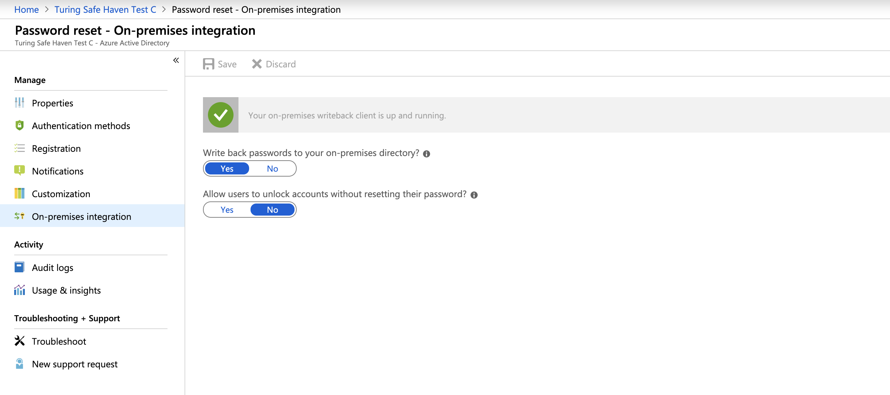
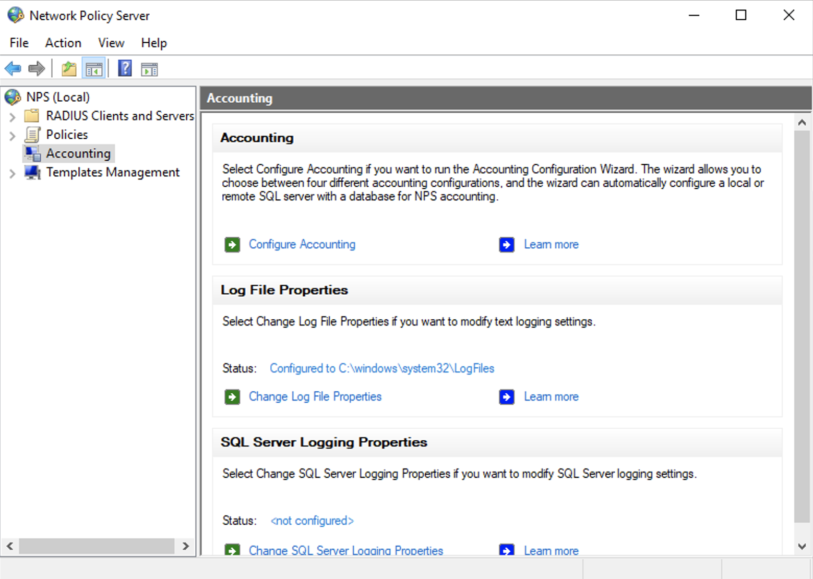

# Safe Haven Management Environment Build Instructions

These instructions will deploy a new Safe Haven Management Environment (SHM). This is required to manage your Secure Research Environments (SREs) and must be deployed before you create any SREs. A single SHM can manage all your SREs. Alternatively, you may run multiple SHMs concurrently (eg one for each Data Study Group).

## Contents

+ [Prerequisites](#prerequisites)
+ [Safe Haven Management configuration](#safe-haven-management-configuration)
+ [Configure DNS for the custom domain](#configure-dns-for-the-custom-domain)
+ [Setup Azure Active Directory (AAD)](#setup-azure-active-directory-aad)
+ [Deploy key vault for SHM secrets and create emergency admin account](#deploy-key-vault-for-shm-secrets-and-create-emergency-admin-account)
+ [Enable MFA and self-service password reset](#enable-mfa-and-self-service-password-reset)
+ [Configure internal administrator accounts](#configure-internal-administrator-accounts)
+ [Deploy and configure VNET and Domain Controllers](#deploy-and-configure-vnet-and-domain-controllers)
+ [Deploy and configure Network Policy Server (NPS)](#deploy-and-configure-network-policy-server-nps)
+ [Require MFA for all users](#require-mfa-for-all-users)
+ [Deploy firewall](#deploy-firewall)
+ [Deploy logging](#deploy-logging)
+ [Deploy package mirrors](#deploy-package-mirrors)
+ [Tear down SHM](#tearing-down-the-shm)

## Prerequisites

+ An Azure subscription with sufficient credits to build the environment in. If a subscription does not exist, create one with the name `Safe Haven Management <SHM ID>`, picking an SRE ID that is not yet in use and setting `<SHM ID>` to the value given in the config file, prefixing the subscription name with `[prod]` or `[dev]` to indicate whether it is a production or development environment.
  + This subscription should have an initial $3,000 for test and production sandbox environments, or the project specific budget for production project environments
  + The relevant Safe Haven Administrator Security Group must have the **Owner** role on the new subscription (e.g. "Safe Haven Test Admins" or "Safe Haven Production Admins").
  + You will need to be a member of the relevant security group.
+ `PowerShell` with support for Azure and Azure Active Directory
  + Install [PowerShell v6.0 or above](<https://docs.microsoft.com/en-us/powershell/scripting/install/installing-powershell>)
  + Install the [Azure PowerShell Module](<https://docs.microsoft.com/en-us/powershell/azure/install-az-ps>)
  + Install the **cross-platform** AzureAD Powershell module:
    + :warning: The version of the AzureAD module installable from the standard Powershell Gallery installs on all platforms, but only works on **Windows**. We therefore use the cross-platform module to ensure consistent functionality and behaviour on all platforms.
    + Register the Powershell test gallery: `Register-PackageSource -Trusted -ProviderName 'PowerShellGet' -Name 'Posh Test Gallery' -Location https://www.poshtestgallery.com/api/v2/`
    + Install the cross-platform .NET Standard version of the `AzureAD` module `Install-Module AzureAD.Standard.Preview -Repository "Posh Test Gallery"`
+ `Microsoft Remote Desktop`
  + On Mac this can be installed from the [apple store](<https://itunes.apple.com/gb/app/microsoft-remote-desktop-10/id1295203466?mt=12>)
+ `OpenSSL`
  + To install manually follow the [instructions on Github](<https://github.com/openssl/openssl>)
  + To install a pre-compiled version on OSX use Homebrew: ` brew install openssl`
  + To install a pre-compiled version on Windows use [one of these](<https://wiki.openssl.org/index.php/Binaries>).
    + **Windows:** OpenSSL is used in the Powershell scripts. If Powershell cannot find OpenSSL, you may need to add your OpenSSL directory to the Powershell environment path, as follows: `$env:path = $env:path + ";<path to OpenSSL bin directory>`

## Safe Haven Management configuration

### Domain name

Choose a domain according to the following rules:

+ Turing production: a subdomain of the `turingsafehaven.ac.uk` domain
+ Turing testing: a subdomain of the `dsgroupdev.co.uk` domain
+ Other safe havens: follow your organisation's guidance. This may require purchasing a dedicated domain

### Management environment ID

Choose a short ID `<SHM ID>` to identify the management environment (e.g. `testa`).

### Create configuration file

The core properties for the Safe Haven Management (SHM) environment must be present in the `environment_configs/core` folder. These are also used when deploying an SRE environment.
The following core SHM properties must be defined in a JSON file named `shm_<SHM ID>_core_config.json`. The `shm_testa_core_config.json` provides an example.

**NOTE:** The `netbiosName` must have a maximum length of 15 characters.

```json
{
    "subscriptionName": "Name of the Azure subscription the management environment is deployed in.",
    "dnsSubscriptionName": "Name of the Azure subscription holding DNS records.",
    "dnsResourceGroupName": "Name of the resource group holding DNS records (eg. RG_SHM_DNS_TEST)",
    "adminSecurityGroupName" : "Name of the Azure Security Group that admins of this Safe Haven will belong to.",
    "images": {
        "subscriptionName": "Name of the Azure subscription where VM images should be built.",
        "location": "The Azure location in which VM images should be built."
    },
    "domain": "The fully qualified domain name for the management environment.",
    "shmId": "A short ID to identify the management environment. This must be 7 or fewer characters.",
    "name": "Safe Haven deployment name.",
    "organisation": {
        "name": "Organisation name.",
        "townCity": "Location.",
        "stateCountyRegion": "Location.",
        "countryCode": "e.g. GB"
    },
    "location": "The Azure location in which the management environment VMs are deployed."
}
```

> :warning: The `shmId` field must have a maximum of 7 characters.

## Configure DNS for the custom domain

From your **deployment machine**

+ Ensure you have the latest version of the Safe Haven repository from [https://github.com/alan-turing-institute/data-safe-haven](<https://github.com/alan-turing-institute/data-safe-haven>).
+ Open a Powershell terminal and navigate to the `deployment/safe_haven_management_environment/setup` directory within the Safe Haven repository.
+ Ensure you are logged into Azure within PowerShell using the command: `Connect-AzAccount`. This command will give you a URL and a short alphanumeric code. You will need to visit that URL in a web browser and enter the code
+ Run `./Setup_SHM_DNS_Zone.ps1 -shmId <SHM ID>`, where `<SHM ID>` is the [management environment ID](#management-environment-id) specified in the configuration file.
+ If you see a message `You need to add the following NS records to the parent DNS system for...` you will need to add the NS records manually to the parent's DNS system, as follows:

<details><summary>Manual DNS configuration instructions</summary>

  + To find the required values for the NS records on the portal, click `All resources` in the far left panel, search for "DNS Zone" and locate the DNS Zone with the SHM's domain. The NS record will list 4 Azure name servers.
  + Duplicate these records to the parent DNS system as follows:
    + If the parent domain has an Azure DNS Zone, create an NS record set in this zone. The name should be set to the subdomain (e.g. `testa`) or `@` if using a custom domain, and the values duplicated from above (for example, for a new subdomain `testa.dsgroupdev.co.uk`, duplicate the NS records from the Azure DNS Zone `testa.dsgroupdev.co.uk` to the Azure DNS Zone for `dsgroupdev.co.uk`, by creating a record set with name `testa`).
    <p align="center">
        
    </p>
    + If the parent domain is outside of Azure, create NS records in the registrar for the new domain with the same value as the NS records in the new Azure DNS Zone for the domain.

</details>

## Setup Azure Active Directory (AAD)

### Create a new AAD

+ Login to the [Azure Portal](<https://azure.microsoft.com/en-gb/features/azure-portal/>)
+ Click `Create a Resource`  and search for `Azure Active Directory`
   <p align="center">
      
   </p>
+ Click `Create`
+ Set the `Organisation Name` to the value of `<name>` in your core configuration file (e.g. `Turing Development Safe Haven A`)
+ Set the `Initial Domain Name` to the `Organisation Name` all lower case with spaces removed (e.g. `turingdevelopmentsafehavena`)
+ Set the `Country or Region` to whatever region is appropriate for your deployment (e.g. `United Kingdom`)
+ Click `Create`
+ Wait for the AAD to be created

### Add the SHM domain to the new AAD

+ Navigate to the AAD you have created within the Azure portal. You can do this by:
  + Clicking the link displayed at the end of the initial AAD deployment.
  + Clicking on your username and profile icon at the top left of the Azure portal, clicking `Switch directory` and selecting the AAD you have just created from the `All Directories` section of the `Directory + Subscription` panel that then displays.
+ If required, click the "hamburger" menu in the top left corner (three horizontal lines) and select `Azure Active Directory`
+ Click `Overview` in the left panel and copy the `Tenant ID` displayed under the AAD name and initial `something.onmicrosoft.com` domain.
   <p align="center">
      
   </p>
+ Add the SHM domain:
  + Ensure you have the latest version of the Safe Haven repository from [https://github.com/alan-turing-institute/data-safe-haven](<https://github.com/alan-turing-institute/data-safe-haven>).
  + Open a Powershell terminal and navigate to the `deployment/safe_haven_management_environment/setup` directory within the Safe Haven repository.
  + Run `pwsh { ./Setup_SHM_AAD_Domain.ps1 -shmId <SHM ID> -tenantId <AAD tenant ID> }`, where `<SHM ID>` is the [management environment ID](#management-environment-id) specified in the configuration file and `AAD tenant ID` is the `Tenant ID` you copied from the AAD
    + :pencil: Note the bracketing `pwsh { ... }` which runs this command in a new Powershell environment. This is necessary in order to prevent conflicts between the `AzureAD` and `Az` Powershell modules.
    + :warning: If you do not do this before running the next script, you will have to exit Powershell and start it again.
    + :warning: **Windows:** If the `Connect-AzureAD` command is unavailable, you may need to manually import the correct cross platform module by running `Import-Module AzureAD.Standard.Preview`.
    + **Troubleshooting:** If you get an error like `Could not load file or assembly 'Microsoft.IdentityModel.Clients.ActiveDirectory, Version=3.19.8.16603, Culture=neutral PublicKeyToken=31bf3856ad364e35'. Could not find or load a specific file. (0x80131621)` then you may need to try again in a fresh Powershell terminal.
    + :warning: Due to delays with DNS propagation, occasionally the script may exhaust the maximum number of retries without managing to verify the domain. If this occurs, run the script again. If it exhausts the number of retries a second time, wait an hour and try again.

## Deploy key vault for SHM secrets and create emergency admin account

From your **deployment machine**

+ Ensure you have the latest version of the Safe Haven repository from [https://github.com/alan-turing-institute/data-safe-haven](<https://github.com/alan-turing-institute/data-safe-haven>).
+ Open a Powershell terminal and navigate to the `deployment/safe_haven_management_environment/setup` directory within the Safe Haven repository.
+ Ensure you are logged into Azure within Powershell using the command: `Connect-AzAccount`. This command will give you a URL and a short alphanumeric code. You will need to visit that URL in a web browser and enter the code
  + NB. If your account is a guest in additional Azure tenants, you may need to add the `-Tenant <Tenant ID>` flag, where `<Tenant ID>` is the ID of the Azure tenant you want to deploy into.
  + Run `pwsh { ./Setup_SHM_KeyVault_And_Emergency_Admin.ps1 -shmId <SHM ID> -tenantId <AAD tenant ID> }`, where `<SHM ID>` is the [management environment ID](#management-environment-id) specified in the configuration file and `AAD tenant ID` is the `Tenant ID` you copied from the AAD
    + :pencil: Note the bracketing `pwsh { ... }` which runs this command in a new Powershell environment. This is necessary in order to prevent conflicts between the `AzureAD` and `Az` Powershell modules.
    + **Troubleshooting:** If you get an error like `Could not load file or assembly 'Microsoft.IdentityModel.Clients.ActiveDirectory, Version=3.19.8.16603, Culture=neutral PublicKeyToken=31bf3856ad364e35'. Could not find or load a specific file. (0x80131621)` then you may need to try again in a fresh Powershell terminal.
+ This will take **a few minutes** to run.

The User who creates the AAD will automatically have a **guest** account created in the AAD, with the Global Administrator (GA) Role. Users with this role have access to all administrative features in Azure Active Directory). You will use this account for almost all administration of the Safe Haven Azure AD.

However, there are rare operations that require you to be logged in as an **internal** Global Administrator. For example, purchasing non-trial MFA licences.

To support these rare cases, and to allow access to the Safe Haven Azure AD in the case of loss of access to personal administrator accounts (e.g. lost access to MFA), an **emergency access** administrator account has been created by the above script. However, this account must be manually assigned to the Global Administrator role.

+ Ensure your Azure Portal session is using the new Safe Haven Management (SHM) AAD directory. The name of the current directory is under your username in the top right corner of the Azure portal screen. To change directories click on your username at the top right corner of the screen, then `Switch directory`, then the name of the new SHM directory.
+ Click the "hamburger" menu in the top left corner (three horizontal lines) and select "Azure Active Directory"
+ Click `Users` in the left hand sidebar and click on the `AAD Admin - EMERGENCY ACCESS` user.
+ Add the `Global Administrator` role to the user.
  + Click `Assigned roles` in the left hand menu
  + Click `Add assignments` in the top menu above the (empty) list of roles
  + Search for `Global Administrator`
  + Check `Global Administrator`
  + Click the `Add` button

## Enable MFA and self-service password reset

To enable MFA and self-service password reset, you must have sufficient licences for all users.

### Add licences that support MFA

Click the heading that applies to you to expand the instructions for that scenario.

<details><summary><b>Test deployments</b></summary>

**For testing** you can enable a free trial of the P2 License (NB. It can take a while for these to appear on your AAD). You can activate the trial while logged in as your deafult guest administrator account.

+ Ensure your Azure Portal session is using the new Safe Haven Management (SHM) AAD directory. The name of the current directory is under your username in the top right corner of the Azure portal screen. To change directories click on your username at the top right corner of the screen, then `Switch directory`, then the name of the new SHM directory.
+ Click the "hamburger" menu in the top left corner (three horizontal lines) and select "Azure Active Directory"
+ Click on `Licences` in the left hand sidebar
+ Click on `All products` in the left hand sidebar
+ Click on the `+Try/Buy` text above the empty product list and add a suitable licence product.
  + Expand the `Free trial` arrow under `Azure AD Premium P2`
  + Click the `Activate` button
  + Wait for around 20 minutes until the `Azure AD Premium P2` licences appear on the list of `All Products`

</details>

<details><summary><b>Production deployments</b></summary>

**For production** you should buy P1 licences. This requires you to be logged in with an **internal** Gloabl Administrator account. As activating self-service password reset requires active MFA licences, this is one of the rare occasions you will need to use the emergency access admin account.

+ Switch to the the **emergency administrator** account:
  + Click on your username at the top right corner of the screen, then click "Sign in with a different account"
  + Enter `aad.admin.emergency.access@<SHM domain>` as the username
  + Open a new browser tab and go to the [Azure Portal](<https://azure.microsoft.com/en-gb/features/azure-portal/>)
  + Change to the Azure Active Directory associated with the Safe Haven SHM subscription (e.g. an existing corporate Azure AD). Do this by clicking on your username at the top right corner of the screen, then `Switch directory`, then selecting the directory you wish to switch to.
  + Click the "hamburger" menu in the top left corner (three horizontal lines) and select "Subscriptions"
  + Click on the Safe Haven SHM subscription
  + Click on `Resource Groups` in the left hand sidebar then `RG_SHM_<SHM ID>_SECRETS`
  + Click on the `kv-shm-<shm id>` key vault
  + Click on `Secrets` in the left hand sidebar
  + Click on the `shm-<shm id>-aad-emergency-admin-password` secret
  + Click on the entry in the `Current version` section
  + Click on the clipboard icon next to the `Secret value` field
  + The emergency admin account password in now in your clipboard
  + Switch back to the browser tab with the Azure login page
  + Paste the password you copied from the key vault
  + Click the `Sign in` button
+ Click the `Purchase services` link in the information panel above the trial options.
+ In the "Microsoft 365 Admin Centre" portal that opens:
  + Expand the `Billing` section of the left hand side bar
  + Click on `Purchase services`
  + Scroll down the list of products and select `Azure Active Directory Premium P1` and click `Buy`
  + Select `Pay monthly`
  + Enter the number of licences required.
  + Leave `automatically assign all of your users with no licences` checked
  + Click `Check out now`
  + Enter the address of the organisation running the Safe Haven on the next screen
  + Click next and enter payment details when requested
+ Switch back to your original administrator account
  + Click on your username at the top right corner of the screen, then click "Sign in with a different account"
  + Log in as the user you used to create the Safe Haven Azure AD

</details>

### Enable self-service password reset

+ Ensure your Azure Portal session is using the new Safe Haven Management (SHM) AAD directory. The name of the current directory is under your username in the top right corner of the Azure portal screen. To change directories click on your username at the top right corner of the screen, then `Switch directory`, then the name of the new SHM directory.
+ Click the "hamburger" menu in the top left corner (three horizontal lines) and select "Azure Active Directory"
+ Click `Password reset` in the left hand sidebar
+ Set the `Self service password reset enabled` toggle to `All`
  + If you see a message about buying licences, you may need to refresh the page for the password reset option to show.
+ Click the `Save` icon

### Configure MFA on Azure Active Directory

+ Ensure your Azure Portal session is using the new Safe Haven Management (SHM) AAD directory. The name of the current directory is under your username in the top right corner of the Azure portal screen. To change directories click on your username at the top right corner of the screen, then `Switch directory`, then the name of the new SHM directory.
+ Click the "hamburger" menu in the top left corner (three horizontal lines) and select "Azure Active Directory"
+ Click `Users` in the left hand sidebar
+ Click `Multi-Factor authentication` icon in the top bar of the users list.
+ Click on `Service settings` at the top of the panel
+ Configure MFA as follows:
  + In the `App passwords` section select `Do not allow users to create app passwords to sign in to non-browser apps`
  + Ensure the `Verification options` are set as follows:
    + **check** `Call to phone` and `Notification through mobile app` (`Call to phone` is not available with a trial P2 licence)
    + **uncheck** `Text message to phone` and `Verification code from mobile app or hardware token`
  + In `Remember multi-factor authentication` section
    + ensure `Allow users to remember multi-factor authentication on devices they trust` is **unchecked**
  + Click "Save" and close window
    <p align="center">
        
    </p>

## Configure internal administrator accounts

The emergency access admin account should not be used except in a genuine emergency. In particular, it should not be used as a shared admin account for routine administration of the Safe Haven.

A default external administrator account was automatically created for the user you were logged in as when you initially created the Azure AD. This user should also not be used for administering the Azure AD, as it is not controlled by this AD. You will delete this user after creating a new **internal** administrator account for yourself and the other administrators of the Safe Haven.

:warning: In order to avoid being a single point of failure, we strongly recommend that you add other administrators in addition to yourseld.

### Add internal administrator accounts for yourself and others

:warning: You **must** create and activate an **internal** administrator account for yourself. You will delete the default external administrator account in the next step. Later steps will also require use of an **internal** admin account with mobile phone and alternate email address set.

#### Create a new account for each administrator (including yourself)

+ Ensure your Azure Portal session is using the new Safe Haven Management (SHM) AAD directory. The name of the current directory is under your username in the top right corner of the Azure portal screen. To change directories click on your username at the top right corner of the screen, then `Switch directory`, then the name of the new SHM directory.
+ Click the "hamburger" menu in the top left corner (three horizontal lines) and select "Azure Active Directory"
+ Click `Users` in the left hand sidebar and click on the `+New user` icon in the top menu above the list of users.
+ Create an internal admin user:
  + User name: `aad.admin.firstname.lastname@<SHM domain>`
  + Name: `AAD Admin - Firstname Lastname`
  + Leave `Auto-generate password` set. Users will be able to reset their passwords on first login and it is good security practice for admins not to know user passwords.
  + Click the `User` link in the `Roles` field and make the user an administrator:
    + Search for `Global Administrator`
    + Check `Global Administrator`
    + Click the `Select` button
  + Set their usage location to the country you used when creating the Safe Haven Azure AD
  + Leave all other fields empty, including First name and Last name
  + Click `Create`
+ Add a mobile phone number for self-service password reset:
  + Navigate to `Users` and click on the account you have just created.
  + Edit the `Contact info` section and:
    + Add the the user's mobile phone number to the `Mobile phone` field. Make sure to prefix it with the country code and **don't include** the leading zero (`+<country-code> <phone-number-without-leading-zero>`e.g. `+44 7700900000`). They will need to enter their number in **exactly this format** when performing a self-service password reset.
  + Click the `Save` icon at the top of the user details panel
+ Add an authentication email
  + Click `Authentication methods` in the left hand sidebar
  + Enter the user's institutional email address in the `Email` field
  + Note that you do **not** need to fill out either of the `Phone` fields here
  + Click the `Save` icon at the top of the panel

### Activate and configure your new internal admin account

:warning: In the next step we will delete the external admin account created for the user account you used to create the Azure AD. Before you do this, you **must** configure and log into your new **internal** admin account you have just created for yourself.

The other administrators you have just set up can activate their accounts by following the same steps.

+ Go to https://aka.ms/mfasetup in an **incognito / private browsing** tab
+ Enter your username (`aad.admin.firstname.lastname@<SHM domain>`)
+ Click the `Forgotten my password` link
+ Enter the captcha text and press next
+ Enter your mobile phone number, making sure to prefix it with the country code and to **not include** the leading zero (`+<country-code> <phone-number-without-leading-zero>`e.g. `+44 7700900000`).
+ Enter a new password
+ Click the `Sign in with new password` link on the following page, or go to https://aka.ms/mfasetup again
+ Enter their username and new password
+ Click `Next` at the `More information required` prompt
+ Verify their phone number (or phone number and email if they are an admin)
+ On the MFA setup page, select the `Mobile app` or `Call my phone` option (for trial licences only the `Mobile app` option is available)
+ Follow the instructions to configure their chosen MFA option

### Remove the default external user that was used to create the Azure AD

:warning: Make sure you have activated your account and **successfully logged in** with the nes **internal** administrator account you have just created for yourself (`aad.admin.firstname.lastname@<SHM domain>`) before deleting the default external administrator account.

+ Ensure you are logged in with the new **internal** administrator account you have just created.
  + Click on your username at the top right corner of the screen, then `Sign in with a different user`.
  + Log in with the password you set for yourself when activating your admin account in the previous step
+ Ensure your Azure Portal session is using the new Safe Haven Management (SHM) AAD directory. The name of the current directory is under your username in the top right corner of the Azure portal screen. To change directories click on your username at the top right corner of the screen, then `Switch directory`, then the name of the new SHM directory.
+ Click the "hamburger" menu in the top left corner (three horizontal lines) and select `Azure Active Directory`
+ Click `Users` in the left hand sidebar
+ Select the default **external** user that was created when you created the Azure AD.
  + The `User name` field for this user will be at qa **different domain** than the internal administrator users you have just created
  + The `Source` field for this user will be `External Azure Active Directory`
+ Click the `Delete user` icon in the menu bar at the top of the user list panel

### Adding MFA licences to users

It appears that administrator accounts can use MFA and reset their passwords without a licence needing to be assigned. However, if a user is unable to reset their own password or set up MFA on their account, you can add a licence to enable them to do so.

+ Ensure your Azure Portal session is using the new Safe Haven Management (SHM) AAD directory. The name of the current directory is under your username in the top right corner of the Azure portal screen. To change directories click on your username at the top right corner of the screen, then `Switch directory`, then the name of the new SHM directory.
+ Click the "hamburger" menu in the top left corner (three horizontal lines) and select `Azure Active Directory`
+ Click `Licences` in the left hand sidebar
+ Click `All products` in the left hand sidebar
+ Click the relevant licence product
+ Click the `+Assign` icon in the top bar above the list of user licence assignments
+ Click `Users and groups`
+ Click on the user or group you want to assign a licence to
+ Click `Select`
+ Click `Assign`

## Deploy and configure VNET and Domain Controllers

### Deploy the Virtual Network and Active Directory Domain Controller

From your **deployment machine**

+ Ensure you have the latest version of the Safe Haven repository from [https://github.com/alan-turing-institute/data-safe-haven](<https://github.com/alan-turing-institute/data-safe-haven>).
+ Open a Powershell terminal and navigate to the `deployment/safe_haven_management_environment/setup` directory within the Safe Haven repository.
+ Ensure you are logged into Azure within PowerShell using the command: `Connect-AzAccount`. This command will give you a URL and a short alphanumeric code. You will need to visit that URL in a web browser and enter the code
  + NB. If your account is a guest in additional Azure tenants, you may need to add the `-Tenant <Tenant ID>` flag, where `<Tenant ID>` is the ID of the Azure tenant you want to deploy into.
+ Deploy and configure the domain controller (DC) VMs by running `./Setup_SHM_DC.ps1 -shmId <SHM ID>`, where `<SHM ID>` is the [management environment ID](#management-environment-id) specified in the configuration file.
+ This will take **around one hour** to run.
+ Once the script exits successfully you should see the following resource groups under the SHM subscription:
  <p align="center">
      
  </p>

### Download a client VPN certificate for the Safe Haven Management VNet

+ Navigate to the SHM key vault via `Resource Groups -> RG_SHM_<SHM ID>_SECRETS -> kv-shm-<SHM ID>`, where `<SHM ID>` is the [management environment ID](#management-environment-id) specified in the configuration file.
+ Once there open the "Certificates" page under the "Settings" section in the left hand sidebar.
+ Click on the certificate named `shm-<SHM ID>-vpn-client-cert`, click on the "current version" and click the "Download in PFX/PEM format" link.
+ To install, double click on the downloaded certificate (or on OSX you can manually drag it into the "login" keychain), leaving the password field blank.

**Make sure to securely delete the "\*.pfx" certificate file after you have installed it.**

### Configure a VPN connection to the Safe Haven Management VNet

+ Navigate to the Safe Haven Management (SHM) VNet gateway in the SHM subscription via `Resource Groups -> RG_SHM_<SHM ID>_NETWORKING -> VNET_SHM_<SHM ID>_GW`, where `<SHM ID>` is the [management environment ID](#management-environment-id) specified in the configuration file.
+ Once there open the "User VPN configuration page under the "Settings" section in the left hand sidebar (see image below).
+ Click the "Download VPN client" link at the top of the page to get the root certificate (`VpnServerRoot.cer`) and VPN configuration file (`VpnSettings.xml`)
   <p align="center">
       
   </p>
+ Read through the following notes, then follow the [VPN set up instructions](<https://docs.microsoft.com/en-us/azure/vpn-gateway/point-to-site-vpn-client-configuration-azure-cert>) using the Windows or Mac sections as appropriate.

**NOTES:**

+ **You do not need to install the `VpnServerRoot.cer` certificate, as we're using our own self-signed root certificate**
+ Use SSTP (Windows) or IKEv2 (OSX) for the VPN type
+ Name the VPN connection "Safe Haven Management Gateway (`<SHM ID>`)", where `<SHM ID>` is the [managment environment ID](#management-environment-id) specified in the configuration file.
+ **Windows:** do not rename the VPN client as this will break it
+ **Windows:** you may get a "Windows protected your PC" pop up. If so, click `More info -> Run anyway`.
+ **Windows:** you may encounter a further warning along the lines of `Windows cannot access the specified device, path, or file`. This may mean that your antivirus is blocking the VPN client. You will need configure your antivirus software to make an exception.
+ **OSX:** you can view the details of the downloaded certificate by highlighting the certificate file in Finder and pressing the spacebar. You can then look for the certificate of the same name in the login KeyChain and view its details by double clicking the list entry. If the details match the certificate has been successfully installed.

You should now be able to connect to the SHM virtual network via the VPN. Each time you need to access the virtual network ensure you are connected via the VPN.

### Access the first Domain Controller (DC1) via Remote Desktop

From your **deployment machine**

+ Open Microsoft Remote Desktop
+ Click `Add Desktop` / `Add PC`
+ In the Azure portal, navigate to the `RG_SHM_<SHM ID>_DC` resource group and then to the `DC1-SHM-<SHM ID>` virtual machine (VM), where `<SHM ID>` is the [managment environment ID](#management-environment-id) specified in the configuration file.
+ Copy the Private IP address and enter it in the `PC name` field on remote desktop. Click Add.
+ Double click on the desktop that appears under `saved desktops`.
+ Log in as a **domain** user (ie. `<admin username>@<SHM domain>` rather than simply `<admin username>`) using the username and password obtained from the Azure portal as follows:
  + On the Azure portal navigate to the `RG_SHM_<SHM ID>_SECRETS` resource group and then the `kv-shm-<SHM ID>` key vault and then select `secrets` on the left hand panel.
  + The username is the `shm-<SHM ID>-vm-admin-username` secret. Add your custom AD domain to the username so the login is `<admin username>@SHM domain>` rather than simply `<admin username>`.
  + The password in the `shm-<SHM ID>-domain-admin-password` secret.
+ If you see a warning dialog that the certificate cannot be verified as root, accept this and continue.

### Install Azure Active Directory Connect

+ Navigate to `C:\Installation`
+ Run the `AzureADConnect.msi` installer
  + On the `Welcome to Azure AD Connect` screen:
    + Tick the `I agree to the license terms` box
    + Click `Continue`
  + On the `Express Settings` screen:
    + Click `Customize`
  + On the `Install required components` screen:
    + Click `Install`
  + On the `User sign-in` screen:
    + Ensure that `Password Hash Synchronization` is selected
    + Click `Next`
  + On the `Connect to Azure AD` screen:
    + On the webpage pop-up, provide credentials for your **internal** Global Administrator for the SHM Azure AD
    + If you receive an Internet Explorer pop-up dialog `Content within this application coming from the website below is being blocked by Internet Explorer Advanced Security Configuration: https://login.microsoft.com`
      + Click `Add`
      + Click `Add`
      + Click `Close`
      + Repeat for the same dialog with `https://aadcdn.msftauth.net`
    + If you receive an error box `We can't sign you in. Javascript is required to sign you in. Do you want to continue running scripts on this page`
      + Click `Yes`
      + Close the dialog by clicking `X`
    + Enter the global administrator password if prompted
    + Back on the `Connect to Azure AD` screen, click `Next`
    + Approve the login with MFA if required
      + If you see a Windows Security Warning, check `Don't show this message again` and click `Yes`.
  + On the `Connect your directories` screen:
    + Ensure that correct forest (your custom domain name; e.g `turingsafehaven.ac.uk`) is selected and click `Add Directory`
    + On the `AD forest account` pop-up:
      + Select `Use existing AD account`
      + Enter the details for the `localadsync` user.
        + Username: use the `shm-<SHM ID>-aad-localsync-username` secret in the SHM Key Vault.
        + Password: use the `shm-<SHM ID>-aad-localsync-password` secret in the SHM Key Vault.
      + Click `OK`
      + **Troubleshooting:** if you get an error that the username/password is incorrect or that the domain/directory could not be found, try resetting the password for this user in the **Domain Controller** Active Directory to the value in the secret listed above.
        + In Server Manager click `Tools > Active Directory Users and Computers`
        + Expand the domain in the left hand panel
        + Expand the `Safe Haven Service Accounts` OU
        + Right click on the "<SHM ID> Local AD Sync Administrator" user and select "reset password"
        + Set the password to the value in the secret listed above.
        + Leave the other settings as is and click `OK`
    + Click `Next`
  + On the `Azure AD sign-in configuration` screen:
    + Verify that the `User Principal Name` is set to `userPrincipalName`
    + Click `Next`
  + On the `Domain and OU filtering` screen:
    + Select `Sync Selected domains and OUs`
    + Expand the domain and deselect all objects
    + Select `Safe Haven Research Users` and `Safe Haven Security Groups`
    + Click `Next`
  + On the `Uniquely identifying your users` screen:
    + Click `Next`
  + On the `Filter users and devices` screen:
    + Select `Synchronize all users and devices`
    + Click `Next`
  + On the `Optional features` screen:
    + Select `Password Writeback`
    + Click `Next`
  + On the `Ready to configure` screen:
    + Click `Install`
    + This may take a few minutes to complete
  + On the `Configuration complete` screen:
    + Click `Exit`

**Troubleshooting:** The error `Directory synchronization is currently in a pending disabled state for this directory. Please wait until directory synchronization has been fully disabled before trying again` may occur if you have recently torn down another SHM linked to the same Azure Active Directory. You need to wait for the Azure Active Directory to fully disconnect - this can take up to 72 hours but is typically sooner. You do not need to close the installer window while waiting. If you need to, you can disconnect from the DC and VPN and reconnect later before clicking `Retry`.

### Additional AAD Connect Configuration

Connect to the **SHM Domain Controller (DC1)** via Remote Desktop Client over the SHM VPN connection

This step allows the locale (country code) to be pushed from the local AD to the Azure Active Directory.

+ Update the AAD rules
  + Open Powershell (on the SHM DC) as an administrator
  + Run `C:\Installation\UpdateAADSyncRule.ps1`

### Validation of AD sync

+ Generating user CSV file
  + Make a new copy of the user details template file from `C:\Installation\user_details_template.csv` on the SHM DC1 domain controller.
  We suggest naming this `YYYYDDMM-HHMM_user_details.csv` but this is up to you
  + Add your details to create a researcher account for yourself.
    + `SamAccountName`: Log in username **without** the @domain bit. Use `firstname.lastname` format and please stick to unnaccented lower case ascii letters with a period separating the name parts. Maximum length is 20 characters.
    + `GivenName`: User's first / given name
    + `Surname`: User's last name / surname
    + `Mobile`: Phone number to use for initial password reset.
      This must include country code in the format `+<country-code> <local number>` (e.g. `+44 7700900000`).
      Include a space between the country code and local number parts but no other spaces.
      Remove the leading `0` from local number if present.
      This can be a landline or or mobile but must be accessible to the user when resetting their password and setting up MFA.
      They can add the authenticator app and / or another phone number during MFA setup and at least one MFA method must work when at the Turing.
    + `SecondaryEmail`: An existing organisational email address for the user.
      Not uploaded to their Safe Haven user account but needs to be added here so we reliably send the account activation
+ Create and synchronise user
  + On the **SHM domain controller (DC1)**.
    + Open a PowerShell command window with elevated privileges.
    + Run `C:\Installation\CreateUsers.ps1 <path_to_user_details_file>`
    + This script will add the users and trigger a sync with Azure Active Directory, but it will still take around 5 minutes for the changes to propagate.
+ Go to the Azure Active Directory in `portal.azure.com`
  + Click `Users > All users` and confirm that the new user is shown in the user list.
  + It may take a few minutes for the synchronisation to fully propagate in Azure.
  + The new user account should have `source` as `Windows Server AD`
  + This may take a few minutes for the synchronisation to fully propagate in Azure.

#### Troubleshooting: Account already exists
If you get the message `New-ADUser :  The specified account already exists` you should first check to see whether that user actually does already exist!
Once you're certain that you're adding a new user, make sure that the following fields are unique across all users in the Active Directory.

+ `SamAccountName`: Specified explicitly in the CSV file. If this is already in use, consider something like `firstname.middle.initials.lastname`
+ `DistinguishedName`: Formed of `CN=<DisplayName>,<OUPath>` by Active directory on user creation. If this is in use, consider changing `DisplayName` from `<GivenName> <Surname>` to `<GivenName> <Middle> <Initials> <Surname>`.

### Configure AAD side of AD connect

+ Ensure your Azure Portal session is using the new Safe Haven Management (SHM) AAD directory. The name of the current directory is under your username in the top right corner of the Azure portal screen. To change directories click on your username at the top right corner of the screen, then `Switch directory`, then the name of the new SHM directory.
+ Click the "hamburger" menu in the top left corner (three horizontal lines) and select "Azure Active Directory"
+ Select `Password reset` from the left hand menu
+ Select `On-premises integration` from the left hand side bar
  + Ensure `Write back passwords to your on-premises directory` is set to yes.
    <p align="center">
        
    </p>
  + If you changed this setting, click the `Save` icon

#### Manually add an MFA licence for the user

+ Ensure your Azure Portal session is using the new Safe Haven Management (SHM) AAD directory. The name of the current directory is under your username in the top right corner of the Azure portal screen. To change directories click on your username at the top right corner of the screen, then `Switch directory`, then the name of the new SHM directory.
+ Click the "hamburger" menu in the top left corner (three horizontal lines) and select "Azure Active Directory"
+ Select `Licences` from the left hand menu
+ Select `All Products` from the left hand menu
+ Click `Azure Active Directory Premium P1` (production) or `Azure Active Directory Premium P2` (test)
+ Click `Assign`
+ Click `Users and groups`
+ Select the users you have recently created and click `Select`
+ Click `Assign` to complete the process
+ Activate your researcher account in the same way as for your admin account (via https://aka.ms/mfasetup)

## Deploy and configure Network Policy Server (NPS)

+ Ensure you have the latest version of the Safe Haven repository from [https://github.com/alan-turing-institute/data-safe-haven](<https://github.com/alan-turing-institute/data-safe-haven>).
+ Open a Powershell terminal (from your deployment machine) and navigate to the `deployment/safe_haven_management_environment/setup` directory within the Safe Haven repository.
+ Ensure you are logged into Azure within PowerShell using the command: `Connect-AzAccount`
  + NB. If your account is a guest in additional Azure tenants, you may need to add the `-Tenant <Tenant ID>` flag, where `<Tenant ID>` is the ID of the Azure tenant you want to deploy into.
+ Deploy and configure the NPS VM by running `./Setup_SHM_NPS.ps1 -shmId <SHM ID>`, where `<SHM ID>` is the [management environment ID](#management-environment-id) specified in the configuration file.
+ This will take **around 20 minutes** to run.
  + **Troubleshooting:** If you see an error similar to `New-AzResourceGroupDeployment : Resource Microsoft.Compute/virtualMachines/extensions NPS-SHM-<SHM ID>/joindomain' failed with message` you may find this error resolves if you wait and retry later. Alternatively, you can try deleting the extension from the `NPS-SHM-<SHM ID> > Extensions` blade in the Azure portal.

+ Log in to the NPS VM using Microsoft Remote Desktop
  + the private IP address for the SHM NPS VM can be found through the Azure portal, by going to the `RG_SHM_<SHM ID>_NPS` resource group; selecting the `NPS-SHM-<SHM ID>` VM and looking at the `Private IP` field.
  + the Username and Password are the same as for `DC1-SHM` and `DC2-SHM` (ie the credentials you used above to Remote Desktop into the domain controller above):
  + To obtain the login credentials again, on the Azure portal navigate to the `RG_SHM_<SHM ID>_SECRETS` resource group and then the `kv-shm-<SHM ID>` key vault and then select `secrets` on the left hand panel.
  + The username is the `shm-<SHM ID>-vm-admin-username` secret plus the domain, ie `<admin username>@custom domain`
  + The password in the `shm-<SHM ID>-domain-admin-password` secret.
+ In Server Manager select `Tools > Network Policy Server` (or open the `Network Policy Server` desktop app directly)
+ Configure NPS to log to a local text file:
  + Select `NPS (Local) > Accounting` on the left-hand sidebar
      <p align="center">
          
      </p>
  + Click on `Accounting > Configure Accounting`
    + On the `Introduction` screen, click `Next`.
    + On the `Select Accounting Options` screen, select `Log to text file on the local computer` then click `Next`.
    + On the `Configure Local File Logging` screen, click `Next`.
    + On the `Summary` screen, click `Next`.
    + On the `Conclusion` screen, click `Close`.
  + Click on `Log file properties > Change log file properties`
    + On the `Log file` tab, select `Daily` under `Create a new log file`
    + Click `Ok`

### MFA Configuation

+ Configure MFA settings:
  + Open Powershell (on the SHM NPS server) as an administrator
  + Run `& "C:\Program Files\Microsoft\AzureMfa\Config\AzureMfaNpsExtnConfigSetup.ps1"`
  + Enter `A` when prompted
  + If you are prompted to add webpages to exceptions then accept them.
  + **NOTE:** You may get a Javascript error. If you do, simply run this script again.
+ On the webpage pop-up, provide credentials for your **internal** Global Administrator for the SHM Azure AD
  + If you receive an Internet Explorer pop-up dialog `Content within this application coming from the website below is being blocked by Internet Explorer Advanced Security Configuration: https://login.microsoft.com`
    + Click `Add`
    + Click `Add`
    + Click `Close`
    + Repeat for the same dialog with `https://aadcdn.msftauth.net`
  + If you receive an error box `We can't sign you in. Javascript is required to sign you in. Do you want to continue running scripts on this page`
    + Click `Yes`
    + Close the dialog by clicking `X`
  + Enter the global administrator password if prompted
  + Back on the `Connect to Azure AD` screen, click `Next`
  + Approve the login with MFA if required
    + If you see a Windows Security Warning, check `Don't show this message again` and click `Yes`.
+ When prompted to `Provide your Tenant ID`, enter your Azure Active Directory ID. To get this:
  + In the Azure portal select `Azure Active Directory` in the left hand side bar
  + Select `Properties` in the left hand side bar
  + Copy the `Directory ID` field and enter it at the prompt on the NPS
  + **Troubleshooting:** If you see an error `New-MsolServicePrincipalCredential : Service principal was not found`, this indicates that the `Azure Multi-Factor Auth Client` is not enabled in Azure Active Directory.
    + Look at [the documentation here](<https://docs.microsoft.com/en-us/azure/active-directory/authentication/howto-mfa-nps-extension#troubleshooting>).
    + Make sure the Safe Haven Azure Active Directory has valid P1 licenses:
      + Go to the Azure Portal and click `Azure Active Directories` in the left hand side bar
      + Click `Licenses`in the left hand side bar then `Manage > All products`
      + You should see `Azure Active Directory Premium P1` in the list of products, with a non-zero number of available licenses.
      + If you do not have P1 licences, purchase some following the instructions at the end of the [Add additional administrators](#Add-additional-administrators) section above, making sure to also follow the final step to configure the MFA settings on the Azure Active Directory.
      + If you are using the trial `Azure Active Directory Premium P2` licences, you may find that enabling a trial of `Enterprise Mobility + Security E5` licences will resolve this.
    + Make sure that you have added a P1 licence to at least one user in the `Azure Active Directory` and have gone through the MFA setup procedure for that user. You may have to wait a few minutes after doing this
    + If you've done all of these things and nothing is working, you may have accidentally removed the `Azure Multi-Factor Auth Client` Enterprise Application from your `Azure Active Directory`. Run `C:\Installation\Ensure_MFA_SP_AAD.ps1` to create a new service principal and try the previous steps again.
  + **Troubleshooting:** If you get a `New-MsolServicePrincipalCredential: Access denied` error stating `You do not have permissions to call this cmdlet`, check the following:
    + Make sure you are logged in to the NPS server as a **domain** user rather than a local user.
      + The output of the `whoami` command in Powershell should be `<SHM netBios domain>\<SHM admin>` rather than `NPS-SHM-<SHM ID>\<SHM admin>`.
      + If it is not, reconnect to the remote desktop with the username `admin@<SHM domain>`, using the same password as before
    + Make sure you authenticate to `Azure Active Directory` your own **internal** Global Administrator (i.e. `admin.firstname.lastname@<SHM domain>`) and that you have successfully logged in and verified your phone number + email address and c onfigured MFA on your account.
+ At the message `Configuration complete. Press Enter to continue`, press `Enter`

## Require MFA for all users
:warning: Before completing this step, **make sure you have confirmed you are able to successfully log in as the emergency access admin**, as this account will be the only one excluded from the MFA requirement :warning:

+ Ensure your Azure Portal session is using the new Safe Haven Management (SHM) AAD directory. The name of the current directory is under your username in the top right corner of the Azure portal screen. To change directories click on your username at the top right corner of the screen, then `Switch directory`, then the name of the new SHM directory.
+ Click the "hamburger" menu in the top left corner (three horizontal lines) and select "Azure Active Directory"
+ Click `Security` in the left hand sidebar
+ Click `Conditional access` in the left hand sidebar
+ Click the `+New Policy` icon in the tob bar above the (empty) policy list
+ Create a new policy as follows:
  + Set the name to `Require MFA`
  + Set the `Users and groups` condition to:
    + Include: Check `All users`
    + Exclude:
      + Check `Users and groups`
      + Select the `Admin - EMERGENCY ACCESS` user
      + Select all `On-Premises Directory Synchronization Service Account` users
      + Click `Select`
  + Set the `Cloud apps and policies` condition to:
    + Include: Check `All cloud apps`
    + Exclude: Leave unchanged as `None`
  + Leave the `Conditions` condition unchanged (all showing as `Not configured`)
  + Set the `Grant` condition to:
    + Check `Grant access`
    + Check `Require multi-factor authentication`
    + Click `Select`
  + Leave the `Session` condition unchanged
  + Under `Enable policy` select `On`
  + Check `I understand that my account will be impacted by this policy. Proceed anyway.`
  + Click the `Create` button

## Deploy firewall
<!-- NB. this could be moved earlier in the deployment process once this has been tested, but the first attempt will just focus on locking down an already-deployed environment -->

+ Ensure you have the latest version of the Safe Haven repository from [https://github.com/alan-turing-institute/data-safe-haven](<https://github.com/alan-turing-institute/data-safe-haven>).
+ Open a Powershell terminal and navigate to the `deployment/safe_haven_management_environment/setup` directory within the Safe Haven repository.
+ Ensure you are logged into Azure within PowerShell using the command: `Connect-AzAccount`
  + NB. If your account is a guest in additional Azure tenants, you may need to add the `-Tenant <Tenant ID>` flag, where `<Tenant ID>` is the ID of the Azure tenant you want to deploy into.
+ Deploy and configure the firewall by running `./Setup_SHM_Firewall.ps1 -shmId <SHM ID>`, where `<SHM ID>` is the [management environment ID](#management-environment-id) specified in the configuration file.
+ This will take **about 10 minutes** to run.

## Deploy logging

+ Ensure you have the latest version of the Safe Haven repository from [https://github.com/alan-turing-institute/data-safe-haven](<https://github.com/alan-turing-institute/data-safe-haven>).
+ Open a Powershell terminal and navigate to the `deployment/safe_haven_management_environment/setup` directory within the Safe Haven repository.
+ Ensure you are logged into Azure within PowerShell using the command: `Connect-AzAccount`
  + NB. If your account is a guest in additional Azure tenants, you may need to add the `-Tenant <Tenant ID>` flag, where `<Tenant ID>` is the ID of the Azure tenant you want to deploy into.
+ Deploy and configure logging by running `./Setup_SHM_Logging.ps1 -shmId <SHM ID>`, where `<SHM ID>` is the [management environment ID](#management-environment-id) specified in the configuration file.
+ This will take **several minutes** to run.

### Troubleshooting
The API call that installs the logging extesnions to the VMs times out after a few minutes, so you may get some extension installation failure messages.
If so, try re-running the logging set up script.
In most cases the extensions have actually been successfully installed.

## Deploy package mirrors
### When to deploy mirrors
A full set of Tier 2 mirrors take around 4 days to fully synchronise with the external package repositories, so you may want to kick off the building of these mirrors before deploying your first SRE.

### Deploying package mirrors

From your **deployment machine**

+ Ensure you have the latest version of the Safe Haven repository from [https://github.com/alan-turing-institute/data-safe-haven](<https://github.com/alan-turing-institute/data-safe-haven>).
+ Open a Powershell terminal and navigate to the `deployment/safe_haven_management_environment/setup` directory within the Safe Haven repository.
+ Ensure you are logged into Azure within PowerShell using the command: `Connect-AzAccount`. This command will give you a URL and a short alphanumeric code. You will need to visit that URL in a web browser and enter the code
  + NB. If your account is a guest in additional Azure tenants, you may need to add the `-Tenant <Tenant ID>` flag, where `<Tenant ID>` is the ID of the Azure tenant you want to deploy into.
+ Deploy and configure the package mirrors by running `./Setup_SHM_Package_Mirrors.ps1 -shmId <SHM ID> -tier <desired tier eg. '2'>`, where `<SHM ID>` is the [managment environment ID](#management-environment-id) specified in the configuration file.
+ This will take **around 30 minutes** to run.

### [Optional] Tearing down package mirrors
During normal usage, you should not need to tear down the package mirrors, but if you decide to do so, use the following procedure:

+ Ensure you have the latest version of the Safe Haven repository from [https://github.com/alan-turing-institute/data-safe-haven](<https://github.com/alan-turing-institute/data-safe-haven>).
+ Open a Powershell terminal and navigate to the `deployment/safe_haven_management_environment/setup` directory within the Safe Haven repository.
+ Ensure you are logged into Azure within PowerShell using the command: `Connect-AzAccount`. This command will give you a URL and a short alphanumeric code. You will need to visit that URL in a web browser and enter the code
  + NB. If your account is a guest in additional Azure tenants, you may need to add the `-Tenant <Tenant ID>` flag, where `<Tenant ID>` is the ID of the Azure tenant you want to deploy into.
+ Tear down the package mirrors by running `./Teardown_SHM_Package_Mirrors.ps1 -shmId <SHM ID> -tier <desired tier eg. '2'>`, where `<SHM ID>` is the [management environment ID](#management-environment-id) specified in the configuration file.
+ This will take **a few minutes** to run.

## Tearing down the SHM
In order to tear down the SHM, use the following procedure:

### Disconnect from the Azure Active Directory

Connect to the **SHM Domain Controller (DC1)** via Remote Desktop Client over the SHM VPN connection

+ Log in as a **domain** user (ie. `<admin username>@<SHM domain>`) using the username and password obtained from the Azure portal.
+ If you see a warning dialog that the certificate cannot be verified as root, accept this and continue.
+ Open Powershell as an administrator
  + Navigate to `C:\Installation`
  + Run `.\Disconnect_AD.ps1`
  + You will need to provide login credentials (including MFA if set up) for `<admin username>@<SHM domain>`
+ Full disconnection of the Azure Active Directory can take up to 72 hours but is typically less. If you are planning to install a new SHM connected to the same Azure Active Directory you may find the `AzureADConnect` installation step requires you to wait for the previous disconnection to complete.

### Tear down any attached SREs then the SHM

+ Ensure you have the latest version of the Safe Haven repository from [https://github.com/alan-turing-institute/data-safe-haven](<https://github.com/alan-turing-institute/data-safe-haven>).
+ Open a Powershell terminal and navigate to the `deployment/administration` directory within the Safe Haven repository.
+ Ensure you are logged into Azure within PowerShell using the command: `Connect-AzAccount`. This command will give you a URL and a short alphanumeric code. You will need to visit that URL in a web browser and enter the code
  + NB. If your account is a guest in additional Azure tenants, you may need to add the `-Tenant <Tenant ID>` flag, where `<Tenant ID>` is the ID of the Azure tenant you want to deploy into.
+ For each SRE attached to the SHM, do the following:
  + Tear down the SRE by running `./SRE_Teardown.ps1 -sreId <SRE ID>`, where the SRE ID is the one specified in the relevant config file
+ Tear down the SHM by running `./SHM_Teardown.ps1 -shmId <SHM ID>`, where `<SHM ID>` is the [management environment ID](#management-environment-id) specified in the configuration file.

## Server list
The following 3 virtual machines are created as a result of these instructions:

+ `DC1-SHM-TESTC` (primary domain controller)
+ `DC2-SHM-TESTC` (secondary domain controller)
+ `NPS-SHM-TESTC` (network policy server)
