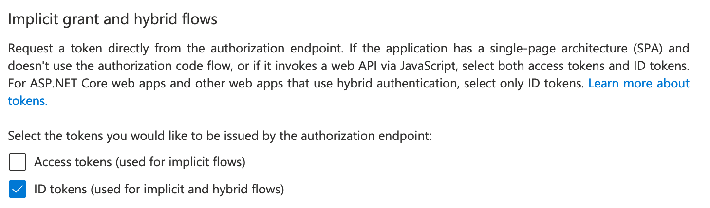

# Secure Research Environment Build Instructions (Guacamole remote desktop)

> :warning: If you are deploying a Tier 2 or Tier 3 environment, you should deploy with an [RDS remote desktop](./how-to-deploy-sre-microsoft-rds.md) instead.
> This Guacamole remote desktop interface has not yet been validated to provide the security assurances required for Tier 2 or above environments, but is suitable for Tier 0 or 1 environments or development and testing purposes.
> For Tier 0 and 1 environments where a collaborative notebook based user interface is more appropriate, we would recommend deploying with [CoCalc](./how-to-deploy-sre-cocalc.md).

These instructions will walk you through deploying a Secure Research Environment (SRE) that uses an existing Safe Haven Management (SHM) environment.

## Contents

+ [:seedling: 1. Prerequisites](#seedling-1-prerequisites)
+ [:clipboard: 2. Secure Research Environment configuration](#clipboard-2-secure-research-environment-configuration)
+ [:computer: 3. Deploy SRE](#computer-3-deploy-sre)
+ [:microscope: 4. Test deployed SRE](#microscope-4-test-deployed-sre)
  + [:avocado: 4.1 Test Apache Guacamole remote desktop](#pear-41-test-apache-guacamole-remote-desktop)
  + [:fire: 4.2 Run smoke tests on DSVM](#fire-42-run-smoke-tests-on-dsvm)

## Explanation of symbols used in this guide


+ This indicates a `Powershell` command which you will need to run locally on your machine
+ Ensure you have checked out the appropriate version of the Safe Haven repository from [https://github.com/alan-turing-institute/data-safe-haven](https://github.com/alan-turing-institute/data-safe-haven).
+ Open a `Powershell` terminal and navigate to the indicated directory of your locally checked-out version of the Safe Haven repository
+ Ensure that you are logged into Azure by running the `Connect-AzAccount` command
  + :pencil: If your account is a guest in additional Azure tenants, you may need to add the `-Tenant <Tenant ID>` flag, where `<Tenant ID>` is the ID of the Azure tenant you want to deploy into.
+ This command will give you a URL and a short alphanumeric code.
  + You will need to visit that URL in a web browser, enter the code and log in to your account on Azure
  + :pencil: If you have several Azure accounts, make sure you use one that has permissions to make changes to the subscription you are using


+ This indicates a command which you will need to run remotely on an Azure virtual machine (VM) using `Microsoft Remote Desktop`
+ Open `Microsoft Remote Desktop` and click `Add Desktop` / `Add PC`
+ Enter the private IP address of the VM that you need to connect to in the `PC name` field (this can be found by looking in the Azure portal)
+ Enter the name of the VM (for example `DC1-SHM-TESTA`) in the `Friendly name` field
+ Click `Add`
+ Ensure you are connected to the SHM VPN that you have set up
+ Double click on the desktop that appears under `Saved Desktops` or `PCs`.
+ Use the `username` and `password` specified by the appropriate section of the guide
+ :pencil: If you see a warning dialog that the certificate cannot be verified as root, accept this and continue.


+ This indicates an operation which needs to be carried out in the [`Azure Portal`](https://portal.azure.com) using a web browser on your local machine.
+ You will need to login to the portal using an account with privileges to make the necessary changes to the resources you are altering


+ This indicates an operation which needs to be carried out in the [`Azure Portal`](https://portal.azure.com) using a web browser on your local machine.
+ You will need to login to the portal using an account with administrative privileges on the `Azure Active Directory` that you are altering.
+ Note that this might be different from the account which is able to create/alter resources in the Azure subscription where you are building the Safe Haven.

:pencil: **Notes**

+ This indicates some explanatory notes or examples that provide additional context for the current step.

:warning: **Troubleshooting**

+ This indicates a set of troubleshooting instructions to help diagnose and fix common problems with the current step.


+ These indicate steps that depend on the OS that you are using to deploy the SRE

## :seedling: 1. Prerequisites

+ An `SHM environment` that has already been deployed in Azure
  + Follow the [Safe Haven Management (SHM) deployment guide](how-to-deploy-shm.md) if you have not done so already.
+ All [prerequisites needed for deploying the SHM](how-to-deploy-shm.md#prerequisites)
+ An [Azure subscription](https://portal.azure.com) with sufficient credits to build the environment in.
  + This can be the same or different from the one where the SHM is deployed
  + Ensure that the **Owner** of the subscription is an Azure Security group that all administrators can be added to.
  + :maple_leaf: We recommend around $1,000 as a reasonable starting point.
  + :maple_leaf: We recommend using separate Azure Active Directories for users and administrators
+ Access to a global administrator account on the SHM Azure Active Directory

### SRE domain name

You will need access to a public routable domain name for the SRE and its name servers. This can be a subdomain of the Safe Haven Management domain, e.g, `sandbox.testb.dsgroupdev.co.uk` , or a top-level domain (eg. `dsgroup100.co.uk` ).

### Deploying multiple SREs in parallel

:exclamation: Note that you can only deploy to **one SRE at a time** from a given computer as the `Az` Powershell module can only work within one Azure subscription at a time.

If you need to deploy multiple SREs in parallel you will need to use multiple computers. These can be different physical computers or you can provision dedicated deployment VMs - this is beyond the scope of this guide.

## :clipboard: 2. Secure Research Environment configuration

The full configuration details for a new SRE are generated by defining a few "core" properties for the new SRE and the management environment in which it will be deployed.

### Secure research environment ID

Choose a short ID `<SRE ID>` to identify the secure research environment (e.g. `sandbox`). This can have a **maximum of seven alphanumeric characters**.

The core properties for the relevant pre-existing Safe Haven Management (SHM) environment must be defined in a JSON file named `shm_<SHM ID>_core_config.json` in the `environment_configs/core` folder.
The core properties for the secure research environment (SRE) must be defined in a JSON file named `sre_<SHM ID><SRE ID>_core_config.json` in the `environment_configs/core` folder.

The following core SRE properties are required - look at `sre_testasandbox_core_config.json` to see an example.

``` json
{
    "sreId": "The <SRE ID> that you decided on above (eg. 'sandbox').",
    "tier": "The data classification tier for the SRE. This controls the outbound network restrictions on the SRE and which mirror set the SRE is peered with",
    "nexus": "[Optional, Bool] Whether to use a Nexus repository as a proxy to PyPI and CRAN. Defaults to true if tier is 2 and false otherwise.",
    "shmId": "The <SHM ID> that you decided on above (eg. 'testa').",
    "subscriptionName": "Azure subscription that the SRE will be deployed into.",
    "ipPrefix": "The three octet IP address prefix for the Class A range used by the management environment. See below for suggestion on how to set this",
    "inboundAccessFrom": "A comma-separated string of IP ranges (addresses or CIDR ranges) from which access to the RDS webclient is permitted. See below for suggestion on how to set this.",
    "outboundInternetAccess": "Whether to allow outbound internet access from inside the remote desktop environment. Either ('Yes', 'Allow', 'Permit'), ('No', 'Deny', 'Forbid') or 'default' (for Tier 0 and 1 'Allow' otherwise 'Deny')",
    "computeVmImage": {
        "type": "The name of the Compute VM image (most commonly 'Ubuntu')",
        "version": "The version of the Compute VM image (e.g. 0.1.2019082900)",
    },
    "remoteDesktopProvider": "Which remote desktop provider to use. Either 'ApacheGuacamole' (recommended) or 'MicrosoftRDS' (tier 2/3 only)",
    "dataAdminIpAddresses": "[Optional] A list of one or more IP addresses which admins will be using to transfer sensitive data to/from the secure Azure storage area (if not specified then Turing IP addresses will be used).",
    "deploymentIpAddresses": "[Optional] A list of one or more IP addresses which admins will be using when deploying the SRE (if not specified then deployment commands from any IP address will be permitted).",
    "azureAdminGroupName" : "[Optional] Azure Security Group that admins of this SRE will belong to. If not specified then the same one as the SHM will be used.",
    "domain": "[Optional] The fully qualified domain name for the SRE. If not specified then <SRE ID>.<SHM domain> will be used.",
    "databases": "[Optional] A list of one or more database flavours from the following list ('MSSQL', 'PostgreSQL'). For example ['MSSQL', 'PostgreSQL'] would deploy both an MS-SQL and a PostgreSQL database.",
    "overrides": "[Optional, Advanced] Do not use this unless you know what you're doing! If you want to override any of the default settings, you can do so by creating the same JSON structure that would be found in the final config file and nesting it under this entry. For example, to change the name of the Key Vault secret containing the MSSQL admin password, you could use something like: 'sre: { databases: { dbmssql: { adminPasswordSecretName: my-password-name } } }'"
}
```

#### :pencil: Notes

+ When deciding on what to set the `inboundAccessFrom` field to, we recommend the following settings:
  + Tier 0/1 SREs: this can be set to `Internet`, allowing access from anywhere.
  + Tier 2 SREs: this should correspond to the **organisational networks** (including guest networks) for all approved partner organisations (i.e. any network managed by the organsiation, such as `EduRoam`, `Turing Guest`, `Turing Secure` etc)
  + Tier 3 SREs: this should correspond to the **restricted networks** for all approved partner organisations. These should only permit connections from within medium security access controlled physical spaces and from managed devices (e.g. `Turing Secure`).
+ Setting `inboundAccessFrom` to 'default' will use the default Turing network ranges.
+ The `ipPrefix` must be unique for each SRE attached to the same SHM.
+ Each SRE should use a `/21` subspace of the `10.0.0.0/24` private class A range, starting from `10.21.0.0` to cleanly avoid the space already occupied by the SHM `10.0.1.0 - 10.0.7.255` and the mirrors (`10.20.2.0-10.20.3.255`).
  + It is very important that address spaces do not overlap in the environment as this will cause network faults. This means that prefixes must differ by at least 8 in their third octet.
  + This provides ample addresses for a SRE and capacity to add additional subnets should that be required in the future.

### (Optional) Verify code version

If you have cloned/forked the code from our GitHub repository, you can confirm which version of the data safe haven you are currently using by running the following commands:


```powershell
PS> git fetch; git pull; git status; git log -1 --pretty="At commit %h (%H)"
```

This will verify that you are on the correct branch and up to date with `origin`. You can include this confirmation in any record you keep of your deployment.

### (Optional) View full SRE configuration

A full configuration, which will be used in subsequent steps, will be automatically generated from your core configuration. Should you wish to, you can print the full SRE config by running the following Powershell command:

 at :file_folder: `./deployment`

```powershell
PS> ./ShowConfigFile.ps1 -shmId <SHM ID> -sreId <SRE ID>
```

+ where `<SHM ID>` is the [management environment ID](how-to-deploy-shm.md#management-environment-id) for this SRE
+ where `<SRE ID>` is the [secure research environment ID](#secure-research-environment-id) for this SRE

## :computer: 3. Deploy SRE

 at :file_folder: `./deployment/secure_research_environment/setup`

```powershell
PS> ./Deploy_SRE.ps1 -shmId <SHM ID> -sreId <SRE ID> -tenantId <AAD tenant ID> -VMs <VM sizes>
```

+ where `<SHM ID>` is the [management environment ID](how-to-deploy-shm.md#management-environment-id) for this SRE
+ where `<SRE ID>` is the [secure research environment ID](#secure-research-environment-id) for this SRE
+ where `<AAD tenant ID>` is the `Tenant ID` for the AzureAD that you [created during SHM deployment](how-to-deploy-shm.md#get-the-azure-active-directory-tenant-id )
+ where `<VM sizes>` is a list of [Azure VM sizes](https://docs.microsoft.com/en-us/azure/virtual-machines/sizes) that you want to create (for example `'Standard_D2s_v3', 'default', 'Standard_NC6s_v3'`)

This will perform the following actions, which can be run individually if desired:

<details>
<summary><strong>Remove data from previous deployments</strong></summary>

 at :file_folder: `./deployment/secure_research_environment/setup`

```powershell
PS> ./Remove_SRE_Data_From_SHM.ps1 -shmId <SHM ID> -sreId <SRE ID>
```

+ where `<SHM ID>` is the [management environment ID](how-to-deploy-shm.md#management-environment-id) for this SRE
+ where `<SRE ID>` is the [secure research environment ID](#secure-research-environment-id) for this SRE

If you are redeploying an SRE in the same subscription and did not use the `./SRE_Teardown.ps1` script to clean up the previous deployment, then there may be residual SRE data in the SHM. This script will remove any such data.

</details>

<details>
<summary><strong>Register SRE with the SHM</strong></summary>

 at :file_folder: `./deployment/secure_research_environment/setup`

```powershell
PS> ./Setup_SRE_Key_Vault_And_Users.ps1 -shmId <SHM ID> -sreId <SRE ID>
```

+ where `<SHM ID>` is the [management environment ID](how-to-deploy-shm.md#management-environment-id) for this SRE
+ where `<SRE ID>` is the [secure research environment ID](#secure-research-environment-id) for this SRE

This step will register service accounts with the SHM and also create a Key Vault in the SRE subscription (at `Resource Groups > RG_SHM_<SHM ID>_SRE_<SRE ID>_SECRETS > kv-<SHM ID>-sre-<SRE ID>`).

</details>

<details>
<summary><strong>Create SRE DNS Zone</strong></summary>

 at :file_folder: `./deployment/secure_research_environment/setup`

```powershell
PS> ./Setup_SRE_DNS_Zone.ps1 -shmId <SHM ID> -sreId <SRE ID>
```

+ where `<SHM ID>` is the [management environment ID](how-to-deploy-shm.md#management-environment-id) for this SRE
+ where `<SRE ID>` is the [secure research environment ID](#secure-research-environment-id) for this SRE

### :warning: Troubleshooting

If you see a message `You need to add the following NS records to the parent DNS system for...` you will need to manually add the specified NS records to the parent's DNS system, as follows:


+ To find the required values for the NS records on the portal, click `All resources` in the far left panel, search for "DNS Zone" and locate the DNS Zone with SRE's domain. The NS record will list 4 Azure name servers.
  
+ Duplicate these records to the parent DNS system as follows:
  + If the parent domain has an Azure DNS Zone, create an NS record set in this zone.
    + The name should be set to the subdomain (e.g. `sandbox` ) or `@` if using a custom domain, and the values duplicated from above.
    + For example, for a new subdomain `sandbox.testa.dsgroupdev.co.uk` , duplicate the NS records from the Azure DNS Zone `sandbox.testa.dsgroupdev.co.uk` to the Azure DNS Zone for `testa.dsgroupdev.co.uk` , by creating a record set with name `sandbox` .
  + If the parent domain is outside of Azure, create NS records in the registrar for the new domain with the same value as the NS records in the new Azure DNS Zone for the domain.

</details>

<details>
<summary><strong>Deploy the virtual network</strong></summary>

 at :file_folder: `./deployment/secure_research_environment/setup`

```powershell
PS> ./deployment/secure_research_environment/setup/Setup_SRE_Networking.ps1 -shmId <SHM ID> -sreId <SRE ID>
```

+ where `<SHM ID>` is the [management environment ID](how-to-deploy-shm.md#management-environment-id) for this SRE
+ where `<SRE ID>` is the [secure research environment ID](#secure-research-environment-id) for this SRE

### :pencil: Notes

The VNet peerings may take a few minutes to provision after the script completes.

</details>

<details>
<summary><strong>Deploy storage accounts</strong></summary>

 at :file_folder: `./deployment/secure_research_environment/setup`

```powershell
PS> ./Setup_SRE_Storage_Accounts.ps1 -shmId <SHM ID> -sreId <SRE ID>
```

+ where `<SHM ID>` is the [management environment ID](how-to-deploy-shm.md#management-environment-id) for this SRE
+ where `<SRE ID>` is the [secure research environment ID](#secure-research-environment-id) for this SRE

This script will create a storage account in the `RG_SHM_<shmId>_DATA_PERSISTENT` resource group, a corresponding private end point in `RG_SRE_NETWORKING` and will configure the DNS zone of the storage account to the right IP address.

</details>

<details>
<summary><strong>Deploy Apache Guacamole remote desktop</strong></summary>

 at :file_folder: `./deployment/secure_research_environment/setup`

```powershell
PS> ./Setup_SRE_Guacamole_Servers.ps1 -shmId <SHM ID> -sreId <SRE ID> -tenantId <tenant ID>
```

+ where `<SHM ID>` is the [management environment ID](how-to-deploy-shm.md#management-environment-id) for this SRE
+ where `<SRE ID>` is the [secure research environment ID](#secure-research-environment-id) for this SRE
+ where `<AAD tenant ID>` is the `Tenant ID` for the AzureAD that you [created during SHM deployment](how-to-deploy-shm.md#get-the-azure-active-directory-tenant-id )

</details>

<details>
<summary><strong>Deploy web applications (GitLab and CodiMD)</strong></summary>

 at :file_folder: `./deployment/secure_research_environment/setup`

```powershell
PS> ./Setup_SRE_WebApp_Servers.ps1 -shmId <SHM ID> -sreId <SRE ID>
```

+ where `<SHM ID>` is the [management environment ID](how-to-deploy-shm.md#management-environment-id) for this SRE
+ where `<SRE ID>` is the [secure research environment ID](#secure-research-environment-id) for this SRE

</details>

<details>
<summary><strong>Deploy databases</strong></summary>

 at :file_folder: `./deployment/secure_research_environment/setup`

```powershell
PS> ./Setup_SRE_Databases.ps1 -shmId <SHM ID> -sreId <SRE ID>
```

+ where `<SHM ID>` is the [management environment ID](how-to-deploy-shm.md#management-environment-id) for this SRE
+ where `<SRE ID>` is the [secure research environment ID](#secure-research-environment-id) for this SRE

This will deploy any databases that you specified in the core config file. The time taken will depend on which (if any) databases you chose.

+ The deployment of an `MS-SQL` database will take **around 60 minutes** to complete.
+ The deployment of a `PostgreSQL` database will take **around 10 minutes** to complete.

</details>

<details>
<summary><strong>Deploy data science VMs</strong></summary>

The following script will be run once for each VM that you specified using the `-VmSizes` parameter to the `Deploy_SRE.ps1` script

 at :file_folder: `./deployment/secure_research_environment/setup`

```powershell
PS> ./Add_DSVM.ps1 -shmId <SHM ID> -sreId <SRE ID> -vmSize <VM size> -ipLastOctet <IP last octet>
```

+ where `<SHM ID>` is the [management environment ID](how-to-deploy-shm.md#management-environment-id) for this SRE
+ where `<SRE ID>` is the [secure research environment ID](#secure-research-environment-id) for this SRE
+ where `<VM size>` is the VM size provided in the `-VmSizes` parameter to the `Deploy_SRE.ps1` script
+ where `<IP last octet>` is the last octet of the IP address (automatically determined by `Deploy_SRE.ps1`)

This will deploy a new compute VM into the SRE environment

### :pencil: Notes

 our convention is that:

  + CPU-based VMs are deployed with the next unused last octet in the range `160` to `179`
  + GPU-based VMs are deployed with the next unused last octet in the range `180` and `199`

If this SRE needs additional software or settings that are not in your default VM image, you can create a custom cloud init file on your **deployment machine**.

+ By default, compute VM deployments will use the `cloud-init-compute-vm.template.yaml` configuration file in the `deployment/secure_research_environment/cloud_init/` folder. This does all the necessary steps to configure the VM to work with LDAP.
+ If you require additional steps to be taken at deploy time while the VM still has access to the internet (e.g. to install some additional project-specific software), copy the default cloud init file to a file named `cloud-init-compute-vm-shm-<SHM ID>-sre-<SRE ID>.template.yaml` in the same folder and add any additional required steps in the `SRE-SPECIFIC COMMANDS` block marked with comments.

</details>

<details>
<summary><strong>Configure network lockdown</strong></summary>

 at :file_folder: `./deployment/secure_research_environment/setup`

```powershell
PS> ./Apply_SRE_Network_Configuration.ps1 -shmId <SHM ID> -sreId <SRE ID>
```

+ where `<SHM ID>` is the [management environment ID](how-to-deploy-shm.md#management-environment-id) for this SRE
+ where `<SRE ID>` is the [secure research environment ID](#secure-research-environment-id) for this SRE

This will apply the locked-down network settings which will restrict access into/out of this SRE.

</details>

<details>
<summary><strong>Configure firewall</strong></summary>

<!-- NB. this could be moved earlier in the deployment process once this has been tested, but the first attempt will just focus on locking down an already-deployed environment -->

 at :file_folder: `./deployment/secure_research_environment/setup`

```powershell
PS> ./Setup_SRE_Firewall.ps1 -shmId <SHM ID> -sreId <SRE ID>
```

+ where `<SHM ID>` is the [management environment ID](how-to-deploy-shm.md#management-environment-id) for this SRE
+ where `<SRE ID>` is the [secure research environment ID](#secure-research-environment-id) for this SRE

</details>

<details>
<summary><strong>Configure logging</strong></summary>

 at :file_folder: `./deployment/secure_research_environment/setup`

```powershell
PS> ./Setup_SRE_Logging.ps1 -shmId <SHM ID> -sreId <SRE ID>
```

+ where `<SHM ID>` is the [management environment ID](how-to-deploy-shm.md#management-environment-id) for this SRE
+ where `<SRE ID>` is the [secure research environment ID](#secure-research-environment-id) for this SRE

### :warning: Troubleshooting

The API call that installs the logging extensions to the VMs will time out after a few minutes, so you may get some extension installation failure messages if installation of the loggin agent takes longer than this to complete.
When this happens, you will see a failure message reporting that installation of the extension was not successful for the VM(s) for which the API timed out.
You may also get this message for other failures in installation.

In any case, re-running `./Setup_SRE_Logging.ps1 -shmId $shmId -sreId $sreId` will attempt to install the extensions again, skipping any VMs that already have the extensions installed.
Where the issue was an API timeout, these VMs will report that the extension is already installed when the logging set up script is run again.

Where there was a genuine failure in the installation of a VM extension, the script will try again to install the extension when the logging set up script is run again.
If you get consistent failure messages after re-running the logging set up script a few times, then further investigation will be required.

</details>

## :microscope: 4. Test deployed SRE

## :avocado: 4.1 Test Apache Guacamole remote desktop

### Optional: Set up a non-privileged user account

These steps ensure that you have created a non-privileged user account that you can use for testing.
You must ensure that you have assigned a licence to this user in the Azure Active Directory so that MFA will work correctly.

You should have already set up a non-privileged user account upon setting up the SHM, when [validating the active directory synchronisation](./how-to-deploy-shm.md#validate-active-directory-synchronisation), but you may wish to set up another or verify that you have set one up already:

<details>
<summary><strong>Set up a non-privileged user account</strong></summary>


+ Log into the **SHM primary domain controller** (`DC1-SHM-<SHM ID>`) VM using the connection details that you previously used to [log into this VM](how-to-deploy-shm.md#configure-the-first-domain-controller-via-remote-desktop)
+ Follow the [user creation instructions](./how-to-deploy-shm.md#validate-active-directory-synchronisation) from the [SHM deployment guide](./how-to-deploy-shm.md) (everything under the Validate Active Directory synchronisation header). In brief these involve:
  + adding your details (ie. your first name, last name, phone number etc.) to a user details CSV file.
  + running `C:\Installation\CreateUsers.ps1 <path_to_user_details_file>` in a Powershell command window with elevated privileges.
+ This will create a user in the local Active Directory on the SHM domain controller and start the process of synchronisation to the Azure Active Directory, which will take around 5 minutes.

</details>

#### Ensure that your non-privileged user account is in the correct Security Group


+ Log into the **SHM primary domain controller** (`DC1-SHM-<SHM ID>`) VM using the connection details that you previously used to [log into this VM](how-to-deploy-shm.md#configure-the-first-domain-controller-via-remote-desktop)
+ In Server Manager click `Tools > Active Directory Users and Computers`
+ In `Active Directory Users and Computers`, expand the domain in the left hand panel click `Safe Haven Security Groups`
+ Right click the `SG <SRE ID> Research Users` security group and select `Properties`
+ Click on the `Members` tab.
+ If your user is not already listed here you must add them to the group
  + Click the `Add` button
  + Enter the start of your username and click `Check names`
  + Select your username and click `Ok`
  + Click `Ok` again to exit the `Add users` dialogue
+ Synchronise with Azure Active Directory by running following `Powershell` command on the SHM primary domain controller

```powershell
PS> C:\Installation\Run_ADSync.ps1
```

#### Ensure that your user account has MFA enabled

Please ensure that your account is fully set-up (including MFA as [detailed in the user guide](../../how_to_guides/user_guides/user-guide.md#door-set-up-multi-factor-authentication)).
In order to verify this switch to your custom Azure Active Directory in the Azure portal and make the following checks:

<details>
<summary><strong>Verify non-privileged user account is set up</strong></summary>


+ From the Azure portal, navigate to the AAD you have created.
+ The `Usage Location` must be set in Azure Active Directory (should be automatically synchronised from the local Active Directory if it was correctly set there)
  + Navigate to `Azure Active Directory > Manage / Users > (user account)`, and ensure that `Settings > Usage Location` is set.
+ A licence must be assigned to the user.
  + Navigate to `Azure Active Directory > Manage / Users > (user account) > Licenses` and verify that a license is assigned and the appropriate MFA service enabled.
+ MFA must be enabled for the user.
  + The user must log into `aka.ms/mfasetup` and set up MFA as [detailed in the user guide](../../how_to_guides/user_guides/user-guide.md#door-set-up-multi-factor-authentication).

</details>

### Test the remote desktop using a non-privileged user account

+ Launch a local web browser on your **deployment machine**  and go to `https://<SRE ID>.<safe haven domain>` and log in with the user name and password you set up for the non-privileged user account.
 + for example for `<safe haven domain> = testa.dsgroupdev.co.uk` and `<SRE ID> = sandbox` this would be `https://sandbox.testa.dsgroupdev.co.uk/`
+ You should see a screen like the following. If you do not, follow the **troubleshooting** instructions below.
  
+ At this point you should double click on the :computer: `Ubuntu0` link under `All Connections` which should bring you to an Ubuntu login screen
+ You will need the short-form of the user name (ie. without the `@<safe haven domain>` part) and the same password as before
+ This should bring you to an Ubuntu desktop that will look like the following
  

#### :pencil: Notes

+ Ensure that you are connecting from one of the **permitted IP ranges** specified in the `inboundAccessFrom` section of the SRE config file. For example, if you have authorised a corporate VPN, check that you have correctly configured you client to connect to it.
+ Note that clicking on the apps will not work until the other servers have been deployed.

#### :warning: Troubleshooting

If you see an error like the following when attempting to log in, it is likely that the AzureAD application is not registered as an `ID token` provider. Please follow the instructions below to check:


+ From the Azure portal, navigate to the AAD you have created.
+ Navigate to `Azure Active Directory > App registrations`, and select the application called `Guacamole SRE <SRE ID>`.
+ Click on `Authentication` on the left-hand sidebar
+ Ensure that the `ID tokens` checkbox is ticked and click on the `Save` icon if you had to make any changes
  <details><summary><b>Screenshots</b></summary>
    
  </details>

### :fire: 4.2 Run smoke tests on DSVM

These tests should be run **after** the network lock down and peering the SRE and package mirror VNets.
They are automatically uploaded to the compute VM during the deployment step.


+ Use the remote desktop interface at `https://<SRE ID>.<safe haven domain>` to log in to the **DSVM** (`SRE-<SRE ID>-<IP last octet>-<version number>`) that you have deployed using the scripts above
+ Open a terminal session
+ Enter the test directory using `cd /opt/tests`
+ Run `bats run_all_tests.bats` .
+ If all test results are expected you are done! Otherwise check the `README.md` in this folder for help diagnosing test failures.
