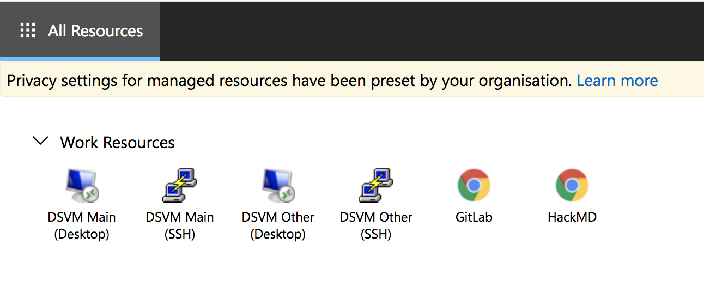

# Secure Research Environment Build Instructions

These instructions will walk you through deploying a Secure Research Environment (SRE) that uses an existing Safe Haven Management (SHM) environment.

> :warning: If you are deploying a Tier 1 environment, follow [these instructions](./how-to-deploy-sre-tier1.md) instead.

## Contents

+ [:seedling: Prerequisites](#seedling-prerequisites)
  + [:beginner: Software](#beginner-software)
  + [:key: VPN connection to the SHM VNet](#key-vpn-connection-to-the-shm-vnet)
  + [:name_badge: SRE domain name](#name_badge-sre-domain-name)
  + [:arrow_double_up: Deploying multiple SREs in parallel](#arrow_double_up-deploying-multiple-sres-in-parallel)
+ [:clipboard: Define SRE configuration](#clipboard-define-sre-configuration)
  + [:apple: SHM configuration properties](#apple-shm-configuration-properties)
  + [:green_apple: SRE configuration properties](#green_apple-sre-configuration-properties)
  + [:full_moon: View full SRE configuration](#full_moon-optional-view-full-sre-configuration)
+ [:cop: Prepare SHM environment](#cop-prepare-shm-environment)
  + [:fast_forward: Optional: Remove data from previous deployments](#fast_forward-optional-remove-data-from-previous-deployments)
  + [:registered: Register SRE with the SHM](#registered-register-sre-with-the-shm)
+ [:station: Deploy networking components](#station-deploy-networking-components)
  + [:clubs: Create SRE DNS Zone](#clubs-create-sre-dns-zone)
  + [:ghost: Deploy the virtual network](#ghost-deploy-the-virtual-network)
+ [:fishing_pole_and_fish: Deploy remote desktop](#fishing_pole_and_fish-deploy-remote-desktop)
  + [:tropical_fish: Deploy the remote desktop servers](#tropical_fish-deploy-remote-desktop-servers)
  + [:satellite: Configure RDS webclient](#satellite-configure-rds-webclient)
  + [:closed_lock_with_key: Secure RDS webclient](#closed_lock_with_key-secure-rds-webclient)
  + [:bicyclist: Set up a non-privileged user account](#bicyclist-optional-set-up-a-non-privileged-user-account)
  + [:microscope: Test the RDS using a non-privileged user account](#mountain_bicyclist-test-the-rds-using-a-non-privileged-user-account)
+ [:floppy_disk: Deploy storage accounts](#floppy_disk-deploy-storage-accounts)
+ [:baseball: Deploy databases](#baseball-deploy-databases)
+ [:snowflake: Deploy web applications (GitLab and CodiMD)](#snowflake-deploy-web-applications-gitlab-and-CodiMD)
  + [:microscope: Test GitLab Server](#microscope-test-gitlab-server)
  + [:microscope: Test CodiMD Server](#microscope-test-codimd-server)
+ [:computer: Deploy data science VMs](#computer-deploy-data-science-vms)
  + [:fast_forward: Optional: Customise the deployed VM](#fast_forward-optional-customise-the-deployed-vm)
  + [:computer: Deploy a single data science VM (DSVM)](#computer-deploy-a-single-data-science-vm-dsvm)
  + [:microscope: Test DSVM deployment](#microscope-test-dsvm-deployment)
+ [:lock: Apply network configuration](#lock-apply-network-configuration)
+ [:fire_engine: Deploy firewall](#fire_engine-deploy-firewall)
+ [:chart_with_upwards_trend: Configure logging](#chart_with_upwards_trend-configure-logging)
+ [:fire: Run smoke tests on DSVM](#fire-run-smoke-tests-on-dsvm)
+ [:bomb: Tearing down the SRE](#bomb-tearing-down-the-sre)

## :seedling: Prerequisites

+ An SHM environment that has already been deployed in Azure - follow the [Safe Haven Management (SHM) deployment guide](how-to-deploy-shm.md) if you have not done so already.
+ An Azure subscription with sufficient credits to build the SRE.
  + :notebook: Our convention is to name these `Turing SRE - <SRE ID> (SHM <SHM ID>)`
  + :information_source: We recommend allowing at least **$1,000** in Azure credits for setting up each SRE
+ **Owner** access to the SRE and SHM Azure subscriptions
  + :information_source: We recommend using security groups to control access (eg. our subscriptions belong to `Safe Haven Test Admins` or `Safe Haven Production Admins` )
+ Access to a global administrator account on the SHM Azure Active Directory

### :beginner: Software

+ `PowerShell` with support for Azure
  + Install [PowerShell v7.0 or above](<https://docs.microsoft.com/en-us/powershell/scripting/install/installing-powershell>)
  + Install the [Azure PowerShell Module](<https://docs.microsoft.com/en-us/powershell/azure/install-az-ps>) using `Install-Module -Name Az -RequiredVersion 5.0.0 -Repository PSGallery`
+ `Microsoft Remote Desktop`
  + On macOS this can be installed from the [Apple store](https://apps.apple.com)
+ `OpenSSL`
  + Install using your package manager of choice

### :key: VPN connection to the SHM VNet

For some operations, you will need to log on to some of the VMs that you deploy and make manual changes. This is done using the VPN which should have been deployed [when setting up the SHM environment](how-to-deploy-shm.md#download-a-client-vpn-certificate-for-the-safe-haven-management-network).

### :name_badge: SRE domain name

You will need access to a public routable domain name for the SRE and its name servers. This can be a subdomain of the Safe Haven Management domain, e.g, `sandbox.testb.dsgroupdev.co.uk` , or a top-level domain (eg. `dsgroup100.co.uk` ).

### :arrow_double_up: Deploying multiple SREs in parallel

> :warning: You can only deploy to **one SRE at a time** from a given computer as the `Az` Powershell module can only work within one Azure subscription at a time.

If you need to deploy multiple SREs in parallel you will need to use multiple computers. One option here is to provision dedicated deployment VMs on Azure - we have had success in doing so when using both Ubuntu and Windows VMs.

## :clipboard: Define SRE configuration

The full configuration details for a new SRE are generated by defining a few "core" properties for the new SRE and the management environment in which it will be deployed.

### :apple: SHM configuration properties

The core properties for the relevant pre-existing Safe Haven Management (SHM) environment must be present in the `environment_configs` folder. The following core SHM properties must be defined in a JSON file named `shm_<SHM ID>_core_config.json`.

Please [read the instructions](how-to-deploy-shm.md#create-configuration-file) to find out what to put in this file.

### :green_apple: SRE configuration properties

The core properties for the new SRE environment must be present in the `environment_configs` folder.

> :pencil: You should decide on an `<SRE ID>` at this point. This should be 7 characters or fewer

The following core SRE properties must be defined in a JSON file named `sre_<SHM ID><SRE ID>_core_config.json`.

``` json
{
    "sreId": "The <SRE ID> that you decided on above (eg. 'sandbox').",
    "tier": "The data classification tier for the SRE. This controls the outbound network restrictions on the SRE and which mirror set the SRE is peered with",
    "nexus": "[Optional, Bool] Whether to use a Nexus repository as a proxy to PyPI and CRAN. Defaults to true if tier is 2 and false otherwise.",
    "shmId": "The <SHM ID> that you decided on above (eg. 'testa').",
    "subscriptionName": "Azure subscription that the SRE will be deployed into.",
    "ipPrefix": "The three octet IP address prefix for the Class A range used by the management environment. See below for suggestion on how to set this",
    "inboundAccessFrom": "A comma-separated string of IP ranges (addresses or CIDR ranges) from which access to the RDS webclient is permitted. See below for suggestion on how to set this.",
    "outboundInternetAccess": "Whether to allow outbound internet access from inside the remote desktop environment. Either ('Yes', 'Allow', 'Permit'), ('No', 'Deny', 'Forbid') or 'default' (for Tier 0 and 1 'Allow' otherwise 'Deny')",
    "computeVmImage": {
        "type": "The name of the Compute VM image (most commonly 'Ubuntu')",
        "version": "The version of the Compute VM image (e.g. 0.1.2019082900)",
    },
    "dataAdminIpAddresses": "[Optional] A list of one or more IP addresses which admins will be using to transfer sensitive data to/from the secure Azure storage area (if not specified then Turing IP addresses will be used).",
    "azureAdminGroupName" : "[Optional] Azure Security Group that admins of this SRE will belong to. If not specified then the same one as the SHM will be used.",
    "domain": "[Optional] The fully qualified domain name for the SRE. If not specified then <SRE ID>.<SHM domain> will be used.",
    "databases": "[Optional] A list of one or more database flavours from the following list ('MSSQL', 'PostgreSQL'). For example ['MSSQL', 'PostgreSQL'] would deploy both an MS-SQL and a PostgreSQL database.",
    "overrides": "[Optional, Advanced] Do not use this unless you know what you're doing! If you want to override any of the default settings, you can do so by creating the same JSON structure that would be found in the final config file and nesting it under this entry. For example, to change the name of the Key Vault secret containing the MSSQL admin password, you could use something like: 'sre: { databases: { dbmssql: { adminPasswordSecretName: my-password-name } } }'"
}
```

> :pencil: When deciding on what to set the `inboundAccessFrom` field to, we recommend the following settings:
> - Tier 0/1 SREs: this can be set to 'Internet', allowing access from anywhere.
> - Tier 2 SREs: this should correspond to the **organisational networks** (including guest networks) for all approved partner organisations (i.e. any network managed by the organsiation, such as `EduRoam`, `Turing Guest`, `Turing Secure` etc)
> - Tier 3 SREs: this should correspond to the **restricted networks** for all approved partner organisations. These should only permit connections from within medium security access controlled physical spaces and from managed devices (e.g. `Turing Secure`).
> Setting this to 'default' will use the default Turing network ranges.
>
> :warning: The `ipPrefix` must be unique for each SRE attached to the same SHM.
> Each SRE should use a `/21` subspace of the `10.0.0.0/24` private class A range, starting from `10.21.0.0` to cleanly avoid the space already occupied by the SHM `10.0.1.0 - 10.0.7.255` and the mirrors (`10.20.2.0-10.20.3.255`).
> It is very important that address spaces do not overlap in the environment as this will cause network faults. This means that prefixes must differ by at least 8 in their third octet.
> This provides ample addresses for a SRE and capacity to add additional subnets should that be required in the future.

### :full_moon: Optional: View full SRE configuration

A full configuration, which will be used in subsequent steps, will be automatically generated from your core configuration. Should you wish to, you can view a nested printout of the full SRE (or full SHM) config by doing the following:

On your **deployment machine**.

+ Ensure you have the latest version of the Safe Haven repository from [https://github.com/alan-turing-institute/data-safe-haven](https://github.com/alan-turing-institute/data-safe-haven).
+ Open a Powershell terminal and navigate to the top-level folder within the Safe Haven repository.
+ Show the full configuration for the new SRE or the SHM using the following commands.
  + `Import-Module ./deployment/common/Configuration -Force`
  + SRE: `Show-FullConfig -shmId <SHM ID> -sreId <SRE ID>`
  + SHM: `Show-FullConfig -shmId <SHM ID>`

## :cop: Prepare SHM environment

On your **deployment machine**.

+ Ensure you have the latest version of the Safe Haven repository from [https://github.com/alan-turing-institute/data-safe-haven](https://github.com/alan-turing-institute/data-safe-haven).
+ Open a Powershell terminal and navigate to the `deployment/secure_research_environment/setup` directory within the Safe Haven repository.
+ Ensure you are logged into Azure within PowerShell using the command: `Connect-AzAccount` . This command will give you a URL and a short alphanumeric code. You will need to visit that URL in a web browser and enter the code
  + NB. If your account belongs to multiple Azure tenants (for example, as a guest), you may need to add the `-Tenant <Tenant ID>` flag, where `<Tenant ID>` is the ID of the Azure tenant you want to deploy into.

### :fast_forward: Optional: Remove data from previous deployments

> :warning: If you are redeploying an SRE in the same subscription and did not use the `./SRE_Teardown.ps1` script to clean up the previous deployment, then there may be residual SRE data in the SHM.

On your **deployment machine**.

+ :pencil: If the subscription is not empty, confirm that it is not being used before deleting any resources in it.
+ Clear any remaining SRE data from the SHM by running `./Remove_SRE_Data_From_SHM.ps1 -shmId <SHM ID> -sreId <SRE ID>`.

### :registered: Register SRE with the SHM

On your **deployment machine**.

+ Register service accounts with the SHM by running `./Setup_SRE_Key_Vault_And_Users.ps1 -configId <SRE Config ID>` , where the `<SRE Config ID>` is `<SHM ID><SRE ID>` for the config you are using. For example, the config `sre_testcsandbox_full_config` will have `<SRE Config ID>` equal to `testcsandbox` .
+ This step also creates a Key Vault in the SRE subscription in `Resource Groups -> RG_SHM_<SHM ID>_SRE_<SRE ID>_SECRETS -> kv-<SHM ID>-sre-<SRE ID>` . Additional deployment steps will add secrets to this Key Vault and you will need to access some of these for some of the manual configuration steps later.

## :station: Deploy networking components

### :clubs: Create SRE DNS Zone

On your **deployment machine**.

+ Run `./Setup_SRE_DNS_Zone.ps1 -configId <SRE Config ID>` , where the `<SRE Config ID>` is `<SHM ID><SRE ID>` for the config you are using. For example, the config `sre_testcsandbox_full_config` will have `<SRE Config ID>` equal to `testcsandbox` .
+ If you see a message `You need to add the following NS records to the parent DNS system for...` you will need to manually add the specified NS records to the parent's DNS system, as follows:

  <details>
  <summary><b>Instructions for manually creating SRE DNS records</b></summary>

  + To find the required values for the NS records on the portal, click `All resources` in the far left panel, search for "DNS Zone" and locate the DNS Zone with SRE's domain. The NS record will list 4 Azure name servers.

    <p align="center">
      
    </p>

  + Duplicate these records to the parent DNS system as follows:
    + If the parent domain has an Azure DNS Zone, create an NS record set in this zone.
      + The name should be set to the subdomain (e.g. `sandbox` ) or `@` if using a custom domain, and the values duplicated from above.
      + For example, for a new subdomain `sandbox.testa.dsgroupdev.co.uk` , duplicate the NS records from the Azure DNS Zone `sandbox.testa.dsgroupdev.co.uk` to the Azure DNS Zone for `testa.dsgroupdev.co.uk` , by creating a record set with name `sandbox` .
    + If the parent domain is outside of Azure, create NS records in the registrar for the new domain with the same value as the NS records in the new Azure DNS Zone for the domain.

  </details>

### :ghost: Deploy the virtual network

On your **deployment machine**.

+ Ensure you have the latest version of the Safe Haven repository from [https://github.com/alan-turing-institute/data-safe-haven](https://github.com/alan-turing-institute/data-safe-haven).
+ Open a Powershell terminal and navigate to the `deployment/secure_research_environment/setup` directory within the Safe Haven repository.
+ Ensure you are logged into Azure within PowerShell using the command: `Connect-AzAccount` . This command will give you a URL and a short alphanumeric code. You will need to visit that URL in a web browser and enter the code
+ Run `./Setup_SRE_Networking.ps1 -configId <SRE Config ID>` , where the `<SRE Config ID>` is the  name specified in the config, equal to `<SHMID><SREID>` . For example, the config `sre_testcsandbox_full_config` will have `<SRE Config ID>` qual to `testcsandbox` .
+ The deployment will take **around 5 minutes**.
+ The VNet peerings may take a few minutes to provision after the script completes.

## :fishing_pole_and_fish: Deploy remote desktop

### :tropical_fish: Deploy the remote desktop servers

On your **deployment machine**.

+ Ensure you have the latest version of the Safe Haven repository from [https://github.com/alan-turing-institute/data-safe-haven](https://github.com/alan-turing-institute/data-safe-haven).
+ Open a Powershell terminal and navigate to the `deployment/secure_research_environment/setup` directory within the Safe Haven repository.
+ Ensure you are logged into Azure within PowerShell using the command: `Connect-AzAccount` . This command will give you a URL and a short alphanumeric code. You will need to visit that URL in a web browser and enter the code
+ Run `./Setup_SRE_Remote_Desktop.ps1 -configId <SRE Config ID>` , where the `<SRE Config ID>` is the  name specified in the config, equal to `<SHMID><SREID>` . For example, the config `sre_testcsandbox_full_config` will have `<SRE Config ID>` equal to `testcsandbox` .
+ The deployment will take **around 50 minutes**.
+ **Troubleshooting** If you encounter errors with the deployment of the remote desktop servers, re-running `Setup_SRE_Remote_Desktop.ps1` should fix them. If this does not work, please try deleting everything that has been deployed into the `RG_SHM_<SHM ID>_SRE_<SRE ID>_RDS` resource group for this SRE and [attempt to rerun this step again](#tropical_fish-deploy-remote-desktop-servers).

### :satellite: Configure RDS webclient

+ Connect to the **RDS Gateway** via Remote Desktop client over the SHM VPN connection
  + :warning: **Windows:** when deploying on Windows, the SHM VPN needs to be redownloaded/reconfigured each time an SRE is deployed. Otherwise, there may be difficulties connecting to the **RDS Gateway**. This is not true for macOS.
+ The private IP address can be found using the Azure portal by navigating to the Virtual Machine `RDG-SRE-<SRE ID>`
+ Set the PC name to be the IP address and the Friendly name to `RDG-SRE-<SRE ID>`
+ Login as the SHM **domain** admin user `<admin username>@<SHM domain>` (eg. `shmtestbadmin@testb.dsgroupdev.co.uk` ) using the username and password obtained from the Azure portal. They are in the `RG_SHM_<SHM ID>_SECRETS` resource group, in the `kv-shm-<SHM ID>` Key Vault, under `Secrets` . as follows:
  + The username is the `shm-<SHM ID>-domain-admin-username` secret plus `@<SHM DOMAIN>` where you add your custom SHM domain. For example `shmtestbadmin@testb.dsgroupdev.co.uk`
  + The password in the `shm-<SHM ID>-domain-admin-password` secret.

On the **SRE RDS Gateway**.

+ Open a PowerShell command window with elevated privileges - make sure to use the `Windows PowerShell` application, not the `Windows PowerShell (x86)` application. The required server management commandlets are not installed on the x86 version.
+ Run `C:\Installation\Deploy_RDS_Environment.ps1` (prefix the command with a leading `.\` if running from within the `C:\Installation` directory)
+ This script will take about 20 minutes to run (this cannot be done remotely, as it needs to be run as a domain user but remote Powershell uses a local user)

### :closed_lock_with_key: Secure RDS webclient

On your **deployment machine**.

+ Ensure you have the latest version of the Safe Haven repository from [https://github.com/alan-turing-institute/data-safe-haven](https://github.com/alan-turing-institute/data-safe-haven).
+ Open a Powershell terminal and navigate to the `deployment/secure_research_environment/setup` directory within the Safe Haven repository.
+ Ensure you are logged into Azure within PowerShell using the command: `Connect-AzAccount` . This command will give you a URL and a short alphanumeric code. You will need to visit that URL in a web browser and enter the code
+ Run `./Secure_SRE_Remote_Desktop_Gateway.ps1 -configId <SRE Config ID>` , where the `<SRE Config ID>` is the  name specified in the config, equal to `<SHMID><SREID>` . For example, the config `sre_testcsandbox_full_config` will have `<SRE Config ID>` equal to `testcsandbox` .
+ This will perform the following actions, which can be run individually if desired:

<details>
<summary><strong>Disable insecure TLS connections</strong></summary>

On your **deployment machine**.

+ Ensure you have the latest version of the Safe Haven repository from [https://github.com/alan-turing-institute/data-safe-haven](https://github.com/alan-turing-institute/data-safe-haven).
+ Open a Powershell terminal and navigate to the `deployment/secure_research_environment/setup` directory within the Safe Haven repository.
+ Ensure you are logged into Azure within PowerShell using the command: `Connect-AzAccount` . This command will give you a URL and a short alphanumeric code. You will need to visit that URL in a web browser and enter the code
+ Run `./Disable_Legacy_TLS.ps1 -configId <SRE Config ID>` , where the `<SRE Config ID>` is the  name specified in the config, equal to `<SHMID><SREID>` . For example, the config `sre_testcsandbox_full_config` will have `<SRE Config ID>` equal to `testcsandbox` .
+ The deployment will take **less than 5 minutes**.
  + NB. If additional TLS protocols become available (or existing ones are found to be insecure) during the lifetime of the SRE, then you can re-run this script to update the list of accepted protocols

</details>

<details>
<summary><strong>Configure RDS CAP and RAP settings</strong></summary>

On your **deployment machine**.

+ Ensure you have the latest version of the Safe Haven repository from [https://github.com/alan-turing-institute/data-safe-haven](https://github.com/alan-turing-institute/data-safe-haven).
+ Open a Powershell terminal and navigate to the `deployment/secure_research_environment/setup` directory within the Safe Haven repository.
+ Ensure you are logged into Azure within PowerShell using the command: `Connect-AzAccount` . This command will give you a URL and a short alphanumeric code. You will need to visit that URL in a web browser and enter the code
+ Run `./Configure_SRE_RDS_CAP_And_RAP.ps1 -configId <SRE Config ID>` , where the `<SRE Config ID>` is `<SHM ID><SRE ID>` for the config you are using. For example, the config `sre_testcsandbox_full_config` will have `<SRE Config ID>` equal to `testcsandbox` .

</details>

<details>
<summary><strong>Update SSL certificate</strong></summary>

On your **deployment machine**.

+ Ensure you have the latest version of the Safe Haven repository from [https://github.com/alan-turing-institute/data-safe-haven](https://github.com/alan-turing-institute/data-safe-haven).
+ Open a Powershell terminal and navigate to the `deployment/secure_research_environment/setup` directory within the Safe Haven repository.
+ Ensure you are logged into Azure within PowerShell using the command: `Connect-AzAccount` . This command will give you a URL and a short alphanumeric code. You will need to visit that URL in a web browser and enter the code
  + NB. If your account is a guest in additional Azure tenants, you may need to add the `-Tenant <Tenant ID>` flag, where `<Tenant ID>` is the ID of the Azure tenant you want to deploy into.
+ Run `./Update_SRE_RDS_SSL_Certificate.ps1 -configId <SRE Config ID> -emailAddress <email>` , where the `<SRE Config ID>` is `<SHM ID><SRE ID>` for the config file you are using and the email address is one that you would like to be notified when certificate expiry is approaching.
+ **NOTE:** This script should be run again whenever you want to update the certificate for this SRE.
+ **Troubleshooting:** Let's Encrypt will only issue **5 certificates per week** for a particular host (e.g. `rdg-sre-sandbox.testa.dsgroupdev.co.uk` ). For production environments this should usually not be an issue. The signed certificates are also stored in the Key Vault for easy redeployment. However, if you find yourself needing to re-run this step without the Key Vault secret available, either to debug an error experienced in production or when redeploying a test environment frequently during development, you should run `./Update_SRE_RDS_SSL_Certificate.ps1 -dryRun $true` to use the Let's Encrypt staging server, which will issue certificates more frequently. However, these certificates will not be trusted by your browser, so you will need to override the security warning in your browser to access the RDS web client for testing.

</details>

### :bicyclist: Optional: Set up a non-privileged user account

These steps ensure that you have created a non-privileged user account that you can use for testing.
You must ensure that you have assigned a licence to this user in the Azure Active Directory so that MFA will work correctly.

You should have already set up a non-privileged user account upon setting up the SHM, when [validating the active directory synchronisation](./how-to-deploy-shm.md#validate-active-directory-synchronisation), but you may wish to set up another or verify that you have set one up already:

<details>
<summary><strong>Set up a non-privileged user account</strong></summary>

Carry out the following on the **SHM Domain Controller (DC1)** via Microsoft Remote Desktop (you deployed this when setting up the SHM):

+ Double click on the desktop named `DC1-SHM-<SHM ID>`
+ Log in as a **domain** user (ie. `<admin username>@<SHM domain>` rather than simply `<admin username>`) using the username and password obtained from the Azure portal as follows:
  + On the Azure portal navigate to the `RG_SHM_<SHM ID>_SECRETS` resource group and then the `kv-shm-<SHM ID>` Key Vault and then select `secrets` on the left hand panel.
  + The username is the `shm-<SHM ID>-domain-admin-username` secret. Add your custom AD domain to the username so the login is `<admin username>@SHM domain>` rather than simply `<admin username>`.
  + The password is the `shm-<SHM ID>-domain-admin-password` secret.
+ If you see a warning dialog that the certificate cannot be verified as root, accept this and continue.

+ Follow the [user creation instructions](./how-to-deploy-shm.md#validate-active-directory-synchronisation) from the [SHM deployment guide](./how-to-deploy-shm.md) (everything under the Validate Active Directory synchronisation header). In brief these involve:
  + adding your details (ie. your first name, last name, phone number etc.) to a user details CSV file.
  + running `C:\Installation\CreateUsers.ps1 <path_to_user_details_file>` in a Powershell command window with elevated privileges.

This will create a user in the local Active Directory on the SHM domain controller and start the process of synchronisation to the Azure Active Directory, which will take around 5 minutes.

#### Ensure that your non-privileged user account is in the correct Security Group

+ In Server Manager click `Tools > Active Directory Users and Computers`
+ In `Active Directory Users and Computers`, expand the domain in the left hand panel click `Safe Haven Security Groups`
+ Right click the `SG <SRE ID> Research Users` security group and select `Properties`
+ Click on the `Members` tab.
+ If your user is not already listed here you must add them to the group
  + Click the `Add` button
  + Enter the start of your username and click `Check names`
  + Select your username and click `Ok`
  + Click `Ok` again to exit the `Add users` dialogue
+ Synchronise with Azure Active Directory by running `C:\Installation\Run_ADSync.ps1` in Powershell.

#### Ensure that your user account has MFA enabled

Please ensure that your account is fully set-up (including MFA as [detailed in the user guide](../../how_to_guides/user_guides/user-guide.md#door-set-up-multi-factor-authentication)).
In order to verify this switch to your custom Azure Active Directory in the Azure portal:

+ Go to `portal.azure.com` and click on your username in the top-right
+ Select `Switch directory` and then click on `All Directories`
+ Select your custom Azure Active Directory in the list of directories
+ This should cause the portal to reload

</details>

<details>
<summary><strong>Verify non-privileged user account is set up</strong></summary>

+ The `Usage Location` must be set in Azure Active Directory (should be automatically synchronised from the local Active Directory if it was correctly set there)
  + Navigate to `Azure Active Directory` -> `Manage / Users` -> (user account), and ensure that `Settings` -> `Usage Location` is set.
+ A licence must be assigned to the user.
  + Navigate to `Azure Active Directory` -> `Manage / Users` -> (user account) -> `Licenses` and verify that a license is assigned and the appropriate MFA service enabled.
+ MFA must be enabled for the user.
  + The user must log into `aka.ms/mfasetup` and set up MFA as [detailed in the user guide](../../how_to_guides/user_guides/user-guide.md#door-set-up-multi-factor-authentication).

</details>

### :microscope: Test the RDS using a non-privileged user account

On your **deployment machine**.

+ Ensure that you are connecting from one of the **permitted IP ranges** specified in the `inboundAccessFrom` section of the SRE config file. For example, if you have authorised a corporate VPN, check that you have correctly configured you client to connect to it.
+ Launch a local web browser and go to `https://<SRE ID>.<safe haven domain>` (eg. `https://sandbox.dsgroupdev.co.uk/`, where the first part  of the `<safe haven domain>` is the `<SHM ID>`) and log in with the user name and password you set up for the non-privileged user account.
+ You should see a screen like the following. If you do not, follow the **troubleshooting** instructions below.
+ **NOTE:** The apps will not work until the other servers have been deployed.

  <p align="center">
    
  </p>

<details>
<summary><strong>Troubleshooting</strong></summary>

If you get a `404 resource not found` error when accessing the webclient URL, it is likely that the RDS webclient failed to install correctly.

+ Go back to the previous section and rerun the `C:\Installation\Deploy_RDS_Environment.ps1` script on the RDS gateway.
+ After doing this, follow the instructions to [configure RDS CAP and RAP settings](#accept-configure-rds-cap-and-rap-settings) and to [update the SSL certificate](#closed_lock_with_key-update-ssl-certificate).

If you get an `unexpected server authentication certificate error` , your browser has probably cached a previous certificate for this domain.

+ Do a [hard reload](https://www.getfilecloud.com/blog/2015/03/tech-tip-how-to-do-hard-refresh-in-browsers/) of the page (permanent fix)
+ OR open a new private / incognito browser window and visit the page.

If you can see an empty screen with `Work resources` but no app icons, your user has not been correctly added to the security group.

+ Ensure that the user you have logged in with is a member of the `SG <SRE ID> Research Users` group on the domain controller

</details>

## :snowflake: Deploy web applications (GitLab and CodiMD)

On your **deployment machine**.

+ Ensure you have the latest version of the Safe Haven repository from [https://github.com/alan-turing-institute/data-safe-haven](https://github.com/alan-turing-institute/data-safe-haven).
+ Open a Powershell terminal and navigate to the `deployment/secure_research_environment/setup` directory within the Safe Haven repository.
+ Ensure you are logged into Azure within PowerShell using the command: `Connect-AzAccount` . This command will give you a URL and a short alphanumeric code. You will need to visit that URL in a web browser and enter the code
  + NB. If your account is a guest in additional Azure tenants, you may need to add the `-Tenant <Tenant ID>` flag, where `<Tenant ID>` is the ID of the Azure tenant you want to deploy into.
+ Run the `./Setup_SRE_WebApp_Servers.ps1 -configId <SRE Config ID>` , where the `<SRE Config ID>` is the  name specified in the config, equal to `<SHMID><SREID>` . For example, the config `sre_testcsandbox_full_config` will have `<SRE Config ID>` equal to `testcsandbox` .
+ The deployment will take **around 30 minutes**.

### :microscope: Test GitLab and CodiMD servers

On your **deployment machine**.

+ Launch a local web browser and go to `https://<SRE ID>.<safe haven domain>` (eg. `https://sandbox.dsgroupdev.co.uk/` ) and log in.
+ Test `GitLab` by clicking on the `GitLab` app icon.
  + You should receive an MFA request to your phone or authentication app.
  + Once you have approved the sign in, you should see a Chrome window with the GitLab login page.
  + Log in with the short-form `username` of a user in the `SG <SRE ID> Research Users` security group.
+ Test `CodiMD` by clicking on the `CodiMD` app icon.
  + You should receive an MFA request to your phone or authentication app.
  + Once you have approved the sign in, you should see a Chrome window with the GitLab login page.
  + Log in with the short-form `username` of a user in the `SG <SRE ID> Research Users` security group.
+ If you do not get an MFA prompt or you cannot connect to the `GitLab` and `CodiMD` servers, follow the **troubleshooting** instructions below.

<details>
<summary><strong>Troubleshooting</strong></summary>

  If you can log in to the initial webclient authentication but do not get the MFA request, then the issue is likely that the configuration of the connection between the SHM NPS server and the RDS Gateway server is not correct.

  + Ensure that both the SHM NPS server and the RDS Gateway are running
  + Follow the instructions to [configure RDS CAP and RAP settings](#accept-configure-rds-cap-and-rap-settings) to reset the configuration of the RDS gateway and NPS VMs.
  + Ensure that the default UDP ports `1812` , `1813` , `1645` and `1646` are all open on the SHM NPS network security group ( `NSG_SHM_SUBNET_IDENTITY` ). [This documentation](https://docs.microsoft.com/en-us/previous-versions/windows/it-pro/windows-server-2008-R2-and-2008/dd316134(v=ws.10)) gives further details.

  If this does not resolve the issue, trying checking the Windows event logs

    + Use `Event Viewer` on the SRE RDS Gateway ( `Custom views > Server roles > Network Policy and Access Services` ) to check whether the NPS server is contactable and whether it is discarding requests
    + Use `Event Viewer` on the SHM NPS server ( `Custom views > Server roles > Network Policy and Access Services` ) to check whether NPS requests are being received and whether the NPS server has an LDAP connection to the SHM DC.
      + Ensure that the requests are being received from the **private** IP address of the RDS Gateway and **not** its public one.
    + One common error on the NPS server is `A RADIUS message was received from the invalid RADIUS client IP address x.x.x.x` . [This help page](https://docs.microsoft.com/en-us/previous-versions/windows/it-pro/windows-server-2008-R2-and-2008/dd316135(v=ws.10)) might be useful.
      + This may indicate that the NPS server could not join the SHM domain. Try `ping DC1-SHM-<SHM ID>` from the NPS server and if this does not resolve, try rebooting it.
    + Ensure that the `Windows Firewall` is set to `Domain Network` on both the SHM NPS server and the SRE RDS Gateway

  If you get a `We couldn't connect to the gateway because of an error` message, it's likely that the `Remote RADIUS Server` authentication timeouts have not been set correctly.

  + Follow the instructions to [configure RDS CAP and RAP settings](#accept-configure-rds-cap-and-rap-settings) to reset the authentication timeouts on the RDS gateway.
    + If you get multiple MFA requests with no change in the `Opening ports` message, it may be that the shared RADIUS secret does not match on the SHM server and SRE RDS Gateway.
  + Follow the instructions to [configure RDS CAP and RAP settings](#accept-configure-rds-cap-and-rap-settings) to reset the secret on both the RDS gateway and NPS VMs.
  + :warning: This can happen if the NPS secret stored in the Key Vault is too long. We found that a 20 character secret caused problems but the (default) 12 character secret works.

</details>

## :floppy_disk: Deploy storage accounts

On your **deployment machine**.

+ Ensure you have the latest version of the Safe Haven repository from [https://github.com/alan-turing-institute/data-safe-haven](https://github.com/alan-turing-institute/data-safe-haven).
+ Open a Powershell terminal and navigate to the `deployment/secure_research_environment/setup` directory within the Safe Haven repository.
+ Ensure you are logged into Azure within PowerShell using the command: `Connect-AzAccount`. This command will give you a URL and a short alphanumeric code. You will need to visit that URL in a web browser and enter the code
  + NB. If your account is a guest in additional Azure tenants, you may need to add the `-Tenant <Tenant ID>` flag, where `<Tenant ID>` is the ID of the Azure tenant you want to deploy into.
+ Deploy an SRE storage account using `./Setup_SRE_Storage_Accounts.ps1 -configId <SRE Config ID>`
  + Where the `<SRE Config ID>` is the name specified in the config, equal to `<SHMID><SREID>`. For example, the config `sre_testcsandbox_full_config` will have `<SRE Config ID>` equal to `testcsandbox`.
  + This script will create a storage account in the `RG_SHM_<shmId>_DATA_PERSISTENT` resource group, a corresponding private end point in `RG_SRE_NETWORKING` and will configure the DNS zone of the storage account to the right IP address.
+ The deployment will take **around 5 minutes** to complete.

## :baseball: Deploy databases

On your **deployment machine**.

+ Ensure you have the latest version of the Safe Haven repository from [https://github.com/alan-turing-institute/data-safe-haven](https://github.com/alan-turing-institute/data-safe-haven).
+ Open a Powershell terminal and navigate to the `deployment/secure_research_environment/setup` directory within the Safe Haven repository.
+ Ensure you are logged into Azure within PowerShell using the command: `Connect-AzAccount` . This command will give you a URL and a short alphanumeric code. You will need to visit that URL in a web browser and enter the code
  + NB. If your account is a guest in additional Azure tenants, you may need to add the `-Tenant <Tenant ID>` flag, where `<Tenant ID>` is the ID of the Azure tenant you want to deploy into.
+ Run the `./Setup_SRE_Databases.ps1 -configId <SRE Config ID>` , where the `<SRE Config ID>` is the  name specified in the config, equal to `<SHMID><SREID>` . For example, the config `sre_testcsandbox_full_config` will have `<SRE Config ID>` equal to `testcsandbox` .
+ This will deploy any databases that you specified in the core config file. The time taken will depend on which (if any) databases you chose.
  + The deployment of an `MS-SQL` database will take **around 60 minutes** to complete.
  + The deployment of a `PostgreSQL` database will take **around 10 minutes** to complete.

## :computer: Deploy data science VMs

### :fast_forward: Optional: Customise the deployed VM

If this SRE needs additional software or settings that are not in your default VM image, you can create a custom cloud init file.
On your **deployment machine**.

+ By default, compute VM deployments will use the `cloud-init-compute-vm.template.yaml` configuration file in the `deployment/secure_research_environment/cloud_init/` folder. This does all the necessary steps to configure the VM to work with LDAP.
+ If you require additional steps to be taken at deploy time while the VM still has access to the internet (e.g. to install some additional project-specific software), copy the default cloud init file to a file named `cloud-init-compute-vm-sre-<SRE ID>.template.yaml` in the same folder and add any additional required steps in the `SRE-SPECIFIC COMMANDS` block marked with comments.

### :computer: Deploy a single data science VM (DSVM)

On your **deployment machine**.

+ Ensure you have the latest version of the Safe Haven repository from [https://github.com/alan-turing-institute/data-safe-haven](https://github.com/alan-turing-institute/data-safe-haven).
+ Open a Powershell terminal and navigate to the `deployment/secure_research_environment/setup` directory within the Safe Haven repository.
+ Ensure you are logged into Azure within PowerShell using the command: `Connect-AzAccount` . This command will give you a URL and a short alphanumeric code. You will need to visit that URL in a web browser and enter the code
  + NB. If your account is a guest in additional Azure tenants, you may need to add the `-Tenant <Tenant ID>` flag, where `<Tenant ID>` is the ID of the Azure tenant you want to deploy into.
+ Run `git fetch;git pull;git status;git log -1 --pretty="At commit %h (%H)"` to verify you are on the correct branch and up to date with `origin` (and to output this confirmation and the current commit for inclusion in the deployment record).
+ Deploy a new VM into an SRE environment using `./Add_DSVM.ps1 -configId <SRE Config ID> -ipLastOctet <IP last octet>` , where the config ID is `<SHM ID><SRE ID>` for the config file you are using and `<IP last octet>` is the desired last octet of the IP address.
  + The initial shared `DSVM Main` shared VM should be deployed with the last octet `160`
  + The convention is that subsequent CPU-based VMs are deployed with the next unused last octet in the range `161` to `179` and GPU-based VMs are deployed with the next unused last octet between `180` and `199` .
  + You can also provide a VM size by passing the optional `-vmSize` parameter.
+ After deployment, copy everything from the `git fetch;...` command and its output to the command prompt returned after the VM deployment and paste this into the deployment log (e.g. a Github issue used to record VM deployments for a SRE or set of SREs)
+ The deployment will take around 10 minutes to complete
+ If you want to deploy several DSVMs, simply repeat the above setps with a different IP address last octet

### :microscope: Test DSVM deployment

+ Click on the VM in the SRE subscription under the `RG_DSG_COMPUTE` resource group. It will have the last octet of its IP address at the end of its name.
+ Click on the "Serial console" item near the bottom of the VM menu on the left hand side of the VM information panel
+ If you are not prompted with `login:` , hit enter until the prompt appears
+ Enter the username from the `sre-<SRE ID>-vm-admin-username` secret in the SRE Key Vault.
+ Enter the password from the `sre-<SRE ID>-vm-admin-password-compute` secret in the SRE Key Vault.
+ To validate that our custom `cloud-init.yaml` file has been successfully uploaded, run `sudo cat /var/lib/cloud/instance/user-data.txt` . You should see the contents of the `deployment/secure_research_environment/cloud_init/cloud-init-compute-vm.template.yaml` file in the Safe Haven git repository.
+ To see the output of our custom `cloud-init.yaml` file, run `sudo tail -n 200 /var/log/cloud-init-output.log` and scroll up.

## :lock: Apply network configuration

On your **deployment machine**.

+ Ensure you have the latest version of the Safe Haven repository from [https://github.com/alan-turing-institute/data-safe-haven](https://github.com/alan-turing-institute/data-safe-haven).
+ Open a Powershell terminal and navigate to the `deployment/secure_research_environment/setup` directory within the Safe Haven repository.
+ Ensure you are logged into Azure within PowerShell using the command: `Connect-AzAccount` . This command will give you a URL and a short alphanumeric code. You will need to visit that URL in a web browser and enter the code
  + NB. If your account is a guest in additional Azure tenants, you may need to add the `-Tenant <Tenant ID>` flag, where `<Tenant ID>` is the ID of the Azure tenant you want to deploy into.
+ Run the `./Apply_SRE_Network_Configuration.ps1 -configId <SRE Config ID>` script, where the `<SRE Config ID>` is the  name specified in the config, equal to `<SHMID><SREID>` . For example, the config `sre_testcsandbox_full_config` will have `<SRE Config ID>` equal to `testcsandbox` .  you are using.

## :fire_engine: Configure firewall

<!-- NB. this could be moved earlier in the deployment process once this has been tested, but the first attempt will just focus on locking down an already-deployed environment -->

+ Ensure you have the latest version of the Safe Haven repository from [https://github.com/alan-turing-institute/data-safe-haven](https://github.com/alan-turing-institute/data-safe-haven).
+ Open a Powershell terminal and navigate to the `deployment/secure_research_environment/setup` directory within the Safe Haven repository.
+ Ensure you are logged into Azure within PowerShell using the command: `Connect-AzAccount`
  + NB. If your account is a guest in additional Azure tenants, you may need to add the `-Tenant <Tenant ID>` flag, where `<Tenant ID>` is the ID of the Azure tenant you want to deploy into.
+ Deploy and configure the firewall by running `./Setup_SRE_Firewall.ps1 -configId <SRE Config ID>` , where the config ID is `<SHM ID><SRE ID>` for the config file you are using.
+ This will take **a few minutes** to run.

## :chart_with_upwards_trend: Configure logging

+ Ensure you have the latest version of the Safe Haven repository from [https://github.com/alan-turing-institute/data-safe-haven](https://github.com/alan-turing-institute/data-safe-haven).
+ Open a Powershell terminal and navigate to the `deployment/secure_research_environment/setup` directory within the Safe Haven repository.
+ Ensure you are logged into Azure within PowerShell using the command: `Connect-AzAccount` . This command will give you a URL and a short alphanumeric code. You will need to visit that URL in a web browser and enter the code
  + NB. If your account is a guest in additional Azure tenants, you may need to add the `-Tenant <Tenant ID>` flag, where `<Tenant ID>` is the ID of the Azure tenant you want to deploy into.
+ Deploy and configure logging by running `./Setup_SRE_Logging.ps1 -configId <SRE Config ID>` , where the `<SRE Config ID>` is the  name specified in the config, equal to `<SHMID><SREID>` . For example, the config `sre_testcsandbox_full_config` will have `<SRE Config ID>` equal to `testcsandbox` .
+ This will take **a few minutes** to run.
+ If configuration fails for one or more of the VMs, see the **troubleshooting** instructions below.

<details>
<summary><strong>Troubleshooting</strong></summary>

The API call that installs the logging extensions to the VMs will time out after a few minutes, so you may get some extension installation failure messages if installation of the loggin agent takes longer than this to complete.
When this happens, you will see a failure message reporting that installation of the extension was not successful for the VM(s) for which the API timed out.
You may also get this message for other failures in installation.

In any case, re-running `./Setup_SRE_Logging.ps1 -configId <SRE Config ID>` will attempt to install the extensions again, skipping any VMs that already have the extensions installed.
Where the issue was an API timeout, these VMs will report that the extension is already installed when the logging set up script is run again.

Where there was a genuine failure in the installation of a VM extension, the script will try again to install the extension when the logging set up script is run again.
If you get consistent failure messages after re-running the logging set up script a few times, then further investigation will be required.

</details>

## :fire: Run smoke tests on DSVM

These tests should be run **after** the network lock down and peering the SRE and package mirror VNets.
They are automatically uploaded to the compute VM during the deployment step.

To run the smoke tests:

+ Connect to the DSVM using the remote desktop URL (eg. `https://sandbox.dsgroupdev.co.uk/` ) and selecting the the `DSVM Main (Desktop)` app

On the **DSVM**.

+ Open a terminal session
+ Enter the test directory using `cd /opt/verification/smoke_tests`
+ Run `bats run_all_tests.bats` .
+ If all test results are expected you are done! Otherwise check the `README.md` in this folder for help diagnosing test failures.

## :bomb: Tearing down the SRE

On your **deployment machine**.

+ Ensure you have the latest version of the Safe Haven repository from [GitHub](https://github.com/alan-turing-institute/data-safe-haven).
+ Open a Powershell terminal and navigate to the `deployment/administration` directory within the Safe Haven repository.
+ Ensure you are logged into Azure within PowerShell using the command: `Connect-AzAccount` . This command will give you a URL and a short alphanumeric code. You will need to visit that URL in a web browser and enter the code
  + NB. If your account is a guest in additional Azure tenants, you may need to add the `-Tenant <Tenant ID>` flag, where `<Tenant ID>` is the ID of the Azure tenant you want to deploy into.
  + Run `./SRE_Teardown.ps1 -configId <SRE Config ID>` , where the `<SRE Config ID>` is the  name specified in the config, equal to `<SHMID><SREID>` . For example, the config `sre_testcsandbox_full_config` will have `<SRE Config ID>` equal to `testcsandbox`.
