Data Study Environment Build Instructions

Prerequisites:
--------------

Access to the Safe Haven Management Azure subscription

Access to a new Azure subscript for where the DSG will be deployed to

Administrative access to the Safe Haven Management Active Directory Domain

Administrative access to the Safe Haven Management VMs

Completed the "[[DSG Environment Configuration Checklist]{.underline}](\l)"

Access to a public routable domain name and its name servers

DSG Client VPN certificate

Build Process:
--------------

Complete the "DSG Environment Configuration Checklist"

[[Prepare the management environment for the new DSG]{.underline}](\l)

Create accounts

Update DNS

Deploy [[DSG Virtual Network]{.underline}](\l)

Create [[network peering]{.underline}](\l) between DSG and management virtual network

Deploy [[DSG Domain Controller]{.underline}](\l)

Create [[Domain Trust]{.underline}](\l)

Deploy [[Remote Desktop Services]{.underline}](\l) environment

Deploy [[Data Server]{.underline}](\l)

Deploy [[Linux Servers]{.underline}](\l) (GitLab, HackMD)

[[Network Lock Down]{.underline}](\l)

Completing the DSG Environment Configuration Checklist

This spreadsheet requires completion before proceeding with the deployment of the DSG environment. The spreadsheet once completed will contain all the information required to successfully deploy a DSG environment into an existing Safe Haven. Due to the nature of the contents of this file it is recommended that it is only accessible by administrators of the DSG/Safe Haven environments.

On opening the "DSG Environment Configuration Checklist" you will see there are 3 separate worksheets, these are:

**[IP Addressing]{.underline}**

> The DSGs are assigned their own unique IP address space, it is very important that address spaces do not overlap in the environment as this will cause network faults. The address spaces use a private class A range and use a 21bit subnet mask. This provides ample addresses for a DSG and capacity to add additional subnets should that be required in the future.
>
> Within the DSG Environment Configuration Checklist the items that need attention are highlighted in RED. Some cells will update automatically to save user input. The names provided are standard for an Alan Turing Deployment.

**[User and Service Accounts]{.underline}**

> The DSG uses a number of service accounts to provide services to the various systems within the environment. Along with the service accounts there are some additional secrets required to ensure a successful deployment.
>
> **[Management Environment]{.underline}**
>
> Within the scripts and templates the Management environment is referenced, use this worksheet to record the key information that will be required by the scripts.
>
> **[Azure Configuration]{.underline}**
>
> The deployment utilises Azure Storage Accounts to provide additional configuration scripts. The storage account is set to "Private" which necessitates the need for secure access. The default resource group for this storage account is called "RG\_DSG\_Artifacts", the storage account us used to host both blob and files. You will need both a SAS token and "Files" connection string. Both are obtainable from the Azure Portal.

Prepare secrets

There is an Azure Key Vault in the Safe Haven Management subscription called "dsg-management" (for production) and "dsg-management-test" (for test). There are some existing shared secrets that need to be accessed and some environment specific shared secrets that need to be created when deploying a new environment.

Pre-existing secrets
--------------------

The following secrets should already exist.

VPN P2S SSL Certificate (used for connecting to the domain controller). Stored under "Certificates" as "DSG-P2S-\<environment\>-ClientCert"

Create environment specific secrets
-----------------------------------

Generate the following passwords and store then in the Safe Haven Management KeyVault for testing or production environment as appropriate.

Use [[https://www.random.org/passwords/?num=5&len=20&format=html&rnd=new]{.underline}](https://www.random.org/passwords/?num=5&len=20&format=html&rnd=new) to generate passwords. These should contain at least one uppercase letter, one lowercase letter and one digit with a length of 20 characters. We avoid special characters to avoid issues in config files. For more details refer to [[https://docs.microsoft.com/en-us/windows/security/threat-protection/security-policy-settings/password-must-meet-complexity-requirements]{.underline}](https://docs.microsoft.com/en-us/windows/security/threat-protection/security-policy-settings/password-must-meet-complexity-requirements).

HackMD LDAP account password -- Generate and store as "ldap-dsg\<X\>-\<environment\>-hackmd"

Gitlab LDAP account password -- Generate and store as "ldap-dsg\<X\>-\<environment\>-gitlab"

TestUser LDAP account password -- Generate and store as "ldap-dsg\<X\>-\<environment\>-testuser"

DSGPU (Compute VM) LDAP account password -- Generate and store as "ldap-dsg\<X\>-\<environment\>-dsgpu"

DSG DC admin account password -- Generate and store as "admin-dsg\<X\>-\<environment\>-dc"

DSG RDS admin account password -- Generate and store as "admin-dsg\<X\>-\<environment\>-rds"

DSG RDS certificate encryption password - Generate and store as dsg\<x\>-\<environment\>-cert-password"

Install and configure PowerShell for Azure

Install PowerShell v 6.0 or above -- see [[https://docs.microsoft.com/en-us/powershell/scripting/install/installing-powershell?view=powershell-6]{.underline}](https://docs.microsoft.com/en-us/powershell/scripting/install/installing-powershell?view=powershell-6)

Install the PowerShell Azure commandlet -- [[https://docs.microsoft.com/en-us/powershell/azure/install-az-ps?view=azps-1.3.0]{.underline}](https://docs.microsoft.com/en-us/powershell/azure/install-az-ps?view=azps-1.3.0)

Set up VPN connection

Get a client certificate
------------------------

Navigate to the dsg-management KeyVault in the Safe Haven Management subscription via "Resource Groups -\> RG\_DSG\_SECRETS -\> dsg-management" (production) or "dsg-management-test" (test).

Once there open the "Certificates" page under the "Settings" section in the left hand sidebar.

Click on the certificate named "DSG-P2S-\<environment\>-ClientCert", click on the "current version" and click the "Download in PFX/PEM format" link.

To install, double click on the downloaded certificate, leaving the password field blank.

**Make sure to securely delete the "\*.pfx" certificate file after you have installed it.**

Export the Gateway root certificate
-----------------------------------

When you install the client certificate, an intermediate root certificate will also be installed, named "DAG-P2S-\<environment\>-RootCert.cer".

Export this root certificate into a new "secrets" folder within the "data-safe-haven/new\_dsg\_environment/dsg-create-scripts/run-locally/" folder of the Safe Haven repository, after pulling the latest changes from [[https://github.com/alan-turing-institute/data-safe-haven]{.underline}](https://github.com/alan-turing-institute/data-safe-haven).

Configure a VPN connection
--------------------------

Navigate to the management VNET gateway in the Safe Haven Management subscription via "Resource Groups -\> RG\_DSG\_VNET -\> DSG\_VNET1\_GW". Once there open the "Point-to-site configuration page under the "Settings" section in the left hand sidebar (see image below).

Click the "Download VPN client" link at the top of the page to get the root certificate (VpnServerRoot.cer) and VPN configuration file (VpnSettings.xml), then follow the instructions at [[https://docs.microsoft.com/en-us/azure/vpn-gateway/point-to-site-vpn-client-configuration-azure-cert]{.underline}](https://docs.microsoft.com/en-us/azure/vpn-gateway/point-to-site-vpn-client-configuration-azure-cert) using the Windows or Mac sections as appropriate.

Note that on OSX double clicking on the root certificate may not result in any pop-up dialogue, but the certificate should still be installed. You can view the details of the downloaded certificate by highlighting the certificate file in Finder and pressing the spacebar. You can then look for the certificate of the same name in the login KeyChain and view it's details by double clicking the list entry. If the details match the certificate has been successfully installed.

{width="4.361701662292213in" height="3.265959098862642in"}

Continue to follow the instructions from the link above, using SSTP (Windows) or IKEv2 (OSX) for the VPN type and naming the VPN connection "Safe Haven Management Gateway (\<environment\>)".

Prepare Safe Haven Management Domain

Connect to the Safe Haven management domain controller

Connect to the Safe Haven Management VPN. On OSX do this by opening System preferences -\> Network and clicking on the VPN connection and then the "connect" button.

(The gateway is not IP restricted so user authentication problems may be due to not setting the Local ID field correctly)

Connect to the Domain controller using Microsoft's Remote Desktop app, connecting to the IP address of the management segment Domain Controller using the following details:

Computer name / IP address: 10.220.1.250 (for the test environment)

Username: See "sh-management-dc-admin-user" secret in "dsg-management-\<environment\>" KeyVault (click "current version" then "show secret value")

Password: See "sh-management-dc-admin-password" secret in "dsg-management-\<environment\>" KeyVault (click "current version" then "show secret value")

Open a PowerShell command window with elevated permissions (click the magnifying glass search icon in the bottom left of the screen, enter "Powershell" and right click and select "Run as administrator")

Locate the "Scripts" folder in the root of C:

Add new DSG users and security group to the AD by running the following command with these parameters.

  ----------------------------------------------- ---------------- ---------------------------------
  **Command**                                     **Parameters**   **Description**
  Create\_New\_DSG\_User\_Service\_Accounts.ps1   -dsg             DSG NetBIOS name i.e. DSGROUP10
  ----------------------------------------------- ---------------- ---------------------------------

When prompted enter the passwords for the service accounts (see Prepare Secrets).

\- At this point if the script throws an error, abort the script and run again

Update the DNS with the new DSG environment details by running the following command with these parameters ().

  ---------------------------- ----------------- ------------------------------------------------------------------------
  **Command**                  **Parameters**    **Description**
  Add\_New\_DSG\_To\_DNS.ps1   -SubnetIdentity   First 3 octets of the Identity subnet IP address space i.e. 10.250.0
                               -SubnetRDS        First 3 octets of the RDS subnet IP address space i.e. 10.250.0
                               -SubnetData       First 3 octets of the Data subnet IP address space i.e. 10.250.0
                               -Domain           DSG NetBIOS name i.e. DSG10
                               -fqdn             Fully qualified domain name i.e. dsgroup10.co.uk
                               -dcip             IP address of the DC that will be created in the DSG i.e. 10.250.2.250
  ---------------------------- ----------------- ------------------------------------------------------------------------

Deploy Virtual Network

Create the virtual network
--------------------------

Ensure you have the latest version of the Safe Haven repository from [[https://github.com/alan-turing-institute/data-safe-haven]{.underline}](https://github.com/alan-turing-institute/data-safe-haven).

Change to the "data-safe-haven/new\_dsg\_environment/dsg-create-scripts/run-locally/" directory

Ensure you are logged into the Azure within PowerShell using the command: Connect-AzAccount

Ensure the active subscription is set to that you are using for the new DSG environment using the command: Set-AzContext -SubscriptionId \"DSG Template Testing\"

Run the "./Create\_VNET.ps1" script, providing the following information when prompted.

First two octets of the address range (e.g. "10.250")

Third octet of the address range (e.g. "64" for "10.250.64")

DSG ID, usually a number (e.g. for DSG9 this is just "9")

The deployment will take around 20 minutes. Most of this is deploying the virtual network gateway.

Create Peer Connection
----------------------

Once the virtual network is created, a peer connection is required between the management and DSG virtual networks

From the Azure portal go to the management subscription and locate the Management virtual network under the "RG\_DSG\_VNET" resource group (the VNET is named "DSG\_DSGROUPDEV\_VNET1" for the test environment management subscription) and open the VNET resource.

Select "**Peerings"** from the left-hand navigation

Add a new "Peering"

Configure the Peering as follows:

Name: "PEER\_DSG\_DSGROUPX\_VNET1" (replacing the X for the DSG number)

Subscription: Select the new DSG subscription

Virtual Network: Select the newly created virtual network

Set "Allow virtual network access" to "Enabled" and leave the remaining checkboxes **[un]{.underline}**checked

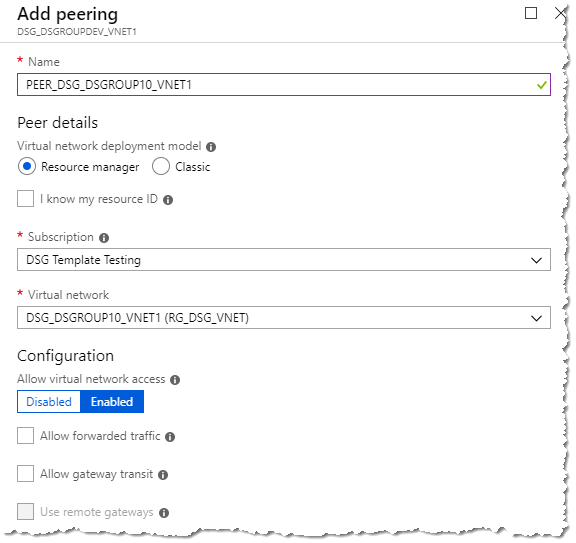{width="3.585106080489939in" height="3.6382983377077864in"}

Change to the new DSG subscription, open the virtual network under the "RG\_DSG\_VNET" resource group and select "**Peerings**" from the left-hand navigation

Add a new "Peering"

Configure the Peering as follows:

Name: "PEER\_SHM\_VNET1" (replace "SHM" with "DSG\_DSGROUPDEV" for the test environment)

Subscription: Select the Safe Haven management subscription

Virtual Network: Select correct virtual network

Set "Allow virtual network access" to "Enabled" and leave the remaining checkboxes **[un]{.underline}**checked

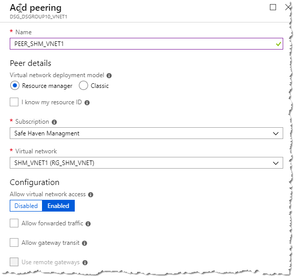{width="3.9468088363954505in" height="3.9574464129483813in"}

Once provisioned the networks will be connected.

Navigate to: Home \> Subscriptions \> \<dsg-subscription\> \> RGDSG\_VNET \> DSG\_VNET1\_GW - Point to Site Configuration

**NOTE: This is NOT the Safehaven management subscription**

Download the VPN client from the "Point to Site configuration" menu

{width="3.8829800962379704in" height="2.372340332458443in"}

Install the VPN on your PC and test. See the "Configure a VPN connection" section above for instructions. You can re-use the same client certificate as used for the management segment gateway.

Deploy DSG Domain Controller

Navigate to the DSG artifacts storage account in the Safe Haven Management Test subscription via "RG\_DSG\_ARTIFACTS -\> dsgxartifacts".

Generate a new account level SAS token with the following permissions (see screenshot below)

Services: 'blob', 'file' only

Allowed resource types: 'Service', 'Container', 'Object'

Allowed permissions: 'Read', 'List' only

End date: 8 hours in the future is fine (the default)

> 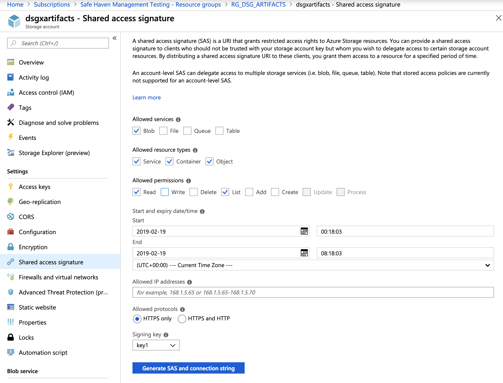{width="5.923174759405074in" height="4.513166010498687in"}

Ensure you have the latest version of the Safe Haven repository from [[https://github.com/alan-turing-institute/data-safe-haven]{.underline}](https://github.com/alan-turing-institute/data-safe-haven).

Change to the "data-safe-haven/new\_dsg\_environment/dsg-create-scripts/run-locally/" directory

Ensure you are logged into the Azure within PowerShell using the command: Connect-AzAccount

Ensure the active subscription is set to that you are using for the new DSG environment using the command: Set-AzContext -SubscriptionId \"DSG Template Testing\"

Run the "./Create\_AD\_DC.ps1" script, providing the following information when prompted.

The environment ('test' or 'prod')

First three octets of the address range (e.g. "10.250.x")

DSG ID, usually a number (e.g. for DSG9 this is just "9")

The SAS token you generated above (starting "?sv="). Paste the string exactly as copied. Do not surround it with quotes.

The deployment will take around 20 minutes. Most of this is running the setup scripts after creating the VM.

Configure Active Directory
--------------------------

Connect to the new Domain controller via Remote Desktop client over the VPN connection at the IP address \<first-three-octets\>.250 (e.g. 10.250.x.250)

Login with the admin credentials from the secret named "admin-dsg\<X\>-\<environment\>-dc" in the Safe Haven Management KeyVault (created in the "Prepare secrets" section above

Download the "DSG-DC.zip" scripts file using an SAS-authenticated URL of the form [[https://dsgxartifacts.file.core.windows.net/configpackages/Scripts/DSG-DC.zip\<sas-token]{.underline}](https://dsgxartifacts.file.core.windows.net/configpackages/Scripts/DSG-DC.zip%25253csas-token)\> (append the SAS token generated above -- starts "?sv=", with no surrounding quotes)

You may be prompted to add the site to a whitelist. If so, then add the site and restart Internet Explorer.

Create a folder called "Scripts" in the root of C:\\ and copy the zip file there from the download folder then extract the file contents to the "Scripts" folder (not to a new "DSG-DC" folder). To do this right-click on the zip file and select "extract all", ensuring the destination is just "C:\\Scripts".

Open a PowerShell command window with elevated privileges

Change to C:\\Scripts

Set the VM to United Kingdom/GMT timezone by running the following command:

  ----------------------- ---------------- -----------------
  **Command**             **Parameters**   **Description**
  Set\_OS\_Language.ps1   n/a              n/a
  ----------------------- ---------------- -----------------

Setup the accounts on the Active Directory by running the following command with these parameters.

  -------------------------------- ---------------- ---------------------------------
  **Command**                      **Parameters**   **Description**
  Create\_Users\_Groups\_OUs.ps1   -domain          DSG NetBIOS name i.e. DSGROUP10
  -------------------------------- ---------------- ---------------------------------

Configure the DNS on the server by running the following command with these parameters

  ------------------ ----------------- ----------------------------------------------------------------------------------------------------
  **Command**        **Parameters**    **Description**
  ConfigureDNS.ps1   -SubnetIdentity   First 3 octets of the Identity subnet IP address space i.e. 10.250.0
                     -SubnetRDS        First 3 octets of the Identity subnet IP address space i.e. 10.250.1
                     -SubnetData       First 3 octets of the Identity subnet IP address space i.e. 10.250.2
                     -mgmtfqdn         Enter FQDN of management domain i.e. turingsafehaven.ac.uk (production) or dsgroupdev.co.uk (test)
                     -mgmtdcip         Enter IP address of management DC i.e. 10.220.0.250 (production) or 10.220.1.250 (test)
  ------------------ ----------------- ----------------------------------------------------------------------------------------------------

Configure Active Directory group polices, to install the polices run the following command with these parameters

  ------------------- ---------------- ----------------------------------------------------------------------------------------------------------------------
  **Command**         **Parameters**   **Description**
  ConfigureGPOs.ps1   -backuppath      C:\\Scripts\\GPOs -- this is the default path, if you copy the scripts to another folder you'll need to change this.
                      -domain          DSG NetBIOS name i.e. DSGROUP10
  ------------------- ---------------- ----------------------------------------------------------------------------------------------------------------------

Open the "Group Policy Management" MMC

Expand the tree until you open the "Group Policy Objects" branch

{width="2.8125in" height="3.346800087489064in"}

Right click on "All Servers - Local Administrators" and select "Edit"

Expand "Computer Configuration" -\> "Policies" -\> "Windows Settings" -\> "Security Settings" click on "Restricted Groups"

Double click on "Administrators" shown under "Group Name" on the right side of the screen

Select both of the entries in the "Members of this group" and click "Remove"

> {width="2.8020833333333335in" height="1.4735772090988626in"}

Click "Add" -\> "Browse"

Enter:

SG DSGROUPx Server Administrators

Domain Admins

Click the "Check Names" button to resolve the names

> {width="3.5416666666666665in" height="1.96331583552056in"}

Click "OK" -\> "OK"

The "Administrators Properties" box will now look like this

> 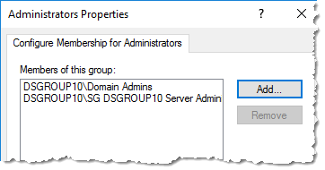{width="2.9479166666666665in" height="1.547250656167979in"}

Click "OK" and close the policy window

Within the "Group Policy Management" MMC right click on "Session Servers -- Remote Desktop Control" and click "Edit"

Expand "User Configuration" -\> "Administrative Templates" click "Start Menu & Taskbar"

Double click "Start Layout" located in the right window

Update the path shown to reflect the correct FQDN

> 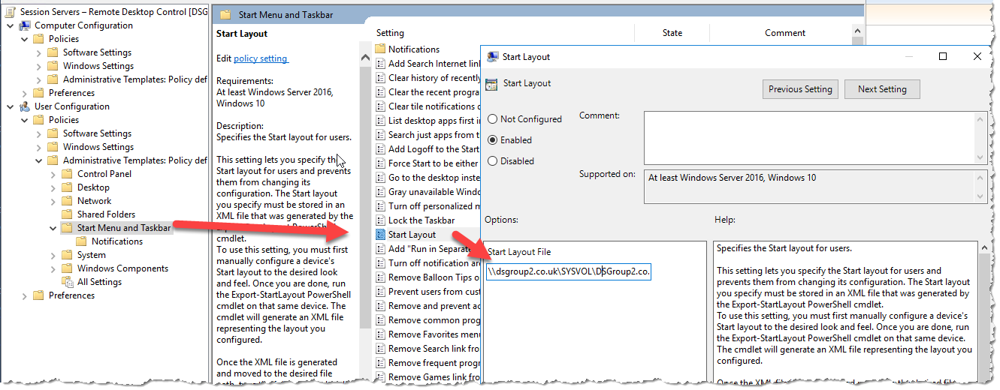{width="6.309722222222222in" height="2.4651695100612425in"}

Click "OK" when done and close all Group Policy windows.

Open C:\\Scripts in "File Explorer" and copy the "ServerStartMenu" folder

Navigate to F:\\SYSVOL\\domain\\scripts and copy the "ServerStartMenu" folder here. Close "File Explorer"

Restart the server

Create Domain Trust
-------------------

To enable authentication to pass from the DSG to the management active directory we need to establish a trust.

Login to the Safe Haven Management domain controller with a domain administrator account

Open "Windows Administrative Tools" and then the "Active Directory Domains and Trust" MMC

Right click the management domain name and select "Properties"

Click on "Trusts" tab -\> click "New Trust"

{width="2.698899825021872in" height="2.7083333333333335in"}

Click "Next"

+-------------------------------------------------------+-------------------------------------------------------------------------------------------------------------------------+
| Trust Name:                                           | FQDN of the DSG i.e. dsgroup10.co.uk                                                                                    |
+-------------------------------------------------------+-------------------------------------------------------------------------------------------------------------------------+
| Trust Type:                                           | External Trust                                                                                                          |
+-------------------------------------------------------+-------------------------------------------------------------------------------------------------------------------------+
| Direction of trust:                                   | Two-way                                                                                                                 |
+-------------------------------------------------------+-------------------------------------------------------------------------------------------------------------------------+
| Sides of trust:                                       | Both this domain and the specified domain                                                                               |
+-------------------------------------------------------+-------------------------------------------------------------------------------------------------------------------------+
| User name and password:                               | Domain admin user on the DSG domain                                                                                     |
|                                                       |                                                                                                                         |
|                                                       | Format: \<DOMAIN\\Username\>. User is "atiadmin ". See "admin-dsg9-test-dc" secret in management KeyVault for password. |
+-------------------------------------------------------+-------------------------------------------------------------------------------------------------------------------------+
| Outgoing Trust Authentication Level-Local Domain:     | Domain-wide authentication                                                                                              |
+-------------------------------------------------------+-------------------------------------------------------------------------------------------------------------------------+
| Outgoing Trust Authentication Level-Specified Domain: | Domain-wide authentication                                                                                              |
+-------------------------------------------------------+-------------------------------------------------------------------------------------------------------------------------+

Click "Next" -\> "Next"

Select "Yes, confirm the outgoing trust" -\> "Next"

Select "Yes, confirm the incoming trust" -\> "Next"

{width="2.636965223097113in" height="2.09375in"}

Click "Finish" upon successful trust creation.

Click "OK" to the informational panel on SID Filtering.

Close the "Active Directory Domains and Trust" MMC

Deploy Remote Desktop Service Environment

Ensure you have the latest version of the Safe Haven repository from [[https://github.com/alan-turing-institute/data-safe-haven]{.underline}](https://github.com/alan-turing-institute/data-safe-haven).

Change to the "data-safe-haven/new\_dsg\_environment/dsg-create-scripts/run-locally/" directory

Ensure you are logged into the Azure within PowerShell using the command: Connect-AzAccount

Ensure the active subscription is set to that you are using for the new DSG environment using the command: Set-AzContext -SubscriptionId \"DSG Template Testing\"

Run the "./Create\_RDS\_Servers.ps1" script, providing the following information when prompted.

The environment ('test' or 'prod')

First two octets of the address range (e.g. "10.250")

Third octet of the address range (e.g. "64" for "10.250.64")

DSG ID, usually a number (e.g. for DSG9 this is just "9")

The deployment will take around 10 minutes to complete.

Configuring Remote Desktop Services
-----------------------------------

Connect to the new Domain controller via Remote Desktop client over the VPN connection (??)

Login with the admin credentials you entered with you provisioned the VM previously

Open the "Active Directory Users and Computers" MMC

Expand the "Computers" Container

Drag the "RDS" computer object to the "\<DSG NAME\> Service Servers" OU, click "YES" to the warning

Select both the "RDSSH1" and "RDSSH2" objects and drag them to the "\<DSG NAME\> RDS Session Servers" OU, click "YES" to the warning

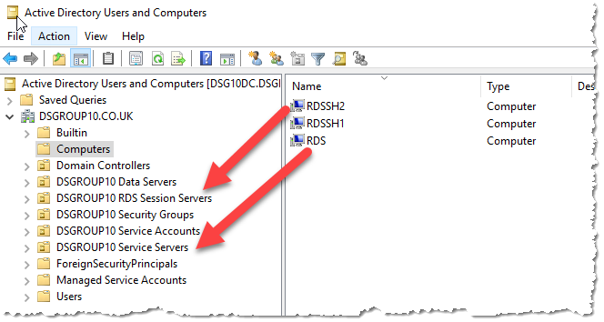{width="6.916666666666667in" height="3.6875in"}

Connect to the new **Remote Desktop Gateway (RDS)** server via Remote Desktop client over the VPN connection

Login with the admin credentials you entered with you provisioned the VM previously

Open a PowerShell command prompt with elevated privileges.

Navigate to the DSG artifacts storage account in the Safe Haven Management Test subscription via "RG\_DSG\_ARTIFACTS -\> dsgxartifacts".

Generate a new account level SAS token with the following permissions (see screenshot below)

Services: 'blob', 'file' only

Allowed resource types: 'Service', 'Container', 'Object'

Allowed permissions: 'Read', 'List' only

End date: 8 hours in the future is fine (the default)

> {width="5.923174759405074in" height="4.513166010498687in"}

Download the "DSG-DC.zip" scripts file using an SAS-authenticated URL of the form [[https://dsgxartifacts.file.core.windows.net/configpackages/Scripts/DSG-DC.zip\<sas-token]{.underline}](https://dsgxartifacts.file.core.windows.net/configpackages/Scripts/DSG-DC.zip%25253csas-token)\> (append the SAS token generated above -- starts "?sv=", with no surrounding quotes)

You may be prompted to add the site to a whitelist. If so, then add the site and restart Internet Explorer.

Create a folder called "Scripts" in the root of C:\\ and copy the zip file there from the download folder then extract the file contents to the "Scripts" folder (not to a new "DSG-DC" folder). To do this right-click on the zip file and select "extract all", ensuring the destination is just "C:\\Scripts".

Open a PowerShell command window with elevated privileges

Change to C:\\Scripts

Prepare the VM with the correct country/time-zone and add additional prefixes to the DNS by running the following command:

  -------------- ---------------- --------------------------------------------------------------------
  **Command**    **Parameters**   **Description**
  OS\_Prep.ps1   -domain          Enter the NetBIOS name of the domain i.e. DSGROUP10
                 -mgmtdomain      Enter the FQDN of the management domain i.e. turingsafehaven.ac.uk
  -------------- ---------------- --------------------------------------------------------------------

[Repeat the above process on the "RDS Session Server 1" (RDSSH1) and "RDS Session Server 2" (RDSSH2) and run the "OS\_Prep.ps1" before proceeding to the next step]{.underline}

Connect to the "Remote Desktop Session Server 1" (RDSSH1) via Remote Desktop

Open the network location created earlier and copy the "Packages" folder to the root of C:\\

Navigate to C:\\Packages and install the applications (accept default configuration)

Putty

WinSCP

GoogleChrome

Once installed logout of the server

Connect to the "Remote Desktop Session Server 2" (RDSSH2) via Remote Desktop

Open the network location created earlier and copy the "Packages" folder to the root of C:\\

Navigate to C:\\Packages and install the applications (accept default configuration)

Putty

WinSCP

GoogleChrome

Apache\_OpenOffice

Once installed logout of the server

Connect to the "Remote Desktop Gateway Server" (RDS) via Remote Desktop and open a PowerShell command window with elevated privileges

Change to C:\\Scripts

Install the RDS services by running the following command:

+--------------------------+----------------+-------------------------------------------------------------------------------------------------+
| **Command**              | **Parameters** | **Description**                                                                                 |
+--------------------------+----------------+-------------------------------------------------------------------------------------------------+
| DeployRDSEnvironment.ps1 | -domain        | Enter the NetBIOS name of the domain i.e. DSGROUP9x§                                            |
+--------------------------+----------------+-------------------------------------------------------------------------------------------------+
|                          | -dsg           | Enter the DSG name i.e. DSGROUP9                                                                |
+--------------------------+----------------+-------------------------------------------------------------------------------------------------+
|                          | -mgmtdomain    | Enter NetBIOS name of the management domain i.e. TURINGSAFEHAVEN (production) DSGROUPDEV (test) |
+--------------------------+----------------+-------------------------------------------------------------------------------------------------+
|                          | -ipaddress     | Enter the first three octets of the Subnet-Data subnet as per the checklist i.e. 10.250.x+2     |
|                          |                |                                                                                                 |
|                          |                | (where x is the base address)                                                                   |
+--------------------------+----------------+-------------------------------------------------------------------------------------------------+

The RDS deployment will now start, this will take around 10 minutes to complete, the session servers will reboot during the process.

Once complete open Server Manager, right click on "All Servers" and select "Add Servers"

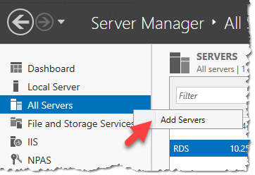{width="2.8854166666666665in" height="1.976751968503937in"}

Enter "rds" into the "Name" box and click "Find Now"

Select the two session servers (RDSSH1, RDSSH2) and click the arrow to add them to the selected box, click "OK" to finish

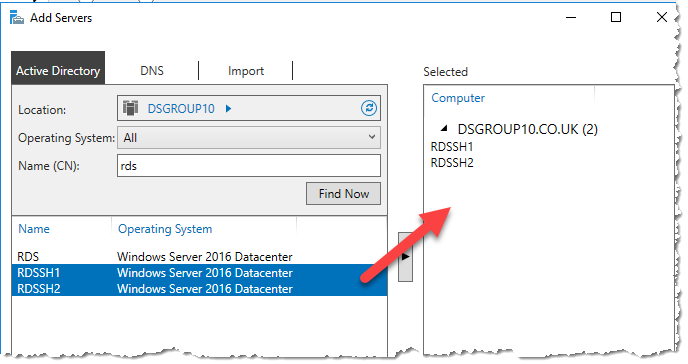{width="3.6145833333333335in" height="1.9123698600174979in"}

The next step is to install a SSL Certificate onto the server, this has to be a certificate that is issues from a Certificate Authority and not self-signed.

Open "MMC"

In the file menu select add/remove snap-in

Select Certificate from the list and select the "Computer Account" option

Right click and select "Create Certificate Request"

Fill in the form as below. It is **[critically important]{.underline}** that the certificate common name matches the FQDN of the RDS server i.e. rds.dsgroup10.co.uk.

> {width="3.875in" height="2.3969728783902013in"}

Set the "Bit length" to 2048 (this can be set higher but check with your CA provider)

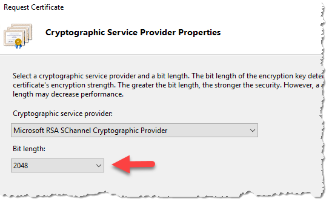{width="3.59375in" height="2.1906660104986875in"}

Save the certificate request file to a TXT file to be used to order the SSL Certificate.

-   -   Copy the CSR from the RDS server to your compute

-   \[Install Certbot\](https://certbot.eff.org/) on your computer if required

-   Run Certbot, passing in custom folders for config, work and logs directories. This will automatically create a new Let\'s Encrypt account for this particular pairing of Certbot installation and custom directory.

-   \`certbot \--config-dir \~/tsh-certbot/config \--work-dir \~/tsh-certbot/work \--logs-dir \~/tsh-certbot/logs certonly \--manual \--preferred-challenges \"dns\" \--agree-tos -m \<email-for-expiry-notifications\> -d \<dsg-domain\> \--csr \<path-to-csr\>\`

-   When presented with the DNS challenge from Certbot, add a record to the DNS Zone for the DSG domain with the following properties

-   \*\*Name:\*\* First section of the name provided by Certbot (e.g. \`\_acme-challenge\`)

-   \*\*Type:\*\* TXT

-   \*\*TTL:\*\* 30 seconds

-   \*\*Value:\*\* The value provided by Certbot (a long random looking string)

-   Wait for Let\'s Encrypt to verify the challenge

-   Copy \`\~/tsh-certbot/config/live/\<dsg-fq-domain\>/fullchain.pem\` from your computer to the RDS server

-   Securely delete the \`\~/tsh-certbot\` directory. Note that, when using a CSR, neither the CSR nor the signed certificate files are sensitive. However, the private key in the \`accounts\` subfolder is now authorised to create new certs for the DSG domain, which is sensitive

    Once the certificate has been issued by the CA this needs to be installed onto the server.

    Again from within IIS MMC open Certificates and select "Complete Certificate Request"

    Browse to the certificate file provided by the CA.

    The friendly name should match the common name you provided in the certificate request.

{width="3.481595581802275in" height="2.28125in"}

Click "OK" to complete the process

Open "MMC" and add the Certificate snap-in targeting the "Computer Account" on the local computer

Expand "Personal" -\> "Certificates" and locate the CA certificate

Export the certificate with it's private key

Right click this certificate and click on "All Tasks" -\> "Export.."

Click "Next" -\> "Yes, export the private key" -\> "Personal Information Exchange" -\> "Next" -\> Check the "Password" box and enter a password -\> "Next" -\> "Browse" -\> select a location to save the certificate and provide a name. Click "Next" -\> "Finish"

Export the certificate without it's private key

Right click this certificate and click on "All Tasks" -\> "Export.."

Click "Next" -\> "No, do not export the private key" -\> Select "DER encoded binary X.509" -\> "Next" -\> rob1"Browse" -\> select a location to save the certificate and provide a name. Click "Next" -\> "Finish"

-   On the "Remote Desktop Gateway" (RDS) open a PowerShell command window with elevated privilege

-   Navigate to C:\\Scripts

-   Add the new certificate to the Remote Desktop service by running the following command:

  ---------------- ---------------- ----------------------------------------------------------
  **Command**      **Parameters**   **Description**
  AddSSLCert.ps1   -Sslpassword     The private key password
                   -domain          Enter the NetBIOS name of the domain i.e. DSGROUP10
                   -certpath        The path to the certificate file i.e. c:\\temp\\cert.pfx
  ---------------- ---------------- ----------------------------------------------------------

Configure Remote Desktop Web Client
-----------------------------------

From the same PowerShell command window as used above run the following command to update PowerShell cmdlets.

  -------------------------------------------
  **Update PowerShell Cmdlets**
  Install-Module -Name PowerShellGet -Force
  -------------------------------------------

Enter "Y" when prompted

Exit the PowerShell window and re-open a new one (with elevated permissions)

Run the following command to install the Remote Desktop Web Client PowerShell Module

  ---------------------------------------------------------
  **Install Remote Desktop Web Client PowerShell Module**
  Install-Module -Name RDWebClientManagement
  ---------------------------------------------------------

Enter "A" when prompted

Enter "A" for the EULA confirmation

Run the following command to install the Remote Web Client package

  ---------------------------------------------------------
  **Install Remote Desktop Web Client PowerShell Module**
  Install-RDWebClientPackage
  ---------------------------------------------------------

Run the following command to install the certificate you exported earlier, note that you are targeting the .CER file this time.

  ---------------------------------------------------
  **Install Remote Desktop Web Client Certificate**
  Import-RDWebClientBrokerCert \<.cer file path\>
  ---------------------------------------------------

Finally run this command to publish the Remote Desktop Web Client

  -----------------------------------------------------
  **Publish Remote Desktop Web Client**
  Publish-RDWebClientPackage -Type Production -Latest
  -----------------------------------------------------

Adding new RDS Server to Global NPS server
------------------------------------------

-   Log in to the global NPS server

-   Open the "Network Policy Server" MMC

-   Expand "NPS (Local)" -\> "RADIUS Clients and Servers" --\> "RADIUS Clients"

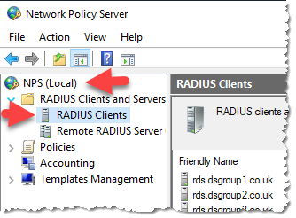{width="2.7391294838145233in" height="2.020034995625547in"}

-   Right click "RADIUS Clients" -\> "New"

-   Enter the friendly name of the server (best practice use the FQDN of the RDS server)

-   Add the IP address of the RDS server

-   Enter the "Shared Secret", these needs to match the secret that was added to the RDS server.

{width="2.5739129483814525in" height="3.1474507874015747in"}

-   Click "OK" to finish

Remote Desktop Security Configuration
-------------------------------------

On the RDS server open "Server Manager" -\> "Tools" -\> "Remote Desktop Services" -\> "Remote Desktop Gateway Manager"

{width="3.2291666666666665in" height="2.225722878390201in"}

Right click the server object and select "Properties"

{width="2.3645833333333335in" height="1.5881528871391075in"}

Select "RD CAP Store" tab

Select the "Central Server Running NPS"

Enter the IP address of the NPS within the management domain as per the checklist and click "Add"

Enter the shared secret for the RADIUS connection when prompted (note: this can be entered as 'new shared secret' as opposed to 'existing')

{width="2.7931944444444445in" height="2.4895833333333335in"}

Click "OK" to close the dialogue box.

Expand the server object -\> "Policies" -\> "Resource Authorization Policies"

Right click on "RDG\_AllDomainControllers" -\> "Properties"

{width="6.6875in" height="1.8894455380577428in"}

Click "User Groups" tab -\> "Add"

Click "Locations" and select the management domain

Enter the "SG" into the "Enter the object names to select" box and click on "Check Names" select the correct Research Users security group from the list i.e. SG DSG10 Research Users.

{width="3.78125in" height="2.7392224409448818in"}

Click "OK" and the group will be added to the "User Groups" screen

{width="3.3645833333333335in" height="1.5366393263342082in"}

Click "OK" to exit the dialogue box

Right click on "RDG\_RDConnectionBrokers" policy and select "Properties"

{width="5.21875in" height="2.0429221347331583in"}

Repeat the process you did for the "RDG\_AllDomainComputers" policy and add the correct Research Users security group.

Domain Name Update
------------------

To make this Remote Desktop Service accessible from the internet a A record will need to be added to the external domain name servers. The A record must match the FQDN of the server i.e. RDS.DSGROUP10.CO.UK. The IP address for this record is the external IP address that is assigned to the RDS\_NIC1 resource within the Azure Portal.

Deploy Data Server

Ensure you have the latest version of the Safe Haven repository from [[https://github.com/alan-turing-institute/data-safe-haven]{.underline}](https://github.com/alan-turing-institute/data-safe-haven).

Change to the "data-safe-haven/new\_dsg\_environment/dsg-create-scripts/run-locally/" directory

Ensure you are logged into the Azure within PowerShell using the command: Connect-AzAccount

Ensure the active subscription is set to that you are using for the new DSG environment using the command: Set-AzContext -SubscriptionId \"DSG Template Testing\"

Run the "./Create\_Data\_Server.ps1" script, providing the following information when prompted.

First two octets of the address range (e.g. "10.250")

Third octet of the address range (e.g. "64" for "10.250.64")

DSG ID, usually a number (e.g. for DSG9 this is just "9")

The deployment will take around 20 minutes. Most of this is deploying the virtual network gateway.

The deployment will take around 15 minutes to complete

Connect to the DSG Domain controller via Remote Desktop client over the VPN connection

Login with the admin credentials you entered with you provisioned the VM previously

Open the "Active Directory Users and Computers" MMC

Expand the "Computers" Container

Drag the "DATASERVER" computer object to the "\<DSG NAME\> Data Servers" OU, click "YES" to the warning

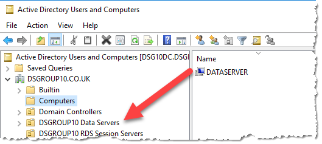{width="3.2291666666666665in" height="1.4467169728783902in"}

Connect to the new **Data Server** via Remote Desktop client over the VPN connection

Login with the admin credentials you entered with you provisioned the VM previously

Navigate to the DSG artifacts storage account in the Safe Haven Management Test subscription via "RG\_DSG\_ARTIFACTS -\> dsgxartifacts".

Generate a new account level SAS token with the following permissions (see screenshot below)

Services: 'blob', 'file' only

Allowed resource types: 'Service', 'Container', 'Object'

Allowed permissions: 'Read', 'List' only

End date: 8 hours in the future is fine (the default)

> {width="5.923174759405074in" height="4.513166010498687in"}

Download the "DSG-DATASERVER .zip" scripts file using an SAS-authenticated URL of the form [[https://dsgxartifacts.file.core.windows.net/configpackages/Scripts/DSG-DC.zip\<sas-token]{.underline}](https://dsgxartifacts.file.core.windows.net/configpackages/Scripts/DSG-DC.zip%25253csas-token)\> (append the SAS token generated above -- starts "?sv=", with no surrounding quotes)

You may be prompted to add the site to a whitelist. If so, then add the site and restart Internet Explorer.

Create a folder called "Scripts" in the root of C:\\ and copy the zip file there from the download folder then extract the file contents to the "Scripts" folder (not to a new "DSG-DC" folder). To do this right-click on the zip file and select "extract all", ensuring the destination is just "C:\\Scripts".

Open a PowerShell command window with elevated privileges

Change to C:\\Scripts

Prepare the VM with the correct country/time-zone and add additional prefixes to the DNS by running the following command:

  --------------------------- ---------------- ----------------------------------------------------------------------
  **Command**                 **Parameters**   **Description**
  Configure\_DataServer.ps1   -mgmtdomain      Enter the NetBIOS name of the management domain i.e. TURINGSAFEHAVEN
                              -dsgdomain       Enter the NetBIOS name of the domain i.e. DSGROUP10
                              -dsg             Enter the DSG name i.e. DSG2
  --------------------------- ---------------- ----------------------------------------------------------------------

Deploy Linux Servers

Note: Before deploying the Linux Servers ensure that you've allowed GitLab Community Edition to be programmatically deployed within the Azure Portal.

Ensure you have the latest version of the Safe Haven repository from [[https://github.com/alan-turing-institute/data-safe-haven]{.underline}](https://github.com/alan-turing-institute/data-safe-haven).

Change to the "data-safe-haven/new\_dsg\_environment/dsg-create-scripts/run-locally/" directory

Ensure you are logged into the Azure within PowerShell using the command: Connect-AzAccount

Ensure the active subscription is set to that you are using for the new DSG environment using the command: Set-AzContext -SubscriptionId \"DSG Template Testing\"

Run the "./Create\_Linux\_Servers.ps1" script, providing the following information when prompted.

First two octets of the address range (e.g. "10.250")

Third octet of the address range (e.g. "64" for "10.250.64")

DSG ID, usually a number (e.g. for DSG9 this is just "9")

The deployment will take around 20 minutes. Most of this is deploying the virtual network gateway.

The deployment will take around 15 minutes to complete

Configure HackMD Server
-----------------------

Connect to the HackMD server with Putty (or any SSH client) Login with the admin credentials you entered with you provisioned the VM previously

Update the local host file

+----------------------+------------------------------------------------------------------+
| **Command**          | **Actions**                                                      |
+----------------------+------------------------------------------------------------------+
| sudo nano /etc/hosts | Add the line:                                                    |
|                      |                                                                  |
|                      | \<Subnet-Data\>.152 hackmd hackmd.dsgroupX.co.uk                 |
|                      |                                                                  |
|                      | \<Subnet-Data\> = IP Address of the Subnet-Data as per checklist |
|                      |                                                                  |
|                      | Change X for correct group number                                |
+----------------------+------------------------------------------------------------------+

Update the time-zone

+------------------------------+---------------------+
| **Command**                  | **Actions**         |
+------------------------------+---------------------+
| sudo dpkg-reconfigure tzdata | Select -\> "Europe" |
|                              |                     |
|                              | Select -\> "London" |
+------------------------------+---------------------+

Install Docker

  -------------------------------------------------------------------------------------------------------
  **Command**
  sudo apt-get update
  sudo apt upgrade
  sudo apt install apt-transport-https ca-certificates curl software-properties-common
  curl -fsSL https://download.docker.com/linux/ubuntu/gpg \| sudo apt-key add -
  sudo add-apt-repository \"deb \[arch=amd64\] https://download.docker.com/linux/ubuntu artful stable\"
  sudo apt update
  sudo apt install docker-ce
  sudo docker run hello-world
  sudo apt install docker-compose
  sudo git clone https://github.com/hackmdio/docker-hackmd.git
  -------------------------------------------------------------------------------------------------------

Configure HackMD

Change to ./docker-hackmd

Run command

  ------------------------------
  **Command**
  sudo nano docker-compose.yml
  ------------------------------

Change Version to 2

> {width="3.3333333333333335in" height="1.1983705161854767in"}

Add the following lines under "environment:"

+--------------------------------+-----------------------------------------------------------------------------------+
| **Command**                    | **Value**                                                                         |
+--------------------------------+-----------------------------------------------------------------------------------+
| \- HMD\_LDAP\_PROVIDERNAME=    | NetBIOS name of management domain i.e. turingsafehaven (lowercase)                |
+--------------------------------+-----------------------------------------------------------------------------------+
| \- HMD\_LDAP\_URL=             | LDAP connection URL i.e. ldap://shmdc1.turingsafehaven.ac.uk                      |
+--------------------------------+-----------------------------------------------------------------------------------+
| \- HMD\_LDAP\_BINDDN=          | Bind Path for LDAP user i.e.                                                      |
|                                |                                                                                   |
|                                | CN=DSGx HackMD LDAP,OU=Safe Haven Service Accounts,DC=turingsafehaven,DC=ac,DC=uk |
+--------------------------------+-----------------------------------------------------------------------------------+
| \- HMD\_LDAP\_BINDCREDENTIALS= | Password for the LDAP account above                                               |
+--------------------------------+-----------------------------------------------------------------------------------+
| \- HMD\_LDAP\_SEARCHBASE=      | OU Path to the Research Users OU i.e.                                             |
|                                |                                                                                   |
|                                | OU=Safe Haven Research Users,DC=turingsafehaven,DC=ac,DC=uk                       |
+--------------------------------+-----------------------------------------------------------------------------------+
| \- HMD\_LDAP\_SEARCHFILTER=    | (userPrincipalName={{username}})                                                  |
+--------------------------------+-----------------------------------------------------------------------------------+
| \- HMD\_USECDN=                | false                                                                             |
+--------------------------------+-----------------------------------------------------------------------------------+
| \- HMD\_EMAIL=                 | false                                                                             |
+--------------------------------+-----------------------------------------------------------------------------------+
| \- HMD\_ALLOW\_FREEURL=        | true                                                                              |
+--------------------------------+-----------------------------------------------------------------------------------+
| \- HMD\_ALLOW\_ANONYMOUS=      | false                                                                             |
+--------------------------------+-----------------------------------------------------------------------------------+

> 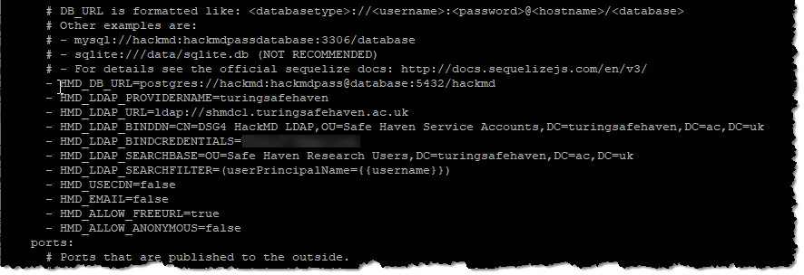{width="6.489583333333333in" height="2.2266502624671918in"}

Start HackMD container

  ---------------------------
  **Command**
  sudo docker-compose up -d
  ---------------------------

Configure GitLab Server
-----------------------

Connect to the GitLab server with Putty (or any SSH client) Login with the admin credentials you entered with you provisioned the VM previously

Update the local host file

+----------------------+------------------------------------------------------------------+
| **Command**          | **Actions**                                                      |
+----------------------+------------------------------------------------------------------+
| sudo nano /etc/hosts | Add the line:                                                    |
|                      |                                                                  |
|                      | \<Subnet-Data\>.151 gitlab gitlab.dsgroupX.co.uk                 |
|                      |                                                                  |
|                      | \<Subnet-Data\> = IP Address of the Subnet-Data as per checklist |
|                      |                                                                  |
|                      | Change X for correct group number                                |
+----------------------+------------------------------------------------------------------+

Update the time-zone

+------------------------------+---------------------+
| **Command**                  | **Actions**         |
+------------------------------+---------------------+
| sudo dpkg-reconfigure tzdata | Select -\> "Europe" |
|                              |                     |
|                              | Select -\> "London" |
+------------------------------+---------------------+

Identify the data disk, noting ID

  -------------------
  **Command**
  sudo lshw -C disk
  -------------------

Create partition on the data drive

+---------------------+--------------------------------------------+
| **Command**         | **Detail**                                 |
+---------------------+--------------------------------------------+
| sudo fdisk /dev/xxx | \- xxx = disk name as noted above i.e. sdc |
|                     |                                            |
|                     | \- Command: n                              |
|                     |                                            |
|                     | \- Partition type: Primary                 |
|                     |                                            |
|                     | \- Partition number: 1                     |
|                     |                                            |
|                     | \- First Sector: (accept default)          |
|                     |                                            |
|                     | \- Last Sector: (accept default)           |
|                     |                                            |
|                     | \- Command: W                              |
+---------------------+--------------------------------------------+

Format Partition:

  ---------------------------------------
  **Command**
  sudo mkfs.ext4 /dev/sdc1 -L DataDrive
  ---------------------------------------

Capture Partition UUID

  -------------
  **Command**
  sudo blkid
  -------------

> 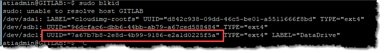{width="6.802083333333333in" height="0.9437456255468066in"}

Backup FSTAB file

  --------------------------------------------------
  **Command**
  sudo cp /etc/fstab /etc/fstab.\$(date +%Y-%m-%d)
  --------------------------------------------------

Open FSTAB file for editing:

  ----------------------
  **Command**
  sudo nano /etc/fstab
  ----------------------

Add the following lines (Change UUID)

  -------------------------------------------------------------
  **Command**
  UUID=\<ID CAPTURED ABOVE\> /media/gitdata ext4 defaults 0 2
  -------------------------------------------------------------

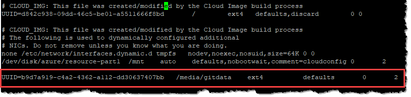{width="6.812498906386701in" height="1.6103718285214348in"}

Create home folder mount point

  ---------------------------
  **Command**
  sudo mkdir /media/gitdata
  ---------------------------

Mount drive:

  ---------------
  **Command**
  sudo mount -a
  ---------------

Edit config file:

  ---------------------------------
  **Command**
  sudo nano /etc/gitlab/gitlab.rb
  ---------------------------------

+--------------------------------+------------------------------------------------------------------------------------------------------------------------+
| **Command**                    | **Value**                                                                                                              |
+--------------------------------+------------------------------------------------------------------------------------------------------------------------+
| Gilabrails\['ldap\_enabled'\]  | true                                                                                                                   |
+--------------------------------+------------------------------------------------------------------------------------------------------------------------+
| Host                           | dc.turingsafehaven.ac.uk                                                                                               |
|                                |                                                                                                                        |
|                                | DC = within the management domain                                                                                      |
+--------------------------------+------------------------------------------------------------------------------------------------------------------------+
| Method                         | Plain                                                                                                                  |
+--------------------------------+------------------------------------------------------------------------------------------------------------------------+
| bind\_dn                       | CN=DSGx GITLAB LDAP,OU=Safe Haven Service Accounts,DC=turingsafehaven,DC=ac,DC=uk                                      |
|                                |                                                                                                                        |
|                                | Replace X with DSG Number                                                                                              |
+--------------------------------+------------------------------------------------------------------------------------------------------------------------+
| password                       | Password of GitLab LDAP service account                                                                                |
+--------------------------------+------------------------------------------------------------------------------------------------------------------------+
| active\_directory              | true                                                                                                                   |
+--------------------------------+------------------------------------------------------------------------------------------------------------------------+
| allow user name or email login | true                                                                                                                   |
+--------------------------------+------------------------------------------------------------------------------------------------------------------------+
| block\_auto\_created\_users    | false                                                                                                                  |
+--------------------------------+------------------------------------------------------------------------------------------------------------------------+
| base                           | OU=Safe Haven Research Users,DC=turingsafehaven,DC=ac,DC=uk                                                            |
+--------------------------------+------------------------------------------------------------------------------------------------------------------------+
| User\_filter                   | (&(objectClass=user)(memberOf=CN=SG DSGx Research Users,OU=Safe Haven Security Groups,DC=turingsafehaven,DC=ac,DC=uk)) |
+--------------------------------+------------------------------------------------------------------------------------------------------------------------+

Note: Change domain where applicable

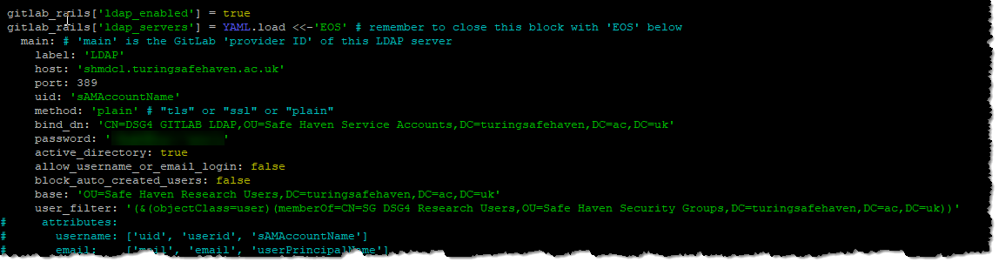{width="6.75420384951881in" height="1.7708333333333333in"}

Scroll down to "For setting up different data storing directory"

Add the following under the "git\_data\_dir" entry

  --------------------------------------------------------------------------
  **Command**
  git\_data\_dirs({ \"default\" =\> { \"path\" =\> \"/media/gitdata\" } })
  --------------------------------------------------------------------------

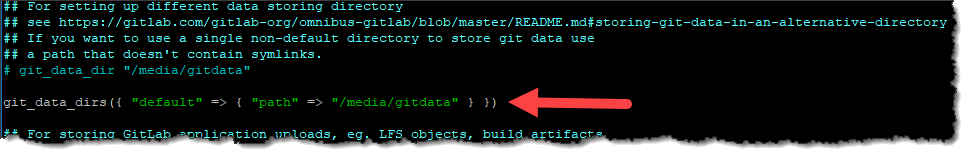{width="6.71875in" height="1.0688921697287839in"}

Insure that EOS is at the end of the file and save it.

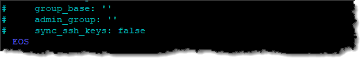{width="5.471527777777778in" height="0.9152777777777777in"}

Run the following command to reconfigure server:

sudo gitlab-ctl reconfigure

Do an LDAP check:

sudo gitlab-rake gitlab:ldap:check

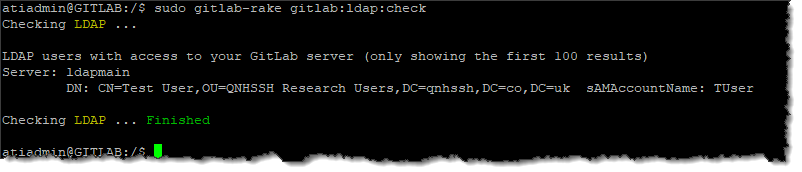{width="6.016185476815398in" height="1.2902548118985127in"}

Login to server via browser, the first password prompt sets the Root password

Go to settings and switch off user sign up

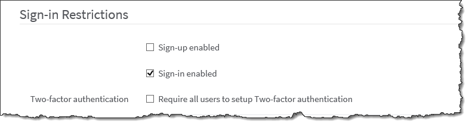{width="5.590618985126859in" height="1.4877351268591426in"}

Set restricted domain to FQDN of domain, ensure that the local DSG domain and management domain are added.

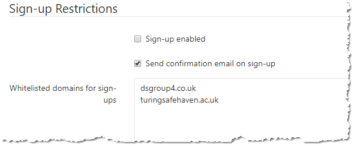{width="5.697916666666667in" height="2.3412226596675416in"}

Upgrade GitLab

  --------------------------------------------
  **Command**
  sudo apt-get update
  sudo apt-get install gitlab-ce=9.5.6-ce.0
  sudo gitlab-ctl reconfigure
  sudo gitlab-ctl restart
  sudo apt-get update
  sudo apt-get install gitlab-ce=10.8.7-ce.0
  sudo gitlab-ctl reconfigure
  sudo gitlab-ctl restart
  sudo apt-get update
  sudo apt upgrade
  sudo gitlab-ctl reconfigure
  sudo gitlab-ctl restart
  --------------------------------------------

Network Lock Down

Once all the VMs have been deployed and updated before the DSG is ready the network on the RDS Session servers and Linux servers needs locking down to prevent them from accessing the internet.

Open the Azure Portal

Locate the "Network Security Groups" management pane.

RDS Servers

Open "NSG\_SessionHosts"

Associate the following NICs to this NSG

RDSSH1\_NIC1

RDSSH2\_NIC2

Linux Servers

Open NSG\_Linux\_Servers

Associate the following NICs to this NSG

GITLAB\_NIC1

HACKMD\_NIC1
