# Data Study Environment Build Instructions

## Prerequisites

### Access to required Safe Haven Management resources

- Access to the relevant Safe Haven Management Azure subscription

- Administrative access to the relevant Safe Haven Management Active Directory Domain

- Administrative access to the relevant Safe Haven Management VMs

- #### Download a client VPN certificate for the Safe Haven Management VNet

  - Navigate to the Safe Haven Management (SHM) KeyVault in the Safe Haven Management subscription via `Resource Groups -> RG_DSG_SECRETS -> dsg-management-<shm-id>`, where `<shm-id>` is `prod` for the production SHM environment and `test` for the test SHM environment.

  - Once there open the "Certificates" page under the "Settings" section in the left hand sidebar.

  - Click on the certificate named `DSG-P2S-<shm-id>-ClientCert`, click on the "current version" and click the "Download in PFX/PEM format" link.

  - To install, double click on the downloaded certificate, leaving the password field blank.

  - **Make sure to securely delete the "\*.pfx" certificate file after you have installed it.**

  -  This certificate will also allow you to connect via VPN to the DSG VNet once deployed.

- #### Configure a VPN connection to the Safe Haven Management VNet

  - Navigate to the Safe Haven Management (SHM) VNet gateway in the SHM subscription via `Resource Groups -> RG_DSG_VNET -> DSG_VNET1_GW`. Once there open the "Point-to-site configuration page under the "Settings" section in the left hand sidebar (see image below).

  - Click the "Download VPN client" link at the top of the page to get the root certificate (VpnServerRoot.cer) and VPN configuration file (VpnSettings.xml), then follow the [VPN set up instructions](https://docs.microsoft.com/en-us/azure/vpn-gateway/point-to-site-vpn-client-configuration-azure-cert) using the Windows or Mac sections as appropriate.

  - Note that on OSX double clicking on the root certificate may not result in any pop-up dialogue, but the certificate should still be installed. You can view the details of the downloaded certificate by highlighting the certificate file in Finder and pressing the spacebar. You can then look for the certificate of the same name in the login KeyChain and view it's details by double clicking the list entry. If the details match the certificate has been successfully installed.

    

  - Continue to follow the set up instructions from the link above, using SSTP (Windows) or IKEv2 (OSX) for the VPN type and naming the VPN connection "Safe Haven Management Gateway (`<shm-id>`)", where `<shm-id>` is `prod` for the production SHM environment and `test` for the test SHM environment.

### Access to required DSG resources

- Access to a new Azure subscription which the DSG will be deployed to

- Access to a public routable domain name for the DSG and its name servers

### Install and configure PowerShell for Azure

- [Install PowerShell v 6.0 or above](https://docs.microsoft.com/en-us/powershell/scripting/install/installing-powershell?view=powershell-6)

- [Install the PowerShell Azure commandlet](https://docs.microsoft.com/en-us/powershell/azure/install-az-ps?view=azps-1.3.0)

## Build Process

0. Define DSG configuration

1. Prepare the management environment for the new DSG

2. Deploy DSG Virtual Network

3. Deploy DSG Domain Controller

4. Deploy Remote Desktop Services environment

5. Deploy Data Server

6. Deploy Support Servers (GitLab, HackMD)

7. Deploy initial shared compute VM

8. Network Lock Down

## 0. Define DSG configuration

The full configuration details for a new DSG are generated by defining a few "core" properties for the new DSG and the management environment in which it will be deployed.

### Core SHM configuration properties
The core properties for the relevant pre-existing Safe Haven Management (SHM) environment must be present in the `dsg_configs/core` folder.
The following core SHM properties must be defined in a JSON file named `shm_<shm-id>_core_config.json`.

```json
{
    "subscriptionName": "Name of the Azure subscription the management environment is deployed in",
    "domain": "The fully qualified domain name for the management environment",
    "shId": "A short ID to identify the management environment",
    "location": "The Azure location in which the management environment VMs are deployed",
    "ipPrefix": "The three octect IP address prefix for the Class A range used by the management environemnt",
    "dcHostname": "The hostname of the managment environemtn Active Directory Domain Controller"
}
```

### Core DSG configuration properties

The core properties for the new DSG environment must be present in the `dsg_configs/core` folder.
The following core DSG properties must be defined in a JSON file named `dsg_<dsg-id>_core_config.json`.

```json
{
    "subscriptionName": "Name of the Azure subscription the DSG environment is deployed in",
    "dsgId": "A short ID to identify the management environment",
    "domain": "The fully qualified domain name for the DSG environment",
    "ipPrefix": "The three octect IP address prefix for the Class A range used by the management environemnt"
}
```

#### DSG IP Address prefix

Each DSG must be assigned it's own unique IP address space, and it is very important that address spaces do not overlap in the environment as this will cause network faults. The address spaces use a private class A range and use a 21bit subnet mask. This provides ample addresses for a DSG and capacity to add additional subnets should that be required in the future.

### Generate full configuration for DSG

- Ensure you have the latest version of the Safe Haven repository from [https://github.com/alan-turing-institute/data-safe-haven](https://github.com/alan-turing-institute/data-safe-haven).

- Navigate to the `new_dsg_environment/dsg_deploy_scripts/` folder within the Safe Haven repository.

- Generate a new full configuration file for the new DSG using the following commands.
  - `Import-Module ./DsgConfig.psm1 -Force`
  - `Add-DsgConfig -shmId <sh-management-id> -dsgId <dsg-id>` (`<sh-management-id>` is  `test` or `prod`, `<dsg-id>` is usually a number, e.g. `9` for `DSG9`),
  - A full configuration file for the new DSG will be created at `new_dsg_environment/dsg_configs/full/dsg_<dsg-id>_full_config.json`. This file is used by the subsequent steps in the DSG deployment.

## 0. Prepare Safe Haven Management Domain
- Ensure you have the latest version of the Safe Haven repository from [[https://github.com/alan-turing-institute/data-safe-haven]{.underline}](https://github.com/alan-turing-institute/data-safe-haven).

- Change to the `new_dsg_environment/dsg_deploy_scripts/01_configure_shm_dc/` directory within the Safe Haven repository.

- Ensure you are logged into the Azure within PowerShell using the command: `Connect-AzAccount`

- Ensure the active subscription is set to that you are using for the new DSG environment using the command: `Set-AzContext -SubscriptionId "<dsg-subscription-name>"` [TODO: Write a small script to pick this up from the DSG config file (or have all DSG scripts switch subscriptions when they run)]

- Add new DSG users and security group to the AD by running `Create_New_DSG_User_Service_Accounts_Local.ps1`, entering the DSG ID when prompted

- Add new DSG DNS record to the AD by running `Add_New_DSG_To_DNS_Local.ps1`, entering the DSG ID when prompted

## 1. Deploy Virtual Network

### Create the virtual network

- Ensure you have the latest version of the Safe Haven repository from [https://github.com/alan-turing-institute/data-safe-haven](https://github.com/alan-turing-institute/data-safe-haven).

- Change to the `new_dsg_environment/dsg_deploy_scripts/02_create_vnet/` directory within the Safe Haven repository.

- Ensure you are logged into the Azure within PowerShell using the command: `Connect-AzAccount`

- Ensure the active subscription is set to that you are using for the new DSG environment using the command: `Set-AzContext -SubscriptionId "<dsg-subscription-name>"`

- Run the `./Create_VNET.ps1` script, providing the DSG ID when prompted.

- The deployment will take around 20 minutes. Most of this is deploying the virtual network gateway.

### Create Peering Connection with the management virtual network

- Once the virtual network is created, a peer connection is required between the management and DSG virtual networks

- From the Azure portal go to the **SHM subscription** and open the management virtual network at `Resource Groups -> RG_SHM_VNET -> DSG_<shm-slug>_VNET1`, where `<shm-slug>` is `DSGROUPDEV` for the test environment and `SHM` for the production environment.

- Select "**Peerings"** from the left-hand navigation

- Add a new "Peering"

- Configure the Peering as follows:

  - Name: `PEER_DSG_DSGROUP<dsg-id>_VNET1`

  - Subscription: Select the new DSG subscription

  - Virtual Network: Select the newly created virtual network (`DSG_DSGROUP<dsg-id>_VNET1`)

  - Set "Allow virtual network access" to "Enabled" and leave the remaining checkboxes **un**checked

    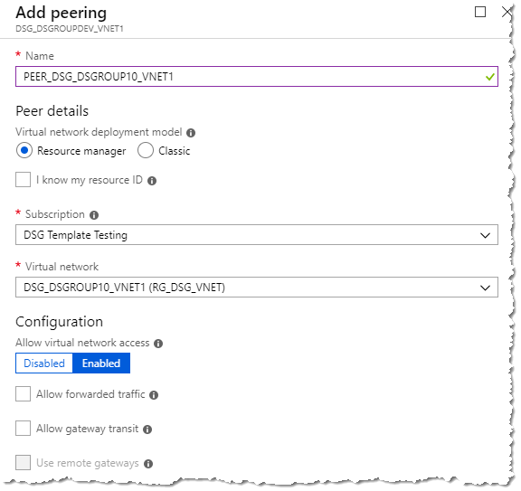

- Change to the new **DSG subscription**, open the virtual network at `Resource groups -> RG_DSG_VNET -> DSG_DSGROUP<dsg-id>_VNET1`

- Select "**Peerings"** from the left-hand navigation

- Add a new "Peering"

- Configure the Peering as follows:

  - Name: `PEER_<shm-slug>_VNET1`, where `<shm-slug>` is `DSGROUPDEV` for the test environment and `SHM` for the production environment.

  - Subscription: Select the Safe Haven management subscription

  - Virtual Network: Select the SHM virtual network (`DSG_<shm-slug>_VNET1`)

  - Set "Allow virtual network access" to "Enabled" and leave the remaining checkboxes **un**checked

    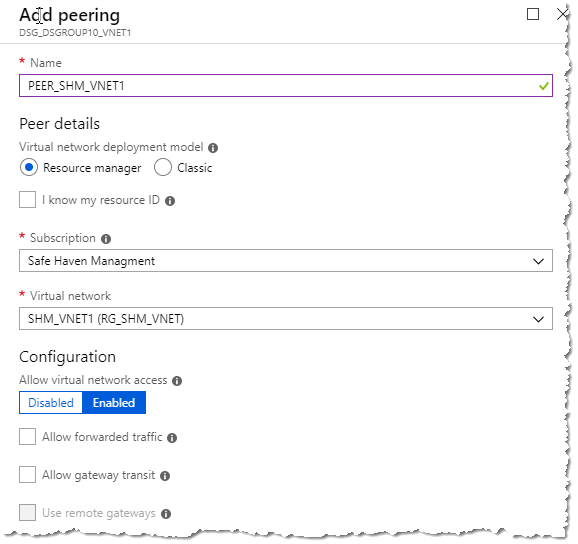

- Once provisioned the networks will be connected.

- In the **DSG subscription** open `Resource Groups -> RG_DSG_VNET -> DSG_VNET1_GW`
  
  - Select "**Point to Site Configuration**" fromt he left-hand navigation

  - Download the VPN client from the "Point to Site configuration" menu

    

  - Install the VPN on your PC and test. See the [Configure a VPN connection to the Safe Haven Management VNet](#Configure-a-VPN-connection-to-the-Safe-Haven-Management-VNet) section in the [Prerequisites](#Prerequisites) list above for instructions. You can re-use the same client certificate as used for the VPN to the management VNet gateway.

## 3. Deploy DSG Domain Controller

### Deploy DC VM

- Ensure you have the latest version of the Safe Haven repository from [https://github.com/alan-turing-institute/data-safe-haven](https://github.com/alan-turing-institute/data-safe-haven).

- Change to the `new_dsg_environment/dsg_deploy_scripts/03_create_dc/` directory within the Safe Haven repository

- Ensure you are logged into the Azure within PowerShell using the command: `Connect-AzAccount`

- Ensure the active subscription is set to that you are using for the new DSG environment using the command: `Set-AzContext -SubscriptionId "<dsg-subscription-name>"`

- Run the `./Create_AD_DC.ps1` script, entering the DSG ID when prompted

- The deployment will take around 20 minutes. Most of this is running the setup scripts after creating the VM.

### Create temporary SAS token

- Once deployment is complete, generate a new account-level SAS token with read-only access to the DSG artifacts storage account in the Safe Haven Management Test subscription by running the following commands from the `data-safe-haven/new_dsg_environment/dsg_deploy_scripts/` directory.
  - `Import-Module ./GenerateSasToken.psm1 -Force` (the `-Force` flag ensure that the module is reloaded)
  - `New-AccountSasToken "<shm-subscription-name>" "RG_DSG_ARTIFACTS" "dsgxartifacts"  Blob,File Service,Container,Object "rl"  (Get-AzContext).Subscription.Name`

### Configure DSG Active Directory Domain Controller

- Connect to the new Domain controller via Remote Desktop client over the DSG VPN connection at the IP address `<dsg-identity-subnet-prefix>.250` (e.g. 10.250.x.250)

- Login with the admin credentials for the DSG DC, which were created and stored in the Safe Haven Management KeyVault by the DC deployment script

- Download the `DSG-DC.zip` scripts file using an SAS-authenticated URL of the form `https://dsgxartifacts.file.core.windows.net/configpackages/Scripts/DSG-DC.zip<sas-token>` (append the SAS token generated above -- starts `?sv=`, with no surrounding quotes)

- You may be prompted to add the site to a whitelist. If so, then add the site and restart Internet Explorer.

- Create the `C:\Scripts` folder, copy the zip file there from the download folder then extract the file contents to the `Scripts` folder (**not** to a new `DSG-DC` folder). To do this right-click on the zip file and select "extract all", ensuring the destination is just `C:\Scripts`.

- Open a PowerShell command window with elevated privileges - make sure to use the `Windows PowerShell` application, **not** the `Windows PowerShell (x86)` application. The required server managment commandlets are not installe don the `x86` version.

- Change to `C:\Scripts`

- Set the VM to United Kingdom/GMT timezone by running the following command:

  
  | **Command**       |      **Parameters** |  **Description** |
  | -- | -- | -- |
  |`Set_OS_Language.ps1`  |  n/a  |             n/a |
  
- Setup the accounts on the Active Directory by running the following command with these parameters.
 
  |  **Command**            |          **Parameters**  |  **Description** |
  | -- | -- | -- |
  | `Create_Users_Groups_OUs.ps1`  | -domain  |        DSG NetBIOS name i.e. DSGROUP10 |

- Configure the DNS on the server by running the following command with these parameters

  | **Command** |     **Parameters** |   **Description** |
  | -- | -- | -- |
  |  `ConfigureDNS.ps1`  | -SubnetIdentity  | First 3 octets of the Identity subnet IP address space e.g. 10.250.0 |
  | |                     -SubnetRDS |        First 3 octets of the Identity subnet IP address space e.g. 10.250.1 |
  | |                     -SubnetData        | First 3 octets of the Identity subnet IP address space e.g. 10.250.2 |
  | |                     -mgmtfqdn |         Enter FQDN of management domain i.e. turingsafehaven.ac.uk (production) or dsgroupdev.co.uk (test) |
  | |                     -mgmtdcip |         Enter IP address of management DC i.e. 10.220.0.250 (production) or 10.220.1.250 (test)|


- Configure Active Directory group polices, to install the polices run the following command with these parameters

  |  **Command** |        **Parameters**|   **Description** |
  | -- | -- | -- |
  |  `ConfigureGPOs.ps1` |  -backuppath |     `C:\Scripts\GPOs` -- this is the default path, if you copy the scripts to another folder you'll need to change this. \
  | |                       -domain |          DSG NetBIOS name i.e. DSGROUP10 |

- From the "Server Management" application, select `Tools -> Group Policy Management`

- Expand the tree until you open the "Group Policy Objects" branch

  

- Right click on "All Servers - Local Administrators" and select "Edit"

- Expand `Computer Configuration -> Policies -> Windows Settings -> Security Settings` and click on "Restricted Groups"

- Double click on "Administrators" shown under "Group Name" on the right side of the screen

- Select both of the entries in the "Members of this group" and click "Remove"

  

- Click `Add -> Browse` and enter:

    - SG DSGROUP`<dsg-id>` Server Administrators

    - Domain Admins

- Click the "Check Names" button to resolve the names

  

- Click `OK -> OK`. The "Administrators Properties" box will now look like this

  

- Click "OK" and close the policy window

- Right click on `Session Servers -> Remote Desktop Control` and click "Edit"

- Expand `User Configuration -> Policies -> Administrative Templates` and click "Start Menu & Taskbar"

- Double click "Start Layout" located in the right window

- Update the path shown to reflect the correct FQDN

  

- Click "OK" when done and close all Group Policy windows.

- Open `C:\Scripts` in "File Explorer" and copy the "ServerStartMenu" folder

- Navigate to `F:\SYSVOL\domain\scripts` and copy the "ServerStartMenu" folder here. Close "File Explorer"

- Restart the server

### Create Domain Trust

- To enable authentication to pass from the DSG to the management active directory we need to establish a trust.

- Login to the Safe Haven Management domain controller with a domain administrator account

- Open "Windows Administrative Tools" and then the "Active Directory Domains and Trust" MMC

- Right click the management domain name and select "Properties"

- Click on "Trusts" tab then click "New Trust"

  

- Click "Next"

  | | |
  | -- | -- |
  | Trust Name:                                           | FQDN of the DSG i.e. dsgroup10.co.uk | 
  | Trust Type:                                           | External Trust |
  | Direction of trust:                                   | Two-way |
  | Sides of trust:                                       | Both this domain and the specified domain |
  |   User name and password:                               | Domain admin user on the DSG domain. Format: `<DOMAIN\Username>. User is "atiadmin ". See DSG DC admin secret in management KeyVault for password. |
  | Outgoing Trust Authentication Level-Local Domain:     | Domain-wide authentication  |
  | Outgoing Trust Authentication Level-Specified Domain: | Domain-wide authentication |

- Click `Next -> Next`

  - Select "Yes, confirm the outgoing trust" -\> "Next"

  - Select "Yes, confirm the incoming trust" -\> "Next"

    

- Click "Finish" upon successful trust creation.

- Click "OK" to the informational panel on SID Filtering.

- Close the "Active Directory Domains and Trust" MMC

## 4. Deploy Remote Desktop Service Environment

### Create RDS VMs

- Ensure you have the latest version of the Safe Haven repository from [https://github.com/alan-turing-institute/data-safe-haven](https://github.com/alan-turing-institute/data-safe-haven).

- Change to the `new_dsg_environment/dsg_deploy_scripts/04_create_rds/` directory of the Safe Haven repository

- Ensure you are logged into the Azure within PowerShell using the command: `Connect-AzAccount`

- Ensure the active subscription is set to that you are using for the new DSG environment using the command: `Set-AzContext -SubscriptionId "<dsg-subscription-name>"`

- Run the `./Create_RDS_Servers.ps1` script, providing the DSG ID when prompted

- The deployment will take around 10 minutes to complete.

### Generate temporary SAS token
- Once the deployment in complete, generate a new account-level SAS token with read-only access to the DSG artifacts storage account in the Safe Haven Management Test subscription by running the following commands from the `data-safe-haven/new_dsg_environment/dsg_deploy_scripts/` directory.
  - `Import-Module ./GenerateSasToken.psm1 -Force` (the `-Force` flag ensure that the module is reloaded)
  - `New-AccountSasToken "<shm-subscription-name>" "RG_DSG_ARTIFACTS" "dsgxartifacts"  Blob,File Service,Container,Object "rl"  (Get-AzContext).Subscription.Name`

### Configure Remote Desktop Services

#### Configuration on Domain Controller

- Connect to the **DSG Domain Controller** via Remote Desktop client over the VPN connection

- Login with local user `atiadmin` and the DSG DC admin password from the SHM KeyVault

- In the "Server Management" app, click `Tools -> Active Directory Users and Computers`

- Expand the "Computers" Container

- Drag the "RDS" computer object to the "DSGROUP`<dsg-id>` Service Servers" OU, click "YES" to the warning

- Select both the "RDSSH1" and "RDSSH2" objects and drag them to the "DSGROUP`<dsg-id>` RDS Session Servers" OU, click "YES" to the warning

  

#### Initial configuration of RDS Gateway
- Connect to the **DSG Remote Desktop Gateway (RDS)** server via Remote Desktop client over the DSG VPN connection

- Login with domain user `<shm-domain>\atiadmin` and the **DSG DC** admin password from the SHM KeyVault (all DSG Windows servers use the same admin credentials)

- Download the `DSG-RDS.zip` scripts file using an SAS-authenticated URL of the form `https://dsgxartifacts.file.core.windows.net/configpackages/Scripts/DSG-RDS.zip<sas-token>` (append the SAS token generated above -- starts `?sv=`, with no surrounding quotes)

- You may be prompted to add the site to a whitelist. If so, then add the site and restart Internet Explorer.

- Create the `C:\Scripts` folder, copy the zip file there from the download folder then extract the file contents to the "Scripts" folder (not to a new `DSG-RDS` folder). To do this right-click on the zip file and select "extract all", ensuring the destination is just `C:\Scripts`.

- Open a PowerShell command window with elevated privileges - make sure to use the `Windows PowerShell` application, **not** the `Windows PowerShell (x86)` application. The required server managment commandlets are not installe don the `x86` version.

- Change to `C:\Scripts`

- Prepare the VM with the correct country/time-zone and add additional prefixes to the DNS by running the following command:
  
  | **Command**   | **Parameters** |  **Description** |
  | -- | -- | -- |
  | `OS_Prep.ps1`  | -domain  |        Enter the NetBIOS name of the domain i.e. DSGROUP`<dsg-id>`
  | |                 -mgmtdomain |     Enter the FQDN of the management domain i.e. turingsafehaven.ac.uk for production or dsgroupdev for test|
  -------------- ---------------- --------------------------------------------------------------------

#### Configuration of RDS remote apps on on RDS Session Hosts
##### RDS Session Server 1 (Remote app server)

- Connect to the **RDS Session Server 1 (RDSSH1)** via Remote Desktop client over the DSG VPN connection

- Login with domain user `<shm-domain>\atiadmin` and the **DSG DC** admin password from the SHM KeyVault (all DSG Windows servers use the same admin credentials)

- Repeat the "OS Prep" process you just performed on the RDS Gateway (i.e. login, transfer the `DSG_RDS.zip` scripts file and run the `OS_Prep.ps1` script on each VM)

- Download the applications to be served via RDS

  - Download WinSCP using an SAS-authenticated URL of the form `https://dsgxartifacts.file.core.windows.net/configpackages/Packages/WinSCP-Setup.exe<sas-token>` (append the SAS token generated above -- starts "?sv=", with no surrounding quotes)

  - Download PuTTY using an SAS-authenticated URL of the form `https://dsgxartifacts.file.core.windows.net/configpackages/Packages/putty.msi<sas-token>` (append the SAS token generated above -- starts "?sv=", with no surrounding quotes)

  - Download Chome using an SAS-authenticated URL of the form `https://dsgxartifacts.file.core.windows.net/configpackages/Packages/GoogleChromeStandaloneEnterprise64.msi<sas-token>` (append the SAS token generated above -- starts "?sv=", with no surrounding quotes)

- Install the downloaded packages

- Once installed logout of the server

##### RDS Session Server 2 (Presentation VM)

- Connect to the **RDS Session Server 2 (RDSSH1)** via Remote Desktop client over the DSG VPN connection

- Login with domain user `<shm-domain>\atiadmin` and the **DSG DC** admin password from the SHM KeyVault (all DSG Windows servers use the same admin credentials)

- Repeat the "OS Prep" process you just performed on the RDS Gateway (i.e. login, transfer the `DSG_RDS.zip` scripts file and run the `OS_Prep.ps1` script on each VM)

- Download the applications to be served via RDS
  - Download WinSCP using an SAS-authenticated URL of the form `https://dsgxartifacts.file.core.windows.net/configpackages/Packages/WinSCP-Setup.exe<sas-token>` (append the SAS token generated above -- starts "?sv=", with no surrounding quotes)

  - Download PuTTY using an SAS-authenticated URL of the form `https://dsgxartifacts.file.core.windows.net/configpackages/Packages/putty.msi<sas-token>` (append the SAS token generated above -- starts "?sv=", with no surrounding quotes)

  - Download Chome using an SAS-authenticated URL of the form `https://dsgxartifacts.file.core.windows.net/configpackages/Packages/GoogleChromeStandaloneEnterprise64.msi<sas-token>` (append the SAS token generated above -- starts "?sv=", with no surrounding quotes)

- Install the downloaded packages

- Once installed logout of the server

#### Configuration of RDS services on RDS Gateway

- Connect to the **DSG Remote Desktop Gateway (RDS)** server via Remote Desktop client over the DSG VPN connection

- Login with domain user `<shm-domain>\atiadmin` and the **DSG DC** admin password from the SHM KeyVault (all DSG Windows servers use the same admin credentials)

- Open a PowerShell command window with elevated privileges - make sure to use the `Windows PowerShell` application, **not** the `Windows PowerShell (x86)` application. The required server managment commandlets are not installe don the `x86` version.

- Change to `C:\Scripts`

- Install the RDS services by running the following command:

  | **Command**              | **Parameters** | **Description**  |
  | -- | -- | -- |
  | `DeployRDSEnvironment.ps1` | -domain        | Enter the NetBIOS name of the domain i.e. DSGROUP`<dsg-id>` |
  |                          | -dsg           | Enter the DSG name i.e. DSGROUP`<dsg-id>`|
  |                          | -mgmtdomain    | Enter NetBIOS name of the management domain i.e. TURINGSAFEHAVEN (production) DSGROUPDEV (test) 
  |                          | -ipaddress     | Enter the first three octets of the Subnet-Data subnet as per the checklist i.e. 10.250.x+2     (where x is the base address)|

- The RDS deployment will now start, this will take around 10 minutes to complete, the session servers will reboot during the process.

- Once complete open Server Manager, right click on "All Servers" and select "Add Servers"

  

- Enter "rds" into the "Name" box and click "Find Now"

- Select the two session servers (RDSSH1, RDSSH2) and click the arrow to add them to the selected box, click "OK" to finish

  

### Configure DNS record for RDS server

To make this Remote Desktop Service accessible from the internet an `A` record will need to be added to the DNS Zone for the domain associated with the DSG.

- Create a DNS zone for the DSG in the SHM subscription at `Resource Groups -> RG_SH_DNS -> dgroup<dsg-id>.co.uk`. - Create an `A` record with the name `rds` and as its value matching the external IP address that is assigned to the "RDS_NIC1" resource within the Azure Portal. 

#### Configuration of SSL on RDS Gateway

The next step is to install a SSL Certificate onto the RDS Gateway server. This has to be a certificate that is issued from a Certificate Authority and not self-signed.

##### Generate a Certificate Signing Request (CSR)

- Connect to the **DSG Remote Desktop Gateway (RDS)** server via Remote Desktop client over the DSG VPN connection. Ensure that the Remote Desktop client configuration shares a folder on your local machine with the RDS Gateway.

- Login with domain user `<shm-domain>\atiadmin` and the **DSG DC** admin password from the SHM KeyVault (all DSG Windows servers use the same admin credentials)

- From the Server Manager dashboard select `Tools -> Internet Information Service (IIS) Manager`

-	Open “Server Certificates” and click “Create Certificate Request”

- Fill in the form as below. It is **critically important** that the certificate common name matches the FQDN of the RDS server i.e. `rds.dsgroup<dsg-id>.co.uk`.

  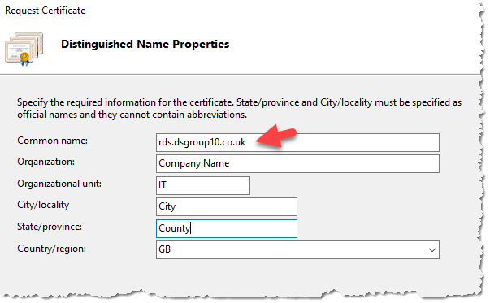

- Set the "Bit length" to 2048 (this can be set higher but check with your CA provider)

  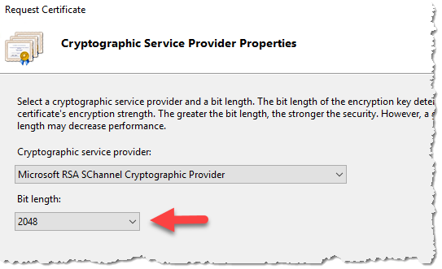

- Save the certificate request file to a TXT file to be used to order the SSL Certificate.

- Copy the CSR from the RDS server to the folder on your local computer that you shared with the RDS Gateway when you connected to it.

##### Get an SSL certificate issued by a CA for the RDS server

###### A. Use Let's Encrypt as the CA

  -   [Install Certbot](https://certbot.eff.org/) on your computer if required

  -   Run Certbot, passing in custom folders for config, work and logs directories. This will automatically create a new Let\'s Encrypt account for this particular pairing of Certbot installation and custom directory.

  -   `certbot --config-dir ~/tsh-certbot/config --work-dir ~/tsh-certbot/work --logs-dir ~/tsh-certbot/logs certonly --manual --preferred-challenges "dns" --agree-tos -m <email-for-expiry-notifications> -d <rds-fqdn> --csr <path-to-csr>`, where `<rds-fqdn>` is the fully qualified domain name of the RDS server (e.g. `rds.dsgroup10.co.uk`)

  -   When presented with the DNS challenge from Certbot, add a record to the DNS Zone for the DSG domain with the following properties. The DNS Zone is located in the SHM subscription at `Resource Groups -> RG_DSG_DNS -> dgroup<dsg-id>.co.uk`).

      -   **Name:** `_acme-challenge.rds`)

      -   **Type: TXT

      -   **TTL:*** 30 seconds

      -   **Value:** The value provided by Certbot (a long random looking string)

    -   Wait for Let\'s Encrypt to verify the challenge

    -   Copy `~/tsh-certbot/config/live/<dsg-fq-domain\>/fullchain.pem` to the folder on your local computer that you shared with the RDS Gateway when you connected to it.

    -   Securely delete the `~/tsh-certbot` directory. Note that, when using a CSR, neither the CSR nor the signed certificate files are sensitive. However, the private key in the `accounts` subfolder is now authorised to create new certs for the DSG domain, which is sensitive

##### Install the CA certificate on the RDS Server

 Once the certificate has been issued by the CA this needs to be installed onto the server.

 - Connect to the **DSG Remote Desktop Gateway (RDS)** server via Remote Desktop client over the DSG VPN connection. Ensure that the Remote Desktop client configuration shares a folder on your local machine with the RDS Gateway.

- Login with domain user `<shm-domain>\atiadmin` and the **DSG DC** admin password from the SHM KeyVault (all DSG Windows servers use the same admin credentials)

- From the Server Manager dashboard select "Tools -> Internet Information Service (IIS) Manager"
 
- Open Certificates and select "Complete Certificate Request"

- Browse to the folder that you shared with the RDS Gateway from your local computer when you connected to it.

- Select the certificate file provided by the CA

- Set the friendly name to match the common name you provided in the certificate request (i.e. `dsgroup<dsg-id>.co.uk`).

  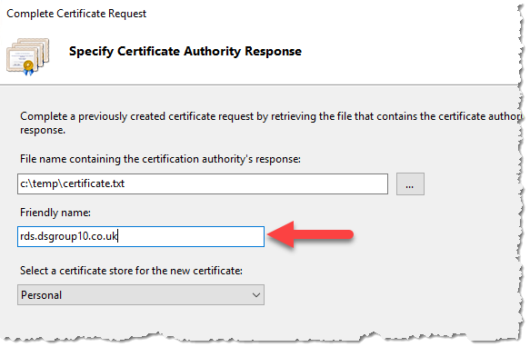

- Click "OK" to complete the process

- Open "MMC" and add the "Certificates" snap-in targeting the "Computer Account" on the local computer

- Expand `Personal -> Certificates` and locate the CA certificate

- Export the certificate with it's private key

  - Right click this certificate and click on `All Tasks -> Export`

  - Select "Yes, export the private key" and click "Next"
  
  - Select the "Personal Information Exchange" format and click "Next"
  
  - Check the "Password" box, enter a password and click "Next"
  
  - Click "Browse", select a location to save the certificate and provide a name. Click "Next" then "Finish"

- Export the certificate without it's private key

  - Right click this certificate and click on `All Tasks -> Export`

  - Select "No, do not export the private key" and click "Next"
  
  - Select the "DER encoded binary X.509" format and click "Next"
  
  - Check the "Password" box, enter a password and click "Next"
  
  - Click "Browse", select a location to save the certificate and provide a name. Click "Next" then "Finish"

- Open a PowerShell command window with elevated privileges - make sure to use the `Windows PowerShell` application, **not** the `Windows PowerShell (x86)` application. The required server managment commandlets are not installe don the `x86` version.

- Navigate to C:\\Scripts

- Add the new certificate and private key to the Remote Desktop service by running the following command:

  |  **Command** |     **Parameters** |   **Description** |
  | -- | -- | -- |
  |  `AddSSLCert.ps1`  | -Sslpassword |     The private key password |
  | |                   -domain |          Enter the NetBIOS name of the domain i.e. DSGROUP`<dsg-id>` |
  | |                   -certpath |        The path to the `.pfx` file you exported the certificate **including** private key to earlier|

### Configure Remote Desktop Web Client on the RDS Gateway

 - Connect to the **DSG Remote Desktop Gateway (RDS)** server via Remote Desktop client over the DSG VPN connection. Ensure that the Remote Desktop client configuration shares a folder on your local machine with the RDS Gateway.

- Login with domain user `<shm-domain>\atiadmin` and the **DSG DC** admin password from the SHM KeyVault (all DSG Windows servers use the same admin credentials)

- Open a PowerShell command window with elevated privileges - make sure to use the `Windows PowerShell` application, **not** the `Windows PowerShell (x86)` application. The required server managment commandlets are not installe don the `x86` version.

- Install the Remote Desktop Web Client PowerShell Module:
   
  - Run `Install-Module -Name PowerShellGet -Force` within Powershell (Enter "Y" when prompted)

  - Exit the PowerShell window and re-open a new one (with elevated permissions, making sure it is still the correct PowerShell app)

  - Run `Install-Module -Name RDWebClientManagement` within Powershell (entering- Enter "A" when prompted, then "A" again to accept the EULA)

  - Run `Install-RDWebClientPackage`

- Install the SSL certicate for the Remote Desktop Web Client using `Import-RDWebClientBrokerCert <.cer-file-path>`, where `<.cer-file-path>` is the `.cer` file you exported the certificate **without** private key to earlier.

- Publish the Remote Desktop Web Client using: `Publish-RDWebClientPackage -Type Production -Latest` (don't worry about the warning `WARNING: Using the Remote Desktop web client with per-device licensing is not supported.`. We are not using per-device licencing)

### Adding new DSG RDS Server to the SHM NPS server

 - Connect to the **SHM NPS** server via Remote Desktop client over the SHM VPN connection.

- Login with domain user `<shm-domain>\atiadmin` and the **SHM DC** admin password from the SHM KeyVault (all SHM Windows servers use the same admin credentials)

- In "Server Manager", select `Tools -> Network Policy Server`

- Expand `NPS (Local) -> RADIUS Clients and Servers -> RADIUS Clients`

  

- Right click `RADIUS Clients -> New`

- Enter the friendly name of the server (best practice use the FQDN of the RDS server)

- Add the IP address of the RDS server

- Set the "Shared Secret" to the value of the `sh-management-radius-secret` in the SHM KeyVault (this must be the same as the "Shared secret" used when configuring the DSG RDS Gateway security in the next step)

  {width="2.5739129483814525in" height="3.1474507874015747in"}

- Click "OK" to finish

### Configure security on the RDS Gateway

 - Connect to the **DSG Remote Desktop Gateway (RDS)** server via Remote Desktop client over the DSG VPN connection. Ensure that the Remote Desktop client configuration shares a folder on your local machine with the RDS Gateway.

- Login with domain user `<shm-domain>\atiadmin` and the **DSG DC** admin password from the SHM KeyVault (all DSG Windows servers use the same admin credentials)

- In "Server Manager", open `Tools -> Remote Desktop Services -> Remote Desktop Gateway Manager`

  

- Right click the RDS server object and select "Properties"

  

- Select "RD CAP Store" tab

- Select the "Central Server Running NPS"

- Enter the IP address of the NPS within the management domain (`10.220.1.249` for `test` SHM, `10.220.0.249` for production SHM)

- Set the "Shared Secret" to the value of the `sh-management-radius-secret` in the SHM KeyVault (this must be the same as the "Shared secret" used when adding the DSG RDS to the SHM NPS earlier)

  

- Click "OK" to close the dialogue box.

- Expand the RDS server object and select `Policies -> Resource Authorization Policies`

- Right click on "RDG_AllDomainControllers" and select "Properties`

  

- On the "User Groups" tab click "Add"

- Click "Locations" and select the management domain

- Enter the "SG" into the "Enter the object names to select" box and click on "Check Names" select the correct "Research Users" security group from the list i.e. SG DSGROUP`<dsg-id>` Research Users.

  

- Click "OK" and the group will be added to the "User Groups" screen

  

- Click "OK" to exit the dialogue box

- Right click on "RDG_RDConnectionBrokers" policy and select "Properties"

  

- Repeat the process you did for the "RDG_AllDomainComputers" policy and add the correct Research Users security group.

### Install software on Presentation VM (RDSSSH2)
- Ensure you have the latest version of the Safe Haven repository from [https://github.com/alan-turing-institute/data-safe-haven](https://github.com/alan-turing-institute/data-safe-haven).

- Change to the "data-safe-haven/new\_dsg\_environment/dsg_deploy_scripts/04_create_rds/" directory

- Ensure you are logged into the Azure within PowerShell using the command: Connect-AzAccount

- Ensure the active subscription is set to that you are using for the new DSG environment using the command: Set-AzContext -SubscriptionId \"DSG Template Testing\"

- Generate a new account-level SAS token with read-only access to the DSG artifacts storage account in the Safe Haven Management Test subscription by running the following commands from the `data-safe-haven/new_dsg_environment/dsg_deploy_scripts/` directory.
  - `Import-Module ./GenerateSasToken.psm1 -Force` (the `-Force` flag ensure that the module is reloaded)
  - `New-AccountSasToken "<SH-Management-Subscription-Name>" "RG_DSG_ARTIFACTS" "dsgxartifacts"  Blob,File Service,Container,Object "rl"  (Get-AzContext).Subscription.Name`

- Connect to the "Remote Desktop Session Server 2" (RDSSH2) via Remote Desktop

- Download OpenOffice using an SAS-authenticated URL of the form `https://dsgxartifacts.file.core.windows.net/configpackages/Packages/Apache_OpenOffice.exe<sas-token>` (append the SAS token generated above -- starts "?sv=", with no surrounding quotes)

- Download TexLive using an SAS-authenticated URL of the form `https://dsgxartifacts.file.core.windows.net/configpackages/Packages/TexLive-Setup.exe<sas-token>` (append the SAS token generated above -- starts "?sv=", with no surrounding quotes)

- Download WinEdt using an SAS-authenticated URL of the form `https://dsgxartifacts.file.core.windows.net/configpackages/Packages/WinEdt-Setup.exe<sas-token>` (append the SAS token generated above -- starts "?sv=", with no surrounding quotes)

- Install the downloaded packages

- Once installed logout of the server

## Deploy Data Server

### Create Dataserver VM

- Ensure you have the latest version of the Safe Haven repository from [https://github.com/alan-turing-institute/data-safe-haven](https://github.com/alan-turing-institute/data-safe-haven).

- Change to the `new_dsg_environment/dsg_deploy_scripts/05_create_dataserver/` directory in the Safe Haven repository.

- Ensure you are logged into the Azure within PowerShell using the command: `Connect-AzAccount`

- Ensure the active subscription is set to that you are using for the new DSG environment using the command: `Set-AzContext -SubscriptionId "DSG Template Testing"`

- Run the `./Create_Data_Server.ps1` script, providing the DSG ID when prompted.

- The deployment will take around 15 minutes to complete

### Generate temporary SAS token
- Once the deployment in complete, generate a new account-level SAS token with read-only access to the DSG artifacts storage account in the Safe Haven Management Test subscription by running the following commands from the `data-safe-haven/new_dsg_environment/dsg_deploy_scripts/` directory.
  - `Import-Module ./GenerateSasToken.psm1 -Force` (the `-Force` flag ensure that the module is reloaded)
  - `New-AccountSasToken "<shm-subscription-name>" "RG_DSG_ARTIFACTS" "dsgxartifacts"  Blob,File Service,Container,Object "rl"  (Get-AzContext).Subscription.Name`

### Configure Dataserver on Domain Controller

- Connect to the **DSG Domain Controller** via Remote Desktop client over the DSG VPN connection

- Login with local user `atiadmin` and the **DSG DC** admin password from the SHM KeyVault

- In the "Server Management" app, click `Tools -> Active Directory Users and Computers`

- Expand the "Computers" Container

- Drag the "DATASERVER" computer object to the "DSGROUP`<dsg-id>` Data Servers" OU, click "YES" to the warning

  \

#### Configure Dataserver
[TODO: Replace with remote script execution (untested local and remote `Configure_Dataserver_*.ps1` scripts already in version control)]

- Connect to the new **Data Server** via Remote Desktop client over the DSG VPN connection

- Login with local user `atiadmin` and the **DSG DC** admin password from the SHM KeyVault

- Download the `DSG-DATASERVER .zip` scripts file using an SAS-authenticated URL of the form `https://dsgxartifacts.file.core.windows.net/configpackages/Scripts/DSG-DATASERVER.zip<sas-token>`(append the SAS token generated above -- starts `?sv=`, with no surrounding quotes)

- You may be prompted to add the site to a whitelist. If so, then add the site and restart Internet Explorer.

- Create the `C:\Scripts` folder, copy the zip file there from the download folder then extract the file contents to the "Scripts" folder (not to a new `DSG-DATASERVER` folder). To do this right-click on the zip file and select "extract all", ensuring the destination is just `C:\Scripts`.

- Open a PowerShell command window with elevated privileges - make sure to use the `Windows PowerShell` application, **not** the `Windows PowerShell (x86)` application. The required server managment commandlets are not installe don the `x86` version.

- Change to `C:\Scripts`

- Prepare the VM with the correct country/time-zone and add additional prefixes to the DNS by running the following command:

  |  **Command** |                 **Parameters** |   **Description** |
  | -- | -- | -- |
  | `Configure_DataServer.ps1` |   -mgmtdomain |      Enter the NetBIOS name of the management domain i.e. "dsgroupdev" for test or TURINGSAFEHAVEN for production |
  | |                              -dsgdomain |       Enter the NetBIOS name of the domain i.e. DSGROUP`<dsg-id>` |
  | |                              -dsg |             Enter the DSG name i.e. DSGROUP`<dsg-id>` |


## Deploy Web Application Servers (Gitlab and HackMD)

- Note: Before deploying the Linux Servers ensure that you've allowed GitLab Community Edition to be programmatically deployed within the Azure Portal.

- Ensure you have the latest version of the Safe Haven repository from [https://github.com/alan-turing-institute/data-safe-haven](https://github.com/alan-turing-institute/data-safe-haven).

- Change to the `new_dsg_environment/dsg_deploy_scripts/06_create_shared_servers/` directory of the Safe Haven repository.

- Ensure you are logged into the Azure within PowerShell using the command: `Connect-AzAccount`

- Ensure the active subscription is set to that you are using for the new DSG environment using the command: `Set-AzContext -SubscriptionId "<dsg-subscription-name>"`

- Run the `./Create_Linux_Servers.ps1` script, providing the DSG ID when prompted

- The deployment will take around 15 minutes to complete

### Configure HackMD Server

- Connect to the HackMD server with Putty (or any SSH client) Login with the admin credentials you entered with you provisioned the VM previously

- Update the local host file


| **Command**          | **Actions**                                                      |
| -- | -- |
| `sudo nano /etc/hosts` | Add the line:                                                     \<Subnet-Data\>.152 hackmd hackmd.dsgroupX.co.uk                 
|                      |                                                                  |
|                      | \<Subnet-Data\> = IP Address of the Subnet-Data as per checklist (Change X for correct group number)

-Update the time-zone


| **Command**                  | **Actions**         |
| -- | -- |
| sudo dpkg-reconfigure tzdata | Select -\> "Europe" |                              |                     |
|                              | Select -\> "London" |

#### Install Docker

  **Command**
```console
> sudo apt-get update
> sudo apt upgrade
> sudo apt install apt-transport-https ca-certificates curl software-properties-common
> curl -fsSL https://download.docker.com/linux/ubuntu/gpg | sudo apt-key add -
> sudo add-apt-repository "deb [arch=amd64] https://download.docker.com/linux/ubuntu artful stable"
> sudo apt update
> sudo apt install docker-ce
> sudo docker run hello-world
> sudo apt install docker-compose
> sudo git clone https://github.com/hackmdio/docker-hackmd.git
```

##### Configure HackMD

- Change to ./docker-hackmd

- Run command

  **Command**
  sudo nano docker-compose.yml

Change Version to 2

> 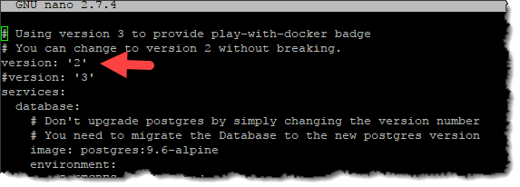

Add the following lines under "environment:"

| **Command**                    | **Value**                                                                         |
|-- | -- |
| \- HMD\_LDAP\_PROVIDERNAME=    | NetBIOS name of management domain i.e. turingsafehaven (lowercase)                |
| \- HMD\_LDAP\_URL=             | LDAP connection URL i.e. ldap://shmdc1.turingsafehaven.ac.uk                      |
| \- HMD\_LDAP\_BINDDN=          | Bind Path for LDAP user i.e.                                                      |
|                                |                                                                                   |
|                                | CN=DSGx HackMD LDAP,OU=Safe Haven Service Accounts,DC=turingsafehaven,DC=ac,DC=uk |
| - HMD\_LDAP\_BINDCREDENTIALS= | Password for the LDAP account above                                               |
| \- HMD\_LDAP\_SEARCHBASE=      | OU Path to the Research Users OU i.e.                                             |
|                                |                                                                                   |
|                                | OU=Safe Haven Research Users,DC=turingsafehaven,DC=ac,DC=uk                       |
| \- HMD\_LDAP\_SEARCHFILTER=    | (&(objectClass=user)(memberOf=CN=SG DSGROUP9 Research Users,OU=Safe Haven Security Groups,DC=dsgroupdev,DC=co,DC=uk)(userPrincipalName={{username}}))                                                  |
| \- HMD\_USECDN=                | false                                                                             |
| \- HMD\_EMAIL=                 | false                                                                             |
| \- HMD\_ALLOW\_FREEURL=        | true                                                                              |
| \- HMD\_ALLOW\_ANONYMOUS=      | false                                                                             |

> 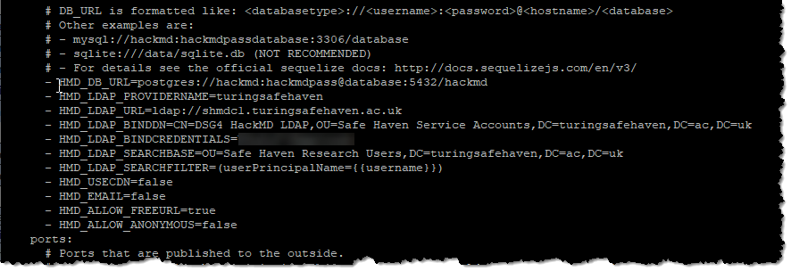

- Start HackMD container

  **Command**
  sudo docker-compose up -d


### Configure GitLab Server


- Connect to the GitLab server with Putty (or any SSH client) Login with the admin credentials you entered with you provisioned the VM previously

- Update the local host file


| **Command**          | **Actions**                                                      |
| -- | -- |
| `sudo nano /etc/hosts` | Add the line:                                                    |
|                      |                                                                  |
|                      | \<Subnet-Data\>.151 gitlab gitlab.dsgroupX.co.uk                 |
|                      |                                                                  |
|                      | \<Subnet-Data\> = IP Address of the Subnet-Data as per checklist |
|                      |                                                                  |
|                      | Change X for correct group number                                |


Update the time-zone


| **Command**                  | **Actions**         |
| -- | -- |
| `sudo dpkg-reconfigure tzdata` | Select -\> "Europe" |
|                              |                     |
|                              | Select -\> "London" |

- Identify the data disk, noting ID


  **Command**
  sudo lshw -C disk

Create partition on the data drive


| **Command**         | **Detail**                                 |
| -- | -- |
| `sudo fdisk /dev/xxx` | \- xxx = disk name as noted above i.e. sdc |
|                     |                                            |
|                     | \- Command: n                              |
|                     |                                            |
|                     | \- Partition type: Primary                 |
|                     |                                            |
|                     | \- Partition number: 1                     |
|                     |                                            |
|                     | \- First Sector: (accept default)          |
|                     |                                            |
|                     | \- Last Sector: (accept default)           |
|                     |                                            |
|                     | \- Command: W                              |
+---------------------+--------------------------------------------+

Format Partition:

```console
> sudo mkfs.ext4 /dev/sdc1 -L DataDrive
  ```

Capture Partition UUID

  ```console
  > sudo blkid
```


> 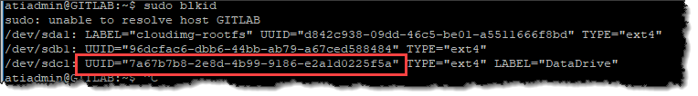

Backup FSTAB file

 ```console 
>  sudo cp /etc/fstab /etc/fstab.\$(date +%Y-%m-%d)
```


Open FSTAB file for editing:

 ```console
 >  sudo nano /etc/fstab
```


Add the following lines (Change UUID)


`UUID=\<ID CAPTURED ABOVE\> /media/gitdata ext4 defaults 0 2`

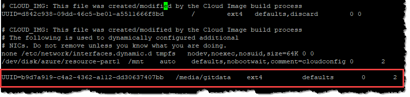

Create home folder mount point

 ```console
> sudo mkdir /media/gitdata
```

Mount drive:

 ```console
> sudo mount -a
```
Edit config file:

 ``` console
> sudo nano /etc/gitlab/gitlab.rb
  ```

| **Command**                    | **Value**                                                                                                              |
| -- | -- |
| Gilabrails\['ldap\_enabled'\]  | true                                                                                                                   |
| Host                           | dc.turingsafehaven.ac.uk                                                                                               |
|                                |                                                                                                                        |
|                                | DC = within the management domain                                                                                      |
| Method                         | Plain                                                                                                                  |
| bind\_dn                       | CN=DSGx GITLAB LDAP,OU=Safe Haven Service Accounts,DC=turingsafehaven,DC=ac,DC=uk                                      |
|                                |                                                                                                                        |
|                                | Replace X with DSG Number                                                                                              |
| password                       | Password of GitLab LDAP service account                                                                                |
| active\_directory              | true                                                                                                                   |
| allow user name or email login | true                                                                                                                   |
| block\_auto\_created\_users    | false                                                                                                                  |
| base                           | OU=Safe Haven Research Users,DC=turingsafehaven,DC=ac,DC=uk                                                            |
| User\_filter                   | (&(objectClass=user)(memberOf=CN=SG DSGx Research Users,OU=Safe Haven Security Groups,DC=turingsafehaven,DC=ac,DC=uk)) |

Note: Change domain where applicable

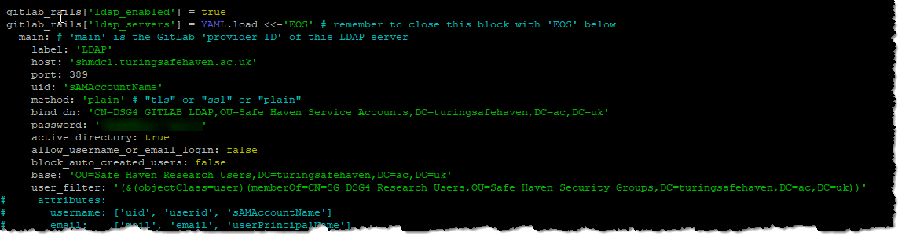

- Scroll down to "For setting up different data storing directory"

- Add the following under the "git\_data\_dir" entry

` git\_data\_dirs({ \"default\" =\> { \"path\" =\> \"/media/gitdata\" } })`
 

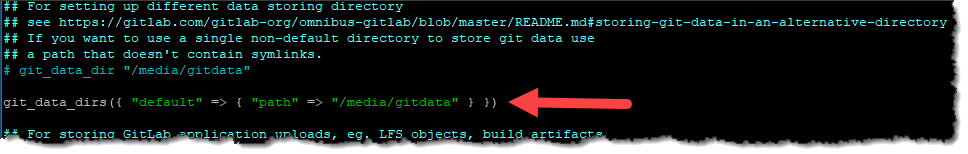

- Insure that EOS is at the end of the file and save it.

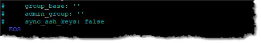

- Run the following command to reconfigure server:

```console
> sudo gitlab-ctl reconfigure
 ```

Do an LDAP check:

```console
> sudo gitlab-rake gitlab:ldap:check
```

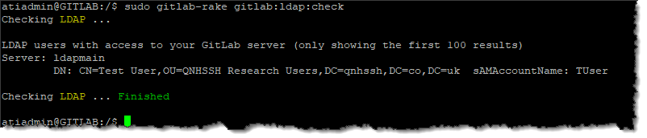

- Login to server via browser, the first password prompt sets the Root password

- Go to settings and switch off user sign up

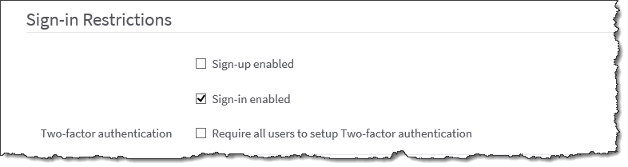

- Set restricted domain to FQDN of domain, ensure that the local DSG domain and management domain are added.

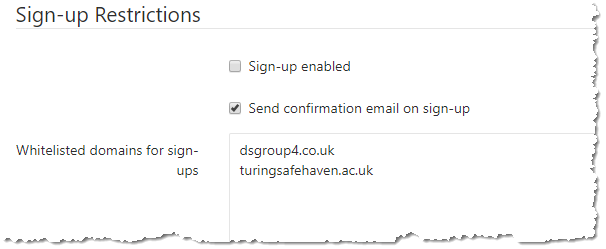

- Upgrade GitLab

 ```console
> sudo apt-get update
> sudo apt-get install gitlab-ce=9.5.6-ce.0
> sudo gitlab-ctl reconfigure
> sudo gitlab-ctl restart
> sudo apt-get update
> sudo apt-get install gitlab-ce=10.8.7-ce.0
> sudo gitlab-ctl reconfigure
> sudo gitlab-ctl restart
> sudo apt-get update
> sudo apt upgrade
> sudo gitlab-ctl reconfigure
> sudo gitlab-ctl restart
```

## Deploy sahred Compute VM
See the [Compute VM build and deployment guide](../azure-vms/README.md).
- Ensure you have carried out the steps in the "Pre-requistites" section
- Update the `deploy_compute_vm_to_turing_dsg.sh` script with the details of the new DSG.
  - Add the new <dsg-id> to the "Check DSG group ID is valid" line
  - Amend the "Set defaults for test and production environments" section to set the right defaults for the new DSG
  - Amend the "Overwite defaults for per-DSG settings" section to set the right DSG specific parameter values
- Deploy a new VM using `./deploy_compute_vm_to_turing_dsg.sh -g <dsg-id> -q 160`
as per the "Safe deployment to a Turing DSG environment" section


## Network Lock Down

- Once all the VMs have been deployed and updated before the DSG is ready the network on the RDS Session servers and Linux servers needs locking down to prevent them from accessing the internet.

- Open the Azure Portal

- Locate the "Network Security Groups" management pane.

- RDS Servers

  - Open "NSG_SessionHosts"

  - Associate the following NICs to this NSG

    - RDSSH1_NIC1

    - RDSSH2_NIC2

- Linux Servers

  - Open NSG_Linux_Servers

  - Associate the following NICs to this NSG

    - GITLAB_NIC1

    - HACKMD_NIC1

## Sever administration

- The following servers are created as a result of these instructions:
  - DSGxDC (domain controller)
  - DATASERVER
  - HACKMD
  - GITLAB
  - RDS
  - RDSSH1
  - RDSSH2
  - An initial shared compute VM
  
