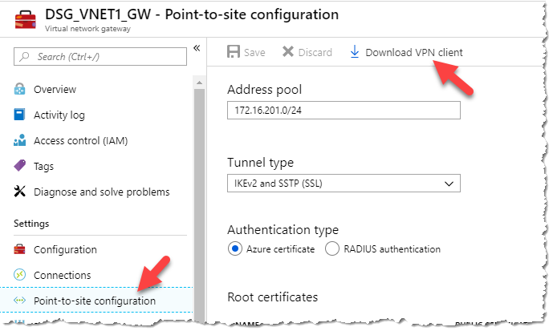
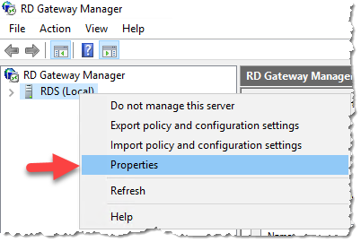

# Data Study Environment Build Instructions

## Prerequisites

### Access to required Safe Haven Management resources

- You need to be a member of the relevant "Safe Haven `<shm-id>` Admins" Security Group, where `<shm-id>` is `test` for test and `production` for production. This will give you the following access:

  - Administrative access to the relevant Safe Haven Management Azure subscription

  - Administrative access to the relevant Safe Haven Management Active Directory Domain

  - Administrative access to the relevant Safe Haven Management VMs

- #### Download a client VPN certificate for the Safe Haven Management VNet

  - Navigate to the Safe Haven Management (SHM) KeyVault in the Safe Haven Management subscription via `Resource Groups -> RG_DSG_SECRETS -> dsg-management-<shm-id>`, where `<shm-id>` is `prod` for the production SHM environment and `test` for the test SHM environment.

  - Once there open the "Certificates" page under the "Settings" section in the left hand sidebar.

  - Click on the certificate named `DSG-P2S-<shm-id>-ClientCert`, click on the "current version" and click the "Download in PFX/PEM format" link.

  - To install, double click on the downloaded certificate, leaving the password field blank.

  - **Make sure to securely delete the "\*.pfx" certificate file after you have installed it.**

  -  This certificate will also allow you to connect via VPN to the DSG VNet once deployed.

- #### Configure a VPN connection to the Safe Haven Management VNet

  - Navigate to the Safe Haven Management (SHM) VNet gateway in the SHM subscription via `Resource Groups -> RG_<shm-slug>_VNET -> <shm-slug>_VNET1_GW`, where `<shm-slug>` is `DSG` for test and `SHM` for production. Once there open the "Point-to-site configuration page under the "Settings" section in the left hand sidebar (see image below).

  - Click the "Download VPN client" link at the top of the page to get the root certificate (VpnServerRoot.cer) and VPN configuration file (VpnSettings.xml), then follow the [VPN set up instructions](https://docs.microsoft.com/en-us/azure/vpn-gateway/point-to-site-vpn-client-configuration-azure-cert) using the Windows or Mac sections as appropriate.

  - On Windows you may get a "|Windows protected your PC" pop up. If so, click `More info -> Run anyway`

  - On Windows do not rename the vpn client as this will break it

  - Note that on OSX double clicking on the root certificate may not result in any pop-up dialogue, but the certificate should still be installed. You can view the details of the downloaded certificate by highlighting the certificate file in Finder and pressing the spacebar. You can then look for the certificate of the same name in the login KeyChain and view it's details by double clicking the list entry. If the details match the certificate has been successfully installed.

    

  - Continue to follow the set up instructions from the link above, using SSTP (Windows) or IKEv2 (OSX) for the VPN type and naming the VPN connection "Safe Haven Management Gateway (`<shm-id>`)", where `<shm-id>` is `prod` for the production SHM environment and `test` for the test SHM environment (or "DSG `<dsg-id>` (`<shm-id>`)" for VPNs to DSG VNets).

### Access to required DSG resources

- Access to a new Azure subscription which the DSG will be deployed to

  - If a subscription does not exist, create one with the name `Data Study Group <dsg-id> (<shm-id>)`, picking a DSG ID that is not yet in use and setting `<shm-id>` to `test` for test and `prod` for production.

  - Add an initial $3,000 for test and production sandbox environments and the project specific budget for production project environments

  - Give the relevant "Safe Haven `<shm-id>` Admins" Security Group **Owner** role on the new DSG suubscription

- Access to a public routable domain name for the DSG and its name servers

  - This should be called `dsgroup<dsg-id>.co.uk` and Rob Clarke can buy a new one if required

  - A DNS for this domain must exist in the Safe Haven Management subscription, in the `RG_SHM_DNS` resource group. To create a new DNS zone:

    - From within the resource group click `"+" Add -> DNS Zone` and click "create"

    - Set the **Name** field to the DSG domain (i.e. `dsgroup<dsg-id>.co.uk`)

    - Click "create and review"

    - View the new Azure DNS zone and copy the 4 nameservers in the "NS" record.

    - Send the nameservers to Rob Clarke to add the domain's DNS record at the domain registrar

### Install and configure PowerShell for Azure

- [Install PowerShell v 6.0 or above](https://docs.microsoft.com/en-us/powershell/scripting/install/installing-powershell)

  - **NOTE:** On Windows make sure to run `Windows Powershell 6 Preview` and **not** `Powershell` to run Powershell Core whenever Powershell is required later in this guide.

- [Install the PowerShell Azure commandlet](https://docs.microsoft.com/en-us/powershell/azure/install-az-ps)

### Install and configure Linux command line

- [Install Windows subsystem for Linux](https://docs.microsoft.com/en-us/windows/wsl/install-win10)

- [Install and configure the Azure CLI for Linux](https://docs.microsoft.com/en-us/cli/azure/install-azure-cli-apt)

  - **NOTE:** If you have problems installing the Azure CLI then deploy from an Ubuntu or OSX machine

## Build Process

[0. Define DSG configuration](#0.-Define-DSG-configuration)

[1. Prepare Safe Haven Management Domain](#1.-Prepare-Safe-Haven-Management-Domain)

[2. Deploy Virtual Network](#2.-Deploy-Virtual-Network)

[3. Deploy DSG Domain Controller](#3.-Deploy-DSG-Domain-Controller)

[4. Deploy Remote Desktop Service Environment](#4.-Deploy-Remote-Desktop-Service-Environment)

[5. Deploy Data Server](#5.-Deploy-Data-Server)

[6. Deploy Web Application Servers (Gitlab and HackMD)](#6.-Deploy-Web-Application-Servers-(Gitlab-and-HackMD))

[7. Deploy initial shared compute VM](#7.-Deploy-initial-shared-compute-VM)

[8. Apply network configuration](#8.-Apply-network-configuration)

[9. Peer DSG and package mirror networks](#9.-Peer-DSG-and-package-mirror-networks)

[10. Run smoke tests on shared compute VM](#10.-Run-smoke-tests-on-shared-compute-VM)

## 0. Define DSG configuration

The full configuration details for a new DSG are generated by defining a few "core" properties for the new DSG and the management environment in which it will be deployed.

### Core SHM configuration properties
The core properties for the relevant pre-existing Safe Haven Management (SHM) environment must be present in the `dsg_configs/core` folder.
The following core SHM properties must be defined in a JSON file named `shm_<shm-id>_core_config.json`.

```json
{
    "subscriptionName": "Name of the Azure subscription the management environment is deployed in",
    "domain": "The fully qualified domain name for the management environment",
    "shId": "A short ID to identify the management environment",
    "location": "The Azure location in which the management environment VMs are deployed",
    "ipPrefix": "The three octet IP address prefix for the Class A range used by the management environemnt",
    "dcVmName":  "The VM name of the managment environment Active Directory Domain Controller",
    "dcHostname":  "The hostname of the managment environment Active Directory Domain Controller",
    "dcRgName": "The name of the Resource Group containing the managment environment Active Directory Domain Controller",
    "npsIp": "The IP address of the management environment NPS server",
    "vnetRgName":"The name of the Resource Group containing the Virtual Network for the management environment",
    "vnetName":"The name of the Virtual Network for the management environment",
    "artifactStorageAccount": "The name of the storage account containing installation artifacts for new DSGs within the mangement  environment"
}
```

### Core DSG configuration properties

The core properties for the new DSG environment must be present in the `dsg_configs/core` folder.
The following core DSG properties must be defined in a JSON file named `dsg_<dsg-id>_core_config.json`.

```json
{
    "subscriptionName": "Name of the Azure subscription the DSG environment is deployed in",
    "dsgId": "A short ID to identify the management environment",
    "domain": "The fully qualified domain name for the DSG environment",
    "ipPrefix": "The three octet IP address prefix for the Class A range used by the management environemnt",
    "rdsAllowedSources": "A comma-separated string of Turing IP addresses ('193.60.220.253,193.60.220.240') for Tier 2 production DSGs and 'Internet' for test DSGs and production sandbox",
    "computeVmImageType": "The name of the Compute VM image (most commonly 'Ubuntu')",
    "computeVmImageVersion": "The version of the Compute VM image (e.g. 0.0.2019032100)",
    "packageMirrorIpPypi": "IP address of the internal PyPI mirror (e.g 10.1.0.20)",
    "packageMirrorIpCran": "IP address of the internal CRAN mirror (e.g 10.1.0.21)"
}
```

### DSG IP Address prefix

Each DSG must be assigned it's own unique IP address space, and it is very important that address spaces do not overlap in the environment as this will cause network faults. The address spaces use a private class A range and use a 21bit subnet mask. This provides ample addresses for a DSG and capacity to add additional subnets should that be required in the future.

### Generate full configuration for DSG

- Ensure you have the latest version of the Safe Haven repository from [https://github.com/alan-turing-institute/data-safe-haven](https://github.com/alan-turing-institute/data-safe-haven).

- Open a Powershell terminal and navigate to the `new_dsg_environment/dsg_deploy_scripts/` folder within the Safe Haven repository.

- Generate a new full configuration file for the new DSG using the following commands.

  - `Import-Module ./DsgConfig.psm1 -Force`

  - `Add-DsgConfig -shmId <sh-management-id> -dsgId <dsg-id>` (`<sh-management-id>` is  `test` or `prod`, `<dsg-id>` is usually a number, e.g. `9` for `DSG9`)

- A full configuration file for the new DSG will be created at `new_dsg_environment/dsg_configs/full/dsg_<dsg-id>_full_config.json`. This file is used by the subsequent steps in the DSG deployment.

- Commit this new full configuration file to the Safe Haven repository

## 1. Prepare Safe Haven Management Domain

### Clear out any existing references to DSG from previous deployments

**=== ONLY CARRY OUT THE FOLLOWING STEPS IF THE DSG SUBSCRIPTION IS COMPLETELY EMPTY ===**

**=== IF THE DSG SUBSCRIPTION IS NOT EMPTY CONFIRM IT IS NO LONGER USED BEFORE DELETING ANY RESOURCES ===**

### On the SHM Domain Controller
- Connect to the **SHM Domain Controller** via Remote Desktop client over the VPN connection
- Login with local user `atiadmin` and the SHM DC admin password from the SHM KeyVault
- Delete users for DSG in the SHM DC Active Directory
    - In the "Server Management" app, click `Tools -> Active Directory Users and Computers`
        - In the `Safe Haven Research Users` OU, delete the `DSGROUP<dsg-id> Test Researcher` user
        - In the `Safe Haven Service Accounts` OU, delete:
            -  The `DSGROUP<dsg-id> DSVM LDAP` user
            -  The `DSGROUP<dsg-id> Gitlab LDAP` user
            -  The `DSGROUP<dsg-id> HackMD LDAP` user
        - Delete the `SG DSGROUP<dsg-id> Research Users` security group from the `Safe Haven Security Groups` OU
- Remove AD Trust for DSG from SHM domain controller (both inbound and outbound)
    - In the "Server Management" app, click `Tools -> Active Directory Domains and Trusts`
    - Right click the SHM domain and click `Properties` then the `Trusts` tab
    - In the `Domains trusted by this domain` list select the DSG domain and click `Remove`
    - If warned that trust information for the domain cannot be obtained, click `Yes` to remove the trust anyway.
    - This will also remove the corresponding entry from the `Domains that trust this domain` list
- Remove DNS records for DSG from SHM domain controller
    - In the "Server Management" app, click `Tools -> DNS`
    - Remove reverse records for DSG subnets
        - Expand the `Reverse lookup zones` folder
        - Delete the three `c.b.a.in-addr-arpa` entries, where `a.b.c` are the IP prefixes for the DSG `Identity`, `RDS` and `Data` subnets. Note that the ordering of the three octets for these prefixes is reversed in the `c.b.a.in-addr-arpa` entries.
    - Remove conditional forwarder record for DSG domain
        - Expand the `Conditional forwarders` folder
        - Delete the entry for the DSG domain

### On the SHM NPS VM
- Connect to the **SHM NPS** via Remote Desktop client over the VPN connection
    - **NOTE:** The last octet for the initial manually deployed SHM (`shm-id: test`) is **`249`** not `248` as specified in the full SHM config. This will be corrected the next time this configuration is deployed.
- Login with local user `atiadmin` and the SHM DC admin password from the SHM KeyVault
- Remove DSG RDS RADIUS Client records
    - In the "Server Management" app, click `Tools -> Network Policy Server`
    - Expand `NPS (Local) -> RADIUS clients and servers -> RADIUS clients`
    - Right click `DSG<dsgid>RDS` and select delete

### In the Azure Portal SHM subscription
- Delete all secrets for DSG in the SHM KeyVault (secrets are prefixed with both`dsgX-` or `dsgroupX-`)
- Delete pVNet eering with DSG VNet from Management VNet
    - In the SHM Management subscription navigate to `Resource groups -> RG_DSG_VNET`
    - Select the SHM VNet, then `Peerings` from the `Configuration` section of the left-hand menu
    - Delete the peering named `PEER_DSG_DSGROUP<dsg-id>_VNET1`
- Delete VNet peering with any mirror VNets
    - In the SHM Management subscription navigate to `Resource groups -> RG_SHM_PKG_MIRRORS`
    - Select the `VNET_SHM_PKG_MIRRORS_TIER2` VNet, then `Peerings` from the `Configuration` section of the left-hand menu
    - Delete any peering named `PEER_DSGROUP<dsg-id>_VNET1`
    - Select the `VNET_SHM_PKG_MIRRORS_TIER3` VNet, then `Peerings` from the `Configuration` section of the left-hand menu
    - Delete any peering named `PEER_DSG_DSGROUP<dsg-id>_VNET1`
- Delete DSG RDS DNS zone from DSG domain
    - In the SHM Management subscription navigate to `Resource groups -> RG_SHM_DNS`
    - Click on the DSG domain
    - Delete the `rds` and `_acme-challenge.rds` records

### Set up users and DNS
- Ensure you have the latest version of the Safe Haven repository from [https://github.com/alan-turing-institute/data-safe-haven](https://github.com/alan-turing-institute/data-safe-haven).

- Open a Powershell terminal and navigate to the `new_dsg_environment/dsg_deploy_scripts/01_configure_shm_dc/` directory within the Safe Haven repository.

- Ensure you are logged into the Azure within PowerShell using the command: `Connect-AzAccount`

- Add new DSG users and security group to the AD by running `Create_New_DSG_User_Service_Accounts_Local.ps1`, entering the DSG ID when prompted

- Add new DSG DNS record to the AD by running `Add_New_DSG_To_DNS_Local.ps1`, entering the DSG ID when prompted

## 2. Deploy Virtual Network

### Create the virtual network

- Ensure you have the latest version of the Safe Haven repository from [https://github.com/alan-turing-institute/data-safe-haven](https://github.com/alan-turing-institute/data-safe-haven).

- Open a Powershell terminal and navigate to the `new_dsg_environment/dsg_deploy_scripts/02_create_vnet/` directory within the Safe Haven repository.

- Ensure you are logged into the Azure within PowerShell using the command: `Connect-AzAccount`

- Run the `./Create_VNET.ps1` script, providing the DSG ID when prompted.

- The deployment will take around 20 minutes. Most of this is deploying the virtual network gateway.

- The VNet peerings may take a few minutes to provision after the script completes.

### Set up a VPN connection to the DSG

- In the **DSG subscription** open `Resource Groups -> RG_DSG_VNET -> DSG_VNET1_GW`

  - Select "**Point to Site Configuration**" fromt he left-hand navigation

  - Download the VPN client from the "Point to Site configuration" menu

    

  - Install the VPN on your PC and test. See the [Configure a VPN connection to the Safe Haven Management VNet](#Configure-a-VPN-connection-to-the-Safe-Haven-Management-VNet) section in the [Prerequisites](#Prerequisites) list above for instructions. You can re-use the same client certificate as used for the VPN to the management VNet gateway.

## 3. Deploy DSG Domain Controller

### Deploy DC VM

- Ensure you have the latest version of the Safe Haven repository from [https://github.com/alan-turing-institute/data-safe-haven](https://github.com/alan-turing-institute/data-safe-haven).

- Open a Powershell terminal and navigate to the `new_dsg_environment/dsg_deploy_scripts/03_create_dc/` directory within the Safe Haven repository

- Ensure you are logged into the Azure within PowerShell using the command: `Connect-AzAccount`

- Run the `./Create_AD_DC.ps1` script, entering the DSG ID when prompted

- The deployment will take around 20 minutes. Most of this is running the setup scripts after creating the VM.

### Configure DSG Active Directory Domain Controller

#### Upload and run remote configuration scripts

- Ensure you have the latest version of the Safe Haven repository from [https://github.com/alan-turing-institute/data-safe-haven](https://github.com/alan-turing-institute/data-safe-haven).

- Open a Powershell terminal and navigate to the `new_dsg_environment/dsg_deploy_scripts/03_create_dc/` directory within the Safe Haven repository

- Ensure you are logged into the Azure within PowerShell using the command: `Connect-AzAccount`

- Run the `./Configure_AD_DC.ps1` script, entering the DSG ID when prompted

- The remote scripts will take a few minutes to return

#### Perform manual configuration steps

- Connect to the new Domain controller via Remote Desktop client over the DSG VPN connection at the IP address `<dsg-identity-subnet-prefix>.250` (e.g. 10.250.x.250)

- Login with the admin credentials for the DSG DC, which were created and stored in the Safe Haven Management KeyVault by the DC deployment script

- From the "Server Management" application, select `Tools -> Group Policy Management`

- Expand the tree until you open the "Group Policy Objects" branch

  

- Right click on "All Servers - Local Administrators" and select "Edit"

- Expand `Computer Configuration -> Policies -> Windows Settings -> Security Settings` and click on "Restricted Groups"

- Double click on "Administrators" shown under "Group Name" on the right side of the screen

- Select both of the entries in the "Members of this group" and click "Remove"

  

- Click `Add -> Browse` and enter:

    - SG DSGROUP`<dsg-id>` Server Administrators

    - Domain Admins

- Click the "Check Names" button to resolve the names

  

- Click `OK -> OK`. The "Administrators Properties" box will now look like this

  

- Click "OK" and close the policy window

- Right click on `Session Servers -> Remote Desktop Control` and click "Edit"

- Expand `User Configuration -> Policies -> Administrative Templates` and click "Start Menu & Taskbar"

- Double click "Start Layout" located in the right window

- Update the path shown to reflect the correct FQDN (needs changing in **two** places in the path)

  

- Click "OK" when done and close all Group Policy windows.

- Restart the server

### Create Domain Trust

- To enable authentication to pass from the DSG to the management active directory we need to establish a trust.

- Login to the Safe Haven Management domain controller with a domain administrator account

- From the "Server Management" application, select `Tools -> Group Policy Management` then `Active Directory Domains and Trust`

- Right click the management domain name and select `Properties`

- Click on "Trusts" tab then click "New Trust"

  

- Click "Next"

  | | |
  | -- | -- |
  | Trust Name:                                           | FQDN of the DSG i.e. dsgroup10.co.uk |
  | Trust Type:                                           | External Trust |
  | Direction of trust:                                   | Two-way |
  | Sides of trust:                                       | Both this domain and the specified domain |
  |   User name and password:                               | Domain admin user on the DSG domain. Format: `<dsg-domain\Username>. User is "atiadmin ". See DSG DC admin secret in management KeyVault for password. |
  | Outgoing Trust Authentication Level-Local Domain:     | Domain-wide authentication  |
  | Outgoing Trust Authentication Level-Specified Domain: | Domain-wide authentication |

- Click `Next -> Next`

  - Select "Yes, confirm the outgoing trust" -\> "Next"

  - Select "Yes, confirm the incoming trust" -\> "Next"

    

- Click "Finish" upon successful trust creation.

- Click "OK" to the informational panel on SID Filtering.

- Close the "Active Directory Domains and Trust" MMC

## 4. Deploy Remote Desktop Service Environment

### Create RDS VMs

- Ensure you have the latest version of the Safe Haven repository from [https://github.com/alan-turing-institute/data-safe-haven](https://github.com/alan-turing-institute/data-safe-haven).

- Open a Powershell terminal and navigate to the `new_dsg_environment/dsg_deploy_scripts/04_create_rds/` directory of the Safe Haven repository

- Ensure you are logged into the Azure within PowerShell using the command: `Connect-AzAccount`

- Run the `./Create_RDS_Servers.ps1` script, providing the DSG ID when prompted

- The deployment will take around 10 minutes to complete.

### Configuration on Domain Controller

- Connect to the **DSG Domain Controller** via Remote Desktop client over the VPN connection

- Login with local user `atiadmin` and the DSG DC admin password from the SHM KeyVault

- In the "Server Management" app, click `Tools -> Active Directory Users and Computers`

- Expand the "Computers" Container

- Drag the "RDS" computer object to the "DSGROUP`<dsg-id>` Service Servers" OU, click "YES" to the warning

- Select both the "RDSSH1" and "RDSSH2" objects and drag them to the "DSGROUP`<dsg-id>` RDS Session Servers" OU, click "YES" to the warning

  

### Configure RDS Servers
- Ensure you have the latest version of the Safe Haven repository from [https://github.com/alan-turing-institute/data-safe-haven](https://github.com/alan-turing-institute/data-safe-haven).

- Open a Powershell terminal and navigate to the `new_dsg_environment/dsg_deploy_scripts/04_create_rds/` directory of the Safe Haven repository

- Ensure you are logged into the Azure within PowerShell using the command: `Connect-AzAccount`

- Run the `./Configure_RDS_Servers.ps1` script, providing the DSG ID when prompted

- The RDS configuration will now start, this will take around 10 minutes to complete, the session servers will reboot during the process.

- Once complete open Server Manager, right click on "All Servers" and select "Add Servers"

  

- Enter "rds" into the "Name" box and click "Find Now"

- Select the two session servers (RDSSH1, RDSSH2) and click the arrow to add them to the selected box, click "OK" to finish

  

### Configure DNS record for RDS server
To make this Remote Desktop Service accessible from the internet an A record will need to be added to the DNS Zone for the domain associated with the DSG.

- Create a DNS zone for the DSG in the SHM subscription at `Resource Groups -> RG_SHM_DNS -> dgroup<dsg-id>.co.uk`. 

- Create or update an A record with the name `rds` and as its value matching the external IP address that is assigned to the `RDS_NIC1` resource within the Azure Portal.

### Configuration of SSL on RDS Gateway

- Ensure you have [Certbot](https://certbot.eff.org/) installed. This required using a Mac or Linux computer.

- Ensure you have the latest version of the Safe Haven repository from [https://github.com/alan-turing-institute/data-safe-haven](https://github.com/alan-turing-institute/data-safe-haven).

- Open a Powershell terminal and navigate to the `new_dsg_environment/dsg_deploy_scripts/04_create_rds/` directory of the Safe Haven repository

- Ensure you are logged into the Azure within PowerShell using the command: `Connect-AzAccount`

- Run the `./Create_Or_Renew_Ssl_Cert.ps1` script, providing the DSG ID when prompted

### Configuration of RDS remote apps on on RDS Session Hosts
#### RDS Session Server 1 (Remote app server)

- Connect to the **RDS Session Server 1 (RDSSH1)** via Remote Desktop client over the DSG VPN connection

- Login with domain user `<dsg-domain>\atiadmin` and the **DSG DC** admin password from the SHM KeyVault (all DSG Windows servers use the same admin credentials)

- Download the applications to be served via RDS

  - Download WinSCP using an SAS-authenticated URL of the form `https://<shm-artifact-storage-account>.file.core.windows.net/configpackages/Packages/WinSCP-Setup.exe<sas-token>` where `<shm-artifact-storage-account>` is `dsgxartifacts` for test and `dsgartifactsprod` for production. Append the SAS token generated earlier (starts `?sv=`, with no surrounding quotes) (append the SAS token generated above -- starts "?sv=", with no surrounding quotes)

  - Download PuTTY using an SAS-authenticated URL of the form `https://<shm-artifact-storage-account>.file.core.windows.net/configpackages/Packages/putty.msi<sas-token>` where `<shm-artifact-storage-account>` is `dsgxartifacts` for test and `dsgartifactsprod` for production. Append the SAS token generated earlier (starts `?sv=`, with no surrounding quotes) (append the SAS token generated above -- starts "?sv=", with no surrounding quotes)

  - Download Chome using an SAS-authenticated URL of the form `https://<shm-artifact-storage-account>.file.core.windows.net/configpackages/Packages/GoogleChromeStandaloneEnterprise64.msi<sas-token>` where `<shm-artifact-storage-account>` is `dsgxartifacts` for test and `dsgartifactsprod` for production. Append the SAS token generated earlier (starts `?sv=`, with no surrounding quotes)

- Install the downloaded packages

- Once installed logout of the server

#### RDS Session Server 2 (Presentation VM)

- Connect to the **RDS Session Server 2 (RDSSH2)** via Remote Desktop client over the DSG VPN connection

- Login with domain user `<dsg-domain>\atiadmin` and the **DSG DC** admin password from the SHM KeyVault (all DSG Windows servers use the same admin credentials)

- Download the applications to be served via RDS
  - Download WinSCP using an SAS-authenticated URL of the form `https://<shm-artifact-storage-account>.file.core.windows.net/configpackages/Packages/WinSCP-Setup.exe<sas-token>` where `<shm-artifact-storage-account>` is `dsgxartifacts` for test and `dsgartifactsprod` for production. Append the SAS token generated earlier (starts `?sv=`, with no surrounding quotes

  - Download PuTTY using an SAS-authenticated URL of the form `https://<shm-artifact-storage-account>.file.core.windows.net/configpackages/Packages/putty.msi<sas-token>` where `<shm-artifact-storage-account>` is `dsgxartifacts` for test and `dsgartifactsprod` for production. Append the SAS token generated earlier (starts `?sv=`, with no surrounding quotes

  - Download Chome using an SAS-authenticated URL of the form `https://<shm-artifact-storage-account>.file.core.windows.net/configpackages/Packages/GoogleChromeStandaloneEnterprise64.msi<sas-token>` where `<shm-artifact-storage-account>` is `dsgxartifacts` for test and `dsgartifactsprod` for production. Append the SAS token generated earlier (starts `?sv=`, with no surrounding quotes)

- Install the downloaded packages

- Once installed logout of the server

### Adding new DSG RDS Server to the SHM NPS server

- Connect to the **SHM NPS** server via Remote Desktop client over the SHM VPN connection.

- Login with domain user `<shm-domain>\atiadmin` and the **SHM DC** admin password from the SHM KeyVault (all SHM Windows servers use the same admin credentials)

- In "Server Manager", select `Tools -> Network Policy Server`

- Expand `NPS (Local) -> RADIUS Clients and Servers -> RADIUS Clients`

  

- Right click `RADIUS Clients -> New`

- Enter the friendly name of the server (best practice use the FQDN of the RDS server)

- Add the IP address of the RDS server

- Set the "Shared Secret" to the value of the `sh-management-radius-secret` in the SHM KeyVault (this must be the same as the "Shared secret" used when configuring the DSG RDS Gateway security in the next step)

  

- Click "OK" to finish

### Configure security on the RDS Gateway

 - Connect to the **DSG Remote Desktop Gateway (RDS)** server via Remote Desktop client over the DSG VPN connection. Ensure that the Remote Desktop client configuration shares a folder on your local machine with the RDS Gateway.

- Login with domain user `<dsg-domain>\atiadmin` and the **DSG DC** admin password from the SHM KeyVault (all DSG Windows servers use the same admin credentials)

- In "Server Manager", open `Tools -> Remote Desktop Services -> Remote Desktop Gateway Manager`

  

- Right click the RDS server object and select "Properties"

  

- Select "RD CAP Store" tab

- Select the "Central Server Running NPS"

- Enter the IP address of the NPS within the management domain (`10.220.1.249` for `test` SHM, `10.251.0.248` for production SHM)

- Set the "Shared Secret" to the value of the `sh-management-radius-secret` in the SHM KeyVault (this must be the same as the "Shared secret" used when adding the DSG RDS to the SHM NPS earlier)

  

- Click "OK" to close the dialogue box.

- Expand the RDS server object and select `Policies -> Resource Authorization Policies`

- Right click on "RDG_AllDomainControllers" and select "Properties`

  

- On the "User Groups" tab click "Add"

- Click "Locations" and select the management domain

- Enter the "SG" into the "Enter the object names to select" box and click on "Check Names" select the correct "Research Users" security group from the list i.e. SG DSGROUP`<dsg-id>` Research Users.

  

- Click "OK" and the group will be added to the "User Groups" screen

  

- Click "OK" to exit the dialogue box

- Right click on "RDG_RDConnectionBrokers" policy and select "Properties"

  

- Repeat the process you did for the "RDG_AllDomainComputers" policy and add the correct Research Users security group.

- In "Server Manager", select `Tools -> Network Policy Server`

- Expand `NPS (Local) -> RADIUS Clients and Servers -> Remote RADIUS Servers` and double click on `TS GATEWAY SERVER GROUP`

  

-	Highlight the server shown in the “RADIUS Server” column and click “Edit”

-	Change to the “Load Balancing” tab and change the parameters to match the screen below

    

-	Click “OK” twice and close “Network Policy Server” MMC

### Install software on Presentation VM (RDSSSH2)
- Ensure you have the latest version of the Safe Haven repository from [https://github.com/alan-turing-institute/data-safe-haven](https://github.com/alan-turing-institute/data-safe-haven).

- Change to the "data-safe-haven/new\_dsg\_environment/dsg_deploy_scripts/04_create_rds/" directory

- Ensure you are logged into the Azure within PowerShell using the command: `Connect-AzAccount`

- Generate a new account-level SAS token with read-only access to the DSG artifacts storage account in the Safe Haven Management Test subscription by running the following commands from the `data-safe-haven/new_dsg_environment/dsg_deploy_scripts/` directory.
  - `Import-Module ./GenerateSasToken.psm1 -Force` (the `-Force` flag ensure that the module is reloaded)
  - `New-AccountSasToken "<SH-Management-Subscription-Name>" "RG_DSG_ARTIFACTS" "<shm-artifact-storage-account>"  Blob,File Service,Container,Object "rl"  (Get-AzContext).Subscription.Name` where `<shm-artifact-storage-account>` is `dsgxartifacts` for test and `dsgartifactsprod` for production.

- Connect to the "Remote Desktop Session Server 2" (RDSSH2) via Remote Desktop

- Download OpenOffice using an SAS-authenticated URL of the form `https://<shm-artifact-storage-account>.file.core.windows.net/configpackages/Packages/Apache_OpenOffice.exe<sas-token>` where `<shm-artifact-storage-account>` is `dsgxartifacts` for test and `dsgartifactsprod` for production. Append the SAS token generated earlier (starts `?sv=`, with no surrounding quotes)

- Download TexLive using an SAS-authenticated URL of the form `https://<shm-artifact-storage-account>.file.core.windows.net/configpackages/Packages/TexLive-Setup.exe<sas-token>` where `<shm-artifact-storage-account>` is `dsgxartifacts` for test and `dsgartifactsprod` for production. Append the SAS token generated earlier (starts `?sv=`, with no surrounding quotes)

- Download WinEdt using an SAS-authenticated URL of the form `https://<shm-artifact-storage-account>.file.core.windows.net/configpackages/Packages/WinEdt-Setup.exe<sas-token>` where `<shm-artifact-storage-account>` is `dsgxartifacts` for test and `dsgartifactsprod` for production. Append the SAS token generated earlier (starts `?sv=`, with no surrounding quotes)

- Install the downloaded packages

- Once installed logout of the server

## 5. Deploy Data Server

### Create Dataserver VM

- Ensure you have the latest version of the Safe Haven repository from [https://github.com/alan-turing-institute/data-safe-haven](https://github.com/alan-turing-institute/data-safe-haven).

- Open a Powershell terminal and navigate to the `new_dsg_environment/dsg_deploy_scripts/05_create_dataserver/` directory in the Safe Haven repository.

- Ensure you are logged into the Azure within PowerShell using the command: `Connect-AzAccount`

- Run the `./Create_Data_Server.ps1` script, providing the DSG ID when prompted.

- The deployment will take around 15 minutes to complete

### Configure Dataserver on Domain Controller

- Connect to the **DSG Domain Controller** via Remote Desktop client over the DSG VPN connection

- Login with local user `atiadmin` and the **DSG DC** admin password from the SHM KeyVault

- In the "Server Management" app, click `Tools -> Active Directory Users and Computers`

- Expand the "Computers" Container

- Drag the "DATASERVER" computer object to the "DSGROUP`<dsg-id>` Data Servers" OU, click "YES" to the warning

  

### Configure Dataserver
- Ensure you have the latest version of the Safe Haven repository from [https://github.com/alan-turing-institute/data-safe-haven](https://github.com/alan-turing-institute/data-safe-haven).

- Open a Powershell terminal and navigate to the `new_dsg_environment/dsg_deploy_scripts/05_create_dataserver/` directory in the Safe Haven repository.

- Ensure you are logged into the Azure within PowerShell using the command: `Connect-AzAccount`

- Run the `./Configiue_Data_Server.ps1` script, providing the DSG ID when prompted.

## 6. Deploy Web Application Servers (Gitlab and HackMD)

- Note: Before deploying the Linux Servers ensure that you've allowed GitLab Community Edition to be programmatically deployed within the Azure Portal.

- Ensure you have the latest version of the Safe Haven repository from [https://github.com/alan-turing-institute/data-safe-haven](https://github.com/alan-turing-institute/data-safe-haven).

- Open a Powershell terminal and navigate to the `new_dsg_environment/dsg_deploy_scripts/06_create_web_application_servers/` directory of the Safe Haven repository.

- Ensure you are logged into the Azure within PowerShell using the command: `Connect-AzAccount`

- Run the `./Create_Web_App_Servers.ps1` script, providing the DSG ID when prompted

- The deployment will take a few minutes to complete

### Configure GitLab Server

- GitLab is fully configured by the `Create_Web_App_Servers.ps1` deployment script

- There is a built-in `root` user, whose password is stored in the DSG KeyVault (see DSG config file for KeyVault and secret names).

- You can test Gitlab independently of the RDS servers by connecting to `<dsg-subnet-data-prefix>.151` and logging in with the full `username@<shm-domain-fqdn>` of a user in the `SG DSGROUP<dsg-id> Research Users` security group.

### Configure HackMD Server

- HackMD is fully configured by the `Create_Web_App_Servers.ps1` deployment script

- You can test HackMD independently of the RDS servers by connecting to `<dsg-subnet-data-prefix>.152:3000` and logging in with the full `username@<shm-domain-fqdn>` of a user in the `SG DSGROUP<dsg-id> Research Users` security group.

## 7. Deploy initial shared compute VM

### Ensure a cloud init file exists for the DSG
  - Make sure a `cloud-init` YAML file exists at `<data-safe-haven-repo>/new_dsg_environment/azure-vms/DSG_configs/cloud-init-compute-vm-DSG-<dsg-id>.yaml`.
  - If one does not exist, create one  by copying the base version at `<data-safe-haven-repo>/new_dsg_environment/azure-vms/cloud-init-compute-vm.yaml`

### Configure or log into a suitable deployment environment
To deploy a compute VM you will need the following available on the machine you run the deployment script from:
  - The [Azure CLI](https://docs.microsoft.com/en-us/cli/azure/install-azure-cli)
  - [PowerShell Core v 6.0 or above](https://docs.microsoft.com/en-us/powershell/scripting/install/installing-powershell?view=powershell-6). **NOTE:** On Windows make sure to run `Windows Powershell 6 Preview` and **not** `Powershell` to run Powershell Core once installed.
- The [PowerShell Azure commandlet](https://docs.microsoft.com/en-us/powershell/azure/install-az-ps?view=azps-1.3.0)
- A bash shell (via the Linux or MacOS terminal or the Windows Subsystem for Linux)

**NOTE:** You can only deploy to **one DSG at a time** from a given computer as both the `Az` CLI and the `Az` Powershell module can only work within one Azure subscription at a time. For convenience we recommend using one of the Safe Haven deployment VMs on Azure for all production deploys. This will also let you deploy compute VMs in parallel to as many DSGs as you have deployment VMs. See the [parallel deployment guide](../azure-vms/README-parallel-deploy-using-azure-vms.md) for details.

### Deploy a compute VM

- Navigate to the folder in the safe haven repo with the deployment scripts at `<data-safe-haven-repo>/new_dsg_environment/dsg_deploy_scripts/07_deploy_compute_vms`
- Checkout the `master` branch using `git checkout master` (or the deployment branch for the DSG environment you are deploying to - you may need to run `git fetch` first if not using `master`)
- Ensure you have the latest changes locally using `git pull`
- Ensure you are authenticated in the Azure CLI using `az login` and then checking this has worked with `az account list`
- Open a Powershell terminal with `pwsh`
- Ensure you are authenticated within the Powershell `Az` module by running `Connect-AzAccount` within Powershell
- Run `git fetch;git pull;git status;git log -1 --pretty="At commit %h (%H)"` to verify you are on the correct branch and up to date with `origin` (and to output this confirmation and the current commit for inclusion in the deployment record).
- Deploy a new VM into a DSG environment using the `./Create_Compute_VM.ps1` script, entering the DSG ID, VM size (optional) and last octet of the desired IP address (next unused one between 160 and 199)
- After deployment, copy everything from the `git fetch;...` command and its output to the command prompt returned after the VM deployment and paste this into the deployment log (e.g. a Github issue used to record VM deployments for a DSG or set of DSGs)

### Troubleshooting Compute VM deployments
- Click on the VM in the DSG subscription under the `RG_DSG_COMPUTE` respource group. It will have the last octet of it's IP address at the end of it's name.
- Scroll to the bottom of the VM menu on the left hand side of the VM information panel
- Activate boot diagnostics on the VM and click save. You need to stay on that screen until the activation is complete.
- Go back to the VM panel and click on the "Serial console" item near the bottom of the VM menu on the left habnd side of the VM panel.
- If you are not prompted with `login:`, hit enter until the prompt appears
- Enter `atiadmin` for the username
- Enter the password from the `dsgroup<dsg-id>-dsvm-admin-password` secret in the `dsg-mangement-<shm-id>` KeyVault in the `RG_DSG_SECRETS` respource group of the SHM subscription.
- To validate that our custom `cloud-init.yaml` file has been successfully uploaded, run `sudo cat /var/lib/cloud/instance/user-data.txt`. You should see the contents of the `new_dsg_environment/azure-vms/DSG_configs/cloud-init-compute-vm-DSG-<dsg-id>.yaml` file in the Safe Haven git repository.
- To see the output of our custom `cloud-init.yaml` file, run `sudo tail -n 200 /var/log/cloud-init-output.log` and scroll up.

## 8. Apply network configuration

- Ensure you have the latest version of the Safe Haven repository from [https://github.com/alan-turing-institute/data-safe-haven](https://github.com/alan-turing-institute/data-safe-haven).

- Change to the `new_dsg_environment/dsg_deploy_scripts/08_apply_network_configuration/` directory of the Safe Haven repository

- Ensure you are logged into the Azure within PowerShell using the command: `Connect-AzAccount`

- Run the `./Apply_Network_Configuration.ps1` script, providing the DSG ID when prompted

## 9. Peer DSG and package mirror networks
The `Apply_Network_Configuration.ps1` script in section 8 now ensures that the DSG is peered to the correct mirror network.

**==THESE SCRIPTS SHOULD NOT BE RUN WHEN DEPLOYING A DSG OR UPDATING ITS CONFIGURATION==**

However, if you need to unpeer the mirror networks for some reason (e.g. while preparing a DSG subscription for re-use), you can run the unpeering script separately as described below.

- Ensure you have the latest version of the Safe Haven repository from [https://github.com/alan-turing-institute/data-safe-haven](https://github.com/alan-turing-institute/data-safe-haven).

- Change to the `new_dsg_environment/dsg_deploy_scripts/09_peer_mirrors/internal/` directory of the Safe Haven repository

- Open a PowerShell environment by typing `pwsh` on the Ubuntu bash command line

- Ensure you are logged into the Azure within PowerShell using the command: `Connect-AzAccount`

- Run the `./Unpeer_Dsg_And_Mirror_Networks.ps1` script, providing the DSG ID when prompted

## 10. Run smoke tests on shared compute VM
These tests should be run **after** the network lock down and peering the DSG and mirror VNets.

To run the smoke tests:

- Ensure you have the appropriate version of the tests by changing to the `master` branch (or the branch you deployed the VMs from if different) and doing a `pull` from Git or your preferred Git app (e.g. SourceTree).

- Connect to the **DSG Dataserver** via Remote Desktop client over the DSG VPN connection. Ensure that the Remote Desktop client configuration shares the Safe Haven repository folder on your local machine with the  Dataserver (or you have another way to transfer files between your local machine and the Dataserver VM).

- Login with domain user `<dsg-domain>\atiadmin` and the **DSG DC** admin password from the SHM KeyVault (all DSG Windows servers use the same admin credentials)

- Copy the `package_lists` and `tests` folders from your local `<safe-haven-repository>/new_dsg_environment/azure-vms/` folder to a `dsg_tests` folder on within the `F:\Data` folder on the DSG Dataserver.

    

- Connect to the DSG environment via the RDS Webclient at `https://rds.dsgroup<dsg-id>.co.uk/RDWeb/webclient`, logging in as a normal Research User.

- Open the WinSCP "File transfer" app and connect to the IP address of the Shared VM (`<data-subnet-prefix>.160`) with the same credentials.

- Copy the `dsg_tests` folder from the Dataserver `R:\` drive to your home directory on the Shared VM.

  

- Connect to a **remote desktop** on the Shared VM using the "Shared VM (Desktop)" app

- Open a terminal session

- Change to the tests folder using `cd ~/dsg_tests/tests`

- Follow the instructions in the `README.md` file the `tests` folder in your local copy of the `<safe-haven-repository>/new_dsg_environment/azure-vms/` folder.

- If all test results are expected you are done! Otherwise, contact REG for help diagnosing test failures.

## Server list

- The following servers are created as a result of these instructions:
  - DSG`<dsg-id>`DC (domain controller)
  - DATASERVER
  - HACKMD
  - GITLAB
  - RDS
  - RDSSH1
  - RDSSH2
  - An initial shared compute VM

