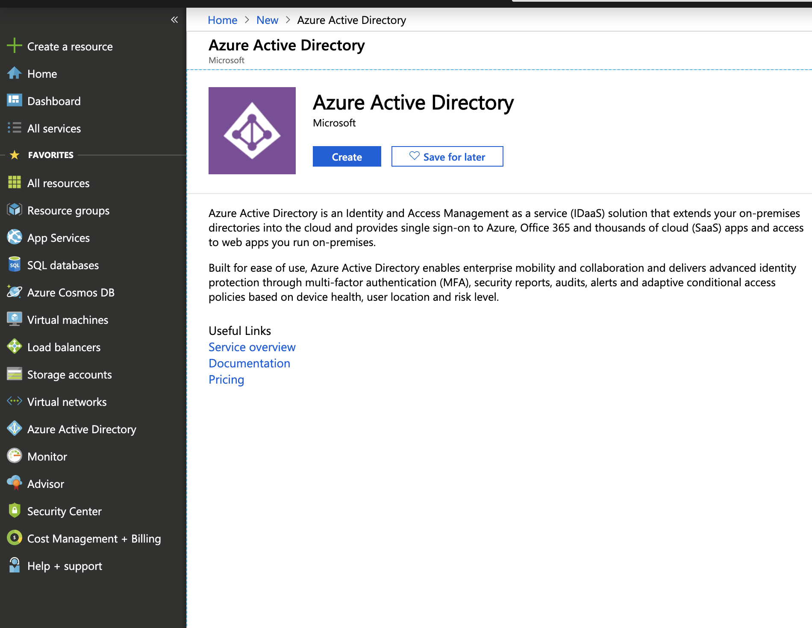
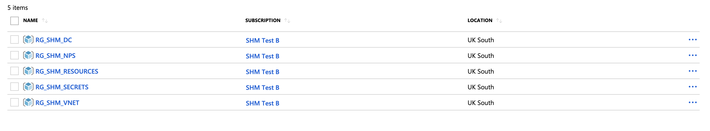
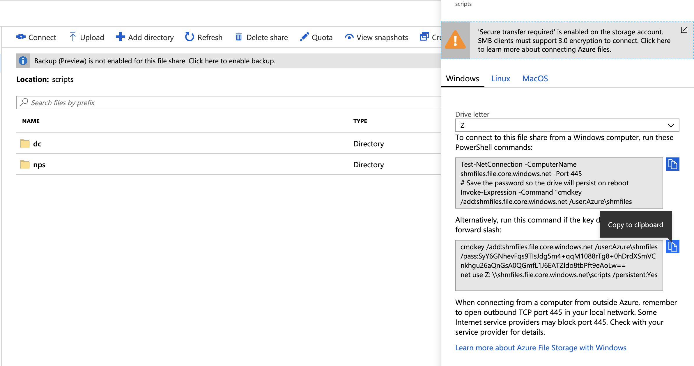
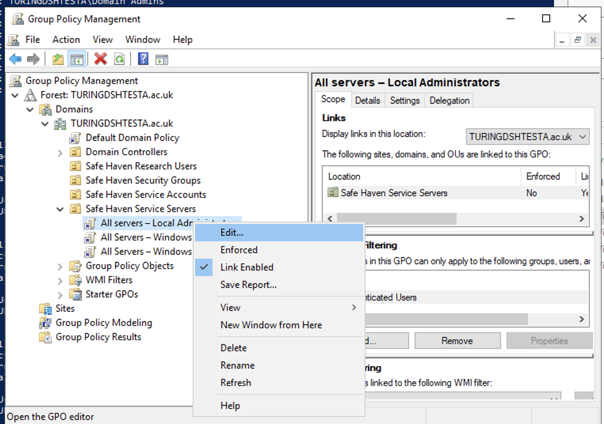
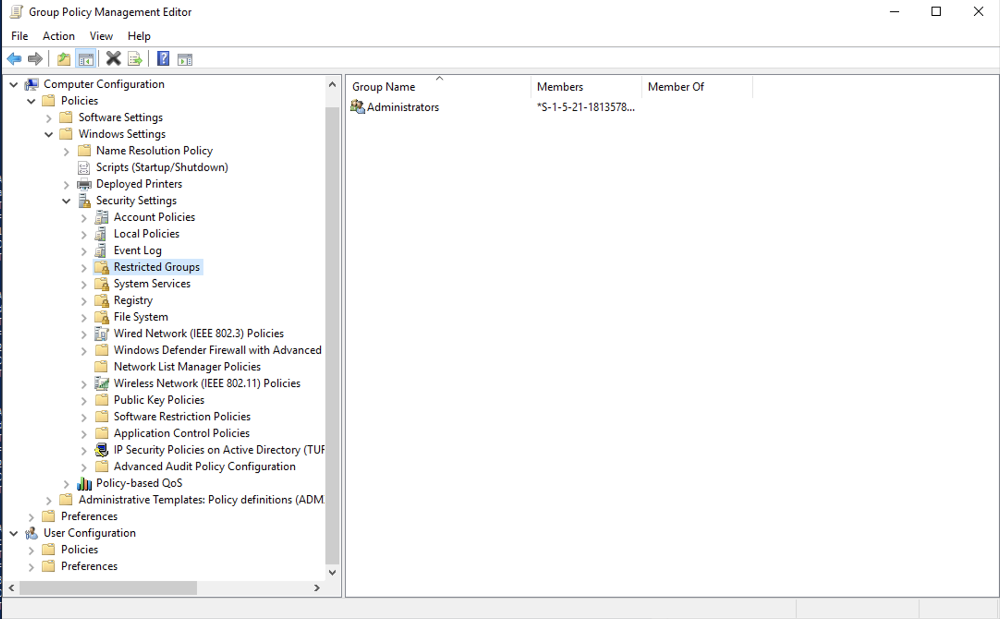

# Safe Haven Management Environment Build Instructions

## Prerequisites

### An Azure subscription with sufficient credits to build the environment in 

### Install and configure PowerShell for Azure
  - Install [PowerShell v 6.0 or above](https://docs.microsoft.com/en-us/powershell/azure/install-az-ps?view=azps-2.2.0)
  - Install the Azure [PowerShell Module](https://docs.microsoft.com/en-us/powershell/azure/install-az-ps?view=azps-2.2.0&viewFallbackFrom=azps-1.3.0)

### Microsoft Remote Desktop
- On Mac this can be installed from the [apple store](https://itunes.apple.com/gb/app/microsoft-remote-desktop-10/id1295203466?mt=12)

### Azure CLI 
- Install the [Azure CLI](https://docs.microsoft.com/en-us/cli/azure/install-azure-cli?view=azure-cli-latest)

### Docker desktop
- Install [Docker Desktop](https://www.docker.com/products/docker-desktop). Docker is used to generate certificates. 

## 0. Setup Azure Active Directory (AAD) with P1 Licenses

### Create a new AAD
1. Login to the [Azure Portal](https://azure.microsoft.com/en-gb/features/azure-portal/)
2. Click `Create a Resourse`  and search for `Azure Active Directory`
3. Choose an Organisation Name, Initial Domain Name and country
4. Click Create AAD



### Add a new Global Administrator (Optional)
The User who creates the AAD will automatically have the Global Administrator (GA) Role (Users with this role have access to all administrative features in Azure Active Directory). It is also possible to add another user with the GA Role:

1. On the left hand panel click `Azure Active Directory` and ensure you are on the directory you just created
2. Navigate to `Custom domain names` and make note of the initial domain name. It will be `<domain>.onmicrosoft.com`
3. Navigate to `Users` and click `New User`
4. Add a new user with username `<user>.<domain>.ommicrosoft.com` Under directory role set role as Global Administrator 

### Add P1 License to AAD

- Purchase P1 License for the AAD

- Else, **for testing only**, enable a free trial of the P2 License (NB. It can take a while for these to appear on your AAD)

### Create a Custom Domain Name 

1. Follow the instructions [here](https://docs.microsoft.com/en-us/azure/active-directory/fundamentals/add-custom-domain#add-your-custom-domain-name-to-azure-ad) to create a custom domain name for the DSH management environment. This should be something like "TURINGSAFEHAVEN@ac.uk"

2. Ensure the domain name is verified. This is not critical for testing, but you will not be able to add users to the domain name until it has been verified


## 1. Deploy VNET and Domain Controllers

1. Ensure you are logged into the Azure within PowerShell using the command
    - `Connect-AzAccount`
 
2. Set the AzContext to the SHM Azure subscription id
    - `Set-AzContext -SubscriptionId "<SHM-subscription-id>"`

3. From a clone of the data-safe-haven repository, deploy the VNET and DCs with the following commands
    - `cd ./data-safe-haven/safe_haven_management_environment/setup`
    - `./deploy_VNET_DC.ps1 -SubscriptionId "<SHM-subscription-id>"`

4. After a while the script will ask for user input:

    - In the azure portal navigate to the resource group `RG_SHM_RESOURCES` -> `shmfiles`. Click `Shared Access Signature` and `Generate SAS and connection string`. This will a SAS token. The Connection string will contain the artifact URL, which looks something like:

      - Artifact URL: https://shmfiles.blob.core.windows.net
      - SAS Token: ***************
      - Domain Name: The verified custom domain name created in step 0.  

    - Provide these as inputs when requested. NB. Don't include a trailing forward slash on the Artifact URL
    

5. Once the script exits successfully you should see the following resource groups under the SHM-subscription:




## 3. Configure Domain Controllers (DCs)

### Download and install the VPN Client from the virtual network VPN gateway 

1. Navigate to `/safe_haven_management/scripts/local/out/certs/` and double click `client.pfx` to install it (on Mac). Enter the `password`. 
2. Next, on the portal navigate to the Safe Haven Management (SHM) VNet gateway in the SHM subscription via `Resource Groups -> RG_SHM_VNET -> SHM_VNET1_GW`.
3.  Once there open the "Point-to-site configuration page under the "Settings" section in the left hand sidebar.
4. Click the "Download VPN client" link at the top of the page to get the root certificate (VpnServerRoot.cer) and VPN configuration file (VpnSettings.xml).

5. Follow the [VPN set up instructions](https://docs.microsoft.com/en-us/azure/vpn-gateway/point-to-site-vpn-client-configuration-azure-cert) using the Windows or Mac sections as appropriate.

You should now be able to connect to the virtual network. Each time you need to access the virtual network ensure you are connected to it (INSERT IMAGE)

### Access the first Domain Controller (DC1) via Remote Desktop

1. Open Microsoft Remote Desktop

2. Click `Add Desktop`

3. Navigate to the `RG_SHM_DC` resource group and then to the `SHMDC1` virtual machine (VM). 

4. Copy the Private IP address and enter it in the `PC name` field on remote desktop. Click Add.

5. Double click on the desktop that appears under `saved desktops`. Enter the username and password:
    - Username: atiadmin
    - Password: 

  - To obtain the password on Azure navigate to the `RG_SHM_SECRETS` resource group and then the `shmvault` key vault. On the left panel select `secrets` and click on `dc_pass`. You can then copy the secret to the clipboard and paste it into Microsoft Remote Desktop. 

### Configure Active Directory on SHMDC1

Once you have accessed SHMDC1 via the Remote Desktop we can configure the DC1. 

1. On the Azure portal navigate to the `RG_SHM_RESOURCES` resource group and then the `shmfiles` container. Click on `Files` and then the `scripts` fileshare. 

2. Click the connect icon on the top bar and then copy the lower powershell command. 



3. Open a powershell on the SHMDC1 VM. Past the powershell command and run. This will map the `scripts` fileshare to the Z: drive. 


4. In the powershell enter the following commands:

```
New-Item -Path "c:\" -Name "Scripts" -ItemType "directory"
```
```
Z:
```
```
copy dc C:/Scripts -Recurse
```

5. Open windows explorer and navigate to `C:\Scripts\dc`. Unzip `SHM_DC.zip` and then copy the contents of the unzipped file to `C:/Scripts/` 

6. Open `Active_Directory_Configuration.ps1` in a file editor. Then edit the following lines to use the custom domain name and save the file:

    - $domainou = "DC=TURINGSAFEHAVEN,DC=AC,DC=UK"
    - $domain = "TURINGSAFEHAVEN.ac.uk"

6. In the powershell navigate to `C:/Scripts/`. Run:
```
.\Set_OS_Language.ps1
```
```
.\Active_Directory_Configuration.ps1 -oubackuppath c:\Scripts\GPOs
```
You will be promted to enter a password for the adsync account. Note this down as you will need it when configuring the NPS Server later. 

### Configure Group Policies

1. Open the `Group Policy Management` app. You can search for it using the windows search bar. 

2. Navigate to the "All Servers - Local Administrators" GPO, right click and then click edit



3. Navigate to "Computer Configuration" -> "Windows Settings" -> "Security Settings" -> "Restricted Groups"



4. Open "Administrators" group object and delete all entries from "Members of this group".
    - Click "Add" -> Add "SG Safe Haven Server Administrators" and "Domain Admins". Click `apply` then `ok`. Now close "Group Policy Management" MMC

5. Open `Active Directory Users and Computers` app (search in windows search bar)


6. Right click on "Computers" container. Click "Deletegate Control" -> "Next" -> "Add" -> "SG Data Science LDAP Users".

7. Click next -> "Create a custom task to delegate" -> "This folder, existing objects in this folder...."

8. Click next, then Select "Read", "Write", "Create All Child Objects" -> "Delete All Child Objects" -> "Next" -> "Finish". Close the `Active Directory Users and Computers` app.

9. Close the remote desktop instance

### Configure the second domain controller (SHMDC2)

1. Connect to SHMDC2 using Microsoft Remote desktop, the same procedure as for SHMDC1, but using the private IP address for SHMDC2. The Username and Password is the same.

1. On the Azure portal navigate to the `RG_SHM_RESOURCES` resource group and then the `shmfiles` container. Click on `Files` and then the `scripts` fileshare. 

2. Click the connect icon on the top bar and then copy the lower powershell command. 

3. Open a powershell on the SHMDC2 VM. Past the powershell command and run. This will map the `scripts` fileshare to the Z: drive. 

4. In the powershell enter the following commands:

```
New-Item -Path "c:\" -Name "Scripts" -ItemType "directory"
```
```
Z:
```
```
copy dc C:/Scripts -Recurse
```

5. Open windows explorer and navigate to `C:\Scripts\dc`. Unzip `SHM_DC.zip` and then copy the contents of the unzipped file to `C:/Scripts/` 

6. Open `Active_Directory_Configuration.ps1` in a file editor. Then edit the following lines to use the custom domain name and save the file:

    - $domainou = "DC=TURINGSAFEHAVEN,DC=AC,DC=UK"
    - $domain = "TURINGSAFEHAVEN.ac.uk"

6. In the powershell navigate to `C:/Scripts/`. Run:
```
.\Set_OS_Language.ps1
```

The Domain Controller configuration is now complete. Exit remote destop

## 4. Deploy Network Policy Server (NPS)

1. In th data-safe-haven repository, deploy the NPS server using the following commands:
    - `cd ./data-safe-haven/safe_haven_management_environment/setup`
    - `./setup_azure2.ps1 -SubscriptionId "<SHM-subscription-id>"`

2. When prompted enter the following:

    - Administrator password: In the keyvault under dcpass (must be the same password and username as the DCs)
    - Virtual Network Resource Group: RG_SHM_VNET (the name of the resource group)
    - Domain name: The custom domain name

The NPS server will now deploy. This may take some time. 


### Configure the Network Policy Server

1. Connect to NPS Server using Microsoft Remote desktop, the same procedure as for SHMDC1/SHMDC2, but using the private IP address for SHMNPS VM, which is found in the `RG_SHM_NPS` resource group. The Username and Password is the same as for SHMDC1 and SHMDC2.

2. On the Azure portal navigate to the `RG_SHM_RESOURCES` resource group and then the `shmfiles` container. Click on `Files` and then the `scripts` fileshare. 

2. Click the connect icon on the top bar and then copy the lower powershell command. 

3. Open a powershell on the `SHMNPS` VM. Past the powershell command and run. This will map the `scripts` fileshare to the Z: drive. 

4. In the powershell enter the following commands:

```
New-Item -Path "c:\" -Name "Scripts" -ItemType "directory"
```
```
Z:
```
```
copy nps C:/Scripts -Recurse
```

5. Open windows explorer and navigate to `C:\Scripts\dc`. Unzip `SHM_NPS.zip` and then copy the contents of the unzipped file to `C:/Scripts/` 

6. From the PowerShell command window change to `C:\Scripts` and run:
```
.\Prepare_NPS_Server.ps1
```

7. Open the file `C:/Scripts/ConfigurationFile.ini` in an editor. 

8. Find the line `SQLSYSADMINACCOUNTS="TURINGSAFEHAVEN\atiadmin"` and change the domain name to the correct custom domain. Save and exit. 


### SQL Server installation

1. Go back to the Azure portal and navigate to the `RG_SHM_RESOURCES` resource group and then the `shmfiles` container. Click on `Files` and then the `sqlserver` fileshare. 

2. Click the connect icon on the top bar. **Change the driver letter to Y**. Then copy the lower powershell command. 

3. Open a powershell on the `SHMNPS` VM. Past the powershell command and run. This will map the `sqlserver` fileshare to the Y: drive. 

4. Close the powershell. 

5. In Windows explorer navigate to the Y: driver (sqlserver). Double click on `SQLServer2017-SSEI-Expr` and click `run` when prompted. Then chose `Download Media` and select `Express Advanced`. Then click download. 

6. Once downloaded run the downloaded installer. This will extract a folder called `SQLEXPRADV_x64_ENU`

7. Open a command prompt with administrator privileges (right click on command window and click `run as administrator`). Navigate to the `SQLEXPRADV_x64_ENU` folder. 

8. Enter the following commands which will install the SQL Server:

```
setup /configurationfile=c:\Scripts\ConfigurationFile.ini /IAcceptSQLServerLicenseTerms
```

9. In Windows explorer navigate to the Y: driver (sqlserver). Run the SSMS-Setup-ENU (SQL Management Studio installation) and install with the default settings. When prompted restart the VM. You will need to log back in with Windows Remote Desktop. 

10. Open a new command prompt and navigate to `C:\scripts`. Then enter the following command:

```
sqlcmd -i c:\Scripts\Create_Database.sql
```
11. Exit the command promt

### NPS Configuration

1. On the NPS VM open the "Network Policy Server" desktop app

2. Click on "Accounting"
3. Select "Configure Accounting"
4. Click "Next" -> "Log to a SQL Server Database" -> "Next" -> "Configure"
5. Enter "SHMNPS" in the "Select or enter server name" box
6. Select "User Windows NT Intergrated Security"
7. Select "NPSAccounting" database from "Select the database on the server" drop down
8. Click "OK"
9. Click "Next" -> "Next" -> "Rebuild" -> "Close"
10. Close the "Network Policy Server" app


### Install Azure Active Directory Connect

1. Download the latest version of the AAD Connect tool from [here](https://www.microsoft.com/en-us/download/details.aspx?id=47594)
    - You will need to temporarily [enable downloads on the VM](https://www.thewindowsclub.com/disable-file-download-option-internet-explorer 
    - You will be promted to add webpages to exceptions. Do this. 

2. Run the installer
    - Agree the license terms -> "Continue"
    - Select "Customize"
    - Click "Install"
    - Select "Password Hash Synchronization" -> "Next"
    - Provide a global administrator details for the Azure Active Directory you are connected to. 
    - Ensure that correct forest (your custom domain name; e.g TURINGSAFEHAVEN.ac.uk) is selected and click "Add Directory"
    - Select "Use and existing account" -> Enter the details of the "localadsync" user. Domaninusername: <DOMAIN>/localadsync Password: Password entered in SHMDC1 setup -> "OK" -> "Next"
    - Verify that UPN matches -> "Next"
    - Select "Sync Selected domains and OUs"
    - Expand domain and delselect all objects
    - Select "Safe Haven Research Users" -> "Next"
    - Click "Next" on "Uniquely identifying your users"
    - Select "Synchronize all users and devices" -> "Next"
    - Select "Password Writeback" -> "Next"
    - Click "Install"
    - Click "Exit"

### Additional AAD Connect Configuration (OSCAR METHOD)

1. Open the `Synchronization Rules Editor` from the start menu on the SHMNPS VM. 
2. Change the "Direction" drop down to "Outbound"
3. Select the "Out to AAD - User Join" -> Click "Disable". Click edit.
4. Click "Yes" for the "In the Edit Reserved Rule Confirmation" window
5. Set `precedence` to 1. 
6. Select "Transformations" and locate the rule with its "Target Attribute" set to "usageLocation" 
7. Change the "FlowType" column from "Expression" to "Direct"
8. "Source" column click drop-down and choose "c" attribute
9. Click "Save"
10. You will now see a cloned version of the `Out to AAD - User Join`. Delete the original. Then edit the cloned version. Change `Precedence to 115` and edit the name to `Out to AAD - User Join`. Click save. Enable the new rule. 
11. Click the X to close the Synchronization Rules Editor window

12. In the powershell run:

```
Start-ADSyncSyncCycle -PolicyType Initial
```

14. To verify this worked open a powershell and enter:
```
Start-ADSyncSyncCycle -PolicyType Delta
```

### Additional AAD Connect Configuration (ROB METHOD)

1. Open the `Synchronization Rules Editor` from the start menu on the SHMNPS VM. 
2. Change the "Direction" drop down to "Outbound"
3. Select the "Out to AAD - User Join" -> Click "Edit"
4. Click "No" for the "In the Edit Reserved Rule Confirmation" window (OG - THIS DOESNT WORK FOR ME)
5. Select "Transformations" and locate the rule with its "Target Attribute" set to "usageLocation" 
6. Change the "FlowType" column from "Expression" to "Direct"
7. "Source" column click drop-down and choose "c" attribute
8. Cick "Save"
9. Click the X to close the Synchronization Rules Editor window

### MFA Configuation

- Download the "NPS Extension" from Microsoft [here](https://aka.ms/npsmfa)
- Run the installer
- Agree the license terms and click "Install"
- Click "Close" once the install has completed
- Open a PowerShell command windows with administrator privilages
- Chnage to "C:\Program Files\Microsoft\AzureMfa\Config"
- Run:
```
.\AzureMfaNpsExtnConfigSetup.ps1
```
- Enter "Y" when prompted
- Enter "A" when prompted
- Sign in with the global admin account for your active directory
- Enter your Azure Active directory ID (Note: if you see a service principal error here this is because you don't have any valid P1 licenses, purchase licenses and then re-run the commands in this section)
- Enter "Y" when prompted

#### Installation of Safe Haven Management environment complete.


## 5. Validation 

1. Add a user on the SHMDC1 machine using the `Active Directory Users and Computers` application. 

2. After about 30 minutes the new user should appear on the Azure Active Directory account. Or to force a sync, on the NPS machine open a powershell and call:

```
Start-ADSyncSyncCycle -PolicyType Delta
```

