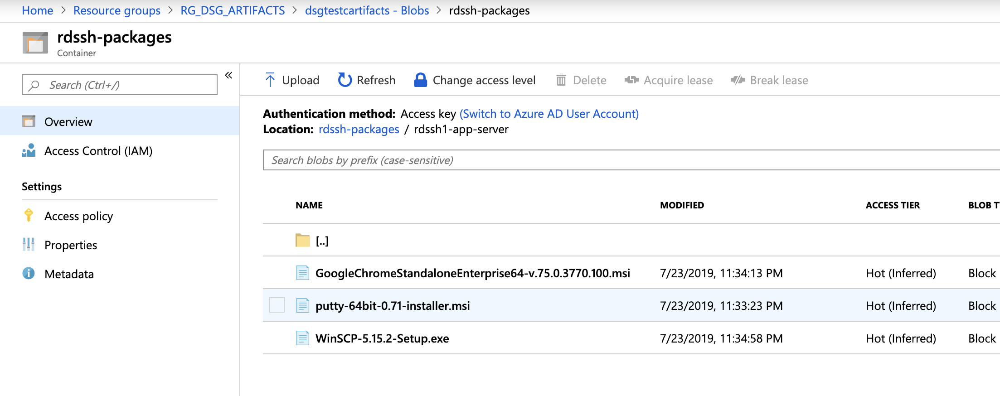
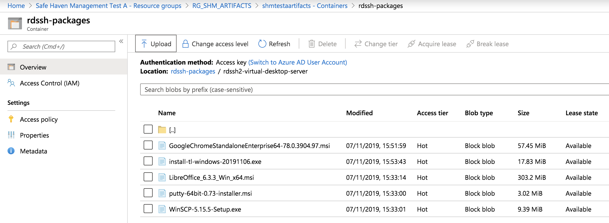
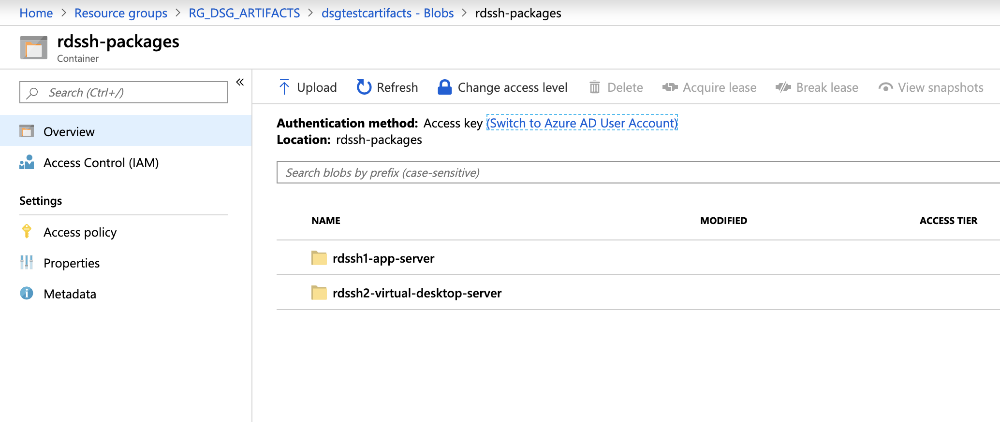
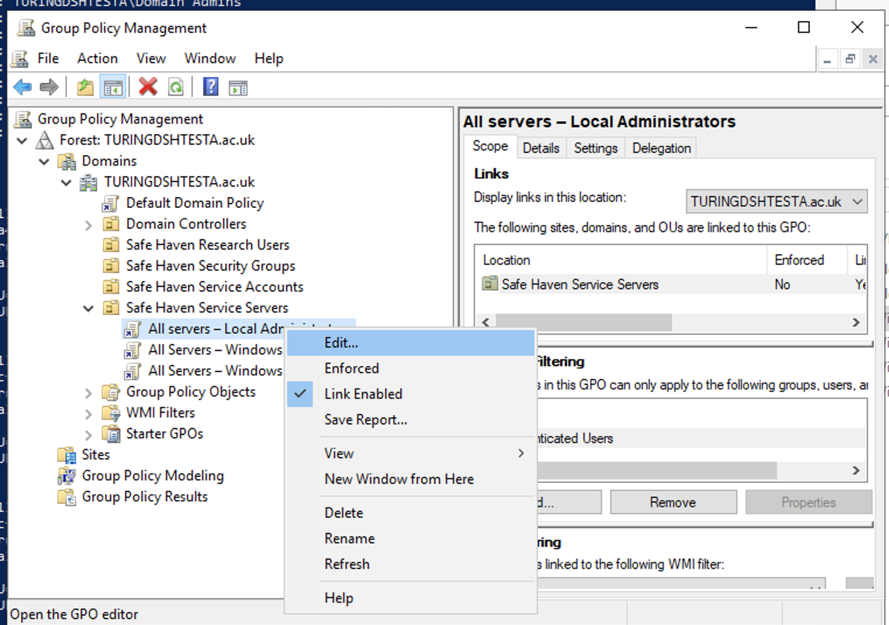
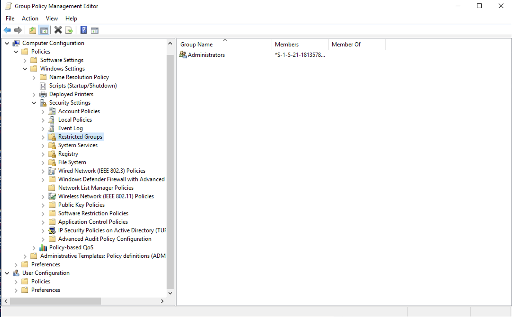
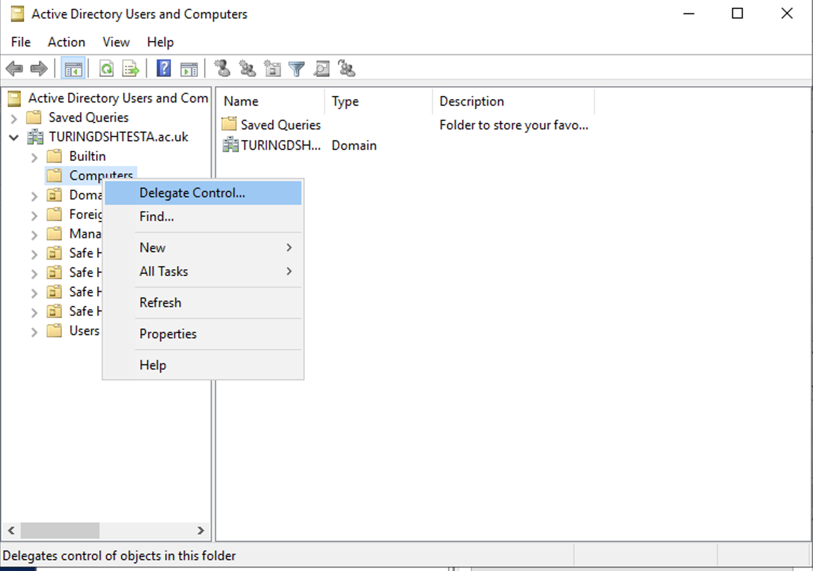

# Safe Haven Management Environment Build Instructions

## Prerequisites

### An Azure subscription with sufficient credits to build the environment in

### Install and configure PowerShell for Azure
  - Install [PowerShell v 6.0 or above](https://docs.microsoft.com/en-us/powershell/azure/install-az-ps?view=azps-2.2.0)
  - Install the Azure [PowerShell Module](https://docs.microsoft.com/en-us/powershell/azure/install-az-ps?view=azps-2.2.0&viewFallbackFrom=azps-1.3.0)

### Microsoft Remote Desktop
- On Mac this can be installed from the [apple store](https://itunes.apple.com/gb/app/microsoft-remote-desktop-10/id1295203466?mt=12)

### Azure CLI
- Install the [Azure CLI](https://docs.microsoft.com/en-us/cli/azure/install-azure-cli?view=azure-cli-latest)

### Docker desktop
- Install [Docker Desktop](https://www.docker.com/products/docker-desktop). Docker is used to generate certificates.

## 0. Setup Azure Active Directory (AAD) with P1 Licenses

### Create a new AAD
1. Login to the [Azure Portal](https://azure.microsoft.com/en-gb/features/azure-portal/)
2. Click `Create a Resource`  and search for `Azure Active Directory`
3. Set the "Organisation Name" to `<organisation> Safe Haven <environment>`, e.g. `Turing Safe Haven Test B"
4. Set the "Initial Domain Name" to the "Organisation Name" all lower case with spaces removed
5. Set the "Country or Region" to "United Kingdom"
6. Click Create AAD

   

### Create a Custom Domain Name
#### Create a DNS zone for the custom domain
For Turing SHMs, create a new DNS Zone for a subdomain under the `turingsafehaven.ac.uk` domain (for the `production` environment - within the `Safe Haven Management` subscription) or under the `dsgroupdev.co.uk` domain (for the `test` environment  - within the `Safe Haven Management Testing` subscription). For safe havens hosted by other organisations, follow their guidance. This may require purchasing a dedicated domain.
- Ensure that the `RG_SHM_DNS` resource group exists in your chosen subscription. For the Turing SHM, we use the `UK South` region.

Whatever new domain or subdomain you choose, you must create a new Azure DNS Zone for the domain or subdomain.
- Click `Create a resource` in the far left menu, seach for "DNS Zone" and click "Create.
- Use the `RG_SHM_DNS` resource group created above.
- For the `Name` field enter the fully qualified domain / subdomain (e.g. `testb.dsgroupdev.co.uk` for a second test SHM deployed as part of the Turing `test` environment or `turingsafehaven.ac.uk` for the production SHM deployed as the Turing `production` environment).

Once deployed, duplicate the `NS` record in the DNS Zone for the new domain / subdomain to it's parent record in the DNS system.

- Navigate to the new DNS Zone (click `All resources` in the far left panel and search for "DNS Zone". The NS record will list 4 Azure name servers.
- If using a subdomain of an existing Azure DNS Zone, create an NS record in the parent Azure DNS Zone for the new subdomain with the same value as the NS record in the new Azure DNS Zone for the subdomain (i.e. for a new subdomain `testb.dsgroupdev.co.uk`, duplicate its NS record to the Azure DNS Zone for `dsgroupdev.co.uk`, under the name `testb`).
- If using a new domain, create an NS record in at the registrar for the new domain with the same value as the NS record in the new Azure DNS Zone for the domain.

### Create and add the custom domain to the new AAD
1. Ensure your Azure Portal session is using the new AAD directory. The name of the current directory is under your username in the top right corner of the Azure portal screen. To change directories click on your username at the top right corner of the screen, then `Switch directory`, then the name of the new AAD directory.

2. Navigate to `Active Directory` and then click `Custom domain names` in the left panel. Click `Add custom domain` at the top and create a new domain name (e.g. `testb.dsgroupdev.co.uk`)

3. Note the DNS record details displayed
  
4. In a separate Azure portal window, switch to the Turing directory and navigate to the DNS Zone for your custom domain within the `RG_SHM_DNS` resource group in the management subscription.
5. Create a new record using the details provided (the `@` goes in the `Name` field and the TTL of 3600 is in seconds)
  
6. Navigate back to the custom domain creation screen in the new AAD and click "Verify"

## 1. Deploy VNET and Domain Controllers

### Core SHM configuration properties
The core properties for the Safe Haven Management (SHM) environment must be present in the `new_dsg_environment/dsg_configs/core` folder. These are also used when deploying a DSG environment.
The following core SHM properties must be defined in a JSON file named `shm_<shmId>_core_config.json`. The `shm_testb_core_config.json` provides an example. `artifactStorageAccount` and `vaultname` must be globally unique in Azure. `<shmId>` is a short ID to identify the environment (e.g. `testb`).

**NOTE:** The `netbiosName` must have a maximum length of 15 characters.

```json
{
    "subscriptionName": "Name of the Azure subscription the management environment is deployed in",
    "computeVmImageSubscriptionName": "Azure Subscription name for compute VM",
    "domain": "The fully qualified domain name for the management environment",
    "netbiosname": "A short name to use as the local name for the domain. This must be 15 characters or less",
    "shmId": "A short ID to identify the management environment",
    "name": "Safe Haven deployment name",
    "organisation": {
        "name": "Organisation name",
        "townCity": "Location",
        "stateCountyRegion": "Location",
        "countryCode": "e.g. GB"
    },
    "location": "The Azure location in which the management environment VMs are deployed",
    "ipPrefix": "The three octet IP address prefix for the Class A range used by the management environment. Use 10.0.0 for this unless you have a good reason to use another prefix."
}
```

### Deploy KeyVault for SHM secrets

1. Ensure you are logged into the Azure within PowerShell using the command:
   ```pwsh
   Connect-AzAccount
   ```

2. Set the AzContext to the SHM Azure subscription id:
   ```pwsh
   Set-AzContext -SubscriptionId "<SHM-subscription-id>"
   ```

3. From a clone of the data-safe-haven repository, deploy the VNET and DCs with the following commands
   ```pwsh
   cd ./safe_haven_management_environment/setup
   ```

4. Run `./setup_azure0.ps1` entering the `shmId`, defined in the config file, when prompted


### Add additional administrators
The User who creates the AAD will automatically have the Global Administrator (GA) Role (Users with this role have access to all administrative features in Azure Active Directory). Additional users require this role to prevent this person being a single point of failure.

For some steps, a dedicated **internal** Global Administrator is required (e.g. to add P1 licences), so at least this additional administrator will need to be created.

1. Ensure your Azure Portal session is using the new Safe Haven Management (SHM) AAD directory. The name of the current directory is under your username in the top right corner of the Azure portal screen. To change directories click on your username at the top right corner of the screen, then `Switch directory`, then the name of the new SHM directory.
2. On the left hand panel click `Azure Active Directory`.
3. Navigate to `Users` and create a dedicated **internal** Global Administrator:
    - Click on "+New user" and enter the following details:
      - Name: "AAD Global Admin"
      - Username:`admin@customdomain`
      - Select the directory role to "Global Administrator"
      - Click "Create"
    - Click on the username in the users list in the Azure Active Directory
    - Click the "Reset password" icon to generate a temporary password
    - Use this password to log into https://portal.azure.com as the user `admin@customdomain`. You will either need to log out of your existing account or open an incognitio/private browsing window.
    - When prompted to change your password on first login:
      - Create a strong password for this user.
      - Create a secret named `shm-aadadmin-password` in the KeyVault under the `RG_DSG_SECRETS` resource group in the management subscription.
      - Set the value of this secret to the password you just generated.
    - Once you have set your password and logged in you can administrate the Azure Active Directory with this user by selecting `Azure Active Directory` in the left hand sidebar
4. Navigate to `Users` and add new admin users, setting their names to `Admin - Firstname Lastname` and their usernames to `admin.firstname.lastname@customdomain`, using the custom domain you set up in the earlier step.
4. Let Azure set their passwords. They can reset these later.
5. In the user list on the Azure Active Directory, for each of the new admin users:
   - Click on the username in the user list to view the user's details
   - Click on `Directory role` in the left sidebar click `Add assignment` and search for "Global Administrator"
   - Select this role and click `Add`
   - Navigate back to the user list and select the next user.
6. To enable MFA, purchase sufficient P1 licences and add them to all the new users.
   - You will also need P1 licences for standard users accessing the Safe Haven.
   - You will need to be logged in as the "Local admin" user `admin@customdomain` to purchase a P1 subscription
   - To buy P1 licences:
     - Click on `Azure Active Directory` in the left hand sidebar
     - Click on "Licences" under the "Manage" section of the left habd side bar
     - Click on "All products" in the left hand sidebar
     - Click on the "+Try/Buy" text above the empty product list
     - Click the "Purchase services" link in the infomation panel above the trial options.
     - In the "Microsoft 365 Admin Centre" portal that opens:
       - Expand the "Billing" section of the left hand side bar
       - Click on "Purchase services"
       - Scroll down the list of products and select "Azure Active Directory Premium P1" and click "Buy"
       - Select "Pay monthly"
       - Enter the number of licences required.
       - Leave "automatically assign all of your users with no licences" checked
       - Click "Check out now"
       - Enter the address of the organisation running the Safe Haven on the next screen
       - Click next and enter payment details when requested
   - **For testing only**, you can enable a free trial of the P2 License (NB. It can take a while for these to appear on your AAD)
   - To add licenses to a user click `licenses` in the left panel, click `assign`, select users and then assign `Azure Active Directory Premium P1` and `Microsoft Azure Multi-Factor Authentication`
      - If the above fails go `Users` and make sure each User has `usage location` set under "Settings" (see image below):
    
7. Configuring MFA on Azure Active Directory
   - Go to the Azure Portal and select "Azure Active Directory" from the left hand side bar
   - Click on "MFA" in the "Security" section of the left hand side bar
   - Click on the "Additional cloud-based MFA settings" link in the "Configure" section on the main panel
   - Configure MFA as follows:
     - In "App passwords" section select "Do not allow users to creat eapp passwords to sign in to non browser apps"
     - In "Verification options" section. Check "Call to phone" and "Notification through mobiel app" and **uncheck** "Text message to0 phone" and "Verification code from mobile app or hardware token"
     - In "Remember multi-factor authentication", ensure "Allow users to remember multi-factor authentication on devices they trust" is **unchecked**
     - Click "Save" and close window
       
8. Require MFA for all admins
   - Go to the Azure Portal and select "Azure Active Directory" from the left hand side bar
   - Click on "Conditional access" in the "Security" section of the left hand side bar
   - Click "Baseline policy: Require MFA for admins"
   - Select "Use policy immediately" in the left hand side bar
   - Click "Save"

### Deploy the Virtual Network and Active Directory Domain Controller

1. Ensure you are logged into the Azure within PowerShell using the command:
   ```pwsh
   Connect-AzAccount
   ```

2. Set the AzContext to the SHM Azure subscription id:
   ```pwsh
   Set-AzContext -SubscriptionId "<SHM-subscription-id>"
   ```

3. From a clone of the data-safe-haven repository, deploy the VNET and DCs with the following commands
   ```pwsh
   cd ./safe_haven_management_environment/setup
   ```

4. **Ensure docker is running before attempting the next step**

5. Run `./setup_azure1.ps1` entering the `shmId`, defined in the config file, when prompted

6. Once the script exits successfully you should see the following resource groups under the SHM-subscription (NB. names may differ slightly):

   

### Download software and upload to blob storage
A number of files are critical for the DSG deployment. They must be added to blob storage:

1. On the portal navigate to `RG_DSG_ARTIFACTS` resource group and go to the storage account. Click `blobs` and then create a new container called `rdssh-packages`. It will then appear in the storage account:

   

2. On your local machine download the following and place into a folder called `rdssh1-app-server`, renaming them so that the filenames include the full version if the downloaded files do not already.

    - [Chrome Enterprise 64 bit The GoogleChromeStandaloneEnterprise64-v.75.0.3770.100.msi file; unpack zip to find it](https://cloud.google.com/chrome-enterprise/browser/download/?h1=en)
    - [Putty 64bit - windows .msi](https://www.chiark.greenend.org.uk/~sgtatham/putty/latest.html)
    - [WinSCP](https://winscp.net/download/WinSCP-5.15.2-Setup.exe)

3. Upload the folder to the `rdssh-packages`, ensuring it has the same name. The container will now look like this:
   

4. Do the same again but with a folder called `rdssh2-virtual-desktop-server` with the following files:
   - [Chrome Enterprise 64 bit The GoogleChromeStandaloneEnterprise64-v.75.0.3770.100.msi file; unpack zip to find it](https://cloud.google.com/chrome-enterprise/browser/download/?h1=en)
   - [Putty 64bit - windows .msi](https://www.chiark.greenend.org.uk/~sgtatham/putty/latest.html)
   - [WinSCP](https://winscp.net/download/WinSCP-5.15.2-Setup.exe)

   - [Apache (WIndows v 4.1.6)](https://www.openoffice.org/download/index.html)
   - [Texlive: install-tl-windows-20190429.exe](http://mirror.ctan.org/systems/texlive/tlnet/install-tl-windows.exe)

5. The container will now look like this:
   

6. Go back up a level and ensure the folders are names are as expected.
   

## 3. Configure Domain Controllers (DCs)

### Configure Active Directory on SHMDC1 and SHMDC2

1. Run `./configure_dc.ps1` entering the `shmId`, defined in the config file, when prompted. This will run remote scripts on the DC VMs

### Download a client VPN certificate for the Safe Haven Management VNet

1. Navigate to the SHM KeyVault via `Resource Groups -> RG_DSG_SECRETS -> kv-shm-<shm-id>`, where `<shm-id>`.

  - Once there open the "Certificates" page under the "Settings" section in the left hand sidebar.

  - Click on the certificate named `shm-vpn-client-cert`, click on the "current version" and click the "Download in PFX/PEM format" link.

  - To install, double click on the downloaded certificate, leaving the password field blank.

  - **Make sure to securely delete the "\*.pfx" certificate file after you have installed it.**

You should now be able to connect to the SHM virtual network. Each time you need to access the virtual network ensure you are connected to it.

### Access the first Domain Controller (DC1) via Remote Desktop

1. Open Microsoft Remote Desktop

2. Click `Add Desktop`

3. Navigate to the `RG_SHM_DC` resource group and then to the `DC1_SHM_<shm-id>` virtual machine (VM).

4. Copy the Private IP address and enter it in the `PC name` field on remote desktop. Click Add.

5. Double click on the desktop that appears under `saved desktops`. 
  - To obtain the username and password on Azure navigate to the `RG_DSG_SECRETS` resource group and then the `kv-shm-<shm-id>` key vault and then select `secrets` on the left hand panel. The username is in the `shm-dc-admin-username` secret and the password in the  `shm-dc-admin-password` secret.

### Active Directory Configuration

1. Navigate to `C:/Scripts/`

2. Open `Active_Directory_Configuration.ps1` in a file editor. Then edit the following lines to use the custom domain name created earlier and save the file. The `$domainou` should be your custom domain split into parts separated by dots, with each of the parts included in the `$domainou` as comma-separated parts in the format `DC=<domain-part>`.

    - $domainou = "DC=DSGROUPDEV,DC=CO,DC=UK"
    - $domain = "TESTB.DSGROUPDEV.CO.UK"

3. Open powershell and navigate to `C:/Scripts/`. Run:

   ```pwsh
   .\Active_Directory_Configuration.ps1 -oubackuppath "c:\Scripts\GPOs"
   ```
You will be promted to enter a password for the adsync account. Use the password the keyvault in the `RG_DSG_SECRETS` resource group called `sh-managment-adsync`.


### Configure Group Policies

Once you have accessed the VM via Remote Desktop:

1. On the VM open the `Group Policy Management` app. You can search for it using the windows search bar.

2. Navigate to the "All Servers - Local Administrators" GPO, right click and then click edit

   

3. Navigate to "Computer Configuration" "Policies" -> "Windows Settings" -> "Security Settings" -> "Restricted Groups"

   

4. Open "Administrators" group object and:
    - Delete all entries from "Members of this group".
    - Click "Add" -> Add "SG Safe Haven Server Administrators" and "Domain Admins". Click `apply` then `ok`. Now close "Group Policy Management" MMC

5. Open `Active Directory Users and Computers` app (search in windows search bar)

   

6. Right click on "Computers" container. Click "Delegate Control" -> "Next" -> "Add" -> "SG Data Science LDAP Users".

7. Click next -> "Create a custom task to delegate" -> "This folder, existing objects in this folder...."

8. Click next, then Select "Read", "Write", "Create All Child Objects","Delete All Child Objects" -> "Next" -> "Finish". Close the `Active Directory Users and Computers` app.

### Install Azure Active Directory Connect

1. Download the latest version of the AAD Connect tool from [here](https://www.microsoft.com/en-us/download/details.aspx?id=47594)
    - You will need to temporarily [enable downloads on the VM](https://www.thewindowsclub.com/disable-file-download-option-internet-explorer). Disable downloads after download complete.
    - You will be promted to add webpages to exceptions. Do this.

2. Run the installer
    - Agree the license terms -> "Continue"
    - Select "Customize"
    - Click "Install"
    - Select "Password Hash Synchronization" -> "Next"
    - Provide a global administrator details for the Azure Active Directory you are connected to (You may need to create an account for this in the Azure Active Directory)
    - Ensure that correct forest (your custom domain name; e.g TURINGSAFEHAVEN.ac.uk) is selected and click "Add Directory"
    - Select "Use and existing account" -> Enter the details of the "localadsync" user. Username: `localadsync@<full-domain-name>` (e.g. localadsync) Password: Look in the `sh-management-adsync` secret in the management KeyVault. Click "OK" -> "Next"
      - If you get an error that the username/password is incorrect or that the domain/directory could not be found, try resetting the password for this user to the secret value from the `sh-management-adsync` secret in the management KeyVault.
         - In Server Manager click "Tools -> Active Directory Users and Computers"
         - Expand the domain in theleft hand panel
         - Expand the "Safe Haven Service Accounts" OU
         - Right click on the "Local AD Sync Administrator" user and select "reset password"
         - Set the password to the the secret value from the `sh-management-adsync` secret in the management KeyVault.
         - Leave the other settings as is and click "Ok"
    - Verify that UPN matches -> "Next"
    - Select "Sync Selected domains and OUs"
    - Expand domain and deselect all objects
    - Select "Safe Haven Research Users" -> "Next"
    - Click "Next" on "Uniquely identifying your users"
    - Select "Synchronize all users and devices" -> "Next"
    - Select "Password Writeback" -> "Next"
    - Click "Install"
    - Click "Exit"

### Additional AAD Connect Configuration

1. Open the `Synchronization Rules Editor` from the start menu
2. Change the "Direction" drop down to "Outbound"
3. Select the "Out to AAD - User Join" -> Click "Disable". Click edit.
4. Click "Yes" for the "In the Edit Reserved Rule Confirmation" window
5. Set `precedence` to 1.
6. Select "Transformations" and locate the rule with its "Target Attribute" set to "usageLocation"
7. Change the "FlowType" column from "Expression" to "Direct"
8. On the "Source" column click drop-down and choose "c" attribute
9. Click "Save"
10. You will now see a cloned version of the `Out to AAD - User Join`. Delete the original. Then edit the cloned version. Change `Precedence to 115` and edit the name to `Out to AAD - User Join`. Click save. Click `Enable` on the new rule.
11. Click the X to close the Synchronization Rules Editor window
12. Run powershell as administrator and run:
    ```pws
    Import-Module –Name "C:\Program Files\Microsoft Azure AD Sync\Bin\ADSync"
    Start-ADSyncSyncCycle -PolicyType Initial
    ```

### Validation of AD sync

1. Add a research user:
  - In computer Manager click `Tools -> Active Directory Users and Computers`
  - Expand the domain
  - Right click on the `Safe Haven Research Users` OU and select `New -> User`
  - Create a new user:
    - First name: Test
    - Lastname: Research User
    - User login name: test-res
    - Click next
    - Enter a default password and click next
    - Click Finish
2. Force a sync to the Azure Active Dirctory
  - Run powershell as administrator and run:
    ```pwsh
    Import-Module –Name "C:\Program Files\Microsoft Azure AD Sync\Bin\ADSync"
    Start-ADSyncSyncCycle -PolicyType Delta
    ```
3. Go to the Azure Active Directory and click "Users -> All users" and confirm that the new user is shown in the user list. It may take a few minutes for the synchrinisation to fully propagate in Azure.

### Configure AAD side of AD connect
- Select "Password reset" from the left hand menu
- Ensure that enable writeback is set on AAD:
  - Select `On-premises integration` from the left hand side bar
  - Ensure `write back passwords to your on-premises directory` is set to yes.
    
  - If you changed this setting, click the "Save" icon
- Select `Properties` from the left hand side bar
  - Make sure that `self service password reset enabled` is set to `All`
    
  - If you changed this setting, click the "Save" icon

## 4. Deploy Network Policy Server (NPS)

1. In the data-safe-haven repository, deploy the NPS server using the following commands:
   ```pwsh
   cd ./data-safe-haven/safe_haven_management_environment/setup
   ```

1. Run `./setup_azure2.ps1` entering the `shmId`, defined in the config file, when prompted.

The NPS server will now deploy.

### Configure the Network Policy Server

1. Connect to NPS Server using Microsoft Remote desktop, using the same procedure as for SHMDC1/SHMDC2, but using the private IP address for SHMNPS VM, which is found in the `RG_SHM_NPS` resource group.
   - **NOTE:** The Username and Password is the same as for SHMDC1 and SHMDC2, but you must log in as a **domain** user rather than a local user (i.e. use `dsgadmin@<full-domain>` rather than just `dsgadmin`).

2. On the Azure portal navigate to the `RG_DSG_ARTIFACTS` resource group and then the `dsg<shmid>artifacts` storage account. Click on `Files` and then the `scripts` fileshare.

3. Click the connect icon on the top bar and then copy the lower powershell command.

4. On the `SHMNPS` VM run Powershell as an administrator.
   - Paste the powershell command copied from the Azure portal and hit enter. This will map the `scripts` fileshare to the Z: drive.
   - Once the drive is successfully mapped, run the following commands:
     ```pwsh
     New-Item -Path "c:\" -Name "Scripts" -ItemType "directory"
     copy z:\nps c:\scripts -Recurse
     Expand-Archive C:/Scripts/nps/SHM_NPS.zip -DestinationPath C:\Scripts\ -Force
     cd c:\scripts
     ./Prepare_NPS_Server.ps1
     ```

### Configure NPS server to log to text file

1. On the NPS VM open the "Network Policy Server" desktop app
2. Click on "Accounting"
3. Select "Configure Accounting"
4. Click "Next" -> "Log to text file on the local computer" then click "Next" -> "Next" -> "Next" -> "Close"
5. In the "Log file properties" section, click "Change log file properties"
6. On the "Log file" tab, select "Daily" under "Create a new log file"
7. Click "Ok"


### Add NPS policy to allow connections

- In Server Manager select "Tools -> Network Policy Server"
- Expand "NPS (Local)" and then "Policies" and select "Network policies"
- Right click on "Network policies" and select "New"
   - Set the policy name to "RDG_CAP" and click "Next"
   - Click "Add" to add a restriction
   - Select "Day and Time Restrictions" and click "Add"
   - Select "Permitted" (the whole weekly calendar should turn blue) and click "OK" then "Next"
   - On the next screen click "Next", leaving "Access granted checked"
   - On the "Configure authentication methods" screen, check the "Allow clients to connect without negotiating a connection method" checkbox then click "Next". Click "No" on the "Connection Request Policy" pop up.
   - On the "Configure constraints" screen click "Next"
   - On the "Configure settings" screen, clcik "Next"
   - On the "Completing network policy" screen click "Finish"

**NOTE:** If this policy is not present, then users will not be prompted for MFA when launching an RDS app.
This is because, without this policy, the NPS server will reject their authentication with the following error:
  - Event ID: 6273
  - First line of even message: Network Policy Server discarded the request for a user.
  - Reason Code: 21
  - Reason: An NPS extension dynamic link library (DLL) that is installed on the NPS server rejected the connection request.

### MFA Configuation

- Download the "NPS Extension" from Microsoft [here](https://aka.ms/npsmfa).
    - You will be promted to add webpages to exceptions. Do this.
- Run the installer
- Agree the license terms and click "Install"
- Click "Close" once the install has completed
- Run PowerShell as administrator and run:
  ```pwsh
  cd "C:\Program Files\Microsoft\AzureMfa\Config"
  .\AzureMfaNpsExtnConfigSetup.ps1
  ```
- Enter "Y" when prompted
- Enter "A" when prompted
- Sign in as the "Local Administrator" (`admin@customdomain`) user. Other administrators added as guests will not work for this step.
  - If you have not done so already, you may be prompted to add a phone number and backup email for the `admin@customdomain` accountat this point.
- Enter your Azure Active directory ID. To get this:
  - In the Azure portal select "Azure Active Directory" in the left hand side bar
  - Select "Properties" in the left hand side bar
  - Copy the "Directory ID" field
- If you do not get the "Service Principal" error, then enter "Y" when prompted

#### Troubleshooting MFA configuration
If you get a `New-msolserviceprincipalcredential: Access denied` error stating `You do not have permissions to call this cmdlet`, check the following:
  - Make sure you authenticate as the "Local Administrator" (`admin@customdomain`) user when prompted by the script. Other administrators added as guests will not work for this step.
  - Make sure you are logged in as a **domain** user rather than a local user.
    -  The output of the `whoami` command in powershell should be `netBiosDomain\dsgadmin` rather than `SHMNPS\dsgadmin`
    - If it is not, reconnect to the remote desktop with the username `dsgadmin@<full-domain>`, using the same password as before
  - Make sure the Safe Haven Azure Active Directory has valid P1 licenses:
    - Go to the Azure Portal and click "Azure Active Directories" in the left hand side bar
    - Click "Licenses" in the left hand side bar
    - You should see "1 product" in the main panel list of products. Click on this.
    - You should see "Azure Active Directory Premium P1" in the list of products, with a non-zero number of available licenses.
    - If you do not have P1 licences, purchase some following the instructions at the end of the [Add additional administrators](#Add-additional-administrators) section above, making sure to also follow the final step to configure the MFA settings on the Azure Active Directory.

## 5. Deploy package mirrors
### When to deploy mirrors
A full set of Tier 2 mirrors take around 4 days to fully synchronise with the external package repositories, so you may want to kick off the building of these mirrors before deploiying your first DSG.

### Prerequisites
Note that you will need a DSG full config JSON file present covering each Tier you want to deploy mirrors for.See the [0. Define DSG Configuration](../../new_dsg_environment/azure-runbooks/dsg_build_instructions.md##0.-Define-DSG-configuration) section of the [DSG deployment guide](../../new_dsg_environment/azure-runbooks/dsg_build_instructions.md) for instructions on creating these full configuration files.

Ensure your Azure CLI client is at version `2.0.55` or above. To keep the progress output manageable, the deployment script make use of the `--output none` option, which is only available in version `2.0.55` and above.
  - To see your current version run `az --version` and scroll up to see the version of the `azure-cli` component.
  - To update your Azure CLI, see [this link](https://docs.microsoft.com/en-us/cli/azure/install-azure-cli?view=azure-cli-latest)

### Deploying package mirrors

- Ensure you have the latest version of the Safe Haven repository from [https://github.com/alan-turing-institute/data-safe-haven](https://github.com/alan-turing-institute/data-safe-haven).

- Ensure you are authenticated in the Azure CLI using `az login` and then checking this has worked with `az account list`

- Open a Powershell terminal with `pwsh` and navigate to the `new_dsg_environment/shm_deploy_scripts/00_deploy_package_mirrors/` directory within the Safe Haven repository.

- Ensure you are logged into the Azure within PowerShell using the command: `Connect-AzAccount`

- Ensure the active subscription is set to that you are using for the new SAE using the command: `Set-AzContext -SubscriptionId "<dsg-subscription-name>"`

- Run the `./Create_Package_Mirrors.ps1` script, providing the DSG ID when prompted. This will set up mirrors for the tier corresponding to that DSG. If some DSGs use Tier-2 mirrors and some use Tier-3 you will have to run this multiple times. You do not have to run it more than once for the same tier (eg. if there are two DSGs which are both Tier-2, you only need to run the script for one of them).

### Setting KeyVault access policies

- Once the KeyVault deployment script exits successfully, follow the instructions to add a policy to the KeyVault so that you are able to manage secrets.
    - Navigate to the "RG_SHM_PKG_MIRRORS" resource group in the management subscription in the Azure portal and click on the KeyVault shown there
    - Click on "Access Policies" in the "Settings" section of the left-hand menu and click "+Add Access Policy".
    - In the "Configure from template" drop-down, select "Key, Secret & Certificate Management"
    - In the "Select Principal" section, select the security group that will administer this Safe haven instance
        - For Turing test SHMs this should be: `Safe Haven Test Admins`
        - For Turing production SHMs this should be: `Safe Haven Production Admins`
        - For non-turing Safe Haven instances, this should be the security group that will administer that instance.
    - Click the "Add" button.
    - If there was already an existing access policy for your user, delete it. You should be part of the administrator security group and access to all resources should be managed by secirity group rather than individual users.
    - Click the "Save" icon on the next screen

## 6. Tear down package mirrors
If you ever need to tear down the package mirrors, use the following script. Again, you will need a full DSG configuration file for each Tier you want to tear down.


- Ensure you have the latest version of the Safe Haven repository from [https://github.com/alan-turing-institute/data-safe-haven](https://github.com/alan-turing-institute/data-safe-haven).

- Ensure you are authenticated in the Azure CLI using `az login` and then checking this has worked with `az account list`

- Open a Powershell terminal with `pwsh` and navigate to the `new_dsg_environment/shm_deploy_scripts/00_deploy_package_mirrors/` directory within the Safe Haven repository.

- Ensure you are logged into the Azure within PowerShell using the command: `Connect-AzAccount`

- Ensure the active subscription is set to that you are using for the new SAE using the command: `Set-AzContext -SubscriptionId "<dsg-subscription-name>"`

- Run the `./Teardown_Package_Mirrors.ps1` script, providing the DSG ID when prompted. This will remove all the mirrors for the tier corresponding to that SAE. **NB. This will remove the mirrors from all SAEs of the same tier.**
