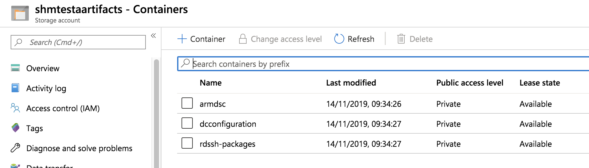
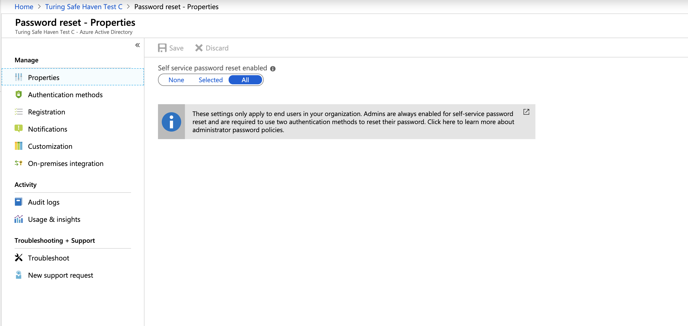

# Safe Haven Management Environment Build Instructions

## Prerequisites
- An Azure subscription with sufficient credits to build the environment in
- PowerShell for Azure
  - Install [PowerShell v 6.0 or above](https://docs.microsoft.com/en-us/powershell/azure/install-az-ps?view=azps-2.2.0)
  - Install the Azure [PowerShell Module](https://docs.microsoft.com/en-us/powershell/azure/install-az-ps?view=azps-2.2.0&viewFallbackFrom=azps-1.3.0)
- Microsoft Remote Desktop
  - On Mac this can be installed from the [apple store](https://itunes.apple.com/gb/app/microsoft-remote-desktop-10/id1295203466?mt=12)
- Azure CLI (bash)
  - Install the [Azure CLI](https://docs.microsoft.com/en-us/cli/azure/install-azure-cli?view=azure-cli-latest)
- OpenSSL
  - Install using your package manager of choice


## 1. Setup Azure Active Directory (AAD) with P1 Licenses
### Create a new AAD
1. Login to the [Azure Portal](https://azure.microsoft.com/en-gb/features/azure-portal/)
2. Click `Create a Resource`  and search for `Azure Active Directory`
3. Set the "Organisation Name" to `<organisation> Safe Haven <environment>`, e.g. `Turing Safe Haven Test B"
4. Set the "Initial Domain Name" to the "Organisation Name" all lower case with spaces removed
5. Set the "Country or Region" to "United Kingdom"
6. Click Create AAD
   


### Create a Custom Domain Name
#### Create a DNS zone for the custom domain
Create a new DNS zone according to the following rules:
  - Turing production: a subdomain of the `turingsafehaven.ac.uk` domain
    - use the `Safe Haven Domains` subscription
    - use the `RG_SHM_DNS_PRODUCTION` resource group
  - Turing testing: a subdomain of the `dsgroupdev.co.uk` domain [in the `Safe Haven Domains` subscription]
    - use the `Safe Haven Domains` subscription
    - use the `RG_SHM_DNS_TEST` resource group
  - Other safe havens: follow your organisation's guidance. This may require purchasing a dedicated domain
**NB.** For Turing Safe Havens, we use the `UK South` region wherever possible.

Whatever new domain or subdomain you choose, you must create a new Azure DNS Zone for the domain or subdomain.
- If the resource group specified above does not exist in your chosen subscription, create it now in the `UK South` region
- Click `Create a resource` in the far left menu, search for "DNS Zone" and click "Create", using the resource group and subscription specified above.
- For the `Name` field enter the fully qualified domain / subdomain. Examples are:
  - `testb.dsgroupdev.co.uk` for a second test SHM deployed as part of the Turing `test` environment
  - `turingsafehaven.ac.uk` for the production SHM deployed as the Turing `production` environment

Once deployed, duplicate the `NS` record in the DNS Zone for the new domain / subdomain to its parent record in the DNS system.
- Navigate to the new DNS Zone (click `All resources` in the far left panel and search for "DNS Zone". The NS record will list 4 Azure name servers.
- If using a subdomain of an existing Azure DNS Zone, create an NS record in the parent Azure DNS Zone for the new subdomain with the same value as the NS record in the new Azure DNS Zone for the subdomain (i.e. for a new subdomain `testb.dsgroupdev.co.uk`, duplicate its NS record to the Azure DNS Zone for `dsgroupdev.co.uk`, under the name `testb`).
- If using a new domain, create an NS record in at the registrar for the new domain with the same value as the NS record in the new Azure DNS Zone for the domain.

### Create and add the custom domain to the new AAD
1. Ensure your Azure Portal session is using the new AAD directory. The name of the current directory is under your username in the top right corner of the Azure portal screen. To change directories click on your username at the top right corner of the screen, then `Switch directory`, then the name of the new AAD directory.

2. Navigate to `Active Directory` and then click `Custom domain names` in the left panel. Click `Add custom domain` at the top and create a new domain name (e.g. `testb.dsgroupdev.co.uk`)

3. Note the DNS record details displayed
  
4. In a separate Azure portal window, switch to the Turing directory and navigate to the DNS Zone for your custom domain within the `RG_SHM_DNS` resource group in the management subscription.
5. Create a new record using the details provided (the `@` goes in the `Name` field and the TTL of 3600 is in seconds)
  
6. Navigate back to the custom domain creation screen in the new AAD and click "Verify"


## 2. Setup Safe Haven administrators
### Safe Haven Management configuration
The core properties for the Safe Haven Management (SHM) environment must be present in the `new_dsg_environment/dsg_configs/core` folder. These are also used when deploying an SRE environment.
The following core SHM properties must be defined in a JSON file named `shm_<shmId>_core_config.json`. The `shm_testb_core_config.json` provides an example. `artifactStorageAccount` and `vaultname` must be globally unique in Azure. `<shmId>` is a short ID to identify the environment (e.g. `testb`).

**NOTE:** The `netbiosName` must have a maximum length of 15 characters.

```json
{
    "subscriptionName": "Name of the Azure subscription the management environment is deployed in",
    "computeVmImageSubscriptionName": "Azure Subscription name for compute VM",
    "domain": "The fully qualified domain name for the management environment",
    "netbiosname": "A short name to use as the local name for the domain. This must be 15 characters or less",
    "shmId": "A short ID to identify the management environment",
    "name": "Safe Haven deployment name",
    "organisation": {
        "name": "Organisation name",
        "townCity": "Location",
        "stateCountyRegion": "Location",
        "countryCode": "e.g. GB"
    },
    "location": "The Azure location in which the management environment VMs are deployed",
    "ipPrefix": "The three octet IP address prefix for the Class A range used by the management environment. Use 10.0.0 for this unless you have a good reason to use another prefix."
}
```

### Deploy KeyVault for SHM secrets
1. Ensure you are logged into Azure within PowerShell and using the correct subscription with the commands:
   ```pwsh
   Connect-AzAccount
   Set-AzContext -SubscriptionId "<SHM-subscription-id>"
   ```
2. From a clone of the data-safe-haven repository, setup the keyvault with the following commands (where `<SHM ID>` is the one defined in the config file)
   ```pwsh
   cd safe_haven_management_environment/setup
   ./setup_shm_keyvault.ps1 -shmId <SHM ID>
   ```
3. This will take **a few minutes** to run.


### Add additional administrators
The User who creates the AAD will automatically have the Global Administrator (GA) Role (Users with this role have access to all administrative features in Azure Active Directory). Additional users require this role to prevent this person being a single point of failure.

For some steps, a dedicated **internal** Global Administrator is required (e.g. to add P1 licences), so at least this additional administrator will need to be created.

1. Ensure your Azure Portal session is using the new Safe Haven Management (SHM) AAD directory. The name of the current directory is under your username in the top right corner of the Azure portal screen. To change directories click on your username at the top right corner of the screen, then `Switch directory`, then the name of the new SHM directory.
2. On the left hand panel click `Azure Active Directory`.
3. Navigate to `Users` and create a dedicated **internal** Global Administrator:
    - Click on "+New user" and enter the following details:
      - Name: "AAD Global Admin"
      - Username:`admin@<custom domain>`
      - Select the directory role to "Global Administrator"
      - Click "Create"
    - Click on the username in the users list in the Azure Active Directory
    - Click the "Reset password" icon to generate a temporary password
    - Use this password to log into https://portal.azure.com as the user `admin@<custom domain>`. You will either need to log out of your existing account or open an incognito/private browsing window.
    - When prompted to change your password on first login:
      - Look in the KeyVault under the `RG_DSG_SECRETS` resource group in the management subscription.
      - There should be a secret there called `shm-aad-admin-password`
      - Use this as the new password
      - If you are prompted to associate a phone number and email address with the account - do so.
    - Once you have set your password and logged in you can administer the Azure Active Directory with this user by selecting `Azure Active Directory` in the left hand sidebar
4. Navigate to `Users` and add new admin users, setting their names to `Admin - Firstname Lastname` and their usernames to `admin.firstname.lastname@<custom domain>`, using the custom domain you set up in the earlier step.
4. Let Azure set their passwords. They can reset these later.
5. In the user list on the Azure Active Directory, for each of the new admin users:
   - Click on the username in the user list to view the user's details
   - Click on `Directory role` in the left sidebar click `Add assignment` and search for "Global Administrator"
   - Select this role and click `Add`
   - Navigate back to the user list and select the next user.
6. To enable MFA, purchase sufficient P1 licences and add them to all the new users.
   - You will also need P1 licences for standard users accessing the Safe Haven.
   - You will need to be logged in as the "Local admin" user `admin@<custom domain>` to purchase a P1 subscription
   - To buy P1 licences:
     - Click on `Azure Active Directory` in the left hand sidebar
     - Click on "Licences" under the "Manage" section of the left habd side bar
     - Click on "All products" in the left hand sidebar
     - Click on the "+Try/Buy" text above the empty product list
     - Click the "Purchase services" link in the infomation panel above the trial options.
     - In the "Microsoft 365 Admin Centre" portal that opens:
       - Expand the "Billing" section of the left hand side bar
       - Click on "Purchase services"
       - Scroll down the list of products and select "Azure Active Directory Premium P1" and click "Buy"
       - Select "Pay monthly"
       - Enter the number of licences required.
       - Leave "automatically assign all of your users with no licences" checked
       - Click "Check out now"
       - Enter the address of the organisation running the Safe Haven on the next screen
       - Click next and enter payment details when requested
   - **For testing only**, you can enable a free trial of the P2 License (NB. It can take a while for these to appear on your AAD)
   - To add licenses to a user click `licenses` in the left panel, click `assign`, select users and then assign `Azure Active Directory Premium P1` and `Microsoft Azure Multi-Factor Authentication`
      - If the above fails go `Users` and make sure each User has `usage location` set under "Settings" (see image below):
    
7. Configuring MFA on Azure Active Directory
   - Go to the Azure Portal and select "Azure Active Directory" from the left hand side bar
   - Click on "MFA" in the "Security" section of the left hand side bar
   - Click on the "Additional cloud-based MFA settings" link in the "Configure" section on the main panel
   - Configure MFA as follows:
     - In "App passwords" section select "Do not allow users to creat eapp passwords to sign in to non browser apps"
     - In "Verification options" section.
       - **check** "Call to phone" and "Notification through mobile app"
       - **uncheck** "Text message to phone" and "Verification code from mobile app or hardware token"
     - In "Remember multi-factor authentication" section
       - ensure "Allow users to remember multi-factor authentication on devices they trust" is **unchecked**
     - Click "Save" and close window
       
8. Require MFA for all admins
   - Go to the Azure Portal and select "Azure Active Directory" from the left hand side bar
   - Click on "Conditional access" in the "Security" section of the left hand side bar
   - Click "Baseline policy: Require MFA for admins"
   - Select "Use policy immediately" in the left hand side bar
   - Click "Save"


## 3. Deploy and configure VNET and Domain Controllers
### Deploy the Virtual Network and Active Directory Domain Controller
1. Ensure you are logged into Azure within PowerShell and using the correct subscription with the commands:
   ```pwsh
   Connect-AzAccount
   Set-AzContext -SubscriptionId "<SHM-subscription-id>"
   ```
2. From a clone of the data-safe-haven repository, setup the virtual network and domain controller with the following commands (where `<SHM ID>` is the one defined in the config file)
   ```pwsh
   cd safe_haven_management_environment/setup
   ./setup_shm_dc.ps1 -shmId <SHM ID>
   ```
3. This will take **around one hour** to run.
4. Once the script exits successfully you should see the following resource groups under the SHM subscription:
   


### Download software and upload to blob storage
A number of files are needed for the SRE deployment. They must be added to blob storage:

1. On the portal navigate to `RG_DSG_ARTIFACTS` resource group and go to the storage account. Click `blobs` and check that there is a container called `sre-rds-sh-packages`:
   
2. On your local machine download the following files, appending version numbers manually if needed:
    - `GoogleChromeStandaloneEnterprise64-<version number>.msi` which you should unpack from the [Chrome bundle for Windows 64‑bit](https://cloud.google.com/chrome-enterprise/browser/download/?h1=en) zip file, appending the version number
    - `install-tl-windows-<date>.exe` taking the [latex TexLive version from here](http://mirror.ctan.org/systems/texlive/tlnet/install-tl-windows.exe), appending the creation date.
    - `LibreOffice_<version number>_Win_x64.msi` taking the [latest Windows (64 bit) version from here](https://www.libreoffice.org/download/download/)
    - `putty-64bit-<version number>-installer.msi` taking the [latest version from here](https://www.chiark.greenend.org.uk/~sgtatham/putty/latest.html)
    - `WinSCP-<version number>-Setup.exe` taking the [latest version from here](https://winscp.net/eng/download.php)
3. Use the Azure portal to upload all of these files to the `sre-rds-sh-packages` folder. The container will now look like this:
   


<!-- ## 3. Configure Domain Controllers (DCs) -->
<!-- ### Configure Active Directory on SHMDC1 and SHMDC2
- Run `./configure_shm_dc.ps1` entering the `shmId`, defined in the config file, when prompted. This will run remote scripts on the DC VMs. -->

### Download a client VPN certificate for the Safe Haven Management VNet
1. Navigate to the SHM KeyVault via `Resource Groups -> RG_SHM_SECRETS -> kv-shm-<shm-id>`, where `<shm-id>` will be the one defined in the config file.
2. Once there open the "Certificates" page under the "Settings" section in the left hand sidebar.
3. Click on the certificate named `shm-vpn-client-cert`, click on the "current version" and click the "Download in PFX/PEM format" link.
4. To install, double click on the downloaded certificate (or on OSX you can manually drag it into the "login" keychain), leaving the password field blank.

**Make sure to securely delete the "\*.pfx" certificate file after you have installed it.**


### Configure a VPN connection to the Safe Haven Management VNet
1. Navigate to the Safe Haven Management (SHM) VNet gateway in the SHM subscription via `Resource Groups -> RG_SHM_VNET -> VNET_SHM_<shm-id>_GW`, where `<shm-id>` will be the one defined in the config file.
2. Once there open the "Point-to-site configuration page under the "Settings" section in the left hand sidebar (see image below).
3. Click the "Download VPN client" link at the top of the page to get the root certificate (`VpnServerRoot.cer`) and VPN configuration file (`VpnSettings.xml`), then follow the [VPN set up instructions](https://docs.microsoft.com/en-us/azure/vpn-gateway/point-to-site-vpn-client-configuration-azure-cert) using the Windows or Mac sections as appropriate.

**NOTE:**
- **You do not need to install the `VpnServerRoot.cer` certificate, as we're using our own self-signed root certificate**
- **Windows:** do not rename the VPN client as this will break it
- **Windows:** you may get a "Windows protected your PC" pop up. If so, click `More info -> Run anyway`.
- **OSX:** you can view the details of the downloaded certificate by highlighting the certificate file in Finder and pressing the spacebar. You can then look for the certificate of the same name in the login KeyChain and view its details by double clicking the list entry. If the details match the certificate has been successfully installed.
  

4. Continue to follow the set up instructions from the link above, using SSTP (Windows) or IKEv2 (OSX) for the VPN type and naming the VPN connection "Safe Haven Management Gateway (`<shm-id>`)", where `<shm-id>` will be the one defined in the config file.

You should now be able to connect to the SHM virtual network via the VPN. Each time you need to access the virtual network ensure you are connected via the VPN.


### Access the first Domain Controller (DC1) via Remote Desktop
1. Open Microsoft Remote Desktop
2. Click `Add Desktop`
3. Navigate to the `RG_SHM_DC` resource group and then to the `DC1-SHM-<shm-id>` virtual machine (VM).
4. Copy the Private IP address and enter it in the `PC name` field on remote desktop. Click Add.
5. Double click on the desktop that appears under `saved desktops`.
  - To obtain the username and password on Azure navigate to the `RG_DSG_SECRETS` resource group and then the `kv-shm-<shm-id>` key vault and then select `secrets` on the left hand panel.
  - The username is in the `shm-dcnps-admin-username` secret.
  - The password in the `shm-dcnps-admin-password` secret.


### Install Azure Active Directory Connect
1. Navigate to `C:\Installation`
2. Run the `AzureADConnect.msi` installer
  - On the `Welcome to Azure AD Connect` screen:
    - Tick the `I agree to the license terms` box
    - Click "Continue"
  - On the `Express Settings` screen:
    - Click "Customize"
  - On the `Install required components` screen:
    - Click "Install"
  - On the `User sign-in` screen:
    - Ensure that "Password Hash Synchronization" is selected
    - Click "Next"
  - On the `Connect to Azure AD` screen:
    - Provide a global administrator details for the Azure Active Directory you are connected to
    - You should have created `admin@<custom domain>` during the `Add additional administrators` step
    - Click "Next"
  - On the `Connect your directories` screen:
    - Ensure that correct forest (your custom domain name; e.g `TURINGSAFEHAVEN.ac.uk`) is selected and click "Add Directory"
    - On the `AD forest account` pop-up:
      - Select "Use existing AD account"
      - Enter the details of the "localadsync" user.
        - Username: `localadsync@<custom domain>` (e.g. localadsync)
        - Password: Look in the `shm-adsync-password` secret in the management KeyVault.
      - Click "OK"
      - **Troubleshooting:** if you get an error that the username/password is incorrect or that the domain/directory could not be found, try resetting the password for this user to the secret value from the `sh-management-adsync` secret in the management KeyVault.
          - In Server Manager click "Tools -> Active Directory Users and Computers"
          - Expand the domain in the left hand panel
          - Expand the "Safe Haven Service Accounts" OU
          - Right click on the "Local AD Sync Administrator" user and select "reset password"
          - Set the password to the the secret value from the `shm-adsync-password` secret in the management KeyVault.
          - Leave the other settings as is and click "Ok"
    - Click "Next"
  - On the `Azure AD sign-in configuration` screen:
    - Verify that the `User Principal Name` is set to `userPrincipalName`
    - Click "Next"
  - On the `Domain and OU filtering` screen:
    - Select "Sync Selected domains and OUs"
    - Expand the domain and deselect all objects
    - Select "Safe Haven Research Users"
    - Click "Next"
  - On the `Uniquely identifying your users` screen:
    - Click "Next"
  - On the `Filter users and devices` screen:
    - Select "Synchronize all users and devices"
    - Click "Next"
  - On the `Optional features` screen:
    - Select "Password Writeback"
    - Click "Next"
  - On the `Ready to configure` screen:
    - Click "Install"
    - This may take a few minutes to complete
  - On the `Configuration complete` screen:
    - Click "Exit"


### Additional AAD Connect Configuration
1. Open the `Synchronization Rules Editor` from the start menu

  

2. Change the "Direction" drop down to "Outbound"
3. Select the `Out to AAD - User Join` rule.
  - Click "Disable".
  - Click "Edit".
  - In the "Edit Reserved Rule Confirmation" dialog box click "Yes"
4. In the editing view set `precedence` to 1.
  - Select "Transformations" from the sidebar and locate the rule with its "Target Attribute" set to "usageLocation"
    - Change the "FlowType" column from "Expression" to "Direct"
    - On the "Source" column click drop-down and choose "c" attribute
    - Click "Save" (in the "Warning" dialog box click "Yes")
5. You will now see a cloned version of the `Out to AAD - User Join`.
  - Delete the original.
  - In the "Warning" dialog box click "Yes"
6. Edit the cloned version.
  - Change `Precedence to 115`
  - Edit the name to `Out to AAD - User Join`.
  - Click "Save" (in the "Warning" dialog box click "Yes").
7. Click `Enable` on the `Out to AAD - User Join` rule that you have just edited
8. Click the `X` to close the Synchronization Rules Editor window
9. Open Powershell as an administrator
  - Navigate to `C:\Installation`
  - Run `.\Run_ADSync.ps1`


### Validation of AD sync
1. Add a research user:
  - In Server Manager select `Tools -> Active Directory Users and Computers` (or open the `Active Directory Users and Computers` desktop app directly)
  - Expand the domain
  - Right click on the `Safe Haven Research Users` OU and select `New -> User`
  - Create a new user:
    - First name: Test
    - Lastname: AD Sync
    - User login name: `test-adsync`
    - Click "Next"
  - Enter a default password of your choice
    - Click "Next"
  - Click "Finish"
2. Force a sync to the Azure Active Directory
  - Open Powershell as an administrator
  - Navigate to `C:\Installation`
  - Run `.\Run_ADSync.ps1 -sync Delta`
3. Go to the Azure Active Directory in `portal.azure.com`
  - Click "Users -> All users" and confirm that the new user is shown in the user list.
  - It may take a few minutes for the synchronisation to fully propagate in Azure.


### Configure AAD side of AD connect
1. Go to the Azure Active Directory in `portal.azure.com`
  - Select "Manage > Password reset" from the left hand menu
2. Select `On-premises integration` from the left hand side bar
  - Ensure `Write back passwords to your on-premises directory` is set to yes.
    
  - If you changed this setting, click the "Save" icon
- Select `Properties` from the left hand side bar
  - Make sure that `Self service password reset enabled` is set to `All`
    
  - If you changed this setting, click the "Save" icon


## 4. Deploy and configure Network Policy Server (NPS)
1. Ensure you are logged into Azure within PowerShell and using the correct subscription with the commands:
   ```pwsh
   Connect-AzAccount
   Set-AzContext -SubscriptionId "<SHM-subscription-id>"
   ```
2. From a clone of the data-safe-haven repository, deploy the NPS server with the following commands (where `<SHM ID>` is the one defined in the config file)
   ```pwsh
   cd safe_haven_management_environment/setup
   ./setup_shm_nps.ps1 -shmId <SHM ID>
   ```
3. This will take **a few minutes** to run.


<!-- ### Configure the Network Policy Server
- Run `./configure_nps.ps1` entering the `shmId`, defined in the config file, when prompted. This will run remote scripts on the NPS VM. -->


### Configure NPS server
1. Connect to the NPS Server VM using Microsoft Remote desktop, using the same procedure as for SHMDC1/SHMDC2, but using the private IP address for SHMNPS VM, which is found in the `RG_SHM_NPS` resource group.
   - **NOTE:** The Username and Password is the same as for SHMDC1 and SHMDC2, but you must log in as a **domain** user rather than a local user (i.e. use `<admin username>@<custom domain>` rather than just `<admin username>`).
2. In Server Manager select `Tools -> Network Policy Server` (or open the `Network Policy Server` desktop app directly)
3. Configure NPS server to log to text file:
  - Click on "Accounting" under "NPS (Local)"
    
  - Select "Configure Accounting"
  - Click "Next" -> "Log to text file on the local computer" then click "Next" -> "Next" -> "Next" -> "Close"
  - In the "Log file properties" section, click "Change log file properties"
  - On the "Log file" tab, select "Daily" under "Create a new log file"
  - Click "Ok"
4. Add NPS policy to allow connections
  - Expand "NPS (Local)" and then "Policies" and select "Network policies"
    
  - Right click on "Network policies" and select "New"
  - Set the policy name to "RDG_CAP" and click "Next"
  - Click "Add" to add a restriction
  - Select "Day and Time Restrictions" and click "Add"
  - Select "Permitted" (the whole weekly calendar should turn blue) and click "OK" then "Next"
  - On the next screen click "Next", leaving "Access granted checked"
  - On the "Configure authentication methods" screen
    - Check the "Allow clients to connect without negotiating an authentication method" checkbox
    - Click "Next".
  - Click "No" on the "Connection Request Policy" pop up.
  - On the "Configure constraints" screen click "Next"
  - On the "Configure settings" screen, click "Next"
  - On the "Completing network policy" screen click "Finish"

**NOTE:** If this policy is not present, then users will not be prompted for MFA when launching an RDS app.
This is because, without this policy, the NPS server will reject their authentication with the following error:
  - Event ID: 6273
  - First line of even message: Network Policy Server discarded the request for a user.
  - Reason Code: 21
  - Reason: An NPS extension dynamic link library (DLL) that is installed on the NPS server rejected the connection request.


### MFA Configuation
1. Navigate to `C:\Installation`
2. Run the `NpsExtnForAzureMfaInstaller.exe` installer
3. Agree the license terms and click "Install"
4. Click "Close" once the install has completed
5. Run PowerShell as administrator and run:
  ```pwsh
  cd "C:\Program Files\Microsoft\AzureMfa\Config"
  .\AzureMfaNpsExtnConfigSetup.ps1
  ```
  - Enter "Y" when prompted
  - Enter "A" when prompted
  - If you are prompted to add webpages to exceptions then accept them.
6. Sign in as the "Global Administrator" (eg. `admin@<custom domain>`) user. Other administrators added as guests will not work for this step.
  - If you have not done so already, you may be prompted to add a phone number and backup email for the `admin@<custom domain>` account at this point.
7. Enter your Azure Active directory ID. To get this:
  - In the Azure portal select "Azure Active Directory" in the left hand side bar
  - Select "Properties" in the left hand side bar
  - Copy the "Directory ID" field
8. At the message "Configuration complete. Press Enter to continue", press "Enter"

**Troubleshooting MFA configuration:**
If you get a `New-msolserviceprincipalcredential: Access denied` error stating `You do not have permissions to call this cmdlet`, check the following:
  - Make sure you authenticate as the "Local Administrator" (`admin@<custom domain>`) user when prompted by the script. Other administrators added as guests will not work for this step.
  - Make sure you are logged in as a **domain** user rather than a local user.
    - The output of the `whoami` command in powershell should be `netBiosDomain\admin` rather than `SHMNPS\admin`
    - If it is not, reconnect to the remote desktop with the username `admin@<custom domain>`, using the same password as before
  - Make sure the Safe Haven Azure Active Directory has valid P1 licenses:
    - Go to the Azure Portal and click "Azure Active Directories" in the left hand side bar
    - Click "Licenses" in the left hand side bar
    - You should see "1 product" in the main panel list of products. Click on this.
    - You should see "Azure Active Directory Premium P1" in the list of products, with a non-zero number of available licenses.
    - If you do not have P1 licences, purchase some following the instructions at the end of the [Add additional administrators](#Add-additional-administrators) section above, making sure to also follow the final step to configure the MFA settings on the Azure Active Directory.


## 5. Deploy package mirrors
### When to deploy mirrors
A full set of Tier 2 mirrors take around 4 days to fully synchronise with the external package repositories, so you may want to kick off the building of these mirrors before deploiying your first SRE.


### Prerequisites
Ensure your Azure CLI client is at version `2.0.55` or above. To keep the progress output manageable, the deployment script makes use of the `--output none` option, which is only available in version `2.0.55` and above.
  - To see your current version run `az --version` and scroll up to see the version of the `azure-cli` component.
  - To update your Azure CLI, see [this link](https://docs.microsoft.com/en-us/cli/azure/install-azure-cli?view=azure-cli-latest)

### Deploying package mirrors
1. Ensure you are logged into the Azure CLI (bash) with the commands:
   ```bash
   az login
   az account list
   ```
2. Ensure you are logged into Azure within PowerShell and using the correct subscription with the commands:
   ```pwsh
   Connect-AzAccount
   Set-AzContext -SubscriptionId "<SHM-subscription-id>"
   ```
3. From a clone of the data-safe-haven repository, deploy package mirrors (depending on which tiers of SRE you want to support) using the following commands (where `<SHM ID>` is the one defined in the config file):
   ```pwsh
   cd safe_haven_management_environment/setup
   ./create_package_mirrors.ps1 -shmId <SHM ID> -tier <desired tier eg. '2'>
   ```
4. This will take **a few minutes** to run.


## 6. Tear down package mirrors
If you ever need to tear down the package mirrors, use the following procedure.

1. Ensure you are logged into the Azure CLI (bash) with the commands:
   ```bash
   az login
   az account list
   ```
2. Ensure you are logged into Azure within PowerShell and using the correct subscription with the commands:
   ```pwsh
   Connect-AzAccount
   Set-AzContext -SubscriptionId "<SHM-subscription-id>"
   ```
3. From a clone of the data-safe-haven repository, teardown package mirrors (depending on which tiers of SRE you want to remove) using the following commands (where `<SHM ID>` is the one defined in the config file):
   ```pwsh
   cd safe_haven_management_environment
   ./Teardown_Package_Mirrors.ps1 -shmId <SHM ID> -tier <desired tier eg. '2'>
   ```
4. This will take **a few minutes** to run.


<!-- - Ensure you have the latest version of the Safe Haven repository from [https://github.com/alan-turing-institute/data-safe-haven](https://github.com/alan-turing-institute/data-safe-haven).
- Ensure you are authenticated in the Azure CLI using `az login` and then checking this has worked with `az account list`
- Open a Powershell terminal with `pwsh` and navigate to the `new_dsg_environment/shm_deploy_scripts/00_deploy_package_mirrors/` directory within the Safe Haven repository.
- Ensure you are logged into the Azure within PowerShell using the command: `Connect-AzAccount`
- Ensure the active subscription is set to that you are using for the new SAE using the command: `Set-AzContext -SubscriptionId "<sre-subscription-name>"`
- Run the `./Teardown_Package_Mirrors.ps1` script, providing the SRE ID when prompted. This will remove all the mirrors for the tier corresponding to that SRE. **NB. This will remove the mirrors from all SREs of the same tier.** -->
