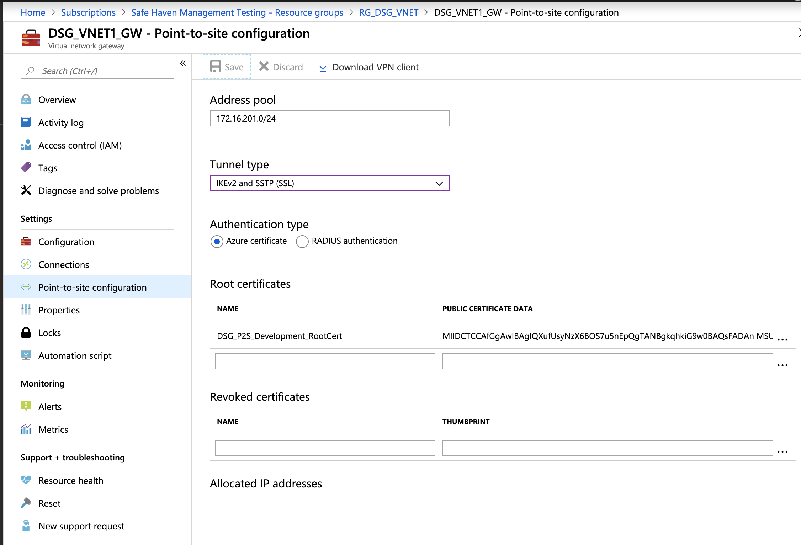
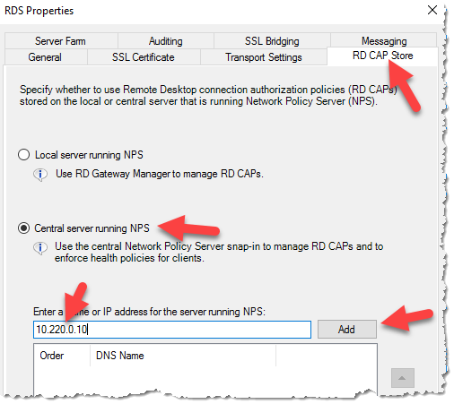
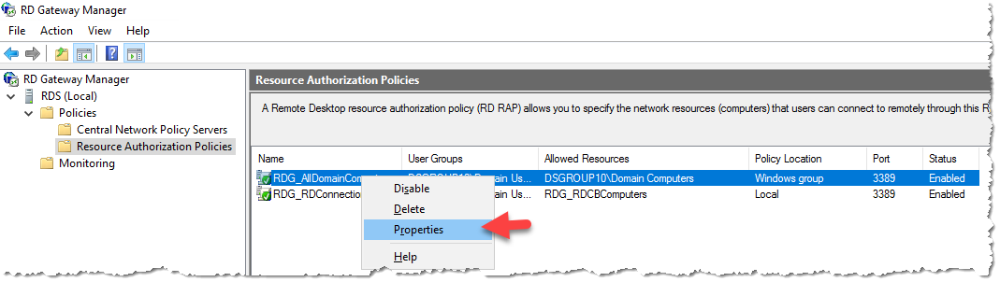
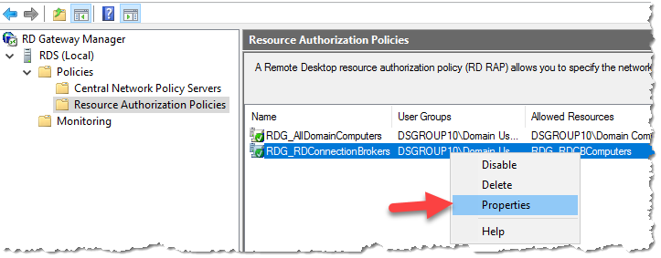

# Secure Research Environment Build Instructions
The following instructions will walk you through deploying a Secure Research Environment. This assumes the Safe Haven Management (SHM) environment has already been set up.

## Contents
1. [Prerequisites](#1.-Prerequisites)
2. [Define SRE configuration](#2.-Define-SRE-configuration)
3. [Prepare Safe Haven Management deployment](#3.-Prepare-Safe-Haven-Management-deployment)
4. [Deploy Virtual Network](#4.-Deploy-Virtual-Network)
5. [Deploy SRE Domain Controller](#5.-Deploy-SRE-Domain-Controller)
6. [Deploy Remote Desktop Service Environment](#6.-Deploy-Remote-Desktop-Service-Environment)
7. [Deploy Data Server](#7.-Deploy-Data-Server)
8. [Deploy Web Application Servers (Gitlab and HackMD)](#8.-Deploy-Web-Application-Servers-(Gitlab-and-HackMD))
9. [Deploy initial shared compute VM](#9.-Deploy-initial-shared-compute-VM)
10. [Apply network configuration](#10.-Apply-network-configuration)
11. [Run smoke tests on shared compute VM](#11.-Run-smoke-tests-on-shared-compute-VM)

## 1. Prerequisites
- An Azure subscription with sufficient credits to build the environment in
- PowerShell for Azure
  - Install [PowerShell v 6.0 or above](https://docs.microsoft.com/en-us/powershell/azure/install-az-ps?view=azps-2.2.0)
  - Install the Azure [PowerShell Module](https://docs.microsoft.com/en-us/powershell/azure/install-az-ps?view=azps-2.2.0&viewFallbackFrom=azps-1.3.0)
- Microsoft Remote Desktop
  - On Mac this can be installed from the [apple store](https://itunes.apple.com/gb/app/microsoft-remote-desktop-10/id1295203466?mt=12)
<!-- - Azure CLI (bash)
  - Install the [Azure CLI](https://docs.microsoft.com/en-us/cli/azure/install-azure-cli?view=azure-cli-latest) -->
<!-- - OpenSSL
  - Install using your package manager of choice -->


### Access to required Safe Haven Management resources
- You need to be a member of the relevant "Safe Haven `<shm-id>` Admins" Security Group, where `<shm-id>` is `test` for test and `production` for production. This will give you the following access:
  - Administrative access to the relevant Safe Haven Management Azure subscription
  - Administrative access to the relevant Safe Haven Management Active Directory Domain
  - Administrative access to the relevant Safe Haven Management VMs

### Download a client VPN certificate for the Safe Haven Management VNet
  - Navigate to the Safe Haven Management (SHM) KeyVault in the Safe Haven Management subscription via `Resource Groups -> RG_SHM_SECRETS -> kv-shm-<shm-id>`.
  - Once there open the "Certificates" page under the "Settings" section in the left hand sidebar.
  - Click on the certificate named `shm-vpn-client-cert`, click on the "current version" and click the "Download in PFX/PEM format" link.
  - To install, double click on the downloaded certificate, leaving the password field blank.
  - **Make sure to securely delete the "\*.pfx" certificate file after you have installed it.**
  -  This certificate will also allow you to connect via VPN to the DSG VNet once deployed.

- #### Configure a VPN connection to the Safe Haven Management VNet
  - Navigate to the Safe Haven Management (SHM) VNet gateway in the SHM subscription via `Resource Groups -> RG_SHM_VNET -> VNET_SHM_<shm-id>_GW`, where `<shm-id>` is defined in the config file. Once there open the "Point-to-site configuration page under the "Settings" section in the left hand sidebar (see image below).
  - Click the "Download VPN client" link at the top of the page to get the root certificate (VpnServerRoot.cer) and VPN configuration file (VpnSettings.xml), then follow the [VPN set up instructions](https://docs.microsoft.com/en-us/azure/vpn-gateway/point-to-site-vpn-client-configuration-azure-cert) using the Windows or Mac sections as appropriate.
  - On Windows you may get a "Windows protected your PC" pop up. If so, click `More info -> Run anyway`
  - On Windows do not rename the vpn client as this will break it
  - Note that on OSX double clicking on the root certificate may not result in any pop-up dialogue, but the certificate should still be installed. You can view the details of the downloaded certificate by highlighting the certificate file in Finder and pressing the spacebar. You can then look for the certificate of the same name in the login KeyChain and view it's details by double clicking the list entry. If the details match the certificate has been successfully installed.

    

  - Continue to follow the set up instructions from the link above, using SSTP (Windows) or IKEv2 (OSX) for the VPN type and naming the VPN connection "Safe Haven Management Gateway (`<shm-id>`)", where `<shm-id>` is defined in the config file.

### Access to required SRE resources
- Access to a new Azure subscription which the SRE will be deployed to
  - If a subscription does not exist, create one with the name `Secure Research Environment <SRE ID> (<shm-id>)`, picking an SRE ID that is not yet in use and setting `<shm-id>` to the value given in the config file.
  - Add an initial $3,000 for test and production sandbox environments and the project specific budget for production project environments
  - Give the relevant "Safe Haven `<shm-id>` Admins" Security Group **Owner** role on the new SRE subscription
- Access to a public routable domain name for the SRE and its name servers
  - This can be a top-level domain (eg. `dsgroup100.co.uk`) or a subdomain (eg. `sandbox.dsgroupdev.co.uk` or `sandbox.testb.dsgroupdev.co.uk`)
  - A DNS for this domain must exist in the `Safe Haven Domains` subscription, in the `RG_SHM_DNS_TEST` or `RG_SHM_DNS_PRODUCTION` resource group.
  - To create a new DNS zone:
    - From within the resource group click `"+" Add -> DNS Zone` and click "create"
    - Set the **Name** field to the SRE domain (eg. `sandbox.dsgroupdev.co.uk`)
    - Click "Review + create"
    - Once deployment is finished, click "Go to resource" to view the new Azure DNS zone
    - Copy the 4 nameservers in the "NS" record to the domain's DNS record
        - if this is a top-level domain, contact whoever registered the domain
        - if this is a subdomain of an existing Azure domain (eg. `sandbox.dsgroupdev.co.uk` then:
            - go to the DNS zone for the top-level domain in Azure
            - add a new NS record using the 4 nameservers you copied down above
            

### Deploying multiple SREs in parallel

**NOTE:** You can only deploy to **one SRE at a time** from a given computer as both the `Az` CLI and the `Az` Powershell module can only work within one Azure subscription at a time. For convenience we recommend using one of the Safe Haven deployment VMs on Azure for all production deploys. This will also let you deploy compute VMs in parallel to as many SREs as you have deployment VMs. See the [parallel deployment guide](../azure-vms/README-parallel-deploy-using-azure-vms.md) for details.


## 2. Define SRE configuration

The full configuration details for a new SRE are generated by defining a few "core" properties for the new SRE and the management environment in which it will be deployed.

### Core SHM configuration properties
The core properties for the relevant pre-existing Safe Haven Management (SHM) environment must be present in the `environment_configs/core` folder.
The following core SHM properties must be defined in a JSON file named `shm_<shm-id>_core_config.json`.

**NOTE:** The `netbiosName` fields must have a maximum length of 15 characters.

```json
{
    "subscriptionName": "Name of the Azure subscription the management environment is deployed in",
    "computeVmImageSubscriptionName": "Azure Subscription name for compute VM",
    "domain": "The fully qualified domain name for the management environment",
    "netbiosname": "A short name to use as the local name for the domain. This must be 15 characters or less",
    "shmId": "A short ID to identify the management environment",
    "name": "Safe Haven deployment name",
    "organisation": {
        "name": "Organisation name",
        "townCity": "Location",
        "stateCountyRegion": "Location",
        "countryCode": "e.g. GB"
    },
    "location": "The Azure location in which the management environment VMs are deployed",
    "ipPrefix": "The three octet IP address prefix for the Class A range used by the management environment. Use 10.0.0 for this unless you have a good reason to use another prefix."
}
```

### Core SRE configuration properties

The core properties for the new SRE environment must be present in the `environment_configs/core` folder.
The following core SRE properties must be defined in a JSON file named `sre_<sre-id>_core_config.json`.

```json
{
    "subscriptionName": "Name of the Azure subscription the secure research environment is deployed in",
    "sreId": "A short ID to identify the secure research environment. Ideally this should be 7 characters or less; if not it will be truncated in some places, but will otherwise not cause problems.",
    "shmId": "The short ID for the SHM segment to deploy against",
    "tier": "The data classification tier for the SRE. This controls the outbound network restrictions on the SRE and which mirror set the SRE is peered with",
    "domain": "The fully qualified domain name for the SRE",
    "netbiosname": "A short name to use as the local name for the domain. This must be 15 characters or less. If the first part of the domain is less than 15 characters, use this for the netbiosName",
    "ipPrefix": "The three octet IP address prefix for the Class A range used by the management environemnt",
    "rdsAllowedSources": "A comma-separated string of IP ranges (addresses or CIDR ranges) from which access to the RDS webclient is permitted. For Tier 0 and 1 this should be 'Internet'. For Tier 2 this should correspond to the any organisational networks (including guest networks) at the partner organisations where access should be permitted from (i.e. any network managed by the organsiation, such as EduRoam, Turing Guest, Turing Secure etc). For Tier 3 SREs, this should correspond to the RESTRICTED networks at the partner organisations. These should only permit connections from within meduim security access controlled physical spaces and from managed devices (e.g. Turing Secure). Using 'default' will use the default Turing networks.",
    "rdsInternetAccess": "Whether to allow outbound internet access from inside the remote desktop environment. Either 'Allow', 'Deny' or 'default' (for Tier 0 and 1 'Allow' otherwise 'Deny')",
    "computeVmImageType": "The name of the Compute VM image (most commonly 'Ubuntu')",
    "computeVmImageVersion": "The version of the Compute VM image (e.g. 0.1.2019082900)"
}
```

### SRE IP Address prefix

Each SRE must be assigned it's own unique IP address space, and it is very important that address spaces do not overlap in the environment as this will cause network faults. The address spaces use a private class A range and use a 21bit subnet mask. This provides ample addresses for a SRE and capacity to add additional subnets should that be required in the future.

### Generate full configuration for SRE
- Ensure you have the latest version of the Safe Haven repository from [https://github.com/alan-turing-institute/data-safe-haven](https://github.com/alan-turing-institute/data-safe-haven).
- Open a Powershell terminal and navigate to the top-level folder within the Safe Haven repository.
- Generate a new full configuration file for the new SRE using the following commands.
  - `Import-Module ./common_powershell/Configuration.psm1 -Force`
  - `Add-SreConfig -sreId <sre-id>`, where `<sre-id>` is a short string, e.g. `sandbox` for `sandbox.dsgroupdev.co.uk`
- A full configuration file for the new SRE will be created at `environment_configs/full/sre_<sre-id>_full_config.json`. This file is used by the subsequent steps in the SRE deployment.
- Commit this new full configuration file to the Safe Haven repository

## 3. Prepare Safe Haven Management deployment
- Ensure you have the latest version of the Safe Haven repository from [https://github.com/alan-turing-institute/data-safe-haven](https://github.com/alan-turing-institute/data-safe-haven).
- Open a Powershell terminal and navigate to the `secure_research_environment/sre_deploy_scripts/01_configure_shm_dc/` directory within the Safe Haven repository.
- Ensure you are logged into Azure within PowerShell using the command: `Connect-AzAccount`

### Clear out any remaining SRE data from previous deployments
**NOTE** Ensure that the SRE subscription is completely empty before running this script. If the subscription is not empty, confirm that it is not being used before deleting the resources
- Clear any remaining SRE data from the SHM by running `./Remove_SRE_Data_From_SHM.ps1 -sreId <SRE ID>`, where the SRE ID is the one specified in the config.

### Set up users and DNS
- Prepare SHM by running `./Prepare_SHM.ps1 -sreId <SRE ID>`, where the SRE ID is the one specified in the config
- This step also creates a KeyVault in the SRE subscription in `Resource Groups -> RG_SRE_SECRETS -> kv-shm-<shm-id>-sre-<SRE ID>`. Additional deployment steps will add secrets to this KeyVault and you will need to access some of these for some of the manual configiration steps later.

## 4. Deploy Virtual Network

### Create the virtual network
- Ensure you have the latest version of the Safe Haven repository from [https://github.com/alan-turing-institute/data-safe-haven](https://github.com/alan-turing-institute/data-safe-haven).
- Open a Powershell terminal and navigate to the `secure_research_environment/sre_deploy_scripts/02_create_vnet/` directory within the Safe Haven repository.
- Ensure you are logged into Azure within PowerShell using the command: `Connect-AzAccount`
- Run `./Create_VNET.ps1 -sreId <SRE ID>`, where the SRE ID is the one specified in the config
- The deployment will take around 20 minutes. Most of this is deploying the virtual network gateway.
- The VNet peerings may take a few minutes to provision after the script completes.

### Set up a VPN connection to the SRE
- In the **SRE subscription** open `Resource Groups -> RG_SRE_VNET -> VNET_SRE_<sre-id>_GW`
  - Select "**Point to Site Configuration**" from the left-hand navigation
  - Download the VPN client from the "Point to Site configuration" menu
    
  - Install the VPN on your PC and test. See the [Configure a VPN connection to the Safe Haven Management VNet](#Configure-a-VPN-connection-to-the-Safe-Haven-Management-VNet) section in the [Prerequisites](#Prerequisites) list above for instructions. You can re-use the same client certificate as used for the VPN to the management VNet gateway.

## 5. Deploy SRE Domain Controller
- Ensure you have the latest version of the Safe Haven repository from [https://github.com/alan-turing-institute/data-safe-haven](https://github.com/alan-turing-institute/data-safe-haven).
- Open a Powershell terminal and navigate to the `secure_research_environment/sre_deploy_scripts/03_create_dc/` directory within the Safe Haven repository
- Ensure you are logged into Azure within PowerShell using the command: `Connect-AzAccount`
- Run `./Setup_SRE_DC.ps1 -sreId <SRE ID>` script, where the SRE ID is the one specified in the config
- The deployment will take around 30 minutes. Most of this is running the setup scripts after creating the VM.


## 6. Deploy Remote Desktop Service Environment
### Create RDS VMs and perform initial configuration
- Ensure you have the latest version of the Safe Haven repository from [https://github.com/alan-turing-institute/data-safe-haven](https://github.com/alan-turing-institute/data-safe-haven).
- Open a Powershell terminal and navigate to the `secure_research_environment/sre_deploy_scripts/04_create_rds/` directory of the Safe Haven repository
- Ensure you are logged into Azure within PowerShell using the command: `Connect-AzAccount`
- Deploy and configure the RDS VMs by running `./Setup_SRE_RDS_Servers.ps1 -sreId <SRE ID>`, where the SRE ID is the one specified in the config
- The deployment will take around 20 minutes to complete.

### Install and configure RDS Environment and webclient
- Connect to the **RDS Gateway** via Remote Desktop client over the DSG VPN connection
- Login as the **domain** admin user (eg. `sretestsandboxadmin@sandbox.dsgroupdev.co.uk`) where the admin username is stored in the SRE KeyVault as `sre-<sre-id>-dc-admin-username` and the password as `sre-<sre-id>-dc-admin-password` (NB. all SRE Windows servers use the same admin credentials)+
- Open a PowerShell command window with elevated privileges - make sure to use the `Windows PowerShell` application, not the `Windows PowerShell (x86)` application. The required server managment commandlets are not installed on the x86 version.

#### Install RDS environment and webclient
- Run `C:\Installation\Deploy_RDS_Environment.ps1` (prefix the command with a leading `.\` if running from within the `C:\Installation` directory)
- This script will take about 20 minutes to run (this cannot be done remotely, as it needs to be run as a domain user but remote Powershell uses a local user)

#### Configure RDS to use SHM NPS server for client access policies
- In "Server Manager", open `Tools -> Remote Desktop Services -> Remote Desktop Gateway Manager`
  
- Right click the RDS server object and select "Properties"
  
- Select "RD CAP Store" tab
- Select the "Central Server Running NPS"
- Enter the IP address of the NPS within the management domain (this will be `10.<something>.0.248`, you can see it from the Azure portal)
- Set the "Shared Secret" to the value of the `sre-<sre-id>-nps-secret` in the SRE KeyVault.
  
- Click "OK" to close the dialogue box.

#### Set the security groups for access to session hosts
- Expand the RDS server object and select `Policies -> Resource Authorization Policies`
- Right click on "RDG_AllDomainControllers" and select "Properties`
  
- On the "User Groups" tab click "Add"
- Click "Locations" and select the management domain
- Enter the "SG" into the "Enter the object names to select" box and click on "Check Names" select the `SG <SRE-ID> Research Users`security group from the list.
  
- Click "OK" and the group will be added to the "User Groups" screen
  
- Click "OK" to exit the dialogue box
- Right click on "RDG_RDConnectionBrokers" policy and select "Properties"
  
- Repeat the process you did for the "RDG_AllDomainComputers" policy, again adding the `SG <SRE-ID> Research Users`security group from the list.

#### Increase the authorisation timeout to allow for MFA
- In "Server Manager", select `Tools -> Network Policy Server`
- Expand `NPS (Local) -> RADIUS Clients and Servers -> Remote RADIUS Servers` and double click on `TS GATEWAY SERVER GROUP`
  
- Highlight the server shown in the “RADIUS Server” column and click “Edit”
- Change to the “Load Balancing” tab and change the parameters to match the screen below
  
- Click “OK” twice and close “Network Policy Server” MMC

### Configuration of SSL on RDS Gateway
- Ensure you have the latest version of the Safe Haven repository from [https://github.com/alan-turing-institute/data-safe-haven](https://github.com/alan-turing-institute/data-safe-haven).
- Open a Powershell terminal and navigate to the `secure_research_environment/sre_deploy_scripts/04_create_rds/` directory of the Safe Haven repository
- Ensure you are logged into Azure within PowerShell using the command: `Connect-AzAccount`
- Run the `./CreateUpdate_Signed_Ssl_Certificate.ps1 -sreId <SRE ID> -emailAddress <email>`, where the SRE ID is the one specified in the config and the email address is one that you would like to be notified when certificate expiry is approaching.
- **NOTE:** This script should be run again whenever you want to update the certificate for this SRE.
- **Troubleshooting:** Let's Encrypt will only issue **5 certificates per week** for a particular host (e.g. `rdg-sre-testsan.sandbox.dsgroupdev.co.uk`). For production environments this should usually not be an issue. The signed certificates are also stored in the KeyVault for easy redeployment. However, if you find yourself needing to re-run this step without the KeyVault secret available, either to debug an error experienced in production or when redeploying a test environment frequently during development, you should run `./CreateUpdate_Signed_Ssl_Certificate.ps1 -dryRun $true` to use the Let's Encrypt staging server, which will issue certificates more frequently. However, these certificates will not be trusted by your browser, so you will need to override the security warning in your browser to access the RDS web client for testing.

### Test RDS deployment
- Connect to the **SHM Domain Controller** via Remote Desktop client over the VPN connection
- Login as the **domain** admin user (eg. `sretestsandboxadmin@sandbox.dsgroupdev.co.uk`) where the admin username is stored in the SRE KeyVault as `sre-<sre-id>-dc-admin-username` and the password as `sre-<sre-id>-dc-admin-password` (NB. all SRE Windows servers use the same admin credentials)+
- In the "Server Management" app, click `Tools -> Active Directory Users and Computers`
- Open the `Safe Haven Security Groups` OU
- Right click the `SG <sre-id> Research Users` security group and select "Properties"
- Click on the "Members" tab and click the "Add" button
- Enter the start of your name and click "Check names"
- Select your name and click "Ok"
- Click "Ok" again to exit the add users dialogue
- Launch a local web browser and go to `https://<rds-name>.<sre-id>.<safe haven domain>/RDWeb/webclient/` (eg. `https://rdg-sre-testsan.sandbox.dsgroupdev.co.uk/RDWeb/webclient/`) and log in.
    - **Troubleshooting** If you get a "404 resource not found" error when accessing the webclient URL, but get an IIS landing page when accessing `https://<rds-name>.<sre-id>.<safe haven domain>/`, it is likely that you missed the step of installing the RDS webclient.
        - Go back to the previous section and run the webclient installation step.
        - Once the webclient is installed, you will need to manually run the steps from the SSL certificate generation script to install the SSL certificate on the  webclient. Still on the RDS Gateway, run the commands below, replacing `<path-to-full-certificate-chain>` with the path to the `xxx_full_chain.pem` file in the `C:\Certificates` folder.
            - `Import-RDWebClientBrokerCert <path-to-full-certificate-chain>`
            - `Publish-RDWebClientPackage -Type Production -Latest`
    - **Troubleshooting** If you get an "unexpected server authentication certificate error", your browser has probably cached a previous certificate for this domain.
        - Do a [hard reload](https://www.getfilecloud.com/blog/2015/03/tech-tip-how-to-do-hard-refresh-in-browsers/) of the page (permanent fix)
        - OR open a new private / incognito browser window and visit the page.
- Once you have logged in, double click on the "Presentation server" app icon. You should receive an MFA request to your phone or authentication app. Once you have approved the sign in, you should see a remote Windows desktop.
    - **Troubleshooting** If you can log in to the initial webclient authentication but don't get the MFA request, then the issue is likely that the configuration of the connection between the SHM NPS server and the RDS Gateway server is not correct.
        - Ensure that the [SHM NPS server RADIUS Client configuration](dsg_build_instructions.md#configure-rds-to-use-shm-nps-server-for-client-access-policies) is using the **private** IP address of the RDS Gateway and **not** its public one.
        - Ensure the same shared secret from the `sre-<sre-id>-nps-secret` in the SRE KeyVault is used in **both** the SHM NPS server RADIUS Client configuration and the [SRE RDS Gateway RD CAP Store configuration](dsg_build_instructions.md#configure-rds-to-use-shm-nps-server-for-client-access-policies) (see previous sections for instructions).
    - **Troubleshooting** If you get a "We couldn't connect to the gateway because of an error" message, it's likely that the "Remote RADIUS Server" authentication timeouts have not been [increased as described in a previous section](dsg_build_instructions.md#increase-the-authorisation-timeout-to-allow-for-mfa). It seems that these are reset everytime the "Central CAP store" shared RADIUS secret is changed.
    - **Troubleshooting** If you get multiple MFA requests with no change in the "Opening ports" message, it may be that the shared RADIUS secret does not match on the SHM server and SRE RDS Gateway. It is possible that this may occur if the password is too long. We previously experienced this issue with a 20 character shared secret and this error went away when we reduced the length of the secret to 12 characters. We then got a "We couldn't connect to the gateway because of an error" message, but were then able to connect successfully after again increasing the authorisation timeout for the remote RADIUS server on the RDS Gateway.
- **NOTE:** The other apps will not work until the other servers have been deployed.


## 7. Deploy Data Server
### Create Dataserver VM
- Ensure you have the latest version of the Safe Haven repository from [https://github.com/alan-turing-institute/data-safe-haven](https://github.com/alan-turing-institute/data-safe-haven).
- Open a Powershell terminal and navigate to the `secure_research_environment/sre_deploy_scripts/02_create_vnet/` directory within the Safe Haven repository.
- Ensure you are logged into Azure within PowerShell using the command: `Connect-AzAccount`
- Run the `./Setup_Data_Server.ps1 -sreId <SRE ID>` script, where the SRE ID is the one specified in the config
- The deployment will take around 10 minutes to complete

## 8. Deploy Web Application Servers (Gitlab and HackMD)
- Note: Before deploying the Linux Servers ensure that you've allowed GitLab Community Edition to be programmatically deployed within the Azure Portal.
- Ensure you have the latest version of the Safe Haven repository from [https://github.com/alan-turing-institute/data-safe-haven](https://github.com/alan-turing-institute/data-safe-haven).
- Open a Powershell terminal and navigate to the `secure_research_environment/sre_deploy_scripts/06_create_web_application_servers/` directory of the Safe Haven repository.
- Ensure you are logged into Azure within PowerShell using the command: `Connect-AzAccount`
- Run the `./Create_Web_App_Servers.ps1 -sreId <SRE ID>` script, where the SRE ID is the one specified in the config
- The deployment will take a few minutes to complete

### Configure GitLab Server
- GitLab is fully configured by the `Create_Web_App_Servers.ps1` deployment script
- There is a built-in `root` user, whose password is stored in the SRE KeyVault (see SRE config file for KeyVault and secret names).
- You can test Gitlab independently of the RDS servers by connecting to `<sre-subnet-data-prefix>.151` and logging in with the full `username@<shm-domain-fqdn>` of a user in the `SG <sre-id> Research Users` security group.

### Configure HackMD Server
- HackMD is fully configured by the `Create_Web_App_Servers.ps1` deployment script
- You can test HackMD independently of the RDS servers by connecting to `<sre-subnet-data-prefix>.152:3000` and logging in with the full `username@<shm-domain-fqdn>` of a user in the `SG DSGROUP<sre-id> Research Users` security group.

## 9. Deploy initial shared compute VM
### [OPTIONAL] Create a custom cloud init file for the DSG if required
  - By default, compute VM deployments will use the `cloud-init-compute-vm-DEFAULT.yaml` configuration file in the `<data-safe-haven-repo>/environment_configs/cloud_init/` folder. This does all the necessary steps to configure the VM to work with LDAP log on etc.
  - If you require additional steps to be taken at deploy time while the VM still has access to the internet (e.g. to install some additional project-specific software), copy the default cloud init file to a file named `cloud-init-compute-vm-DSG-<sre-id>.yaml` in the same folder and add any additional required steps in the `DSG-SPECIFIC COMMANDS` block marked with comments.

### Configure or log into a suitable deployment environment
To deploy a compute VM you will need the following available on the machine you run the deployment script from:
  - The [Azure CLI](https://docs.microsoft.com/en-us/cli/azure/install-azure-cli)
  - [PowerShell Core v 6.0 or above](https://docs.microsoft.com/en-us/powershell/scripting/install/installing-powershell?view=powershell-6). **NOTE:** On Windows make sure to run `Windows Powershell 6 Preview` and **not** `Powershell` to run Powershell Core once installed.
- The [PowerShell Azure commandlet](https://docs.microsoft.com/en-us/powershell/azure/install-az-ps?view=azps-1.3.0)
- A bash shell (via the Linux or MacOS terminal or the Windows Subsystem for Linux)

### Deploy a compute VM
- Navigate to the folder in the safe haven repo with the deployment scripts at `<data-safe-haven-repo>/secure_research_environment/sre_deploy_scripts/07_deploy_compute_vms`
- Checkout the `master` branch using `git checkout master` (or the deployment branch for the DSG environment you are deploying to - you may need to run `git fetch` first if not using `master`)
- Ensure you have the latest changes locally using `git pull`
- Ensure you are authenticated in the Azure CLI using `az login` and then checking this has worked with `az account list`
- Open a Powershell terminal with `pwsh`
- Ensure you are authenticated within the Powershell `Az` module by running `Connect-AzAccount` within Powershell
- Run `git fetch;git pull;git status;git log -1 --pretty="At commit %h (%H)"` to verify you are on the correct branch and up to date with `origin` (and to output this confirmation and the current commit for inclusion in the deployment record).
- Deploy a new VM into an SRE environment using `./Create_Compute_VM.ps1 -sreId <SRE ID>`, where the SRE ID is the one specified in the config
- You will also be prompted for the VM size (optional) and the desired last octet of the IP address (the first machine deployed should use `160` here)
  - The initial shared VM should be deployed with the last octet `160`
  - The convention is that subsequent CPU-based VMs are deployed with the next unused last octet in the range `161` to `179` and GPU-based VMs are deployed with the next unused last octet between `180` and `199`.
- After deployment, copy everything from the `git fetch;...` command and its output to the command prompt returned after the VM deployment and paste this into the deployment log (e.g. a Github issue used to record VM deployments for a SRE or set of SREs)

### Troubleshooting Compute VM deployments
- Click on the VM in the SRE subscription under the `RG_DSG_COMPUTE` respource group. It will have the last octet of its IP address at the end of its name.
- Scroll to the bottom of the VM menu on the left hand side of the VM information panel
- Activate boot diagnostics on the VM and click save. You need to stay on that screen until the activation is complete.
- Go back to the VM panel and click on the "Serial console" item near the bottom of the VM menu on the left habnd side of the VM panel.
- If you are not prompted with `login:`, hit enter until the prompt appears
- Enter the username from the `<sre-id>-dsvm-admin-password` secret in the DSG KeyVault.
- Enter the password from the `<sre-id>-dsvm-admin-password` secret in the DSG KeyVault.
- To validate that our custom `cloud-init.yaml` file has been successfully uploaded, run `sudo cat /var/lib/cloud/instance/user-data.txt`. You should see the contents of the `secure_research_environment/azure-vms/environment_configs/cloud-init-compute-vm-DSG-<sre-id>.yaml` file in the Safe Haven git repository.
- To see the output of our custom `cloud-init.yaml` file, run `sudo tail -n 200 /var/log/cloud-init-output.log` and scroll up.

## 10. Apply network configuration
- Ensure you have the latest version of the Safe Haven repository from [https://github.com/alan-turing-institute/data-safe-haven](https://github.com/alan-turing-institute/data-safe-haven).
- Change to the `secure_research_environment/sre_deploy_scripts/08_apply_network_configuration/` directory of the Safe Haven repository
- Ensure you are logged into Azure within PowerShell using the command: `Connect-AzAccount`
- Run the `./Apply_Network_Configuration.ps1` script, providing the SRE ID when prompted

## 11. Run smoke tests on shared compute VM
These tests should be run **after** the network lock down and peering the DSG and mirror VNets. They are automatically uploaded to the compute VM during the deployment step.

To run the smoke tests:
- Connect to a **remote desktop** on the Shared VM using the "Shared VM (Desktop)" app
- Open a terminal session
- Change to the tests folder using `cd ~/smoke_test/tests`
- Follow the instructions in the `README.md` file. These should involve running `./run_all_tests.sh`
- If all test results are expected you are done! Otherwise, contact REG for help diagnosing test failures.

## Server list
- The following servers are created as a result of these instructions:
  - DC-SRE-`<sre-id>` (domain controller)
  - DSV-SRE-`<sre-id>` (data server)
  - HACKMD-SRE-`<sre-id>` (HackMD server)
  - GITLAB-SRE-`<sre-id>` (GitLab server)
  - RDG-SRE-`<sre-id>` (Remote Desktop Gateway)
  - APP-SRE-`<sre-id>` (Remote Desktop app server)
  - DKP-SRE-`<sre-id>` (Remote Desktop desktop server)
  - An initial shared compute VM (at IP address `<data-subnet-prefix>.160`)
