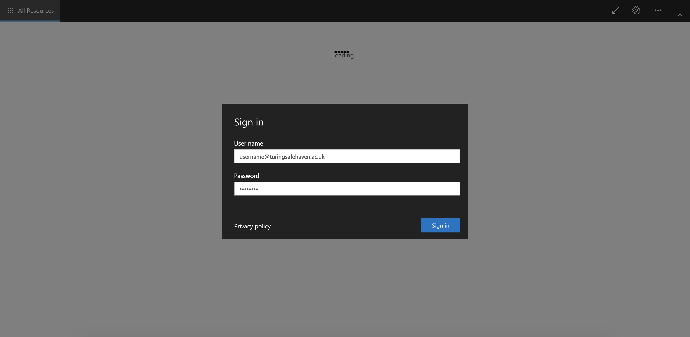
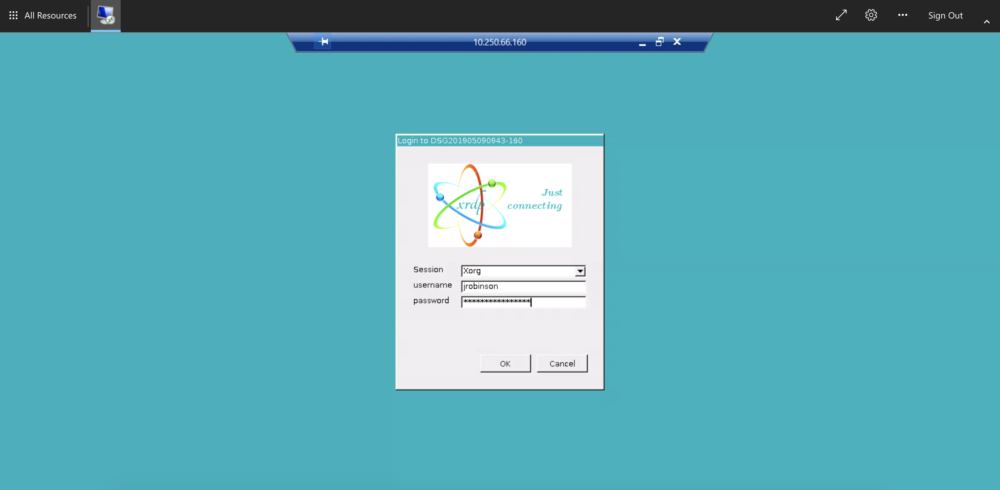
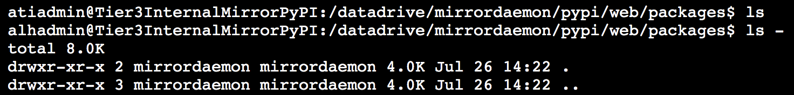

Troubleshooting Compute VM deployments
======================================

## Login failures

There are several different ways in which logging into the environment can fail. Here we go through the login procedure and discuss possible problems at each step

### 1. Certificate expiry before getting to the environment


#### Possible problems and solutions
The expired certificate can be ignored but login will not be possible.

#### Replace the SSL certificate with a new one
- Ensure you have [Certbot](https://certbot.eff.org/) installed. This required using a Mac or Linux computer.

- Ensure you have the latest version of the Safe Haven repository from [https://github.com/alan-turing-institute/data-safe-haven](https://github.com/alan-turing-institute/data-safe-haven).

- Open a Powershell terminal and navigate to the `secure_research_environment/sre_deploy_scripts/04_create_rds/` directory of the Safe Haven repository

- Ensure you are logged into the Azure within PowerShell using the command: `Connect-AzAccount`

- Run the `./CreateUpdate_Signed_Ssl_Certificate.ps1` script, providing the SRE ID when prompted

### 2. Failure when logging into the environment via web browser



#### Possible problems and solutions
1. User cannot progress pass this screen
- Check user credentials, password may need to be reset.


### 3. Failure when authenticating with the Shared VM or presentation server


#### Possible problems and solutions
1. User never gets the MFA prompt on their phone (app or phone call)
- Check that the user phone number is correctly specified (Microsoft expects the format to be +44 07891234567)

### 4. Failure when logging into the Shared VM
If users can get to the login screen:



... but then see this error message:


there are a couple of possible causes.

#### Possible problems and solutions
1. the username or password was incorrectly entered
- Confirm that the username and password have been correctly typed
- Confirm that there are no unsupported special characters in the password
- Reset the account if there is no other solution

2. the computer is unable to communicate with the login server
- This can happen for a variety of reasons (DNS problems, broken services on the compute VM etc.)
- Run the script under `sre_deploy_scripts/07_deploy_compute_vms/Run_Remote_Diagnostics.ps1`, providing the group and last IP octet of the problematic compute VM
- You should see output like the following:

```
PS /home/atiadmin/data-safe-haven/secure_research_environment/sre_deploy_scripts/07_deploy_compute_vms> ./Run_Remote_Diagnostics.ps1 -sreId 2 -ipLastOctet 160

Name                                     Account                                           SubscriptionName                                 Environment                                      TenantId
----                                     -------                                           ----------------                                 -----------                                      --------
DSG Template Testing (0c126bf5-366e-4... jrobinson@turing.ac.uk                            DSG Template Testing                             AzureCloud                                       4395f4a7-e455-4f95-8a9f-1fbaef6384f9
 - Finding VM with IP 10.250.10.160
 - Running diagnostic scripts on VM DSG201906181415-160

Code          : ProvisioningState/succeeded
Level         : Info
DisplayStatus : Provisioning succeeded
Message       : Enable succeeded:
                [stdout]
                Checking LDAP connectivity
                Testing LDAP search...
                LDAP search succeeded: found user 'dsg2-dsvm-ldap'.
                LDAP SEARCH RESULT:
                dn: CN=DSGROUP2 DSVM LDAP,OU=Safe Haven Service Accounts,DC=turingsafehaven,DC
                 =ac,DC=uk
                objectClass: top
                objectClass: person
                objectClass: organizationalPerson
                objectClass: user
                cn: DSGROUP2 DSVM LDAP
                description: DSGROUP2 DSVM LDAP
                distinguishedName: CN=DSGROUP2 DSVM LDAP,OU=Safe Haven Service Accounts,DC=tur
                 ingsafehaven,DC=ac,DC=uk
                instanceType: 4
                whenCreated: 20190613112421.0Z
                whenChanged: 20190617164000.0Z
                displayName: DSGROUP2 DSVM LDAP
                uSNCreated: 610254
                memberOf: CN=SG Data Science LDAP Users,OU=Safe Haven Security Groups,DC=turin
                 gsafehaven,DC=ac,DC=uk
                uSNChanged: 623511
                name: DSGROUP2 DSVM LDAP
                objectGUID:: 6QVuwb4k50+Q9+srCw/1ww==
                userAccountControl: 66048
                badPwdCount: 0
                codePage: 0
                countryCode: 0
                badPasswordTime: 0
                lastLogoff: 0
                lastLogon: 132053410870905210
                pwdLastSet: 132048986610646973
                primaryGroupID: 513
                objectSid:: AQUAAAAAAAUVAAAAgHv/rrok4PlnFgf+wwUAAA==
                accountExpires: 9223372036854775807
                logonCount: 4
                sAMAccountName: dsg2-dsvm-ldap
                sAMAccountType: 805306368
                userPrincipalName: dsg2-dsvm-ldap@dsgroup2.co.uk
                objectCategory: CN=Person,CN=Schema,CN=Configuration,DC=turingsafehaven,DC=ac,
                 DC=uk
                dSCorePropagationData: 16010101000000.0Z
                lastLogonTimestamp: 132052632008997342

                [stderr]

Time          :


Code          : ProvisioningState/succeeded
Level         : Info
DisplayStatus : Provisioning succeeded
Message       : Enable succeeded:
                [stdout]
                ddress:	127.0.0.53#53

                Non-authoritative answer:
                Name:	SHMDC1.turingsafehaven.ac.uk
                Address: 10.251.0.250
                Name resolution working.
                Testing /etc/systemd/resolved.conf
                #  This file is part of systemd.
                #
                #  systemd is free software; you can redistribute it and/or modify it
                #  under the terms of the GNU Lesser General Public License as published by
                #  the Free Software Foundation; either version 2.1 of the License, or
                #  (at your option) any later version.
                #
                # Entries in this file show the compile time defaults.
                # You can change settings by editing this file.
                # Defaults can be restored by simply deleting this file.
                #
                # See resolved.conf(5) for details

                [Resolve]
                #DNS=
                #FallbackDNS=
                #Domains=
                #LLMNR=no
                #MulticastDNS=no
                #DNSSEC=no
                #Cache=yes
                #DNSStubListener=yes
                Updating /etc/systemd/resolved.conf
                #  This file is part of systemd.
                #
                #  systemd is free software; you can redistribute it and/or modify it
                #  under the terms of the GNU Lesser General Public License as published by
                #  the Free Software Foundation; either version 2.1 of the License, or
                #  (at your option) any later version.
                #
                # Entries in this file show the compile time defaults.
                # You can change settings by editing this file.
                # Defaults can be restored by simply deleting this file.
                #
                # See resolved.conf(5) for details

                [Resolve]
                DNS=
                FallbackDNS=
                Domains=turingsafehaven.ac.uk
                #LLMNR=no
                #MulticastDNS=no
                #DNSSEC=no
                #Cache=yes
                #DNSStubListener=yes
                Restarting systemd-resolved nameservice
                # This file is managed by man:systemd-resolved(8). Do not edit.
                #
                # This is a dynamic resolv.conf file for connecting local clients to the
                # internal DNS stub resolver of systemd-resolved. This file lists all
                # configured search domains.
                #
                # Run "systemd-resolve --status" to see details about the uplink DNS servers
                # currently in use.
                #
                # Third party programs must not access this file directly, but only through the
                # symlink at /etc/resolv.conf. To manage man:resolv.conf(5) in a different way,
                # replace this symlink by a static file or a different symlink.
                #
                # See man:systemd-resolved.service(8) for details about the supported modes of
                # operation for /etc/resolv.conf.

                nameserver 127.0.0.53
                options edns0
                search turingsafehaven.ac.uk reddog.microsoft.com
                Testing /etc/resolv.conf
                # This file is managed by man:systemd-resolved(8). Do not edit.
                #
                # This is a dynamic resolv.conf file for connecting local clients to the
                # internal DNS stub resolver of systemd-resolved. This file lists all
                # configured search domains.
                #
                # Run "systemd-resolve --status" to see details about the uplink DNS servers
                # currently in use.
                #
                # Third party programs must not access this file directly, but only through the
                # symlink at /etc/resolv.conf. To manage man:resolv.conf(5) in a different way,
                # replace this symlink by a static file or a different symlink.
                #
                # See man:systemd-resolved.service(8) for details about the supported modes of
                # operation for /etc/resolv.conf.

                nameserver 127.0.0.53
                options edns0
                search turingsafehaven.ac.uk reddog.microsoft.com
                /etc/resolv.conf is currently pointing to ../run/systemd/resolve/stub-resolv.conf
                Resetting /etc/resolv.conf symlink
                # This file is managed by man:systemd-resolved(8). Do not edit.
                #
                # This is a dynamic resolv.conf file for connecting local clients directly to
                # all known uplink DNS servers. This file lists all configured search domains.
                #
                # Third party programs must not access this file directly, but only through the
                # symlink at /etc/resolv.conf. To manage man:resolv.conf(5) in a different way,
                # replace this symlink by a static file or a different symlink.
                #
                # See man:systemd-resolved.service(8) for details about the supported modes of
                # operation for /etc/resolv.conf.

                nameserver 10.250.8.250
                nameserver 8.8.8.8
                search turingsafehaven.ac.uk reddog.microsoft.com
                /etc/resolv.conf is currently pointing to /run/systemd/resolve/resolv.conf
                NS LOOKUP RESULT:
                Server:		10.250.8.250
                Address:	10.250.8.250#53

                Non-authoritative answer:
                Name:	SHMDC1.turingsafehaven.ac.uk
                Address: 10.251.0.250
                Name resolution working.

                [stderr]

Time          :


Code          : ProvisioningState/succeeded
Level         : Info
DisplayStatus : Provisioning succeeded
Message       : Enable succeeded:
                [stdout]
                Checking realm membership
                Testing current realms...
                Currently a member of realm: 'turingsafehaven.ac.uk'. No need to rejoin.
                REALM LIST RESULT:
                turingsafehaven.ac.uk
                  type: kerberos
                  realm-name: TURINGSAFEHAVEN.AC.UK
                  domain-name: turingsafehaven.ac.uk
                  configured: kerberos-member
                  server-software: active-directory
                  client-software: sssd
                  required-package: sssd-tools
                  required-package: sssd
                  required-package: libnss-sss
                  required-package: libpam-sss
                  required-package: adcli
                  required-package: samba-common-bin
                  login-formats: %U
                  login-policy: allow-permitted-logins
                  permitted-logins:
                  permitted-groups:

                [stderr]

Time          :


Code          : ProvisioningState/succeeded
Level         : Info
DisplayStatus : Provisioning succeeded
Message       : Enable succeeded:
                [stdout]
                Checking SSSD status
                Testing sssd status...
                SSSD service is working. No need to restart.
                SSSD STATUS RESULT:
                ● sssd.service - System Security Services Daemon
                   Loaded: loaded (/lib/systemd/system/sssd.service; enabled; vendor preset: enabled)
                   Active: active (running) since Thu 2019-06-20 10:50:08 BST; 1 day 3h ago
                 Main PID: 38795 (sssd)
                    Tasks: 4 (limit: 8289)
                   CGroup: /system.slice/sssd.service
                           ├─38795 /usr/sbin/sssd -i --logger=files
                           ├─38824 /usr/lib/x86_64-linux-gnu/sssd/sssd_be --domain turingsafehaven.ac.uk --uid 0 --gid 0 --logger=files
                           ├─38827 /usr/lib/x86_64-linux-gnu/sssd/sssd_nss --uid 0 --gid 0 --logger=files
                           └─38828 /usr/lib/x86_64-linux-gnu/sssd/sssd_pam --uid 0 --gid 0 --logger=files

                Jun 21 10:50:08 DSG201906181415-160 sssd[38795]: tkey query failed: GSSAPI error: Major = Unspecified GSS failure.  Minor code may provide more information, Minor = Server not found in Kerberos database.
                Jun 21 10:50:08 DSG201906181415-160 sssd[38795]: tkey query failed: GSSAPI error: Major = Unspecified GSS failure.  Minor code may provide more information, Minor = Server not found in Kerberos database.
                Jun 21 10:50:08 DSG201906181415-160 sssd[38795]: tkey query failed: GSSAPI error: Major = Unspecified GSS failure.  Minor code may provide more information, Minor = Server not found in Kerberos database.
                Jun 21 10:50:08 DSG201906181415-160 sssd[38795]: tkey query failed: GSSAPI error: Major = Unspecified GSS failure.  Minor code may provide more information, Minor = Server not found in Kerberos database.
                Jun 21 10:50:08 DSG201906181415-160 sssd[38795]: tkey query failed: GSSAPI error: Major = Unspecified GSS failure.  Minor code may provide more information, Minor = Server not found in Kerberos database.
                Jun 21 11:02:38 DSG201906181415-160 adcli[8817]: GSSAPI client step 1
                Jun 21 11:02:38 DSG201906181415-160 adcli[8817]: GSSAPI client step 1
                Jun 21 11:02:38 DSG201906181415-160 adcli[8817]: GSSAPI client step 1
                Jun 21 11:02:38 DSG201906181415-160 adcli[8817]: GSSAPI client step 2
                Jun 21 14:24:55 DSG201906181415-160 sssd[38827]: Enumeration requested but not enabled

                [stderr]

Time          :

Safe Haven Managment (1814d074-10fe-4... jrobinson@turing.ac.uk                            Safe Haven Managment                             AzureCloud                                       4395f4a7-e455-4f95-8a9f-1fbaef6384f9
```

## Package installation from package mirrors not possible
If it is not possible to install packages from the package mirrors then this may be for one of the following reasons:

### 1. Internal mirror does not have the required package
To diagnose this, log into the `Internal` mirror using the Serial Console through the `Azure` portal.
Check the packages directory (ie. `/datadrive/mirrordaemon/pypi/web/packages` for PyPI or `/datadrive/mirrordaemon/www/cran` for CRAN)



If this is missing the packages that you need, then try to [force a mirror update](#Forcing-a-mirror-update).


### Forcing a mirror update
Rebooting the `External` mirrors will trigger the following actions:

1. Synchronisation of the external mirror with the remote, internet repository (a `pull` update)
2. Synchronisation of the internal mirror with the external mirror (a `push` update)

If the problem has been caused by missing packages on the internal mirror, this should solve it.
