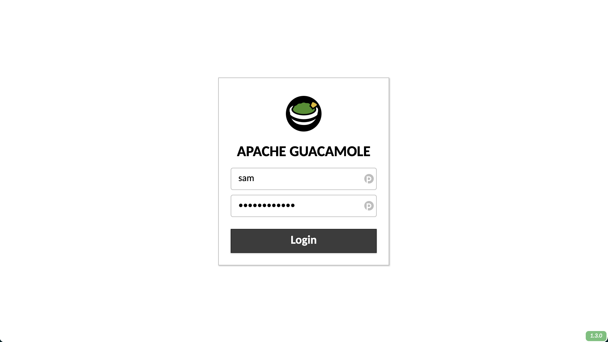
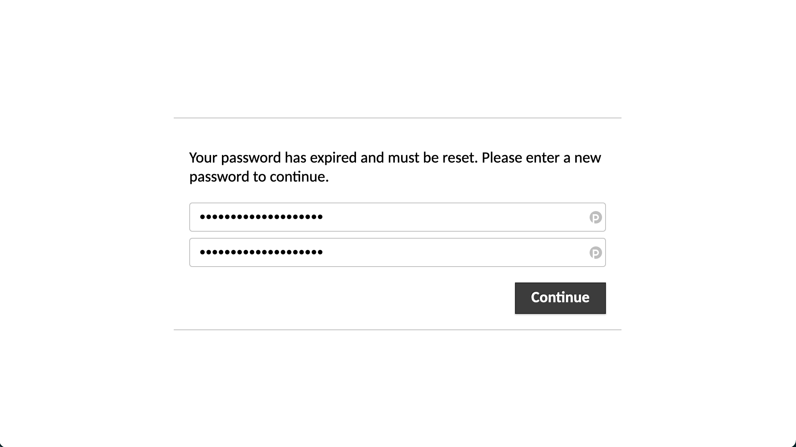
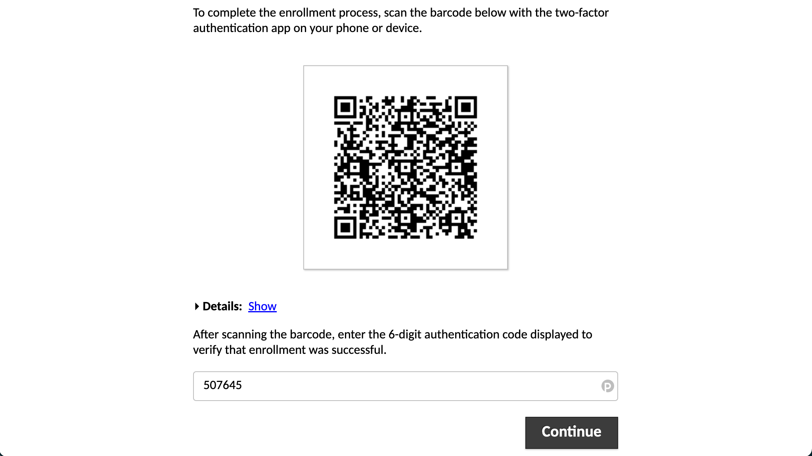
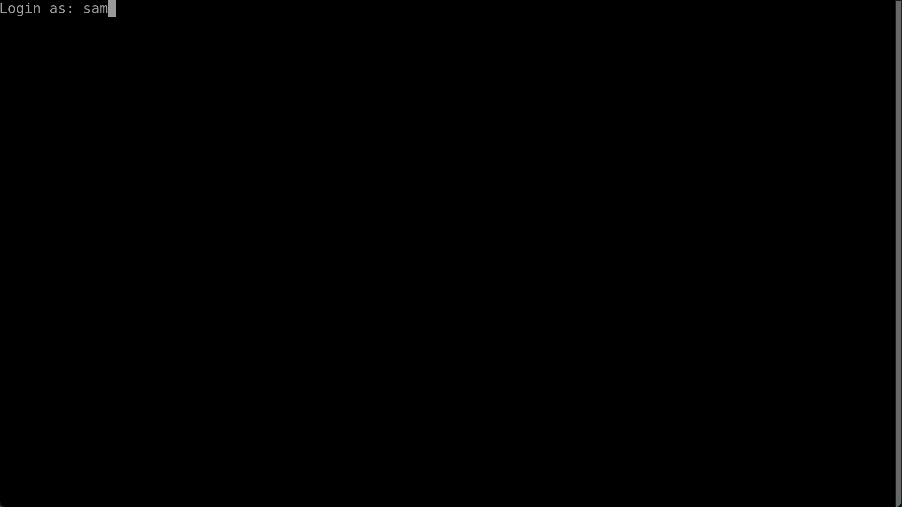
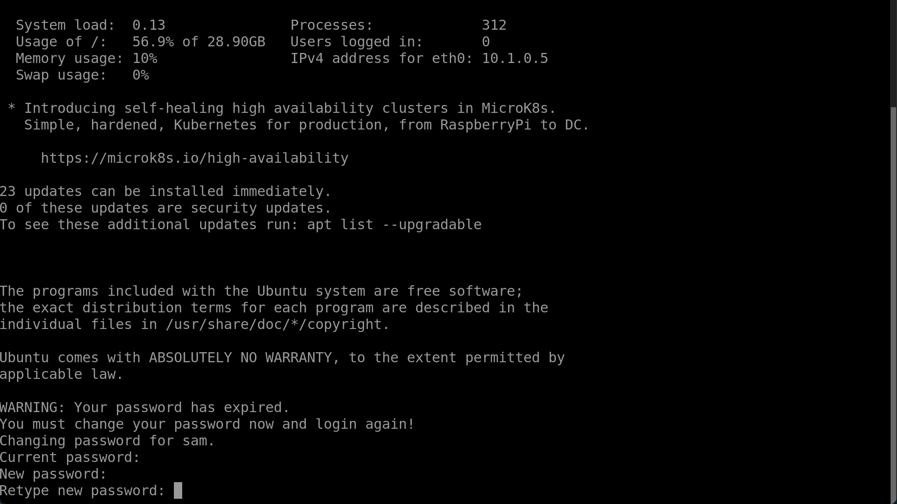
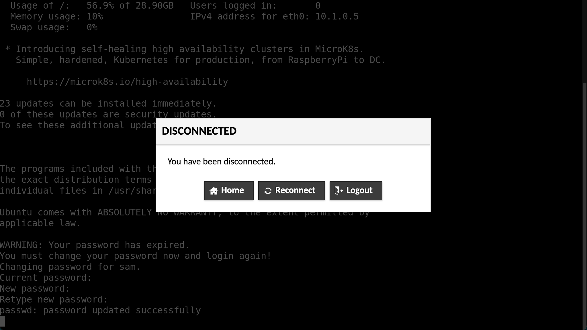

# Tier 1

A light-weight, stand-alone environment for working with private data.

## 🤔 What is Tier 1

This environment is inspired by, and draws on, the [Data safe havens in the
cloud](https://www.turing.ac.uk/research/research-projects/data-safe-havens-cloud)
project. That project has developed policy and processes to deploy research
environments on the cloud that are secure enough to handle sensitive data yet
flexible enough to host productive data-science projects.

As part of this project a series of data security tiers numbered 0–4 were
established. Tiers 2 and above cover sensitive data, and tier 0 covers public,
non-sensitive data. That leaves tier 1 data which is not sensitive, but we may
still wish to keep private. For example, we might not be ready to share the data
or might want to keep it secret for a competitive advantage.

Tier 1 (and tier 0) data therefore do not require a safe haven and the
restrictions of a safe haven might become frustrating. However, there is still
value in having a reasonably secure, collaborative, flexible environment when
working with tier 1 data. The aim of this project is therefore to take the
features of the safe haven we like and include them in a light-weight,
stand-alone and more permissive environment more suitable for non-sensitive
data.

> ⚠️ Important
>
> This environment is not suitable for work involving sensitive or personal
> data. It is completely possible for someone to extract the private data from
> the environment, whether intentionally, accidentally or through coercion. In
> particular, users can copy/paste to and from the remote machine and make
> outbound internet connections.

## 🚀 Features

- 🚅 Quick and easy to deploy (leveraging [Terraform](https://www.terraform.io/)
  and [Ansible](https://www.ansible.com/))
- 🥑 [Guacamole](https://guacamole.apache.org/) for remote desktop in a browser
- 🔐 Two factor authentication
- 🤖 Automated account creation and deletion
- 🖥️ Configurable Ubuntu VM pre-loaded with programming/data-science packages
- ⛰️ Read-only filesystem for input data
- 🚪 Read/write filesystem to easily extract outputs
- 🤝 Shared working directory backed (optionally) by SSD storage for
  collaborative work
- 🌐 Bring your own domain
- 🔑 Automatic SSL/TLS configuration using [Let's
  Encrypt](https://letsencrypt.org/) and [Traefik](https://traefik.io/)
- 🤝 Permissively licensed (you are free to copy, use and modify this code as
  well as to merge it with your own)

## 🏗️ How to deploy

### 📦 Requirements and prerequisites

Before you start, you will need to install some dependencies,

- [Azure CLI](https://docs.microsoft.com/en-us/cli/azure/install-azure-cli)
- [Terraform](https://learn.hashicorp.com/tutorials/terraform/install-cli)
- [Ansible](https://docs.ansible.com/ansible/latest/installation_guide/intro_installation.html)

You will also need,

- A domain where you are able to modify or create new DNS records

And ideally

- An email address to receive [Let's Encrypt](https://letsencrypt.org/)
  certificate expiry alerts
- An email account with SMTP access to send users their initial login
  credentials

### 🤖 Deploy the infrastructure with Terraform

Make sure you are authenticated with Azure CLI

```
$ az login
```

Change to the terraform directory

```
$ cd terraform
```

Initialise terraform

```
$ terraform init
```

Complete the appropriate variables in
[`terraform.tfvars`](terraform/terraform.tfvars). These should be fairly
self-explanatory. If you do not complete any required variables you will be
prompted to enter them in the command line when running Terraform.

Plan your deployment

```
$ terraform plan -out myplan
```

Check the output to ensure the changes make sense. If all is well you can now
apply the plan with

```
$ terraform apply myplan
```

Terraform will print a message giving the address of the name servers of the
Azure DNS Zone for your deployment. You will need to add these addresses as NS
records to your domain (the same domain that your specified in
[`terraform.tfvars`](terraform/terraform.tfvars)). This way requests to your
domain will be forwarded to the DNS managed by terraform.

### ⚙️ Configure the virtual machines with Ansible

Change to the ansible directory

```
$ cd ../ansible
```

Terraform will have written some files to this directory,

- `inventory.yaml` - The Ansible inventory, which tells Ansible how to connect to
  the virtual machines
- `terraform_vars.yaml` - Some variables exported for Terraform that will be used
  by Ansible
- `{dsvm,guacamole}_admin_id_rsa.pem` - The private SSH keys for the DSVM and
  Guacamole machines respectively

Ensure the required Ansible roles and collections are installed

```
$ ansible-galaxy install -r requirements.yaml
```

If you want to use [Let's Encrypt](https://letsencrypt.org/) to generate SSL
certificates automatically (highly recommended!) open
[`host_vars/guacamole.yaml`](ansible/host_vars/guacamole.yaml) and change
`lets_encrypt` to `true` and `lets_encrypt_email` to a suitable email address.
This address will receive warnings if your certificates are due to expire and
have not been updated (which should happen automatically).

Enter a password for the Postgres database as the value of the key
`guac_db_password` in
[`host_vars/guacamole.yaml`](ansible/host_vars/guacamole.yaml).

Configure the Guacamole and DSVM machines

```
$ ansible-playbook -i inventory.yaml main.yaml
```

## 👥 Manage users with Ansible

Users are configured in [`user_vars.yaml`](ansible/user_vars.yaml). If you want
the user management role to automatically email users their initial login
credentials, complete enter your email's SMTP settings into the `email` dict.

If you also want to write the initial passwords to a file on your local machine,
change `force_write_initial_passwords` to `yes`.

To declare users that should exist (this can be both existing and new users),
add their name, username and email address to the `users` dict following the
example.

To declare users that should not exist, add their username to the
`users_deleted` dict.

To create or remove users run

```
$ ansible-playbook -i inventory.yaml manage_users.yaml
```

If you have configured SMTP settings, newly created users will be send their
initial credentials from that email address. If the Guacamole and Linux
credentials are written to file they can be found in `guac_new_users.yaml` and
`new_users.yaml` respectively.

## ↕️ Resizing

To change the size of either of the virtual machines, for example to handle an
increased number of users or support GPU computing, you can simply update the
Terraform configuration.

Open [`terraform/terraform.tfvars`](terraform/terraform.tfvars) and edit the
dict `vm_sizes`. `guacamole` defines the size of the Guacamole VM and `dsvm`
defines the size of the DSVM. See the [Azure
documentation](https://docs.microsoft.com/en-us/azure/virtual-machines/sizes)
for a list of possible values. Ensure that your selected VM size is available in
your selected location (`location` in
[`terraform/terraform.tfvars`](terraform/terraform.tfvars)).

You can apply the new VM sizes using the plan/apply workflow
[above](#-deploy-the-infrastructure-with-terraform). Plan your changes using
`terraform plan -out resizeplan` and ensure that the changes printed to your
console are what you expect. You can then apply the changes with `terraform
apply resizeplan`.

## 💣 Tear down the environment

To tear down all of the resources you have deployment, ensure you are in the
terraform directory and run

```
$ terraform destroy
```

## 📖 User guide

### 🥑 Using Guacamole

See the [Guacamole user
guide](https://guacamole.apache.org/doc/gug/using-guacamole.html). Note that
file transfer is disabled by default.

### 🌱 First login

Before your first login, you will receive two sets of credentials. The 'Web
Portal' credentials are for connecting to the Gaucamole portal. After you have
logged in to Guacamole you will be able to select a SSH (text based) or RDP
(graphical desktop) interface to the virtual machine.

You will use the 'VM credentials' to authenticate with the virtual machine
whether using the SSH or RDP connection.

When you have both sets of credentials, open your browser and navigate to the
Guacamole portal and enter your username and password.



You will be asked to create a new password. Enter your new, secure password into
the text boxes and click 'continue'.



When you click 'continue' you will be taken to the multi-factor authentication
setup. **However**, at this point you must refresh the page and login again with
your **new** password.

After you login with your new password, you will again be directed to setup
multi-factor authentication. Scan the QR code using an authenticator app such as
[andOTP](https://github.com/andOTP/andOTP). Produce a one time password, enter
it into the text box and click 'continue'.



You will now be taken to the Guacamole home page and presented with the
available connections, 'DSVM RDP' and 'DSVM SSH'. For your first login, you
**must** use the SSH connection to be able to reset your vm password. Click on
the 'DSVM SSH' connection.

Enter your vm username and press enter.



Next, enter your vm password and press enter.


You will be prompted to change your vm password. Enter the current password, and
press enter. Then enter your new, secure password and press enter. Repeat your
new password to confirm it is correct.



If you successfully update your password, the message `passwd: password updated
successfully` will be printed and you will be disconnected. Click on 'Home' to
go back to the Guacamole home page.



You will now be able to connect to the vm in either an SSH or RDP connection
using your new vm password.
